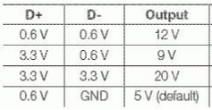
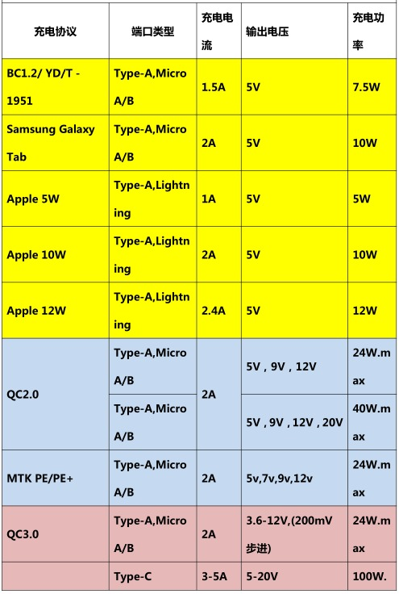

# **通用USB充电器（快充）说明**

一、快充的意义：

USB得到广泛普及是因为其能够为外围设备供电。USB孕育于上世纪90年代中期，最初的目的是将外部设备（例如键盘、鼠标、打印机、外置驱动器等）
 连接至计算机。随着越来越多的各种便携式设备受到青睐，也同样需要为其供电。
 利用数据传输连接器供电的能力使得USB在便携式市场具有直接而显著的优势。在2007年第一个电池充电规范颁布之前，尝试为电池充电本质上是一种冒险——结果非常难以预测。
 2009年4月，全球移动通信系统协会(GSMA)联合OTMP(手机开放组织联盟)17家移动运营商和制造商宣布实施跨行业的通用充电器标准，此标准采纳了USB-IF的micro-USB接口作为手机数据和充电的统一接口，并采纳USB-IF的BatteryCharging规范作为充电规范。USB-IF公布了BC1.1版的电池充电规范，到2010年BC1.2版也正式发布。即使有BC1.2规范可循，有些电子设备制造商仍然为其专用充电器开发定制协议（例如Apple）。当您将这样的设备连接至完全符合BC1.2规范的充电端口时，可能仍然会产生报错消息：

 “Chargingisnotsupportedwiththisaccessory.”（不支持该附件充电）。
 直到目前给智能设备充电（包括手机，平板电脑，蓝牙设备）等，在国际上还没有统一的强制性的标准出台，各个厂家都有着自己的定义，当前以苹果，三星，及其部分国内的安卓机为代表，有着自已的定义的充电规范，存在互不兼容的情况。而伴随着大电池容量的智能设备增加，有些设备的电容容量大于了3000mA/H,平板电脑有些达到10000mA/H以上。采用Type-A及MicroA/B接口的手机受限于USB2.0标准的影响，充电电流限制在1.5A以下，接口允许的最大电流为1.8A。各手机厂家自定义数据线可以将电流提升到2A，但当电流大于2A后损耗将变得很大。使充电的效率变低，充电时间延长。

 二、快充协议：QC2.0，QC3.0及MTKPE/PE+
 QC2.0是高通（专门做手机芯片的）公司，于2014年针对充电所制定出来的一种规范，分classA(5V,9V,12V)classB(5V,9V,12V,20V)两种，也是利用D＋D﹣电压的变化来控制充电器的输出电压，目前大部份都是classA。
 QC3.0是高通最新的协议，充电电压可从3.6-12V，以0.2V一档步进调制。
 MTKPE＋是联发科的充电协议，充电电压为5V，7V，9V，12V步进。
 目前市场上的手机芯片不是高通就是联发科(APPLE除外)。

 三、快充的原理：

 快充的充电器根据手机端在microUSB接口DP/DM上加载的电压值来调整自身AC/DC的输出电压和电流，其对应关系如表1所示： 

  

 （表1）

 

2、以下是支持不同充电协议的识别芯片说明：

 
 

