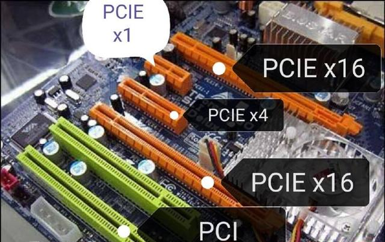
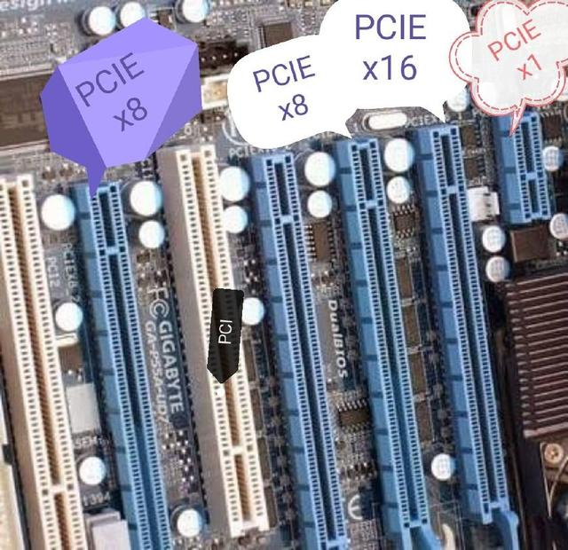
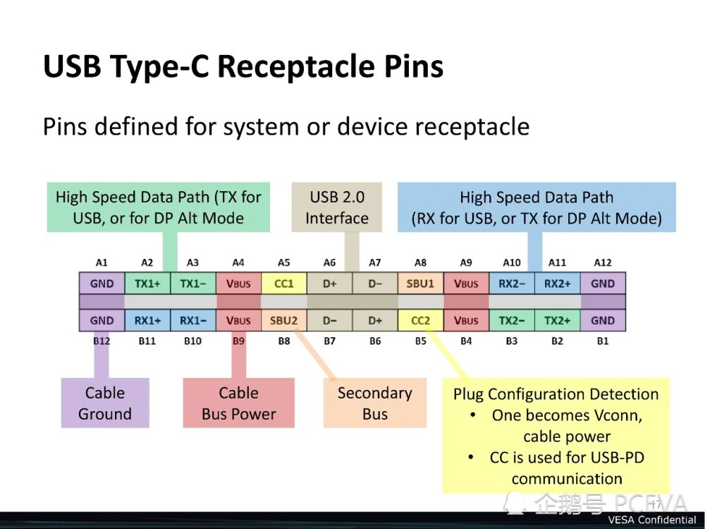
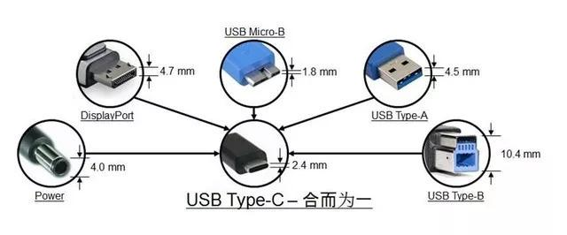
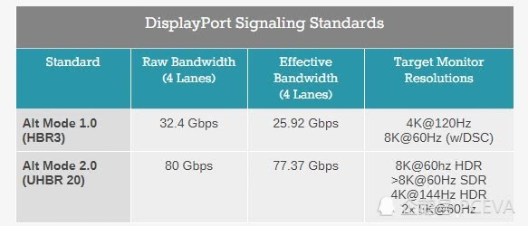

## 接口

### 物理接口

## 主机接口

* SATA

  既是一种总线类型，又是一种接口类型

* M.2

  一种新连接器，可以提供PCI-E, SATA等总线连接

* PCI-E

## PCI-E

1. PCI-E x16插槽全长89mm，有164根针脚，靠主板外侧端有一卡口，将16x分为前后两组，较短的插槽有22根针脚，主要用于供电，较长的插槽142根，主要用于数据传输，具有16通道所带来的高带宽。

   PCI-E x16插槽，主要用于显卡以及RAID阵列卡等，这个插槽拥有优良的兼容性，可以向下兼容x1/x4/x8级别的设备。可以说是PCI-E x16插槽是PCI-E的万能插槽。

   由于PCI-E x16插槽常用于显卡，与cpu处理器直接相通，在物理位置上直接靠近cpu，这样显卡与处理器之间的数据交换就可以减少延迟，让系统的性能可以得到充分的发挥。

2. PCI-E x8插槽全长56mm，有98根针脚，与PCI-E x16比较，主要是数据针脚减少至76根，短的供电针脚仍然是22针脚。

   为了兼容性，PCI-E x8插槽通常加工成PCI-E x16插槽的形式，但数据针脚只有一半是有效的，也就是说实际带宽只有真正的PCI-E x16插槽的一半。可以观察主板布线，x8的后半段没有线路连接，甚至针脚也没有焊接。

   实际上除了旗舰级的主板，能提供多条真正的PCI-E x16插槽外，主流级主板，只会提供一条真正的PCI-E x16插槽，就是最靠近cpu的那条。而第二条和第三条PCI-E x16插槽，则多数是PCI-E x8甚至是x4级别的。

3. PCI-E x4插槽的长度为39mm，同样是在PCI-E x16插槽的基础上，以减少数据针脚的方式实现，主要用于PCI-E SSD固态硬盘，或者是通过PCI-E转接卡安装的M.2 SSD固态硬盘。

   PCI-E x4插槽通常由主板芯片扩展而来，不过随着cpu内部PCI-E通道数的增多，现在有部分高端主板可以开始提供直连cpu的PCI-E x4插槽，用于安装PCI-E SSD固态硬盘。

   主板上为什么找不到PCI-E x4插槽?其实它是以M.2接口的形式出现的。

   不过与PCI-E x8插槽一样，PCI-E x4插槽为了兼容性，现在多数也是做成PCI-E x16插槽的形式，或是扩展为M.2接口，用于安装M.2 SSD、M.2无线网卡或者其它M.2接口设备，其余扩展卡则留给PCI-E x1插槽负责。

4. PCI-E x1插槽的长度是最短的，仅有25mm，相比PCI-E x16插槽，其数据针脚是大幅度减少至14个。PCI-E  x1插槽的带宽通常由主板芯片提供，主要用途是独立网卡、独立声卡、USB 3.0/3.1扩展卡等都会用到PCI-E  x1插槽，甚至可以通过转接线给PCI-E x1插槽装上显卡，用来挖矿或者实现多屏输出。

为了长、短插槽互相兼容（物理长度兼容、版本的兼容包括1.0、2.0、3.0互相兼容），短插槽自然可以插入长插槽中，但长的插到短的插槽中就不容易，一般X1还是保持原来的长度，而x4、x8、x16在实际的主板中，都统一长度到x16。只是速度不同而已。多余的脚是悬空的，没有用处。这样外形上就统一兼容了，仔细看一下针脚是否焊接了线路，一般主板上都标明了是PCI-E x多少。

## USB

详见： [Type-C最强科普，建议收藏](_resource/Type-C最强科普，建议收藏.html)

Various USB connectors along a centimeter ruler for scale. From left to right: 

- Micro-B plug
- 8-pin mini-B plug [[a\]](https://en.wikipedia.org/wiki/USB_hardware#cite_note-12)
- Mini-B plug
- type-A receptacle[[b\]](https://en.wikipedia.org/wiki/USB_hardware#cite_note-13)
- type-A plug
- type-B plug

a. **[^](https://en.wikipedia.org/wiki/USB_hardware#cite_ref-12)** [The 8-pin mini-B](https://pinoutguide.com/DigitalCameras/micro_usb_8pin_camera_pinout.shtml) is a proprietary connector used on many older Japanese cameras for both USB and analog AV output.
b. **[^](https://en.wikipedia.org/wiki/USB_hardware#cite_ref-13)** Inverted, so the contacts are visible.

* Type-A

* Type-B
  * MicroB
    * 2.0 -> USB 2.0协议
    * 3.0 -> USB 3.0协议
      兼容2.0，也即2.0线能插3.0口，反之则不行；
      在USB3.0的移动硬盘中广泛采用。由于该接口过于扁长，多次插拔后故障率较高，预计未来会全面被USB-C接口取代
  
* Type-C

  支持USB2.0，3.0（3.1Gen1)、3.1Gen2、雷电3。 也即： **type-C并不一定就意味着高速**
  

协议

* USB
  * 2.0
    理论带宽数为480Mbps
  * 3.1
    * Gen 1 (3.0)
      5Gbps
    * Gen 2
      真正意义上的3.1，10Gbps
  * 3.2
    20Gbps
    全面采用USB-C接口而放弃其他形式存在
  
* 雷电

    

* 线

  * USB A - B
  * USB A - C
  * USB C - C

* USB
  * Type-A
  * Type-B
    * MicroB
  * Type-C

### type-C

#### type-C的使用场景

* 充电

  一般是： type-A - type-C，也有 type-C  - type-C
  
  关于USB充电的背景，参见 [通用USB充电器（快充）说明](_resource/通用USB充电器（快充）说明.md)
  主要在于充电协议，见 [type-C供电](it_硬件_接口_供电_yonka.md#type-C供电)
  
  充电效果也分为：

  * 协议匹配 -> 对应的协议充电(qc、pd等)
  * 协议不匹配 -> fallback到普通usb充电(bc 1.2？)

* 数据传输

  同样的，type-C不一定都是3.0+的速度，也可能fallback到2.0

* 视频输出

  `* ALT`

  * DP alt
  * HDMI alt

  更特殊的情况是： 对显示器的供电和显示输出合二为一

* 音频输出

  拿掉3.5mm耳机口改用type-C的手机

  * 用转接头继续插3.5mm接口耳机
  * 直接插type-C耳机

   些耳机很多其实是利用类似之前的USB外置声卡的原理，将芯片体积做小到耳机/转换头中

## DP

### DP alt

DP Alt Mode标准第一版本于2014年9月22日发布，其目的是使用USB Type-C接口来支持DP标准。

2014年推出的Alt Mode 1.0标准拥有25.92Gbps有效带宽，可支持最高4K 120Hz视频传输，或在DSC压缩的帮助下实现8K 60Hz传输。而新的Alt Mode 2.0加入了对UHBR 10、UHBR13.5和UHBR 20的支持，有效传输带宽最高77.37Gbps，能够支持8K 60Hz HDR、超过8K分辨率的SDR、4K 144Hz HDR或者2x5K 60Hz视频传输。

Alt Mode 2.0需要使用内部带有额外芯片的主动线缆，这颗芯片可对DisplayPort信号进行增强和补偿，以支持高比特率连接。主动线缆通常还具有方向性，需要正确连接合适的设备。相比Alt Mode 1.0，这会略微增加一些成本。

## 线缆

常见的：
* Type-A -> Type-B MicroB
* Type-A -> Type-C
* Type-A -> Lighting

新起的：
* Type-C -> Lighting
  

## iphone接口

* 30针
  
* lighting
  
