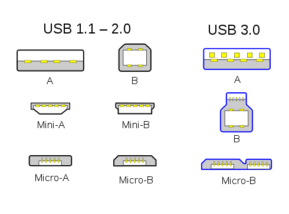
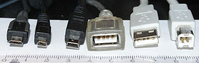
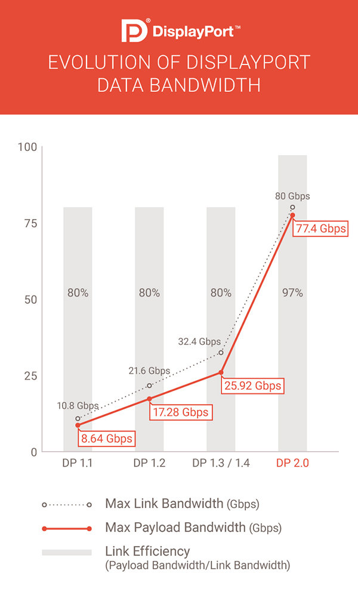
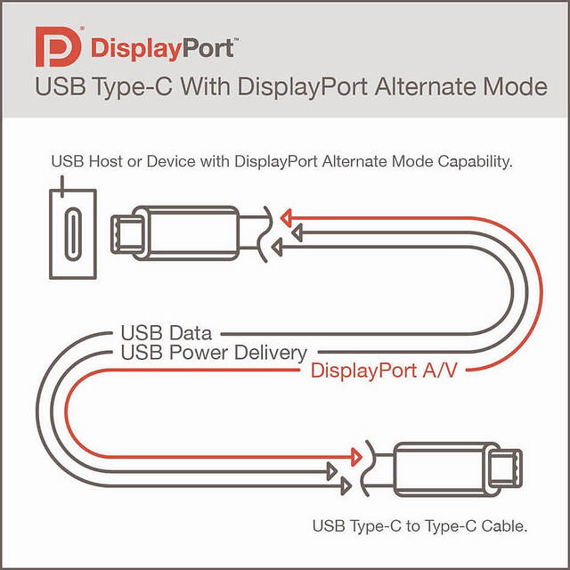
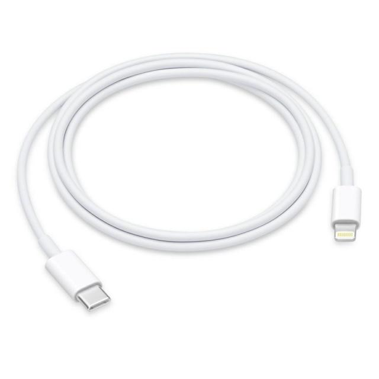
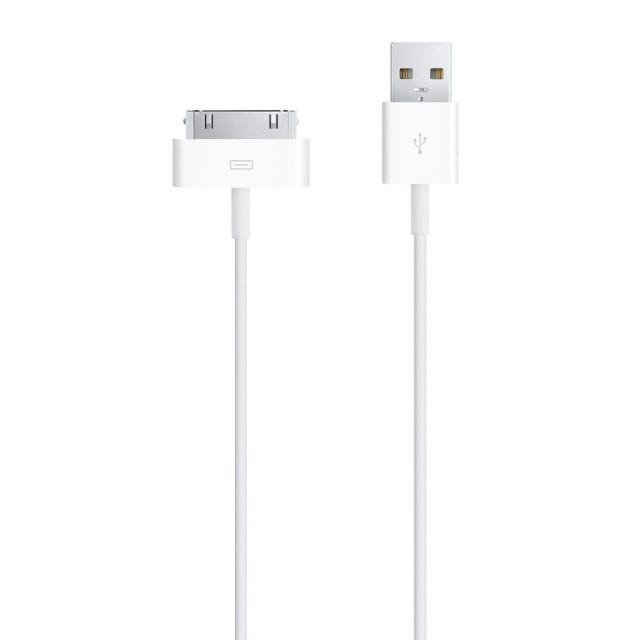
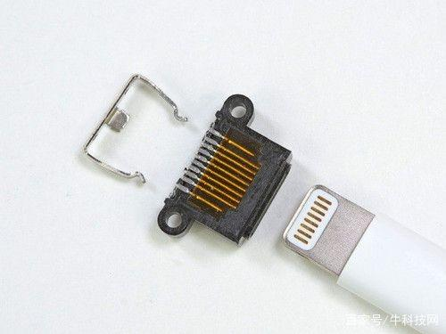

## 接口

### 物理接口

#### USB

详见： [Type-C最强科普，建议收藏](_resource/Type-C最强科普，建议收藏.html)

Various USB connectors along a centimeter ruler for scale. From left to right: 

- Micro-B plug
- 8-pin mini-B plug [[a\]](https://en.wikipedia.org/wiki/USB_hardware#cite_note-12)
- Mini-B plug
- type-A receptacle[[b\]](https://en.wikipedia.org/wiki/USB_hardware#cite_note-13)
- type-A plug
- type-B plug

a. **[^](https://en.wikipedia.org/wiki/USB_hardware#cite_ref-12)** [The 8-pin mini-B](https://pinoutguide.com/DigitalCameras/micro_usb_8pin_camera_pinout.shtml) is a proprietary connector used on many older Japanese cameras for both USB and analog AV output.
b. **[^](https://en.wikipedia.org/wiki/USB_hardware#cite_ref-13)** Inverted, so the contacts are visible.

* Type-A

* Type-B
  * MicroB
    * 2.0 -> USB 2.0协议
    * 3.0 -> USB 3.0协议
      兼容2.0，也即2.0线能插3.0口，反之则不行；
      在USB3.0的移动硬盘中广泛采用。由于该接口过于扁长，多次插拔后故障率较高，预计未来会全面被USB-C接口取代
  
* Type-C

  支持USB2.0，3.0（3.1Gen1)、3.1Gen2、雷电3。 也即： **type-C并不一定就意味着高速**
  

协议

* USB
  * 2.0
    理论带宽数为480Mbps
  * 3.1
    * Gen 1 (3.0)
      5Gbps
    * Gen 2
      真正意义上的3.1，10Gbps
  * 3.2
    20Gbps
    全面采用USB-C接口而放弃其他形式存在
  
* 雷电

* DP
  
    

* 线

  * USB A - B
  * USB A - C
  * USB C - C

* USB
  * Type-A
  * Type-B
    * MicroB
  * Type-C

## DP

### DP alt

## 数据线两头

常见的：
* Type-A -> Type-B MicroB
* Type-A -> Type-C
* Type-A -> Lighting

新起的：
* Type-C -> Lighting
  

## iphone接口

* 30针
  
* lighting
  
