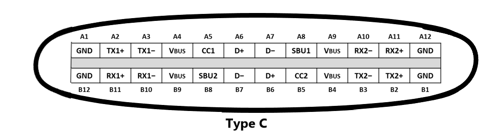
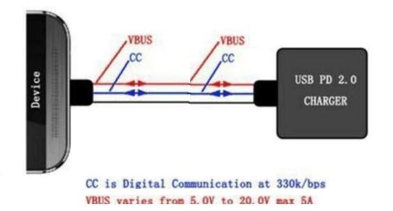
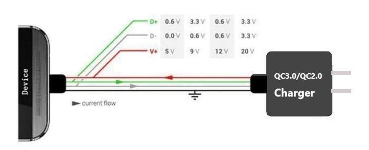

## 数码设备供电 （不包括主机类等大功率）

目前公认的说法是14种之多。包括PD（2和3），QC（2，3，4），苹果（手机和平板），三星（新和旧），华为（高压和大电流），OPPO VIVO 1＋（老接口强改），MTK(昨日黄花），BC1.2（最原始）。

每一种充电协议电压和电流都不同，有的拥有多个档位。原因是受限于制定该协议的时候的接口硬件。比如苹果协议受限于他那不靠谱的数据线，安卓手机早起受限于microUSB的2A能力，新版USB type-c则扩大到了20V5A。但是，每一种都是不同的电压电流跳变逻辑而已，目的都是找到你手机线路和手机电池能够承受的最大充电功率。思路都一样的，通过手机和充电芯片通信决定用哪种协议，高档的协议再通过手机端电压数据和电缆电阻，进行电线补偿和电流发热量控制。所以，其实除了人为搞的不兼容相互收钱和避免收钱以外，没有什么实际意义。越新的协议功率越大，但是永远不可能超过USB type-c的极限20v5A，100w。

去年大家一起商量，这太乱，一块做一种协议，以可能需要的最细你能力来提升电压，以可能兼容的最大电流来作为门限，大家统一逻辑就可以相互兼容了，避免浪费。所以这就有了现在的PD充电协议，它兼容手机，平板和笔记本电脑等设备，大家商量好了以后逐渐都不再使用新的协议全部往PD方向发展。

当然，理想是丰满的，显示是骨感的。实际上很多老设备已经存在，各自有当时的硬件局限。所以当前还是各自并存，是不是兼容就看厂家乐不乐意了。

前面都是废话可以不看。

按照我的经验，目前看手机和充电器的兼容性，只看两个协议就可以了。一个是高通的QC版本，一个是PD。

## type-C供电

下图是USB type C接口的标准引脚：24 PIN，可以看出把普通USB接口兼容，和影像，数据传输（如HDMI、DVI、VGA接口）都能兼容，就是说以后只需要一条USB Type C接口即可完成。我们这次讲的是供电充电这块的，所以当USB type C只用于供电时(如充电宝，适配器，车充，排插等)，可以不需要标准的24 PIN，可以去掉如A2,A3,A8,A10,A11，B2,B3,B8,B10,B11等PIN脚，这些USB 接口厂商已经有这样的，可以省成本.

### type-C 充电线

数据线方面，只看电流就可以了。2A，3A和5A三种。一般不讲的线材就是2A的，对大多数新充电器都不兼容，尤其是华为荣耀的，甚至出现不充电的情况。所以现在只是买3A的线，最好买5A的一步到位，现在也不贵，十几二十块钱而已，可以兼容所以协议了。

### USB-PowerDelivery既我们常说的USB PD快充协议，PD快充

是由USB-IF组织制定的一种快速充电规范。USBPD透过USB电缆和连接器增加电力输送，扩展USB应用中的电缆总线供电能力。该规范可实现更高的电压和电流，输送的功率最高可达100瓦，并可以自由的改变电力的输送方向（如充电宝的输入输出充电口和移动设备的双向充电，目前只有如IPAD PRO，华为MATE20）。

USB PD协议是在 USBType C接口上诞生的快充充电协议。所以有些人对于**USBPD和Type-C的关系容易混淆**，type c是一种接口规范，默认最大支持5V3A的充电，但在type C接口实现PD协议后,将可以把充电功率最大支持到：18W，30W，45W，60W等甚至到最大的100W。

> 也即只支持（支持pd的）type-C

USB-PowerDelivery （USB PD看似只是电源传输与管理的协议，实际上它可改变端口角色，可与有源电缆通讯，允许成为受电设备等诸多高级功能，就是手机给另外一部手机的反向充电，这个知道就可以了。USB PD协议是通过 type C口独有的CC 引脚来进行通讯，同时type C口也是有D+,D-，这点就不说了。

USBPD的发展前景。USBPD现在已经发展到了USBPD3.0版本。在谷歌的推动下目USBPD已经收编了高通的QC快充协议，并获得了中国工信部的支持。有望在不久统一目前混乱的快充市场。

### QuickCharge（QC）

QC3.0/2.0和目前的PD快充，是高压快充（9V，12V，15V，），20V是笔记本。

   QuickCharge3.0/2.0是纯快速充电的协议，专注的只有充电，只能单向电能传输。协议是通过D+,D-手机和协议芯片来通讯进行握手匹配，然后再提高改变V+（输出电压），使充电功率增加，充电就更快。

QC3.0/2.0和USB PD的通讯引脚不一样，所以我们在做PD充电器/充电宝和车充时，可以做到既能支持QC和PD的快充产品出来。

