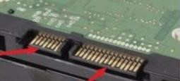
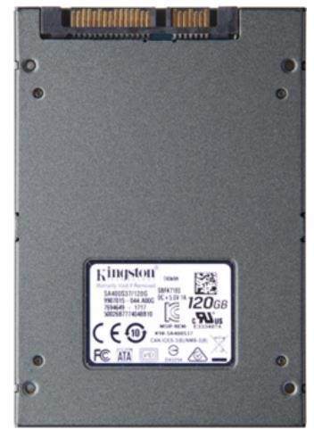
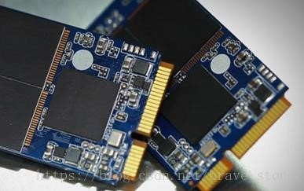
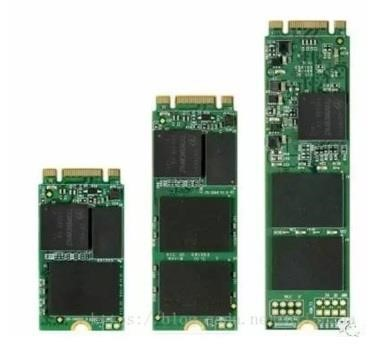
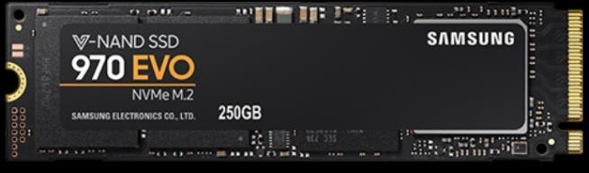
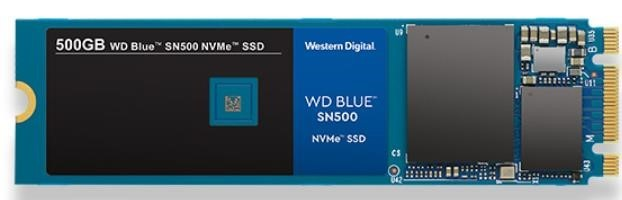
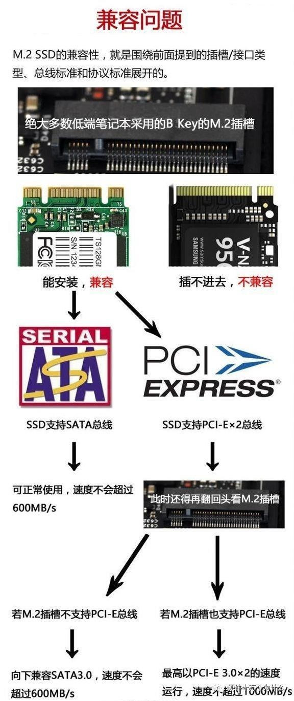
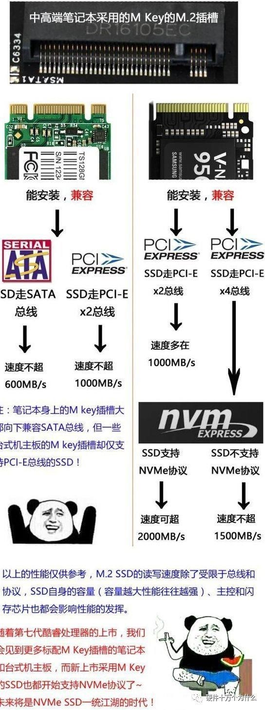

https://www.bilibili.com/read/cv3056816/

**PC 上 常用硬盘接口、传输协议、传输总线（上 层协议）汇总与科普------ 2019 年 6 月**

## **硬盘接口** 

### 第一类： SATA 接口

金手指：7（数据）+15（供电） 
现主要常见 SATA2.0 和 SATA3.0 两种版本。 
3.0是2.0的升级版本，发布于2009年，所以2010年之前的电脑主板基本都只提供 sata2.0 接口。

可使用硬件检测工具来进一步确认，sata3.0 的接口兼容 2.0，所以如果你的电脑只提供 3.0，仍可使用 2.0 的硬盘。

sata2.0 和 sata3.0 最关键的区别在于传输速度，sata2.0 最高传输速度是 300M/s，而 sata3.0 最高传输速度可达 600M/s。 
Sata 接口普遍用于机械硬盘(HDD），同时部分固态硬盘(SSD)也用sata3.0接口，速度上限在600M/s以下，而 HDD速度峰值只有100+M/s，因此不用考虑 sata2.0、3.0 的问题。 

Sata 接口的变种：  **mSATA（mini SATA）** ，多用于早期 SSD。 

早期，为了更适应于轻薄本这类超薄设备的使用环境，针对便携设备开发的 mSATA 接口应运而生。你可以把它看作标准SATA接口的mini版。

mSATA接口是SSD小型化的一个重要过程，不过 mSATA 依然没有摆脱 SATA 接口依然是 SATA 通道，带宽是 6Gbps（既实际读取速度上限 600M/s）。诸多原因没能让 mSATA 接口火起来，反而被更具升级潜力的 M.2 接口取代。 

### 第二类: M.2 接口

M.2 是当前最复杂、最多变的固态硬盘接口。

相同的外观下可以支持不同的传输协议以及不同的上层协议。 

* 第一种：金手指单开口。 
  分为 B key（又称 Socket2）和 M key（又称 Socket3）两种。

  区分方法：数金手指数。29+5/29+4（双面金手指）的是 M key； 
  28+5/28+6（双面金手指）的是 B key。 

  * 前者支持 SATA、PCI-Ex2 总线，ahci 传输协议，理论读写速度分别达到600M/s 左右

    三星 SM951 M.2 接口，PCIe 总线，AHCI 协议↓  B key（少见）

    

    B key 单开口的 M.2ssd 很少见（市售几乎没有），一般 B key 的都是金手指双开口，如下示： 
  
    
  
  * 后者支持 PCI-Ex4 总线，nvme 传输协议，理论读取速度高达 4Gb/s。 
  
    三星 970evo M.2 接口，PCIe 总线，NVME 协议↓ 
  
    M key

* 第二种: 金手指双开口。（B&M key） 
  最早，这种 M.2 接口 SSD 使用了与 2.5 寸 sata3.0接口的SSD相同的AHCI协议和相同的SATA总线，除了外观不同，他们在性能表现上和 2.5 寸 SATA3.0 版本 SSD基本没有区别。 
  目前市售的这种双开口的 M.2 也有走 pcie 总线和NVME协议的，但较为少见。

通过产品使用了某种针脚来判断一定会对应某种通道（SATA/PCIe）或传输协议（AHCI/NVMe）是不准确的。 

1

M key

如果你对上述的传输协议（AHCI/NVME）、总线（上层协议）(SATA/PCIE)，懵懵不知所云的话请看下去。 

## 协议和总线科普

传输协议： 

传输协议，也有时候回叫做传输规范，网上很多都会把它叫做传输标准。什么是传输协议？用一种简单的理解方法，就是数据传输的方法。 

每当有数据到达控制器（比方说南桥/北桥），**传输协议就规定着这个数据将会以怎么样的方法传输到硬盘上**。比如，一次传输队列中携带多少的数据，一次传输的数据大小等等。**传输协议限定着硬盘与控制器（南桥等）如何传输，如何沟通**，他就像交通规则一样，规范着数据的传输规则。**目前 PC 上常见的有 AHCI 和 NVME 两种**。 

**传输总线（上层协议）：** 
所谓总线，其实他就是一条通道，就像公路一样，只不过公路是走车的，而总线是用来走电信号的。那么公路的大小与车速，就决定了这条公路的车流量，同样的，总线的位宽大小与传输频率，也决定了在一次传输中能够提供的最大速度。**常见的分 SATA （*区别于 sata接口，同名但不是一类概念*）和 PCIE 两类**。 

PCIe 是一种高速差分信号总线，直接与北桥连接。已经发展的到了第四代，PCIe4.0 单向带宽速度可以达到 1GB/s。PCIe 支持 1， 2， 4，7 ，8，16 个总线宽度，消费级 SSD 采用最大的是 PCIe 3.0 x4, 也就说，PCIe 3.0 x4 的 SSD 最大理论速度可以达到 4GB/s。

目前 SSD 厂商能做到的最大的实际测试速度是 3.5GB/s. 这个速度比 SATA 的 550MB/s 速度要快了近 7 倍！ 

而 sata 和 usb 这些是与南桥连接。 

北桥：（英语：Northbridge）是基于 Intel 处理器的个人计算机主板芯片组两枚芯片中的一枚，北桥设计用来处理高速信号，通常处理中央处理器、存储器、PCI Express 显卡（早年是 AGP 显卡）、高速 PCI 
Express X16/X8 的端口，还有与南桥之间的通信。 

南桥（英语：Southbridge）是基于个人计算机主板芯片组架构中的其中一枚芯片。南桥设计用来处理低速信号，通过北桥与中央处理器联系。目前大多数主板北桥芯片都集成到了 CPU 内部，所以主板上看到的那个芯片一般就是南桥芯片。

​                                                            ---------西大计协安天晟著

本文为我原创

本文禁止转载或摘编

