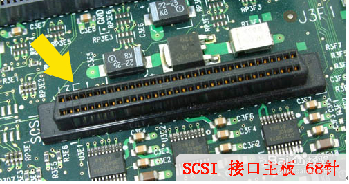

# 一些概念

## 接口： interface、connector

### SATA

SATA是Serial  ATA的缩写，即串行ATA。这是一种完全不同于并行ATA的新型硬盘接口类型，由于采用串行方式传输数据而得名。SATA总线使用嵌入式时钟信号，具备了更强的纠错能力，与以往相比其最大的区别在于能对传输指令（不仅仅是数据）进行检查，如果发现错误会自动矫正，这在很大程度上提高了数据传输的可靠性。串行接口还具有结构简单、支持热插拔的优点。

SATA接口主板

### IDE

IDE的英文全称为“Integrated Drive  Electronics”，即“电子集成驱动器”，并行口，它的本意是指把“硬盘控制器”与“盘体”集成在一起的硬盘驱动器。把盘体与控制器集成在一起的做法减少了硬盘接口的电缆数目与长度，数据传输的可靠性得到了增强，硬盘制造起来变得更容易，因为硬盘生产厂商不需要再担心自己的硬盘是否与其它厂商生产的控制器兼容。对用户而言，硬盘安装起来也更为方便。IDE这一接口技术从诞生至今就一直在不断发展，性能也不断的提高，其拥有的价格低廉、兼容性强的特点，为其造就了其它类型硬盘无法替代的地位。

IDE代表着硬盘的一种类型，但在实际的应用中，人们也习惯用IDE来称呼最早出现IDE类型硬盘ATA-1，这种类型的接口随着接口技术的发展已经被淘汰了，而其后发展分支出更多类型的硬盘接口，比如ATA、Ultra ATA、DMA、Ultra DMA等接口都属于IDE硬盘。

IDE接口的主板

### SCSI

SCSI的英文全称为“Small Computer System  Interface”（小型计算机系统接口），是同IDE（ATA）完全不同的接口，IDE接口是普通PC的标准接口，而SCSI并不是专门为硬盘设计的接口，是一种广泛应用于小型机上的高速数据传输技术。SCSI接口具有应用范围广、多任务、带宽大、CPU占用率低，以及热插拔等优点，但较高的价格使得它很难如IDE硬盘般普及，因此SCSI硬盘主要应用于中、高端服务器和高档工作站中。

SCSI接口的主板

### 光纤通道（硬盘）

光纤通道的英文拼写是Fibre  Channel，和SCIS接口一样光纤通道最初也不是为硬盘设计开发的接口技术，是专门为网络系统设计的，但随着存储系统对速度的需求，才逐渐应用到硬盘系统中。光纤通道硬盘是为提高多硬盘存储系统的速度和灵活性才开发的，它的出现大大提高了多硬盘系统的通信速度。光纤通道的主要特性有：热插拔性、高速带宽、远程连接、连接设备数量大等

### SAS接口（硬盘）

SAS是最新一代的SCSI技术，和现在流行的serial  ATA硬盘相同，都是采用串行技术以获得更高的传输速度，并通过缩短连结线改善内部空间；SAS是并行SCSI接口之后开发出的全新接口，此接口的设计是为了改善存储系统的效能、可用性和扩充性，提供与串行ATA硬盘的兼容性。

SAS的接口技术可以向下兼容SATA，SAS系统的背板（backplane）既可以连接具有双端口、高性能的SAS驱动器，也可以连接高容量、低成本的SATA驱动器。因为SAS驱动器的端口与SATA驱动器的端口形状看上去类似，所以SAS和SATA驱动器可以同时存在于一个存储系统之中。要注意的是，SATA系统并不兼容SAS，所以SAS驱动器不能连接到SATA背板上

### M.2

## 总线

## 协议

### 接口支持的协议

