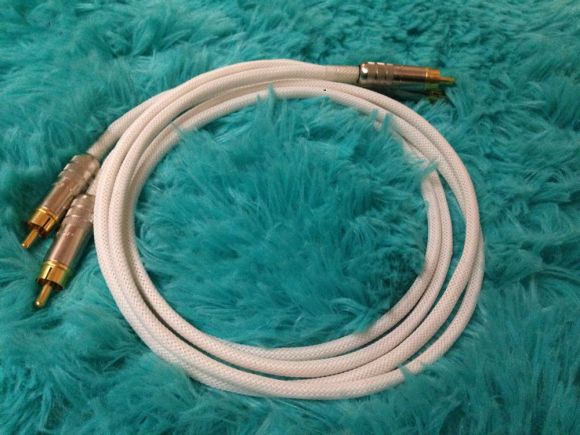

https://tieba.baidu.com/p/3476366784?red_tag=3405985617

最近贴吧里关于线材无用论的讨论似乎非常火热，并且这些讨论已经比过去的晾衣架理论要高端了许多，不过因为前些天楼主社团里的事务非常繁杂并没有心思参与这个讨论。
这篇讨论中我会放出一篇两周前写得文章，这篇文章我本意是用来投稿，因为放在贴吧的话这种略显枯燥的文章很快就会沉下去，甚至可能莫名其妙被删掉。说实在的，这篇文章确实凝聚了我一点心血，所以希望放在像数码多这样网站上也许能够被更多人看到。不过由于编辑要求修改，而这两周我确实非常忙非常累，没有精力去修改和完善，故只能把未完成的原稿拿出来分享。
从很久以前刚开始接触线材开始我便觉得线材这种东西并不是那么简单的，首先听感上的确有差别，而喜欢钻牛角尖的我便对造成这些差别的原因起了兴趣，在一些书籍资料，自己diy的研究，和一些有经验的前辈的指导下，自认为将线材研究得比门外汉要透彻一些。后来由于个人原因没有了那么多精力去折腾和研究，于是便写了这么一篇文章作为这段时间学习的简单成果。文章里的内容非常浅显，并且应该存在一些不准确的内容，不过相信将它对于有兴趣的朋友来说有一些作用。
恰逢最近对于线材无用论的讨论有些火热，我考虑再三还是把这篇文章放出来交流和分享，文章比较枯燥，希望吧友们能够赏脸阅读，“太长不看”这四个字对于惯于写长文的我确实是一个很大的伤害。
镇楼图是个人为自己制作的信号线，在聚会上这条线得到了前辈让人欣慰的评价，我也很自豪的把它作为镇楼图。ps至少这段时间内不会接受这条线的订单，毕竟个人做这些线非商业性，这条线太费时费力至少年内实在是没时间做了，仅仅是放个图在这里吸引一下阅读量以免帖子沉了。

那么下面是正文，原稿枯燥无图还请耐心阅读，有不赞同的地方也请指教，个人很忙并不一定能及时回复但关于文章讨论的内容是非常欢迎的。

《音响线材的玄学与科学》 by水月
    在音响发烧友的世界里，对于极致的追求一直是一个被当做信念一样的存在。然而正是因为对极致的过于追求，使得一些近乎吹毛求疵的因素被冠以玄学之名。
    这些被称为玄学的因素，大部分是因为很难用常识或简单地科学知识去理解，但是在很多人眼里这些因素又确实地给音响系统的声音带来了改变。这种给声音带来主观听感上的改变，又难以去理解和解释的因素，便被称为音响玄学。
    其实所谓的玄学，并不是真正的玄学，这些因素的影响来源于稍微偏向专业化一些的领域，不能用中学等级的物理学来解释；非要说的话，应该算是大专以上级别的知识吧（笑）。
    当然这些领域里还是存在真正的玄学的，不过那种纯粹以忽悠为主以圈钱为目的的东西并不在我们今天的讨论范围内。
     今天我们要讨论的，是关于线材的话题。线材对声音的改变往往是非常显着的，但是影响的原因很多时候被当做非常高深的玄学看待；而在诸多音响线材Diyer眼中，线材的声音取决于使用的线芯，粗细、材质、芯数，这些音素似乎也决定了诸多Diy线材的定位和价格；而其他设计和处理工艺上带来的影响在手工线材的领域很多时候被忽略掉。
     笔者并不是这方面的专家，仅仅是基于个人爱好通过相关书籍进行了一段时间的研究，再加上自己对于线材DIY的心得以及本地一位线材研究专业人士的指点，在此对线材对音响系统带来影响的根本原因进行一系列剖析，也对一些线材处理中的一些噱头或者专用词进行解释。当然笔者毕竟是业余人士，所以有什么说得不对的地方也欢迎大家指出。

1、线材的尺寸
     我还记得几年前曾经风（chou）靡（ming）一（zhao）时（zhu）的晾衣架理论，这个理论中说道线材的唯一影响就来源于电阻，而电阻和长度以及导体截面积有关；所以这的理论得出的最后结论就是把晾衣架掰直做成线材用在音响系统的效果不亚于几万元的发烧线材。当然这个理论已经被无数人证实其实是谬论了，但它仍然在一些初出茅庐且辨识能力较差的玩家中有影响力。事实上且不论影响线材声音的其他因素，这种高中物理程度地化繁为简概念实在是存在非常大的误区；学过大学物理的朋友很多都知道高中物理为了便于理解忽略了非常多要素，把复杂的东西笼统解释为简单地概念，这就带来了这种误区。
    很多有一定经验的音响线材玩家都知道有一个名词叫做“集肤效应”，又叫做“趋肤效应”简单地说就是高频率交流信号从导体表面通过的现象，这个现象来源于交流信号在线材中产生的感应电动势，它带来的反向电流集中在导体中心，使得高频信号主要从导体表层通过。
    由于“集肤效应”的存在，很多线材制造商会选择增大线材的芯数，这样就能增加同样截面下导体的表面积，从而提高高频信号的导电效率，这对整个系统的高频动态表现自然是正面的，但是同时这也存在一个问题。
     由于低频信号的“集肤效应”并没有高频信号那样显着，所以低频信号在线材截面中通过的区域相比高频信号更加向心；而在大多数多芯线材的设计中，往往在一根不到1mm直径的线基中绞合了数十支线芯，这时每根纤芯的结构就变得非常纤细。看到这里很多朋友应该就可以猜到，这样的线材设计中，低频能量相比之下是受到了明显的压制的。
    相对的，在这样的客观现象下，另一些线材的设计便采用非常粗的单支线材，以保证中低频信号足够的动态。笔者曾经帮友人维修过一条铜彩的“芬尼”信号线，这款线材的设计便是使用了一条极粗的单支纯铜纤芯，当然它非常地硬，但是用在音响系统中低频的表现非常有气势。
     线材的尺寸带来的影响就像是一个天平，所需要寻求的是根据线材的定位选择一个折中点；对于线材的尺寸选择，各家线材厂都有自己的看法，也有自己的执行方式，比较有特色的例子是杜兰，使用扁平方芯，在足够的单支截面下做出了足够大的表面积，这也不失为一种非常值得赞赏的设计。

2、线材的导电性
     所谓的导电性，在很多时候简单地以电阻来表示。之前的“晾衣架理论”中，对于导体电阻的概念局限于高中物理的笼统程度，而实际导体之中，线材导体的电阻并不是一个电阻率和长度截面的关系公式那么简单。电阻率的常数所局限的状况是直流电，而在交流信号通过时，一切都变得不同了。
     实际情况中，导体对于交流信号的电阻效应是一条曲线，就像耳机喇叭的频响曲线一样，是一个在不同频率信号下有着不同数值的参数。这个变化的参数其实非常重要，它直接影响了线材的三频走向。而造成这个曲线的原因不仅仅来源于线材材料本身的因素，还有结构，绝缘材料，尺寸，处理工艺等等原因，它是容抗感抗和阻抗的综合表现。
    关于导电性在这里不会进行过多的叙述，因为它直接牵涉本篇文章要提及的几乎所有要素，在下文中笔者会对此加以叙述。

3、线材的材料
（1）单晶导体
    很多刚开始涉及线材的玩家都会被一个词唬得傻傻的，这个词就是“单晶铜”。单晶金属的制造工艺也经常被人吹得神乎其神。
    什么叫做单晶导体？在解释这个名词之前我们需要先理解一下金属晶体的晶界这个概念。
     一般来说，金属导体由于冷模铸造等缘故，都存在着很多的晶体缺陷，这种缺陷被归类为点缺陷线缺陷和面缺陷，这些缺陷都会对金属导体的导电性产生负面影响。一般来说，面缺陷是影响导电性最为显着，且最为常见的缺陷；而晶界便是典型的面缺陷。晶界这个词很好理解，可以简单地理解为“晶体的边界”；理论来说，正常的金属晶体是金属原子通过金属键按照其自身结构规律组合成的规律结构，但是受冶炼，铸造，冷处理中各种因素的影响，金属导体并不能冷却成完美的晶体结构，而是会产生很多类似于截面的结构。在这样的截面上，金属原子之间的连接是存在畸变的；这种畸变的结构中，由于原子的不规律排列，以及键能的不稳定，电子在这些区域间流动时会受到阻碍，从此影响其导电性。至于这种缺陷使得线材在音响系统中的表现所受的影响，属于一种相比之下不那么显著的表现，更可能是存在于声音的解析力和瞬态表现上的影响。
    所谓的单晶金属导体，是一种较为理想的导体，这种导体可能整条导体中都没有或者只有少许的晶界，一般来说单晶导体的晶体长度可以达到数十米乃至上百米，而制造这种单晶金属的工艺，被称为“大野连续铸造法”。
     关于“大野连续铸造法”笔者在此就不对其优越性进行累述，因为关于这种工艺的好处在很多产品介绍乃至淘宝店里都可以看到。不过，这种工艺其实并没有很多传言得那样成本高昂，因为它虽然很优越，但归根结底只是一种热模铸造方式，它相对于同样纯度下的无氧铜成本的差距远没有价格差距那么大，所以也不必相信很多人鼓吹的单晶铜冶炼成本高昂甚至超过黄金之类的鬼话。单晶金属更大的存在意义是在长距离信号线缆的应用上，能够很有效得降低信号的衰减；而运用于最多不过几米长的音箱线材中时，其效果就比较有限了，当然在精益求精的音响发烧友眼里这也是不能忽略的要素。
（2）线材镀层
     很多时候音响发烧友接触到的线材都带有镀层，其中绝大多数是纯铜镀银线材。说起镀银线材，很容易想到的便是昂贵的音乐丝带。音乐丝带以高昂的价格和极佳的音响效果而闻名，它采用的空气绝缘结构和挤压镀银工艺也是其特点所在；不过关于结构留到后面再描述，这里先谈谈关于镀层工艺。
     其实在一开始，线材的镀层的本意并不是出于信号传输方面的考虑，而是出于防止氧化的目的。众所周知纯铜材质的线芯在长时间接触氧气后会受到氧化变绿，而以前线材绝缘包裹材料隔绝空气的性能并不好，就算是现在，被良好材料包裹的纯铜线材也会很容易从两头焊接位置处开始氧化。线材的氧化并不只是变绿变得难看这么简单，它严重地影响了线材的导电性，特别是对于射频信号的影响最为明显，所以我们见到的大部分中高档同轴线材都经过了镀银处理或者干脆就是纯银。
     但是在音响HiFi领域，镀银线被赋予了另一种意义，它并不单单是一种抗氧化镀层。前面提到过交流信号线中存在“集肤效应”，高频信号会从导体表面通过，而银的导电性要强于铜，因此在镀银的线材上，理论上高频会有所拔高。但实际情况和镀层的结晶状况以及厚度等有关。
     除了镀银线以外，还存在着镀锡线和镀金线。这些线材原本的设计意图仍然是防氧化，细的铜线氧化有可能直接断掉，所以这样的抗氧化措施在国外的通讯线缆中非常普遍。不过金的导电性弱于铜，而锡的导电性远弱于金，所以用于音响系统时，镀金线的高频应该是略微暗淡的，而镀锡线不仅高频暗淡，其整体声音还会显得有点躁。
     提到镀银线就不得不提到一直比较混乱的耳机线材市场，确切的说是耳塞升级线材。耳塞升级线材的产品中曾经充斥着一些名字非常好听外观非常漂亮的东西，但是这些五颜六色的线材实际上是使用欧美产的YLJ通讯线缆中拆出的线芯制作的。这就是耳机线材水深的原因，所以有时候很多使用线材厂专门生产的线基制作的手工线也算是比较好的产品了。
    镀银线材的影响因素除了镀层的厚度，还有镀层工艺。像著名的音乐丝带奥丁线，使用的是挤压镀层应该是将银用压铸的方式附着于导体表面，厚度自然是镀银线中相当厚的，且晶体缺陷更少，接触面更加均匀。当然这些是猜测，实际处理工艺如何只有音乐丝带自己知道了。
    还有一种类似于镀层的处理方式，但是它更适合于被归为合金的类目中，下面将会提到。

【END】
以上便是这篇文章的所有内容，有不同意见请勿喷，之前帖子被人挖出来骂一句“等你烧明白再出来说话”也是让我醉醉的，我的帖子里有不同意见真的希望逻辑清晰的指出，很多强盗逻辑和一来就开喷的朋友真的是来交流的嘛。。。算了不抱怨这个了。

文章里比较浅显，有些比较麻烦的内容并没有写进去，这篇帖子应该说是我写的最用心的一篇吧，早前也用心写过一个系列叫“一日一水一吐槽”，虽然更新非常慢好歹还是完结了的，以后我的交流贴就以【水月】冠名好了，这是我的真名演变的昵称，免得总有人用这个初中时中二病想出的贴吧id来称呼我搞得我异常羞涩~
最后结尾发一张最近和小亚的团队做的一条塞子的图，小亚调的音，我是非常喜欢，这张照片拍得挺漂亮我就拿来做最后结尾的图了。最近好像放群号也算广告了越来越醉我就不敢再放群号了233,，那么到此为止哈，完贴。

