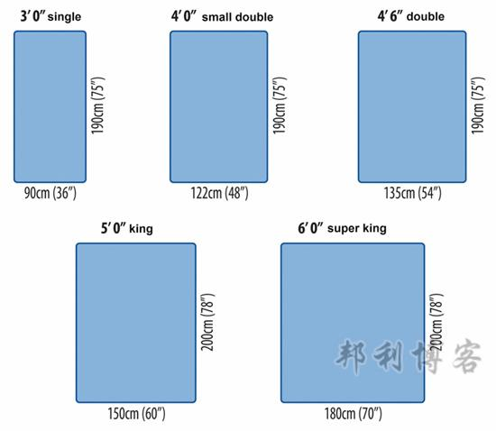
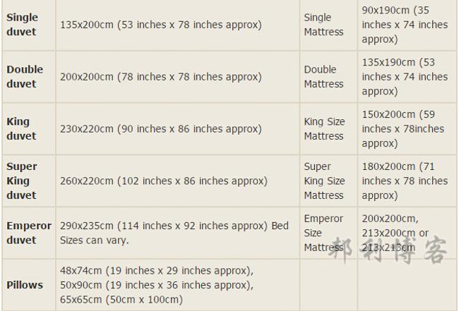
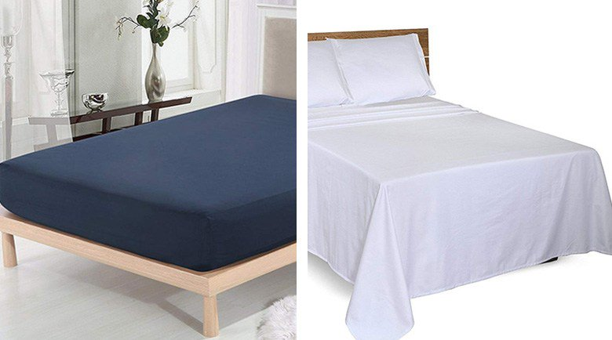

# 中国和英国床上用品尺寸对比及购买指南

------

​                作者:                [                   邦利                 ](https://www.bangli.uk/posts?user=1)

10万+90[2](https://www.bangli.uk/cms/comments/post/12741)[评论](https://www.bangli.uk/#)

​                2020-10-26 更新                              2019-06-04 发布              

------

目录

- 床上用品英文怎么说
- 中英两国床的尺寸差异
- 哪里买硬床垫
- 床上用品尺寸差异
- 从国内带的床上用品，尺寸不对怎么办?
- 床上用品推荐

------

------

不知大家是否跟我有同样的经历：来英国的第一年，邦利从国内带了一套全新的床上用品四件套，结果过来之后，前后买了两床被子都套不进去。明明都买的是Double size，被子似乎总是短了一节，就像一个瘦子穿了一件L号的大衣，怎么看怎么别扭。后来才发现，英国和中国床上用品的尺寸差别很大的，今天就来聊一聊这些中英尺寸差异。

## 床上用品英文怎么说

关于面料的英文单词：polyester 化纤、microfibre 超细纤维、cotton 棉布、duck feather 鸭毛、duck down 鸭绒、goose feather 鹅毛、goose down 鹅绒、wool 羊毛、cashmere 羊绒、Linen 亚麻、flannel 法兰绒

床上用品专业术语：pillow 枕头、pillowcase  枕套、duvet covers 被套、flat sheets 被单或床单、fitted sheet 床罩（直接套在床垫上的床单）、valance 床沿的挂布、cushions 靠枕、bedspreads 床罩、topper & protectors 床垫保护套

## 中英两国床的尺寸差异

### Single bed（单人床）

中国人喜欢宽敞，房子要大的、车要大的、床也要大的，邦利曾经很不理解肥胖率如此高的英国，为什么房子、车子和家里的用品都这么小，有的房子大门小得只能容下一个人进出，胖子可能都要侧身才能进去。英国的床是公认的小，相信在英国生活过的你一定有此感受。

在国内，单人床很少当作家庭用床，一般见于集体宿舍中，比如学生宿舍、员工和军队宿舍。这种床的尺寸一般是90 × 190 cm。欧美的床上用品一般是用英寸(inch，in)为单位的，折合成厘米（1英寸等于2.54cm）。英国的单人床分两种：

Small single（小的单人床），尺寸为2'6" x 6'3"，75 x 190cm和Single（标准单人床），尺寸为3' x 6'3"，90 x 190cm。如果你是单人居住，购买的时候一定要参考一下我们在国内学生宿舍的单人床尺寸，不要买到Small single了，否则一翻身就直接下地了。

### Double bed（双人床）

国内的双人床分标准双人床和加大双人床。

标准双人床床垫尺寸一般为150 × 190 cm，加大双人床，尺寸一般为180 × 200 cm。

而英国的双人床也分两种：Small double（偏小双人床），尺寸为4' x 6'3"，即120 x 190cm和Double（标准双人床），尺寸为4'6" x 6'3"，即135 x 190cm。

那么最大的问题就来了。同样是双人床，英国的尺寸就要小国内的很多很多，这也是很多人来英国不了解尺寸差异，理所当然买了双人床，结果床垫送过来一看：好小！！以为是厂家缩水了，其实这就是人家的标准尺寸啦！

更重要的是现在很多国内的床垫把双人床的床垫做到200× 200 cm了，导致习惯国内尺寸的人来到英国落差就会更大。

### King Size（国王尺寸）

英国比双人床更大的尺寸他们叫做Queen Size（女王尺寸）或者 King Size（国王尺寸），名字挺吓人的，实际尺寸也就跟国内的双人床差不多啦。

一般他们说的King Size就是150 x 200cm，更大的叫做Super king，尺寸是6' x 6'6"，即180 x 200cm，有的会做到200x 200cm。

所以熟悉中国和英国的床垫尺寸差异很有必要，习惯国内双人床的，来英国直接买King Size就对啦，别再去关注Double Size了，除非是儿童用床或者学生用床。

延伸阅读：[如何在英国买床架](https://api.bangli.uk/post/296129)

## 哪里买硬床垫

很多华人都反映英国的床垫过于软，感觉人躺下去，整个床垫都陷下去了。这里邦利给大家[推荐几家床垫做得很好很舒服的品牌](https://www.bangli.uk/post/284197)。

想要买硬床垫的直接去mattressnextday网站，选床垫的时候直接选“extra-firm”的，这是目前为止我能为大家找到的英国最硬的床垫了，一般商场最硬的是“Firm”，几乎没有看到extra-firm的。链接：[https://www.mattressnextday.co.uk/firmness-extra-firm](http://www.awin1.com/cread.php?awinaffid=210595&awinmid=7807&clickref=12741&p=https%3A%2F%2Fwww.mattressnextday.co.uk%2Ffirmness-extra-firm)

还有几个我个人比较喜欢的床垫品牌，分别是：

第一个是Premier Inn，什么，Premier Inn不是[英国的连锁酒店](https://www.bangli.uk/post/11348)吗？没错，Premier Inn以他们家逆天舒适的大床而闻名，每张King Size的床垫拥有1000多个可拆卸的独立弹簧，并可以根据客人的需求随时增减，如果顾客睡得满意，甚至可以立刻拍板把它买回家。如果你不住酒店也没关系，[Premier Inn官网](https://www.awin1.com/cread.php?awinaffid=210595&awinmid=3916&clickref=12741&platform=dl&ued=https%3A%2F%2Fwww.premierinn.com%2Fgb%2Fen%2Fwhy%2Fsleep%2Fbuy-our-bed.html)可以预订床垫，送货上门，让你在家也能享受酒店般的舒适。这也是邦利的“终极梦想”（就这点出息！！！）下次搬家后一定要买一张超级超级Super King Size的Premier Inn床垫；

第二个品牌是无印良品的床垫，他们家的床垫也是超级舒适，软硬适中，价格适中。做工精细，线条流畅简约，没有多余的装饰，只做舒适度高的床垫。缺点是床架一般般，简单的木质床架，稍微有点矮，如果对床架有所挑剔的可以只买他们家的床垫；

第三个品牌就是宜家，这个不用介绍太多，大家在国内估计多多少少都有买过他们家东西。他们家东西非常适合学生以及刚参加工作的白领一族，性价比较高，选择性也很多，舒适度一般般，也要看你会不会挑了，最好去现场感受一下实物。

具体请查看[英国宜家卖场分布](https://www.bangli.uk/post/11960)。

## 床上用品尺寸差异

国内的床上用品做得很人性化，一般都是四件套打包出售，里面包括两个枕头套、一个被套、一个床单，而英国很少有四件套的说法，顶多也就是三件套，床单一般是单卖的，而且跟国内的很不一样，一会邦利会详细说明。

先来说说被子，大多数人纠结最多的，也是邦利刚来英国很头痛的。英国的被子尺寸跟国内很不一样，导致国内带过来的被套在这边根本找不到适合的被子。

### 被子尺寸

国内的单人床被套（Single duvet）尺寸为150x200cm，英国一般有两种：120 x 140cm，135x200cm；

国内双人床（Double duvet）被套一般是200 x 230CM，是长方形的，而英国的大部分双人床被子和被套都是正方形的，200 x 200cm；

另外英国还有几个尺寸为King duvet，225 x 220cm；

Superking，260 x 220cm；Emperor，290 x 235cm（大小还有有些偏差），而国内双人加大号的规格也就是240 x 270cm，所以两个国家的尺寸根本不搭调。

这里邦利也建议不用从国内带被套过来，统一这边买相同的规格就好。

### 床单尺寸

关于床单，麻烦事就更多了。首先，英国的床单是单独买的，没有四件套的说法；

其次，中国人习惯用大床单，顾名思义就是将整个床垫铺满，四周还能垂下来，就像一张大桌布一样。

而英国的床单分两种，Fitted sheet 和 Flat sheet，这二者有什么区别呢？

Fitted sheet 又叫床笠，就是有松紧带可以包紧床垫的布罩，这个是他们用得最多的；而Flat sheet才是指和中国一样铺在床上的床单，就是四周可以垂下来。

关于英国床单的尺寸，单人床的Fitted Sheet尺寸一般为90 x 190 x 26cm（26cm是指深度，即包裹床垫的部分），Flat Sheet尺寸为180 x 260cm；

双人床Fitted Sheet 尺寸一般为150 x 200 x 26cm，Flat Sheet 尺寸为265 x 275cm；更大的还有 214 x 214 x 26cm和320 x 300cm。购买的时候大小还有调整。

## 从国内带的床上用品，尺寸不对怎么办?

邦利经常遇到一些留学生从国内带被子、被套来英国，结果发现国内的尺寸和英国床上用品的不一样，买不到相应的尺寸，怎么办呢？

[购买链接](https://www.awin1.com/cread.php?awinaffid=210595&awinmid=2547&clickref=12741&platform=dl&ued=https%3A%2F%2Fwww.thehut.com%2Fbedding%2Fin-homeware-washed-cotton-duvet-set-blush%2F11928568.html)

遇到这种情况，大家可以到[thehut.com](https://www.awin1.com/cread.php?awinaffid=210595&awinmid=2547&clickref=12741&platform=dl&ued=https%3A%2F%2Fwww.thehut.com%2Fcatalogue%2Fhome-garden%2Fshop-by-category%2Fbedding.list)这家店去买床上用品，他们家有些床上用品有中国尺寸，买的时候一定要看清楚，有特别标明china。Single (China) 是200cm x 150cm，Double (China)是215cm x 180cm，被子被套都有。

## 床上用品推荐

在邦利看来，床上用品都是贴身用的，一定要讲究舒适度第一，质地一定要纯净、柔软、轻薄、舒服。

在英国购买床上用品，如果要看舒适度的话，有一个指标可以参考：Thread count。

这个是个什么东东呢？Thread count，中文叫织物经纬密度，表示一平方英寸中织物的密度，也是衡量寝具用品的舒适度标准之一，针数越高表示密度越大越细密，质感提升，感触更加柔软，当然价格也更加昂贵。比如200tc、600tc 、720tc等不同的数字，数字越高，表示舒适度越好，当然价格也越贵了。

就床单而言，一般400tc以上的就算是非常舒服的了，大家要购买的时候可以关注一下这个指标。

我个人觉得The White Company家的选400tc的就能抵过其他品牌600、800tc的。

我在[英国床上用品购买指南](https://www.bangli.uk/post/296100)一文中有详细推荐。

### The White Company 床上用品

如果大家想要舒适度高的，给大家推荐The White Company，英国一家专门做高端寝具的品牌，产品做工非常精细，原料选择上也尤其讲究。我刚来英国的时候就买的MS的普通床上用品，后来经朋友推荐入手了The White Company 的一整套床上用品，第一次感受什么叫高档寝具带给你的高质量睡眠体验，然后就再也回不去普通寝具了，真的差别太大了。论柔软度、亲肤度、舒适型，The White Company 都是星级标准的体验。

The White Company 的羽绒被更是值得推荐，有对比才有伤害，之前用过宜家的羽绒被，后来换成The White Company的，我瞬间怀疑在宜家买的是“塑料羽绒被”，太硬了。我周围还有很多朋友在The White Company 打折（他们家经常打折）的时候会买他们家的羽绒被寄回国，国内同品质的羽绒被天价，寄回国也比国内买便宜很多。而且质感比国内很多大牌都要好很多。

官网：[https://www.thewhitecompany.com/uk/](http://www.awin1.com/cread.php?awinaffid=210595&awinmid=4802&clickref=12741&p=https%3A%2F%2Fwww.thewhitecompany.com%2Fuk%2F)

### in homeware 床上用品

in homeware 是英国本土的北欧极简风床上用品品牌，性价比极高。特别推荐他们家的水洗棉（washed cotton）莫兰迪色四件套。水洗棉是最近几年国内比较流行的织物，采用**色织高支**（先染色，后织布，且织数密度高，色牢度高，天然环保）纯棉布为原料，经过双面热烫处理等多道水洗工序，使面料更柔软亲肤，质感有些旧旧的，保暖性和透气性都非常好，是裸睡爱好者的终极之选。

而且考虑到很多留学生会从国内带床上用品，**in homeware四件套还推出了中国尺寸**，大家购买的时候注意看尺寸标注。

官网：[https://www.thehut.com/](https://www.awin1.com/cread.php?awinaffid=210595&awinmid=2547&clickref=12741&platform=dl&ued=https%3A%2F%2Fwww.thehut.com%2Fbrands%2Fin-homeware%2Fpromotion.list)

