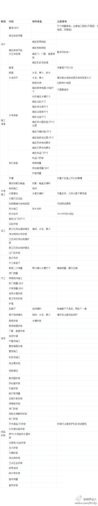
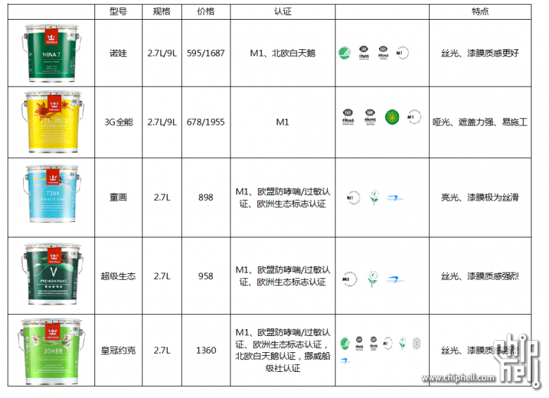

[TOC]


# 装修公司


```
兴丰
互联网家装坑太多，装小蜜配签的碰到互联网家装，每次发现问题很多， 签约成功率比较低
```


## 工作室


```
我找的是工作室，虽然他们一年下来单子没大公司量大，但是所有人都特别负责。。。感觉好幸运。。。
有时候半包找工作室更好，工作室的人是自己要做口碑的

陈萍工作室  我把她手机告诉你  
13003639340

多问一句啊，你选的是哪个设计师和项目经理啊。

他们没有特别分的  都是总管的
```


# 装修流程





# 人工


```
1.拆墙：40~60块一平。
很多工长能报价到70、80一平。

2.铲墙皮：5~8块一平。
很多报价报铲墙皮8块/平方，但实际施工时说要铲到基层加4~8块/平方（正常铲腻子就应该是铲到基层的，露出石膏层或者沙灰层），说这是耐水腻子很难搞要加4~8块/平方（这个是合理的，不过通常加5块），如果还要铲除壁纸再加4~8块/平方（纯坑）。轻轻松松翻几番，花招玩得叫个炫。
其实不管墙上是什么，铲墙皮都是一铲子的事。除了耐水腻子费点劲，这货比较坚挺。

3.墙面拉毛：15块一平，经常故意漏掉。
为什么要故意漏掉？这样看起来报价会低一些，在你比价的时候，能更容易中标，但是后期肯定会让你加上的。行话叫漏项，漏掉一些后期必须要做的项目。
要是不拉毛，墙上贴的砖那是要止不住地往下滑滴，所以要通过拉毛制造粗糙不平的摩擦，摩擦摩擦~~
拉毛

4.地面拉毛：这个真没有。
地面根本不需要拉毛，压根不用担心瓷砖把不住的情况。这种行为行话叫恶意增项。

5.厨卫贴砖
工长量房肯定都是量到房顶的，算面积也是算到房顶的。可是别忘了，厨卫要吊顶的。吊顶里的墙面一般不贴砖，所以这部分面积就是工长白赚的。
贴砖报价50块/平方，瓷砖勾缝另加10块左右/平方，大于或小于平均规格（300mm~800mm）的砖会加价特别高，比如200mm*200mm在原来基础上再加30至60块/平方。防不胜防啊。

6.一般刷漆门洞和窗户应该刨出去，好多工长这时候就开始演绎选择性忘记了，全给你算进去。

7.墙固
刷墙固和墙面刷界面剂，分开收费，其实界面剂就是墙固。。。。等于工长收两回钱。

8.贴布
墙面贴布只有轻体墙、新建墙体或墙面不平用石膏找平的地方才需要，有时候工长会让你全贴了。

9.地面找平
地面铺砖不需要找平，只有铺地板才需要地面找平
```


## 拆旧


* 19楼上据说比较出名的龙师傅

  ```
  15968199742 龙师傅
  ```

  ​


# 组件


```
最舒服的是地热源泵，水机这种

其次中央空调，地暖

然后普通空调
```


```
先来解释：两种不同系统内外机怎么连接方式，才更容易解答：两种系统的优缺点。

氟机的主机与室内机之间采用铜管相连，以含氟或者不含氟的制冷剂作为冷媒在铜管内输送。
水机的主机与室内机之间采用水管相连，水管内通过的是水，以水作为制冷介质输送。

氟系统优点：温度调节精度高、室内外机都能变频、节能、噪音小、使用维护保养简单方便。但由于氟机：设备和管道成本高、安装对现场焊接等技术工艺水平要求很高，因此初装成本比较高。广泛适用与别墅和电梯公寓，别墅氟系统空调占有率达九成以上。代表品牌以日系为主：东芝、大金、三菱等，其中东芝中央空调是行业公认的噪音低和节能的中央空调。

水系统中央空调一般用于大型建筑或不担心噪音问题的别墅用户，以高端写字楼为主。代表品牌以美系为主：约克、特灵、麦克维尔等，其中约克空调是美国最好的空调。
 水系统优点：
1:设备预算相比氟系统低。
2:还有个：由于送风温差会小点，直吹不会让人感觉太冷或者太热，舒适度要高些。
 缺点：
1:由于管道里水温温差很大，风机盘管容易氧化腐蚀，而且水管连接更多采用罗纹丝接，时间久了容易出现漏水隐患，对装修顶面的破坏较大。
2:一般大型中央空调蒸发器都需要定时清理和酸洗，但家用水机不方便清洗，长期使用，容易产生水垢堵住：冷热交换器后，工作效率将衰减，堵到不能使用，更换交换器费用昂贵。建议使用水机的客户同时安装软水机过滤水系统的水。
3:由于内外机都是定频压缩机和电机：节能性没多氟机好，且噪音相当大，不适合联排别墅和对噪音要求低的客户。
```


## 台面


* 杜邦可丽耐
* 石英石
  * 赛丽石 - 西班牙
  * 赛凯龙 - 国产
  * 凯撒金石


## 窗户


```
全屋换断桥铝窗户，室温能提升2到3度 

断桥铝的保温效果并没有新装平开塑钢好，金属导热好

断桥铝窗户中间是塑料的不是金属。
而且窗户散热主要原因是不严，漏风，而不是材料传导。而断桥铝密闭效果，隔音效果都比塑钢强多了。 

家里窗户换断桥铝，三层玻璃，再不行就在室内和阳台间多加一道门联窗 
还不行，就看楼体保温，加保温层，不过这就是重新装修了 

```


```
那种泡沫塑料保温棉很吓人，是助燃剂，上海出过事，施工时保温棉着火，全楼上下住户死了若干人。岩棉保温对人体有害，早已禁用。玻璃棉保温怕水，夏天漏雨进去就成了一坨了。
唯有黑色橡塑保温棉阻燃、防水，价格最贵，看施工企业有没有良心了。 
```


```
先聊聊主材中的窗户吧。

窗户的样式也是一直发展的，从铝合金到塑钢，到现在的断桥铝。

断桥铝密封、保温、隔音、耐久等等都相对来说要比以前的材料都好一些，但是造价也贵，也最容易被坑。


先说断桥铝窗户的报价吧


一般放在台面上的报价有：

1. 铝材窗户。主要是窗框、窗扇和普通玻璃，凤铝/忠旺报价一般在500元/平以上，如果太便宜，那基本是摆明了要在辅料上坑的。

2. 五金件。ROTO平开上悬一般在450以上，据说ROTO假货极多，遇到价格便宜的一定要多留心。

3. 拐角立柱。一般200左右一延米。L型窗需要一根，U型需要两根。

4. 纱窗。普通的一般100，意美达一般150。


如果你认为装窗户只需要掏这些钱，就太天真了。


常隐藏起来的辅料/增项有：

1. 开窗超扇费。比如10平米只让你开3扇窗，想不留死角多开窗？不好意思请加钱，200多一扇。
2. 密封胶/发泡胶。价格不包打胶的话，轻松打出上千元。最好事先谈好打神马品牌的胶，免得商家用劣质胶。
3. 最小面积。单开窗不足1平按1平，对开窗不足2平按2平。
4. 横梁。阳台内开窗想低于晾衣架的话，一般要加横梁，1延米100多。
5. 铝管窗框/副框。想装窗套？合页不能紧贴窗框，需在两边各加个铝管/副框，200多1延米。
6. 改色。白色不好看？不好意思请加钱，改色30-50元一平米。
7. 钢化玻璃。单块超过1.5平的玻璃一般需要钢化，几十块一平。
8. 开孔。在玻璃上打烟管孔。
9. 定位器。一般会送，也有js会收钱。
10. 四连杆。如果是外开窗，商家会告诉你普通定位器阻力不足以抵抗大风，要安装一个四连杆，价格100-200不等。
11. 镀膜费。如果想从外面看不到里面，但从里面可以看到外面，就需要镀膜。当然免不了镀膜费，如果商家不能做low-e膜，尽量不要镀膜，其他的镀膜都很影响室内光线。

所以下订单时候，一定要谈清楚哪些要收钱哪些不要：
1.跟厂家确定清楚铝材的尺寸型号和厚度、材质、几道封闭，每平米价格。
2.有无损耗，是否不足多少平米按整数算。
3.每平米的费用除了铝材和窗户还包括什么等。
4.最好出窗户尺寸图纸或者画一张图，让销售明确的标出来，哪些地方不收费。
5.所有单价和费用都确认以后，计算一下总价，看每平米的费用是多少，如果太低，商家肯定能在其他地方找回来，适当的利润还是要给。

有些商家报价只要两三百一平，但是到安装的时候什么都另外加钱，到时候就很被动了，尽量最开始要把所有的价格写清楚。 
```


```
详细说说窗户的测量。装一个好窗户，测量是前提。窗户量不好，就装不好。


1.大部分人家的阳台墙不是完全水平/竖直的，同一个平面需要在多处测量，避免有大缝隙/安不上的杯具发生。
2.量窗户不仅仅是量准尺寸，还要问清楚常测量结果、计算方法、有无耗损等，如果小窗户比较多的房子，耗损算下来会很大。
3.量窗户的时候，最好有工长在旁边，看是否需要预留施工尺寸。窗户的尺寸不等于拆旧后墙框的尺寸，因为要考虑贴砖、包边、窗台石、吊顶的减扣。
4.同一个方向尺寸上，要多量几次取最小值！因为墙有变形，特别是老房子，修的时候就不一定横平竖直，拆旧时候也不一定拆平。
5.测量时间上要早，拆旧期间就动手测量，因为断桥窗户制作周期一般7-15天。
6.测量前有条件尽量去工厂，现场看样品做工，重点看45度组角和防水胶的工艺。
7.付费模式基本都是下订单的时候给定金一百到几百元，设计师量尺寸后给一部分，安装或验收后给尾款。
8.如果在阳台做饭，烟管在窗户上打孔的情况，一定要和测量设计师说清楚。窗户安装完成再打孔，容易把玻璃打碎。不过窗户玻璃上尽量不要打洞，雨水大可能从洞里流进去，中空玻璃里面会存上雨水。 

———窗户  窗户  装窗户———

三分料七分工，不要以为买了个好牌子就一切OK了，安装的工艺细节一定要留意。

有朋友用的是德国旭格，材料是进口的，但是安装的人非常不靠谱，被外包给一个小包工头，后来窗户渗水，玻璃压条质量很差，诸多问题。那么贵的窗户算是白买了。

装窗户最基本的要注意下面的几个细节

1. 一般需要一整天来安装，安装窗户是高空作业，一定强制要求工人系安全带，否则出事儿业主绝对脱不开责任。
2. 安装的时候，窗体尽可能靠外一些，不要超过防水沿就行，这样窗台能宽一些。
3. 最好全程盯着，别装歪装斜了，返工比较困难。
4. 打胶也很重要，发泡胶要打得足一些，不留空隙。密封胶要弄的整齐一些，不能乱抹一气完事，否则很丑。
5. 外面紧贴防护栏的，一定要预留纱窗安装位置，见过一家纱窗装不上导致返工的。
6.安装窗户尽量应是贴砖之前要在瓦工离场前，因为一些窗台需要瓦工抹平收口
7.刚安装好窗户尽量避免扬尘类的施工和清扫，防水胶12小时才干会沾上灰尘
8.先安装所有窗框，再安装所有窗户，如果要安装护栏，一定要在安装窗户之后进行
9.装修完成后，再约时间安装纱窗。一般商家安装窗户当天都会安装纱窗，后期装修往往会弄脏纱窗。分开安装保证纱窗不会被施工过程弄脏，如果发现窗户有细节需要微调，也可以在第二次上门安装纱窗时解决。 
10.有专门做纱窗的，比窗户商家的要便宜，装的也好。如果感觉有必要，纱窗和窗户可以分开买。
```


## 拆旧


```

求拆旧师傅电话
18803637109 我家找他拆的 挺干净
```


## 地暖


```
不是有人说地暖找杭州什么 燃气公司弄。能一个月1500封顶
孔车
孔车
可以打一下燃气公司电话问下，1500一个月很便宜了
娇杏
娇杏
燃气公司弄只是安装一个燃气表，管道和设备得自己买

燃气公司我也不知道，之前是看到网上这样发的，实际是不是1500就不知道了
难道是单独气表做了封顶计费吗？ 666
137人未读
娇杏
娇杏
不过走燃气公司的话，应该温度开不到很高，听说十几度吧
温度不是设备控制的吗？ 限制气流速度？
157人未读
娇杏
娇杏
@孔车  你地暖的设备也是自己买的吧？锅炉，管道
```


## 瓷砖


```
厚雪
设计师给我说，就去杭陶买小牌，很多都是广东产的，都差不多。
一线的阿波罗、诺贝尔水分都比较多
```


```
4、瓷砖大理石
瓷砖的发展也从早期的瓷片，需要用水泡发展到现在的全瓷砖。全瓷砖常见分类有：釉面砖、通体砖、仿古砖、玻化砖、抛光砖。常见瓷砖品牌国内产地主要集中在广州佛山，国内品牌有：诺贝尔、马可波罗、东鹏、冠珠等。进口品牌有意大利IMOLA小蜜蜂、意大利MANGO芒果等。最终选择了HQ花岗岩通体全瓷瓷砖。
现在比较新的技术是采用圣戈班伟伯重砖粘合剂薄贴法，但是老家师傅只会传统的水泥沙子厚贴的方法，墙面增厚了足足1cm。

大理石的发展也从早期的各种红，衍生出进口的莎安娜、奥特曼、深咖、黑金花....主要产地来自伊朗、土耳其、叙利亚等中东国家。
上面是常见的大理石品种，高端的五号仓拍到了价值大几千一平的彩色大理石，作为装饰面还是很棒的。家里这次装修采用的简约风格，大理石仅用于门槛石、飘窗台、洗漱台这三个地方。

补充一下美缝知识，研究下来目前市面上最好的材料就是意大利马贝的环氧填缝剂，最终选择的马贝149这款型号。
```


IMOLA

```
我家邻居，是美剧爱好者，家里装修走的是美式豪宅路线，用的装修材料都是顶级的，单说地砖一项，用的是居然之家里最贵的瓷砖IMOLA；200块钱一块的小花砖，贴了一面墙；大金中央空调，同样的户型，别人家都是一拖六，他家装的是一拖九，用两台室外机。

这么高档的标准，我想都不用想，他家的龙头、花洒、马桶这些最能体现装修档次的东西肯定用的是汉斯格雅（Hansgrohe），甚至唯宝（Villeroy Boch）。
```


```
首先，不同的空间，对砖的要求是不一样的，要注意特殊区域的砖的选择。如厨房的地砖、卫生间的地砖都要挑釉面砖，可防油、防污、防滑、防渍。

1．客厅适合的砖
客厅环境受温度、污染影响比较少，相对来说是比较良好的环境，对瓷砖本身功能性的材质要求不是很高，唯一需要注意的是要根据客厅的光线、个人喜好来选具体的花色，玻化砖可选。 玻化砖因为表面光亮，所以漂亮，同时耐磨性高，但是存在色泽单一，易脏，不防滑和容易渗入有颜色液体等缺点，这种砖一般都比较大，主要用于客厅，不用于卫生间和厨房等多水的地方。客厅用的最多的是500*500和600*600的地砖，如果客厅面积在40平米以上，才考虑用800*800的地砖。小面积，地砖太大铺装的时候损耗大，也不好看。

2．厨房、卫生间，阳台适合的砖
厨房的墙面一般选用的是亮光浅色的墙砖居多，因为厨房给人的感觉就是干净、整洁、轻松、愉悦的，太深的颜色会显得有些压抑，亮光的瓷砖更好清理污物。如果考虑用亚光砖来作厨房的墙面的话，最好选用表面是平面的，不要选用那些有凹凸感的，主要是要便于擦洗。卫生间没有油烟，墙砖的选择要多一些，自己喜欢什么就用什么了。

3．厨房、卫生间、阳台等区域地面砖
这些区域因为用水较多，很容易地面湿滑。应该选用亚光防滑的瓷砖。规格建议300×300或者330×330，卫生间和厨房面积比较小，大的地砖并不好看，另外卫生间的地面要求向滴漏处倾斜以方便流水，大尺寸的地砖就不好做坡度了。颜色方面，尽量用深色，因为厨房卫生间地面经常有水，水和灰尘和在一起是泥，泥是深色的。如果地面是浅色，特别难看。如果你家用地暖取暖，建议你全部用地砖，地砖的导热性比地板优越的多，木材导热系数很低。地砖大多都比较环保，比多数地板产品都要好很多。


————继续瓷砖——————————


记清楚买瓷砖的时候都要注意什么，别让奸商坑了你

每个房间购买墙砖和地砖的数量让工长给你算好列一张单子，瓷砖宁可买多了不能少，因为不同批次的可能会有色差，到时候补货不一定能补到同一批。商家一般给你算的都是足够的，不用特意指出。

买瓷砖的时候商家给你的报价是每平米多少钱，实际上我们付钱的时候是按照每片多少钱来付的，用“工长给你列的最终要购买的瓷砖面积”除以“每片瓷砖的面积”计算出要购买瓷砖的片数。片数那里是商家给你开出库单子的时候给你算的，很多商家会四舍五入，老是舍你就亏了，这个你要心里有数。


你买瓷砖的购买单位是片，不是箱。你收货的时候一定要点清楚了片数对不对，不要让商家笼统的跟你说多少箱你光盯着箱数忽略了片数把你弄糊涂了，吃了亏自己都不知道。

关于买瓷砖
1．上面提到的平米数和片的问题
2．合同里约定能免费送上楼。
3．要写清数量和单价，单价要以“块”为单位，而不是每平米。退的时候也是论块儿。
4．合同里约定不泡水的可以无条件退。还有记得泡了水的砖是退不了的，所以叮嘱师傅，随用随泡。包砖的纸盒最好也留下几个，有的商家要求退的时候有原包装。
5．合同里约定能免费上门退货和免费再送一次补货。（万一需要）
6．买砖要计算损耗，退货要问清条件，订单要详细，损耗在标准面积上增加10%，以免补砖时有色差或断货。
7．最最关键的是：收货时要检查好砖有无磕角破损，如果发现问题砖可以当场拒收，若觉得没有大碍也一定要留下字据证明这砖是收到就有问题的。 一般合同里都会写明瓷砖是易碎品有轻微的破损不算质量问题，店员也会告诉你如果磕个小角什么的最后铺在墙角或者裁砖时切掉就行了，的确是这样。但是！如果最后你剩下的砖有轻微破损，店里是一定不会给你退的！


现在很多商家和工长唱双簧，把50元的砖要价100元，工长出面80元成交，最后工长找商家要回扣。一般这种情况，工长都会违心的说这砖质量好，买的如何划算之类的……

能跟商家免费要的：
1.勾缝剂，送足量。起码送美巢或唐姆的。
2.花砖等砍完价快写合同的时候再提出送两片。
3.贴瓷砖的小卡子要送。
4.如果你不讨厌阳角条，这个也可以送。
5.踢脚线也是可以送的，厨房和卫生间用不到因为有墙砖。如果是客厅卧室等就需要用到踢脚线，要不墩地的时候就把墙弄脏了没法擦。 


买瓷砖的时候，能省就省 

1.厨房因为有大面积的瓷砖被吊柜、橱柜覆盖，阳台我们也准备摆放柜子增加储物空间，所以这两个区域的墙砖可以选用小品牌的特价砖铺贴，可以省一笔；

2.多转几个卖场，多转几个卖瓷砖的商家，货比三家，争取每一家都多看、多聊、多咨询，最终确定一到三家作为重点购买对象和砍价对象；

3.瓷砖就算工长算的再准确难免工人铺贴磨角的时候也有点损耗，所以补退都是难免的，尽量就近买，这样省油费。除非你跟销售谈好了他们出车给你买免费补退2次。如果一个样子就剩下一两块就不必退了，以后万一有修修补补的有用。

4.买瓷砖的商家大多提供裁切服务，可以把大砖切小，或者用地砖裁切踢脚线，一般裁切价格是一元一刀。同样花色的瓷砖往往有不同规格的，单位面积上，小尺寸的瓷砖价格要远高于相同花色的大尺寸的瓷砖价格。厨房、卫生一般要用小尺寸的地砖比如300*300的，你可以考虑买600*600的相同花色的大地砖，再让商家给你切割成300*300的，这样可以省不少钱，缺点是，有可能尺差会大一点，解决办法是，把地砖和地砖之间的缝隙留大一点，一般就看不出来有区别了。注意，如果要这样切割，原来的大砖必须是切边砖，就是边沿是非常平整的砖，如果大砖有圆角，而切开的边沿是直角，这些砖就没法贴到一起了。这个看你自己了。

5.当你看好了一款砖要知道瓦工铺贴太小的砖是要加钱的，斜铺也是要加钱的。这都属于成本，可以跟工人好好谈谈，有的也不加钱了。


——北京哪里买瓷砖最好，又便宜————


买瓷砖的时候可以先去离家附近的建材超市去看样品，记住品牌和花色，然后到瓷砖仓库去询价。北京市最有名的瓷砖仓库是十里河的闽龙，小蜜很多业主都是在闽龙定的瓷砖。

还有丰台小井附近的瓷砖集散地，如果是工长带着买会便宜不少，不过小井以大宗杂牌砖为主，品牌砖为辅。丰台小井，也叫七里庄，实际上都是一个地方。这里的瓷砖不仅样式花色齐全，而且价格便宜，容易砍价。

如果是在仓库购买的瓷砖，一般仓库只负责销售以及经销商大批量的配送，不会管小量配送。有些朋友觉得自己有私家车，但是用私家车做拉砖车实在不是明智选择，因为损耗太大，很容易将车弄伤。如果自身没有此类资源的话，不建议就近买砖。

除了十里河、小井之外，北京比较有名的瓷砖石材市场还有东方家园、好美家等，但是这里的瓷砖鱼龙混杂，种类虽然多样，价格也便宜，但是质量一般，杂牌子砖比较多，选择面较窄。

如果有条件，时间不是很着急，建议去郊区看瓷砖，因为同品牌的砖，有时候各个郊区县的店面会比市区店面便宜，原因主要是：1 郊区销售量小；2 店租便宜；比如小蜜业主就在大兴的居然之家买到比较划算的瓷砖，可能是开业时间短加地租便宜，很多品牌都比城里价格低！


————很多业主都纠结地砖上墙的问题，咱们也聊一聊————

地砖上墙成了近年来比较流行的一种装修方式，很多业主在购买瓷砖的时候，都会被推荐用地砖当墙砖使用，有的用在电视背景墙、沙发背景墙等装饰墙面，有的则用在厨房和卫生间的墙面。

1.地砖上墙到底好不好呢？

地砖上墙的优点：地砖上墙是现在流行的铺贴方式，尤其是自建房或别墅，可以让装饰大气、美观、有档次一些。

地砖上墙的缺点：墙砖和地砖的物理特性不同，墙面砖吸水率大概10%左右，而地砖吸水率只有1%。地砖吸水率远远低于墙砖，容易造成空鼓；墙砖是釉面砖，更容易清洁；地砖上墙人工费高，施工难度大。

2.地砖上墙要注意：

地砖上墙虽然美观、有档次，但是可能造成空鼓、甚至塌落等危险。
1）看墙体是否适合铺贴瓷砖，检查是否存在空鼓、开裂，墙面的防水、拉毛处理是否合格等问题，如果存在，需要进行整改后再铺贴瓷砖。
2）采用水泥砂浆进行铺贴瓷砖时墙面必须进行拉毛处理，增加墙体与瓷砖的接触面积。
3）确定好瓷砖的水平，将开始铺贴的玻化砖使用木方等做好固定支撑，防止刚铺贴的瓷砖的下坠。
4）墙面过于干燥，可能出现瓷砖与水泥砂浆脱层的情况，墙面应提前一天浇水湿润。
5）铺贴时一面墙不宜一次铺贴到顶，可以一层一层的铺贴，如果整面墙铺贴可能发生下坠塌落。
6）瓷砖未干不可进行勾缝处理，这样会造成瓷砖松动、高低不平。7）地砖没法用水泥贴到墙上，只有两种贴法，成本都相当相当高，一种是全部用粘合剂贴，粘合剂的价格比砖还贵，一种是打架子，这种要占用空间。 
```


### 类型


先来看看哪些品类的砖吧……目前抛光砖是市面上占有率最高，最大众化，同时也是品质最好的一款瓷砖;仿古砖带有自己的独特韵味，带有一种设计感的一种彩釉砖;全抛釉是目前市面上最流行，也是最新技术的一款砖;微晶石就是最漂亮，也是装修效果最好的一款瓷砖;瓷片更适合于我们上厨卫空间上墙的瓷砖，相对来说性价比也比较高。

　**瓷砖界的“高富帅” - 微晶石（价格指数五颗星，贵）**

　　什么叫做微晶石?微晶石其实是由上面一层微晶跟底下的砖坯结合煅烧起来的一种新型、绿色、环保的材料，是目前市面最豪华、价格最贵的品类。它的主要优点就是表面非常光亮，色彩非常鲜艳，防污性强，但它的耐磨性比较差，后期加工、维护比较困难，不适合后期的复杂的加工，所以不适合大面积的铺在室外的场所。

　　**瓷砖界的“屌丝” - 瓷片（价格指数1颗星，便宜）**

　　瓷片一般是指墙面用的表面有釉面的薄层贴片，它跟瓷砖相比两者最明显的差异就是厚薄程度不一，瓷片比较薄。瓷片表面光滑、色彩丰富、吸水率高，一般适合厨卫空间装修。因吸水率相对来说比较高，再加上它整个的釉面比较薄，所以物理性质比瓷砖要差一些，目前很多厂家在装修豪华别墅、豪华房子的时候都基本上不使用瓷片。

　 ** 最受欢迎：抛光砖**

　　抛光砖将原料通过电脑布料压制高温煅烧而成砖坯，然后在砖坯体的表面经过打磨、抛光处理而成的一种光亮的瓷砖。它的耐磨性、平整度、强度、耐腐蚀、抗折度、吸水率等物理性质比其他品类的瓷砖要好，适合应用在家庭大多数地方，目前是整个市场占有率最高的品类。它的主要优点是光亮、耐磨、防污、强度好，能做各种复杂的造型，由于是粉料管道布料，所以它的色彩和花色没有釉面砖那么鲜艳丰富。

　　**最有韵味：仿古砖**

　　仿古砖是从国外彩釉砖演化而来，实质上是上釉的瓷质砖。所谓仿古，指的是砖的效果，应该叫仿古效果的瓷砖。带着古典的独特韵味吸引着人们的目光，为体现岁月的沧桑，历史的厚重，仿古砖通过样式、颜色、图案，营造出独特的韵味。它的主要优点是色彩比较丰富，一般带来凹凸纹，防滑性比较好，相对来说亮度、耐磨性、防污性较差些。

　　**最闪闪亮：全抛釉砖**

　　全抛釉是一种可以在釉面进行抛光工序的一种特殊配方釉，它是施于仿古砖的最后一道釉料，目前一般为透明面釉或透明凸状花釉。施于全抛釉的全抛釉砖集抛光砖与仿古砖优点于一体的，釉面如抛光砖般光滑亮洁，同时其釉面花色如仿古砖般图案丰富，色彩厚重或绚丽。作为一种目前全新的生产工艺，全抛釉无论在材料、装备还是技术层面，都还不是那么完美无缺，如磨损、吸污、露底等缺点。

市面上还有一种通体砖，是一种不上釉的瓷质砖，有很好的防滑性和耐磨性。一般我们所说的“防滑地砖”，大部分是通体砖。由于这种砖价位适中，所以深受消费者喜爱。其中“渗花通体砖” 的美丽花纹，更是令人爱不释手。另外无缝砖\马赛克之类的都是小品类的砖，暂且不讨论。


#### 抛光砖 vs 亚光砖


```
抛光砖的特点：

(1)，优点：抛光砖上的表层颗粒有防水渗透的作用，降低吸水的能力，防止抛光砖被损坏。这样在平时的生活中，使用者无需过多的顾虑抛光砖的实用性。另外抛光砖的重量比较轻、厚度比较薄，这样有利于运输。而且抛光砖基本很少出现色差，这点获得客户的的大量好评，同时这类型的抛光砖具有防滑功能，对于家中有老人和小孩的家庭都十分合适使用。

(2)，缺点：抛光砖的花纹和图案都比较单一，缺少观赏性，不能够达到消费者实用和欣赏于一体的要求。这也是导致抛光砖的销量一直受制的原因之一。

亚光砖的特点

　　亚光瓷砖不吸水，即表示吸水率低，而亚光砖的选购方法比较简单，掂一下砖的轻重，同样尺寸的砖，重的要比轻的好。好砖的手感也比较好，砖面细腻、光滑，而不好的砖，表面粗糙，完全可以用手感觉得到。具体亚光砖的优缺点有哪些，小编为大家解答过，感兴趣的朋友可以看一下。

亚光砖的特点

　　亚光瓷砖不吸水，即表示吸水率低，而亚光砖的选购方法比较简单，掂一下砖的轻重，同样尺寸的砖，重的要比轻的好。好砖的手感也比较好，砖面细腻、光滑，而不好的砖，表面粗糙，完全可以用手感觉得到。具体亚光砖的优缺点有哪些，小编为大家解答过，感兴趣的朋友可以看一下。

两者的区别：

1，亚光砖花色多样，极具个性。而抛光砖受其工艺的制约品种较少，花色相对单调。

2，亚光砖不吸污，易清洁。砖表面附有一层釉面，釉的化学成分是二氧化硅(即玻璃成分)，具有不渗污易清洁的优点。而吸污是抛光砖的致命的弱点，如果有脏污滴在抛光砖上，无论你怎样清洗，都会留下痕迹。

3，亚光砖采用进口耐磨釉制作，耐磨耐用。而抛光砖无釉面保护，时间一长，就面目全非了。

4，哑光砖无光污染。而抛光砖相对显得冷冰，不温馨。
```


#### 鉴别


**1、“竖起耳朵”听声音**

在鉴别劣质瓷砖时，可用硬物轻敲瓷砖，如果有敲金属的声音，说明该砖瓷化程度好，玻化强度高，如果声音沉闷则说明砖没有烧透，质地不够好。

另外可以用手掂量下，同样规格的砖，在手里掂掂，越沉的砖说明其密度越大，硬度也就越高。

**2、“滴滴答答”测试吸水率**

作为瓷砖的又一衡量标准，瓷砖的吸水性能是消费者选购产品时倍加关注的话题。一款吸水性能差的瓷砖，不仅用的难受，更会让人焦虑，时刻还要考虑它是否会脱落。在选购产品时，消费者可以在瓷砖的背面滴些水，渗得越慢，说明其质地越密，内在品质越好。注意这里应该比较同类瓷砖，有些商家玩猫腻会把玻化砖和普通釉面砖混在一起测，以说明出他家的砖质量好。

**3、“狠心刻划”测硬度和密度**

容易摩擦出划痕的瓷砖相比它的性比较不会太高，若何鉴别这样的了劣质产品，消费者可用硬物刻划瓷砖表面，看是否容易留下划痕。一般釉面砖会留下轻度划痕，玻化砖比较坚硬，质地好的玻化砖可能完全不见痕迹。

**4、“睁大眼睛”看砖面是否平整**

将两片瓷砖正面合在一起，如两边能见到空隙则砖有上凸现象；中间能见到光亮则是砖有下凹现象，合拼紧密的才是平整度合格的瓷砖。


**下面要说的是去市场里看瓷砖的方法了：**

首先看瓷砖的横截面，尽量选择没有截面分层的，一体的瓷砖，就是肉眼看过去瓷砖的横截面是一色的，一般这样的砖是彻底烧透的，没有烧透会有什么样的结果呢？就好像你去公共厕所经常能闻到的味道或者如果你家里面拖过地板就能闻到腥臭味？这都是因为砖没有烧透，说明这个砖密度低，把水吸进去后没法蒸发，就变成了臭水了！你家有这种现象么？（好吧！恭喜你中奖了！这个问题除了拆地板没有其它清理办法了！）

带上尺子去市场。为什么呢？因为即使样品大多数是好的情况下，还是要严谨一点。带尺子量瓷砖的厚度是否一致是判断瓷砖品质的另一个方法。厚薄都不一致了。这款砖能好吗？

砖的规格尺寸上现在瓷砖的发展正往大的方向不断进发，越做越大。比如墙砖，你可能会说当年装修的时候用的都是`200*300`毫米的小砖，而现在，动辄`300*450`或`300*600`毫米尺寸甚至更大的大砖。想买点小尺寸的砖？对不起，很多企业已经都不生产了，即使有也是处理的尾货。所以小尺寸的尽量不要买。

品牌瓷砖的选购我建议多看多问吧，价格实在太离谱，原价480，特价88……这种情况屡见不鲜，可见利润有多高。要省钱，还是要多跑市场才最有用。（我本来也是倾向品牌砖的，但是最后没有买，我实在不想为怕品牌的营销费用买单）


#### 注意


**买瓷砖的特别提醒：**

1、马赛克易掉子难打理，缝隙太多,易脏难清洗，特别是容易掉子，对工艺要求比较高，真的要买一定要买最好的。

2、卫浴间的瓷砖不是越白越好……白色反而用了之后看起来脏脏的，浅色系就好了

3、有人说白色瓷砖不能用，那用黑色总可以了吧，足够耐脏了。其实黑色瓷砖更容易留下痕迹，别提日常留下的水渍，就是带有尘土的鞋子走上一趟，都会留下印痕。（我本来也非常想要黑色，被无数次否决了）

4、不用所有瓷砖都很高级，客餐厅的门面做好就差不多了，阳台墙、厕所的墙面砖一般的就可以了，装修完到实际入住后墙面砖是最不会有清洁、防滑问题的……反而客厅的砖因为用的比较多，要质量好一点，防滑耐磨很重要。

5、算好面积再去买砖。一般来说有两种方法，一种是按面积计算瓷砖片数，其二是按照长度计算腰线的片数。

a.按面积计算瓷砖片数

片数=瓷砖铺贴面积(平方米)*(单片瓷砖的长×单片瓷砖的宽)

如果计算结果有小数，小数点后一般采用“向上取整”的方法计算，即1389片，须另再加上损耗去购买瓷砖。

b.按长度计算腰线的片数

总片数=腰线总长*单片腰线的长

如：腰线长度为10米，选用的腰线的规格为80mm×3mm的砖

小数点后一般采用向上取整的方法计算，所以结果是31片，多买1-2片即可。

我觉得**最方便的方法**还是叫设计师直接CAD里给你把尺寸面积算出来告诉你

6、最好是找熟人买家或者别人推荐的卖家，对于价格模糊、产地不明的一定要问明确。如果实在精力有限，没有办法分辨，你只能多花大钱买所谓的品牌砖了。

7、柜后砖这种一般商家都会送的，要问清楚人工费、切割费、运费之类的费用，如果要买门槛石这种也可以一并买掉。


## 吊顶


```
北御
吊顶的话，边顶、平顶、一级二级价位都不同，欧式简约根据造型不同价位不同
吊顶的话价位也不一样，基本是50 ~ 200之间每平；然后还有什么防开裂处理啊，等价钱另算
```


### 吊顶材质


* 轻钢龙骨吊顶

  ```
  个人强烈建议全屋轻钢龙骨吊顶。为什么？

  1、性价比极高，可以花较少点钱提高设计感。
  2、舍弃单一主光源的局限性，全屋任意布局点光源。
  3、布线可以走顶，开槽可以省好多。

    除了异形顶，建议全部用轻钢龙骨。为什么我就不在赘述了，大家自行百度。反正不要听从装修公司建议用木龙骨。
  ```


###   吊顶高度


```
  一般国内房屋净高度大多在2.75米左右。大多数人担心全屋吊顶会造成房屋净高度降低，造成压抑感。
  装修公司也会这样的理由来说服客户，他们这样做主要因为全屋吊顶太费工夫，关键问题是挣不到钱。
  主要要求如下：
  卧室、客厅净高度应≥2.4米，局部最低≥2.1米。厨房、卫生间应≥2.2米。
  
    本来计划全屋吊20cm顶，局部吊30cm。

  吊顶师傅非常给力，这里要表扬一下。

  竟然主动说，他们能吊到16cm，之前装修公司忽悠人不能掉到20cm。

  阴角留窄缝也能做。装修公司忽悠人做不了，反正装修公司的话就不能信。

  最后实际吊顶高度18cm，担心筒灯高度问题。局部30cm出头。

  现在觉得考虑还不周全，主要是经验不足。

  局部吊顶30cm的高度还是太保守，室内2.75m的净高度，局部吊顶放到40cm正好，为什么？

  在说明这个问题之前，给大家先看2个柜子，再来讨论此问题。

  ...

  yonka 笔者的意思是： 局部吊顶到40的话，再减去地板高度，橱柜的高度就被压缩到235cm以内，这样好做又便宜

```


#### 吊顶设计


### 集成吊顶


```
———集成吊顶———————


1.集成吊顶选购误区？

误区一   扣板越厚越好

实际上扣板并不是越厚越好。市面上的基材厚度超出行业标准范围，通常多属于回收铝，它制造出来的扣板比较厚，但是由于杂质多，所以易腐蚀生锈。分量轻、弹性好、足国标的铝扣板是最好的。

误区二  金属吊顶都环保。

劣质金属板含有重金属，对人体有辐射，含铁量高容易生锈，劣质覆膜易滋生细菌，一些优质的金属板材环保。因此并不是所有的金属板都环保的，而是有极明显的优劣之分。


2.集成吊顶都怎么算钱？ 

铝扣板  

铝扣板是按平米或片计费，如果依片计费比较直观，但是好多人都习惯直接问平米的价格。如果不想被忽悠一定要知道每平米包括多少片扣板。市场上常见的规格是300*300，计算面积时用1除以单片的面积就得出每平米包含的片数。如果是300规格，每平米应该包括11片扣板。

边角  

购买扣板是边角是要单独购买的，规格3米/根，都是整根出售，在安装时3米以下的边角不能接，如果无特殊情况每个房间4根足够了。

电器   

卫生间的照明、取暖、换气，所有电器按台计算。


3.特殊情况收费

水电改造时需电话沟通，确定最终留线问题，以免影响后期电器的安装；

墙砖贴完即可预约上门测量，需提前3-5天预约；

异形包管一般50元/延米手工费，不足一延米按一延米计算，阳角90元/根； 

热水器半包一般50元/台，阳角90元/根（如需热水器半包，需提前安装热水器）；

彩钢顶、保温层、空心楼板等非水泥结构的正常顶一般会收取30元/㎡手工费；

超薄顶（吊顶厚度≤10cm）、超高顶（吊顶厚度≥100cm）一般会收取30元/㎡手工费；

烟管需提前预埋并确定好具体开孔直径及位置；卫生间止逆阀需提前安装好；

燃气热水若有管道走顶内，需提前改好，方可预约安装；


4.啥时候安装集成吊顶？

墙地砖贴完；

厨房阻烟阀安装完成，并确定好开孔位置和直径；

卫生间止逆阀安装完成；

如果有燃气热水器需提前安装完成；

如果电热水器需要半包，也需提前安装好。

如果选购同一个品牌的电器和扣板，电器都是与吊顶同一时间安装。如果购买非同一品牌产品，建议先吊顶后安装电器。
```


## 家具


### 品牌


* 飞美

  据说只用两种板，要么爱格板要么露水河板。拿到的板材都带饰面不带封边，飞美工厂自己封，封边有两种，一种普通封边，一种进口封边。

  * 普通封边是牛头牌热熔胶，号称粘合剂全球第一的德国汉高出品，这个胶是白色颗粒状的，号称无甲醛。

    牛头牌热熔胶包装

    包装里是类似这样的颗粒

  * 进口封边通常只用在白色家具，不用胶，是用激光融化封边带背面，贴到板子上，封边带是德国瑞好封边带。除了切割、开孔和封边，飞美工厂不对板材做其他加工，开孔会根据客户要求开，收开孔费，开完孔也封边。

* 索菲亚

  主打大亚的颗粒板，也有密度板，饰面都是德国夏特。

* 诗尼曼

  主推烟台万华的禾香板，300多到500多一平，也用华洲木业的颗粒板，200多到300多一平。两种板材拿过来都是素板，诗尼曼工厂自己贴饰面和封边，封边用德国胶王。

  诗尼曼禾香板

* KD

  原木和板材都有，板材有颗粒板，爱格板和露水河板的，还有密度板，产品档次高低大概是原木＞密度板＞颗粒板。他家密度板的卖得最好，500多一平，能做造型，漆的颜色多，贴木皮的能达到原木效果还比原木便宜，原木少说8、900，高的上千；爱格板400多，露水河200多。

  KD密度板

* 尚品宅配

  柜体主打18厚的颗粒板，供应商有翰森、威华和其他几家，基本集中在珠三角一带，封边带也用德国瑞好。


* 光明

  定制: 水曲柳柜子按投影面积折算4500一平含柜门，但没说柜体是不是也水曲柳原木

* 华日

* 华鹤


#### 报价


### 木材


#### 报价

* `做家具普通的木料橡木、松木、桦木、水曲柳、柞木、胡桃木、樱桃木、梓木、柳桉等原木的价格都在4000元每立方以内`
* 松木大概1700元每立方
* 橡木大概4000多每立方


##### 2018-03-04从中国板材网查到

- 白松原木 - 700（俄罗斯的900）
- 花旗松原木 - 美国 - 600
- 樟子松 - 俄罗斯 - 400
- 巴西松原木 - 南美 - 统材 - 120 CNY/m^3
- 落叶松原木 - 俄罗斯 - 400


- 橡胶木 - 东南亚 - A - 580 USD/m^3
- 越南橡胶木 - 东南亚 - A - 2750/3200等
- 橡胶木 - 海南 - AB - 2400等
- 橡胶木指接板 - 海南
  * 长1200×宽2400×厚14 200左右
  * 厚16 220
  * 厚18 230
  * 厚20 240


- 水曲柳原木 - 俄罗斯 - 1200
- 水曲柳 - 欧洲 - 特等 - 4000
- 水曲柳 - 北美 - 4000
- 水曲柳指接板 - 欧洲 - 长2440×宽1220×厚26、24、22、20、18、16 - 380/张
- 美国红橡指接板 - 成都 - `2440mm*1220mm*20mm` - 5000 / m^3 （好像约为288/张，估计有缝隙，实际不止）
- 杉木指接板 - 1200 / m^3


- 白蜡 - 北美 - 4000
- 红橡 - 北美 - 3800
- 白橡 - 北美 - 4400
- 白橡原木 - 法国 - AAA - 800


- 黑胡桃 - 北美 - 8300
- 樱桃木 - 北美 - 4800
- 硬枫木  - 北美 - 5000


* 欧洲榉木 - 欧洲 - A - 4000
* 高棉花梨 - 莫萨比科 - 优等 - 2000
* 湖北高山小叶黄杨 - 国产 - 一等 - 2500
* 尼奥维假大叶红檀 - 莫萨比科 - 1000
* 缅甸花梨 - 38000 / 吨
* 美国黑胡桃原木 - 美国 优等/特选 - 7000
* 黑鸡翅木 - 非洲 - 优等 - 1300
* 红木非洲紫檀 - 非洲 - 优等 - 1180
* 花梨木原木 - 缅甸 - 优等 - 12000 / 吨
* 桦木原木 - 俄罗斯 - 特等 - 400
* 黄花梨木材 - 非洲 - 优等 - 1300
* 黄花梨原木 - 非洲 - 一等 - 3000
* 鸡翅木原木 - 非洲 - 特选 - 4000 （缅甸-优等-3500）
* 檀香原木 - 非洲 - 特等 - 24000 / 吨
* 小叶紫檀 - 非洲 - 特等 - 45000 / 吨
* 阴沉木 - 国产 - 统材 - 1800000 / 吨
* 红榉 - 欧洲 - AB - 2950
* 绿檀原木 - 阿根廷 - AAA - 3800


##### 2018-03-04阿里巴巴查询


* 水曲柳
  * 百尊牌指接板 18mm E0 `1220*2440*18mm` 500出头/张
  * 直拼板六七百一张，四五千一个立方
* 红橡
  * 鑫兴 美国北部红橡直拼板 `1220*2440*18mm` 440/张
  * 原木 七百多八百多
* 新西兰辐射松指接板 一百多两百多
* 橡胶木
  * 指接板 两百多
  * 原木 两千左右一个立方


## 家电


## 防水


**卫浴间防水高1.8米**

**非淋浴墙原则上防水涂料不能低于30厘米**。但为了强化防水作用，建议统一做到180厘米高，防水做低了，长期喷淋造成水浸透墙体，会使墙体霉变、墙面装饰层涂料或面砖剥落。对于厕浴间改造的轻体墙和自建轻体墙，建议防水高度做到顶部。防水涂料目前国家验收规范的**1.5mm厚**。


**阳台,厨房有地漏也要做防水**

厨房洗菜时，厨具会不同程度有水溢出，易造成水沿着地漏的缝隙渗漏，因此厨房尽量做防水保护。建议厨房地面及墙体上翻30cm做防水，在洗菜盆安置的墙体和阳台有水龙头的上翻150cm设置防水层位最佳。外露阳台由于暴露在外部环境中，必须要做防水，避免雨雪等积水渗到楼下。


**防水检查**

电改造结束后，马上就要做防水。检验防水效果的好坏，主要通过做**闭水试验**。**闭水试验通常在最后一遍涂刷防水涂料12小时、待防水涂料与基层原始结构牢固结合后进行**。

**具体操作：**封好门口及下水口，在卫生间地面蓄满水达到3-5厘米的高度，并做上记号，24小时内若水面无明显下降，特别楼下住家的房顶没有发生渗漏，防水就做合格了。验收不合格，防水工程必须整体重做并重新进行验收。


```
作者：wiki赵
链接：https://www.zhihu.com/question/30975482/answer/132174092
来源：知乎
著作权归作者所有。商业转载请联系作者获得授权，非商业转载请注明出处。

一、家装施工哪些区域需要进行防水处理？

施工区位：卫生间必须做，阳台建议做，厨房可做可不做

1、卫生间防水施工：
淋浴区防水建议涂刷高度为1800mm，现大部分装饰公司均可做到卫生间四面防水1800mm，比如有住网等，有好多业主以为刷的越多越好，其实不然，防水高度建议在2000mm以内足以满足正常生活需要；卫生间如果为干湿分离式，干区墙面防水高度建议涂刷高度1200mm；

2、阳台（入户花园）防水施工：
开放式或封闭式阳台都建议进行防水处理，以免因土建外墙防水不完善造成渗漏，通过防水避免产生损失，涂刷高度在300mm以内即可，如阳台放置洗衣机、水槽等，可参照卫生间干区位防水处理方式；

3、厨房防水施工：
厨房防水在家装项目中并非必做项目，因厨房溅水量较小，可不必进行防水处理，如用户因个人生活习惯感觉此位存在安全隐患，可以进行防水施工，处理方式同阳台。

二、防水施工是怎样“完成”的？

1、地面处理在进行防水处理之前，一定先找平地面，如果地面不平对防水的效果可能会有影响，也可能造成因防水涂料薄厚不均而导致的开裂渗漏。地漏，墙角，管跟等接缝处要使用高弹性的柔性防水涂刷，因为卫生间的墙与地面之间的接缝处会移位最容易渗水。

2、墙面处理墙面处理上要做大约30cm高的防水涂料，以防积水渗透墙面返潮，如果卫生间有淋浴房应将防水做到180cm，像有住网做的防水就是比较合理的，如果有浴缸，与浴缸相邻的墙面防水高度应比浴缸高处30cm。

3、防水层保护：防水层做好后要留余一定的时间，让防水层与建筑更好的融为一体，然后在防水层上做保护层再铺地砖，施工过程中，可千万马虎不得，要尽量的保护防水层。

4、防水层破坏后的补救防水施工是隐蔽工程，后续的施工也有可能会破坏防水层，如果地砖已铺设完毕，可千万不要砸地砖，用专业的补缝防水材料，把所有的缝隙堵住做好防水就好了。也同样适用于卫生间防水层失效后防水工程。

5、其他：注意防水施工表面涂刷得均匀度，避免有漏刷现象。下水管道及墙角等位置需要进行重点处理，因为这些位置也是容易造成渗漏的常见位置，防水施工完成面是要由坡度顺平至地漏下水位置，闭水试验需注意事项，一般装修都采用墙砖压地砖施工工艺，在墙砖铺贴完成后再进行地面防水试验，避免提前闭水试验后，因为墙砖铺贴造成地面的防水层破坏。卫生间门洞的施工 ，建议洗手间门洞位置增加止水台，防水因地面坡度等原因造成门洞积水，渗漏至门洞外 ，通用门洞两侧也要进行防水的上翻建议300mm

三：防水施工7个注意事项地面防水高度，地漏位置最低，其他区域顺平至地漏、管道根部，墙角等位置一定要进行重点处理，防水施工完成后要进行闭水试验，施工完成后要进行保护，避免造成破坏。

1. 应对厨房、卫生间的标高复核正确，特别注意地漏的标高位置正确。
2. 对地漏、管道根部墙洞质量要仔细检查，墙洞要密实合格，找平层施工时管道根部必须按要求作嵌缝处理。
3. 阴阳角应作成圆弧形，并顺直、平光。
4. 找平层施工:基面有空隙、裂缝、不平等缺陷的，用水泥砂浆修补抹平。使基面必须坚固、平整、干净，无灰尘、油腻、蜡、脱模剂等以及其他碎屑物质。
5. 找平层干燥后方可进行防水层施工，施工期间应防火、防水。施工人员应穿软底鞋。
6. 防水层完成后，要进行成品保护，不得商人走动。经检验确认合格后，方可办理隐蔽工程验收签证后，方可进行下道工序施工。
7. 防水施工完毕后，进行蓄水试验，经过24小时以上无渗漏视为合格。

四、防水施工中的2个误区

1. 我家交房时已经做好防水啦，这个可以省去了
国家法律规定房屋在交付之前每个卫生间要做上防水，所以开发商确实是给每个房间做了防水的。但是为什么在装修的环节中还要做一道防水呢?因为开发商做的防水只能算得上是敷衍了事，应付检查而已。刚拿到手的清水房卫生间的防水可以说的废品一个，完全不能够防水。交房防水层只能看不能用就是应付检查，这点就不多说。

2.防水做的越厚越好
这个是完全错误的，家装施工中防水多使用柔性防水砂浆，涂刷为两遍为宜，涂刷过厚会造成脱层或开裂，反而影响防水效果；最后重点讲解一下南方等城市存在卫生间沉池的处理方式沉池卫生间墙面施工同普通卫生间，需注意地面处理，沉池型卫生间需要进行两次地面防水处理，一次是在原始土建沉池地面，陶粒回填完成后，地面找平干燥后需再进行一次防水施工。通过此示意图  应该可以清晰的看到防水的施工工艺

五、常见问题解答：

1.问：有泥工说做了防水瓷砖容易掉，有道理吗？ 
答：防水层因其隔水性，会造成水泥砂浆的附着这个是正确的，原先的瓷砖工艺，会刷一层801胶水增加附着但胶水环保性太差，现在已经被淘汰，有区域采取墙锢代替，还有就是通过瓷砖薄贴法，使用瓷砖胶，增加附着，完全不用担心脱落

2 . 问：阳台下面总潮湿长毛怎么办？
答：长毛说明你的阳台排水不通畅，或者说是阳台防水施工时坡度没找好，造成防水层上积水

3.问：阳台和卫生间要做防水，还有其他地方吗？
答：其他区域不是必需要做的 ，厨房、卧室等 没有太大水量位置可以不做

4.问：阳台装了墙砖和瓷砖，如果之前没涂防水层的话，是不是没有防水效果啊？
答：其实也不用太担心，只要没有太大的水流，一般不会造成渗漏，阳台放置洗衣机 重点要注意一下，洗衣机地漏位置容易造成渗漏，多关注一下您的洗衣机地漏的施工情况，排水通畅的话还是不容易造成渗漏的。

5.问：如果阳台水较多，没做防水层贴了瓷砖，最坏的结果是什么？瓷砖脱落还是渗水到楼下呢？
答：瓷砖不会脱落，会造成渗漏楼下或者客厅，客厅墙面起毛等。

6.问：我家是顶楼阳台是开放的，没听说楼下漏水，是不是开放商已经做过防水了？
答：室外防水是卷材的，这个开发商不敢马虎，室内防水一般都是防水砂浆的，类型不同 。这种是属于室外顶面的方式，就是类似于胶水和胶带的区别
```


## 甲醛


```
看情况了，甲醛的释放周期是3到15年，板材内含甲醛的量的多少要看板子是什么类型的，实木的最少，密度板最多，简单点说就是胶越多甲醛越多。
只能通过激发出板材内部的甲醛才能根除。只除空气的甲醛是治标不治本的。
```


## 墙面


* 硅藻泥

```
  硅藻泥要选品牌，具体不懂，但是很多都是假的，没有吸附甲醛的功能，白瞎，所以还是选择了涂料，装修过程被灌了一脑子，墙面漆选立邦，木器漆选多乐士，说是欧洲标准，反正还行吧，味道散掉很快
```

  ```
      至于硅藻泥这种没有国际标准，原材料只有一家公司开采的东西，真的就是智商税了
  ```

  ​

* 墙纸

* 墙布

  ```
  墙纸　墙布新的时候好看，　除非5年一换不然到时候就不好看了，边角和接缝的地方也会浮起。　　
  涂料类的实用点，墙纸和墙布相当于以前大楼贴瓷砖，新的时候好看，旧了就没法换了。
  ```

  ```
  墙布换换不是很方便啊。比涂料还要快。一套房估计1天就搞定了。
  ```

  ​

* 涂料


  ```
    污染源一个是701、801胶水，所以胶水通通买的百得熊猫白胶

    还有一个是熟胶粉、双飞粉等，所以腻子都是圣戈班

    还有就是乳胶漆，我同学和我一个小区，他家用的立邦，反正17年3月他结婚的，当时他家里根本没法呆
现在去他家还是味道很闻得出来。

  ```


```
二手房建议铲到红砖,
方法一:
使用美巢墙固(代替801胶水)+底层石膏粗找平+环保白胶贴网格布+汉高水泥基内墙耐水腻子细找平+刷乳胶漆
方法二：
使用美巢墙固＋墙泥（抗裂型）粗找平＋环保白胶贴网格布＋美巢800高强性耐水腻子细找平＋刷乳胶漆
我很后悔没有铲到红砖，装修师傅和我说，如果是用水泥修补的强面可以用汉高的，原理是汉高是水泥基的，而我现在是铲到了灰浆面，需要用石膏基的．美巢的腻子是石膏基的．　无奈啊，师傅说如果强行用汉高的可能会起鼓．
各位一定要注意了，想用汉高的同学，旧房子一定要铲到红砖哪！！ 
```


```
美巢自己官网说底漆要刷2遍。他们明确了他们的PH值是12-13。
但是百得……不得而知。我的油漆工师傅建议我用百得的。


你们那百得卖多少钱啊？还是你不差钱，百得刮到墙面上墙是黄色的，但是确实百得质量要更好，而且硬度更强大，工人居然让你用百得，不知死活的家伙啊！听他的，就用百得！只要是正宗的抗碱真底漆，刷一遍足够而且可以加20%左右的水，不会影响最终效果！
```


### 品牌

#### 圣戈班


```
这有  圣戈班伟伯  400  820  5813 前台客服 要的  技术工程师手机   方工      159 0167 2111
```


### 乳胶漆


见 油漆部分


#### 用量


```
涂料乳胶漆的包装基本分为5升和15升两种规格。以家庭常用的5升容量为例，5升的理论涂刷面积为两遍35平方米。 

　　粗略的计算方法：地面面积×2.5÷35＝使用桶数。 

　　精确计算方法：（长+宽）×2×房高＝墙面面积。长×宽＝顶面面积（墙面面积+顶面面积-门窗面积）÷35＝使用桶数。 

　　以长5米、宽3米、高2.9米的房间（15m^2）为例，室内的墙、顶涂刷面积计算如下： 

　　墙面面积：（5米+3米）×2×2.9米＝46.4平方米 

　　顶面面积：（5米×3米）＝15平方米 

　　涂料量：（46.4+15）÷35平方米＝1.7桶 (* 5 = 8.5L - 5.66面漆2.83底漆)
```


### 界面剂


```
如果把老粉层都铲除掉了，拿我建议你刷界面剂，
界面剂什么传说的防霉，防水，其实都是扯淡，
界面剂分成两种，乳液型和干粉型，这个你百度就可以查到，乳液型的比较常见，而且成本有明显优势，优质界面剂其实不是胶而是乳液，其实好的胶是蛮贵的，
插曲一下，最好的白胶，是纯醋酸酯的，你把乳液或者醋酸酯刷到一张报纸上，干了以后搓成一团再展开，他们都不会断开，这才是好东西，纯醋酸酯还是方式防水的，啥优点都让他占上了，但是就一个缺点，就是贵，4KG的百得的，都得接近70对，比一般白胶贵了一倍多。
好界面剂刷到老墙上用手摸过墙面不起灰，就起到了界面处理的作用！
```


### 

### 腻子粉


* 腻子粉
  * 圣戈班韦伯
* 成品腻子
  * 美巢易呱


```
再来谈谈这个成品腻子。主流品牌就是美巢，汉高和圣戈班，因为最初装修公司做的预算里面是圣戈班的成品腻子，所以我也没多想，就直接买了圣戈班的，但其实后来了解了以后，发现用美巢的同学比较多，还便宜。更关键的一点是，美巢是耐水腻子，圣戈班据说不是，但是买也买了，只能安慰自己说，我也不会往墙上泼水，应该问题不大吧。 
```


```
我当时准备用全套圣戈班或者汉高百得 结果杭州大部分油漆工都没用过。最后只能向现实低头 市场上成品腻子粉打死我也不买。让油漆工用汉高百得的建筑胶和熟胶粉调腻子。另外提醒一下大家 跑遍杭州市场上的防裂网格布 没有一家合格的 全是用脲醛树脂涂的 检验方法就是闻一下 一股海腥味或者尿骚味的就是脲醛树脂。脲醛树脂以后就是甲醛的释放点，而且防碱效果堪忧。
```


```
看了太多帖子抱怨用胶水拌腻子的缺陷，深知成品腻子的好处，订好芬琳漆，我现在预备选的成品腻子是美巢易呱YGP800GQ（http://home.fang.com/jiancai/shop/58214/Product710_3091887/）应该是国内能买到的最好的腻子，圣戈班据说硬度太大不敢采用。
本以为万事具备，可是想要实施的时候却困难重重，施工队威胁用成品腻子各种不包修，各种会掉墙，家里人也绝的太麻烦有风险，现在我是两边受压（主要是家人这边真心吃不消），一声长叹，要坚持点东西好困难。。。。感觉要放弃。。。。
有兄弟用过美巢腻子加上芬琳漆（威马+童画）么？效果如何？希望能找到点支持，先行谢过了
```


```
马上也要做到这一步了，之前跟队长说，我们要如此处理，队长表示说以前没做过……其实最早期是说做过的，但是觉得效果不好，说不建议我这样做，说这样做肯定会出问题的。


队长说的也有道理：

颜色会花掉——这个目前看下来，是他们用了外墙耐水腻子，并且没等腻子干透而直接上漆；或者没有用抗碱底漆。

打磨很难——这个是预料之中的。

容易开裂——这个我还真不好说，具体每一种成品腻子，如果施工工艺有问题，都可能导致开裂。我想避免的方法只能是按照说明来施工。


队长确实是挺抵触的，但是这也是我坚持的。因此，实在不行，我只好把这一项也外包出去了。


在确定使用耐水腻子之后，看了各论坛上铺天盖地的各种介绍，什么水泥基，石膏基，还有各品牌，眼花缭乱。按照我的习惯，我本来也想通过国外的一些了论坛或者产品说明来了解的。但查证下来，发现国外的墙面工艺跟我们差别挺大的，腻子这玩意，国外没有广泛使用。他们更多的是直接“粗墙体”+墙漆。他们的粗墙体有用石膏来做的，但是这个并不是所谓的石膏基耐水腻子，而就是石膏略微处理过的一种东西，完工后的墙体平整度介于我们水泥墙跟腻子中间。之后他们还就直接上漆，这种漆也不完全是我们所熟悉的面漆，这种漆是用“刮”的方式去做的。当然，我对这一部分并没有深入研究，只是随便看看。有更熟悉的TX可以一起探讨一下。


好了，既然没有太多可参照的，我只能尽量找官方说明，找国家标准。

为此下载了这个标准来看看。
[国标]


里面很明确的区分了腻子的几种分法


[0022.jpg]


又参照官方说法：

美巢分为两种，耐水型（800）以及柔性（400）；

百得就是水泥基耐水腻子，没有任何争议；

圣戈班本身就是石膏出身，做的是石膏基的腻子——注意，这个不是耐水腻子。


其中，美巢明确了他们的耐水腻子PH大概是在12-13之间；百得的没有写出来，不得而已。

圣戈班这玩意，很明显就是中性的。


我看到过LB上有人说，美巢没有水泥基耐水腻子，并且给出了美巢官网上的成分说明中主要含有的碳酸钙，就证明了美巢是石膏基的。


对此，我刚开始还以为是正确的，并且觉得自己化学是不是白学了。因为，碳酸钙明明弱碱的，并且石膏的成分应该是硫酸钙才对。


现在基本确定，美巢的800也是耐水腻子，并且有碱性；而400是非耐水腻子。

下面截图来自美巢官网跟JD。

[01.jpg]

[02.jpg]

[03.jpg]


搞清楚了市场上的分类，但是，还是不是很清楚自己需要选择什么，各有优劣。


明天有空再研究一下。


家里水电大概还有两天可以结束了，接下来是粉墙这个的大工序，之后就是油漆工进场了。希望能尽快定下来。


LB上用成品腻子的人很多，大家说说各自的选择跟使用下来的情况～给点后来者建议
```


```
换句话说，美巢易刮平800和汉高百得水泥基耐水内墙腻子粉MP20C还有圣戈班面层腻子这三种其实是一类东西，作用是一样的是吗？哪个便宜就用哪个？

是用在同一个步骤的东西，作用也是一样的，但是性能差别比较大。
美巢800跟百得水泥基都是耐水腻子。
圣戈班是石膏基成品腻子，非耐水腻子。
```


```
这两年美巢在上海似乎一下子卖开了，其实纵观全国，美巢最强的地域还主要是北京，黑龙江，吉林，和山东大部，每年经我手用出去的美巢材料多了没有，1000吨是有了，忘了介绍，我是辽宁的，沈阳的，我用美巢的历史可以追述到三年前。
简单给大家介绍一下美巢的产品，
第一个，美巢卖的最火的单品，其实不是腻子粉，也不是石膏，而是墙锢，墙锢，你们那边似乎还比较陌生，有时候我们需要铲除老大白，但是墙缝里还有很多，产不干净怎么办啊，狠人直接上钢丝刷了，但是那样太费工了，这是就可以直接刷上美巢的墙锢，墙面就不会再起任何的灰尘了，增加的结合力，墙锢是一种乳液型的当做界面剂用的产品，其实有点儿高射炮打蚊子的感觉，墙锢最初的用处熟混凝土造毛。
第二，美巢墙尼45，绝对是个我觉得最好的美巢的一款产品，首先，他里面有石膏，但是里面还有金刚砂，他可以用来做几厘米甚至十几厘米的厚找平，都不会有问题的，对基层的结合力非常强，他是混凝土砂浆的高端替代物，既可以调节空气干湿度，又有一定的保温隔音的作用，我用45一个是厚找平，一个是直接刮在面层，做出类似西方那种墙面麻麻约约的效果，可以在外面直接刷漆，也可以再外面再刮腻子。
第三，美巢易刮平800，以前只有一个800，现在这个单品分成了800GQ，800JJ，细分了市场，800JJ是经济型的耐水腻子，不那么难打磨，性价比也得到了提高，但是性能略有下降，800GQ，活儿没那么难干，只要掌握好节奏，刮完10小时内打砂纸，不是什么大问题，腻子这个东西，主要的特点是细腻，填坑，坚硬，800系列不是水泥基的腻子，最多成为石灰基到头了，里面石灰粉的含量很高，他就怕你用水喷，遇水，越是遇到水，墙面越硬。耐水腻子，刷乳胶漆不能缺少的一个环节，就是要刷抗碱底漆，跟品牌没关系，抗碱就行。
墙面施工，一定记得，找平一定要用石膏找，腻子这东西，就是适合薄薄的刮，不能用腻子来做找平，腻子的正确披挂厚度就是0.5-1毫米之间。打磨以没有明显的沙痕为标准。
第四，美巢400也没有那么差，其实美巢400并不是单纯的一个非耐水腻子的一个概念，确实他属于非耐水，他是改性的非耐水，和821配方不同，821里最传奇的东西叫做纤维素，一种有机质，过水特别容易长毛，而400，用的保水剂以及一些其他物质对产品做了优化，过水，干燥后，长毛，粉化的程度非常不明显，甚至不次于耐水，这种性能使得终端使用用户能够获得更长的墙面寿命，但是其实说实在，如果说上海的气候，我觉得400KF应该更有市场，400KF使用的保水剂是厌水性的，其实就相当于变身成为耐水腻子了！成本还能低一些！
```


#### 腻子粉 vs 老粉


```
都一样，看油漆师傅的手艺及施工习惯，有的习惯用老粉，有的习惯腻子粉。

腻子粉：腻子粉成分主要是滑石粉和天然植物胶粉等黏合剂，可以直接水调，有内墙腻子粉、外墙腻子粉、防水腻子粉、弹性腻子粉等等不同之分。腻子粉目数越高，粉的精细度越高，墙面批嵌比较滑顺，封底性好。

老粉：学名“重钙粉”，用滑石矿磨成粉，又叫滑石粉。粉的白度会随石矿变化而变化，基本不影响效果，主要看粉的细度，市面上基本上达到1400目，当然1500目的更好，目数越高，粉的精细度越高，墙面批嵌比较滑顺，封底性好。调粉时使用环保型胶水，也能达到环保标准。
```


```

	要了解老粉和腻子粉的区别，你首先要了解两者的定义，老粉又为大白粉主要成分是滑石。滑石主要成分是含水的化学物质矽酸镁，通常成致密的块状、叶片状 、放射状，颜色比较透明，看上去很舒服。吸附力和吸水性很强。接着在看看腻子粉它是一种墙体表面的装饰凝材料，是一种厚浆状的涂料，主要运用于建造行业和家装行业。
    老粉一般用于房子的二次装修，因为要铲除原有墙皮需要找平，这个时候它就和腻子粉区别开来了，普通的腻子粉粘性不够，不足以胜任，老粉就不同它是一种胶性腻子，用来加强粘合力这样效果很明显。用法只需加入清水搅拌就可使用，可以实现无加工成本，随时使用，无功无害。腻子粉就不同了如果没有加入添加剂改善初凝的时间工程上会受到很大制约，这就是为什么老粉材料使用更加广泛。
```


```
腻子粉更加环保些，腻子粉是加水的，老粉是加胶水的，且施工时老粉不容易批得薄，腻子批得薄。
```


#### 网格布


- 注意网格布不要是脲醛的


```
对于新房子装修，墙体改造是不需要贴网格布的，现在的房子都是商品房，墙体处理简单的用牛皮纸处理一下就行。
对于年代久远的老房子或者二手房装修，墙体改造是一定需要贴网格布的，因为年代久远的房子，墙体一般是石灰墙或者砖墙，这种墙体是非常容易开裂的，必须贴网格布来保护墙体。另外，承重墙是不需要贴网格布的，轻体强需要贴网格布处理。但并不是贴了网格布墙体就一定不会开裂，只是减少了开裂的几率而已。

网格布的作用
当网格布用在外墙的时候，主要起到抗压、保温的作用；当网格布用在内墙的时候，主要保护墙体防止开裂。因为网格布本身的一些特性，使得在家庭装修中使用非常多。
```


```
网格布软定位好，也折不断，两者都是外墙保温通用的产品。　　
对于玻璃纤维网格布的定位型胶水，我们都不知道是不是该采用粘结剂来进行固定处理，其实玻璃纤维网格布自身就带有一定的粘结剂，一般耐碱玻璃纤维网格布用的粘结剂是乳液涂覆定型，而没有碱性的一般都使用尿胶来进行涂覆处理，定型的效果都差不多，只是尿胶所涂覆出来的效果偏硬，这样就比较脆，有时会容易折断。　　
备注：
尿胶是：“脲”胶，成分是：尿素缩甲醛 又叫 脲醛树脂　　
乳胶学名是：丙烯酸
乳液耐碱网格布在加工的时候会运用到两种耐碱高分子乳液原料。一种是乳液，乳液的结果较尿胶的结果要好很多，乳液不只可以定型且柔嫩坚韧，适合对外墙网格布施工要求较高的客户。一种是尿胶，尿胶是一种非环保性资料，定型但是比较硬，易折断，长处在于它的成本较低。但是尿胶加工的网格布在湿润的情况下往往会发生不定型的后果。如果对定型要求较高的客户建议购置乳液浸泡过的耐碱网格布。
```


```
墙体网格布，又叫玻璃纤维墙体网格布，是以中碱或无碱玻璃纤维纱为原料，织成玻璃纤维网格布为基材，再经涂覆丙烯酸共聚液烘干后而成的一种新型耐碱产品。该产品具有结构稳定，强度高，耐碱性能好，防腐，抗裂等特点，增强效果最佳，而且施工简单，易行。主要适用于水泥，石膏，墙体，建筑物和其它构筑物内外表面增强，防裂，是外墙保温工程的一种新型建材。


3. 标准型品质好的网格布，均采用铂金玻纤为基材，无论在材料的选用和织造的过程都是比较讲究的。所用的涂覆乳液都是具有良好的耐碱性能。优异的耐碱性能与很高的经纬向抗拉力，使得产品具有手感好和施工服帖性好，较大程度地减少抹面沙浆的用量。
```


#### 施工


```
但是，等干了之后，问题就来了，掉粉严重啊，都到基层水泥了。。。 和用过的同学们效果完全不一样啊！
于是和卖家，经销商联系，终于厂家联系和我联系了，明天上门指导。
网上狂找，发现了这个，于是各种不淡定了。。。


工厂回复说，是工人批的太薄了。。。
导致失水严重，在批之前，要用清水滚一遍墙，防止失水严重。
一定要按照操作指导，厚2-3mm以上。我家大概批了就1cm最多。 

厂家技术上门指导也说，如果第一遍有粉的，可以上面滚一遍清水，等墙面渗入后，可以继续第二遍批。
但是我总归不放心的。最好产掉。作孽的啊。。。。 

现在情况是，大约30%的地方比较粉，70%的地方比较硬。
我试验了一下，滚清水上去后，还是用铲刀能铲掉，不管是硬的还是粉的。 

其次是，说明很重要，要严格按照圣戈班的施工说明来做。 

注意厚度，不能脱水。主要靠水来凝固的。
批完赶快打磨，不然会很硬。

一般底层只批一遍。如果要连续批两遍的话，也要连续。
```


```
LZ，我的二手房墙打算铲到水泥
然后用墙尼QN45 找平，然后用网格布，然后用美巢800易刮平，然后刷底漆面漆
这个步骤对吗？

基本步骤没问题，关键也是要跟你们自己的师傅商量。
```


```


我家一手房，因为当初做墙面时自己选择这个材料搭配，工头诸多异议。装修谁最大？当然是房东最大了，哈哈，所以他们最后得按照我说的要求来做。铲墙、刷百得胶水、用美巢墙尼挂网、批两遍百得耐水腻子、打磨、滚涂料。住到现在差不多两年了，怎么还没看见当初工头说的裂缝或者花脸呢？

因为最近朋友装修问到我，所以来篱笆看看。还挺热闹呢。我给朋友的答复就是：5000块钱的人工费，材料分三档次，1老粉加胶水900元、2普通内墙腻子1500元、3耐水腻子2500元（人工加100元/间）。如果你不懂装修，你就摸着口袋按照一分钱一分货的道理去选择。

至于工人为什么加钱也不愿意做耐水腻子呢？因为做耐水腻子拌浆比次数多，打磨时间掌握不好就苦B，批厚了就开裂（牵扯到售后了）。不过大势所趋，这两年做耐水腻子的师傅越来越多了，搞清包的朋友多花点时间，不难找。


230平方的墙面面积的话，至少是两室两厅了。如果是三室两厅，用耐水腻子人工预算6000，铲墙的话单纯腻子就要25包，找平墙泥15包左右，拉法基2包，成品腻子品牌多了去，价位不一，你自己选择了。购买不方便的话多买两包，多了可以退，可以扔，少了麻烦又误工。
```


## 油漆


https://post.smzdm.com/p/481709/

```
    我乳胶漆和木器漆用的都是芬琳，腻子也是圣戈班特强底层和高效抗粉化光面。
     底层腻子是圣戈班韦伯特强底层石膏基腻子，光面腻子是圣戈班韦伯乐施高效抗粉化表层弱碱腻子
    某宝圣戈班旗舰店买的，赶上活动可以做到55/56一包的价格，师傅说用起来比本地买的其他圣戈班腻子要顺手，一个是底层腻子干起来快，不影响施工进度，第二是光面腻子不像其他光面腻子容易起气泡，我是南方10月底开始做油漆的，温度基本在10~15°之间，相对湿度不大，是比较适合做油漆的温度和湿度。
    
    绿色桶的是芬琳系列里最高端的型号，皇冠约克，是芬琳150多年技术的浓缩，各种环保认证标志集于一身，什么白天鹅、M1、防哮喘等集于一身，适合对于环保要求极高的土豪，本穷逼只刷的起一间主卧
    
    左下角那桶是芬琳系列里最具性价比的诺娃，漆膜很好看，拿来刷次卧     
    
    蓝色的是北极雪，当初还没开始装修的时候中亚打折的时候屯的，刷好漆膜不如诺娃，还不是因为退不掉了拒绝花开富贵：大半年硬装毕业的一点点心得体会 ，师傅也说北极雪光粘稠度就不如诺娃！！！
    
    还有就是灰色的威玛底漆和品赫木漆面漆以及20°阿萨木漆底漆。
    
    重点要说一下的是威玛底漆，底漆一定要刷，不要听工人乱说，底漆刷不刷一样的，因为腻子基本都是碱性的，刷底漆的目的是防霉防碱防潮，刷了底漆还可以省不少面漆的量，所以底漆一定不能省，最好刷两遍！！！    


       师傅开口第一句话就把我惊艳到了，“没有刷不好的漆的，就是那些师傅不肯做，还有就是乱加水”

    这跟chh龙哥和我说的是一样，芬琳漆由于成份和国产漆不一样，是不能多加水的

    师傅说夏天可以加个15%左右，天一冷加个10%最多最多了；而大部分跟惯装修公司的油漆师傅基本都是立邦、华润等品牌，工人师傅们往往打开就是加半桶水进去，然后搅啊搅

    成品腻子同样重要，看过的10多个师傅都说用用老粉就可以了，成品腻子不结实，用指甲轻轻一刮就掉下来

    尼玛双飞粉，熟胶粉，滑石粉，再加上大半桶胶水掺进去搅拌，当然结实了

    这就要提到一点业主和工人之间的最主要矛盾，就是工人想花最少的力气赚最多的钱，熟胶粉这种打磨起来省事，大量的胶水加进去拿来批墙当然最符合工人的需求了，甲醛彻底挥发需要7~15年，可以后又不是工人师傅住在全是胶水的房间里，他们想的就是最省力的做法赚最多的钱。     
```


```
5、乳胶漆
室内墙面常用的装饰手段有乳胶漆、墙布墙纸、海藻泥、木装面等。最终选择了相对价格最低的乳胶漆方案。
乳胶漆之前最先要刷墙固(界面剂)，我选用的伟伯的，下面是腻子粉，按照工序又分：底层腻子（又称找平泥浆）、表层腻子（又称墙泥）。开始没有关注这个环节，后来由于业内朋友提醒，全部撤换了装修公司半包的腻子粉，换成了圣戈班伟伯的。底层腻子采用的伟伯空净高强底层腻子粉、表层腻子采用的伟伯柔性耐水腻子。腻子粉按照底材不同分为石膏基和水泥基，市面上常见的腻子粉是石膏基，工人便于施工但是缺点就是怕水。水泥基的腻子粉常用于房屋外墙，施工要求高，一次成型解决了石膏基怕水的问题。如果有实力可以选用进口意大利马贝的腻子粉。美巢的腻子粉当时打电话联系厂房，苏北地区不是北京生产而是山东美巢生产的，果断放弃。

言归正传下面谈到乳胶漆，市面上国产乳胶漆基本上就是立邦和多乐士的天下。近年来进口乳胶漆在上海大城市更加受到欢迎，常见的有芬兰芬琳、日本四国化研(SKK)，更高端的还有美国的本杰明。最终选择了性价比更高的芬琳诺娃七方案。
```


```
—————————油漆————————


北京装修一般用哪些牌子的油漆？

在油工进场前，最重要的就是买乳胶漆了。北京市场芬琳，都芳，多乐士，立邦这几个牌子最响亮。

关于乳胶漆的选择，综合考虑口碑，价钱，用户反馈，大家可以参考一下：
土豪：芬琳，大师
小康：福乐阁，都芳  
不差钱：多乐士，立邦  
差钱：晨阳，三棵树，华润
很差钱：其他杂牌漆
太穷：水泥墙或者红砖

具体各个品牌的特点：

1.芬琳：号称芬兰皇室使用的牌子，很是牛逼。但是貌似不好刷，容易被刷花。貌似何萌，约克，北极雪，芬琳童话这个几个系列很受大家欢迎，当然价钱也不菲，不差钱的主儿，可以考虑直接厂家涂刷。

2.都芳：号称是德国牌子，在中国卖的挺火的，市场占有率和口碑都还不错。但是网上有人爆料：这个牌子是德国很不知名，是个小厂子生产的。都芳还有很多系列是只有国内才有的，确切地说，是北京通州生产的。各位要买都芳的同学，一定要问清楚：这个系列漆的产地。另外，都芳铂家系列是亮光漆，刷完效果很震撼，但是亮光漆缺点是墙面磕碰之后，补漆色差比较大，还有个问题是，一些小东西从亮光漆的墙面擦过去都会留下一道印子。

3.立邦：前几年在中国很火，但是最近几年被多乐士给比下去了。

4.多乐士：现在很多工长极力推荐这个牌子，价钱适中，工人也好刷，效果还不错。现在大有【干死立邦】的趋势。

5.三棵树：南方漆，在北京地区牌子不是那么响亮，口碑也还行，由于南方气候比较潮湿，三棵树在防潮方面还是不错的。


现在的潮流是用进口漆，主要是更环保。基本上就是大师、都芳、芬琳三个品牌。其实漆相比其他支出，并不是一个很大的项目，但是影响了整个家的环保指数，所以尽量在芬琳、都芳、大师漆这些环保比较好的品牌里选择，大师漆刷起来有难度，都芳的评价好像不太多，芬琳质量上基本没什么差评。


买了好油漆，别让施工糟蹋了，那么油漆涂刷注意什么？

1、一般工长报价单中，在打磨刷漆那项目，都有补充一条：甲方（业主）提供乳胶漆，滚筒，刷子。滚筒分为长毛，中毛，短毛3种，长毛滚筒刷出来墙面很有凹凸感，类似于肌理效果。短毛滚筒刷出来墙面比较均匀，平滑，没有凹凸感，中毛介于两者之间。貌似现在用中毛和短毛的比较多。好漆要配一把好滚子，克里斯蒂的据说不错，在居然买漆时可以顺便买一把超细大滚子，100块以内一个。一般来说，你家刷几种颜色的漆，就需要几个滚筒和刷子。

2、好的油工会刷完白漆底漆后，将滚子洗干净再刷有颜色的墙漆，所以，没必要买两把，当然，这个要和油工沟通好。

3、墙面打磨很重要，300目以上的砂纸打磨出来的效果才好，才够平整。

4、如果要包窗套要提前说，刷漆前要把窗户边上留出足够的空隙，否则安不进去窗套。

5、有条件的，墙面打磨后吸下尘，或者至少用掸子把浮灰扫掉，这样墙面平整，减少刷漆出来的颗粒感。

6、墙漆刚刷完不要着急开窗户通风，否则容易开裂，慢慢干透了再通风吧。

7、大家比较容易忽视的一点，就是无论是刷什么牌子，无论工长推荐什么牌子，一定要去问问油工。工长又不刷漆，他了解的肯定不如这专门刷漆的多.....让大家问的目的还有一个就是知道你家油工擅长刷什么。

8、进口漆的兑水比例和国产漆不一样，如果油工没有涂刷过很容易按照国产漆的经验去兑水，很容易刷花。所以如果选择进口漆尽量找经验丰富的师傅。 
```


```
油漆也不必迷信水性漆，油漆的污染在于溶剂，刷漆的过程通风即可，漆膜干透了，溶剂挥发了，所有漆的环保效果差不多。餐桌要用聚氨酯漆，耐磨耐热，比水性漆好。追求环保的话，用虫胶、木腊油，而不是水性漆。
```


### 品牌


#### 芬琳


```
根据我的个人对油漆的理解回答楼主问题，如有雷同，不胜荣幸
　　【价位】
　　一、室内墙漆
　　1、芬琳内墙漆的价格是漆类行业最贵的，无论在中国市场还是欧盟都是最贵的。
　　芬琳漆有高中低端各种档次的产品，价格也是高中低的价格，
　　最便宜的是芬琳国内灌装MQ系列，简称红标系列，一般按标准（5L+5L+5L）2桶面漆和1桶底漆计算的话，市场最低成交价格在900元左右1组（比如，芬华全效系列，欧铁华系列，雅露系列）可涂刷室内面积在60平米-75平米3遍，适用于医院、写字楼、住宅、学校、等大型建筑物内部的装饰与保护，环保是国内的检测标准，属于国内生产，技术和原材料源于芬兰，生产成本配方相比较低，价格和国内其他主流品牌的油漆最高端产品的市场最低成交价相比价位略低一点儿。

　　中端价位的产品：芬兰原装进口系列，产地芬兰（超强内墙漆，诺娃7度，2度等）一般按标准（10L+10L+10L）市场正品最低成交价格在2000元左右，可涂刷面积150平米-170平米3遍，
　　适用于厨房、卫生间、阳台的墙面及顶部，价格相比其他品牌最高端的原装进口漆略高一点

　　介于中端和高端价位之间的产品：（超级生态漆，童话儿童漆）按标准（3L+3L+3L）市场最低成交价格在940元-1100元之间，可涂刷面积在48平米-54平米3遍，与同类进口产品相比价格算最贵的了。

　　最高端产品：（皇冠约克，北极雪，荷萌净味）按标准（3L+3L+3L）市场最低成交价格分别为
　　1600元，1100元, 1035元，左右。可涂刷面积在50平米—60平米3遍，价位在全球来说，从可涂刷面积成本计算算最贵的了。由于乳液纯度高，钛白粉添加量小，易于调色，高科技成本配方技术，号称欧洲色彩之王，欧洲生命之花。
　　适用范围：适用于室内的石膏板，混凝土，腻子，砖，卡纸板，壁纸，木材，纸质石膏板，硬纸板，密度板表面。也可用于新墙及旧墙翻新。也适合用于已刷过醇酸漆的表面。不能在门上及家具上使用。

　　二、是室外墙漆（芬卫纳米技术别墅专用外墙漆）按标准10L计算，市场最低成交价格在3000元左右，可涂刷面积在36平米-54平米1遍，外墙漆耗漆量大，所以涂刷面积小，外墙漆可内墙用，内墙漆不可外用（具体专业理论不在赘述）价位高于同类外墙最高端产品3倍-5倍之间
　　三、丝海天花板漆，按标准3L计算，市场最低成交价格在400元-500元之间，全哑光，专为保护视力精心设计。适用于中高端人群中高档物业环保工程。价位高于同类外墙最高端产品2倍-3倍之间
　　四、此外还有立体漆、金漆、银漆，由于购买力小，不在赘述

　　【环保】
　　欧盟防哮喘认证：认证该产品不会引发哮喘病的发作
　　MED认证：欧洲船级社认证—产品燃烧时不易燃，不会释放有毒气体，通过此认证的产品
　　可用于豪华游轮密闭内舱内墙漆，也是欧盟顶级权威认证
　　M1认证：产品干燥后气味小于玻璃，M3的标准是天然木材的味道
　　考察项目: voc  <0.2mg/平方米/时  （挥发）
　　重金属 <0.03mg/平方米/时  （挥发）
　　甲醛   <0.05平方米/时  （挥发）
　　气味  无
　　通过M1认证产品，精确计算了挥发量，检测报告相比更权威，其他品牌的进口漆计算的是每桶含有多少有害物质。所以检测标准相比含糊，有毒物质不是通过含量检测，是通过挥发到空气检测。

　　芬琳漆的检测是漆类行业唯一随机抽样检测，其他同类品牌全部为送样检测，相比环保指标更权威
　　芬琳的色浆不含重金属成本为同类生产成本的上百倍，具有相应的欧盟检测报告
　　综合环保指标来讲不愧为带着皇冠的欧洲涂料。

　　【生产公司】芬兰芬琳漆为芬兰原装进口，是芬兰迪古里拉公司的高端品牌，迪古里拉公司隶属于芬兰第一大化工企业“卡米拉集团”
```


价格

* 约克 562/L * 2.7L

* 芬兰芬琳漆【通用底漆】(净含量2.7L)  658  243/L

* 芬兰芬琳漆【威玛超级环保底漆】（净含量2.7L）  828 306/L

* 诺娃底漆2度 182/L * 9L

* 诺娃7度 哑光 256/L * 2.7L

  这个小桶的有点贵了 = =

  694 2L1L

* 荷萌欧艺内墙漆大套：2桶9L面漆+3桶2.7L底  哑光 4220 大约161（？面漆底漆一起算。 对应规格的诺娃要6000多）

  468 2L面漆1L底漆，小套装要577


* 使用面积
* 底漆面漆搭配


```
下面按照约克五折；其他6.5折算。

面漆（两边）大约1L 2.67平；底漆大约1L5平；
约克562/L，折后281/L，也即每平105； 含底漆 145
威马底漆306/L，折后200/L，也即每平40；
诺娃七度256/L，折后166/L，也即每平62.2； 含底漆 102.2
3G超强大约241/L，折后157/L，也即每平58.8; 含底漆 98.8
黑板漆 430/0.9L，折后310/L，也即每平117；  含磁性漆和底漆的话，460
磁性漆 623/0.5L，折后810/L，也即每平303;
```





##### ref


```
2016年2月19日

昨天在红星美凯龙真北点买的芬琳漆超级生态880一桶（2.7l），送通用底漆，因为我们需要抗碱的底漆，所以换了威马底漆，添加270元的差价。本来想砍价，但是销售说红星美凯龙蓝色标签的是实价，红色标签的是虚价，她家是蓝色标签的，所以不能给折扣了。上来问下买芬琳漆的童鞋们，大家是什么价格买的呢？

芬琳超级生态原价是880一桶，折扣后是528元一桶2.7升的，威玛底漆原价680元一桶，6折后是408元，红星美凯龙芬琳漆的价格是最坑爹的！用芬琳超级生态不如用皇冠约克漆，超级生态漆膜太嫩，胶布粘上去一撕就会脱落一大片，很少有客户用超级生态 
```


#### 多乐士


* 多乐士漆致悦抗甲醛五合一套装乳胶漆内墙漆面漆涂料油漆 799三桶共18L 平均 44.4/L 也即 133 2L1L
* 多乐士漆抗甲醛全效套装内墙乳胶漆墙面漆油漆涂料 999 `2*6+1*6` 也即 166.5 2L1L
* 多乐士漆 竹炭清新居五合一套装内墙漆乳胶漆涂料油漆 969 `2*5+1*5` 也即 193 2L1L


#### PPG大师


* PPG大师漆进口臻选乳胶漆内墙 白色墙面漆防水环保油漆涂料2面漆 1399 

  3.66L * 2 + 3.66L * 1 == 382 2L面漆1L底漆


### 胶


#### 玻璃胶


```
再就是玻璃胶，买好点的吧，很多地方（各种包安装的家具、门窗）别人都是拿的几块钱一支的玻璃胶，你们自己去闻闻味道，不恶心不吐你来找我，那么下面上干货。

美国GE，55，日本东芝GE，23。我自己买的日本的，胶出来味道就不大，买的时候记得区别型号和用途。其他还有施敏、信越等等都不错。
```


## 自流平

 

```
自流平水泥用的赛力特轻载自流平，以前叫妥善，施工过程中工人依然执着于多加水，最后按照我要求按官方比例调配自流平水泥的那个房间表面几乎完美，多加水的有水洼未干，表面有气泡。
```


## 石材


### 鉴别

市面上广东、福建的劣质产品很多，突出问题是石英砂含量严重不足，用大量方解石（碳酸钙成分）等以次充好，其和岗石没有什么区别，充其量属于岗石和石英石之间的过渡产品。个别厂家为降低成本甚至采用建筑用河砂，严重扰乱市场秩序，使得产品良莠不齐，鱼龙混杂。简单的鉴别方法一是用刀用力划刻，板面无痕，劣质则有白粉掉下；二是用火烧，烧过的痕迹可以擦掉；三是用酱油等洒在面板，24小时后可擦干净。最有效的把板材放盐酸中凡起反应冒泡，100%含大量碳酸钙类石粉，这类板子就是假货，就是普通岗石。
我们可以用一个最简单的方法：来装橱柜的时候，找一块台面的边角料，将它泡在盐酸中，真正的石英石无任何反应，如果是充填钙粉的假石英石则会冒气泡，原因就是碳酸钙和盐酸反应了，冒出二氧化碳气体。几乎所有的假石英石都填充大量的钙粉，其实就是以前的岗石，或者在岗石配方中加入少量的石英砂，但由于其主要原料是钙粉，因此盐酸检验非常准确。当然盐酸对复合亚克力没用，那里主要成份是氧化铝。
还有个图文版的：
1.眼睛看：


正规的石英石背面都会有石材公司的喷码。


背面还应该有纹路，因为石英石的硬度很硬，所以应该会有切割的纹路。
2.用强酸浸泡


劣质的石英石用强酸浸泡后周围会出现泡泡。

这个是优质的石英石，用强酸浸泡后就不会起泡泡
3.用刀刮


劣质石英石用刀刮后，会有粉末出现。
优质的石英石硬度硬，刮后不会有粉末，并且还会有刀的金属颜色留在石英石上。

4.用火烧

加点洗洁精与水后再进行擦洗。

劣质的石英石，烧后会有擦不掉的黄色痕迹。

优质的石英石烧后基本能够擦干净。


# 泥工


```
你铲了墙之后会严重不平， 需要用找平腻子找平， 然后要涂两遍防潮腻子

是在这之前，墙在刷油漆之后的工序， 不管你是乳胶漆还是硅藻泥， 3遍腻子都是需要的， 除非你用开发商留给你的墙， 用下防潮腻子处理下就行

- 我准备直接刷个界面剂，然后涂漆了，不知会有啥问题不 -.-
你这样等着全掉完吧， 界面剂是用于提高找平腻子（底层腻子）与墙体的牢固度的

防潮腻子用砂纸打磨之后，才能刷乳胶漆， 要不是极度不平整的， 而且也刷不上去，容易掉
```


# 漆工


* 刷漆面积

  一般 建筑面积 乘以 2.5 - 3 （套内面积？）

* 计算方式

  * 刷漆面积
  * 建筑面积
  * 工时（天）

* 价格

  * 刷漆面积：`室内墙面漆一般是墙体扫白不上漆是6-8元/平方，墙体扫白上漆是10-12元/平方，木器漆一般是35-50元/平方。同时，一般门窗洞减半计算，腻子打底另讲4到6块一个平方。`


青龙哥推荐的漆工价格

* 22-25一个平； 如果是防水腻子的话要加个七八块一平。 （按房屋建筑面积）


```
　　不同地区油漆工价格是多少

　　上海：在上海，油漆工大概是200—400元每人每天，好点的更多，看个人水平跟能力了。我家上次装修油漆工一个人一天是300元。

　　合肥：合肥的油漆工价格大概在200多元一天这样

　　北京：看手艺的，好的快的就是500元一天，一般的就是二、三百元一天。建议找装修公司，他们相对来说比较专业。

　　深圳：如果按平方来算，深圳这边100平方，最少要7000。如果要精装油漆工前面可能上万。

　　杭州：如果是翻新的贵不到哪，也没必要去做那么好的，现在油漆虽然新做的看起来很整洁，不用几年时间又旧了，现在我们这，普通价格大概15-18元一平方包料，中等23-28元.一等34-45元。

　　天津：乳胶漆工人，包料(一般的多乐士、来威)25-40一平米，不包料是8-12一平米，包括底层处理。

对于每个地方的收费标准不同，所以价格也不太一样，但是相差也不是很悬殊，一般按天收费的油漆工价格在400元左右，按平米的话大概是20-40元不等了。
```


# 其他


## 车位

* 环氧地坪

  > 邻居燕子飞说可以拼单，她两个车位。

* 考虑更换（遥控）地锁

  做了环氧地坪的话可以考虑用强力胶水，就不用开洞了。

  但考虑如果换锁的话 = =

  也有说法“很好用，就是送的胶水不行，粘不住。只能打螺丝了02.09”


ref：

```
地下车库地面需要达到抗重压，耐磨损，防尘，防水，美观即可。

可选用环氧砂浆地坪，施工工艺如下：

1、基层打磨处理；

2、涂刷高效环氧底漆；

3、涂刷无溶剂中涂层砂浆

4、涂刷环氧腻子两遍；

5、涂刷高效环氧面漆两遍；

环氧砂浆地坪施工报价在28元-55元之间，具体的报价还需根据地面情况和用户要求最终决定。
```


```

```