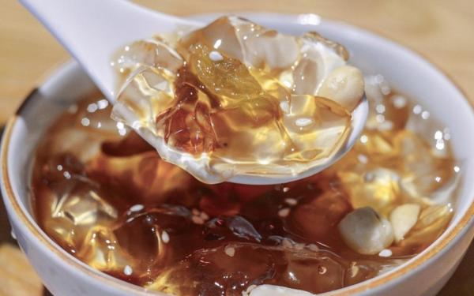
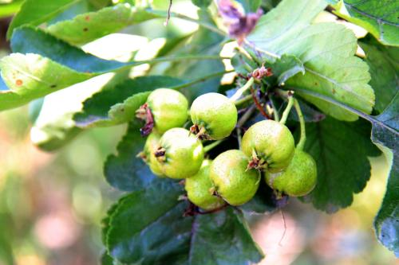
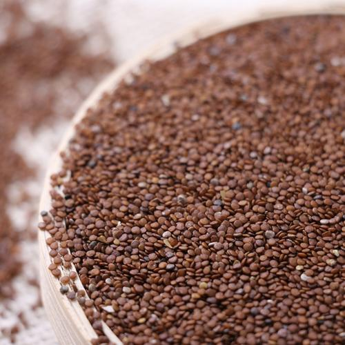
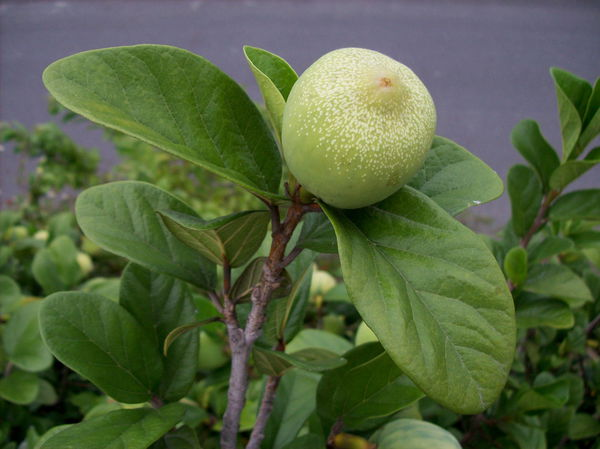
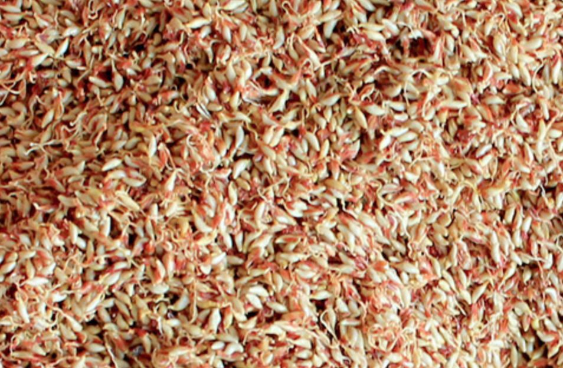
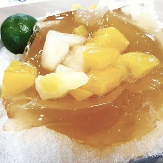
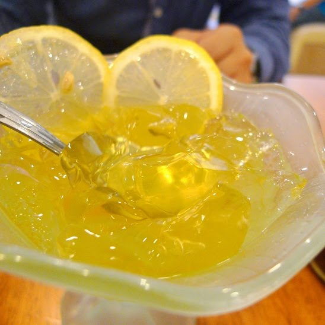
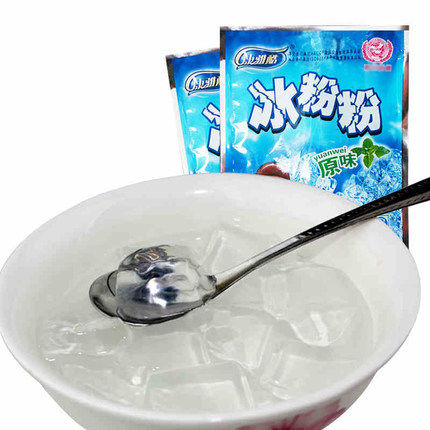

总结：

* **冰粉籽**： 通常来源于假酸浆（Physalis alkekengi var. franchetii）或某些其他的冰粉树（通常是锦葵科的植物）。冰粉籽同样富含果胶，可以用来制作白色的透明凉粉

  自我凝固能力不强，所以经常需要添加石灰等

  > 似乎口感比木莲好

  > **天然植物凝固剂20克（水滴龙、野藕粉各地叫法不同）** 可以用在冰粉籽吗？

* **木莲籽（薜荔籽）**： 薜荔（Ficus pumila）的种子。薜荔是一种常见的攀援植物，属于桑科榕属。薜荔的果实内部含有的种子富含果胶，经过适当的处理可以形成凝胶，用来制作凉粉等食品

  不用石灰也可以凝固，有点慢

  > 无添加的籽25克只能做750毫升水，加凝固剂的籽25克可以做4-8斤。无添加水少做出来成品很厚（跟果冻差不多），有些省份喜欢这种成品和口感，还当凉菜吃的。所以有些吃惯了无添加做的成品会说加凝固剂的太稀了，没有凝固，其实是误会了。无添加对水质有要求，凝固时间根据水质不同地区不同有区别。 
  >
  > 加凝固剂（野藕粉、水滴龙）木莲豆腐是浙江人习惯做法，水加的多成品也软了薄（稀），夏天当饮品喝的，用吸管吸着喝。**加凝固剂水减少一半也会做出来厚一点（但是不会像无添加的那么硬）**。**无添加和有添加的籽只是采摘季节不同，山的区域不同**。  希望买家根据自己的要求和习惯购买。浙江人建议买加凝固剂的籽。

  > 需要注意的是： “木莲冰爽”其实并不是“木莲豆腐”，它配料是魔芋胶、卡拉胶，更接近白凉粉 （太坏了）

  * **爱玉籽**： 台湾地区特有的薜荔（Ficus pumila var. awkeotsang）变种的种子。爱玉籽制作出的凝胶通常呈淡黄色，透明度高，口感滑嫩，广泛用于台湾和东南亚地区的饮品和甜品中

    比普通薜荔好像凝固能力强点，凝固的快点

* 石花粉： 一种由石花菜（石花草）制成的天然产品，主要在中国的福建闽南地区以及台湾等地非常受欢迎。石花菜是一种海洋藻类，属于红藻门，学名为Gelidium amansii或是Gracilaria lemaneiformis等几种不同的种类。这些海藻含有丰富的胶质成分，主要是琼脂（Agar），这是一种能够遇水凝固的多糖类物质

  石花粉的制作过程通常包括将石花菜采集、清洗、煮沸、过滤、浓缩和干燥等步骤。最终得到的石花粉可以加水和糖煮沸后冷却，形成类似于果冻的凝胶状食物，称为石花膏或石花冻。石花冻口感清凉滑嫩，是夏季消暑的佳品，常被用作甜品或饮料的配料。

  除了食用价值之外，石花粉还被认为具有一定的药用价值和保健功效。它可能有助于清热解毒、润肺止咳、利尿通淋、活血消肿等。石花粉中含有的营养成分如膳食纤维、矿物质等，对于促进消化、改善肠道环境也有潜在的好处。不过，这些健康益处的具体科学依据可能还需要更多研究来证实。

  > 淘宝上搜到的几个牌子：
  >
  > * 宅福艺： 石花菜、魔芋粉、食品添加剂（卡拉胶）
  >
  > * 侦茶颜： 魔芋粉、食用葡萄糖、石花菜粉、淀粉、食品添加剂（卡拉胶、琼脂、柠檬酸钠）。 1433KJ/100g
  >
  >   > 评论：
  >   >
  >   > * `制作非常方便、水+粉用打蛋器搅拌一下化开，煮个8分钟就OK了，口感跟用石花草熬的差不多`
  >   > * `店里用的，还不错、总体还行，比用石花草熬煮的方便，口感也差不多`
  >   > * `很不错的~做好的石花冻很Q弹，可以刨丝、比旺闽兴的石花粉好用太多了.一包煮了11斤水`
  >   >
  >   > 但。。。原料表太科技了吧
  >
  > * 旺闽兴： 天然石花菜、淀粉、卡拉胶
  >
  >   1500ml水、25g该品、50g白砂糖。 水越少越Q弹、越少越软，也可以适量木薯粉（15g）
  >
  > * 新和艺： 天然石花菜、淀粉、使用琼脂
  >
  >   50g+冷水13-15斤（他们家仙草粉其他接近，这里加水稍微少点，10-12斤），稍加搅拌，烧开10-15m使其充分溶解，过滤冷却即可
  >
  >   切小块加入冰糖水或蜂蜜，冷藏后食用更佳。 或凉拌...（咸口）
  >
  > * 古琅轩： 石花菜、魔芋粉、卡拉胶、氯化钾
  >
  > > 卡拉胶（Carrageenan）和琼脂（Agar）都是从海藻中提取的天然多糖类物质，通常用作食品工业中的稳定剂、增稠剂或凝固剂。这两种物质在食品加工中广泛使用，因为它们能赋予食品所需的质地和结构。
  > > 相比之下，**琼脂被认为更安全，其副作用报道较少，通常被认为是无害的**。琼脂在人体内不易被消化，但也不会像卡拉胶那样引发类似的负面健康效应。

* 白凉粉： 卡拉胶（提取自藻类）

* 黑凉粉： 凉粉草

* 龟苓膏： 黑凉粉 + 龟板 + 茯苓 等

> 黑白凉粉凝固能力都很强，远高于上述冰粉系列

---

* 跟白凉粉形态外观接近

  

  

* 食用方式

  * 最常见的就是四川冰粉了，红糖冰粉，也常见再加入 芝麻，葡萄干，山楂，花生碎 等

    > 但觉得东西加多了，本味就遮盖了。 不是很喜欢

  * 随州的吃法： 加醋加白糖，冷藏。 夏天吃很爽口，但这个醋要是米味很淡的那种。

* 也叫石花粉

* 原料是冰粉籽

  冰粉籽树/冰籽树

  

  冰粉籽

  
  * 其他原料

    * 薛荔

      冰粉籽天然的属性决定了它**自我凝固的能力不强**，不过却有另外一种跟它很像的植物，不仅可以制作出冰粉，自我凝固的能力也很强，它就是薛荔。

      > yonka： 这种估计就不用石灰水了。 石灰水碱性原因，有点伤胃，不宜多吃。

      

      

      

      新加坡颇为有名的文头雪其实就是用薛荔做的。只是来到了新加坡，配料变成了酸柑，薄冰和芒果了。 

      

      在台湾有一种亚种，叫爱玉，台湾南部出名的爱玉冰就是用它做成的，只是跟冰粉的价格相比，薛荔的价格要贵一些，所以现在市面上看到的更多的依然是冰粉籽做成的冰粉。  （加入柠檬水代替红糖，风味不同）

      

* 工艺

  * 传统工艺

    石花粉籽纱布裹着，冷水中浸泡，揉捏出胶质，加入石灰水（凝固）

  * 现代/工业工艺

    制好的冰粉粉末，冲泡即可。 但口味会有差异。

    **尤其部分市面“冰粉”产品其实就是白凉粉，主成分卡拉胶，口味差很多**

    