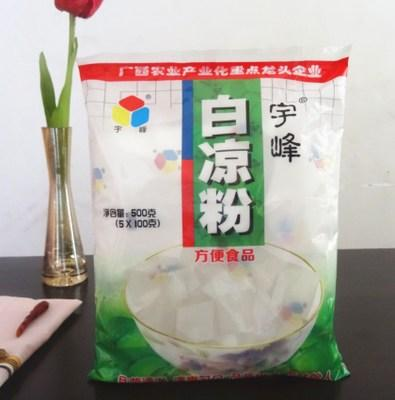
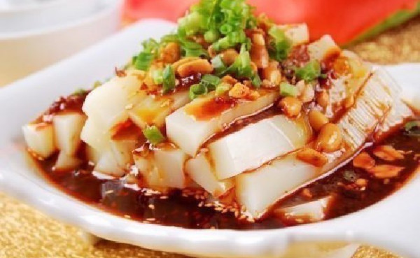
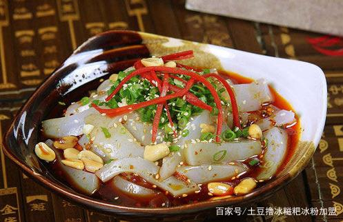
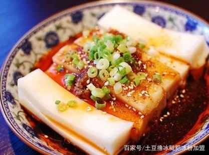
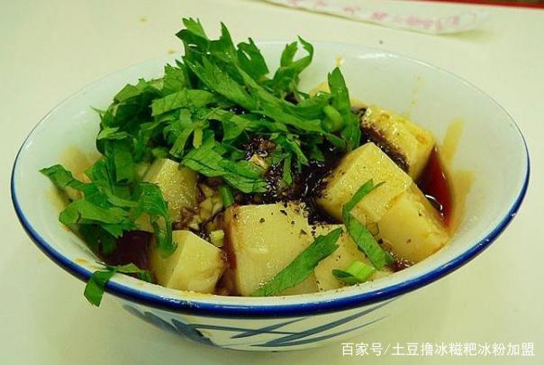

* 白凉粉

  

  

  主要成分是**卡拉胶，算是海藻提取物**，基本没热量
  基本没味道只有口感，外观晶莹透亮，适合添加其他有味道的（茶水，果汁，等等），也有咸味吃法

  * 咸味： `将凉粉倒出切成小块，青红黄椒去蒂去籽洗净后切碎，倒入大碗中调入老醋，鲜酱油，盐，糖，香油和泡椒汁，最后撒上一层芝麻搅拌均匀，冷藏后食用，口感更好哈`
  * 甜味： 加果汁蜂蜜等
  * 茶冻： 茶水代替纯净水

* 黑凉粉

  **也就是仙草**。 用**凉粉草制作，算是草本制品**。

  详见 仙草 篇。

* 主食凉粉（如陕西凉粉）
  
  这类凉粉主要是淀粉作为原料，热加工得到凝固胶状。 而其他甜点类的多是直接利用原料中的胶质，有热加工（如龟苓膏，白凉粉，仙草粉）也有冷加工（如冰粉）。
  
  
  
  这个就不是小吃类型了，陕西凉粉主要用**玉米淀粉或者豌豆淀粉（黄色）**，显然是有热量的，也所以才能作为主食。
  色泽嘛，白色（小）半透明那种。 根据用的淀粉不同透明度不同。
  
  也有用绿豆淀粉的， 如西安卤汁凉粉。
  
  * 四川凉粉，主料可用大米粉
  
    
  
  * 四川白凉粉，主料可用土豆粉
  
    
  
  * 四川黄凉粉~~ 主料是豌豆
  
    
  
  