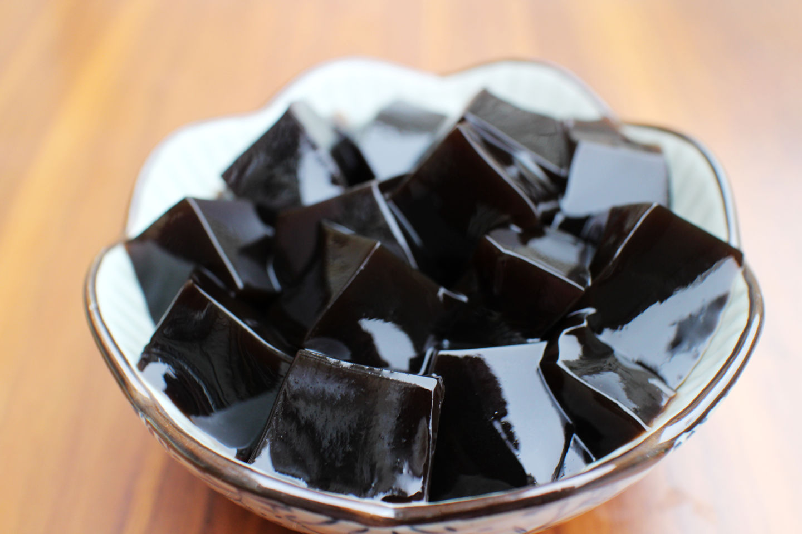

* 外观

  

* 原料： 龟板（鹰嘴龟），（土）茯苓。 也加入一些其他中药材。

  以上为传统工艺。 现代工艺一般是加工为龟苓膏粉，冲调煮沸即可。

## 品牌和购买

基本上

* 双钱： 正宗+性价比高

  * 果冻装的就当零食吃

  * 罐装的味道正很多，口感很滑恰到好处，就是稍微甜了点

  * 要吃不甜的只能自己买他们家龟苓膏粉做了，出品或有波动

    而且，外甜内苦味道更好。 罐装是先加糖再成形所以内外都甜。

* 海天堂： 据说hk的，看起来正宗。 贵！

  