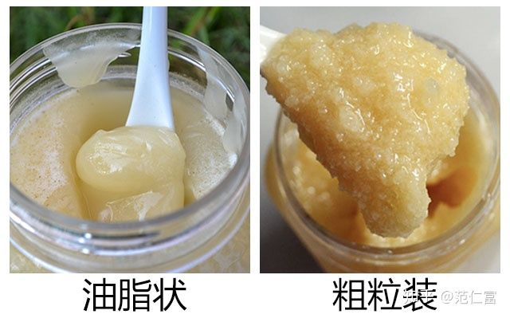

## 性质

### 结晶

ref： [蜂蜜结晶好还是不好？还能吃吗？](https://zhuanlan.zhihu.com/p/65762875)

> 因为蜂蜜是葡萄糖过饱和溶液，在一定条件下要恢复到稳定的饱和状态，把过多的**溶质析出**，当保存温度降到13℃～14℃时，蜂蜜中过饱和程度增加，葡萄糖结晶核运动加快，迅速析出葡萄糖晶体，发生结晶。总结原理就是：**低温葡萄糖析出**。

* 过程： 

* 形态：

* 与蜜源/种类的关系：

  一般葡萄糖含量较高的蜂蜜，容易结晶，如油菜蜜、椴树蜜、荆条蜜等。而含果糖较多的蜂蜜则不易结晶，如洋槐蜜、枣花蜜等。

* 与含水量的关系（波美度）： 

  ​      不成熟的蜂蜜由于含水量高，过饱和程度低，结晶的速度变慢，有的不能全部结晶，由于蜂蜜的粘滞度小，结晶的葡萄糖沉到容器底部，其它稀薄的糖液浮在上层，成为液、固两相、即半结晶状态。其它未结晶部分的含水量就相应增高。

  ​      同一花种的蜂蜜，其含水量低的结晶快，含水量高的结晶慢，甚至不结晶。 

* 与气温的关系

  蜂蜜在13~14℃时，最容易结晶，若低于此温度时，虽然葡萄糖的过饱和程度加大，但由于蜂蜜中果糖、麦芽糖、糊精和胶状体物质等在低温下的粘滞度和密度却大大提高，从而降低和阻碍结晶核的运动和扩散作用，结晶反而迟缓。若高于此温度，蜂蜜的粘滞度虽然降低了，但是葡萄糖的溶解度却提高了，从而减少了溶液的过饱和程度，也使结晶变慢，甚至使结晶融化。

* 超市蜂蜜为什么不结晶
  - 为了降低成本，大部分的品牌蜂蜜多是浓缩蜜。浓缩蜜用不成熟蜜浓缩加工而成。浓缩过程需要加热，而加热的过程会破坏晶核，从而延缓蜂蜜的结晶。
  - 浓缩蜜结晶核很少，结晶后比较粗大或者像白糖一样的颗粒沉淀，超市里会把这些卖相差的蜂蜜下架，退回工厂重新加工。
  - 许多掺假的蜂蜜会想办法提高其果糖的含量，果糖含量提高了，也会延缓蜂蜜的结晶。
  - 超市里低温浓缩蜜冬天和春季也是结晶状态。

### 辨别

一些不良商贩为了谋取利益，有在低品质（如波美度低的非成熟蜜）蜂蜜中人工制造结晶现象，这种结晶一般由蔗糖而来。

简单识别结晶蜂蜜是否掺了白糖：

取结晶蜂蜜稍许，放于舌尖，然后含在嘴里，能感到**逐渐自然融化，则为蜂蜜天然结晶，如果融化很慢并有过硬的砂砾感**，记住是过硬的沙砾感，那可能就是有问题的蜂蜜。

## 类型

## 食用

### 容器

蜂蜜比较粘，打开舀取容易粘到手上、沿着外壁留下来。

感觉还是 塑料瓶罐+尖嘴+按捏挤压 比较好。

但那种比较容易结晶的蜂蜜就不太适合了， 尤其是冷藏情况下。 根据需要可以选择不易结晶的蜂蜜类型（比如只是调味的话）。