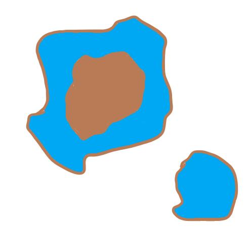
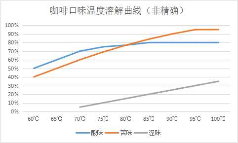

---

我的ID是“潜水很多年”，顾名思义我爱潜水，我在吧里潜水也有一两年了，几乎每天都在默默地看看大家分享经验、讨论疑惑、测评设备，以及装逼掐架。
各位想想，如果现实生活中，每天在周围也都有我这样的人在窥视着你，是不是有点细思恐极呢。
哈哈，言归正传，谈谈我对咖啡的感性认识。
为什么是感性认识呢？在讲咖啡之前，我想先讲个小故事。
大概是我小学4年级的时候，语文老师要求我们写一篇记叙文，记录自己动手做菜的过程。这一次我的作文被老师选作范文，这并不是因为我写得多好，原因无他，只是因为我写得真实。在一片“青椒200克，猪肉150克，盐2克“中，只有我的”拿出一袋青椒、一块猪肉“稍显清新。
在我看来，做咖啡与炒菜一样，都是一种经验为主导的活动。咱们普通人照着米其林大厨的参数来，并不能做出同样水准的菜。
所以，我想从更加感性的、偏体验式的角度，与大家分享我5年的咖啡心得。

最早喝咖啡是想在熬夜加班的时候提提神，事与愿违，提神的功效没体验到，倒是让喝咖啡成为了戒不掉的习惯。
我的口味偏向于品尝一只熟豆更本真的味道，也就是说，在豆子本身口味层次的基础上，我不爱通过冲泡手法来提升层次感。所以我介绍的方法和经验，都是如何让口味更均匀纯粹，不同偏好的朋友们，可以反向来操作~
感性认识并不能避开理性分析，理性地去探究原理，然后感性地付诸实践，才是最好的。
1、关于温杯和冲洗滤纸。（1）个人认为温杯很有必要。在我的实践中，冷掉的咖啡酸味会变得暗淡，不是失去酸味，是会有一种并不讨人喜欢的变化。而温杯可以缓解这一变化。（2）我惯常使用MOLA漂白滤纸，这是综合性能和价格之后的选择，一直在用，不打算改。

2、关于磨粉。这是个大问题，要细细讲。
（1）磨子。我一直选择使用手磨来做手冲，这倒不是因为对手磨或者电磨有所偏好。

我喝的豆子都是自己烘焙的，众所周知火太旺豆子会外焦里生，火太小极端的时候甚至烘得出油都不进一爆。手烘掌握火候必然不够精确，同一只生豆不同批次烘焙的，可能外观上看起来一样，但是豆子的内部生熟程度却不同。而用手磨，恰恰可以通过手感体验豆子硬度的不同，进而对烘焙程度了解更准，所以我一直使用手磨。如图我使用的是海勒和匿名2（原谅我因为桌子太乱，而选择如此奇怪的角度拍摄）匿名的盖子是用“小明同学”茶饮的盖子做的，防跳豆杠杠的，开闭也容易，比最新的匿名盖子高到不知道哪里去了，哈哈。如果猫哥在，请你假装没看到这句话。这里不评价这对磨子的不同，配上黑白双煞组合仅仅是为了同时喝两只豆子，而不用总是拆开清理。
（2）粗细程度。这是冲泡环节影响咖啡口味的最大因素之一。

图上画的是两粒不同大小的咖啡粉颗粒，蓝色是被水浸润的部分。如图，在吸水速率差不多的情况下，小颗粒会更早完成全部的萃取。这样一来，应该是磨粉细会有更加均匀的口味，因为颗粒内外萃取程度更加接近。其实不然，我之前试验过，咖啡最先溶解在水中的是酸味、甜味，随后是苦味，最后是一种类似于苦味，但不同于苦味的“涩味”。这种涩味非常令人讨厌。细腻的磨粉，会让这种涩味更早开始释放，而较粗的磨粉，这种涩味释放更加缓慢，所以我偏向用较粗的粉来做手冲。有人问会问，如果不小心磨细了怎么办？偷偷告诉你们，细粉相应缩小水粉比，然后适当参入白开水稀释，基本上可以模拟出粗粉相同口味。也就是：粗粉+多水冲泡≈细粉+少水冲泡+兑白开水。虽然实际上很难操作，主要是很难拿捏比例，明白了这层道理，辅以实践锻炼，对咖啡冲泡的技艺会有很大提升。
（3）颗粒形状。就是大家说的，有的磨子磨粉呈颗粒状，有的呈片状。这个参看上一条自己理解吧，不赘述了。

3、关于滤杯。滤杯对应滤纸，前文有发滤纸的图片，明眼人都看得出来——v60。这种60°锥形，个人认为在目前手冲滤杯的形状中是最科学的。因为滤杯先天物理条件带来的稳定性和可控性，尽可能地将影响口味的最大变量交给了水粉比、冲泡手法、水温等其他操作层面的环节，更容易实现我喜欢的均匀冲泡。Chemex我没买，喝过朋友的，没给我留下很深的印象，因为豆子也是朋友的，冲也是她冲的，不知道器具在其中起了什么样的作用，所以不评论。至于其他的滤杯，如果是刚入门的朋友，就不要多想了，选V60吃不了亏、上不了当。我一路摸爬滚打，那是一把辛酸泪、一部血泪史、一笔倒霉账。比如下面这个玩意。

4、关于冲壶。这里只谈壶，水流大小、注水方式、断水容后再叙，这里就说壶。关于壶，这可就深奥了。咱们吧里论起壶来，那是种类多、花样多、流派多，因此传说也多。各路大神百家争鸣，有比拼手稳的，有比拼壶贵的。我用过的壶不多，没什么发言权，简单说说吧。因为我历来只服务自己，绝大多数的时候都是1人份的量，因此往往需要的是垂直的涓涓细流。工欲善其事必先利其器，如图，这种壶嘴简直逆天好不好？如同V60，再一次稳定可控，把变量交给了其他环节。这个壶的牌子我不爱，无奈壶太好，该用还是要用。就不发全身照了。感兴趣的照着图自己去某宝找，不要问我，问我不答。

5、关于水量。狭义上可以理解为大家常说的水粉比，而我喜欢用“水量比”。这是操作环节影响口感最大的因素，没有之一。水少了会萃取不足，多了会整体过萃（与口感层次丰富的“局部过萃”不同，局部过萃是冲泡手法使然）。与大多数人不同，我不爱计算水粉比，更不会认为某种豆子就应该固定一个所谓的“黄金水粉比”。我长期自己手烘，烘焙火候不像机器那样稳定，所以豆子风味总会有波动，也就近年经验稍微丰富些，才勉强稳定一点。因为豆子口味不稳定，所以我需要更加灵活地去规划水量。我不爱使用水粉比这种以重量为主导的计算方式，具体下文会说。
通过慢慢摸索，我也逐渐形成了自己确定水量的方式。具体如下：
每次烘出一炉单品豆子。第一杯我会一边冲，一边用签子从滤杯流出的水柱中沾取咖啡液来尝。我在前文说过咖啡冲泡最先是偏酸、微甜，随即开始以苦为主，最后是很涩的味道，这也是在这种尝的过程中体验出来的。每次尝到味道开始转涩，就是即将过萃了，这时停止注水，拿掉滤杯，量一下杯中咖啡的容量。为什么要量咖啡液的容量，而不是重量？从学术角度讲，打个比方10g糖溶解在100ml水里，重量是110g，而容积依然是100ml，所以这里用容量计算水量更科学。因为苦和涩的界线并不清晰，实际上注水可能停早了，也可能停晚了。我们可以稍微尝尝味道，大概估计一下应当增减的水量。这样一来我们就知道这一批熟豆应该是多少克豆子，配多少毫升水了。
用这种方法，面对一支不熟悉的豆子，我们随时都能简单地找到合适的“水量比”。
以上是基于个人体验总结的，请不要揪对错，认同的可以交流借鉴，不认同的就当我没说吧。

5、关于水温。水温对手冲口味的影响是非常大的。但这并不意味着你需要很准确地去选择水温，更不需要通过很复杂的手段去精确控制水温。有人认定一只豆子必须用某一个温度冲泡，±1℃都会让他感觉冲泡失败了；还有人为了保证水温不降低，在二注三注的时候会换水，这些在我看来这都是没有必要的。
那么该如何选择水温和控制水温呢？
首先，我要普及一个溶解度的概念，这是中学化学的一个知识点。应用在咖啡上，这里有2条你必须知道的：1、除了碳酸钙、氢氧化钙等，绝大多数固态物质，温度越高，溶于水的溶解度越大。2、同样温度，每种物质的溶解度并不一样。从这两点可以得出——①酸味、苦味、涩味都是”水越热，越容易溶解到水中"，即"水越热，越容易过萃"；②一定的温度下，每种味道溶于水中的量并不一致。
酸味、苦味、涩味，作为咖啡中最主要的味道（不爱脑补什么柑橘、无花果、巧克力味），其中酸味是最容易溶解于水的，80多度就能完全释放，苦味要到95度左右才能完全释放，涩味受温度影响不大，受与水接触的时间影响大。

如图，大致上，水温在80——85之间，酸味基本完全进入咖啡，而苦味可能只释放五分之四。95度左右，酸苦基本都能完全呈现，但涩味也重。85--93之间，口味相对会比较均衡。
具体到不同种类的咖啡上，比如耶加雪菲，酸味为主，本身苦味就相对不多，80来度的时候，苦味释放有限，基本就类似于喝醋了；而波旁本身口味均衡，80来度偏酸，88左右，92以上偏苦。
所以根据不同种类、不同新鲜度的咖啡，完全可以通过选择水温，来调整出自己想要的口味。

> 勘误：波旁本身口味均衡，80来度偏酸，85-88左右均衡，92以上偏苦。
> 以上是选择水温。至于控制水温，主要就是保温了。总结来看基本上是：壶容量越大、壶壁越厚，冲泡前后水温变化越小。但这两项除了换壶都没法改变，所以如果你感觉壶失温太快，在不换壶的前提下，那就只能给壶做一个套子包起来了~

6、关于闷蒸。
这一步，绝对有必要，尤其是对于中心注水！
众所周知，闷蒸主要为了（1）排出气体（2）浸润咖啡粉。
其实，对于中心注水的冲泡方式，闷蒸还有第三个作用，也是最重要的！！
先卖个关子，插段话。
大家往地上泼水的时候，会发现地上的水流并不是笔直的，而是歪歪扭扭的。即便地面很光滑，也依然蜿蜒曲折。因为从微观看，每一处地面对于水流的阻力并不一致。
这个现象挪到咖啡上，就是意式里面所说的“通道”。
喜欢玩意式的朋友都知道，“布粉”很重要，为的就是消除通道，避免水流不能均匀通过粉饼，造成流速快的地方过萃，流速慢的地方萃取不足。
放到手冲里来，这个道理也存在。
因为手冲粉末颗粒较意式粗很多，也不如意式均匀，通常的抖、拍、搅等布粉方式，并不能实现足够良好的效果。
而充分的闷蒸能让粉堆自身内部均匀挤压，可以使咖啡粉堆内部密度更均匀，在中心注水的过程中，能更加稳定、均衡、可控得浸润咖啡粉，实现更加良好的萃取。
另：这个帖子标题讲的是感性认识，但细心的朋友可以发现，内容理性的内容偏多。
实际上我们搞懂原理，是为了更好地随性发挥。就像一个画家，从线条开始打基本功，待功力大成后，开始形成风格，进而收放自如，随性发挥。如果一开始学画，就上来乱搞一气，可能自己觉得自己是抽象派，但其他人眼里那就是找抽派了~
熟悉参数，是为打破定数；
知晓原理，是为超脱条理；
了解咖啡，才能驾驭咖啡。

