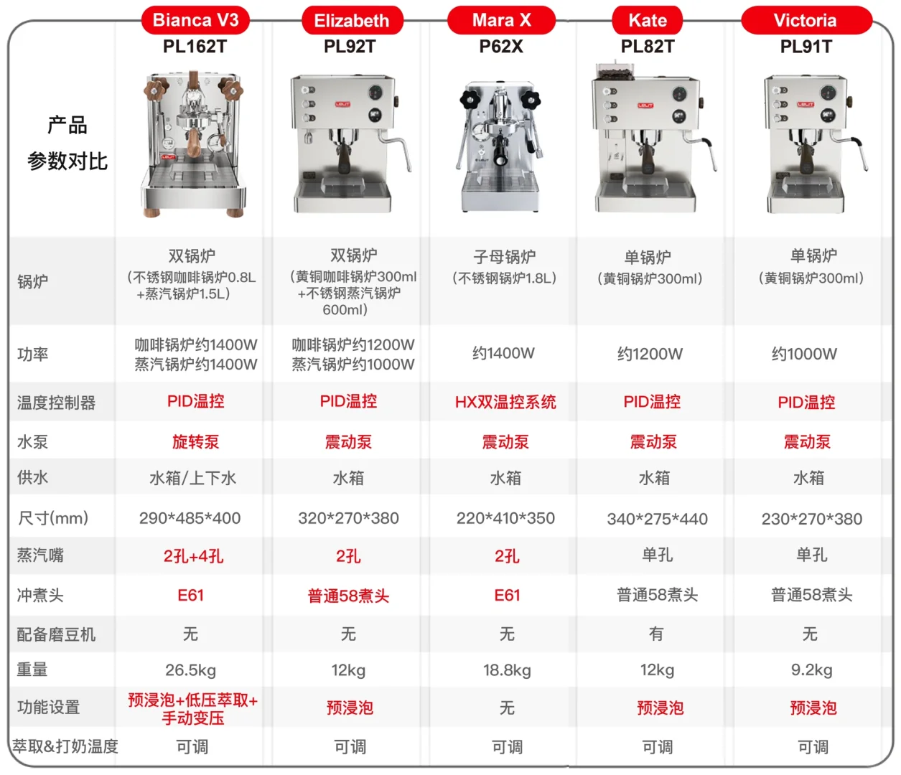

# 细节

## 预热、等待时间

> 入门款咖啡机与中高端咖啡机在预热时间和连续出品能力上的差异，主要源于以下几个原因：
>
> 1. **加热系统设计差异**：
>
>    - 入门款咖啡机通常采用较为简单的加热系统，比如单一加热元件直接加热锅炉或水路，这类设计加热速度快，能在短时间内达到可制作咖啡的温度，因此**预热时间较短。但这种设计可能无法长时间保持温度的极度稳定**，所以它们可以快速加热后立即开始制作咖啡，但可能在**连续出品时温度波动较大**。
>
>      > y: 听起来就是“不管效果”的快糙猛
>
>    - 中高端咖啡机通常配备更复杂的加热系统，如双锅炉或热交换系统，以及更精细的温控装置。这些设计旨在提供更稳定和精确的水温控制，**确保每一杯咖啡都能在最佳温度下萃取**，但这也意味着预热到理想工作状态需要更长时间。一旦达到工作温度，虽然可以连续出品，但为了维持恒定的温度和保证萃取质量，机器可能需要短暂的恢复时间或有更严格的使用间隔。
>
> 2. **材质与保温性能**：
>
>    - 入门级机器可能使用成本较低的材料，保温性能不如高端机，因此预热快速但散热也快，可能无需等待就能连续出品，但出品质量可能受温度波动影响。
>    - 中高端咖啡机常采用更好的隔热材料和设计，如铜或不锈钢锅炉，这些材料有更好的热质量和保温性能，**虽然预热慢，但一旦达到工作温度，能更长时间地维持恒温状态，支持连续高品质出品**。
>
> 3. **设计目的**：
>
>    - 入门级咖啡机设计更**侧重于便捷性和快速使用**，面向偶尔制作咖啡或对温度控制要求不那么严格的用户。
>    - 中高端咖啡机则**针对追求极致咖啡品质和体验的用户，他们愿意等待以换取更稳定、更专业的萃取条件**，即使这意味着在连续制作时需要更多的等待或注意机器的恢复时间。
>
> 4. **专业功能**：
>
>    - 中高端咖啡机往往具备更专业的功能，如蒸汽功能、独立的蒸汽锅炉、预浸泡等，这些**额外的功能也增加了机器预热的复杂性和时间需求**。
>
> 因此，入门款咖啡机和中高端咖啡机在预热时间和连续出品能力上的不同，是由其设计目标、技术配置和材料质量综合决定的。

# 品牌

## 德龙delonghi - 意大利

1902年创立

销量TOP3：

* ECO310
  * 半自动
  * 无研磨
  * 可打奶
  * 定价： 1599
  * 618到手价： 1159
* ECAM22
  * 全自动
  * 自动研磨
  * 可打奶
  * 定价： 4199
  * 618到手价： 2699
* ECAM23
  * 全自动
  * 自动研磨
  * 可打奶
  * 定价： 5099
  * 618到手价： 3699

## 兰奇里奥rancilio - 意大利

销量TOP2：

* silvia（小s）
  * 半自动
  * 无研磨
  * 可打奶
  * 定价： 7580
  * 618到手价： 5900

* silvia pro X（大s）
  * 半自动
  * 无研磨
  * 可打奶
  * 定价： 15980
  * 618到手价： 12500

## 铂富breville - 澳大利亚

1932年创立

销量TOP3：

* BES878
  * 半自动
  * 手动研磨
  * 可打奶
  * 定价： 6199
  * 618到手价： 5199
* BES870
  * 半自动
  * 手动研磨
  * 可打奶
  * 定价： 5000
  * 618到手价： 3500
* BES880
  * 半自动
  * 手动研磨
  * 可打奶
  * 定价： 10880
  * 618到手价： 8780

## lelit - 意大利

1993年创立

销量TOP3：

* bianca V3
  * 半自动
  * 无研磨
  * 可打奶
  * 定价： 16141
  * 618到手价： 12199
* Victoria PL91T
  * 半自动
  * 无研磨
  * 可打奶
  * 定价： 5761
  * 618到手价： 4350
* Kate PL82T
  * 半自动
  * 手动研磨
  * 可打奶
  * 定价： 6653
  * 618到手价： 4488

> 【初级爱好者入门款】Kate 研磨一体省钱省空间
> 价格：4k+
> 推荐人群：需要一台操作简单方便意式机的初级咖啡爱好者
> 功能特点：
> -自带磨豆机，无需单独选配✅研磨萃取一机配齐
> -PID温控（萃取温度稳定）操作简便易上手
>
> 【初中级爱好者升级款】MARA X 家用意式机小精灵
> 价格：7k+
> 推荐人群：想要简单做一杯好喝的家庭咖啡的中级爱好者
> 功能特点：
> -商用E61煮头，静音震动泵，温度可调
> -小户型适用，颜值担当，麻雀虽小五脏俱全👍🏻
>
> 【深度爱好者顶配版】BIANCA V3 家用咖啡机天花板🔝
> 价格：1.2w+
> 推荐人群：对咖啡品质有极致追求的，资深爱好者
> 功能特点：
> -双锅炉，商用E61冲煮头（温度、萃取参数稳定）
> -手动变压➕预浸泡➕低压萃取设置（可玩性高）
>
> 

## 惠家WPM - 广东

1994年品牌定名

销量TOP3

* KD135
  * 半自动
  * 无研磨
  * 可打奶
  * 定价： 2679
  * 618到手价： 2045
* 270S
  * 半自动
  * 无研磨
  * 可打奶
  * 定价： 4400
  * 618到手价： 3749
* KD320
  * 半自动
  * 无研磨
  * 可打奶
  * 定价： 7199
  * 618到手价： 6049

## 迈拓 - 广东广州

2006年成立

销量TOP3：

* EM-30
  * 半自动
  * 无研磨
  * 可打奶
  * 定价： 7730
  * 618到手价： 6480
* EM-23
  * 半自动
  * 无研磨
  * 可打奶
  * 定价： 4900
  * 618到手价： 4100
* EM-20
  * 半自动
  * 无研磨
  * 可打奶
  * 定价： 3950
  * 618到手价： 3300

## 格米莱 - 广东佛山

> 小红书上评论似乎商用较多/较好

2013年成立

销量TOP3：

* CRM3005E
  * 半自动
  * 无研磨
  * 可打奶
  * 定价： 1399
  * 618到手价： 1199
* CRM3018
  * 半自动
  * 无研磨
  * 可打奶
  * 定价： 3099
  * 618到手价： 2599
* CRM3200F
  * 半自动
  * 无研磨
  * 可打奶
  * 定价： 4299
  * 618到手价： 3599