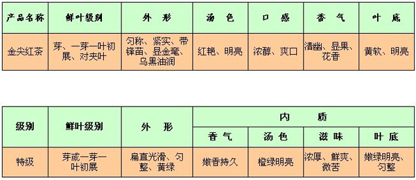

# 喝过的茶汇总


* 红茶

  * 祁红

    * 天之红 [天之红茶叶祁门红茶特级祁红毛峰小罐装50gx2罐](https://item.jd.com/100009266156.html) jd自营 到手平均22.65元/罐 折合 226.5/斤

      **评价：** 说实话有点平平无奇，5分吧

    * 祥源茶 [祥源茶 新雨特级祁门红茶 茶叶工夫红茶 红茶茶叶散装 祁红150g罐装功夫茶](https://item.jd.com/10171506163.html) jd三方品牌旗舰 店 108元 折合 360/斤

      **评价：**兰香足，味道清澈，茶叶细而不碎，觉得可以8分

    * 谢裕大 [谢裕大祁门红茶祁红 特级香螺 60g罐装红茶](https://item.taobao.com/item.htm?id=17658023027&_u=j7i0uhmde1c) 69 折合 575/斤
    * 谢裕大 [新茶上市祁门红茶特级浓香2019新茶135g正宗工夫红茶](https://item.taobao.com/item.htm?id=17949962034&_u=j7i0uhmf7cb) 84 折合 311/斤

  * 黔红

    * 兰馨 [兰馨 特级金尖红茶120g 贵州茶叶遵义红金骏眉类工夫红茶礼盒装](https://item.jd.com/1054011163.html) 118元 折合 492元/斤

      说是“金骏眉”类，[官方介绍](http://www.lanxintea.com/Product/XShow.asp?ID=2&Item=7)里提到工艺是“精选良种茶树的独芽为原料，按照传统工夫红茶的工艺精制而成”

      

      > 兰馨金尖为高端红茶，荣获中国（广州）国际茶业博览会金奖、中国（北京）国际茶业博览会金奖等、第九届“中茶杯”全国名优茶评比特等奖。

      泡法：

      第一泡静置约20秒出汤；
       第二泡静置约30秒出汤；
       第三泡静置约50秒出汤。
       第四泡静置约2分钟出汤，但茶汤已淡。

      **评价：**香味还行，比祥源的淡点，但也比较清澈，叶整齐有金芽，甜味较为明显，7分吧

  * 宁红

    * 宁红 [宁红茶2020年新茶春茶茶叶功夫红茶初韵50g红茶礼品自饮](https://item.taobao.com/item.htm?id=524610745242&_u=j7i0uhmb6c7) 32元 折合 320/斤

* 红茶粉

  * 立顿

    * 黄牌 [Lipton/立顿小黄罐红茶粉500g黄牌茶叶铁罐茶粉散茶港式丝袜奶茶](https://item.taobao.com/item.htm?id=606460578950&_u=j7i0uhmf471) 65元/斤

      红茶味还比较正，划算。 无香精，用来做奶茶比较合适。

    


# 摘录各种茶推荐

```
这得看你父亲喜欢喝什么样的茶，
红茶
红茶里最知名的送人名茶是金骏眉，只能买正山堂和骏德茶厂的；

名气第二的红茶则是祁门红茶，这里面最知名的就是天之红；

然后就是滇红，这个比较好选，就选凤庆茶厂的就可以；

黑茶
安化黑茶就选白沙溪的，如果对国企比较信任，那就买中茶的百年木仓；
普洱选大益，品牌够知名，或者选老同志，邹炳良开的厂子

黄茶
湖南省君山银针茶业有限公司的君山银针是唯一的选择

其他的绿茶、乌龙茶和白茶，就不写了，你也没说明要哪种？之前在知乎写过『名茶求好』专栏，里面对每种茶叶和它下面的好品牌都介绍了一下，但现在没了，不过你可以去公众号：yszdm365里去看看。

作者：刀塔手
链接：https://www.zhihu.com/question/27973806/answer/140458681
来源：知乎
著作权归作者所有，转载请联系作者获得授权。
```


## 花茶


### [知乎问题 你喝过的最好喝的花茶是什么？ - 梨花与虎 的回答](https://www.zhihu.com/question/27586713/answer/1426376959)


> <p>好吧我承认，虽然「花茶」是中国茶叶中非常重要的再加工茶类，但我个人的确不喜欢它的味道。<b>花茶远不止有茉莉花茶一种，还有珠兰花茶、桂花茶、金银花茶、白兰花茶、玫瑰花茶和玳玳花茶等多种。</b>现在商家把菊花、玫瑰花等干燥花瓣统称为花茶，其实是不严谨的。<b>学术意义上的花茶要经过繁复的「窨制」技术，绝不是简单将花瓣调配在一起、或掺到红绿青茶里就算花茶。</b>花茶的生产制作也由来已久，在国内尤其是北方更有久远的饮用历史和广阔市场。<b>在国人饮用花茶的漫长历史中，也诞生了不少经典的花茶厂家，其技术沉淀、原料选用也绝非1688上搞批发的贴牌厂可比。</b></p>


花茶胚

* 绿茶
* 红茶
* 乌龙


分类：

* 茉莉花茶

  * 中粮中茶 蝴蝶牌 0014经典紫罐
  * 吴裕泰 云尖
  * 张一元 龙毫

* 玫瑰红茶

  工艺成本高，用传统工艺窖制的厂家少。

  * 英国欧乐集 sticksology玫瑰红茶进口锡兰红茶

    在中国传统窖制工艺基础上，创新。。。 精油提取和调和

    > 感觉就是额外加入了天然原料制成的香精

* 桂花茶

  同玫瑰花茶，也少

  * 画茗 “做龙井不算出众，窖制的桂花茶倒是弯道超车” 桂花龙井 明前一级

* 猴王花茶 银针 浓香茉莉
* 碧潭飘雪 茉莉花茶叶 特级


> <p>像珠兰花茶、白兰花茶、玳玳花茶和金银花茶等传统花茶产品，基本上已经在市场上绝迹。还在用这几种花茶概念的商家，也基本没有掌握窨制工艺的，不过是把花苞和茶胚简单掺和在一起而已。遗憾！</p>


# 摘录 - 摆一摆我知道的中国绿茶 - 什么值得买 - 别样时空

摘自网络（[什么值得买 - 别样时空](http://post.smzdm.com/p/292476/)）

* [篇一：先说说太平猴魁黄山毛峰和西湖龙井](http://post.smzdm.com/p/292476/) or [local](resource/太平猴魁黄山毛峰和西湖龙井制茶工艺及茶叶鉴别 | 绿茶的品种介绍_什么值得买.html)
* [篇二：尴尬的六安瓜片，聪明的安吉白茶](http://post.smzdm.com/p/293464/) or [local](resource/摆一摆我知道的中国绿茶 篇二：尴尬的六安瓜片，聪明的安吉白茶_购物攻略_什么值得买.html)
* [篇三：摆一款皖南小众绿茶 涌溪火青并补说龙井茶](http://post.smzdm.com/p/293860/) or [local](resource/摆一摆我知道的中国绿茶 篇三：摆一款皖南小众绿茶 涌溪火青并补说龙井茶_购物攻略_什么值得买.html)
* [篇四：番外篇—乌龙茶附我的茶杯介绍](http://post.smzdm.com/p/294912/) or [local](resource/摆一摆我知道的中国绿茶 篇四：番外篇—乌龙茶附我的茶杯介绍_购物攻略_什么值得买.html)
* [篇五：难以下笔的信阳毛尖和纪念亲人而命名的金萱](http://post.smzdm.com/p/304128/) or [local](resource/摆一摆我知道的中国绿茶 篇五：难以下笔的信阳毛尖和纪念亲人而命名的金萱_购物攻略_什么值得买.html)


# 摘录 - 我喜欢的一些茶 - 什么值得买 - 别样时空

摘自网络（[什么值得买 - 别样时空](http://post.smzdm.com/p/292476/)）

* [篇一：福鼎白茶  品品香 白牡丹](http://post.smzdm.com/p/447690/) or [local](resource/我喜欢的一些茶 篇一：福鼎白茶 品品香 白牡丹_开箱晒物_什么值得买.html)
* [篇二：给自己的父亲节的礼物 北浦白毫乌龙](http://post.smzdm.com/p/452299/) or [local](resource/我喜欢的一些茶 篇二：给自己的父亲节的礼物 北浦白毫乌龙_开箱晒物_什么值得买.html)
* [篇三：八马赛珍珠，酷暑下的清澈](http://post.smzdm.com/p/472236/) or [local](resource/我喜欢的一些茶 篇三：八马赛珍珠，酷暑下的清澈_开箱晒物_什么值得买.html)
* [篇四：纯粹的普洱茶 — 雨林古树茶](http://post.smzdm.com/p/487923/) or [local](resource/我喜欢的一些茶 篇四：纯粹的普洱茶 — 雨林古树茶_生活记录_什么值得买.html)


# 摘录 - 随便说点有关茶的那些事 - 什么值得买 - 匿名

[随便说点有关茶的那些事](http://post.smzdm.com/p/318958/) or [local](resource/随便说点有关茶的那些事_生活记录_什么值得买.html)


# 摘录 - 春茶上市 神奇的东方树叶 - 什么值得买 - rain_bow

* [篇一：选茶小TIPS  & 徽茶简介](http://post.smzdm.com/p/438736/) or [local](resource/茶叶选购技巧分享 & 徽茶知识简介_什么值得买.html)
* [篇二：简述福建茶之正山小种 金骏眉](http://post.smzdm.com/p/440276/) or [local](resource/如何选购正山小种与金骏眉茶叶 | 正山小种与金骏眉的区别与关系_什么值得买.html)
* [篇三：简述历史名茶 安茶 开汤](http://post.smzdm.com/p/467608/) or [local](resource/神奇的东方树叶 篇三：简述历史名茶 安茶 开汤_生活记录_什么值得买.html)
* [篇四：窨得茉莉无上味，列作人间第一香](http://post.smzdm.com/p/468722/) or [local](resource/茉莉花茶如何品鉴 | 茉莉花茶的制作 & 选购方法 _什么值得买.html)


# 摘录 - 泡茶小能手 - 什么值得买 - 茶味研究所

* [篇一：手把手教你选购并使用盖碗泡茶不烫手](http://post.smzdm.com/p/468632/) or [local](resource/盖碗茶具选购指南 | 如何使用盖碗茶泡茶不烫手_什么值得买.html)
* [篇二：为什么你泡的茶没有别人泡的好喝?](http://post.smzdm.com/p/470481/) or [local](resource/怎样泡茶才好喝 | 从零开始学泡茶_什么值得买.html)


# 摘录 - 聊聊茶叶那些事 - 什么值得买 - 槑林

* [篇一：茶叶选购常识篇](http://post.smzdm.com/p/381274/) or [local](resource/茶叶选购常识 | 名茶品类介绍_茶叶的分类_什么值得买.html)
* [篇二：茶叶鉴别技巧篇](http://post.smzdm.com/p/386206/) or [local](resource/茶叶鉴别窍门 | 如何区分茶叶的好坏_什么值得买.html)


# 摘录 - 煎茶——日本的绿茶 - 什么值得买 - 胖猫头鹰

[煎茶——日本的绿茶](http://post.smzdm.com/p/515070/) Or [local](resource/煎茶——日本的绿茶_开箱晒物_什么值得买.html)

# 摘录 - 浅说武夷岩茶 - 什么值得买 - rain_bow

* [篇一：时光的历练 平庸的蜕变 —— 浅说陈茶](http://post.smzdm.com/p/511038/) or [local](resource/浅说武夷岩茶 篇一：时光的历练 平庸的蜕变 —— 浅说陈茶_生活记录_什么值得买.html)

* [简述武夷岩茶 篇一：说说大红袍以及简单推荐几个大品牌](http://post.smzdm.com/p/463680/) or [local](resource/武夷岩茶大红袍介绍及价格 | 大红袍品种和品牌推荐_什么值得买.html)

  > 篇2没有了，找到作者的这个独篇顶着

* [篇三：岩茶的 香 清 甘 活](http://post.smzdm.com/p/515762/) or [local](resource/武夷岩茶品鉴攻略 | 武夷岩茶选购指南_什么值得买.html)


