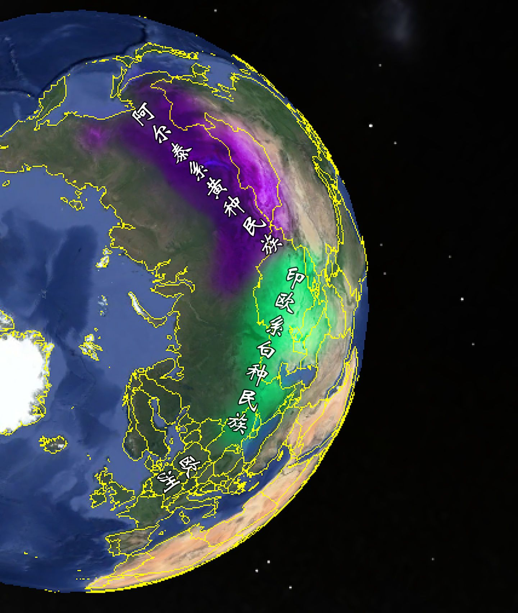
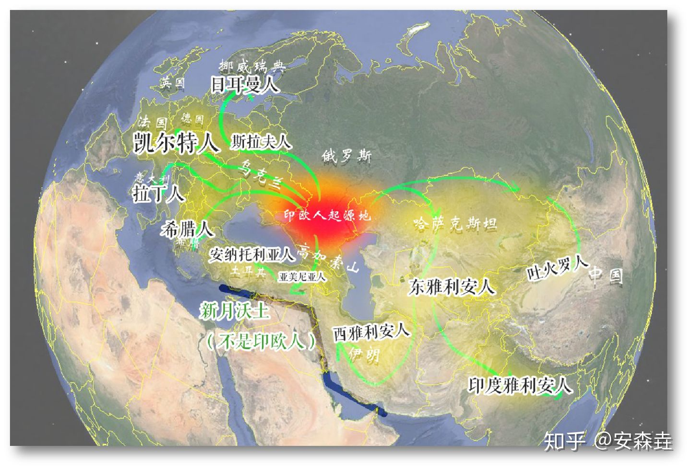
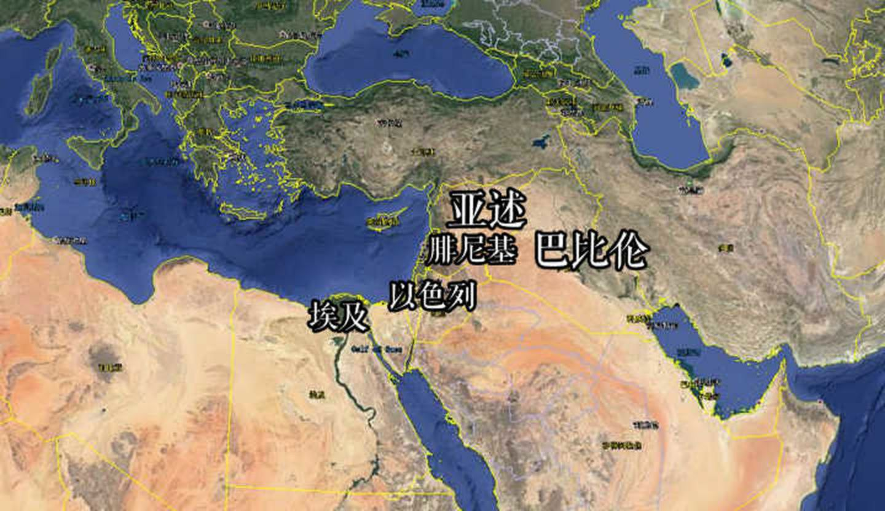

> ## 四大人种
>
> 四大人种：东方人种，肤色白黄、头发直、脸扁平、鼻扁、鼻孔宽大，体毛中等；欧洲人种，皮肤白红、鼻子高而狭，眼睛颜色和头发类型多种多样，体毛多；非洲人种，皮肤黑、嘴唇厚、鼻子宽、头发卷曲，体毛少；大洋洲人种，皮肤棕色或巧克力色，头发棕黑色而卷曲，鼻宽，胡须及体毛发达。
>
> ### 东方人种
>
> 亦称黄种。主要特征是黑色且较为硬直的头发，眼有内眦褶，体毛不发达，肤色中等。主要分布于亚洲东部、东南部和中亚。有的人也将[美洲土著](https://baike.baidu.com/item/美洲土著)归类于此。
>
> ### 非洲人种
>
> 亦称黑种。主要特征是黑色呈小卷曲状的毛发，一般分成南非和北非两个类型，前者分布在非洲撒哈拉以南的地区，鼻矮，通常为圆颅型，肤色相对较深；后者分布在非洲撒哈拉以北的地区，鼻高唇薄，通常为长颅型，肤色相对较浅；总体肤色较深。
>
> ### 高加索人种
>
> 亦称白种。主要特征是呈大波浪状且较为细软的毛发，毛发颜色主要有：黑、金、红、棕等色调，颧骨明显，鼻高唇薄，通常为长颅型，肤色较浅。
>
> [白色人种](https://baike.baidu.com/item/白色人种/10954244)主要起源自白人化之后的北非土著，后来经过长期的演化和定居，扩散到北非、西亚、南亚、欧洲以及16世纪以来逐渐扩散至整个大洋洲和南北美洲。
>
> ### 大洋洲人种
>
> 亦称棕种。主要特征是黑色呈小波浪状且较为粗糙的毛发，鼻高唇薄，通常为长颅型，肤色中等。主要分布在位于远东大洋洲上的岛屿上，以及澳大利亚和新西兰等地。例如新西兰北岛上的毛利人等。一般的衣物是用稻草编织而成的，而在建筑物的周围则一般会采用石雕来做装饰，海岛文明显著，在文明上主要是继承了隶属于古代美洲的印第安文明。
>
> 根据基因库网站信息表明，2002年Hurles et al.和2006年Ghiani etal.论文显示：Y-Q1a3a存在于波利尼西亚群岛，包括东部岛屿，显示是美洲土著印第安人迁徙到了这个区域！而这也为几百年来的大洋洲人种的来源之谜的争论划上了句号。

* 古文明之前的世界两大游牧民族（渔猎）体系

  

  * 活跃东部的阿尔泰系民族

  * 活跃在西边的印欧系民族

    从图上可以看到，他们可以说是世界上分布最广的民族之一了。

    印欧人因为多分布在高纬度地区，距离人类文明兴起的中纬度大河地区较远，所以本身的文化就有着很大的滞后性。

    

* 农业文明以及国家文明

  * 两河流域和埃及（新月沃土），创造或者说继承这一文明的族群，则是我们称之为「闪含族群」或者说叫「亚非族群」的兄弟

    

> 希腊、波斯这两个印欧族群逆袭一般的收拾掉了那些闪含族群，但却极大地困扰于这两位之间的战争，以及他们内部的骚乱走向了崩溃