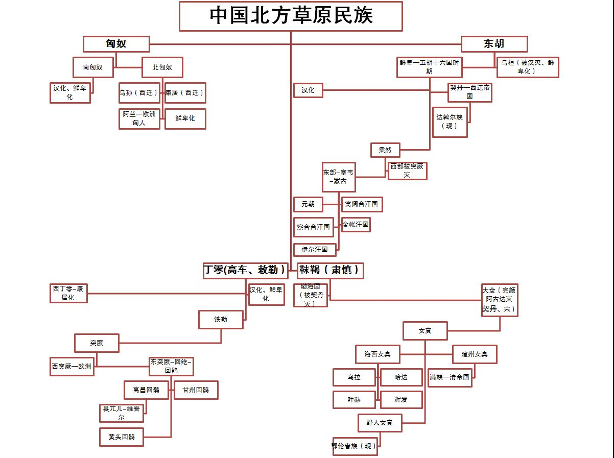
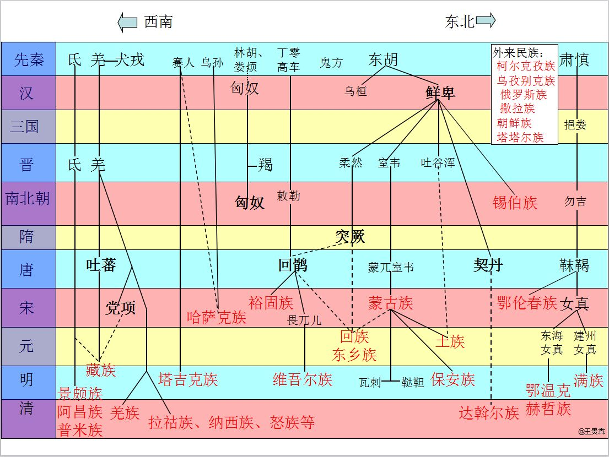

> 作者：龙翎
> 链接：https://www.zhihu.com/question/34856776/answer/86350890
> 来源：知乎
> 著作权归作者所有。商业转载请联系作者获得授权，非商业转载请注明出处。
>
> 
>
> 源流关系很简单：
>
> 首先是[叶尼塞语系](https://www.zhihu.com/search?q=叶尼塞语系&search_source=Entity&hybrid_search_source=Entity&hybrid_search_extra={"sourceType"%3A"answer"%2C"sourceId"%3A86350890})的**匈奴**，Y染色体单倍群是Q，他是单一系统，但对草原所有其他民族都产生了很大影响。和匈奴的源流有关联的其他民族包括山西一带的北狄各部落，另外印第安人绝大部分属于Q系。
>
> 其次是**阿尔泰语系诸民族**（Y染色体单倍群是C），分为三类来讲：
> 第一类，突厥语族，祖先是[贝加尔湖](https://www.zhihu.com/search?q=贝加尔湖&search_source=Entity&hybrid_search_source=Entity&hybrid_search_extra={"sourceType"%3A"answer"%2C"sourceId"%3A86350890})一带的丁零，早期包括[铁勒](https://www.zhihu.com/search?q=铁勒&search_source=Entity&hybrid_search_source=Entity&hybrid_search_extra={"sourceType"%3A"answer"%2C"sourceId"%3A86350890})、突厥、回鹘、坚昆，均西迁，回鹘的后裔成为维吾尔、哈萨克等等。突厥语族产生之后与东伊朗族系（白人）有诸多纠缠，故属于黄白混血种。
> 第二类，蒙古语族，其祖先为东胡，东胡后来分成两支，南支鲜卑→契丹 奚→[达斡尔](https://www.zhihu.com/search?q=达斡尔&search_source=Entity&hybrid_search_source=Entity&hybrid_search_extra={"sourceType"%3A"answer"%2C"sourceId"%3A86350890})，北支室韦→蒙古。还有一个民族柔然，从Y染色体构成来看应当也属于东胡系，与鲜卑的关系很密切。
> 第三类，通古斯语族，肃慎→靺鞨→女真各部→满族 [鄂温克](https://www.zhihu.com/search?q=鄂温克&search_source=Entity&hybrid_search_source=Entity&hybrid_search_extra={"sourceType"%3A"answer"%2C"sourceId"%3A86350890}) 鄂伦春 赫哲（注意金代女真和明代女真并非一回事，女真只是个统称）。该集团属于[阿尔泰](https://www.zhihu.com/search?q=阿尔泰&search_source=Entity&hybrid_search_source=Entity&hybrid_search_extra={"sourceType"%3A"answer"%2C"sourceId"%3A86350890})游牧者入侵并同化东北亚的渔猎人群的产物，故而带有较多的Y-N系。
>
> 再次是**扶余**系统，Y染色体单倍群是O2（旧划分方法），分布在吉林辽宁北朝鲜，包括獩貘→高句丽 [扶余](https://www.zhihu.com/search?q=扶余&search_source=Entity&hybrid_search_source=Entity&hybrid_search_extra={"sourceType"%3A"answer"%2C"sourceId"%3A86350890}) 百济等→消失，日本人的祖先勉强也属于此系统。
>
> 最后是**藏羌缅**系统，这批人都源于古羌人，与汉族有比较近的亲缘关系，Y染色体单倍群为O3（旧的划分方法）。在汉代有羊同、先零、白马、烧当等等。唐宋时则有吐蕃、党项等。现代缅族和彝族也属于这个集团。
>
> 
>
> 以下属于白人集团：
>
> **东伊朗**系统，白人，包括塞种人、大月氏（存疑）、乌孙、康居、奄蔡、大宛、粟特、波斯、于阗、疏勒等。与南俄草原的斯基泰人、萨马尔泰人、印度雅利安人、现代奥赛梯人均是近亲。Y染色体单倍群为R1a，与斯拉夫语族、印度人有相似源流。
>
> 这批人后期被突厥和回鹘征服、同化，变成了中亚各个民族的成分来源之一。其直系继承者在中亚仅剩[塔吉克](https://www.zhihu.com/search?q=塔吉克&search_source=Entity&hybrid_search_source=Entity&hybrid_search_extra={"sourceType"%3A"answer"%2C"sourceId"%3A86350890})民族而已。
>
> **吐火罗语族**（其命名实际上是个误会），白人，包括龟兹、车师、[焉耆](https://www.zhihu.com/search?q=焉耆&search_source=Entity&hybrid_search_source=Entity&hybrid_search_extra={"sourceType"%3A"answer"%2C"sourceId"%3A86350890})，是最早的新疆绿洲民族，祖先来自[阿尔泰北部](https://www.zhihu.com/search?q=阿尔泰北部&search_source=Entity&hybrid_search_source=Entity&hybrid_search_extra={"sourceType"%3A"answer"%2C"sourceId"%3A86350890})的阿凡纳谢沃文化，Y染色体单倍群R1b，其状更接近原始东欧人，语言源流却更接近西欧人。
>
> 这批人后期被突厥/回鹘人征服、同化，变成了维吾尔族的成分来源之一。

> from http://www.minzushi.org/
>
> 在历史上北方曾出现很多煊赫一时的民族，[匈奴](http://www.minzushi.org/category/altaic/xiongnu)、[鲜卑](http://www.minzushi.org/category/altaic/xianbei)、[柔然](http://www.minzushi.org/category/altaic/rouran)、[突厥](http://www.minzushi.org/category/altaic/turk)、[契丹](http://www.minzushi.org/altaic/qidan/560.html)、[女真](http://www.minzushi.org/category/altaic/turgus/nuchen)、[蒙古](http://www.minzushi.org/category/altaic/mongolia)、[扶余](http://www.minzushi.org/category/minzushi/fuyu)、[高句丽](http://www.minzushi.org/category/minzushi/gaogouli)、[回鹘](http://www.minzushi.org/category/altaic/uygur)、[吐蕃](http://www.minzushi.org/sino-tibetan/516.html)……，这些古代民族在分布、人口数量、民族文化等方面都有很多不相同的地方，在民族的起源、形成、历史、演变方面也都有各自的特点。这些民族大多都是由五部分演化而来，分别为：1、[匈奴](http://www.minzushi.org/altaic/xiongnu/539.html)部分；2、[东胡](http://www.minzushi.org/altaic/1242.html)部分；3、[突厥](http://www.minzushi.org/altaic/turk/382.html)部分；4、[通古斯](http://www.minzushi.org/category/altaic/tungus)部分；5、羌藏部分。而这五部分，按西方语系划分，对应关系为：突厥语族（支），包含突厥、[回纥](http://www.minzushi.org/altaic/uygur/646.html)；蒙古语族，包含东胡、鲜卑、柔然、契丹、蒙古、达斡尔；满-通古斯语族，包含肃慎、[靺鞨](http://www.minzushi.org/altaic/tungus/mojie/1343.html)、[渤海](http://www.minzushi.org/minzushi/1059.html)、女真、[满族](http://www.minzushi.org/category/altaic/turgus/manzu)；汉藏语系，汉、羌、氐、吐蕃、藏族。按生活方式又可划分为农耕、狩猎、渔猎、[草原游牧民族](http://www.minzushi.org/altaic/mongolia/714.html)。
>
> 关于北方民族的来龙去脉，一些学者更详细的观点：
>
> [匈奴民族史](http://www.minzushi.org/altaic/xiongnu/541.html)：战国后期兴起，汉武帝后[匈奴](http://www.minzushi.org/altaic/xiongnu/539.html)受到持续打击，主体在东汉被彻底击溃，北单于西逃欧洲，与后来迁入的马扎尔人融合，构成今天的匈牙利人（有争议，也许微乎其微）。
>
> [东胡民族史](http://www.minzushi.org/altaic/1242.html)：在秦朝时被匈奴灭亡，之后分成两大部分：乌桓和[鲜卑](http://www.minzushi.org/altaic/xianbei/673.html)。
>
> [乌桓民族史](http://www.minzushi.org/altaic/xianbei/1110.html)：被曹魏消灭，融入汉族及鲜卑。
>
> [鲜卑民族史](http://www.minzushi.org/altaic/xianbei/650.html)：主体部分在隋唐时终于被汉族同化，其余[滞留草原的在北魏演化为柔然](http://www.minzushi.org/altaic/rouran/644.html)。
>
> [柔然民族史](http://www.minzushi.org/altaic/rouran/644.html)：源自[拓跋鲜卑](http://www.minzushi.org/altaic/xianbei/673.html)，后被突厥击败，灭亡于西魏末年，部众分化为室韦(蒙古)和契丹（有争议），[阻卜](http://www.minzushi.org/altaic/mongolia/471.html)似与柔然、蒙古有关。
>
> [契丹民族史](http://www.minzushi.org/tag/辽)：主体被女真族和汉族同化，剩余的西逃到中亚，建立西辽政权，与当地人融合，成为中亚人的一部分。我国东北达斡尔与契丹有较直接亲缘关系。
>
> [蒙古民族史](http://www.minzushi.org/altaic/mongolia/344.html)：为先秦时东胡的一部分，由鲜卑柔然演化而来（有争议），一直发展没落到现在冒出来个[泛蒙古主义](http://www.minzushi.org/altaic/mongolia/491.html)，蒙古国源自达延汗分封的[喀尔喀万户](http://www.minzushi.org/altaic/mongolia/757.html)，中国[内蒙古也有部分喀尔喀](http://www.minzushi.org/altaic/mongolia/718.html)。[蒙古人普遍信仰萨满](http://www.minzushi.org/altaic/mongolia/358.html)。
>
> [突厥民族史](http://www.minzushi.org/altaic/turk/382.html)：有可能是匈奴的一个分支，后灭亡了柔然，其自身主体被回鹘和唐所灭，剩余的向西逃窜，形成了今天主张[泛突厥主义](http://www.minzushi.org/altaic/turk/388.html)的土耳其人。仍有很多进入中原，比如，沙陀人（沙沱人、沙坨人），先后创建多个国家或部落组织-[突厥汗国](http://www.minzushi.org/altaic/turk/372.html)、[东突厥汗国](http://www.minzushi.org/altaic/turk/507.html)、[西突厥汗国](http://www.minzushi.org/altaic/turk/501.html)、[后突厥汗国](http://www.minzushi.org/altaic/turk/504.html)、[葛逻禄](http://www.minzushi.org/altaic/turk/704.html)、[喀喇汗国](http://www.minzushi.org/altaic/turk/392.html)等。突厥人都成了穆斯林，是突厥人推动了[新疆的伊斯兰化](http://www.minzushi.org/altaic/turk/463.html)。[现代突厥人分布在世界各地](http://www.minzushi.org/altaic/turk/379.html)。
>
> [回鹘民族史](http://www.minzushi.org/altaic/uygur/646.html)：主体由丁零人构成，融入了铁勒（敕勒）和高车人的一部分，在唐朝时期，将[突厥](http://www.minzushi.org/altaic/turk/376.html)主体灭亡。回鹘生存发展到现在，就是今天的[维吾尔](http://www.minzushi.org/altaic/uygur/646.html)族。
>
> [夫余民族史](http://www.minzushi.org/minzushi/gaogouli/690.html)：后来分为两支，一支为[高句丽](http://www.minzushi.org/minzushi/gaogouli/679.html)，一支被北方早期民族同化。[秽貊与扶余、高句丽关系](http://www.minzushi.org/minzushi/gaogouli/690.html)复杂，[橐离、扶余、高句丽](http://www.minzushi.org/minzushi/fuyu/666.html)似也有关联。
>
> 夫余和女真系的关系是怎样的呢？（夫余的史料很少，但其实它是热点，是东北亚历史重要组成部分）
>
> [女真民族史](http://www.minzushi.org/altaic/turgus/nuchen/781.html)：源自肃慎，后称挹娄，又称靺鞨，后为女真，建立[金国](http://www.minzushi.org/altaic/turgus/nuchen/766.html)，[元时女真](http://www.minzushi.org/altaic/turgus/nuchen/768.html)衰退，[元对东北女真族的统治](http://www.minzushi.org/altaic/turgus/nuchen/770.html)严苛，[女真族的社会形态](http://www.minzushi.org/altaic/turgus/nuchen/781.html)不均衡，明朝时分化为[建州女真](http://www.minzushi.org/altaic/turgus/nuchen/727.html)、[海西女真](http://www.minzushi.org/altaic/turgus/nuchen/734.html)、野人女真，建州起源于[胡里改](http://www.minzushi.org/altaic/turgus/nuchen/778.html)，后发展为满洲（有争议），[努尔哈赤建立后金](http://www.minzushi.org/altaic/turgus/manzu/747.html)，[皇太极](http://www.minzushi.org/altaic/turgus/manzu/751.html)时更国号为清，建立[满清](http://www.minzushi.org/altaic/turgus/nuchen/725.html)王朝，一直没落到现在，即今天的满族人。[朝鲜东北部也曾长期是女真人的居地](http://www.minzushi.org/altaic/turgus/nuchen/774.html)。
>
> 党项民族史：羌族的一部分，似乎融入了拓跋部鲜卑。后被蒙古人灭亡。
>
> 氐：和羌族较近，但有人认为是匈奴一部分，后被汉族融化。
>
> [吐蕃民族史](http://www.minzushi.org/sino-tibetan/516.html)：藏族，是古代羌族发展而来，与汉民族同属汉藏语系。
>
> [渤海民族史](http://www.minzushi.org/minzushi/1059.html)：粟末靺鞨大祚荣建立渤海国，统治阶层为文明程度较高的粟末靺鞨人和高句丽国遗民，国民有粟末靺鞨人、高句丽人、黑水靺鞨人。渤海被契丹灭后，居民部分被契丹强迁内地和辽东最终融入汉和蒙古，部分投奔高丽，大部分留居原地融入起源于黑水靺鞨的女真人。
>
> 只有民族的才是世界的，本站要记述每一个史上留下印迹的民族历史。

## 羌人

> 作者：安森垚
> 链接：https://www.zhihu.com/question/34856776/answer/1048893096
> 来源：知乎
> 著作权归作者所有。商业转载请联系作者获得授权，非商业转载请注明出处。
>
> 
>
> 不过上面的内容里，也提到了题主所问的**“羌人”**，其实比起北方游牧民，羌人可是实实在在的汉人同胞——
>
> 图 如今“汉藏语系”的分布。
>
> 汉语在语言学上，属于**“汉藏语系”**的“汉语族”；除此外，就是西侧的**“藏缅语族”**了——大约在6000年前，汉、藏、彝等族群还是一个在青海甘肃一带的民族“古羌人”，不知道是因为气候原因还是闹了啥矛盾——
>
> - 一部分向东部移动形成了中国汉人的祖先；
> - 留在原地的则成为**“羌”**的祖先；
> - 还有一部分西迁到高原内部的，则成为了藏人的祖先。
>
> 羌人如今仍然存在于甘肃川西等汉藏交界的地区，前面提到的**氐族**可能也是他们的一支，除此外，以彝族、境外缅族为代表的族群，同样是羌人的一支，可以看出在汉、藏的压力下，他们甚至只能南迁到了东南亚。
>
> 总之，汉、羌同源，在历史上却并不和睦——一个选择农耕，一个留守牧猎，生产生活方式、意识状态的不同，比所谓血缘的不同的矛盾厉害的多，正如如今的印巴、朝韩等等。

## 鲜卑

> 同样的事情，也发生在北朝的北魏，和他们北方的敌人——**柔然**——身上。
>
> 柔然的上层，不仅和北魏同为鲜卑人，甚至他们的开国之君是个连名字都没有的**拓跋部奴隶**，他的名字**木骨闾**（lǘ）还是北魏先祖拓跋力微给起的外号（鲜卑语秃头的意思，这哥们谢顶）。
>
> 木骨闾趁着拓跋部本部专心中原无暇北顾，开始在漠北建立自己的鲜卑系汗国——**“柔然”**——所以终北魏一朝，他们也不得不面对两线敌人的夹击——一个是南朝的汉人，一个是漠北他们的同胞——花木兰打的，正是这群**柔然**。
>
> 
>
> 作者：安森垚
> 链接：https://www.zhihu.com/question/34856776/answer/1048893096
> 来源：知乎
> 著作权归作者所有。商业转载请联系作者获得授权，非商业转载请注明出处。

> 大*鲜卑山*，古山名，即今之大兴安岭，为北魏王朝皇室拓跋氏发祥地。《魏书·序纪》提到拓跋鲜卑起源时，记载：“国有大*鲜卑山*，因以为号
>
> 鲜卑山，古山名。在今内蒙古自治区科尔沁右翼中旗西，本地人称为蒙格
>
> 乌桓山。在内蒙古阿鲁科尔沁旗以北，即大兴安岭山脉南端。

> 发于东胡，

## 突厥

> 作者：安森垚
> 链接：https://www.zhihu.com/question/34856776/answer/1048893096
> 来源：知乎
> 著作权归作者所有。商业转载请联系作者获得授权，非商业转载请注明出处。
>
> 
>
> 就在这个时候，柔然的厄运也来了。
>
> 为了对付敕勒、高车，他们曾收抚了一个同出自突厥的部落作为“打铁奴”存在，他们的首领为“**阿史那土门**”，利用二鬼子身份，不断攻伐、收编自己的同胞——就在他又一次击败收编5万余户敕勒同胞后——开始跑去和柔然可汗**阿那懐**套近乎去了。
>
> > 阿史那土门：可汗可汗，你看我这么能干，那就是忠心大大滴，为了我能继续加油，能不能把你家大脸盘子公主嫁给我啊？
> > 阿那懐：放屁！你个打铁的奴隶三姓的家奴，还想要我家高贵的血统？滚！
>
> 备受打击的阿史那土门，留下弟弟**阿史那室点密**在老家看家，带着大军顺利的就干掉了柔然汗国，就连北朝的北周都没反应过来——柔然就莫名其妙的没了。
>
> 阿史那土门彻底占领漠北，十分开心，将这里突厥语各部落如**回纥、薛延陀、拔野古**等等提高地位，逼东胡系鲜卑人逃回老家大兴安岭黑龙江流域，又被称为**“鞑靼、室韦”**两部，其中“室韦”很可能就是鲜卑的异译，而那个鞑靼，一般认为是突厥语对“外族”的称呼。
>
> 图 东胡系蒙古语族的暂时衰落，东部的“靺鞨（mò hé）”为通古斯系。
>
> 阿史那土门大功告成，宣布建国“突厥汗国”，设大帐于色楞格河流域的“斡耳朵巴里（urdobalik）”，就是突厥语“帐篷城”的意思，以**“库里台大会”**为最高政治机构（后来蒙古延续了这个，名字都没改）——并宣布自己为**“伊利可汗”**，统领各部。
>
> 图 突厥汗国的建立。
>
> 这样一来，留在老家看家的弟弟**阿史那室点密**就不乐意了，你说老哥你灭了柔然，当了个“伊利可汗”，我连个“三鹿可汗”都当不上这太扯了，于是一咬牙一跺脚，打算**从阿尔泰山向西**打去——
>
> 没想到，打大发了——
>
> 图 突厥汗国的扩张。
>
> 阿史那室点密，统合已经西迁的突厥各部，在**布哈拉之战**（乌兹别克斯坦）击败中亚霸主**“嚈哒（yàn dā）”**，最后一路打到欧洲的黑海，也正是在这一过程中，大量突厥人开始和印欧系的游牧民混血，逐渐形成了**“西突厥乌古斯”**，这也就是我们为啥提到突厥总有种是“白种人”的感觉。
>
> 总之，这块突厥汗国西部领土因为一共靠**十个**西部突厥部落完成，所以又称“**十箭**（On oq）”。
>
> 突厥汗国在室点密晚年，竟然因为和波斯萨珊王朝出现商路冲突——**和东罗马帝国结盟，共克波斯**，势力达到顶峰——而东罗马不会想到，这个异军突起的小兄弟，竟让会成为终结自己生命的刽子手。

> 作者：安森垚
> 链接：https://www.zhihu.com/question/24644463/answer/71535581
> 来源：知乎
> 著作权归作者所有。商业转载请联系作者获得授权，非商业转载请注明出处。
>
> 
>
> 拓跋柔然驱赶了在贝加尔湖一带游牧的**“铁勒”**，铁勒也较高车，因为他们的车轮很高..认真脸，铁勒没有办法，带着小姨子们跑了，跑到了遥远的西方.....当然这其中也包括我们的新疆。
>
> ...
>
> 别忘了，**当时被柔然欺负的铁勒，就是也叫“高车”的那个民族**，不愧车轮子高**，逐渐渗透到新疆，甚至跑到了黑海一带。**
>
> 
>
> **柔然虽然**本质是东胡鲜卑，但是由于融合过多的匈奴残部以及其他游牧民族，变得酷似匈奴一样的混合型种族。**突厥**本是一支名为——**阿史那**的部落，是一支活动在阿尔泰山一带的小型游牧部落**，由于柔然强大，同样被欺负，成为柔然的“打铁奴”**。
>
> - **结果这群铁勒也不愿意一直被柔然控制，所以除了有一波融入了巴尔干的斯拉夫人之外（保加利亚的保加尔人），剩下的以铁勒里最强大的回鹘打头，开始全力进攻柔然，希望回到贝加尔湖畔........**
>
> **结果这群打铁奴，这个阿史那的首领——阿史那土门，竟然蛇吞象，直接灭掉了来势汹汹的铁勒，保护了他的“主人”。这个阿史那稀里糊涂的控制了铁勒，结果反而被“铁勒化”了，说了铁勒的语言，这个部族越来越强大——最后由于生活在被自己称为“突厥”的阿尔泰山**，随着部族的强大，他们建立了**“突厥汗国”。**
>
> - **正因为突厥的崛起，他们所说的铁勒语**还有一系列的“东胡语”，都被称作是**阿尔泰语系**。
>
> 　　所以这个时候的突厥完全有实力挑战他的“主人”了，**突厥**向东将柔然打败，柔然分成了两个部落向大兴安岭老家逃窜，一个是北边的**“室韦”**，一个是南边的**“契丹”**，说到室韦大家可能不清楚，但是说到他的别部“蒙兀室韦”或者说“蒙古”呢.......
>
> 　　　**总结一下，突厥这个新型的民族就是，和上面的匈奴类似，是以阿史那部落为统治者，以混合民族“铁勒”为主体的民族。**
>
> 
>
> **其中“铁勒”分成好多小部落，前面也提到了，最大的几个就是——回纥（维吾尔），薛，延陀，图瓦等等。**

> 作者：安森垚
> 链接：https://www.zhihu.com/question/24644463/answer/71535581
> 来源：知乎
> 著作权归作者所有。商业转载请联系作者获得授权，非商业转载请注明出处。
>
> 
>
> **回纥终于出现了...其实啊，前文说道那群留在欧洲巴尔干的铁勒人，一大部分就是回纥人，现在欧洲的保加利亚，还有相当多的回纥血统，保加尔（**Bulgar）和**回纥**（Uygur ）本身就是同源词，所以啊，如果按所谓血统，那么保加利亚是不是要和新疆成为“兄弟国家”啊，多无聊...
>
> 逐渐强大的突厥汗国中回鹘的一部分**葛逻禄部**开始西征，很快开始占领已经无主的中亚诸国，向西一直达到高加索山，向东到达中国大兴安岭，建立了极大的突厥汗国，**突厥将帕米尔西边的塞种人称为“西乌古斯”，将帕米尔东边的回纥薛延陀们，称为东乌古斯，**乌古斯也就是突厥语部落的意思。
>
> - 西乌古斯多为白种人和黄白混血，东乌古斯的回纥薛延陀多为黄色人种。
>
> **东西乌古斯本来就不和突厥内部也有分歧，所以隋文帝也就一直挑拨离间，直接拆分了突厥汗国。唐代一建立，民生凋敝，突厥直接欺负到了家门口，随着李世民对东西突厥的征服，铁勒诸部归属唐朝，并在唐朝的默许下返回蒙古高原休养生息。**
>
> - **西突厥的西乌古斯们**被降服后西迁，一直生活在河中地区，没想到最后稀里糊涂的灭掉了强大的波斯哈里发，甚至吊打了存在长达千余年的东罗马帝国，建立一个让欧洲搞出十字军东征的突厥王朝——塞尔柱帝国，不过这是后话了。
>
> 　　公元630年，原属西突厥的伊吾城（现在的哈密）主率所属七城归顺唐朝，唐朝设西伊州（后改称伊州）。武则天垂帘听政时期，唐兵分两路进攻北疆**吉木萨尔**设立**北庭都护府**，南部进入高昌设立高昌都护府。当西突厥投降后，唐朝统安西四镇：龟兹、疏勒、于阗、**碎叶（今吉尔吉斯斯坦的托克马克市），一种说法也是李白出生的地方（每次想到李白静夜思竟然是思的这个地方也是很违和啊）**，辖境相当今新疆及哈萨克东部、吉尔吉斯北部楚河流域。
>
> - 也就是说当时的西域在突厥化的各个民族基础上有大量的汉人定居，整个亚欧大陆桥带给了整个新疆地区世界中心一样的荣耀。
>
> 佛教在此时空前发展，因为唐朝笃信佛教，所以从天竺以及波斯一带甚至粟特的僧人在西域云游，极大地带动了西域的佛教发展。也有了敦煌莫高窟这样的千古绝迹。
>
> 而由于在这之前，**波斯萨珊王国被穆斯林哈里发灭亡**，许多被迫害的信仰琐罗亚斯德教（袄教）“异教徒”被迫逃亡新疆一带，使得祆（音仙）教传入中国，随之而来的还有波斯一带祆教的“升级版”，融合了佛教基督教成分的“摩尼教（明教）”在西域地区传播，甚至到达中国内地，并在元末发展到顶峰，甚至传说成了明王朝的名号由来。
>
> 祆教和摩尼教都是信仰唯一主神光明神，认为世界的主宰是永恒光明。但却带有二元论思想，认为黑暗和光明对立，永远存在，这一点和基督教又有相似之处。只不过摩尼教受到贵霜王朝的佛教以及美索不达米亚传来的原始基督教后，变成了一种比较杂糅的宗教。
>
> 以佛教为主的西域地区夹杂着袄教，也吸引了汉族的僧侣前去游学。正如著名的玄奘，基本的活动区域就在西域诸国，河中地区以及天竺。也就是说，不是我黑老版《西游记》，一个一直活动在西域以及印度的玄奘，里面出现的人物以及景观竟然全是汉族传统服饰，也是比较矛盾。但可以肯定的是，当时的女子服装存在**裸装**和**半裸装，**就是和西域民族服饰融合的结果。西域服装也汉族化，这一时期的汉化几乎达到历史顶峰（文化上）。 
>
> 
>
> **此时已经不存在单纯意义的塞种了，而是臣服于唐的突厥人，这些亚欧混血人，也开始不说印欧语系的语言，开始变为和如今蒙古语一样的阿尔泰语言。此时在漠北蒙古高原仍然有突厥势力还是很强。**
>
> - **终于在743年，铁勒回纥，在唐朝的帮助下，灭掉突厥残余势力，强大起来，并且亲唐汉化，“****改名回鹘，取义为“回旋轻捷如鹘”——****建立回鹘汗国。没错，这时候的回鹘我们可以认为是现在“维吾尔族”的直系祖先了。**
> - **其实不难发现，这两个民族的最早接触，一直是建立在友谊上的。而被维吾尔恐怖分子鼓吹的大突厥主义，正是他们千年前的夙敌。**
> - **回鹘民族在明被音译为畏兀儿，清代被音译为维吾尔（维系你我），都缺失了这带有汉民族语言特色灵性的名字，变得异类，陌生。**

> 公元840年，在**黠戛斯**的入侵下，（黠戛斯在传说中，是当时留在匈奴的李陵的李氏家族的后裔作为统治者，虽然是个传说，但是民族性对于中亚来说真的算不得什么），蒙古高原的回鹘汗国灭亡，一部分回鹘人进入到甘肃一带，成为后来的裕固族，一部分与汉人融合**，剩下的回鹘人再次回到故地，新疆高昌吐鲁番一带，进入汉人较多的高昌地区，建立“高昌回鹘汗国”。还有一支回鹘人向东进入了契丹，也就是述律部，后来成为了著名的“萧部”。**也就是说，这个时候，回鹘作为一个独立民族正式在南疆东部建国。但这个回鹘，还是一个以黄种人为主要父系，其中或许有一点的塞种血统或者吐火罗血统。塔里木盆地的信仰袄教的吐火罗人以及突厥人还有一部分粟特人与回迁的回鹘融合，基本奠定了维吾尔人的基础。可以说在这个时候，回鹘虽然与突厥同文，但并不同种，并且分道扬镳多年了。
>
> 
>
> 作者：安森垚
> 链接：https://www.zhihu.com/question/24644463/answer/71535581
> 来源：知乎
> 著作权归作者所有。商业转载请联系作者获得授权，非商业转载请注明出处。

## 高句丽

> 看到上面这个图你也会发现，东北那个让隋炀帝完犊子的**高句丽**，也出事了——
>
> 高句丽，本是如今松花江流域（吉林一带）的一个民族**“扶余”**建立的国家，领土横跨东北和朝鲜半岛北部——所以，无论是唐朝，还是半岛南部的土著**“韩人”**，看他都很不顺眼。
>
> 所以，唐朝最终和**韩人国家“新罗”**联合，一同干掉了高句丽，最后平分其尸体——**东北归唐朝，半岛归韩人**——其实这才是如今“朝鲜”国家的开端。
>
> 至于那个扶余人，一部分并入韩人，另一些成了唐人的一部分，比如唐朝大将高仙芝；剩下的去向——就是我们接下来要说的**“靺鞨”**了，黑龙江下游的**“通古斯人”**终于要登场了。
>
> 
>
> 作者：安森垚
> 链接：https://www.zhihu.com/question/34856776/answer/1048893096
> 来源：知乎
> 著作权归作者所有。商业转载请联系作者获得授权，非商业转载请注明出处。

## 回纥/回鹘

> 作者：安森垚
> 链接：https://www.zhihu.com/question/34856776/answer/1048893096
> 来源：知乎
> 著作权归作者所有。商业转载请联系作者获得授权，非商业转载请注明出处。
>
> 
>
> 而正如我们之前所说，这个漠北的民族和中原隔着个大漠，就算强如唐朝也没法真正统治它，突厥甚至还复苏出来一个“后突厥汗国”占领漠北——唐朝最后也只能恢复“雄鸡”模式，寻找了一个突厥人里看它最不爽的小弟取代它，那就是**“回纥**（hé）——Uyghur**”**。
>
> 图 回鹘汗国。
>
> “回纥”其实也是突厥语民族，只不过他们非常不爽阿史那家族的统治，这时候唐朝抛来橄榄枝，愿意和自己彻底瓦解突厥汗国，自然很开心，还把回纥改成了更好听的**“回鹘”**。
>
> - 最终回鹘不负众望，和唐朝一起全灭阿史那，成为了听话的乖宝宝，两方都开心。

## 女真

> 作者：安森垚
> 链接：https://www.zhihu.com/question/34856776/answer/1048893096
> 来源：知乎
> 著作权归作者所有。商业转载请联系作者获得授权，非商业转载请注明出处。
>
> 
>
> **第一，就是众所周知的——明朝末年，东北的女真人，又一次崛起了**。
>
> 图 三部女真人。
>
> 这个女真和金朝的女真啥关系呢，大致就相当于你们一家兄弟俩，哥哥出国留学，最终后代入了美国籍，走上人生巅峰；你则留在老家耕田，至今未脱贫。
>
> 你老哥就是金朝的女真，你就是这时候的女真三部，虽然血统一样，但你真正落后了人家一个时代。
>
> 不过，正是这群在东北的弟弟，却同样不想认命——其中最不老实的，就是汉化程度最高的辽宁建州女真，在首领努尔哈赤、皇太极（台吉）两代人的努力下，他们统合女真三部后，竟然成功收服了打败自己祖先的蒙古——喀尔喀蒙古、察哈尔蒙古全部归于他们建立的**“后金”**政权下。
>
> 所以后金政权一开始就是一个“女真蒙联盟”，皇太极的有名老婆——“孝庄太后”就是蒙古**“博尔济吉特”**氏，其实就是成吉思汗的“孛儿只斤”。
>
> 最终，女真人改族名为“**满洲**（可能来自“文殊”）”，改国号为**“清”**，入主中原，成为了中国最后一个王朝。
>
> 就在大清建立后，瓦剌竟然也重新翻身了——

## 瓦剌

> 首先，瓦剌四部中的**“和硕特部”**崛起，直接占领蒙古人从未真正统治的西藏地区，建立“和硕特汗国”；随后，本来边缘化的**也先后人**带领的**“准噶尔部”**终于找回了昔日荣光，他们灭掉了蒙古寿命最长的**东察合台汗国**，占领新疆以及现在哈萨克斯坦东部——建立**“准噶尔汗国”**。
>
> 准噶尔汗国和和硕特汗国关系紧密，也深信藏传佛教。其著名首领噶尔丹，更是你看任何清宫剧都只闻其人不见其面的神奇存在——经过康、雍、乾三朝，准噶尔一直坚挺，甚至最后还灭了和硕特统治整个疆藏——
>
> 然而最后，还是被狗皮膏药之神——乾隆给端了——
>
> 
>
> 至此，清朝某种意义来说，解决掉了中国历史上几乎所有“蛮族力量”的策源地——蒙古、新疆、西藏——中国自古以来的“雄鸡”地形，竟然变成了个史无前例的“海棠叶子”——看似真是万世江山永固了
>
> ——虽然大清的统治者，本身就是个外族。
>
> 但是，全新的敌人，早已卧在了清帝国的头上——那就是在金帐汗国中独立的**“莫斯科大公国”**，或者说“沙皇俄国”、“俄罗斯帝国”。
>
> 
>
> 作者：安森垚
> 链接：https://www.zhihu.com/question/34856776/answer/1048893096
> 来源：知乎
> 著作权归作者所有。商业转载请联系作者获得授权，非商业转载请注明出处。
>
> 

