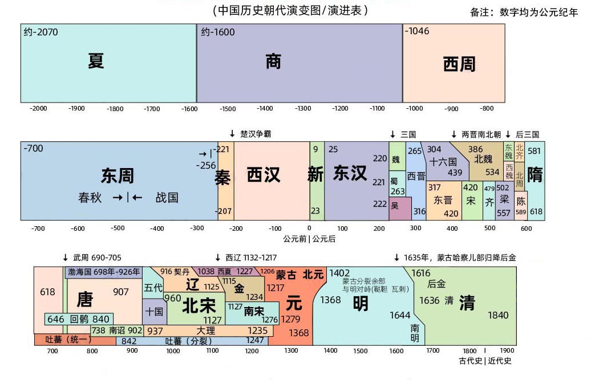
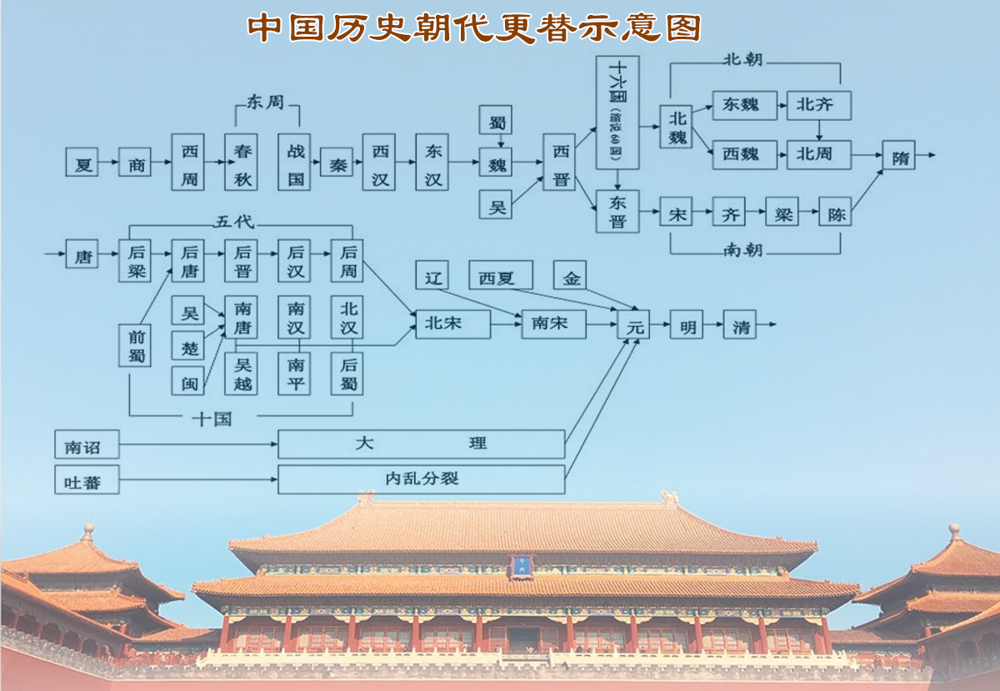
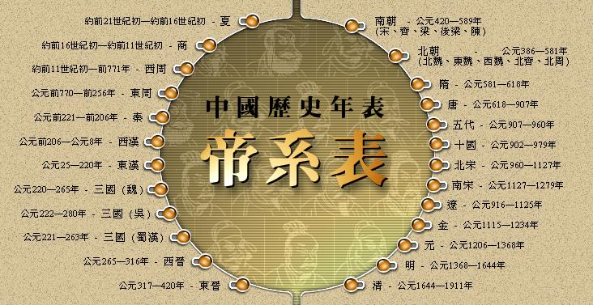
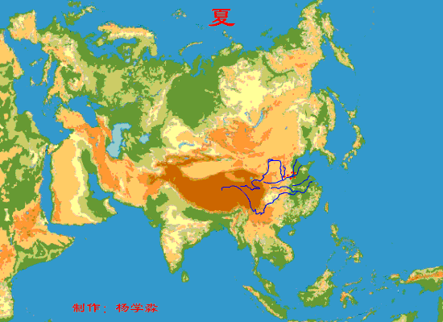

http://www.renwujieshao.com/chaodai/

# 历史朝代

- 中国历史朝代顺序：夏、商、西周、东周、秦、西汉、东汉、三国（曹魏、蜀汉、东吴）、西晋、东晋、五胡十六国、南朝（宋、齐、梁、陈）、北朝（北魏、东魏、北齐、西魏、北周）、隋朝、唐朝、五代十国、宋（北宋、南宋）、辽、西夏、金、元、明、清。中国朝代简史：夏商周秦汉，魏晋南北隋，唐宋元明清。

## 中国历史朝代顺序表

**中国朝代顺序：**夏朝、 商朝、 周朝【西周、 东周（春秋、 战国）】、 秦朝、西楚、 汉朝【西汉、 新朝、玄汉、 东汉】、 三国（曹魏、蜀汉、东吴）、 晋朝【西晋、（东晋、五胡十六国）】、南北朝【南朝（宋、齐、梁、陈） ；北朝（北魏、东魏、西魏、北齐、北周） 】隋朝、 唐朝、 五代十国（五代：后梁、后唐、后晋、后汉、后周；十国：南吴、前蜀、吴越、楚、闽、南汉、荆南、后蜀、南唐、北汉） 、宋朝（北宋、南宋）、辽、西夏、金、元朝、明朝、清朝。

中国古代政权的最高统治权力者皆是王或皇帝，由家族世袭相承构成的“家天下”的政权称之为“朝”或“朝廷”。此等由世袭王族所建构的政权更替构成了中国朝代。东汉末年之前，只有被视为正统之天下共主才敢称朝。而不是随便一个国号、政权都可以称“朝”，非正统割据的称为“国”。更换非本家族继承人的中原王朝大多都会更改国号及正朔（如年号等纪年方法）。一般奉在中原的王朝为正朔，其他为割据政权。五代十国（“代”为正统，“国”为割据）是个很明显的例子，就像把中国历史朝代整合成**朝代歌**（朝代顺序表口诀），一般称之“唐宋元明清”，而不是“唐宋金元明清”。

如图**中国历史朝代**纪年表色块长度宽度只是示意各个不同历史时期及对应关系，不代表实际对应的年限。

因为篇幅所限，部分割据政权，少数民族政权未罗列。1912年辛亥革命后是共和制，并非世袭家族统治，故不被列入。

**中国历史朝代纪年表（历史朝代顺序表图）**

## **中国历史朝代顺序表及开国皇帝**

|                             朝代                             |                           起讫年代                           |                             都城                             |                今地                |                       建立者/开国皇帝                        |                           详细介绍                           |                                                              |        |
| :----------------------------------------------------------: | :----------------------------------------------------------: | :----------------------------------------------------------: | :--------------------------------: | :----------------------------------------------------------: | :----------------------------------------------------------: | ------------------------------------------------------------ | ------ |
|                             夏朝                             |                约前2070年～前1600年（470年）                 |                             安邑                             |              山西夏县              |                              禹                              |  [夏朝历史>>](http://www.renwujieshao.com/chaodai/xiachao/)  |                                                              |        |
|                            商朝①                             |                约前1600年～前1046年（554年）                 |                              亳                              |              河南商丘              |                              汤                              | [商朝历史>>](http://www.renwujieshao.com/chaodai/shangchao/) |                                                              |        |
|                           **周朝**                           |                            西周②                             |                 约前1046年～前771年（275年）                 |                镐京                |                           陕西西安                           | [周文王](http://www.renwujieshao.com/lishi/zhouchao/jichang.html)[姬发](http://www.renwujieshao.com/lishi/zhouchao/jifa.html) | [西周>>](http://www.renwujieshao.com/chaodai/zhouchao/)      |        |
|                             东周                             |                       前770年～前256年                       |                             洛邑                             |              河南洛阳              | [周平王](http://www.renwujieshao.com/lishi/zhouchao/zhoupingwang.html)[姬宜臼](http://www.renwujieshao.com/lishi/zhouchao/zhoupingwang.html) |   [东周>>](http://www.renwujieshao.com/chaodai/zhouchao/)    |                                                              |        |
|                                                              |                             春秋                             |                       前770年～前476年                       |                 -                  |                              -                               |                              -                               | [春秋>>](http://www.renwujieshao.com/chaodai/chunqiu/)       |        |
|                             战国                             |                       前475年～前221年                       |                              -                               |                 -                  |                              -                               |    [战国>>](http://www.renwujieshao.com/chaodai/zhanguo/)    |                                                              |        |
|                           **秦朝**                           |                   前221年～前207年（15年）                   |                             咸阳                             |              陕西咸阳              | 秦国历代国君 始皇帝[嬴政](http://www.renwujieshao.com/lishi/qinchao/qinshihuang.html) 秦朝皇帝列表 |    [秦朝>>](http://www.renwujieshao.com/chaodai/qinchao/)    |                                                              |        |
|                             西楚                             |                   前206年～前202年（5年）                    |                             彭城                             |              江苏徐州              | 西[楚霸王](http://www.renwujieshao.com/lishi/qinchao/xiangyu.html)[项羽](http://www.renwujieshao.com/lishi/qinchao/xiangyu.html) |                                                              |                                                              |        |
|                           **汉朝**                           |                             西汉                             |                  前202年～公元8年（210年）                   |                长安                |                           陕西西安                           |                   汉高帝刘邦 西汉皇帝列表                    | [西汉>>](http://www.renwujieshao.com/chaodai/hanchao/)       |        |
|                             新③                              |                      8年～23年（16年）                       |                             常安                             |              陕西西安              | [王莽](http://www.renwujieshao.com/lishi/hanchao/wangmang.html) |    [新朝>>](http://www.renwujieshao.com/chaodai/xinchao/)    |                                                              |        |
|                            玄汉③                             |                   23年2月～25年9月（2年）                    |                        宛城 洛阳 长安                        |     河南南阳 河南洛阳 陕西西安     | 汉[更始帝](http://www.renwujieshao.com/lishi/hanchao/liuxuan.html)[刘玄](http://www.renwujieshao.com/lishi/hanchao/liuxuan.html) |    [玄汉>>](http://www.renwujieshao.com/chaodai/xuanhan/)    |                                                              |        |
|                             东汉                             |                     25年～220年（195年）                     |                             洛阳                             |              河南洛阳              | 汉[光武帝](http://www.renwujieshao.com/lishi/hanchao/liuxiu.html)[刘秀](http://www.renwujieshao.com/lishi/hanchao/liuxiu.html) 东汉皇帝列表 |    [东汉>>](http://www.renwujieshao.com/chaodai/hanchao/)    |                                                              |        |
|                           **三国**                           |                             曹魏                             |                     220年～265年（45年）                     |                洛阳                |                           河南洛阳                           | 魏文帝[曹丕](http://www.renwujieshao.com/lishi/sanguo/caopi.html) | [三国>>](http://www.renwujieshao.com/chaodai/sanguo/)        |        |
|                             蜀汉                             |                     221年～263年（42年）                     |                             成都                             |              四川成都              | 汉昭烈帝[刘备](http://www.renwujieshao.com/lishi/sanguo/liubei.html) |                                                              |                                                              |        |
|                             东吴                             |                     222年～280年（58年）                     |                             建业                             |              江苏南京              | 吴大帝[孙权](http://www.renwujieshao.com/lishi/sanguo/sunquan.html) |                                                              |                                                              |        |
|                           **晋朝**                           |                             西晋                             |                     265年～316年（51年）                     |                洛阳                |                           河南洛阳                           | 晋武帝[司马炎](http://www.renwujieshao.com/lishi/jinchao/simayan.html) 西晋皇帝列表 | [西晋>>](http://www.renwujieshao.com/chaodai/jinchao/)       |        |
|                             东晋                             |                    317年～420年（103年）                     |                             建康                             |              江苏南京              | [晋元帝](http://www.renwujieshao.com/lishi/jinchao/simarui.html)[司马睿](http://www.renwujieshao.com/lishi/jinchao/simarui.html) 东晋皇帝列表 |    [东晋>>](http://www.renwujieshao.com/chaodai/jinchao/)    |                                                              |        |
|                         五胡十六国④                          |                    304年～439年（135年）                     |                                                              |                                    |                                                              | 见[五胡十六国表](http://www.renwujieshao.com/chaodai/shiliuguo/) |                                                              |        |
| [**南北朝**](http://www.renwujieshao.com/chaodai/nanbeichao/) |                             南朝                             |                             刘宋                             |        420年～479年（59年）        |                             建康                             |                           江苏南京                           | 宋武帝[刘裕](http://www.renwujieshao.com/lishi/nanbeichao/liuyu.html) | 南朝>> |
|                             萧齐                             |                     479年～502年（23年）                     |                             建康                             |              江苏南京              | 齐高帝[萧道成](http://www.renwujieshao.com/lishi/nanbeichao/xiaodaocheng.html) |                                                              |                                                              |        |
|                             萧梁                             |                     502年～557年（55年）                     |                             建康                             |              江苏南京              | [梁武帝](http://www.renwujieshao.com/lishi/nanbeichao/xiaoyan.html)[萧衍](http://www.renwujieshao.com/lishi/nanbeichao/xiaoyan.html) |                                                              |                                                              |        |
|                             南陈                             |                     557年～589年（32年）                     |                             建康                             |              江苏南京              | [陈武](http://www.renwujieshao.com/lishi/sanguo/chenwu.html)帝[陈霸先](http://www.renwujieshao.com/lishi/nanbeichao/chenbaxian.html) |                                                              |                                                              |        |
|                             北朝                             |                             北魏                             |                    386年～534年（148年）                     |                平城                |                           山西大同                           | 魏道武帝[拓跋珪](http://www.renwujieshao.com/lishi/nanbeichao/tuobagui.html) | 北朝>>                                                       |        |
|                             洛阳                             |                           河南洛阳                           | 魏孝文帝[拓跋宏](http://www.renwujieshao.com/lishi/nanbeichao/tuobahong.html) |                                    |                                                              |                                                              |                                                              |        |
|                             东魏                             |                     534年～550年（16年）                     |                              邺                              |              河北临漳              |                        魏孝静帝元善见                        |                                                              |                                                              |        |
|                             西魏                             |                     535年～556年（22年）                     |                             长安                             |              陕西西安              | 魏文帝[元宝炬](http://www.renwujieshao.com/lishi/nanbeichao/yuanbaoju.html) |                                                              |                                                              |        |
|                             北齐                             |                     550年～577年（27年）                     |                              邺                              |              河北临漳              | 齐文宣帝[高洋](http://www.renwujieshao.com/lishi/nanbeichao/gaoyang.html) |                                                              |                                                              |        |
|                             北周                             |                     557年～581年（24年）                     |                             长安                             |              陕西西安              |                        周孝闵帝宇文觉                        |                                                              |                                                              |        |
|                           **隋朝**                           |                     581年～618年（38年）                     |                             大兴                             |              陕西西安              | [隋文帝](http://www.renwujieshao.com/lishi/suichao/yangjian.html)[杨坚](http://www.renwujieshao.com/lishi/suichao/yangjian.html) 隋朝皇帝列表 |  [隋朝历史>>](http://www.renwujieshao.com/chaodai/suichao/)  |                                                              |        |
|                          **唐朝**⑤                           |                    618年～907年（289年）                     |                             长安                             |              陕西西安              | [唐高祖](http://www.renwujieshao.com/lishi/tangchao/liyuan.html)[李渊](http://www.renwujieshao.com/lishi/tangchao/liyuan.html) 唐朝皇帝列表 | [唐朝历史>>](http://www.renwujieshao.com/chaodai/tangchao/)  |                                                              |        |
|                        **五代十国**⑥                         |                             后梁                             |                         907年～923年                         |                开封                |                           河南开封                           |                         后梁太祖朱晃                         |                                                              |        |
|                             后唐                             |                         923年～936年                         |                             洛阳                             |              河南洛阳              | 后唐庄宗[李存勖](http://www.renwujieshao.com/lishi/wudaishiguo/licunxu.html) |                                                              |                                                              |        |
|                             后晋                             |                         936年～947年                         |                             开封                             |              河南开封              | 后晋高祖[石敬瑭](http://www.renwujieshao.com/lishi/wudaishiguo/shijingtang.html) |                                                              |                                                              |        |
|                             后汉                             |                         947年～950年                         |                             开封                             |              河南开封              | 后[汉高祖](http://www.renwujieshao.com/lishi/hanchao/liubang.html)刘暠 |                                                              |                                                              |        |
|                             后周                             |                         951年～960年                         |                             开封                             |              河南开封              | 后周太祖[郭威](http://www.renwujieshao.com/lishi/wudaishiguo/guowei.html) |                                                              |                                                              |        |
|      前蜀 后蜀 南吴 南唐 吴越 闽国 马楚 南汉 南平 北汉       |                         902年～979年                         |                              -                               |                 -                  |                              -                               | 见[五代十国表](http://www.renwujieshao.com/chaodai/wudaishiguo/) |                                                              |        |
|                           **宋朝**                           |                             北宋                             |                    960年～1127年（167年）                    |                开封                |                           河南开封                           | [宋太祖](http://www.renwujieshao.com/lishi/songchao/songtaizu.html)[赵匡胤](http://www.renwujieshao.com/lishi/songchao/songtaizu.html) 北宋皇帝列表 | [北宋历史>>](http://www.renwujieshao.com/chaodai/songchao/)  |        |
|                             南宋                             |                   1127年～1279年（152年）                    |                             临安                             |              浙江杭州              | [宋高宗](http://www.renwujieshao.com/lishi/songchao/zhaogou.html)[赵构](http://www.renwujieshao.com/lishi/songchao/zhaogou.html) 南宋皇帝列表 | [南宋历史>>](http://www.renwujieshao.com/chaodai/songchao/)  |                                                              |        |
|                      契丹 **辽朝** 西辽                      | 907年～947年（40年） 947年～1125年（178年） 1124年～1218年（94年） |                     上京 汴京 虎思斡耳朵                     | 内蒙南波罗城 河南开封 吉尔吉斯斯坦 | [辽太祖](http://www.renwujieshao.com/lishi/liaochao/yelvabaoji.html)[耶律阿保机](http://www.renwujieshao.com/lishi/liaochao/yelvabaoji.html) [辽太宗](http://www.renwujieshao.com/lishi/liaochao/yelvdeguang.html)[耶律德光](http://www.renwujieshao.com/lishi/liaochao/yelvdeguang.html) 辽德宗耶律大石 辽朝皇帝列表 | [辽国历史>>](http://www.renwujieshao.com/chaodai/liaochao/)  |                                                              |        |
|                             大理                             |                    937年～1254年（316年）                    |                            太和城                            |              云南大理              | 大理太祖[段思平](http://www.renwujieshao.com/lishi/wudaishiguo/duansiping.html) |                                                              |                                                              |        |
|                           **西夏**                           |                   1038年～1227年（190年）                    |                            兴庆府                            |              宁夏银川              | 夏景宗[李元昊](http://www.renwujieshao.com/lishi/songchao/liyuanhao.html) |   [西夏历史>>](http://www.renwujieshao.com/chaodai/xixia/)   |                                                              |        |
|                           **金朝**                           |                   1115年～1234年（120年）                    |                             会宁                             |             黑龙江阿城             | [金太祖](http://www.renwujieshao.com/lishi/songchao/wanyanaguda.html)阿骨打 金国皇帝列表 |  [金国历史>>](http://www.renwujieshao.com/chaodai/jinguo/)   |                                                              |        |
|                             中都                             |                             北京                             |                         海陵王完颜亮                         |                                    |                                                              |                                                              |                                                              |        |
|                             开封                             |                           河南开封                           |                         金宣宗完颜珣                         |                                    |                                                              |                                                              |                                                              |        |
|                           **元朝**                           | 1206年～1271年（蒙古) 1271年～1368年（98年) 1368年～1402年（北元) |                             大都                             |                北京                | [铁木真](http://www.renwujieshao.com/lishi/yuanchao/chengjisihan.html) [元世祖](http://www.renwujieshao.com/lishi/yuanchao/hubilie.html)[忽必烈](http://www.renwujieshao.com/lishi/yuanchao/hubilie.html) 元惠宗托欢特穆尔 元朝皇帝列表 | [元朝历史>>](http://www.renwujieshao.com/chaodai/yuanchao/)  |                                                              |        |
|                           **明朝**                           |        1368年～1644年（277年） 1644年～1683年（南明）        |                             北京                             |                北京                | [明太祖](http://www.renwujieshao.com/lishi/mingchao/zhuyuanzhang.html)[朱元璋](http://www.renwujieshao.com/lishi/mingchao/zhuyuanzhang.html) 明朝皇帝列表 | [明朝历史>>](http://www.renwujieshao.com/chaodai/mingchao/)  |                                                              |        |
|                           **清朝**                           |        1616年～1636年（后金） 1636年～1912年（276年）        |                          盛京 北京                           |             沈阳 北京              | 清太祖[努尔哈赤](http://www.renwujieshao.com/lishi/qingchao/nuerhachi.html) 清太宗[皇太极](http://www.renwujieshao.com/lishi/qingchao/huangtaiji.html) 清朝皇帝列表 | [清朝历史>>](http://www.renwujieshao.com/chaodai/qingchao/)  |                                                              |        |

**附注：**未罗列不被正史承认的政权

备注：一直以来，夏商周的起讫年代以夏朝“约前2146～1675年”，商朝“约前1675～1029年” ，西周“约前1029～771年”出现在史料上。但根据“夏商周断代工程”的结论，夏朝应是“公元前2070年～公元前1600年”，商朝是“公元前1600年～公元前1046年”，西周是“公元前1046年～公元前771年”。然而，夏朝是否存在过都有争议。

① [商汤](http://www.renwujieshao.com/lishi/shangchao/shangtang.html)建立商朝的时候国都在亳（今商丘）。前三百年中内乱加水患都城搬迁了五次。从商汤开始传了二十个王，王位传到[盘庚](http://www.renwujieshao.com/lishi/shangchao/pangeng.html)手里，约公元前14世纪搬迁到殷（今河南安阳小屯村）。在那里整顿商朝的政治，使衰落的商朝出现了复兴的局面，以后二百多年，一直没有迁都。所以商朝又称作“殷商”，或者“殷朝”。

② 公元前841年（共和元年）西周进入了短暂的共和时期，也是中国历史有确切纪年的开始。在这之前，所发生的事的年代都是推测的，历史事件是凭借甲骨文，金鼎文和人们的传说来叙说的，断断续续，无从查考，而甲骨文那些记载的也不全面，只是很少的一部分，所以争议很大。

③ 新朝和玄汉：王莽建立新朝（公元8年～23年）取代汉朝。汉宗室刘邦的九世孙刘玄所建的一个短暂的政权（公元23年2月～25年9月），继续沿用“汉”的国号，该政权承新朝下启东汉。更始元年至二年间，名义上统一了西汉末年疆域的绝大部分地区。与西汉、东汉合称汉朝，为区别西汉、东汉，蜀汉，故称“玄汉”。公元25年，刘邦的九世孙刘秀重建汉王朝，史称“东汉”。西汉、玄汉、东汉、季汉究竟是什么关系？

④ “五胡十六国”（公元304～439年）是指自西晋末年到北魏统一北方期间，五个少数民族在中国北方境内建立的政权。五胡指匈奴、鲜卑、羯、氐、羌。十六国指前凉、后凉、南凉、西凉、北凉、汉（前赵）、后赵（魏）、前秦、后秦、西秦、前燕、后燕、南燕、北燕、夏、成（成汉）。此外，还有代国、冉魏、西燕、吐谷浑、高句丽、翟魏、谯蜀等都在十六国之外，实际上20个都不止。先秦、秦国、秦朝、前秦、后秦、西秦是什么关系？

⑤ [武则天](http://www.renwujieshao.com/lishi/tangchao/wuzetian.html)（公元624～705年）于690年称帝，国号“周”，改元“天授”，史称“武周”，也称“南周”。并自以“瞾”字为名，废睿宗为皇嗣，自为皇帝，改东都洛阳为神都，史称“武周革命”。在中国历史上，武则天是仅有的正统女皇帝。她登位时已经67岁，又是中国历史上即位时年龄最大的帝王。直到705年武则天去世，[唐中宗](http://www.renwujieshao.com/lishi/tangchao/lixian.html)恢复大唐国号，恢复唐朝旧制，还都长安。汉因王莽新朝分前后汉，唐为何不因武周而分前后唐？按照正统思维：新朝和武周是两个既被承认又不被承认的朝代。

⑥ “五代十国”（公元907年～979年）：“五代”指907年[朱温](http://www.renwujieshao.com/lishi/wudaishiguo/zhuwen.html)灭唐后建立的后梁及继起的后唐、后晋、后汉、后周等依次更替的位于中原地区的五个政权，合称为“五代”。南方还有许多割据势力，其中有：南吴（杨吴）、前蜀、吴越、南楚（马楚）、闽国、南汉、荆南（南平）、后蜀（孟蜀）、南唐、北汉等国，史称“十国”。但实际却不止十个，其他中华王国：吐蕃、西域各国、渤海国、高句丽、琉球王国、[窝阔台](http://www.renwujieshao.com/lishi/yuanchao/wokuotai.html)汗国、[察合台](http://www.renwujieshao.com/lishi/yuanchao/chahetai.html)汗国、回鹘、古代越南王国、吐谷浑等等。“五代”和“十国”合称“五代十国”。960年，后周大将赵匡胤发动陈桥兵变，黄袍加身，建立北宋，五代结束。最后于979年攻灭北汉，基本统一中原，十国结束。中国历史三个乱世之一“五代十国”

## 中国历史“朝”和“朝代”的差异

**中国朝代**（Dynasty）与世界其他地区不同，“朝”与“朝代”的区别在于”朝”是当时就有的观念，中文所谓的“ 朝 ”字具有今日含义。在政治上用来引用当政者政权的意思， 有“今朝一家政权治天下 ” 的观念。 如[孔子](http://www.renwujieshao.com/lishi/chunqiuzhanguo/kongzi.html)说过“丈于朝”，因此“朝”就类似现在所说的“国家”（但国在中国古代有时指“朝”，有时指“[诸侯](http://www.renwujieshao.com/lishi/0_4_0_0.html)国”，有时指“周边小国”）；“朝代”则是后人方便划分历史的称呼， 是古代官方为了区分某政权的历史时期所定的既有划分法则。[春秋战国](http://www.renwujieshao.com/chaodai/chunqiuzhanguo/)不是朝代，是历史时期，最明显的就是“魏晋[南北朝](http://www.renwujieshao.com/chaodai/nanbeichao/)”这个“朝代”很明显不是一个“朝”（国家），而是由[三国](http://www.renwujieshao.com/chaodai/sanguo/)、[晋朝](http://www.renwujieshao.com/chaodai/jinchao/)、南北朝等“子朝代”组成，而南北朝又分南朝与北朝，南朝的宋、齐、梁、陈则各别都是以“朝”自居作为划分标准。

但为什么“[秦朝](http://www.renwujieshao.com/chaodai/qinchao/)”与“秦国”不算在一起呢？很简单，魏晋南北朝之前，只有成为天下共主者才敢称朝，而古人认为称朝与称朝前是不一样的，所以秦朝统一后称”朝”了，而秦还未称朝前就是秦国，春秋战国诸国也没有称朝，当时唯一的朝是周王室；西汉亦同，[刘邦](http://www.renwujieshao.com/lishi/hanchao/liubang.html)虽早已是汉王，但在称朝前并不被认为是[汉朝](http://www.renwujieshao.com/chaodai/hanchao/)的一部分。夏商周也跟秦汉的状况一样，他们在还没称朝前虽已是独立政权，但因为还没成为天下共主也没称朝，所以夏商周三朝的历史都只从推翻前朝成为共主後开始算。在魏晋南北朝开始，不管是否统一天下都敢称朝了。

中国的朝代都用“朝”为划分标准，所以往往会有“朝代”的时间与“朝（国家）”的国祚重叠的情形，如秦隋唐宋辽金元明清还有南朝中的宋齐梁陈、北朝中的北魏、东魏、西魏、北周、北齐跟汉朝的西汉、新、玄汉、东汉等，这些“朝”的国祚都与朝代的时间相重叠，某”朝”的兴亡也是这”朝代”的兴亡。 “朝”在现代的角度看则类似一个治理国家的统治政府 。[顾炎武](http://www.renwujieshao.com/lishi/mingchao/guyanwu.html)说“保国者，其君其臣肉食者谋之；保天下者，匹夫之贱与有责焉耳矣 ” ，与现代主权国家的观念不同。在家天下的观念下，中国的君王家族通过轮替成为此天下的支配者，“ 改朝换代”就是更换王朝统治政权的过程 。

“朝”代表一种正统，用于指代一段时期。“国”，则是代表该时期的割据政权。而后世史学家在修史的时候，也只会使用正统政权的纪年。在大分裂时期（420年—589年）被合称为“南北朝”。出身于北周八柱国之一的[李唐](http://www.renwujieshao.com/lishi/songchao/litang.html)宗室，修《晋书》，奉南北朝共为正统。[宋朝](http://www.renwujieshao.com/chaodai/songchao/)[司马光](http://www.renwujieshao.com/lishi/songchao/simaguang.html)的《资治通鉴》奉南朝为正统。在中国历史上的分裂时期，东晋十六国，唯有东晋被视为朝代，而十六国却只被称为国。[五代十国](http://www.renwujieshao.com/chaodai/wudaishiguo/)时期，五代（梁唐晋汉周）被视之为朝代，其余十国却不能享受这种待遇。再比如与宋朝同期并存的辽、金、西夏等，在习惯被称为辽国、金国、西夏国，也是出于站在宋朝正统的角度。而蒙元乃系少数民族入主中原的政权，故将辽、金与宋一视同仁，分别修《宋史》、《辽史》、《金史》。到[明朝](http://www.renwujieshao.com/chaodai/mingchao/)建立，驱逐鞑虏，华夏光复，自然不愿意承认辽、金等异族政权的正统地位。但是，宋朝灭亡到大明建立，又存在一个华夏政权的空挡时期，又无奈承认了蒙元的正统。再至满清时期，由于也是少数民族入主华夏，而为使满清政权更具正当合法性，有意提高辽、金的地位，于是又再次恢复了辽、金的正统地位。

同为分裂时期的并存政权，却为何有如此之别呢？这是中国古人的一种正统观念的体现。在中国古人的天下观念中，天无二日、民无二主。故而，正统的政权也只能有一个。这在大一统时期，自然不会有太大的争议。而一旦处於分裂时期，就会出现所谓的正统之争。自秦创皇帝为正统，刘汉代秦，曹魏代汉，司马晋代魏，刘宋代晋，萧齐代宋，萧梁代齐，陈代梁，隋代北周，唐代隋，后梁代唐，后唐代后梁，后晋代后唐，后汉代后晋，后周代后汉，北宋代后周，南宋代北宋，[元朝](http://www.renwujieshao.com/chaodai/yuanchao/)代南宋，明朝代元朝，[清朝](http://www.renwujieshao.com/chaodai/qingchao/)代明朝。

**关于朝代起讫时间**：事实上朝代更迭，王朝通常不会如此顺利地过渡到另一个王朝，执政权经常不会立即转移，因而会有时间重叠。因为朝代往往是在推翻现存统治之前建立起来的，或者是在被打败之后持续了一段时间（完成统一）。就像清朝建立于1636年（从后金1616年开始只是称王），明朝正统灭于1644年，而最后一个南明的政权直到1683年才被废。这种统治的变化是混乱而漫长的事情，清政府用了将近二十年的时间来扩大对全中国的控制。因此，假设中国在1644年突然发生了一次变化是不准确的。嘻嘻网历史朝代备注

**关于朝代的前缀：**由于有些朝代或国号名称并不是只有一次使用，所以后世的史学家往往在前面加一些前缀以示区别，比如五代的梁唐汉晋周前面都加了一个“后”字，因为这些朝代以前都出现过。有时又以统治的中心来区别，比如两汉，为了有所区别，因为刘邦建立的汉朝定都在长安，而刘秀的汉朝定都在洛阳，由于洛阳在西安以东，于是就把刘邦的汉称为“西汉”，刘秀的汉为“东汉”，也称为“前汉”、“后汉”。以都城方位区分的情况还有西晋和东晋、东魏和西魏、北宋和南宋的划分。

**关于朝代的都城**：中国历朝历代的政治中心都大多集中在国都，西周开始的陪都制度又叫“两京制度”，此后各朝代无不仿照周朝设立两京，甚至三京、四京，有的甚至有五个首都。汉、隋、唐、宋时代华夏王朝大多都是“两京制”，“西都长安，东都洛阳”都号称是十三朝古都，那宋往后两京渐渐衰败，政治中心东移，北宋时代的两京已经是东京开封，西京洛阳了，还有南京应天府、北京大名府。南宋时法理国都还是东京开封，行在临安（杭州），元往后，政治中心大多在北京。少数时辰在南京（明初建都南京）。因为篇幅上述表格只列一个都城。中国有多少个城市做过国都？（中国八大古都）

**关于开国皇帝的称谓：**本专题的绝大部分开国皇帝的名字前带谥号（×帝）和庙号（×祖/宗）的方式进行了修饰，也许有人认为刘邦叫“汉高帝”是笔误，应为“汉高祖”，非也。“汉高祖”既非谥号也非庙号，当年[司马迁](http://www.renwujieshao.com/lishi/hanchao/simaqian.html)误称刘邦为“高祖”后世多沿用之。唐朝以前称呼皇帝一般都使用谥号，但是像“汉更始帝”并非庙号也非谥号，习惯采用年号称呼。另外王莽既无庙号也无谥号，虽然自称新朝皇帝，但后来刘姓君主并没有对王莽进行追封。但王莽在位时为前代多个皇帝追封庙号，庙号也从他这一代开始泛滥。

**中国有过多少个皇帝？**1912年共和体制在中国确立以前，最高统治权力是以家族世袭为主的，这些世袭王族的更替组成中国朝代。中国一共出现了83个王朝，共有559个帝王，包括397个“帝”和162个“王”。

图：中国历史朝代更替示意图（Evolution of Chinese History Dynasties）

## 中国主要朝代顺序歌

|          朝代歌诀（中国历史朝代歌，朝代顺序表口诀）          |                                                              |                                                              |                                                              |
| :----------------------------------------------------------: | ------------------------------------------------------------ | ------------------------------------------------------------ | ------------------------------------------------------------ |
| 【朝代歌一】 三皇五帝夏商周， 春秋战国乱悠悠。 秦汉三国东西晋， 南朝北朝是对头。 隋唐五代又十国， 宋元明清帝王休。 | 【朝代歌二】 三皇五帝始，尧[舜](http://www.renwujieshao.com/lishi/shanggu/dashun.html)禹相传。 夏商与西周，东周分两段。 春秋和战国，一统秦两汉。 三分魏蜀吴，二晋前后延。 南北朝并立，隋唐五代传。 宋元明清后，皇朝自此完。 | 【朝代歌三】 三皇五帝夏商周， 春秋战国乱悠悠， 秦汉三国二晋收， 南北隋唐五代继， 宋元明清皇朝休。 | 【朝代歌四】 五帝黄颛喾尧舜， 三代夏商西东周。 春秋战国秦一统， 西汉三国二晋收。 宋齐梁陈南朝号， 北魏二分又齐周。 隋唐五代十国宋， 辽夏金元明清民。 |
| 三皇五帝夏商周，春秋战国秦两汉，三国两晋南北朝，隋唐五代和十国，辽宋夏金元明清。 |                                                              |                                                              |                                                              |
| 经子通，读诸史。考世系，知终始。自羲农，至[黄帝](http://www.renwujieshao.com/lishi/shanggu/huangdi.html)。号三皇，居上世。 　　唐有虞，号二帝。相揖逊，称盛世。夏有禹，商有汤。周文王，称三王。 　　夏传子，家天下。四百载，迁夏社。汤伐夏，国号商。六百载，至纣亡。 　　[周武王](http://www.renwujieshao.com/lishi/zhouchao/jifa.html)，始诛纣。八百载，最长久。周辙东，王纲堕。逞干戈，尚游说。 　　始春秋，终战国。五霸强，七雄出。嬴秦氏，始兼并。传二世，楚汉争。 　　高祖兴，汉业建。至孝平，王莽篡。光武兴，为东汉。四百年，终于献。 　　魏蜀吴，争汉鼎。号三国，迄两晋。宋齐继，梁陈承。为南朝，都金陵。 　　北元魏，分东西。宇文周，兴高齐。迨至隋，一土宇。不再传，失统绪。 　　唐高祖，起义师。除隋乱，创国基。二十传，三百载。梁义之，国乃改。 　　炎宋兴，受周禅。十八传，南北混。辽于金，皆称帝。太祖兴，国大明。 　　号洪武，都金陵。迨成祖，迁燕京。十六世，至崇祯。阉乱后，寇内讧。 　　闯逆变，神器终。清[顺治](http://www.renwujieshao.com/lishi/qingchao/shunzhidi.html)，据神京。至十传，[宣统](http://www.renwujieshao.com/lishi/qingchao/puyi.html)逊。共和成，复汉土。 　　——摘自 《三字经》 |                                                              |                                                              |                                                              |
| **三皇五帝：****“三皇”**指[伏羲](http://www.renwujieshao.com/lishi/shanggu/fuxi.html)、燧人、神农；**“五帝”**指黄帝、[颛顼](http://www.renwujieshao.com/lishi/shanggu/zhuanxu.html)、[帝喾](http://www.renwujieshao.com/lishi/shanggu/diku.html)、[唐尧](http://www.renwujieshao.com/lishi/shanggu/diyao.html)、虞舜 更多：中国皇帝大全、中国历史朝代歌、朝代歌的误解 |                                                              |                                                              |                                                              |

## 中国历史上一共有多少个朝代？

中国历史上共有多少个朝代？分别是哪些？

这是一个很难回答的问题。一说18个，有24个，也有说67个，其实都不尽然。广义来说，中国一共出现了83个王朝（包括地方政权）。

在中国历史上耳熟能详的朝代一共有12个，包括夏、商、周、秦、汉、晋、隋、唐、宋、元、明、清。

18个朝代：夏、商、西周、东周（春秋、战国）、秦、西汉、东汉、三国（魏蜀吴）、西晋、东晋、南北朝、隋、唐、五代十国、宋、元、明、清。

中国有十八个朝代，为何却是二十四史？

如果要细分，包括夏、商、周（西周、东周）、秦、汉（西汉、东汉）、三国（曹魏、蜀汉、东吴）、晋（西晋、东晋）、五胡十六国（成汉、前赵、后赵、前凉、北凉、西凉、后凉、南凉、前燕、后燕、南燕、北燕、夏、前秦、西秦、后秦）、南朝（刘宋、萧齐、萧梁、南陈）、北朝（北魏，东魏，北齐，西魏，北周）、隋朝、唐朝、五代（后梁、后唐、后晋、后汉、后周）、十国（前蜀、后蜀、杨吴、南唐、吴越、闽国、马楚、南汉、南平、北汉）、宋（北宋、南宋）、辽、金、元、明、清。

不过像西周，东周；西汉，东汉；西晋、东晋；北宋、南宋等都是后世的称呼，他们自己都认为是同个朝代的，不分东西南北的。而像“五胡十六国”、“南北朝”、“五代十国”不是朝代，是历史时期。另外像北宋、西夏、辽、金是并存的政权，以中原为正统的思想，西夏、辽、金是割据政权。当然也未必占据中原就是正统，像金灭北宋后也占领了中原，氐族领袖[苻坚](http://www.renwujieshao.com/lishi/shiliuguo/fujian.html)基本统一了北方也占领了中原都未被认为是正统。这时候看的又是统治阶层的所属民族。所以“五胡乱华”这个词非常明确地表明了“正朔”的问题，外族侵犯汉民族就是入侵。当然也并非汉民族的政权就是正统，比如刘备的蜀汉，虽然自称是汉室之后，但是史学家并不认可它是正统，而认为曹魏是正统，因为曹魏的政权来自于汉室“禅让”（不是篡位是禅让 古代再想皇帝都得谦让推辞三次），因此讲述这段历史用“魏晋南北朝”。

中国自秦以来，一共出过九个大一统王朝，它们是：秦、汉、晋、隋、唐、宋、元、明、清。

另外，在分裂割据时期还出过五十几个小王朝，它们是： 

三国鼎立时的魏、蜀、吴，共三个； 

东晋时期五胡十六国：前赵（汉赵）、北凉、夏、后赵、前燕、后燕、西燕、南燕、西秦、南凉、辽西、代、成汉、前秦、后凉、仇池、后秦、前凉、冉魏、西凉、北燕、后蜀，共二十二个，不止十六个，东晋后灭于[桓楚](http://www.renwujieshao.com/lishi/qinchao/huanchu.html)； 

南朝的刘宋、萧齐、梁、后梁、南陈，共五个； 

北朝的北魏（含东魏、西魏）、北齐、北周，共三个； 

五代时的后梁、后唐、后晋、后汉、后周，共五个； 

十国的吴、南唐、吴越、楚、闽、南汉、前蜀、后蜀、荆南、北汉，共十个； 

西夏、辽、金、西辽、北辽、吐蕃、大理，蒙古，共八个。

当然还有很多短暂的地方政权，农民起义政权不被正史承认。中国历朝历代的附属国你知道多少？

## 中国历史各朝代国祚

**中国历史最长的朝代很难定论**

本来“中国历史最长的朝代”这个问题没什么争议，但近年来有些说法让大家有些狐疑，下面嘻嘻网编辑部历史组长Siwer和大家探讨。

阎崇年在《百家讲坛》的《清十二帝疑案》中说清朝是中国历史上国祚最长的王朝，这个说法极其不确切。阎崇年算满清的国祚从1616年努尔哈赤自称“天命汗”开始，至1911年结束，共二百九十六年的历史，号称大清三百年。这个算法是不符合中国史学传统的。满清作为一代王朝的历史，比较公认的起点是1644年，即满清入关开始，严格地说应该从1662年消灭南明后起算。如果把努尔哈赤自称“天命汗”作为一个朝代的开始（且不说“天命汗”的意思并非皇帝），那么，秦朝是不是可以算600多年历史而不是区区15年？这种算法类似于中国大学算建校时间，牵强附会。

史学界公认的最长的朝代是周朝，前后800年左右。周朝是中国历史上最后一个世袭封建王朝，从公元前1046年到公元前256年，共计790年。它分为了西周和东周两个时期，其中西周275年，东周514年。从时间上来说，周朝近八百年的时间，确实是历史上最长的朝代。但是，西周灭亡后，东周其实是名存实亡了。还有，周朝不是我们后来所理解的大一统王朝。

第二种说法是商朝。如果不把东周看做周朝的一部分的话，那么时间最长的就数商朝了。商朝是中国历史上的第二个朝代，也是有同时期文字记载的第一个朝代，时间大约是从公元前1600年到公元前1046年，从时间上来说，554年，确实也很长。但它的起始时间并不确切，而且同周朝一样，它也不是大一统王朝。

我们所理解的大一统朝代是从秦朝开始的，那从秦朝之后，是哪个朝代时间最长呢？中国史学界一般把汉分为东西两汉、从公元前202年建国到公元后220年灭亡，共计422年。西汉是210年，东汉是195年，中间被王莽的新朝隔断了15年，还有玄汉2年。这样看来，汉朝的四百多年其实不是连续的，如果考虑这一点的话，它就不能算时间最长了。

看宋朝，它从公元960年建立到公元1279年灭亡，共计319年。宋分为南北两宋（实际上，从朝代划分来说，嘻嘻网编辑部历史组长Siwer个人认为宋朝不应划为两个朝代），总让人觉得不是一气呵成。再者，宋朝又和夏、辽、金同处一个时代，感觉没有完成统一大业，南宋那就更是偏安一隅了。所以说它是历史上时间最长的朝代，总不太过瘾。

两汉和两宋都不算，那么接下来就轮着大唐王朝了，它从公元618年建国到公元907年灭亡，共计289年。而唐朝虽然中间有一个武则天的“周”朝，被隔断了15年，但中国史学界一般不认为唐朝有前唐，后唐或者西唐朝、东唐，所以，如果只考察秦朝以后，唐朝是最长的朝代。

要说连绵不绝不间断，时间还长的朝代，那还得说是明朝了。明朝自1368年朱元璋建立，到1644年[崇祯帝](http://www.renwujieshao.com/lishi/mingchao/zhuyoujian.html)煤山自杀，共276年，中间没有断过。所以，要说明朝是历史上最长的朝代，也能说得过去。因为明朝的存在，所以清朝的268年就算不上数了，它其实只比明朝短了8年的时间。

现在大家搞清楚了吧，周、商、汉、宋、唐、明，都可以说是时间最长的朝代，但是都要加上条件的说。

另外，世界范围内，存在时间最长的皇室——不是朝代——是日本皇室，实际传承大概1500年了。

**秦朝是最短命的朝代吗？**

“中国最短命的朝代”这个问题的答案更乱——也很奇怪，能拿时间衡量的一般都会很准确、没有争议的：如果说的是统一的中央集权王朝的话，最短的朝代是秦朝——15年，其次是隋朝——37年。

如果说的不仅仅是统一的中央集权王朝，而是在中国历史年表中出现过的朝代，最短的朝代是五代十国时期，五代之一的后汉，不到三年时间。

如果说的不仅仅是中国历史年表出现过的朝代，而是范围更加宽泛一些，称帝，并且有一定的疆土范围，存在过一段时间的政权，那应该是后辽，就是跟宋、金同时期的辽国被灭之后出现的一个政权，存在过大约一年半。

如果再宽泛一些，不被承认是一个朝代或合法政权，但的确称帝并且有一定的疆域的，其实是袁世凯的中华帝国，83天即告覆灭。

**既被承认又不被承认的朝代——武则天的武周**

大家都知道，武则天是中国唯一一位女皇帝，这其实说明武则天的皇帝位是被史学界承认的，因此，也可以得出结论，这个被称为“武周”的“周朝”应该是被史学界承认为一个朝代的。但是，有趣的是，一说到朝代，史学界却又都认为唐朝是一个统一整体，连前后唐都不划分（汉朝还划分东西两汉、宋还划分南北两宋呢）。所以，武周是一个又被承认也不被承认的朝代。

**中国历史上各个朝代持续的时间（国祚）哪个最长？**

以秦统一六国后的封建王朝起算，到末代皇帝[溥仪](http://www.renwujieshao.com/lishi/qingchao/puyi.html)退位为止。国祚（祚，zuò。英文：Longevity of the dynasty）（1）国运。（2）皇位。指王朝理论上应该维持的时间，与王朝实际维持时间有区别。国祚有一套严格的计算公式，创自北宋邵雍。王朝的国祚数有的时候与实际值一致，有时候大于实际值，但是不会小于实际值。

**中国主要朝代的国祚**

夏朝（约前21世纪—约前16世纪），共传十四代，十七后（夏朝统治者在位时称”后“，去世后称”帝“），延续约471年。

商朝（前1600年—前1046年），经历了三个大的阶段。第一阶段是“先商”；第二阶段是“早商”；第三阶段是“晚商”，前后相传17世31王，延续600年。

周朝（前1046年—前256年）是中国历史上继商朝之后的朝代。周亦为“华夏”一词的创造者与最初指代。周朝共传31代38王，共计791年。周朝分为“西周”（前11世纪中期－前771年）与“东周”（前770年－前256年）两个时期。西周由周武王姬发创建，定都镐京（宗周），成王五年营建东都成周雒邑；公元前770年（周平王元年），平王东迁，定都雒邑（成周），此后周朝的这段时期称为东周。

秦朝（公元前221年－公元前207年），共传三帝，国祚14年。

汉朝（前202—220年），汉朝分为西汉（前202年十二月—公元8年十一月）、东汉（25年－220年）。西汉传12帝，共210年；东汉传14帝，共195年。东西两汉国祚405年（王莽建立之新朝：公元8年十二月—公元23年10月，共历一帝）。

晋朝（265—420年），分为西晋与东晋两个时期，两晋总历时156年，传20帝。

隋朝（581年－618年），国祚38年。

唐朝（618年—907年），是中国封建社会继隋朝之后的强盛王朝，国祚289年，共21位皇帝。

宋朝（公元960年—公元1279年）是中国历史上承五代十国、下启元朝的朝代，分北宋和南宋两个历史阶段，历18帝，国祚320年。

元朝（1271年—1368年），中国历史上由蒙古族建立的统一帝国，传16帝，国祚97年。

明朝（1368－1644年），是中国历史上最后一个由汉族建立的中原王朝。历经12世、16位皇帝，国祚276年。

清朝（1644—1911年）是中国历史上第二个由少数民族建立的统一政权，也是中国最后一个封建帝制国家。共有12帝，国祚267年。

**按正统朝代存续时间**（秦以后）

第1名、宋朝（960-1276年）316年国祚

第2名、唐朝（618-907年）289年国祚（含武周690-705）

第3名、明朝（1368-1644年）276年国祚

第4名、清朝（1644-1912年）268年国祚

第5名、西汉（前202-公元8年）209年国祚

第5名、辽朝（916-1125年）209年国祚

第7名、东汉（25-220年）195年国祚

第8名、晋朝（265-420年）155年国祚

第9名、金朝（1115-1234年）119年国祚

第10名、元朝（1271-1368年）97年国祚

第11名、隋朝（581-618年）37年国祚

第12名、秦朝（前221-前206年）15年国祚　

第13名、新朝（8-23年）15年国祚

**按政权存续时间**（秦以后）

第1名、宋朝（960-1279年）319年国祚

第2名、辽朝（916-1218年）302年国祚（含西辽1124-1218）

第3名、明朝（1364-1661年）297年国祚（含西吴1364-1368、南明1644-1661）

第4名、清朝（1616-1912年）296年国祚（含后金1616-1636）

第5名、唐朝（618-907年）289年国祚（含武周690-705）

第6名、西汉（前206-公元8年）213年国祚

第7名、元朝（1206-1402年）196年国祚（含蒙古1206-1271、北元1368-1402）

第8名、东汉（25-220年）195年国祚

第9名、晋朝（265-420年）155年国祚

第10名、金朝（1115-1234年）119年国祚

第11名、隋朝（581-619年）38年国祚

第12名、秦朝（前221-前206年）15年国祚　

第13名、新朝（8-23年）15年国祚

此表将汉朝分为西汉和东汉，若合并则汉朝国祚为405年，然而在古代历史学家眼里，西汉和东汉就是两个王朝，他们的共同之处就是开国皇帝都姓刘而已。西汉和东汉之间的新朝长达15年。东汉开国皇帝刘秀仅仅是西[汉景帝](http://www.renwujieshao.com/lishi/hanchao/hanjingdi.html)子刘发一脉，这就像刘备自称他是汉皇室后裔一样，无从考证，无从考证。历史上记载汉朝历史的史书分别是《汉书》和《后汉书》，西汉和东汉又称前汉和后汉。

而宋朝则是将北宋和南宋合并计算国祚319年。自公元960年宋太祖赵匡胤陈桥兵变建立宋朝，到[宋末帝](http://www.renwujieshao.com/lishi/songchao/zhaobing.html)跳海殉国，两宋前后共有十八位皇帝，历经319年。历史上并没有南北宋一说，记载宋朝历史的史书也仅有《宋史》一书。南宋的法定首都依然是东京开封，临安是行在，也就是说临安仅仅是皇帝巡行所到之地也。靖康之难后，宋徽钦二帝被掳走后，徽宗第九子康王赵构就在南京应天府（今河南商丘）称帝登基，史称宋高宗。高宗指的是守成令主的帝王，从谥号即可知道，后世仅把他看做中兴宋朝的帝王。皇位传承脉络清晰，毫无争议。或许有人说了，徽钦二帝被掳走后，金国在开封立[张邦昌](http://www.renwujieshao.com/lishi/songchao/zhangbangchang.html)为“伪楚”皇帝。问题是张邦昌仅仅两个多月，而当时垂帘听政的是[宋哲宗](http://www.renwujieshao.com/lishi/songchao/songzhezong.html)[孟皇后](http://www.renwujieshao.com/lishi/songchao/menghuanghou.html)。

因此自秦始皇统一六国起，到末代皇帝溥仪退位，2000多年的历史长河中，中国大小封建王朝虽然多达100多个，国祚超过300年的仅有一个——赵匡胤建立的大宋王朝。宋朝以319年国祚成为中国历史上国祚最长的的封建王朝。非常有意思的是，汉朝刘秀的先祖刘发的母亲，康王赵构的母亲都是低微的宫女，都因为皇帝酒后唯一一次临幸生下了他们，由此让他们的后代延续了国祚。

## 中国历史朝代及皇帝顺序一览表

**中国历史朝代顺序表以及各朝所有皇帝的顺序**（16个朝代225位皇帝）

|                     **秦朝**<定都：咸阳>                     |                      |                                                              |                                                              |
| :----------------------------------------------------------: | :------------------: | :----------------------------------------------------------: | :----------------------------------------------------------: |
| 简介：**秦朝**是中国历史上一个极为重要的朝代，由战国时代后期的秦国发展起来的统一大国，它结束了自春秋起五百年来分裂割据的局面，成为中国历史上第一个统一的、多民族的、中央集权的封建国家。自秦始皇赢政至[秦三世](http://www.renwujieshao.com/lishi/qinchao/qinsanshi.html)[子婴](http://www.renwujieshao.com/lishi/qinchao/qinsanshi.html)，共传三帝，享国十五年，公元前206年十月，秦朝灭亡。 |                      |                                                              |                                                              |
|                       **秦朝皇帝列表**                       |                      |                                                              |                                                              |
|                       **秦朝皇帝名字**                       | **生卒年份（公元）** |                       **秦朝皇帝称谓**                       |                       **秦朝皇帝评价**                       |
|                         嬴政（赵政）                         |     前259—前210      |                            秦始皇                            |       一统中国、大统钱字、城筑北击、焚书坑儒、废封立郡       |
| 嬴[胡亥](http://www.renwujieshao.com/lishi/qinchao/huhai.html)（赵胡亥） |     前230—前207      | [秦二世](http://www.renwujieshao.com/lishi/qinchao/huhai.html) |       苛政暴政、泯性杀亲、残害忠良、天真顽劣、死于阉党       |
| [嬴子婴](http://www.renwujieshao.com/lishi/qinchao/qinsanshi.html)（赵姓） |      ？ —前206       |                            秦三世                            | 诛杀[赵高](http://www.renwujieshao.com/lishi/qinchao/zhaogao.html)、投降刘邦、死于项羽 |
|    **汉朝**（**西汉**<定都：咸阳>、**东汉**<定都：洛阳>）    |                      |                                                              |                                                              |
| 简介：**汉朝**（西汉、东汉）又称两汉，中间被新朝短暂隔开，共经422年，作为东方第一大帝国与西罗马并称两大帝国，中亚和西域各大国也都闻而惧之。首次开辟了著名的“丝绸之路”，开通了东西方贸易的通道，中国从此成为世界贸易体系的中心，直到一千多年后蒙古人的崛起。正是因为汉朝的声威远播，外族开始称呼中国人为“汉人”，而汉朝人也乐于这样称呼自己，“汉”从此成为了伟大的中国华夏民族的永远的名字同时深深影响着多少代儿女。 |                      |                                                              |                                                              |
|                       **汉朝皇帝列表**                       |                      |                                                              |                                                              |
|                       **西汉皇帝名字**                       | **生卒年份（公元）** |                    **西汉皇帝谥号/庙号**                     |                     **西汉皇帝历史评价**                     |
|             **西汉（前汉）**（前202年—8年12月）              |                      |                                                              |                                                              |
|                          西汉·刘邦                           |     前256—前195      | 汉高帝/[汉太祖](http://www.renwujieshao.com/lishi/hanchao/liubang.html) （汉高祖是误传） |       白蛇起义、楚汉之争、建立大汉、豁达大度，从谏如流       |
| 西汉·[刘盈](http://www.renwujieshao.com/lishi/hanchao/liuying.html) |     前211—前188      | [汉惠帝](http://www.renwujieshao.com/lishi/hanchao/liuying.html)/无 |       至孝至仁、上乘父制，下尽职守、为文景之治建立基础       |
| 西汉·[刘恭](http://www.renwujieshao.com/lishi/hanchao/liugong.html) |      ？ —前184       | 汉[前少帝](http://www.renwujieshao.com/lishi/hanchao/liugong.html)/无 | [吕后](http://www.renwujieshao.com/lishi/hanchao/lvzhi.html)所立、又为其所害、终生无政治绩效、罢黜而死 |
| 西汉·[刘弘](http://www.renwujieshao.com/lishi/hanchao/xihanliuhong.html) |       ? —前180       | 汉[后少帝](http://www.renwujieshao.com/lishi/hanchao/xihanliuhong.html)/无 | 吕后所立、荡涤诸吕时因非惠帝孙而被[陈平](http://www.renwujieshao.com/lishi/hanchao/chenping.html)等人废黜 |
| 西汉·[刘恒](http://www.renwujieshao.com/lishi/hanchao/hanwendi.html) |     前203—前157      | [汉文帝](http://www.renwujieshao.com/lishi/hanchao/hanwendi.html)/汉太宗 |           与民休息、轻徭赋薄、推汉走向鼎盛奠定根基           |
| 西汉·[刘启](http://www.renwujieshao.com/lishi/hanchao/hanjingdi.html) |     前188—前141      |                          汉景帝/无                           |       平乱固权、清静恭俭、发展教育、打击豪强、文景之治       |
| 西汉·[刘彻](http://www.renwujieshao.com/lishi/hanchao/liuche.html) |      前156—前87      | [汉武帝](http://www.renwujieshao.com/lishi/hanchao/liuche.html)/汉世宗 |           雄才武略、空前政为、明犯强汉者，虽远必诛           |
|                          西汉·刘弗                           |      前94－前74      | [汉昭帝](http://www.renwujieshao.com/lishi/hanchao/liufuling.html)/无 |        承接父业、四夷来朝、中兴稳定、后因多病不治而死        |
| 西汉·[刘贺](http://www.renwujieshao.com/lishi/hanchao/hanfeidi.html) |      前92—前59       | [汉废帝](http://www.renwujieshao.com/lishi/hanchao/hanfeidi.html)/无 |        荒淫无度、不顾社稷、霍以不看重任而在位27天被废        |
| 西汉·[刘询](http://www.renwujieshao.com/lishi/hanchao/hanxuandi.html) |      前92─前49       | [汉宣帝](http://www.renwujieshao.com/lishi/hanchao/hanxuandi.html)/汉中宗 | 巫蛊之祸、[霍光](http://www.renwujieshao.com/lishi/hanchao/huoguang.html)拥立为皇、实现昭宣中兴、清除霍氏 |
| 西汉·[刘奭](http://www.renwujieshao.com/lishi/hanchao/liushi.html) |      前74─前33       | [汉元帝](http://www.renwujieshao.com/lishi/hanchao/liushi.html)/汉高宗 |       纯任德教、尊崇儒学、昭君出赛，汉匈言和、西汉转弱       |
| 西汉·[刘骜](http://www.renwujieshao.com/lishi/hanchao/hanchengdi.html) |       前51—前7       | [汉成帝](http://www.renwujieshao.com/lishi/hanchao/hanchengdi.html)/汉统宗 |       湛于酒色、荒淫无道、不理朝政、赵氏乱内、外家擅朝       |
| 西汉·[刘欣](http://www.renwujieshao.com/lishi/hanchao/hanaidi.html) |       前25—前1       | [汉哀帝](http://www.renwujieshao.com/lishi/hanchao/hanaidi.html)/无 |       有治国之志无治国之才、断袖之癖、王莽篡位西汉没落       |
| 西汉·[刘衎](http://www.renwujieshao.com/lishi/hanchao/hanpingdi.html) |        前9－6        | [汉平帝](http://www.renwujieshao.com/lishi/hanchao/hanpingdi.html)/汉元宗 |       一国之君无奈于王莽之阴险、迫娶王莽女、后被莽害死       |
| 西汉·[刘婴](http://www.renwujieshao.com/lishi/hanchao/hanchaoliuying.html) |        4－25         |                          孺子婴/无                           |         婴继位时，莽摄政，无实际权力多为傀儡、东汉亡         |
|                          玄汉·刘玄                           |      生不详—25       |                          更始帝/无                           |          才智平庸、性格懦弱、一继任即沉醉于宫廷生活          |
| **关于刘玄、刘盆子：**刘玄、刘盆子属于汉朝皇帝，但既不属于西汉也不属于东汉。刘玄是正统汉朝皇帝，一般就单称“更始帝”，有的书上有“更始朝”的说法。刘盆子不是正统皇帝。官方传记里这两人传记是收在《后汉书·刘玄刘盆子列传第一》中的，光是这个篇名就能看出算后汉（东汉）人物，但不算皇帝，只能入“传”而非“纪”，不过在“传”中排第一，和其他人还是略有不同。当然刘秀的东汉也没有给他们立庙，刘秀即位祝文里面直接就是“王莽篡位，秀发愤兴兵……平定天下，海内蒙恩”，完全就跳过了更始。刘玄投靠秀赤眉军后，刘秀下诏：“更始破败……朕甚愍之。今封更始为淮阳王。吏人敢有贼害者，罪同大逆。” |                      |                                                              |                                                              |
|                **东汉（后汉）**（25年—220年）                |                      |                                                              |                                                              |
|                       **东汉皇帝名字**                       | **生卒年份（公元）** |                    **东汉皇帝谥号/庙号**                     |                     **东汉皇帝历史评价**                     |
|                          东汉·刘秀                           |      前6年- 57       |                        光武帝/汉世祖                         |       平乱王莽、兴建太学、提倡儒术、尊崇节义、光武中兴       |
| 东汉·[刘庄](http://www.renwujieshao.com/lishi/hanchao/hanmingdi.html) |        28－75        | [汉明帝](http://www.renwujieshao.com/lishi/hanchao/hanmingdi.html)/汉显宗 |       刑名文法、为政苛察、总揽权柄、权不借下、高不逊色       |
| 东汉·[刘炟](http://www.renwujieshao.com/lishi/hanchao/hanzhangdi.html) |        58—88         | [汉章帝](http://www.renwujieshao.com/lishi/hanchao/hanzhangdi.html)/汉肃宗 |        倡导儒学、厚德行政、创明章盛世、放纵外戚而转危        |
| 东汉·[刘肇](http://www.renwujieshao.com/lishi/hanchao/hanghedi.html) |        79—106        | [汉和帝](http://www.renwujieshao.com/lishi/hanchao/hanghedi.html)/汉穆宗 |       扫平外戚窦氏夺回政权、亲民宽政对外修和、英年早逝       |
| 东汉·[刘隆](http://www.renwujieshao.com/lishi/hanchao/hanshangdi.html) |       105——106       | [汉殇帝](http://www.renwujieshao.com/lishi/hanchao/hanshangdi.html)/无 |      中国帝王中即位年龄最小、寿命最短的皇帝（百日皇帝）      |
| 东汉·[刘祜](http://www.renwujieshao.com/lishi/hanchao/hanandi.html) |        94—125        | [汉安帝](http://www.renwujieshao.com/lishi/hanchao/hanandi.html)/汉恭宗 |       掌权后与邓氏争权、但委政于宦官，无所不为死于巡游       |
| 东汉·[刘保](http://www.renwujieshao.com/lishi/hanchao/liubao.html) |       115—144        | [汉顺帝](http://www.renwujieshao.com/lishi/hanchao/liubao.html)/汉敬宗 |       毅七月死、政变继位、宦官乱政、民不聊生、十九而死       |
| 东汉·[刘炳](http://www.renwujieshao.com/lishi/hanchao/hanchongdi.html) |       143—145        | [汉冲帝](http://www.renwujieshao.com/lishi/hanchao/hanchongdi.html)/无 |       终年三岁、宦官外戚乱政、朝廷腐败、九江暴乱、无为       |
| 东汉·[刘缵](http://www.renwujieshao.com/lishi/hanchao/hanzhidi.html) |       138—146        | [汉质帝](http://www.renwujieshao.com/lishi/hanchao/hanzhidi.html)/无 |       帝幼伶俐、继位未年、梁翼专权后被其以毒而害、九亡       |
| 东汉·[刘志](http://www.renwujieshao.com/lishi/hanchao/hanhuandi.html) |       132—167        | [汉桓帝](http://www.renwujieshao.com/lishi/hanchao/hanhuandi.html)/汉威宗 |       偶然为帝、外戚宦官、放姿纵恶、百般无奈、无功而终       |
| 东汉·[刘宏](http://www.renwujieshao.com/lishi/hanchao/hanlingdi.html) |       156—189        | [汉灵帝](http://www.renwujieshao.com/lishi/hanchao/hanlingdi.html)/无 |       政治黑暗、卖官鬻爵、声色犬马、黄巾起义、官宦为王       |
| 东汉·[刘辩](http://www.renwujieshao.com/lishi/hanchao/liubian.html) |       176—190        |                          汉少帝/无                           | 何家掌政、[董卓](http://www.renwujieshao.com/lishi/sanguo/dongzhuo.html)废之、行为轻摇无帝之威仪、卓害其死 |
| 东汉·[刘协](http://www.renwujieshao.com/lishi/hanchao/liuxie.html) |       181—234        | [汉献帝](http://www.renwujieshao.com/lishi/hanchao/liuxie.html)/无 |       乱世之帝、形同虚设、卓死后曹代刘政、庸碌一生汉亡       |
|                    **三国**（魏、蜀、吴）                    |                      |                                                              |                                                              |
| **三国**（公元220年～280年，另有184年、190年或208年起始说）是中国历史上东汉与西晋之间的分裂对峙时期，有曹魏（魏国）、蜀汉（蜀国）、东吴（吴国）三个政权。三国的政治、经济、外交，各具特色，充满生机。184年黄巾起义后，东汉开始失去政权实体，群雄割据纷争，东汉名存实亡。208年的赤壁之战初步奠定了三国鼎立的格局。220年，曹丕废汉献帝，在洛阳称帝建魏，东汉灭亡。此后刘备、孙权先后称帝，魏、蜀、吴三国鼎立局面正式形成。 |                      |                                                              |                                                              |
|                   （**曹魏**<定都：洛阳>）                   |                      |                                                              |                                                              |
| 简介：魏国（220年12月10日－265年2月4日），也称曹魏，是三国之中最强大的一个政权。始于220年曹丕逼迫汉献帝刘协禅让帝位，改汉为魏。[曹操](http://www.renwujieshao.com/lishi/sanguo/caocao.html)虽未称帝，但曹丕称帝后追封他为魏太祖（又称魏武帝），曹魏计曹操传6帝。魏是三国时期最为强大，领土最辽阔的国家。由于曹魏在三国之中占据最大地区，盘踞中原一带，而这区人口也是最多；加上有汉室禅让，向来被视为正统王朝。[陈群](http://www.renwujieshao.com/lishi/sanguo/chenqun.html)的九品中正制对魏晋时代之政治产生深远影响。后司马炎以接受禅让为名，代魏为晋。历五帝，共四十六年。 |                      |                                                              |                                                              |
|                       **曹魏皇帝列表**                       |                      |                                                              |                                                              |
|                       **曹魏皇帝名字**                       | **生卒年份（公元）** |                    **曹魏皇帝谥号/庙号**                     |                     **曹魏皇帝历史评价**                     |
|                             曹操                             |       155—220        |                     魏武帝/太祖（追溢）                      |       魏国缔造、褒贬不一、正是清平之奸贼，乱世之英雄，       |
|                             曹丕                             |       187—226        |                         魏文帝/高祖                          |        承接父业、魏国建立、政绩颇显、伐吴败后大病不起        |
| [曹睿](http://www.renwujieshao.com/lishi/sanguo/caorui.html) |       204—239        |                         魏明帝/烈祖                          | 一生均于三国战事中、任[司马懿](http://www.renwujieshao.com/lishi/sanguo/simayi.html)为将、抵抗外敌、病死 |
| [曹芳](http://www.renwujieshao.com/lishi/sanguo/caofang.html) |       239—254        |                            魏哀帝                            | [曹爽](http://www.renwujieshao.com/lishi/sanguo/caoshuang.html)司马懿辅政、司马氏开始把持魏国朝政、无为而去 |
| [曹髦](http://www.renwujieshao.com/lishi/sanguo/caomao1.html) |       241—260        |                            魏废帝                            | 识破司马之心、创造出“[司马昭](http://www.renwujieshao.com/lishi/sanguo/simazhao.html)之心路人皆知”之名句 |
| [曹奂](http://www.renwujieshao.com/lishi/sanguo/caohuan.html) |       246—302        |                            魏元帝                            |        无权无势之傀儡、无政绩、禅让于司马炎、软禁而死        |
|                   （**蜀汉**<定都：成都>）                   |                      |                                                              |                                                              |
| 简介：公元221年―263年，刘备在四川（蜀）成都称帝，续汉之大统，国号「汉」。刘备自称为汉中山王刘胜之后，其国号“汉”意味着是东汉的延续，又因其占据益州，俗称蜀地，其政权历史上也称“蜀汉”，也叫“季汉”、“刘蜀”。国土在今四川东部和云南、贵州北部以及陕西汉中一带，蜀汉怀帝时为魏所灭。始于昭烈帝刘备，终于后主[刘禅](http://www.renwujieshao.com/lishi/sanguo/liushan.html)，共2帝，共四十三年。 |                      |                                                              |                                                              |
|                       **蜀汉皇帝列表**                       |                      |                                                              |                                                              |
|                       **蜀汉皇帝称谓**                       | **生卒年份（公元）** |                    **蜀汉皇帝谥号/庙号**                     |                     **蜀汉皇帝历史评价**                     |
|                             刘备                             |       161—223        |                       蜀汉昭烈帝/烈祖                        |       建立蜀汉、弘毅宽厚、仁治天下、托孤诸葛、心神无二       |
|                             刘禅                             |       207—271        |                        蜀汉怀帝/仁宗                         |          平庸无能、主动投降、乐不思蜀、扶不起的阿斗          |
|                （**东吴**<定都：武昌、南京>）                |                      |                                                              |                                                              |
| 简介：建安元年（196年）献帝都许以后 ，[孙策](http://www.renwujieshao.com/lishi/sanguo/sunce.html)拒[袁术](http://www.renwujieshao.com/lishi/sanguo/yuanshu.html)而联曹操，受封为吴侯。建安四年，孙策取得豫章郡地。建安五年孙策死，策弟孙权统众。建安十三年孙权由吴徙治京城（今江苏镇江）。筹划赤壁之战，势力达于荆州；十五年取得岭南 。建安十六年孙权徙治秣陵，次年，改秣陵为建业。据有今福建、广东、广西、湖南的广大地区。280年，西晋军队攻破东吴，吴国灭亡。 |                      |                                                              |                                                              |
|                       **东吴皇帝列表**                       |                      |                                                              |                                                              |
|                       **东吴皇帝名字**                       | **生卒年份（公元）** |                       **东吴皇帝谥庙**                       |                     **东吴皇帝历史评价**                     |
| [孙坚](http://www.renwujieshao.com/lishi/sanguo/sunjian.html) |       156—191        |                           吴武烈帝                           | 东汉末期[名将](http://www.renwujieshao.com/lishi/0_5_0_0.html)、吴国奠基人、打仗勇猛命丧战场 |
|                             孙权                             |       182—252        |                            吴大帝                            |        十五而立、稳固江东、政治能家、晚年昏庸滥杀无辜        |
| [孙亮](http://www.renwujieshao.com/lishi/sanguo/sunliang.html) |       243—260        |                            会稽王                            | 生性聪慧、谋杀专权[孙綝](http://www.renwujieshao.com/lishi/sanguo/sunchen.html)失败、帝位被废、沦为会稽王 |
| [孙休](http://www.renwujieshao.com/lishi/sanguo/sunxiu.html) |       235—264        | [吴景](http://www.renwujieshao.com/lishi/hanchao/wujing.html)帝 |       颁布良制、嘉惠百姓、促进东吴繁荣、好文、征西失败       |
|                             孙和                             |       224—253        |                            吴文帝                            |         无多大政治作为、但是为人好善、后因诸葛氏自杀         |
| [孙皓](http://www.renwujieshao.com/lishi/sanguo/sunhao.html) |       242—284        |                            吴末帝                            |         初位尚贤、而后残暴骄盈、好酒色、东吴自此而亡         |
|        **西晋**（东晋<定都：洛阳>、西晋<定都：南京>）        |                      |                                                              |                                                              |
| 简介：**晋朝**是中国历史上九个大一统朝代之一，分为西晋（265年—316年）与东晋（317年—420年）两个时期。263年司马昭发兵攻蜀后，魏帝以并州等十郡封其为“晋公”，灭蜀后进爵为晋王。265年其子司马炎自立为皇帝，国号称“晋”，定都洛阳，史称西晋，共传四帝五十二年。五胡十六国，晋室南渡，琅邪王司马睿在建业重建东晋，共传十一帝一百零四年，两晋总历时一百五十六年。（注：公元291年西晋爆发八王之乱：汝南王[司马亮](http://www.renwujieshao.com/lishi/jinchao/simaliang.html)、楚王[司马玮](http://www.renwujieshao.com/lishi/jinchao/simawei.html)、赵王[司马伦](http://www.renwujieshao.com/lishi/jinchao/simalun.html)、齐王[司马冏](http://www.renwujieshao.com/lishi/jinchao/simajiong.html)、长沙王[司马乂](http://www.renwujieshao.com/lishi/jinchao/simayi.html)、成都王司马颍、河间王[司马颙](http://www.renwujieshao.com/lishi/jinchao/simayong.html)、东海王[司马越](http://www.renwujieshao.com/lishi/jinchao/simayue1.html)，晋自五马渡江天下遂分为二） |                      |                                                              |                                                              |
|                       **西晋皇帝列表**                       |                      |                                                              |                                                              |
|                       **西晋皇帝名字**                       | **生卒年份（公元）** |                    **西晋皇帝谥号/庙号**                     |                       **西晋皇帝评价**                       |
|                         西晋·司马懿                          |       179—251        |                           晋宣帝/                            |       炎追封、曹魏任职创汗马功劳、司马氏族奠基晋之基础       |
| 西晋·[司马师](http://www.renwujieshao.com/lishi/sanguo/simashi.html) |       208—255        |                           晋景帝/                            |            炎追封、以父于战场厮杀、西晋奠基者之一            |
|                         西晋·司马昭                          |       211—265        |                           晋文帝/                            |          炎追封、消灭蜀汉取曹自代、奠基西晋直接人物          |
|                         西晋·司马炎                          |       236—290        |                         晋武帝/世祖                          |        奉辈开晋、消灭东吴、结束三国纷争、其非贤明君主        |
| 西晋·[司马衷](http://www.renwujieshao.com/lishi/jinchao/simazhong.html) |       259—306        |                         晋惠帝/德宗                          |       痴呆昏庸、何不食肉糜、八王之乱发生、政变后背毒死       |
| 西晋·[司马炽](http://www.renwujieshao.com/lishi/jinchao/simazhi.html) |       284—313        |                           晋怀帝/                            | 内政动乱、匈奴南侵发永嘉之祸、举国衰败、[刘聪](http://www.renwujieshao.com/lishi/shiliuguo/liucong.html)毒害 |
| 西晋·[司马邺](http://www.renwujieshao.com/lishi/jinchao/simaye.html) |       300—317        | [晋愍帝](http://www.renwujieshao.com/lishi/jinchao/simaye.html)/ |        国运衰落、民不聊生、出城降刘后被刘害、西晋告亡        |
|                       **东晋皇帝列表**                       |                      |                                                              |                                                              |
|                       **东晋皇帝名字**                       | **生卒年份（公元）** |                    **东晋皇帝谥号/庙号**                     |                     **东晋皇帝历史评价**                     |
|                         东晋·司马睿                          |       276—322        |                            晋元帝                            | 任用[王导](http://www.renwujieshao.com/lishi/jinchao/wangdao.html)、移都江南、王马共治天下、江南重建晋室 |
| 东晋·[司马绍](http://www.renwujieshao.com/lishi/jinchao/simashao.html) |       301—325        |                            晋明帝                            | 自小聪慧、见之长安与日、平定[王敦](http://www.renwujieshao.com/lishi/jinchao/wangdun.html)之乱、巩固基业 |
| 东晋·[司马衍](http://www.renwujieshao.com/lishi/jinchao/simayan2.html) |       321—342        |                            晋成帝                            |       比较平庸、欲借外戚庾亮树己之风、虽无建树晋也安定       |
| 东晋·[司马岳](http://www.renwujieshao.com/lishi/jinchao/simayue.html) |       322—344        |                            晋康帝                            |        在为两年、重用庾泳、庾翼、无任何政治建树、早亡        |
| 东晋·[司马聃](http://www.renwujieshao.com/lishi/jinchao/simadan.html) |       343—361        |                            晋穆帝                            | 年幼继位又褚太后主政、[桓温](http://www.renwujieshao.com/lishi/wudaishiguo/huanwen.html)驱除庾氏、在为十七而亡 |
| 东晋·[司马丕](http://www.renwujieshao.com/lishi/jinchao/simapi.html) |       341—365        |                            晋哀帝                            |       在为四年即病死、无任何政治建树、中信道士不老仙丹       |
| 东晋·[司马奕](http://www.renwujieshao.com/lishi/jinchao/jinchaosimayi.html) |       342—386        |                            晋废帝                            |       桓温借故逼褚废帝、被逼出宫降海西公、为保身安屈辱       |
| 东晋·[司马昱](http://www.renwujieshao.com/lishi/jinchao/simayu2.html) |       320—372        |                           晋简文帝                           |       温废帝后而立、一切以温是从、形同傀儡在位两年病亡       |
| 东晋·[司马曜](http://www.renwujieshao.com/lishi/jinchao/simayao.html) |       362—392        |                           晋孝武帝                           |        略有作为、值桓温亡东晋危机过、被宫女用被子闷死        |
| 东晋·[司马德宗](http://www.renwujieshao.com/lishi/jinchao/simadezong.html) |       382—419        |                            晋安帝                            | 愚蠢无为、权落旁人、亲政[桓玄](http://www.renwujieshao.com/lishi/jinchao/hengxuan.html)失败、刘掌权、桓自立 |
| 东晋·[司马德文](http://www.renwujieshao.com/lishi/jinchao/simadewen.html) |       385—421        | [晋恭帝](http://www.renwujieshao.com/lishi/jinchao/simadewen.html) |        在刘裕的策划下继位又在其的威逼下禅位，东晋告亡        |
|              **隋朝**（定都：长安、东都：洛阳）              |                      |                                                              |                                                              |
| 简介：隋朝之盛世在中国乃至世界历史上空前绝后，当时社会是繁荣与开放的社会，此时的中华帝国国泰民安、经济繁荣、文化昌盛、社会安定，户口锐长，垦田速增，积蓄充盈，甲兵强锐，威动殊俗，幅员万里。有隋文帝开创的“开皇之治”。 大隋天子于西元581年二月甲子日接受北周皇帝禅让，建立了大隋皇朝，先以长安为都，后来又新建大兴城为京师、以洛阳为陪都，实行东西两京制：西京长安、东京洛阳。隋朝结束了南北朝对峙和五胡乱华的社会局面，于589年，挥师南下，灭了长期割据南方的南朝最后一个朝代陈朝，统一中国。【南北朝】（公元420年—公元589年）是中国历史上的一段分裂历史时期，不是朝代，由公元420年刘裕篡东晋建立南朝宋开始，至公元589年隋灭南朝陈为止。该时期上承东晋、五胡十六国，下接隋朝，南北两势虽然各有朝代更迭，但长期维持对峙分裂，所以称为南北朝。南朝（公元420年—公元589年）包含宋、齐、梁、陈四朝；北朝（公元439年—公元589年）则包含北魏、东魏、西魏、北齐和北周五朝。）南北朝皇帝列表单独成为专题，在此处不再罗列。 |                      |                                                              |                                                              |
|                       **隋朝皇帝列表**                       |                      |                                                              |                                                              |
|                       **隋朝皇帝名字**                       | **生卒年份（公元）** |                    **隋朝皇帝谥号/庙号**                     |                       **隋朝皇帝评价**                       |
|                             杨忠                             |       507—568        |                    隋武元帝 （追谥）/太祖                    | 西魏权臣之一、十二大[将军](http://www.renwujieshao.com/lishi/0_5_0_0.html)随国公。 |
|                             杨坚                             |       541—604        |                         隋文帝/高祖                          |       建立隋朝、精心治国、隋朝从此进入统一、兴盛的局面       |
| [杨广](http://www.renwujieshao.com/lishi/suichao/yangguang.html) |       604—618        | [隋炀帝](http://www.renwujieshao.com/lishi/suichao/yangguang.html)/世祖 | 伟大与罪恶并存、“河巡科藏”、在江都[宇文化及](http://www.renwujieshao.com/lishi/suichao/yuwenhuaji.html)所害 |
| [杨昭](http://www.renwujieshao.com/lishi/suichao/yangzhao.html) |       584—606        |                         隋成帝/世宗                          |       本为太子还未登基即病死，后其子恭帝继位后加以追尊       |
| [杨侑](http://www.renwujieshao.com/lishi/suichao/yangyou.html) |       605—619        |                          隋恭帝/无                           |         炀出游命其守长安、李渊攻长安后立其为帝后废之         |
| [杨浩](http://www.renwujieshao.com/lishi/suichao/yanghao.html) |       不详—618       |                          隋隆帝/无                           |            宇文化及弑炀帝后而立，实为傀儡后被其废            |
| [杨侗](http://www.renwujieshao.com/lishi/suichao/yangtong.html) |       不详—619       |                          隋哀帝/无                           | 炀出游命其守洛阳，炀亡后由[王世充](http://www.renwujieshao.com/lishi/suichao/wangshichong.html)立一年后被王所废 |
| **唐朝**（定都：长安，东都：洛阳，唐代都城为长安、洛阳，合称「两京」） |                      |                                                              |                                                              |
| 简介：唐朝（公元618年～907年），是世界公认的中国最强盛的时代之一。唐国公李渊于618年建立唐朝，以长安（今陕西西安）为首都。其鼎盛时期的公元7世纪时，中亚的沙漠地带也受其支配。在690年，武则天改国号“唐”为“周”，迁都洛阳，史称武周，也称“大周”。705年唐中宗李显恢复大唐国号，恢复唐朝旧制，还都长安。唐朝在天宝十四年（755年）安史之乱后日渐衰落，至天祐四年（907年）梁王朱温篡位灭亡。唐朝历经21位皇帝（含武则天），共289年。唐朝在文化、政治、经济、外交等方面都有辉煌的成就，是当时世界上最强大的国家。唐朝连同隋朝被历史学家黄仁宇认为是相继于秦汉之后的中国第二帝国时期，日本历史学者则普遍认为唐朝是中国“中世”时期的结束。唐朝国力在中国历史上数一数二，因此华人也被称为“唐人”，现今西方华人聚居处也被称为“唐人街”。唐朝灭亡后，中国进入自魏晋南北朝以来又一次大分裂时期——五代十国。 |                      |                                                              |                                                              |
|                       **唐朝皇帝列表**                       |                      |                                                              |                                                              |
|                       **唐朝皇帝名字**                       | **生卒年份（公元）** |                       **唐朝皇帝庙号**                       |                     **唐朝皇帝历史评价**                     |
|                             李渊                             |       566—635        |                            唐高祖                            |     7岁世袭唐国公、灭隋统一最快的开国皇帝，成就大唐兴旺      |
| [李世民](http://www.renwujieshao.com/lishi/tangchao/lishimin.html) |       599—649        | [唐太宗](http://www.renwujieshao.com/lishi/tangchao/lishimin.html) |       卓越君王、贞观之治、将大唐推向高峰、奠基顶峰基础       |
| [李治](http://www.renwujieshao.com/lishi/tangchao/lizhi.html) |       628—683        | [唐高宗](http://www.renwujieshao.com/lishi/tangchao/lizhi.html) |     坐享渔翁之利继承大统、永徽之治、唐三代后武王女主显现     |
|                             李显                             |       656—710        |                            唐中宗                            |       柔软无能、何事都取决于其母武皇太后、无大作为被废       |
| [李旦](http://www.renwujieshao.com/lishi/tangchao/lidan.html) |       662—716        | [唐睿宗](http://www.renwujieshao.com/lishi/tangchao/lidan.html) |       三让天下：武后、中宗、玄宗、一生安分平淡与世无争       |
|                        武则天（武曌）                        |       624—705        |                            周武皇                            |        中国唯一女皇帝、纵横天下二十年、女中豪杰武则天        |
|                         李显（重祚）                         |       705—710        |                            唐中宗                            |           他、他还有她，竟然都可以称之为六味地黄丸           |
| [李重茂](http://www.renwujieshao.com/lishi/tangchao/lichongmao.html) |       695—不详       |                            唐殤帝                            |        韦太后临朝称制，相王李旦执掌政务，无实权后被废        |
|                         李旦（重祚）                         |       695—不详       |                            唐睿宗                            |        唐睿宗李旦两次登基三让天下 最后让出个太平盛世         |
| [李隆基](http://www.renwujieshao.com/lishi/tangchao/lilongji.html) |       685—762        | [唐玄宗](http://www.renwujieshao.com/lishi/tangchao/lilongji.html) | 开元盛世而后又安史之乱、宠信[杨贵妃](http://www.renwujieshao.com/lishi/tangchao/yangyuhuan.html)、明君和昏君矛盾体 |
| [李亨](http://www.renwujieshao.com/lishi/tangchao/tangsuzong.html) |       711—762        | [唐肃宗](http://www.renwujieshao.com/lishi/tangchao/tangsuzong.html) | 安史受命、被尊为帝、用[郭子仪](http://www.renwujieshao.com/lishi/tangchao/guoziyi.html)[李光弼](http://www.renwujieshao.com/lishi/tangchao/liguangbi.html)趁内乱平定安史 |
|                             李毅                             |       726—779        | [唐代宗](http://www.renwujieshao.com/lishi/tangchao/liyutangchao.html) | 登基后安史之乱平息后，计杀[李辅国](http://www.renwujieshao.com/lishi/tangchao/lifuguo.html)，经历吐蕃战事 |
|                             李适                             |       742—805        | [唐德宗](http://www.renwujieshao.com/lishi/tangchao/tangdezong.html) |        政绩平常、亲撰中医文献、写罪己诏向天下坦白错误        |
|                             李俑                             |       761—806        | [唐顺宗](http://www.renwujieshao.com/lishi/tangchao/tangshunzong.html) |             随遇而安不争强好胜、勇敢面对政治现实             |
|                             李纯                             |       778—820        | [唐宪宗](http://www.renwujieshao.com/lishi/tangchao/tangxianzong.html) |       勤勉政事、君臣同心、创大唐中兴、与太宗、玄宗齐名       |
|                             李恒                             |       795—824        | [唐穆宗](http://www.renwujieshao.com/lishi/tangchao/tangmuzong.html) |          纵情享乐、毫无节制、惧死求生、三是而立即死          |
|                             李湛                             |       810—827        | [唐敬宗](http://www.renwujieshao.com/lishi/tangchao/tangjingzong.html) |       政治无为、比穆宗有过之无不及在位两年后被宦官谋杀       |
|                             李昂                             |       809—840        | [唐文宗](http://www.renwujieshao.com/lishi/tangchao/tangwenzong.html) |        政治黑暗，官宦争斗不断，文宗形同傀儡，抑郁而死        |
|                             李炎                             |       814—846        | [唐武宗](http://www.renwujieshao.com/lishi/tangchao/tangwuzong.html) |         武宗灭佛、崇道弃佛、斯是如此倒也实现会昌中兴         |
|                             李怡                             |       810—859        | [唐宣宗](http://www.renwujieshao.com/lishi/tangchao/tangxuanzong.html) |        明察沉断用法无私、从谏如流重惜官赏、谓之小太宗        |
|                             李漼                             |       859—873        | [唐懿宗](http://www.renwujieshao.com/lishi/tangchao/tangyizong.html) |       沉湎玩乐、任相不明、爱慕虚荣、不惜官赏、骄淫奢侈       |
|                             李儇                             |       862—888        | [唐僖宗](http://www.renwujieshao.com/lishi/tangchao/tangxizong.html) | 听任官宦、[黄巢](http://www.renwujieshao.com/lishi/tangchao/huangchao.html)起义建立大齐、其人躲在四川七年 |
|                             李晔                             |       867—904        | [唐昭宗](http://www.renwujieshao.com/lishi/tangchao/tangzhaozong.html) |       聪明又才能、分形唐朝形势、只可惜挽救已经无力回天       |
|                             李祝                             |       892—908        | [唐哀帝](http://www.renwujieshao.com/lishi/tangchao/tangaidi.html) |      哀帝当国、朱全忠不忠篡位、自此大唐灭亡、后被其弑杀      |
|        **宋朝**（北宋<定都：开封>、南宋<行在：临安>）        |                      |                                                              |                                                              |
| 简介：宋朝（960年——1279年）是中国历史上承五代十国、下启元朝的时代，根据首都及疆域的变迁，可再分为北宋与南宋，合称两宋，因为皇室姓赵，又称作赵宋。北宋历167年，南宋历153年，两宋共有18帝（赵匡胤天下[赵光义](http://www.renwujieshao.com/lishi/songchao/songtaizong.html)坐 赵光义子孙天下匡胤子孙坐）。北宋是中国历史上一个强盛的、繁荣的王朝。而此时也有西夏、大理、吐蕃、契丹、女真并存，也给宋朝的稳定带来了不利的影响。960年由赵匡胤陈桥兵变黄袍加身建立宋，到1127年靖康之难，被称为北宋，定都开封。宋王朝的建立，结束了自唐末而形成的四分五裂的的局面，使中国又归于统一，但由于与宋同时代的辽、金、西夏等国的强大，使北宋政权一直处于外族的危胁之中。1127年，康王赵构在应天府继位重建宋朝，史称南宋（1127年——1279年），与金朝东沿淮水（今淮河），西以大散关为界。南宋与西夏、金朝和大理为并存政权。最后的中国：最强军事的蒙古征服了最强经济的大宋。【五代十国】并非指一个朝代，而是指一个特殊的历史时期。五代指的是后梁、后唐、后晋、后汉、后周五个次第更迭的政权。十国指五代之外相继出现的十个割据政权：前蜀、后蜀、吴、南唐、吴越、闽、楚、南汉、南平、北汉，统称十国。关于五代十国的年限，一说为：北宋灭亡北汉时是公元979年，所以五代十国的历史时期为公元907年到979年。另一说为，五代十国存在于公元907年－公元960年期间。） |                      |                                                              |                                                              |
|                       **宋朝皇帝列表**                       |                      |                                                              |                                                              |
|                       **宋朝皇帝名字**                       | **生卒年份（公元）** |                       **宋朝皇帝庙号**                       |                       **宋朝皇帝评价**                       |
|                    **北宋**（960—1127年）                    |                      |                                                              |                                                              |
|                       **北宋皇帝名字**                       | **生卒年份（公元）** |                       **北宋皇帝庙号**                       |                       **北宋皇帝评价**                       |
|                            赵匡胤                            |       927—976        |                            宋太祖                            |       陈桥兵变、黄袍加身，创立大宋国、励精图治整治江山       |
|                            赵匡义                            |       939—997        | [宋太宗](http://www.renwujieshao.com/lishi/songchao/songtaizong.html) |        烛光斧影、不善武功、晚年教循规蹈矩，致积贫积弱        |
| [赵恒](http://www.renwujieshao.com/lishi/songchao/songzhenzong.html) |       998—1022       | [宋真宗](http://www.renwujieshao.com/lishi/songchao/songzhenzong.html) |       治理有方国日益坚固完善社会经济繁荣，史称咸平之治       |
|                             赵桢                             |      1010—1063       | [宋仁宗](http://www.renwujieshao.com/lishi/songchao/songrenzong.html) |        仁义著称、全民偶像、宋朝十八帝中最好的一位皇帝        |
| [赵曙](http://www.renwujieshao.com/lishi/songchao/songyingzong.html) |      1032—1067       | [宋英宗](http://www.renwujieshao.com/lishi/songchao/songyingzong.html) |       颇有政治才能、英年早逝而有志无力、政治手段较成熟       |
| [赵顼](http://www.renwujieshao.com/lishi/songchao/songshenzong.html) |      1048—1085       | [宋神宗](http://www.renwujieshao.com/lishi/songchao/songshenzong.html) | 支持[王安石](http://www.renwujieshao.com/lishi/songchao/wanganshi.html)变法但操之过快而失败、励精图治做好国君 |
| [赵煦](http://www.renwujieshao.com/lishi/songchao/songzhezong.html) |      1076—1100       |                            宋哲宗                            |       继续推行变法，国虽稍有起色，但最终仍以失败而告终       |
| [赵佶](http://www.renwujieshao.com/lishi/songchao/songhuizong.html) |      1082—1135       | [宋徽宗](http://www.renwujieshao.com/lishi/songchao/songhuizong.html) |       诸事皆能、独不能为君、瘦金书法自成一体、坐井观天       |
| [赵桓](http://www.renwujieshao.com/lishi/songchao/songqinzong.html) |      1100—1156       | [宋钦宗](http://www.renwujieshao.com/lishi/songchao/songqinzong.html) |         优柔寡断、反复无常、与其父皆遭遇靖康之难而亡         |
|                   **南宋**（1127－1279年）                   |                      |                                                              |                                                              |
|                       **南宋皇帝名字**                       | **生卒年份（公元）** |                       **南宋皇帝庙号**                       |                       **南宋皇帝评价**                       |
|                             赵构                             |     1107—1187宗      |                            宋高宗                            | 偏安临安为南宋、重用[秦桧](http://www.renwujieshao.com/lishi/songchao/qinhui.html)，残害[岳飞](http://www.renwujieshao.com/lishi/songchao/yuefei.html)，政治平庸 |
| [赵眘](http://www.renwujieshao.com/lishi/songchao/songxiaozong.html) |      1127—1194       | [宋孝宗](http://www.renwujieshao.com/lishi/songchao/songxiaozong.html) |          南宋能力最强、最杰出、最节俭的皇帝且很长寿          |
| [赵惇](http://www.renwujieshao.com/lishi/songchao/songguangzong.html) |      1147—1200       | [宋光宗](http://www.renwujieshao.com/lishi/songchao/songguangzong.html) |           昏庸、体弱多病、无治国安邦之才又听信谗言           |
| [赵扩](http://www.renwujieshao.com/lishi/songchao/songningzong.html) |      1168—1224       | [宋宁宗](http://www.renwujieshao.com/lishi/songchao/songningzong.html) |              赔款求全、在位期间均是碌碌无为之辈              |
| [赵昀](http://www.renwujieshao.com/lishi/songchao/songlizong.html) |      1205—1264       | [宋理宗](http://www.renwujieshao.com/lishi/songchao/songlizong.html) |       本非皇子但乃皇族、死后头颅被割制成器具、一生无为       |
| [赵禥](http://www.renwujieshao.com/lishi/songchao/songduzong.html) |      1240—1274       | [宋度宗](http://www.renwujieshao.com/lishi/songchao/songduzong.html) |        昏庸无能、沉迷美色、南宋从此岌岌可危、面临灭亡        |
| [赵㬎](http://www.renwujieshao.com/lishi/songchao/songgongdi.html)（xiǎn） |      1271—1323       | [宋恭帝](http://www.renwujieshao.com/lishi/songchao/songgongdi.html) | [贾似道](http://www.renwujieshao.com/lishi/songchao/jaisidao.html)当权、元军进攻其被俘、被派往藏区后成高僧 |
| [赵昰](http://www.renwujieshao.com/lishi/songchao/songduanzong.html) |      1269—1278       | [宋端宗](http://www.renwujieshao.com/lishi/songchao/songduanzong.html) |       元进犯其南逃、闽粤港都有其之身影、后病死葬于江门       |
| [赵昺](http://www.renwujieshao.com/lishi/songchao/zhaobing.html) |      1272—1279       |                            宋末王                            | 流亡政府海丰被击垮、[文天祥](http://www.renwujieshao.com/lishi/songchao/wentianxiang.html)被俘、昺跳海而亡、宋亡 |
|                   **大理国**（定都：大理）                   |                      |                                                              |                                                              |
| 简介：中华王朝，与宋朝并存的国家之一，大理国位于今日中国境内的中古时代的一国，其政治中心在洱海一带，疆域大概是现在的云南省，贵州省，四川省西南部，缅甸北部地区，以及老挝与越南的少数地区。 公元937年，白族段思平灭大义宁建国，定都羊苴咩城，改国号曰大理。由于历史资料的匮乏，人们对大理国的了解比较少。其政治中心在洱海一带，疆域大概是现在的云南省，贵州省，四川省西南部，缅甸北部地区，以及老挝与越南的少数地区。 1253年，元朝忽必烈率兵灭了大理。大理的末代皇帝是段兴智。大理国（包括后理）维持了22世，达300余年。至元代忽必烈灭大理国后，鉴于段氏的力量强大，仍命段氏为大理国总管，继续统治大理地区达百余年。 |                      |                                                              |                                                              |
|                   ***\*大理国皇帝列表\****                   |                      |                                                              |                                                              |
|                      **大理国皇帝称谓**                      | **生卒年份（公元）** |                      **大理国皇帝庙号**                      |                      **大理国皇帝评价**                      |
|                            段思平                            |       893—944        |                            文武帝                            |          大理国缔造者、厉行改革、励精图治、发展生产          |
|                            段思英                            |       944—945        |                            文经帝                            |        宫廷政变、在位仅一年被废为僧、其人昏庸无所作为        |
|                            段思良                            |        ？—951        |                            文成帝                            |         大理建国前功名显赫、后发起宫廷政变、逼侄逊位         |
|                            段思聪                            |        ？—968        |                            广慈帝                            |        子承父业、立高氏为帝、宋国初立、以宋国发展关系        |
|                            段素顺                            |        ？—985        |                            应道帝                            |            继位不久、大理东部叛乱、应道帝派兵镇压            |
|                            段素英                            |       ？—1009        |                            昭明帝                            |        信佛教刺文著述《传灯录》举行开科取士，比较贤明        |
|                            段素廉                            |       ？—1022        |                            宣肃帝                            |                        在位期间无所为                        |
|                            段素隆                            |       ？—1026        |                            秉义帝                            |         不乐为帝，后禅位为僧开启了皇帝禅位出家的先例         |
|                            段素真                            |       ？—1041        |                            圣德帝                            |               效仿其父禅位给其孙、自己出家为僧               |
|                            段素兴                            |       ？—1044        |                            天明帝                            |        性好游狎，又好大喜功、素兴在位，荒淫日甚、被废        |
|                            段思廉                            |       生卒不详       |                            孝德帝                            |       被拥立为帝、杨氏叛乱其无力平反、分封高氏、实力减       |
|                            段廉义                            |       ？—1080        |                            上德帝                            |            杨义贞叛乱、其被弑杀、高氏平反另立新君            |
|                            段寿辉                            |       生卒不详       |                            上明帝                            |       高氏所立、观星相后禅位于段正明自己出家为僧而自安       |
|                            段正明                            |       生卒不详       |                            保定帝                            |       在位期间被专权的高升泰所废其自立、前大理以此告终       |
|                            段正淳                            |       生卒不详       |                            文安帝                            |       高继帝位后病死、将江山交还给段氏，段正淳因此被立       |
|                            段正严                            |       生卒不详       |                            宣仁帝                            |          勤政爱民、外交能者、在位39年后禅位出家为僧          |
|                            段正兴                            |       生卒不详       |                            正康帝                            |          子承父业、继位后被权臣高氏所控制、一生无为          |
|                            段智兴                            |       生卒不详       |                            攻极帝                            |        奉佛兴建寺庙、朝夕焚咒、不理国事、国力有所衰落        |
|                            段智廉                            |       生卒不详       |                            亨天帝                            |         对佛教感兴趣，曾派人到宋朝求大藏经1465部存放         |
|                            段智祥                            |       生卒不详       |                             神宗                             |        广纳贤才、发展农业、治国有方、信笃佛法出家为僧        |
|                            段祥兴                            |       生卒不详       |                            孝义帝                            |            蒙古南侵、其出兵抵抗大败、死后传位其子            |
|                            段兴智                            |       生卒不详       |                           天定贤王                           |         大理末代皇帝、效忠元朝、后被任命成为大理总管         |
|                   **西夏国**（定都：银川）                   |                      |                                                              |                                                              |
| 简介：中华王朝，与宋朝并存的国家之一，西夏是由党项人于公元1038年至1227年间在中国西部建立的政权。拓拔思恭占据夏州（今陕北地区的横山县），以夏州得名，称“大夏”。又因其在西方，宋人称之为“西夏”。 其统治范围大致在今宁夏，甘肃，新疆、青海、内蒙古以及陕西的部分地区，其疆域方圆数千里，东尽黄河，西至 玉门，南界萧关（今宁夏同心南），北控大漠，幅员辽阔。 |                      |                                                              |                                                              |
|                   ***\*西夏国皇帝列表\****                   |                      |                                                              |                                                              |
|                      **西夏国皇帝名字**                      | **生卒年份（公元）** |                      **西夏国皇帝庙号**                      |                    **西夏国皇帝历史评价**                    |
|                            李元昊                            |      1004—1048       |                            夏太祖                            |       立西夏学宋治国、立军政制、晚年肆意诛杀、纵情享乐       |
|                            李谅祚                            |      1047—1067       |                            夏毅宗                            |       亲政后实行改革，使西夏汉化、连年对宋用兵，后修好       |
|                            李秉常                            |      1061—1086       |                            夏惠宗                            |        未能亲政无任何国策、西夏积弱际北宋入侵、忧愤死        |
|                            李乾顺                            |      1084—1139       |                            夏崇宗                            |       亲政后采取联辽抗宋的策略，辽被金灭后，又联金抗宋       |
|                            李仁孝                            |      1124—1193       |                            夏仁宗                            |       确立封建土地所有制、确立科举制尊崇儒学、西夏鼎盛       |
|                            李纯佑                            |      1177—1206       |                            夏桓宗                            |        以附金和宋为国策、铁木真进军西夏、1206年，暴卒        |
|                            李安全                            |      1169—1211       |                            夏襄宗                            |       昏庸无能、破坏金夏关系、后齐王李遵顼政变将其废止       |
|                            李遵顼                            |      1162—1226       |                            夏神宗                            |        夏状元、破坏经济、民怨四起、野心又大、传位其子        |
|                            李德旺                            |      1181—1226       |                            夏献宗                            |             前朝政策不当、无力挽救、西夏岌岌可危             |
|                             李現                             |      不详—1227       |                            夏末帝                            |       即位仅后1年，西夏被蒙古所亡，其投降被杀，西夏亡        |
|                    **辽国**（幽州、上京）                    |                      |                                                              |                                                              |
| 简介：中华王朝，辽国（公元907年～1125年）或称辽国、大辽、契丹，简称辽，是中国五代十国两宋时期以契丹族为主体建立，统治中国北部的封建王朝。公元907年，辽太祖耶律阿保机统一契丹各部称汗，国号“契丹”，916年改元神册，改渤海国为东丹国，立其子[耶律倍](http://www.renwujieshao.com/lishi/liaochao/lielvbei.html)为东丹王，后为辽的藩属。947年辽太宗耶律德光在开封（并定都于此）称帝，定国号为“辽”，后被汉高祖刘知远击退，定都，983年[萧太后](http://www.renwujieshao.com/lishi/liaochao/xiaoyanyan.html)（[辽景宗](http://www.renwujieshao.com/lishi/liaochao/yelvxian.html)[耶律贤](http://www.renwujieshao.com/lishi/liaochao/yelvxian.html)的皇后）曾复更名“大契丹”，1066年[辽圣宗](http://www.renwujieshao.com/lishi/liaochao/yelvlongxu.html)[耶律隆绪](http://www.renwujieshao.com/lishi/liaochao/yelvlongxu.html)恢复国号“辽”，1125年为金国所灭 ，辽末，辽贵族耶律淳建立北辽，与辽共同抗金，后被辽灭。辽朝宗室后代耶律留哥与其弟耶律厮不（耶厮不） 分别建立了东辽与后辽，最后东辽灭后辽，东辽被蒙古所灭。辽亡后，耶律大石西迁到中亚楚河流域建立西辽，定都虎斯翰耳朵，1218年被蒙古所灭；1222年西辽贵族在今伊朗建立了小政权——后西辽，后被元朝（蒙古）所灭。辽朝的复国史：北辽、西辽、东辽、后辽、后西辽 |                      |                                                              |                                                              |
|                    ***\*辽国皇帝列表\****                    |                      |                                                              |                                                              |
|                   **辽国皇帝称谓（汉名）**                   | **生卒年份（公元）** |                       **辽国皇帝庙号**                       |                     **辽国皇帝历史评价**                     |
|                       大辽·耶律耨里思                        |       生卒不详       |                            辽肃祖                            |               唐代契丹迭剌部领袖（辽太祖追封）               |
|                       大辽·耶律萨剌德                        |       生卒不详       |                            辽懿祖                            |         多次冒箭矢与室韦交战、辽太祖追崇他为庄敬皇帝         |
|                       大辽·耶律匀德寔                        |       生卒不详       |                            辽玄祖                            |                          辽太祖追崇                          |
|                       大辽·耶律阿保机                        |       872—926        |                            辽太祖                            |          南征北战、建立北方辽国、缔造契丹、功不可没          |
|                        大辽·耶律德光                         |       902—947        |                            辽太宗                            |           促进契丹经济和发展、一心想争霸中原后病死           |
|                         大辽·耶律倍                          |       899—900        | [辽义宗](http://www.renwujieshao.com/lishi/liaochao/lielvbei.html) |       丹东王、没有做皇帝、其子继位后追封他为义宗文献帝       |
| 大辽·[耶律阮](http://www.renwujieshao.com/lishi/liaochao/yelvruan.html) |       918—951        | [辽世宗](http://www.renwujieshao.com/lishi/liaochao/yelvruan.html) |            成立南北枢密院、晚年政治腐败、后被杀害            |
| 大辽·[耶律璟](http://www.renwujieshao.com/lishi/liaochao/yelvjing.html) |       931—969        | [辽穆宗](http://www.renwujieshao.com/lishi/liaochao/yelvjing.html) |                 帝位不稳、后期残暴、醉酒丧命                 |
|                         大辽·耶律贤                          |       948—982        |                            辽景宗                            |              重用汉官、政治官吏、辽进入中兴阶段              |
|                        大辽·耶律隆绪                         |       971—1031       |                            辽圣宗                            |        文化修养较高、整治国家也较为有利、促进辽国发展        |
|                        大辽·耶律宗真                         |      1016—1055       |                            辽兴宗                            |                 政治没有多大的建树、奢靡逸乐                 |
| 大辽·[耶律洪基](http://www.renwujieshao.com/lishi/liaochao/yelvhongji.html) |      1032—1101       | [辽道宗](http://www.renwujieshao.com/lishi/liaochao/yelvhongji.html) |        广印佛经兴建寺塔劳民伤财、社会矛盾激化辽国转衰        |
|                         大辽·耶律浚                          |       生卒不详       |                            辽顺宗                            |        太子位被废、贬为庶人、其子继位后以天子之礼追封        |
| 大辽·[耶律延禧](http://www.renwujieshao.com/lishi/liaochao/yelvyanxi.html) |      1075—1128       | [天祚帝](http://www.renwujieshao.com/lishi/liaochao/yelvyanxi.html) |        天下兵马大元帅后承接帝位、辽国末代皇帝、为金灭        |
|                         北辽·耶律淳                          |      1062—1122       |                            辽宣宗                            |       即位北辽，降辽天祚帝为湘阴王，奉表于金国乞为附庸       |
|                        北辽·耶律雅里                         |       生卒不详       |                            顺文帝                            |           本梁王、征战中其他兄弟被俘、众人拥他为帝           |
|                        北辽·耶律术烈                         |     生不详—1123      |                            辽英宗                            |          雅里死后被人拥护为帝、后被乱兵杀死、北辽亡          |
|                        西辽·耶律大石                         |      1087—1148       |                            辽德宗                            |        本为节度、辽亡后修生养息、准备恢复辽朝、后失败        |
|                        西辽·耶律夷列                         |       生卒不详       |                            辽仁宗                            |                感天后还政于他、死后令其妹监国                |
|                       西辽·耶律直鲁古                        |       生卒不详       |                            文颢帝                            |         由承天后执政，承天后被杀后继位被迫让位后病死         |
|                         西辽·屈出律                          |       生卒不详       |                            悯文帝                            |       受文颢帝收留，见西辽大势已去自立为皇、值西辽灭亡       |
|              **金国**（黑龙江白城、北京、开封）              |                      |                                                              |                                                              |
| 简介：中华王朝，金国（公元1115年－1234年）是两宋时期以女真族为主体建立的政权。创建者是金太祖完颜阿骨打。金国先建都会宁府（今黑龙江阿城南白城镇），后迁都燕京（今北京），灭掉北宋再迁都至汴京（今河南开封）。金国历经九帝，共一百二十年。疆域盛时东北到今日本海，南到淮河、秦岭一线，西至今甘肃省，北到外兴安岭和鄂霍次克海。 |                      |                                                              |                                                              |
|                    ***\*金国皇帝列表\****                    |                      |                                                              |                                                              |
|                   **金国皇帝称谓（汉名）**                   | **生卒年份（公元）** |                       **金国皇帝庙号**                       |                     **金国皇帝历史评价**                     |
|                          完颜阿骨打                          |      1068—1123       |                            金太祖                            |         建立金国、对宋和好对蒙痛恨、开始发展金国全局         |
|                          完颜吴乞买                          |      1075—1135       |                            金太宗                            |               继承兄业、发动靖康之变、灭掉北宋               |
|                            完颜亶                            |      1119—1150       |                            金熙宗                            |         用汉官、非伪齐、统律法、晚年宫廷矛盾后被杀死         |
|                            完颜亮                            |      1122—1161       |                            金废帝                            |       宫廷政变杀熙宗自立为帝、攻南宋时世宗自立、其被废       |
|                            完颜雍                            |      1123—1189       |                            金世宗                            |        起兵反抗自立为帝、总结教训、改革金国、比较贤明        |
| [完颜璟](http://www.renwujieshao.com/lishi/songchao/wanyanjing.html) |      1168—1208       |                            金章宗                            |        继承祖父仁政、实现女真封建化、后期战争频频转弱        |
|                           完颜永济                           |      1513—1213       |                            卫绍王                            |       柔弱鲜智能、政治日益腐败、蒙古迅速强盛、后被杀死       |
|                            完颜珣                            |      1163—1224       |                            金宣宗                            |         断交西夏、求和蒙古、不顾国运侵南宋、三面受敌         |
|                           完颜守绪                           |      1198—1234       |                            金哀宗                            |        继位后力挽狂澜只可惜无力回天，蒙古追杀、金始亡        |
|                           完颜承麟                           |        ?—1234        |                            金末帝                            |       史上在位时间最短的皇帝，从继位到死亡不足一个时辰       |
|                    **元朝**（定都：大都）                    |                      |                                                              |                                                              |
| 简介：元朝（1271年－1368年），是中国历史上第一个由少数民族（蒙古族）建立并统治全国的封建王朝。统治者为蒙古孛儿只斤氏。[成吉思汗](http://www.renwujieshao.com/lishi/yuanchao/chengjisihan.html)儿子忽必烈于1271年所建，定都于大都（今北京市），国号大元，传五世十一帝，享国祚98年。1206年，成吉思汗统一蒙古各部，建立大蒙古国。1218年蒙古灭西辽，1227年灭西夏，1234年灭金国，1246年招降吐蕃，1253年灭大理， 1279年崖山海战击败南宋残余势力，元朝最终统一中国。统治地区西到新疆东部，西南包括西藏、云南及缅甸北部，北至西伯利亚南部，越过贝加尔湖（一说直到北冰洋），东到鄂霍次克海。元朝废除尚书省和门下省，保留中书省与枢密院、御史台分掌政、军、监察三权，地方实行行省制度，开中国行省制度之先河。元朝商品经济和海外贸易较繁荣。在文化方面，期间出现了元曲和散曲等文化形式。1368年被朱元璋建立的明朝北伐所推翻。其残余势力退居漠北，与明军对峙，史称北元。1402年，元臣鬼力赤篡夺政权建立鞑靼，北元灭亡。1635年四月，哈尔余部额哲与母亲苏泰太后向后金献元朝传国玉玺投降，元朝正式结束。 |                      |                                                              |                                                              |
|                       **元朝皇帝列表**                       |                      |                                                              |                                                              |
|                   **元朝皇帝称谓（汉名）**                   | **生卒年份（公元）** |                       **元朝皇帝庙号**                       |                     **元朝皇帝历史评价**                     |
|                        孛儿只斤铁木真                        |      1162—1227       | [元太祖](http://www.renwujieshao.com/lishi/yuanchao/chengjisihan.html) |        让世界闻风丧胆，究竟是一代天骄？还是一代屠夫？        |
| 孛儿只斤[拖雷](http://www.renwujieshao.com/lishi/yuanchao/tuolei.html)汗 |      1193—1232       |                            元睿宗                            |         窝阔台继位后其为监国、子忽必烈追封、矫勇善战         |
|                       孛儿只斤窝阔台汗                       |      1186—1241       |                            元太宗                            |          扩张国土、南北西征、忽必烈继位后追尊为太宗          |
| 孛儿只斤[贵由](http://www.renwujieshao.com/lishi/yuanchao/guiyou.html)汗 |      1206—1248       | [元定宗](http://www.renwujieshao.com/lishi/yuanchao/yuandingzong.html) |       母归政在位期间收服吐蕃全境、此后新疆归入大元版图       |
| 孛儿只斤[蒙哥](http://www.renwujieshao.com/lishi/yuanchao/mengge.html)汗 |      1208—1259       |                            元孝宗                            |         雷长子、攻俄罗斯、灭大理灭南宋、元朝大疆初定         |
|                        孛儿只斤忽必烈                        |      1215—1294       |                            元世祖                            |       攻打日本、印度、缅甸、发展经济、元朝之名始于该帝       |
| 奇渥温[铁穆耳](http://www.renwujieshao.com/lishi/yuanchao/yuanchengzong.html) |      1265—1307       | [元成宗](http://www.renwujieshao.com/lishi/yuanchao/yuanchengzong.html) |        整顿军政、免除江南税收、社会压力缓和、平息战乱        |
|                         孛儿只斤海山                         |      1281—1311       | [元武宗](http://www.renwujieshao.com/lishi/yuanchao/yuanwuzong.html) |         元朝逐渐强大、是一位明主、打印钱钞、物价上涨         |
|                        爱育黎拔力八达                        |      1285—1320       | [元仁宗](http://www.renwujieshao.com/lishi/yuanchao/yuanrenzong.html) |       元朝贤明君主、固定中国固有版图、大举改革、元强盛       |
|                       孛儿只斤硕德八剌                       |      1303—1323       | [元英宗](http://www.renwujieshao.com/lishi/yuanchao/yuanyingzong.html) |           以儒治国、颁布元朝大元通制、南坡之变被杀           |
|                          也孙铁木儿                          |      1276—1328       | [泰定帝](http://www.renwujieshao.com/lishi/yuanchao/taidingdi.html) |        在位期间国家比较安宁、也出现暴乱、软硬政策平反        |
|                       孛儿只斤阿速吉八                       |       生卒不详       | [天顺帝](http://www.renwujieshao.com/lishi/yuanchao/tianshundi.html) |        与元文帝争天下、后只当了一个月的皇帝就不知所踪        |
|                       孛儿只斤图帖睦尔                       |      1304—1332       | [元文宗](http://www.renwujieshao.com/lishi/yuanchao/yuanwenzong.html) |        知枢密院事燕铁木儿发动政变，谋立其为帝较有政为        |
|                        孛儿只斤和世梀                        |      1300—1329       | [元明宗](http://www.renwujieshao.com/lishi/yuanchao/yuanmingzong.html) |              文宗兄、文宗逊位迎接他时又将其害死              |
|                       孛儿只斤懿璘质班                       |      1326—1332       | [元宁宗](http://www.renwujieshao.com/lishi/yuanchao/yuanningzong.html) |         文宗为赎罪传位于明宗次子就是元宁宗43天后病死         |
|                       氏同上妥欢贴睦尔                       |      1320—1370       |                            元惠宗                            |       爆发红巾军起义、元虽胜但因起义势力大、元退居漠北       |
|                         爱猷识理答腊                         |      1338—1378       |                            元昭宗                            |        势力还是很强大，已经退居漠北、中原之地与其无关        |
|                         脱古思帖木儿                         |      1378—1388       |                            元平宗                            |       想恢复元朝势力和失地、只可惜无力回天、后被部将杀       |
| **明朝**（定都：南京、[朱棣](http://www.renwujieshao.com/lishi/mingchao/zhudi.html)迁都：北京） |                      |                                                              |                                                              |
| 简介：明朝（公元1368年～1644年），1368年朱元璋在应天称帝，国号“大明”，是为明太祖。同年以“驱逐胡虏，恢复中华”为号召进行北伐，明军攻占元朝首都大都（今北京），[元顺帝](http://www.renwujieshao.com/lishi/yuanchao/yuanshundi.html)北逃，元朝灭亡。明初以应天府（今南京）为京师，1421年（永乐十九年），[明成祖](http://www.renwujieshao.com/lishi/mingchao/zhudi.html)朱棣迁都顺天府（今北京），南京应天府改为留都。明朝疆域达1100多万平方公里，包括内地两京十三省、东北、新疆东部、西藏、南海诸岛、今缅甸北部、西伯利亚东部等地，并曾在东南亚旧港等地设有羁縻管理机构，影响力波及整个亚洲和非洲东岸。1662年[郑成功](http://www.renwujieshao.com/lishi/mingchao/zhengchenggong.html)打败荷兰殖民者收复台湾，首次在台湾岛设立行政机构一府两县（东宁府，下辖天兴、万年两县）正式管理台湾全岛，台湾收归中国版图。明朝经济文化在中国历史上属于发达阶段。明朝早期君主集权强化，皇帝大权独揽。宣德以后，皇权开始削弱，权力在内阁与宦官之间争夺。从明朝晚期开始，西方伴随着文艺复兴、地理大发现和宗教改革，科技发展很快。与此同时，中国也涌现了徐光启，宋应星，[徐霞客](http://www.renwujieshao.com/lishi/mingchao/xuxiake.html)，[冯梦龙](http://www.renwujieshao.com/lishi/mingchao/fengmenglong.html)等一大批科学家，地理学家和文学家西学也随着一批传教士来到中国，为东西文化的交流开辟了窗口与机会，中国传统科学技术进入了最后的加速发展阶段。 |                      |                                                              |                                                              |
|                       **明朝皇帝列表**                       |                      |                                                              |                                                              |
|                       **明朝皇帝名字**                       | **生卒年份（公元）** |                      **明朝年号/庙号**                       |                     **明朝皇帝历史评价**                     |
|                            朱元璋                            |      1328—1398       |                          洪武/太祖                           |     他的历史地位不如唐宗宋祖 但是却光复了汉室、滥杀功臣      |
| [朱允炆](http://www.renwujieshao.com/lishi/mingchao/zhuyunwen.html) |       1377—？        |                          建文/惠宗                           |        重用文人实行改革惠民政策重视农桑后靖难之变被赶        |
|                             朱棣                             |      1360—1424       |                  永乐/成祖 （原庙号“太宗”）                  |        清君侧除建文、创永乐盛世、迁都北京、建紫禁皇城        |
| [朱高炽](http://www.renwujieshao.com/lishi/mingchao/zhugaochi.html) |      1378—1425       |                          洪熙/仁宗                           |     在位十个月后病死、与民生息发展明朝经济，改变大明走向     |
| [朱瞻基](http://www.renwujieshao.com/lishi/mingchao/zhuzhanji.html) |      1398—1435       |                          宣德/宣宗                           |        御驾亲征叛军，得胜而归、发展明朝全局、染病而亡        |
| [朱祁镇](http://www.renwujieshao.com/lishi/mingchao/zhuqizhen.html) |      1427—1464       |                          正统/英宗                           |     年少轻狂随意，御驾亲征北狩，土木之变被俘，复辟废殉葬     |
| [朱祁钰](http://www.renwujieshao.com/lishi/mingchao/zhuqiyu.html) |      1428—1457       |                          景泰/代宗                           |        代兄监国却窃国登基为帝、英宗回国拒不还政还拘禁        |
| [朱见深](http://www.renwujieshao.com/lishi/mingchao/zhujianshen.html) |      1447—1487       |                          成化/宪宗                           |       英宗复辟后立其为皇太子、政绩比较突出、贤明君主也       |
| [朱祐](http://www.renwujieshao.com/lishi/hanchao/zhuyou.html)樘 |      1470—1505       |                          弘治/孝宗                           |             勤于政事、驱除奸臣、明朝再度中兴盛事             |
|                            朱厚燳                            |      1505—1521       |                          正德/武宗                           |              以嫡子继位、国运减弱、淫乱而无子嗣              |
| [朱厚熜](http://www.renwujieshao.com/lishi/mingchao/zhuhoucong.html) |      1507—1566       |                          嘉靖/世宗                           | 前期大有所为、后期迷恋仙丹、不问朝政、[严嵩](http://www.renwujieshao.com/lishi/mingchao/yansong.html)当国 |
| [朱载垕](http://www.renwujieshao.com/lishi/mingchao/zhuzaihou.html) |      1537—1572       |                          隆庆/穆宗                           |           贞静仁义、隆庆开关解除海禁、内阁斗争明显           |
|                            朱翊均                            |      1563—1620       |                          万历/神宗                           | 李太后、[高拱](http://www.renwujieshao.com/lishi/mingchao/gaogong.html)、[张居正](http://www.renwujieshao.com/lishi/mingchao/zhangjuzheng.html)辅佐下中兴、后期怠政转危 |
| [朱常洛](http://www.renwujieshao.com/lishi/mingchao/zhuchangluo.html) |      1582—1620       |                          泰昌/光宗                           |         废矿税、饷边防、补官缺，一月天子，红丸案暴毙         |
| [朱由校](http://www.renwujieshao.com/lishi/mingchao/zhuyouxiao.html) |      1605—1627       |                          天启/熹宗                           | 木匠皇帝，错生帝王家，天才变昏君，[魏忠贤](http://www.renwujieshao.com/lishi/mingchao/weizhongxian.html)阉党当道 |
| [朱由检](http://www.renwujieshao.com/lishi/mingchao/zhuyoujian.html) |      1611—1644       |                          崇祯/思宗                           |  勤政铲除客魏，清新寡欲不放纵，优柔寡断爱猜忌，国破家亡自缢  |
| [朱由崧](http://www.renwujieshao.com/lishi/mingchao/zhuyousong.html) |      1607—1646       |                          弘光/安宗                           |     崇祯自缢后在南京建立南明小王朝、满清千刀万剐凌迟处死     |
| [朱聿键](http://www.renwujieshao.com/lishi/mingchao/zhuyujian.html) |      1602—1646       |                          隆武/绍宗                           |         想一举恢复明朝，只可惜无力回天、后被清兵所害         |
| [朱聿鐭](http://www.renwujieshao.com/lishi/mingchao/zhuyuyu.html) |      1605—1647       |                          绍武/文宗                           |       在广州被拥立为帝、一个月后被清兵害死，葬于越秀区       |
| [朱由榔](http://www.renwujieshao.com/lishi/mingchao/zhuyoulang.html) |      1602—1646       |                          永历/昭宗                           | 在肇庆监国兵败逃到缅甸、后被[吴三桂](http://www.renwujieshao.com/lishi/mingchao/wusangui.html)害死于云南 |
|            **清朝**（定都：盛京，后入关迁移北京）            |                      |                                                              |                                                              |
| 简介：公元1636年～1911年，一说1616年建立，1644年起为全国性政权，又称大清，满清，简称清，是中国历史上最后一个封建王朝。1616年（明万历四十四年，后金天命元年），努尔哈赤建国称汗，国号大金，史称“后金”。后金开始建都赫图阿拉（今辽宁新宾），1621年迁都辽阳，1625年迁都沈阳（改称“盛京”）。1911年（清宣统三年），辛亥革命爆发。1912年（中华民国元年）1月1日，中华民国宣告成立。同年2月12日，清宣统帝正式下诏退位，清朝灭亡。清朝共历经十二帝，统治全国268年。1636年（明崇祯九年），皇太极称帝，改国号为“大清”，改元“崇德”。1644年（明崇祯十七年、清顺治元年），[李自成](http://www.renwujieshao.com/lishi/mingchao/lizicheng.html)的大顺军攻占北京，明朝灭亡；驻守山海关的明将吴三桂降清，[多尔衮](http://www.renwujieshao.com/lishi/qingchao/duoergun.html)率清军入关打败大顺农民军，迁都北京，以盛京为陪都，从此清朝取代明朝成为全国的统治者。入关后20年时间里，清朝先后灭亡大顺、大西和南明等政权。通过扬州十日，嘉定三屠，四川大屠杀等，剃发令剿灭汉族中的血性和反抗。将华夏民族中积极血性的精神文化从本质上剥离，歪曲，无限扩大中华文明中消极，堕落，奴婢思想，从前华夏民族骄傲自信被清政府奴化得只剩下卑躬屈膝。就这样，清朝创造了一个少数民族成功统治多数民族整整两百多年的人类奇迹，也是中国及汉民族的屈辱历史。至十八世纪中叶，清朝经济发展有所增长，被部分史学家吹捧成“康乾盛世”，这只是相比清朝无能治理比较而言的“盛世”，与之前的“贞观之治”、“开元盛世”的政治开明，“仁宗盛治”的言论宽松，经济发展完全不可相提并论。[康熙](http://www.renwujieshao.com/lishi/qingchao/kangxidi.html)年间乘着郑氏集团衰败占领台湾，并与俄国签订不平等失地条约《尼布楚条约》，划定了中俄东段边界。在文化上，康乾时期打着修书旗号编撰《四库全书》、《古今图书集成》等，实则乘机焚毁大量书籍档案。在政治上专制的极端化，对内思想的禁锢文字狱，对外闭关锁国的政策，中止了明末的西学东渐。清朝对中华民族的祸害是罪深重的，是中国社会的发展的绊脚石，导致近代中国落后于西方，是最不值得称颂的朝代。 |                      |                                                              |                                                              |
|                       **清朝皇帝列表**                       |                      |                                                              |                                                              |
|                       **清朝皇帝名字**                       | **生卒年份（公元）** |                      **皇帝年号/庙号**                       |                     **清朝皇帝历史评价**                     |
|                       爱新觉罗努尔哈赤                       |      1559—1662       |                          天命/太祖                           |       含七恨反明、建立起后金、奠基清朝基业掘了汉人的墓       |
|                        爱新觉罗皇太极                        |      1592—1643       |                          天聪/太宗                           |     随着父亲南征北战、废议政制实现一人独尊、建立清朝国号     |
|                         爱新觉罗福临                         |      1638—1661       |                          顺治/世祖                           |       在叔父多尔衮的帮助之下入主中原、为情所困出家为僧       |
|                         爱新觉罗玄烨                         |      1654—1722       |                          康熙/圣祖                           |        平三藩、复台湾、创下皇帝在位之最、打胜仗却割地        |
|                         爱新觉罗胤禛                         |      1678—1735       | [雍正](http://www.renwujieshao.com/lishi/qingchao/yongzhengdi.html)/世宗 |       九龙夺嫡胜出、整治官吏、一生勤政衔接所谓康乾盛世       |
| 爱新觉罗[弘历](http://www.renwujieshao.com/lishi/qingchao/qianlong.html) |      1711—1799       | [乾隆](http://www.renwujieshao.com/lishi/qingchao/qianlong.html)/高宗 |   一生写诗四万余首、六下江南、自封十全老人，退而不休太上皇   |
|                         爱新觉罗颙琰                         |      1760—1820       | [嘉庆](http://www.renwujieshao.com/lishi/qingchao/jiaqingdi.html)/仁宗 |       清朝由盛转衰、鸦片开始流向中国、社会矛盾开始强化       |
|                         爱新觉罗旻宁                         |      1782—1850       | [道光](http://www.renwujieshao.com/lishi/qingchao/daoguangdi.html)/宣宗 |        清朝鸦片横行、第一次鸦片战争爆发、清朝变得贫弱        |
|                         爱新觉罗奕詝                         |      1831—1861       | [咸丰](http://www.renwujieshao.com/lishi/qingchao/xianfengdi.html)/文宗 |         第二次鸦片战争爆发、圆明园被毁、死于避暑山庄         |
|                         爱新觉罗载淳                         |      1856—1875       | [同治](http://www.renwujieshao.com/lishi/qingchao/tongzhidi.html)/穆宗 |       无所作为早逝、在位时由其母垂政、清朝逐渐走向灭亡       |
|                         爱新觉罗载湉                         |      1871—1908       | [光绪](http://www.renwujieshao.com/lishi/qingchao/guangxudi.html)/德宗 |     思想进步、奋发图强、采用变法、无奈被西后遏制、后软禁     |
|                         爱新觉罗溥仪                         |      1906—1967       |                         宣统/无庙号                          |    末代皇帝、辛亥革命爆发、被迫逊位、后成满州傀儡、被改造    |
|                                                              |                      |                                                              |                                                              |
|              **关于中国历朝历代皇帝列表的说明**              |                      |                                                              |                                                              |
|                  **皇帝的谥号、庙号、年号**                  |                      |                                                              |                                                              |
| 最初的时候，庙号使用是很严格的，最初的定位是“祖有功而宗有德”，因此在商，周，汉朝只有出类拔萃者才有庙号。而庙号的泛滥是从魏晋时期开始的，特别是五胡十六国这些弹丸之国都敢随意称祖，宗。从隋唐开始，绝大多数皇帝都有自己的庙号了。那怎么区分“庙号”、“谥号”、“年号”呢？一般说：凡称某某祖、某某宗的就是庙号（唐太宗），凡称某某帝的便是谥号（隋炀帝），明清两代凡称某某帝和某某皇帝的是年号（[万历皇帝](http://www.renwujieshao.com/lishi/mingchao/zhuyijun.html)、乾隆皇帝）。【谥号】唐朝以前的皇帝一般都只称“谥号”，因为之前皇帝的谥号很短，如：刘恒，谥号“孝文皇帝”，庙号“太宗”，史称“汉文帝”；司马炎，谥号“武皇帝”，庙号“世祖”，史称“晋武帝”；杨坚，谥号“文皇帝”，庙号“高祖”，史称“隋文帝”。【庙号】唐朝以后皇帝的谥号很长，一般称庙号。如：李世民，谥号“文武大圣大广孝皇帝”，庙号“太宗”，史称“唐太宗”；唐以后谥号字数慢慢变长，到了清朝都二十几个字，什么功德圣明好词全给加上乱七八糟一大堆，谥号已经无法被记住也无法客观表达了，所以改用庙号来称呼了。不过在这期间，也有称谥号的；如唐玄宗李隆基的庙号是“玄宗”，谥号是“至道大圣大明孝皇帝”，清朝时为了避讳玄烨（康熙帝）因而唐玄宗又被称为“[唐明皇](http://www.renwujieshao.com/lishi/tangchao/lilongji.html)”。而且北宋做出规定：不立恶谥，只作美谥、平谥。因此像赵佶这样的昏君，谥号“体神合道骏烈逊功圣文仁德宪慈显孝皇帝”，庙号徽宗，史称“宋徽宗”。【年号】明朝中叶后，帝王的称号又有所改变，明清两代，皇帝几乎是一帝一年号，所以也习惯直接用年号称呼。比如：万历皇帝、[崇祯皇帝](http://www.renwujieshao.com/lishi/mingchao/zhuyoujian.html)、康熙皇帝、乾隆皇帝等……谥号长得令人发指，谥号和庙号死了才有，年号可以称当朝，实在是方便。 |                      |                                                              |                                                              |
|     **关于朝代的前缀“前”、“后”、“西”、“东”、“北”、“南”**     |                      |                                                              |                                                              |
| 其实当时是没有区别的，就是叫汉、晋、宋，只是后世的史学家为了便于区分而加的。当时朝代的人绝对不会自称“西汉”、“东汉”的。都是根据都城地理上的区分。刘邦在西安建立的政权叫做西汉，刘秀在洛阳建立的政权叫做东汉；司马昭建都洛阳的政权叫做西晋，琅琊王司马睿在建康即位，延续晋政权叫做东晋；在赵匡胤在开封建立的政权叫做北宋，赵构在江南建立的政权叫做南宋。 |                      |                                                              |                                                              |

## 中国历史朝代疆域

**中国历代疆域**指的是从古至今中国领土变化过程的历史，期间经过数千年的发展历程。中国疆域自远古以来不断演进变化，从《尚书·禹贡》九州开始直到唐朝极盛时疆域被认为是中国疆域原型。至元朝时不仅统一中国，西藏地方从此正式纳入中国中央政府的直接管辖之下，明朝灭掉察合台汗国，领土疆域达到历代极盛。中华民国时期为秋海棠地图，1946年外蒙古公投决定独立，自此中国疆域从秋海棠变成“雄鸡”至今。

1、夏朝（210万平方公里，包括长江以北的湖北，河南，安徽，山东，河北，山西，京津和江苏，陕西的一部分）

2、商朝（320万平方公里，以现在的河南为中心，还包括陕西江苏的剩余土地，辽宁，甘肃，湖南，浙江，重庆和四川的一部分，还有许多臣服于商的属国，如西北的鬼方，西部的羌方）

3、周朝（340万平方公里，基本与商差不多，在辽宁和重庆四川的范围更大） 周灭商前，周族活动于黄河上游（今陕西、甘肃一带）。周武王灭纣后，建立周朝，定都于镐（今陕西西安附近），后迁洛邑。

4、秦朝（360万平方公里，还包括整个宁夏并包括重庆全部和更大的几乎整个四川的土地，东晋各诸侯国的国土总合与西周基本相同） 

5、汉朝（在两汉最顶盛的时代，由西汉武帝和西汉宣帝、东汉光武帝、东汉明帝打下了惊人的国土。现在朝鲜的几乎全部，越南的北方。大半的新疆，包括中亚相当大的土地都在汉的西域都护府范围中，还有全部的四川和云贵的大片土地，辽宁的全部土地也在汉治下，和吉林的一片土地，内蒙也有相当大的土地在汉的治内，估约国土为1040万平方公里。东汉后期出现严重缩水，失去了云贵和内蒙的土地，新疆北部的土地也丧失殆尽，国土应为890万平方公里。 

6、三国（魏：530万平方公里，所有的长江以北的汉人地区和在新疆甚至中亚的土地，也包括朝鲜的少量土地和内蒙的土地） 
（吴：240万平方公里，浙江，江西，福建，广东，海南，广西和越南北方。） 
（蜀：170万平方公里，湖南，四川，重庆，贵州，云南，和青海的一小部分，缅甸的极北方。） 

7、晋朝（西晋国土为920万平方公里。在云贵两地上略少于蜀的控制，在越南和朝鲜的土地缩小了。但略增加了内蒙的土地） 

8、南北朝（国土为935万平方公里，增加了几乎所有剩余的内蒙和部分外蒙的土地） 

9、隋朝（国土为840万平方公里，突厥占领了甘肃和宁夏相当大的土地，云南和贵州也正走向独立，丧失了所有在越南和朝鲜的国土） 

10、唐朝（强盛时的唐国土大的非常惊人，比现在中国少黑龙江和西藏与云南，多了中亚的大片土地，大半个蒙古国和俄贝加尔湖，共1240万平方公里，在数十年后竟缩为1030万平方公里，安史之乱后更是缩为800万平方公里，可谓史上巨大的缩水。） 

11、宋朝（国土为460万平方公里，与现在中国比没有新疆，甘肃，宁夏，内蒙，整个东北三省，青海和西藏，云贵和台湾。） 

12、元朝（国土为1680万平方公里，国土包括整个中国和蒙古，和俄罗斯西伯利亚的大片土地，当是中国古代史上的第一） 

13、明朝（国土最大时，比现在少一小半西藏和大半新疆，内蒙古全部和东三省小半土地，俄罗斯极少土地。共710万平方公里。后来大为缩水，丧失西藏新疆和东北台湾，到灭亡时只剩下350万平方公里。） 

14、清朝（国土1310万平方公里，整个中国和外蒙和俄罗斯及中亚的一些土地，论大小算是中国各朝代第二）

