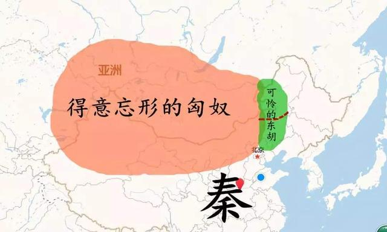
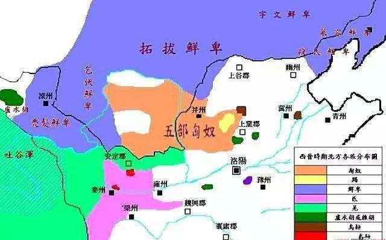
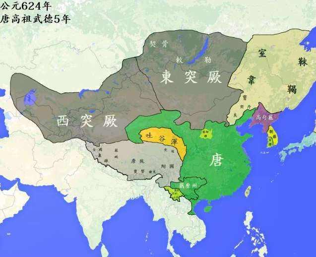
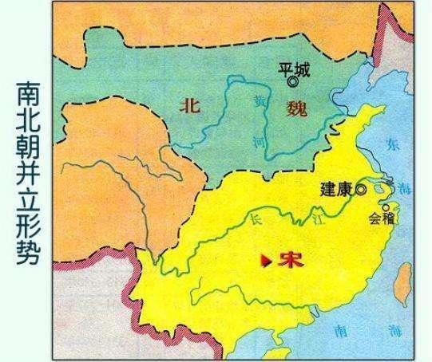
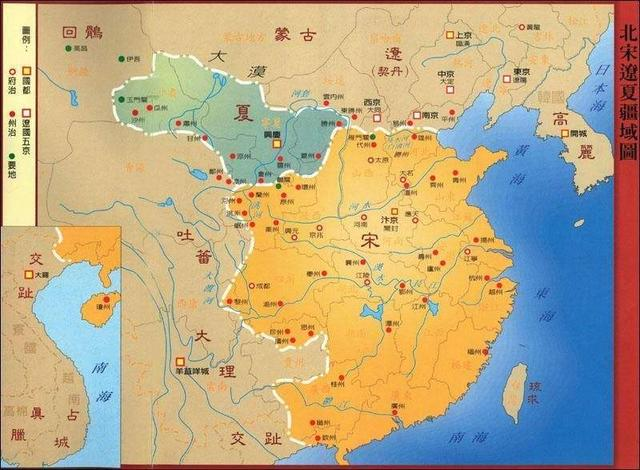
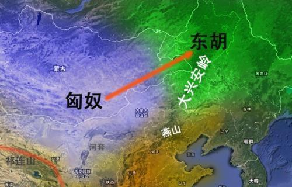

匈奴、鲜卑、突厥、柔然、契丹、女真以及蒙古，哪个汉化程度更高

[减水书生](https://author.baidu.com/home?from=bjh_article&app_id=1621426562494536)

发布时间: 2020-05-10 20:02优质历史领域创作者

中原的汉人政权，非常好区分。原因就是有修史的传统。所以，哪伙人是哪伙人，都非常清楚，不仅能具体到名字而且还能本纪列传。北方草原就乱了，秦汉时候是匈奴、东胡，两晋以后是鲜卑、柔然，隋唐之时是突厥、契丹，两宋以后就是蒙古和女真。

实际上，他们差不多就是一伙人。今天这支称雄了，那么大家就都是匈奴。明天那支称雄了，那么大家就都是突厥。一个部落称雄，建立了部落联盟的草原帝国，然后这个部落的名字就是草原帝国的称号了。

而之所以乱，就是因为草原文明的水准太低，没有一以贯之的文字记录。所以，只能从中原文明的史书中寻找脉络线索。中原史书自己写自己还可能写不清楚，就别说给草原偶然来一篇的别传了。如果从汉化的程度来给这伙人分分类，还是可以观其大略地做个分析。

**01.匈奴、突厥和柔然，基本就被打没了**

先说匈奴，基本上是最早与中原文明进行融合的。但融合的方式就是战争，你看不上我、我也看不上你，然后就是死命地打。匈奴人也汉化，但汉化的主要契机是贪恋中原的物质财富。到了东汉，匈奴基本上就算被征服了。你们汉人太厉害，我们不打了，搞举族内迁的投降。当然也有什么铁勒之属还在草原没走，但是已经成不了什么气候了。

所以，匈奴人的汉化应该是比较高的，因为基本上就彻底融入了进来，已经分不出谁是谁了。西魏宇文泰是匈奴人，先祖之时就融入到了鲜卑，后来跟着鲜卑一起汉化了。所以，这以后基本上就找不到什么匈奴人了。

再是突厥， 但突厥之前还有一支，就是柔然。柔然就比较惨了，他也想汉化，汉化的方式也是战争，就是要杀入长城。但是，鲜卑人在之前已经入主中原了，于是鲜卑人守在长城死磕柔然：来晚了，你们就别来了。柔然到死也没能杀进来。等到突厥崛起的时候，柔然就被突厥人给灭了。所以，柔然就很悲催，就没赶上汉化的机会。

突厥基本上是被隋唐两个大帝国给干掉的。但是，唐朝的手段要灵活得多，一个手段是真的打，一直打到死为止；另一个手段是收服，只要你服了就不打了。所以，突厥人也就逐渐融入大唐了。突厥人与大唐较量的过程中，还有一支匈奴别种，就是后来的薛延陀。在东突厥被灭后，薛延陀称雄草原一段时间，但后来也被大唐消灭了。

**02.蒙古人需要单说，因为这家伙太强**

蒙古人崛起于两宋之后，起源上众说纷纭，大概率认为是出自东胡系。东胡和匈奴是同时存在的，但是后来被匈奴给干趴下了。但是，蒙古人在北方草原称雄以后，就始终褪不去自身的草原底色。可能因为有着大蒙古国的辉煌历史，所以这伙人对于汉化的兴趣可能真心不太高。

在南宋以后，蒙古人就建立了一个囊括中原、草原、高原和西域的大元帝国。但是，大元帝国虽然身在中原，定都北京，但却一直心在草原，总是以一种客人的姿态看待中原这块地方。所以，蒙古人的汉化是最难的，建立的大元政权虽然很雄壮但却很粗犷。

蒙古人充分继承了草原民族一直内斗不断的传统，围绕继承人的问题一直是杀来杀去。即便南方朱元璋都打下了半壁江山，蒙古人之间还在内斗不断。当朱元璋正式北伐的时候，蒙古人想也不想、立即跑路。所以，朱元璋北伐是少有的成功北伐，但也是最容易的北伐。蒙古人自以为是客人，所以看到中原主人不欢迎自己，立即就跑回了自己心爱的草原。因此，蒙古人就别想汉化了，到了清朝也没彻底汉化，就是一直盘踞在北方草原。

**03.鲜卑、契丹和女真**

胡人入主中原，并且最终在中原站住脚的，第一个就是鲜卑人。在十六国乱世之后，鲜卑人建立了北魏大帝国。北魏真得很厉害，对内搞汉化、搞融合，对外向南对付南朝、向北对付柔然。

但是，北魏汉化的节奏有点儿快，内部逐渐分化出了两批人。一批是洛阳的鲜卑权贵，这伙人那是真心要汉化的，而且汉化得非常彻底。另一批是北方六镇的职业军人，这伙人对汉化早就怒目而视了，对汉化肯定有反感但主要是没分到利益。于是，六镇起义彻底就把北魏打没了。但是，北魏分化出了东西两魏，仍旧是鲜卑与汉人的杂交政权。而就在这个杂交的基础之上，诞生了后来的隋唐大帝国。

唐朝的一个重要问题，就是东北问题，先是高句丽后是契丹人。在唐末以及五代十国的乱世中，契丹建国了，而且是早于统一中原的大宋。所以，大宋想征服契丹就非常难了，原因就是人家岁数比你大。等你出生的时候，人家早就可以打酱油了。

契丹跟北宋一直扛了好多年，这两兄弟的关系还真心不错，实现了草原和中原之间的百年和平。再后来就是女真崛起了，女真的大金是真能打，把契丹的大辽和中原的北宋捆在一起打，成为继鲜卑之后第二个入主中原的。

鲜卑、契丹以及女真，他们的汉化程度要深刻得多。为什么？能入主中原并在中原建立政权，这就是标志。这三个家伙，要比匈奴和突厥更厉害，既能向中原输入暴力又能向中原输入秩序。而输入秩序的前提，则是得先理解中原政权和中原文明，所以它们基本上都是主动汉化的。

**04.要把草原民族和东胡系分开讲**

纯粹的草原民族，就是匈奴、突厥、柔然以及蒙古。这些人基本上都是在蒙古高原上建立了部落联盟的草原帝国。他们要汉化起来，难度系数太高。原因就是缺乏经历农耕的生活方式，不能深刻理解中原文明。所以，汉化的程度就非常低。虽然蒙古也实现了入主中原，但是其建立的大元政权非常缺乏凝聚力。

不纯粹的草原民族，就是东胡、鲜卑、契丹以及女真。这些人基本上都是生活在东北地区。他们的最大特点是经历了农耕和草原两种生活方式。于是，其民族文化模因就能很容易接受农耕基础的中原政权。可以把这伙人统称为东胡系。历史大的演化，往往都是中原和草原互相干，等二者都干趴下了，然后东胡系开始出手。

两汉干匈奴，匈奴被干残了、东汉也没劲了，然后到了两晋时期，东胡系的鲜卑人就开始动手了。隋唐干突厥，突厥被干没了、大唐也玩成了五代十国，契丹的大辽就蠢蠢欲动了。宋明就一直就在跟蒙古死战不休，蒙古被干趴下了、明朝也把自己折腾残了，东胡的满清也就耀武扬威了。这可能就是中国历史的一个轮回大脉络。

所以，从汉化的程度来说，肯定是一个时间线索，也就是越往后期，草原民族汉化的程度就越深。原因就是中原文明和草原文明一直在彼此融合。但是，这里面还有一个空间线索，那就是东胡系的草原民族，要比纯正的北方草原民族，汉化得更深刻。

