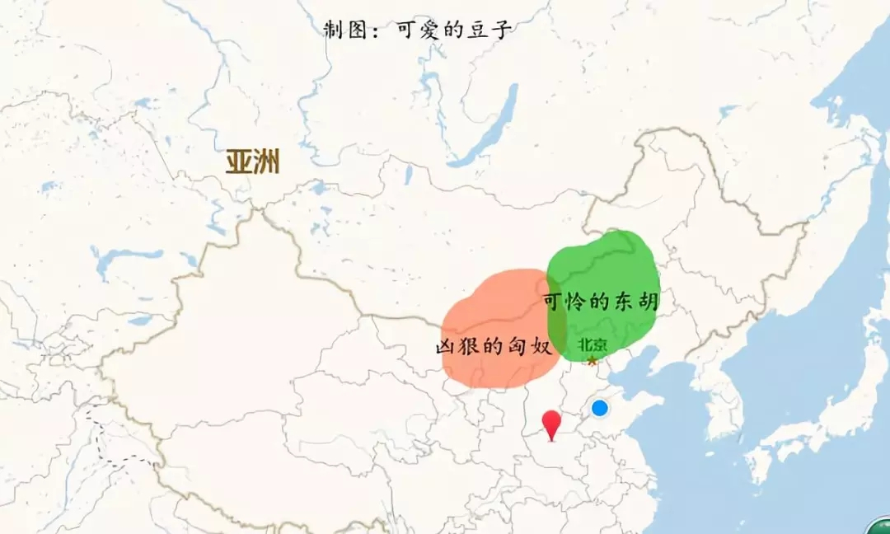

从商周时代开始，匈奴和东胡就存在了，他们的位置大概是这样的：

然后匈奴把东胡干了。情况是这样的：

东胡好可怜!由于遭受得意忘形的匈奴的打击，变得分裂，分裂成了两部分，鲜卑和乌桓：

终于，强大的汉王朝来了!结果就成了这样：

汉朝时，匈奴分裂成为南匈奴和北匈奴。

鲜卑势力变得异常强大，正是在东汉末年分三国时干的，毕竟中原内乱顾及不了他们，匈奴已经被弄得半死了，乌桓被曹操灭了，鲜卑反倒强大起来。

从晋朝到后来的五胡乱华时期，鲜卑分成了东、北、西三大部落。

拓跋鲜卑其实就是北鲜卑。

鲜卑贵族慕容氏在西鲜卑和东鲜卑都很有地位，西鲜卑后来在慕容氏的带领下跑到青海东部安营扎寨，这就是赫赫有名的吐谷浑。鲜卑参与了晋朝之后的五胡乱华：

在上图中，吐谷浑就是西鲜卑的后裔。

鲜卑拓跋部创立了北魏，这就是南北朝中长江以北的王朝，北魏一直跟柔然死磕。那也是没办法的事情，柔然原本隶属于鲜卑拓跋部，是拓跋的奴隶，成天干苦力，后来拓跋南迁，小柔然也就闯荡成了大柔然，并跟原来的主人掐起了架。

在南北朝时期，柔然也有了自己的奴隶，常常对奴隶拳打脚踢。

负责给柔然炼铁的部落，是突厥部落，被唤作“煅奴”，意思就是打铁的奴隶，十分卑微。当时的情况是这样的：

后来的事情你也知道了，突厥把柔然灭了：

注意，这个室韦不是突然出现的，有人认为室韦的发音其实就是鲜卑，鲜卑-森被-室韦。如果的确如此，那么室韦显然就是鲜卑后裔了。因此多数观点认为，室韦主体就是鲜卑，本源一定是东胡。

再说靺鞨，靺鞨其实一直也都存在，一直在中国东北生存。周代、秦朝、西汉时，被唤作肃慎，东汉到魏晋谓之挹娄，南北朝称勿吉，隋唐时叫靺鞨。

因为大突厥汗国分裂了，这得益于隋朝文臣的离间计，总之，分裂了，分裂成了东西两部分，就是东突厥和西突厥。

情况是这样的：

原本突厥可以很牛的。可惜南面的隋朝灭亡了以后，迎来的是唐朝。再想南下捞一把，是不可能了。反而被唐朝一窝端，被一窝端的，还有高句丽等等。

于是情况变成了这样：

然而突厥后来复国了，不过这次复国，突厥内部的部落已经有很多势力。

