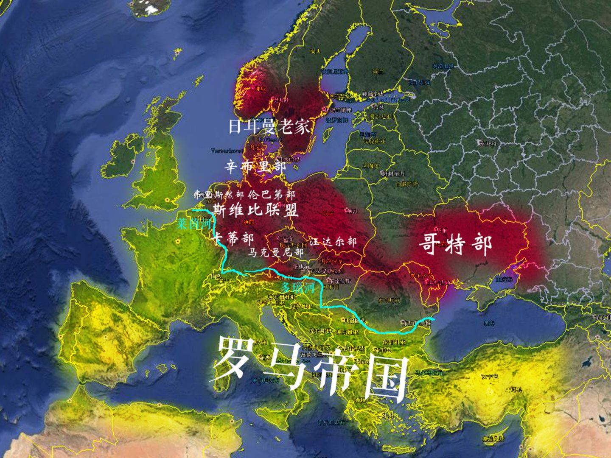

> 
>
> 其实如果我们从这个角度去看，你再看罗马史就非常明白了——
>
> 罗马本质上其实是个「加强版的希腊」，只不过罗马凭借武力，把希腊文明从爱琴海扩展到了整个地中海。
>
> 然而罗马和希腊又有不同的是，它不像希腊只是到处撒网殖民，而是赋予了国家核心——意大利区域更高的地位进行中央集权。
>
> 但本质上罗马仍然是个商业文明，而且自己的统治范围内有埃及、叙利亚（亚述）这样的文明古国、希腊这样的文化大哥，这个以地中海为中心的帝国从一开始就注定了它的不稳定。
>
> 而且，北方的「蛮族」入侵仍然没有停，而东边的波斯（安息）更是成为了罗马的「帝国杀手」，不过这时候北方蛮族凯尔特人，也要更新换代了。
>
> 
>
> 作者：安森垚
> 链接：https://www.zhihu.com/question/24631642/answer/286122386
> 来源：知乎
> 著作权归作者所有。商业转载请联系作者获得授权，非商业转载请注明出处。

> 罗马帝国在控制地中海后，占领了西北边的高卢（现法国），以及更偏远的不列颠（现英国），而北欧蛮族日耳曼人也开始南下占领了莱茵河东、多瑙河北的区域（上图红色区域）。
>
> 我前面说的这些区域，都是曾经凯尔特人的地盘，但是却因为「一文明、一蛮族」的扩张，生生的把这群哥们给挤没了。
>
> 自此，罗马就不得不面临北、东两线的武力威胁，而且讽刺的是这两位都是他的印欧人同胞。
>
> 
>
> 作者：安森垚
> 链接：https://www.zhihu.com/question/24631642/answer/286122386
> 来源：知乎
> 著作权归作者所有。商业转载请联系作者获得授权，非商业转载请注明出处。

> 东罗马帝国是以希腊语区为核心，并统治埃及、叙利亚的国家。反倒是西欧被日耳曼人瓜分，大致如上图，尤其是曾经被匈人吊打的哥特部占领了意大利、西班牙，匈人小弟法兰克人占领了高卢。
>
> 但是如果认为这个就算是罗马灭亡了，那可就完全不对了，且不说东罗马帝国一直延续到了他们被奥斯曼突厥人彻底干掉，就说西欧的罗马，本质上也并没灭亡。首先最明显的一点就是，东哥特的首领狄奥多里克是没有动罗马帝国的元老院的，甚至名义上还称东罗马为宗主，这像极了五胡乱华时胡人政权对东晋名义称臣的情形。
>
> 而且这个东哥特王国和西哥特王国，包括法兰克王国，几乎在几十年的光景就被同化成了说拉丁语的民族，这几个日耳曼人里的先行者竟然成了日耳曼人里最早消亡的，所以直到如今——意大利、西班牙、法国仍然是拉丁语区，他们语言之间的区别从某种程度上说也只是方言而已。
>
> 要说东方的北魏本身是鲜卑族政权，但是正如《花木兰》里描述的一样，他们和同属鲜卑的北方游牧政权“柔然汗国”打得不可开交，那仇恨比和南朝大多了。那么对于欧洲也是一样，西欧的法兰克王国随着自己实力的强大，后来直接号称继承了罗马的法统，和东边尤其是北边的日耳曼蛮子的关系十分不好，按理说北欧的兄弟那可是老家的老亲戚，但是整个西欧可是把他们描述成了恐怖的野蛮入侵者——维京人。
>
> 这种文化、信仰、生产方式造成的差异，早就超过了血缘上带来的认同，放眼世界各地的历史，都有这样的特性。
>
> 所以从某种程度来讲，罗马这顶帽子在欧洲人看来，仍然是正统的代名词。其实就那个五胡乱华的开创者刘渊，他就自称继承了蜀汉后主刘禅的法统，一个匈奴人把国号定成了“汉”。法兰克帝国解体后，东边（如今德国）的日耳曼人也逐渐开化，在国家还没怎么形成的情况下，也自称“神圣罗马帝国”，实际上不过是个王子公主遍地跑，连个村都能称王的松散联邦而已。
>
> 这么来看，罗马对欧洲的影响是巨大的，且不说法国、西班牙、意大利仍然是罗马文化的直接继承人，就说英国、德国、北欧诸国，最后也不得不大搞罗马文化学习热。风靡整个欧洲的罗曼式、哥特式建筑，都是罗马时期建筑的变种，毕竟没任何人想住在木头窝棚和牲畜待在一起。而如今的英语、德语，尤其是英语，它作为一个日耳曼语族的语言，却有着一半以上的拉丁语词汇，这也是造成学英语时感觉基础词和高级词汇看起来毫无关系的重要原因。
>
> 至于为啥用拉丁语，因为罗马修公共浴场的时候，日耳曼人还在狩猎，高级词根本没有啊。
>
> 所以拉丁语直到如今也是教会通用语，在英语兴起之前，也一直都是欧洲的“普通话”。那个时候写个论文是不可能用本民族语言的，牛顿的名著《自然哲学的数学原理》，就是拿拉丁文写的。如今的生物分类学，更是必须使用严密成体系的拉丁语。
>
> 更何况，严格来讲，这世界本就不存在“英文字母”“法文字母”“德文字母”什么的，这些东西全部都是——拉丁字母。
>
> 
>
> 当然了，东方还有个自称继承了东罗马帝国法统的俄罗斯帝国，俄文字母西里尔字母属于山寨的希腊字母，而拉丁字母本身也是希腊字母的变种。
>
> 还有，如果是法学专业，或者学过法学的人应该也知道，如今世界大多数国家包括我们中国所使用的“大陆法系”，就是罗马法的直系子孙。（感兴趣可以去了解下《查士丁尼法典》）
>
> 总之，就算我们不说后来轰轰烈烈的文艺复兴，你也应该知道，罗马在文化角度并没有灭亡，无论是罗马的建筑、罗马的文字抑或是希腊、罗马的一系列思想，甚至可以说如今欧洲的支离破碎，本身就是希腊、罗马思想的一种“继承”。

> 不过到了这里，我们还是最后说下，东方和西方，就政治实体和文化继承这一点的区别吧。
>
> 曾经的罗马帝国无法回归，日耳曼人的固有属性确实分不开，因为这群人政治上确实比较滞后，又不愿意放弃部落里老爸死了儿子瓜分领土这种习惯，这种在中国人看来不可理喻的传统，造成了欧洲封建体系的八百诸侯。
>
> 另一方面，我们前面也看到了，以地中海沿岸以及高卢地区为主的拉丁语文明，从罗马时代就和如今德国、北欧的日耳曼文明互不相让，这两个族群谁也没法征服谁，最终成了欧洲众多矛盾甚至包括一战二战的根源。
>
> 印欧人本就是个次生文明集团，东亚华夏人走过的太多路他们没有走过。而作为使用表音文字的这类次生文明，并没有如中国这种原生的农业帝国文明成体系的表意文字。这就导致本来在中国看来并不是问题的多方言甚至多语言（比如韩语，日语）的表达问题，在欧洲就会出现不知道读啥写啥的致命弱点，日耳曼区和拉丁区的撕裂也就很难弥合了。
>
> 不过虽说秦的农业化的、帝国化的文明，随着一代代的尝试，把中央集权玩到了顶峰，延续了千年，甚至面对蒙古、女真等强悍民族的入侵也毫不畏惧地同化之。但是这一系列制度带来的弊病，却也隐隐约约存在于元、明、清之后。
>
> 所以有时候我们也可以思考，是延续了“不复存在”的罗马，并相继出现文艺复兴、工业革命的欧洲更好，还是维持了千年大国，却不得不砥砺走向“伟大复兴”的我们更好呢？
>
> 或许也没有好与不好，有时候，历史的进程就在那里。