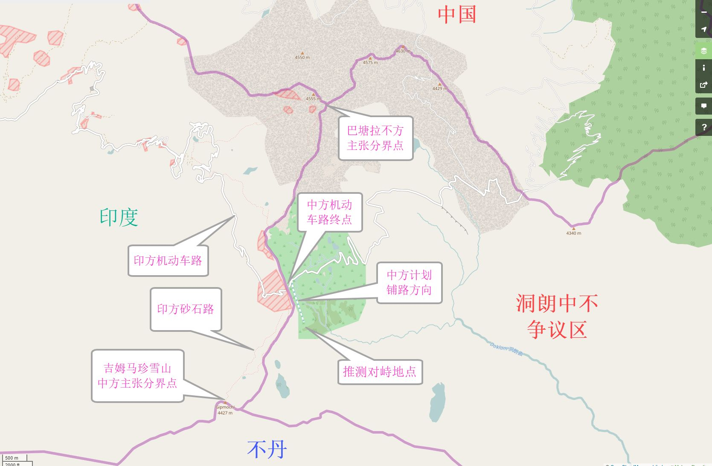

参考： [中国与不丹领土争端 - 寒日的日志 - 网易博客.html](../中印边界/_resource/中国与不丹领土争端 - 寒日的日志 - 网易博客.html)

**中国与不丹领土争端
**    **1.鲁林争议区（也称绒林）**，位于下亚东仁青冈乡东南。总面积340平方公里，牧场40个，森林资源较为丰富。1954年，不丹皇家陆军在恰尔塘建立军事据点，1960年又在哈热建立季节性哨所。
    **2.洞郎争议区**，位于亚东县南端，约100平方公里，北部小湖泊较多，有大小草场30个，东南部森林资源丰富。该地历来为下亚东牧民的夏季草场。
    **3.查玛浦争议区**，位于上亚东帮噶曲登以东，主要包括郎玛浦和查玛浦的上游部分，约60余平方公里，有草场30余个，历来为下亚东牧民的夏季草场，1959年以前，不丹牧民过界放牧，须向亚东头人交纳草税。50年代初期，不丹在森穷隆建立常年军事据点，1960年又在儿淌建立季节性哨所。
    **4.基伍争议区**，位于查玛浦争议区以北，主要包括基伍曲和巴马弄流域的大部分地区，面积约为90平方公里，有大小牧场20余个，1889年，西藏地方政府将基伍租给不丹哈宗官方和我方牧民共同使用，1962年，不丹在夏布建立季节陨谒?
    **5.白玉争议区**，位于洛扎县南部，主要包括巴桑弄和吉格弄两河流域，总面积约为600平方公里，有牧场37个，著名的拉龙康和次久拉康两座寺庙在该争议区内。在西藏民主改革前，西藏地方政府根据嘉庆皇帝的昭示，将该地区划归蒙达拉龙寺管辖，现在白玉地区的群众，均来自洛扎县。西藏和平解放后，不丹趁机进入该地区，相继建立了德马龙和塘沃哨所，直至1978年撤除，1983年8月，不丹又在次久拉康附近重新设立哨所。
    **6.墨拉萨丁争议区**，位于达旺以南，扎西冈以东，打拢宗以西，面积3300平方公里。据史料记载，墨拉萨丁分别归达旺寺和打拢宗管辖，萨丁寺属于达旺宗，基堪布由达旺寺派任。17世纪以后，不丹人大量东迁，移居达旺等地，引起草场和民事纠纷。为此，西藏地方政府和不丹在1715年曾两次订立条约，言明墨拉萨丁主权归属，草场可以租给不丹移民使用，按规定交纳草税。本世纪初，英印政府炮制非法麦克马洪线，并把势力范围扩展到达旺以北。1949年，印度与不丹签定《永久和平与友好条约》，将我国墨拉萨丁地区转让不丹，自此，墨拉萨丁地区一直处于不丹政府的完全控制之下。
    在争议区范围问题上，不丹政府认为，目前只在不丹的4个地区存在争议，面积分别为98、42、42、138平方公里，总为269平方公里，而不是中国认为的4500平方公里。1996年11月，中不11轮边界会谈中，中方提出争议区北部495平方公里归不丹，西部269平方公里归中国的交换意见，不丹对此持谨慎态度。 1997年6月，不丹召开国民会议，会上就中国提出的交换意见展开了激烈讨论，多数代表认为，无论西部还是北部，都是不丹的领土，不同意交换。

> 黑粗： 中国声称（实控？）
>
> 灰： 不丹声称（GE这么标注）
>
> 红色： 可能的交换方案，也即未来可能的边界

### 洞朗

> 进入洞朗地区前， 一条路通过中印无争议山脊分界线附近。另一条路通过中不鲁林争议区低洼分水流附近。

from [洞朗地区中印对峙的技术分析](https://zhuanlan.zhihu.com/p/28518320)

