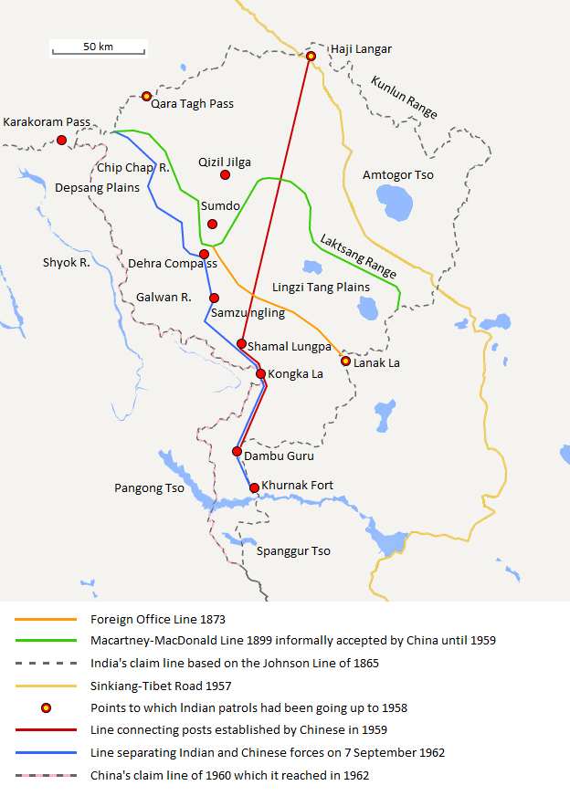
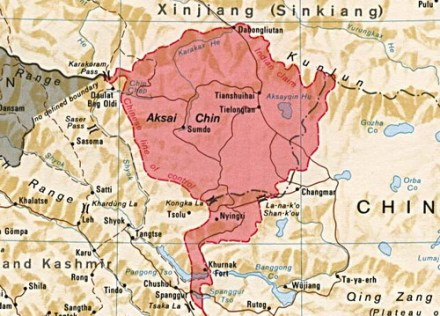
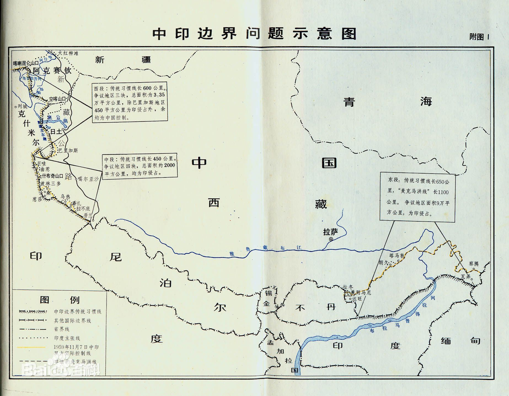
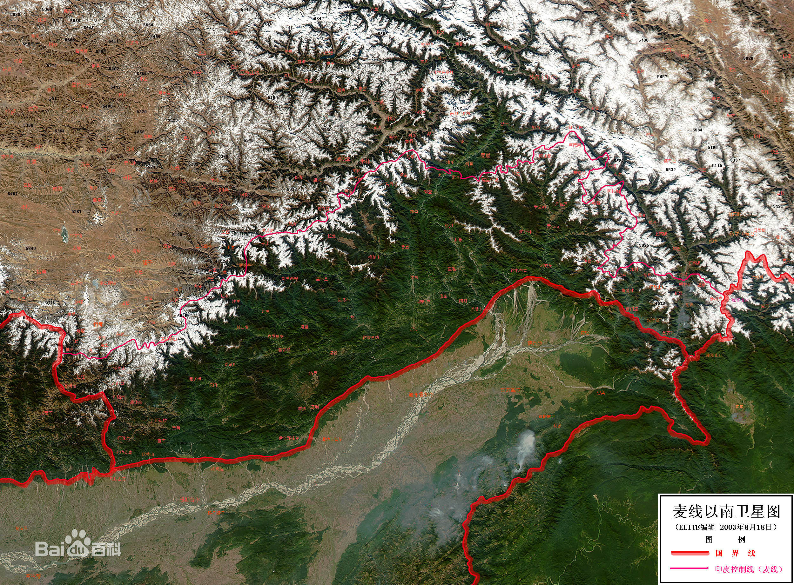

转自《中印领土争端西段——阿克赛钦、巴里加斯和班公湖地区》
```
印军入侵中印边界西段三块争议地区
        西段边界的传统习惯线分为两部分，即新疆段和西藏阿里段。
        新疆和拉达克的传统习惯线(新疆段)全部沿着喀喇昆仑山脉。即：从喀喇昆仑山口起，向东沿叶尔羌河的支流和什约克河的分水岭，再向东南沿山岭而行，越过奇普恰普河，穿过6845高地和6598高地;从6598高地向南顺山岭行，穿过加勒万河，通过6556高地，再沿空朗昌波河和其支流昌隆河之间的分水岭，穿过昌隆河，然后沿山岭东南行，到达空喀山口。
        西藏和拉达克传统习惯线(西藏阿里段)是由空喀山口起，转向西南沿山岭而行，穿过羌臣摩河和西隆格巴尔马河的交汇处，再上升到山岭，经过塔马特山，沿羌臣摩山，过6107高地，顺山岭到爱尼山口，由爱尼山口向南，顺山岭经过6127高地，南行至班公湖北岸，穿过班公湖后到达该湖南岸;继向东南到隆巨山，穿过桑格藏布河(印度河)，沿科尤里龙帕河东南和汗里河南面的分水岭到斯诺乌山，再经过帕里河直到西藏阿里地区、印度旁遮普和拉达克三地的交界处。
        全部西段边界从未正式划定过，但传统习惯线中国一侧的地区历来属中国管辖。印度独立后，于1954年修改地图将中国境内的空喀山口、铁龙滩、奇台大板、大红柳滩、阿格拉山口、卖争拿马(尼亚格祖)、班公洛、巴里加斯等地划入印度，总面积约3.3万平方公里，从而形成了阿克赛钦、班公湖、巴里加斯三块争议地区。
        印度政府为了扩张其领土，50年代派遣军警对中国西段频繁入侵，逐步蚕食中国大片领土，一直发展到60年代初期深入中国境内设立了40多个侵略据点。
```

* 传统习惯线： `中国和印度之间存在了一条传统习惯的边界线：东段大体上沿喜马拉雅山南麓与布拉马普特拉河北岸平原交界线而行，中段大体沿喜马拉雅山分水岭走向。` (from [wikipedia 中印边界问题](https://zh.wikipedia.org/wiki/%E4%B8%AD%E5%8D%B0%E8%BE%B9%E7%95%8C%E9%97%AE%E9%A2%98))


* 故土： 曾经是或者算得上是，但已经定论失去/放弃追索的
  * 拉达克
    阿克赛钦下方（西南）
* 争议
  * 西段
    * 克什米尔
      喀喇昆仑走廊约5800平方公里，主要是沙克思干谷地[29]。根据1963年中华人民共和国政府和巴基斯坦政府达成的《中巴关于中国新疆和由巴实际控制其防务的各个地区相接壤的边界的协定》，巴方承认喀喇昆仑走廊（巴方原划归北部地区）属于中国。
      (主要是克勒青河谷(Shaksgam Valley, 沙克思干 不同的音译方式)，面积约0.6万平方公里。1963年，巴基斯坦与中国签订协议，确定该地区为中国领土。印度至今不承认，骂巴基斯坦是卖国，将这一地区送给中国)
      
      > 班公湖目前中国2/3印度1/3的现状不知道有没有争议/不同诉求。 考虑到印度宣称整个克什米尔都是它的，估计免不了。。
    * 阿克赛钦
      阿克塞钦地区总面积4万2685平方公里，其中争议地区约3万平方公里，占中印西段边境争议地区总面积的3万3500平方公里的绝大部分。中国认为阿克塞钦作为固有领土存在，并不属于克什米尔地区。印度对此存在异议。目前，阿克塞钦绝大部分属于新疆和田地区管辖，南部很小一部分属于西藏自治区阿里地区管辖。
      <del>拉达克</del>
    * 巴里加斯 
      和班公湖同属于阿里地区
      巴里加斯地区总面积约1900平方公里。印度控制巴里加斯西南角，即狮泉河（森格藏布）与卓普河（典角曲）以西大约450平方公里。中国认为该区域位于传统习惯线中方一侧，属于阿里地区噶尔县扎西岗乡。印度方则将其划归查谟-克什米尔邦拉达克列城县。
  * 中段： 中印边界中段争端共有四块，共约2000余平方公里，现主要由印度控制，中国亦控制小部分。
    * 巨哇、曲惹地区位于札达县楚鲁松杰乡西南，面积332平方公里[31]。1954年，印度官方地图标为已定界，将该地区划入印度，形成争议。1958年6月2日，印军进入巨哇、曲惹，并在曲惹修房设卡，从此控制该区。
    * 什布奇山口地区位于什布奇山口以西至活不桑河，争议面积共35平方公里，属札达县底雅乡什布奇村[32]。1958年4月，印度控制该地。
    * 桑、葱莎、波林三多地区位于札达县城西偏南，面积1451平方公里[33]。1954年印度控制该地。
    * 乌热、然冲、拉不底地区总面积855平方公里，其中乌热地区面积135平方公里。属于札达县达巴乡[34]。印度1956年6月曾控制乌热。7月，控制香扎、拉不底。近年来中国军机，军人等不断进入乌热，逐渐控制此地。
  * 东段
    * 藏南
    * 中不 争议





## 实控线


## **马继业-窦讷乐线**


> **马继业-窦讷乐线** (英語：Macartney-MacDonald Line) 是英国于1898年提出的一种中国和英属印度的划界方案。
>
> [威廉·约翰逊](https://zh.wikipedia.org/wiki/威廉·約翰遜)在[印度测绘局](https://zh.wikipedia.org/w/index.php?title=印度测绘局&action=edit&redlink=1)工作期间提出了**约翰逊线**。这条线将整个阿克赛钦划归克什米尔。據西方文献，1893年，中国一驻聖彼得堡官员向英国驻喀什总领事[马继业](https://zh.wikipedia.org/wiki/马继业)递交了一份关于新疆和克什米尔划界方案。[[1\]](https://zh.wikipedia.org/wiki/馬繼業-竇訥樂線#cite_note-1)这一方案将拉宗山脉以南的林津塘盐湖洼地划给印度，以北则归中国。马继业表示同意，并将此方案报告给英印政府。[[2\]](https://zh.wikipedia.org/wiki/馬繼業-竇訥樂線#cite_note-Calvin-2) 英方通过驻华公使窦讷乐知会中方，中方没有回应，英方單方面将此视为中方的默许。[[2\]](https://zh.wikipedia.org/wiki/馬繼業-竇訥樂線#cite_note-Calvin-2)[[3\]](https://zh.wikipedia.org/wiki/馬繼業-竇訥樂線#cite_note-middlepath-3)[[註 1\]](https://zh.wikipedia.org/wiki/馬繼業-竇訥樂線#cite_note-4)
>
> 
> 此线为[中巴边界协定](https://zh.wikipedia.org/wiki/中巴边界协定)中的划界提供了部分依据，故亦有人建议解决[中印边界问题](https://zh.wikipedia.org/wiki/中印边界问题)亦可将此线作为参考。[[3\]](https://zh.wikipedia.org/wiki/馬繼業-竇訥樂線#cite_note-middlepath-3)[[4\]](https://zh.wikipedia.org/wiki/馬繼業-竇訥樂線#cite_note-5)
>
> 此线的喀喇昆仑山口以东段具体描述如下：
>
> > 从喀喇昆仑山口起[边界将沿着]山脉的山峰向东行约半度（即一百华里“三十三英里”），然后向南到略低于北纬二十五度处。在我们地图上所画的喀拉喀什河河源处拐弯，再沿着山向东北行，一直到克孜勒吉勒尕（Kizil Jilga）以东的一点，然后再沿着拉宗山脉向东南，一直到该山脉与昆仑山的一条南北走向的支脉相会合为止；这条支脉在我们的地图上一直是作为拉达克的东部边界标出来的。两山汇合处是在东经八十度略为偏东处。[[2\]](https://zh.wikipedia.org/wiki/馬繼業-竇訥樂線#cite_note-Calvin-2)
>
> ## 注释[[编辑](https://zh.wikipedia.org/w/index.php?title=馬繼業-竇訥樂線&action=edit&section=1)]
>
> 1. **[^](https://zh.wikipedia.org/wiki/馬繼業-竇訥樂線#cite_ref-4)** 以中国官员向英印提供地图为此线肇始的说法未见于中文文献。即本线的来历几何存在不同见解，详[讨论页](https://zh.wikipedia.org/wiki/Talk:馬繼業-竇訥樂線)。


## 约翰逊线


> 约翰逊线是英属印度殖民官员约翰逊在地图上私自沿[昆仑山](https://baike.baidu.com/item/昆仑山/394387)画的一条线，而[中印边界](https://baike.baidu.com/item/中印边界/9144747)的西段传统上一直以[喀喇昆仑山](https://baike.baidu.com/item/喀喇昆仑山/2112564)的山脊为界。
>
> - 中文名
>
>   约翰逊线
>
> - 界  限
>
>   喀喇昆仑山的山脊
>
> - 位  置
>
>   中国[阿克赛钦](https://baike.baidu.com/item/阿克赛钦/6270453)以东
>
> - 相关国家
>
>   [中国](https://baike.baidu.com/item/中国/22516505)、[印度](https://baike.baidu.com/item/印度/121904)
>
> [](https://baike.baidu.com/pic/约翰逊线/9682051/0/64380cd7912397dd7bf33d305882b2b7d0a28778?fr=lemma&ct=single)阿克塞钦地区
>
> 但在[英国](https://baike.baidu.com/item/英国)殖民统治[印度](https://baike.baidu.com/item/印度/121904)期间，一个叫约翰逊的英国人认为沙俄当时必然会占领新疆的西部地区，为了与[沙俄](https://baike.baidu.com/item/沙俄)争夺[中亚](https://baike.baidu.com/item/中亚)的势力范围，约翰逊在地图上越过喀喇昆仑山，将中印的边界线往北画到了[昆仑山脉](https://baike.baidu.com/item/昆仑山脉)，这条线即“约翰逊线”。这样，位于昆仑山脉和喀喇昆仑山脉之间的[阿克赛钦](https://baike.baidu.com/item/阿克赛钦)地区就被画到了[英属印度](https://baike.baidu.com/item/英属印度/2651634)的[克什米尔](https://baike.baidu.com/item/克什米尔/517533)地区。但这只是画在地图上的一道线，没有起过实际作用，[印度](https://baike.baidu.com/item/印度)从未在此派驻一兵一卒。 [1] 


## 麦克马洪线





