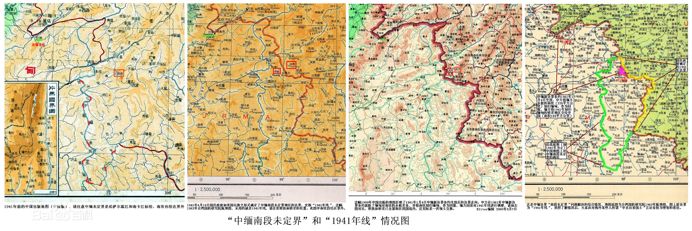
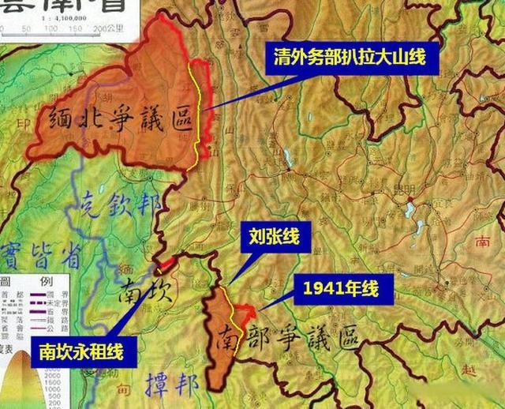
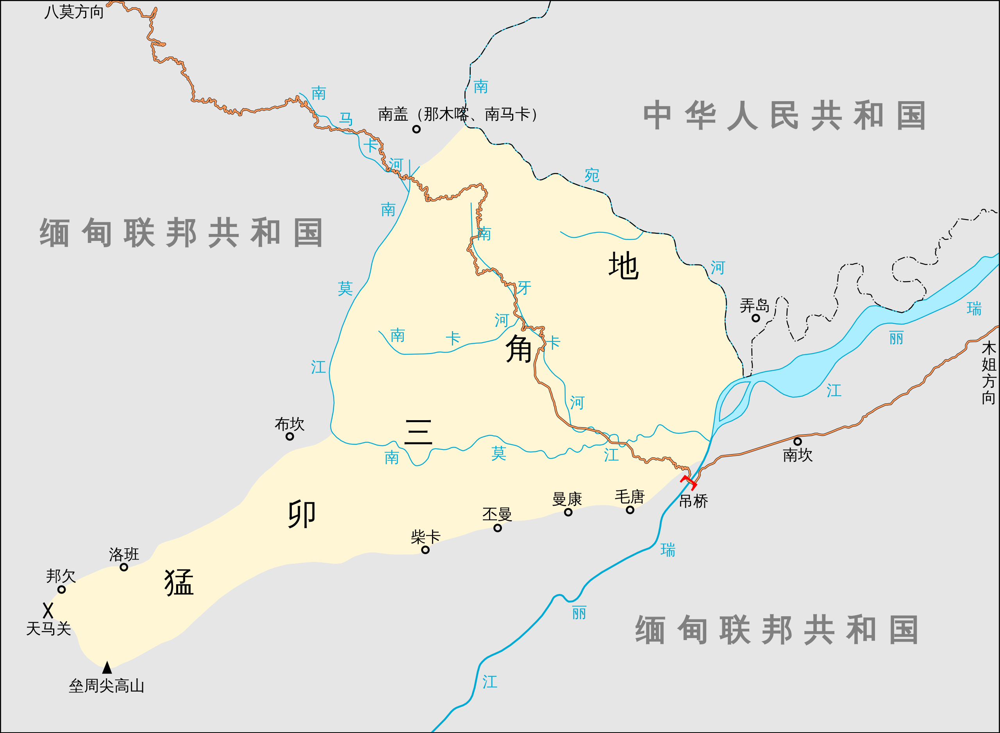

1885年的缅甸地图，画出了云南与缅甸大致的行政管辖范围界线

> 遗留给新中国的中缅争议边界一共有三段：
>
> 北段是尖高山以北地区（包括胡康河谷、野人山、江心坡、高黎贡山与恩梅开江之间的土地），未定界；
>
> 南段是签订了边界协议但还未来得及实地勘界的中缅南段“ 1941年线"；
>
> 中段是勐卯“永租"三角地。

> **中缅南段未定界**也称作**滇缅南段未定界**，是历史上[清朝](https://zh.wikipedia.org/wiki/清朝)与[英属印度帝国](https://zh.wikipedia.org/wiki/英属印度)至[中华人民共和国](https://zh.wikipedia.org/wiki/中华人民共和国)与[缅甸联邦](https://zh.wikipedia.org/wiki/緬甸聯邦_(1948年－1962年))时期[滇缅边境](https://zh.wikipedia.org/w/index.php?title=中缅边界&action=edit&redlink=1)的一段未定国界，起讫点为[南帕河](https://zh.wikipedia.org/wiki/南帕河)与[南定河](https://zh.wikipedia.org/wiki/南定河)汇合处至[南马河](https://zh.wikipedia.org/wiki/南馬河_(中國))与[南卡江](https://zh.wikipedia.org/wiki/南卡江)汇合处[[1\]](https://zh.wikipedia.org/wiki/中缅南段未定界#cite_note-朱昭华7-4-1)，全长308.192公里[[注 1\]](https://zh.wikipedia.org/wiki/中缅南段未定界#cite_note-2)[[2\]](https://zh.wikipedia.org/wiki/中缅南段未定界#cite_note-云南军事志-717-3)。未定界位于今[中华人民共和国](https://zh.wikipedia.org/wiki/中华人民共和国)[云南省](https://zh.wikipedia.org/wiki/云南省)和[缅甸联邦共和国](https://zh.wikipedia.org/wiki/缅甸联邦共和国)[掸邦](https://zh.wikipedia.org/wiki/掸邦)之间，涉及现在中国[沧源](https://zh.wikipedia.org/wiki/沧源佤族自治县)、[澜沧](https://zh.wikipedia.org/wiki/澜沧拉祜族自治县)、[西盟](https://zh.wikipedia.org/wiki/西盟佤族自治县)、[孟连](https://zh.wikipedia.org/wiki/孟连傣族拉祜族佤族自治县)四县与缅甸[户板](https://zh.wikipedia.org/w/index.php?title=户板镇区&action=edit&redlink=1)、[迈莫](https://zh.wikipedia.org/wiki/勐冒縣)、[班歪](https://zh.wikipedia.org/w/index.php?title=班歪镇区&action=edit&redlink=1)、[纳潘](https://zh.wikipedia.org/w/index.php?title=纳潘镇区&action=edit&redlink=1)、[迈芒](https://zh.wikipedia.org/w/index.php?title=迈芒镇区&action=edit&redlink=1)五[镇区](https://zh.wikipedia.org/wiki/鎮區_(緬甸))[[注 2\]](https://zh.wikipedia.org/wiki/中缅南段未定界#cite_note-4)[[3\]](https://zh.wikipedia.org/wiki/中缅南段未定界#cite_note-5)的国界。近代意义上的“边界”是建立在两国划界条约或相关国际条约基础之上的，中缅南段未定界问题在签订《[续议滇缅界务、商务条款](https://zh.wikipedia.org/w/index.php?title=续议滇缅界务、商务条款&action=edit&redlink=1)》后出现，由于条约本身的缺陷造成争论[[4\]](https://zh.wikipedia.org/wiki/中缅南段未定界#cite_note-朱昭华7-2-6)，两国实地勘界时对[阿佤山区](https://zh.wikipedia.org/wiki/阿佤山)段的边界产生分歧[[5\]](https://zh.wikipedia.org/wiki/中缅南段未定界#cite_note-朱昭华4-132-7)，最终未能完成勘界竖桩[[6\]](https://zh.wikipedia.org/wiki/中缅南段未定界#cite_note-关培凤1-99-8)，属于“位置性的边界争端”（Positional Boundary Disputes）[[4\]](https://zh.wikipedia.org/wiki/中缅南段未定界#cite_note-朱昭华7-2-6)。
>
> 1934年英国勘探队与[佤族](https://zh.wikipedia.org/wiki/佤族)部落在阿佤山区爆发[班洪事件](https://zh.wikipedia.org/wiki/班洪事件)，使得中英再次开启滇缅界务谈判[[7\]](https://zh.wikipedia.org/wiki/中缅南段未定界#cite_note-Elleman-195-9)。双方政府曾多次谈判并勘界试图解决边界问题，在[1941年](https://zh.wikipedia.org/wiki/1941年)[中国抗日战争](https://zh.wikipedia.org/wiki/中国抗日战争)需要援助之机[[8\]](https://zh.wikipedia.org/wiki/中缅南段未定界#cite_note-朱向春-8-10)，划定了“**一九四一年线**”（即**1941年线**，也称**伊斯林线**[[注 3\]](https://zh.wikipedia.org/wiki/中缅南段未定界#cite_note-伊斯林-11)[[9\]](https://zh.wikipedia.org/wiki/中缅南段未定界#cite_note-谢本书-80-12)[[7\]](https://zh.wikipedia.org/wiki/中缅南段未定界#cite_note-Elleman-195-9)，英語：Iselin Line[[10\]](https://zh.wikipedia.org/wiki/中缅南段未定界#cite_note-Syatauw-120-13)）。因日军在[缅甸战事](https://zh.wikipedia.org/wiki/緬甸戰役)节节取胜，该段边界仍然未能实地勘划[[8\]](https://zh.wikipedia.org/wiki/中缅南段未定界#cite_note-朱向春-8-10)。中华人民共和国成立后，北京政府对“一九四一年线”提出异议，索求“一九四一年线”以西部分地区的主权[[11\]](https://zh.wikipedia.org/wiki/中缅南段未定界#cite_note-Hyer-72-14)。1956年，中国放弃了未定界中的领土诉求[[12\]](https://zh.wikipedia.org/wiki/中缅南段未定界#cite_note-范宏伟-40-15)，做出实质性让步[[13\]](https://zh.wikipedia.org/wiki/中缅南段未定界#cite_note-范宏伟-41-16)。1961年10月13日，中缅两国签订《中华人民共和国政府和缅甸联邦政府关于两国边界的议定书》，中国对晚清和民国时期的中缅边界条约基本予以承认，放弃[猛卯三角地](https://zh.wikipedia.org/wiki/猛卯三角地)主权，换回“一九四一年线”以西的[班老](https://zh.wikipedia.org/w/index.php?title=班老&action=edit&redlink=1)和[班洪](https://zh.wikipedia.org/w/index.php?title=班洪&action=edit&redlink=1)[[1\]](https://zh.wikipedia.org/wiki/中缅南段未定界#cite_note-朱昭华7-4-1)，中缅南段未定界问题最终得以解决。

> 描述中缅南段未定界的示意图。图中黑色粗线为当今国界，右侧为中国，左侧为缅甸，两个红点之间的边界即是清朝与英国未能勘划的[阿佤山区](https://zh.wikipedia.org/wiki/阿佤山)国界，即中缅南段未定界。细虚线为中英第二次勘界（参阅[中英第二次勘界](https://zh.wikipedia.org/wiki/中缅南段未定界#中英第二次勘界)）时双方主张的界线，淡红色块是[班洪](https://zh.wikipedia.org/w/index.php?title=班洪&action=edit&redlink=1)部落的地界（包含[班老](https://zh.wikipedia.org/w/index.php?title=班老&action=edit&redlink=1)等与班洪关系紧密且服从班洪管理的部落）。

> 亚新地学社出版的《云南省明细地图》局部[葫芦王地](https://zh.wikipedia.org/wiki/阿佤山)放大图，左幅出版于1939年（葫芦王地国界标示“未定国界”），右幅出版于划定“一九四一年线”后的1943年（葫芦王地国界标示“已定国界”），对比能看出明显的不同。左图将“中缅南段未定界”延伸到了[萨尔温江](https://zh.wikipedia.org/wiki/薩爾溫江)，原[中共中央文献研究室](https://zh.wikipedia.org/wiki/中共中央文献研究室)研究员[廖心文](https://zh.wikipedia.org/w/index.php?title=廖心文&action=edit&redlink=1)指出，实际上地图并不是根据统治范围或交涉范围绘制，仅仅是将地图上的未定边界推出，没有任何交涉和行动[[111\]](https://zh.wikipedia.org/wiki/中缅南段未定界#cite_note-廖心文-93-124)。

> 1960年1月24日，缅甸总理奈温访华，同周总理于1月28日分别在《中华人民共和国政府和缅甸联邦政府关于两国边界问题的协定》和《中华人民共和国和缅甸联邦之间友好和互不侵犯条约》上签字，标志着两国正式达成边界协议。
>
> 按照协议，中缅两国在三个争议区各有让步，
>
> **首先是缅北争议区：**
>
> 鉴于中国拿不出以巴特开山为界的法理依据，且南京国民政府早已在事实上承认了英国对缅北地区的占领，更认可了缅甸对英国遗产的继承，所以最终中缅双方划界情况为：
>
> 自尖高山起到中缅边界西端终点的全部未定界，除片马、古浪、岗房地区以外，遵照传统的习惯线定界。
>
> 因为条约规定“除片马、古浪、岗房地区以外”，所以这也意味着新中国从缅甸收回了1911年英国通过“片马事件”武装侵占的领土。
>
> 
>
> 
>
> 
>
> **其次是中部争议区：**
>
> 鉴于南京国民政府已经在地图上主动将南坎地区划入缅甸，所以周总理提出“中国考虑到缅甸在孟卯三角地修筑的公路是连接缅甸掸邦和克钦邦的交通命脉，中国愿意把这一地区交给缅甸”。
>
> 当然，作为交换，缅甸应将“1941年线”以西的班老地区划归中国。
>
> 最终缅甸同意以189平方公里的班老地区换 面积为220平方公里孟卯三角地。中方在面积上稍显吃亏，但此举解决了“永租”问题，且班老矿藏丰富，对于中国而言，也是最好结果
>
> 
>
> **最后是南部争议区：**
>
> 虽然新中国不承认一切帝国主义强加为中国人民的不平等条约，但本着睦邻友好的原则，我国主张按照现状进行边界谈判。
>
> 虽然“1941年线”是国际公认的趁火打劫，但新中国依然基本坚持以“1941年线”为界。
>
> 
>
> 
>
> 
>
> 概括起来，通过友好协商的原则，新中国从缅方手中收复了片马、班老等地区共约342平方公里，减去划给缅甸的220平方公里“永租”之地，实际领土增加了约122平方公里。

## 猛卯三角地： 220

> **猛卯三角地**（英語：Meng-Mao triangular area[[1\]](https://zh.wikipedia.org/wiki/猛卯三角地#cite_note-Eric_Hyer-1):72），又称**南碗指定区**（Namwan Assigned Tract[[1\]](https://zh.wikipedia.org/wiki/猛卯三角地#cite_note-Eric_Hyer-1):72）、**南碗三角地**，位于今[缅甸](https://zh.wikipedia.org/wiki/缅甸)[克钦邦](https://zh.wikipedia.org/wiki/克钦邦)[八莫县](https://zh.wikipedia.org/wiki/八莫縣)[曼西镇区](https://zh.wikipedia.org/wiki/曼西鎮)境内，紧邻[中华人民共和国](https://zh.wikipedia.org/wiki/中华人民共和国)[云南省](https://zh.wikipedia.org/wiki/云南省)[德宏傣族景颇族自治州](https://zh.wikipedia.org/wiki/德宏傣族景颇族自治州)[瑞丽市](https://zh.wikipedia.org/wiki/瑞丽市)[弄岛镇](https://zh.wikipedia.org/wiki/弄岛镇)，面积约220平方千米。1897年[清朝](https://zh.wikipedia.org/wiki/清朝)与[英国](https://zh.wikipedia.org/wiki/大不列颠及爱尔兰联合王国)签订《[续议缅甸条约附款](https://zh.wikipedia.org/w/index.php?title=续议缅甸条约附款&action=edit&redlink=1)》，将猛卯三角地永久租借给[英属缅甸](https://zh.wikipedia.org/wiki/英屬緬甸)。1960年[中华人民共和国](https://zh.wikipedia.org/wiki/中华人民共和国)与[缅甸联邦](https://zh.wikipedia.org/wiki/緬甸聯邦_(1948年－1962年))签订《[中华人民共和国和缅甸联邦边界条约](https://zh.wikipedia.org/wiki/中华人民共和国和缅甸联邦边界条约)》，废除“永租”关系，1961年条约生效后正式成为缅甸领土。
>
> 明[万历](https://zh.wikipedia.org/wiki/万历)二十一年（1593年）十二月，[云南巡抚](https://zh.wikipedia.org/wiki/雲南巡撫)[陈用宾](https://zh.wikipedia.org/wiki/陳用賓)在[腾越州](https://zh.wikipedia.org/wiki/腾越州)西南修建[云南八关](https://zh.wikipedia.org/wiki/云南八关)[[2\]](https://zh.wikipedia.org/wiki/猛卯三角地#cite_note-2)，其中天马关位于猛卯三角地区[[3\]](https://zh.wikipedia.org/wiki/猛卯三角地#cite_note-余绳武-3)。清时，猛卯三角地是[猛卯安抚司](https://zh.wikipedia.org/wiki/猛卯安抚司)的辖地[[3\]](https://zh.wikipedia.org/wiki/猛卯三角地#cite_note-余绳武-3)。早在中英议定边界之前，未得清朝政府同意的情况下，英国私自于天马关内修建了一条连接[南坎](https://zh.wikipedia.org/wiki/南坎)和[八莫](https://zh.wikipedia.org/wiki/八莫)的公路[[4\]](https://zh.wikipedia.org/wiki/猛卯三角地#cite_note-4):301，这条路成为连接[掸邦](https://zh.wikipedia.org/wiki/掸邦)与[克钦邦](https://zh.wikipedia.org/wiki/克钦邦)的主要道路[[1\]](https://zh.wikipedia.org/wiki/猛卯三角地#cite_note-Eric_Hyer-1):72。1892至1893年间[[3\]](https://zh.wikipedia.org/wiki/猛卯三角地#cite_note-余绳武-3)，驻英公使[薛福成](https://zh.wikipedia.org/wiki/薛福成)向英国交涉，要求索回天马关内公路地带，英国以“大路难断隔绝，历年所用工程费用难断弃置，且此时尚未竣工，缅官亦未肯罢役”为由，拒绝将土地交还中国，但又不得不承认这一地区的主权属于中国[[5\]](https://zh.wikipedia.org/wiki/猛卯三角地#cite_note-5)。1894年3月1日，薛福成与英国外交大臣[罗斯伯里](https://zh.wikipedia.org/wiki/第五代羅斯伯里伯爵阿奇博爾德·普里姆羅斯)签订《[续议滇缅界务、商务条款](https://zh.wikipedia.org/w/index.php?title=续议滇缅界务、商务条款&action=edit&redlink=1)》[[6\]](https://zh.wikipedia.org/wiki/猛卯三角地#cite_note-吕一燃-6):741，明确这一地区为中国领土，但公路允许英国官员、商民行走，英国也获得了筑路、运兵的权利[[3\]](https://zh.wikipedia.org/wiki/猛卯三角地#cite_note-余绳武-3)。
>
> | “                                  | 第二段之边界……循南碗河向西南方而行，下至该河转向东南处，约在北纬二十三度五十五分，其线由此往南，稍向西，至南莫江以南，盖归英国。循南莫江而行，至南莫江分开处，约在北纬二十三度四十七分，溯南边一条之支江而行，至蛮秀南边高岭之脊，约在北纬二十三度四十五分；即循此脊岭而行，此岭脊系向东行，稍向北，至瑞丽江（即龙川江）与南莫江相会处，以蛮秀地方及天马关、欣隆、拱卯各村归中国；此数处在以上高岭之北首。即溯瑞丽江而上，至此江分流处…… 中国答允，由八募至南坎各路中最捷一条大路，经南碗河之南中国一小段地内，除中国商民与土人仍旧任意行走外，亦可听英国办事官员及商民游历之人行走，并不阻止。英国如欲修理此路，或设法改筑，可臻平稳，告知中国官后，便可动工办理；又有须保护商贾或防偷漏等事，英国亦可筹备办理。又议定，英国之兵可以随便经过此路，但如兵数过二百者，若未经中国官答允，即不准过此路，所有带军器之兵，如在二十名以上，即须豫先行文知照中国。[[7\]](https://zh.wikipedia.org/wiki/猛卯三角地#cite_note-王铁崖-7):576 | ”    |
> | ---------------------------------- | ------------------------------------------------------------ | ---- |
> | ——《续议滇缅界务、商务条款》第二条 |                                                              |      |
>
> 在《续议滇缅界务、商务条款》第五条中，英国声明放弃对[孟连](https://zh.wikipedia.org/wiki/孟连土司)、[江洪](https://zh.wikipedia.org/wiki/景龙金殿国)（车里宣慰司，即[西双版纳](https://zh.wikipedia.org/wiki/西双版纳)）的领土要求，但约定“若未经（中国）大皇帝与（英国）大君后豫先议定，中国必不将孟连与江洪之全地或片土让与别国。”[[7\]](https://zh.wikipedia.org/wiki/猛卯三角地#cite_note-王铁崖-7):577-578

> 1959年6月4日，缅甸三军最高统帅[奈温](https://zh.wikipedia.org/wiki/奈温)致信周恩来，提出如果中方承认“一九四一年线”，缅方同意用猛卯三角地交换“一九四一年线”以西的班洪、班老两个部落，面积为62平方英里[[21\]](https://zh.wikipedia.org/wiki/猛卯三角地#cite_note-冯越-22)。1960年1月25日，奈温访华，双方达成共识，1月28日签署《中华人民共和国政府和缅甸联邦政府关于两国边界问题的协定》[[21\]](https://zh.wikipedia.org/wiki/猛卯三角地#cite_note-冯越-22)。
>
> | “                                                            | 为了废除缅甸对南碗河和瑞丽江汇合处的、属于中国的猛卯三角地区（即南碗指定区）所保持的“永租”关系，中国政府同意把这个地区移交给缅甸，成为缅甸联邦领土的一部分。作为交换，缅甸政府同意，把班洪部落和班老部落在1941年6月18日中英两国政府换文划定的、从南定河和南帕河汇合处到南段已定界第一号界桩为止的边界线以西的辖区划归中国，成为中国领土的一部分。 | ”    |
> | ------------------------------------------------------------ | ------------------------------------------------------------ | ---- |
> | ——《[中华人民共和国政府和缅甸联邦政府关于两国边界问题的协定](https://zh.wikisource.org/wiki/中华人民共和国政府和缅甸联邦政府关于两国边界问题的协定)》第二条 |                                                              |      |
>
> 1960年10月1日，中华人民共和国国务院总理周恩来与缅甸联邦总理吴努在[北京](https://zh.wikipedia.org/wiki/北京)签订《[中华人民共和国和缅甸联邦边界条约](https://zh.wikipedia.org/wiki/中华人民共和国和缅甸联邦边界条约)》[[16\]](https://zh.wikipedia.org/wiki/猛卯三角地#cite_note-王善中-17)。
>
> | “                                                            | 鉴于中缅两国的平等友好关系，双方决定废除缅甸对属于中国的猛卯三角地（南碗指定区）所保持的“永租”关系。考虑到缅甸方面的实际需要，中国方面同意把这个地区（面积约为220平方公里，85平方英里）移交给缅甸，成为缅甸联邦领土的一部分。作为交换，同时为了照顾历史关系和部落的完整，缅甸方面同意把按照1941年6月18日中英两国政府换文的规定属于缅甸的班洪、班老部落辖区（面积约为189平方公里，73平方英里）划归中国，成为中国领土的一部分。[[22\]](https://zh.wikipedia.org/wiki/猛卯三角地#cite_note-23) | ”    |
> | ------------------------------------------------------------ | ------------------------------------------------------------ | ---- |
> | ——《[中华人民共和国和缅甸联邦边界条约](https://zh.wikisource.org/wiki/中华人民共和国和缅甸联邦边界条约)》第二条 |                                                              |      |
>
> 1961年1月4日，《中华人民共和国和缅甸联邦边界条约》生效，猛卯三角地正式成为缅甸领土[[23\]](https://zh.wikipedia.org/wiki/猛卯三角地#cite_note-24)。

