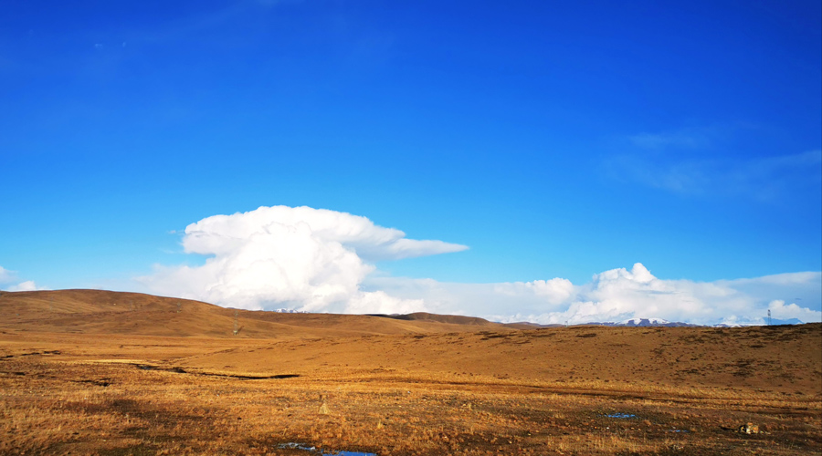

#             阿里大环线攻略!内含路线地图、边防证(推荐收藏)        

关键词：

##                 拼车拼团/包车自驾

​                            2020/2/14

阿里大环线 — 这是一条你不去一定会后悔的路！在拥有全世界最高海拔的西藏阿里，公路是一种别样的风景，没有亲自走过的人，不会领略到它的美，特别是阿里大环线。

▲阿里环线上的雪山。阿里大环线，它并没有318那样出名，但它景色之壮美丝毫不亚于318。从仲巴到塔钦是阿里大环线最美路段，因为这一段路会路过无数的神山圣湖，沿途绝美的景色令人目不暇接。双湖无人区位于羌塘腹地，这里是阿里大环线最危险的路段。在拥有全世界最高海拔的西藏阿里，公路是一种别样的风景，没有亲自走过的人，不会领略到它的美，特别是阿里大环线。青藏高原，是世界的屋脊，阿里，则是世界屋脊中的屋脊，它是万山之祖，也是百川之源。

▲一条通往阿里的公路，经流水侵蚀而形成的特殊地貌没有去过西藏的徒友们可能会问中国哪条公路最适合自驾？是国道318？是新藏线？是独库公路？而对于去过西藏的朋友们来说上面这些线路你可能都走过。但你应该不知道西藏其实还有一条天路，比川藏线更美更壮观，比独库公路更险更独特。神在造阿里的时候，好像特意偏了心，给了它至高无上的权力，让它美到犯规，美到超越大自然。它就是阿里大环线。

▲阿里环线上的雪山阿里大环线，它并没有318那样出名，但它景色之壮美丝毫不亚于318。它像一条巨龙盘卧在西藏腹地，被老驴友们称为“西藏的精髓。日喀则地处雅鲁藏布江和年楚河的交汇处，不仅风景优美，而且还具有浓厚的宗教氛围和历史文化。珠穆朗玛峰，雅鲁藏布江，扎什伦布寺，绒布寺，亚东沟.....日喀则地区现已开通30多处景点，每一个地让都有独特之处。

阿里大环线无人区旅游大概需要十多天的时间，想去的朋友也可以根据自己的时间合理制定行程，下面小编就为大家分享一条大理大环线亲自踩点排出来的行程，阿里大环线基本还是属于无人区，可能要开很久很久才有人烟，不过那儿的风景也确实是世间少有，

**一、阿里大环线无人区推荐线路**

**D1：拉萨-羊湖-卡若拉冰川-白居寺-日喀则里程：380KM宿：日喀则（海拔：3950M）**

行程靓点：冈巴拉雪山、羊卓雍措、卡若拉冰川、白居寺、宗山抗英炮台、帕拉庄园

上午从拉萨启程，翻越海拔4990米的【冈巴拉雪山】，远眺冈巴拉雷达站，沿老路前往世界上最高的淡水湖、有天上圣湖之美誉的【羊卓雍措】。藏语为“碧玉湖”，是西藏三大圣湖之一的淡水湖，湖水如羊脂般清澈，湖水甘甜，可以饮用。湛蓝的湖水与远方的雪山连为一体，加上两岸各色的山脉、极具特色的藏民族村落、遍地的牛羊，一路走来，心旷神怡。途经观【卡若拉冰川】：沉睡的冰美人（晶莹幽蓝、巍峨壮观、云雾飘缈、绝世容颜，不仅仅是流动的岁月和冰雪写就的地质历史，而是时光雕塑的伟大艺术品）；参观唯一集西藏三大教派于一体，以精美绝伦的壁画和雕刻而著称的十万佛塔【白居寺】，远观宗山抗英炮台（抗英军壮烈遗址，感悟英雄城的风姿）、帕拉庄园藏语意为“最好的庄园”,封建农奴制度的缩影；沿雅鲁藏布江河谷到达后藏重镇——日喀则。

**D2：日喀则—拉孜—定日—珠峰里程：350KM宿：绒布寺/大本营（海拔：4900M）**

行程靓点：扎什伦布寺、嘉措拉山口、加乌拉山、珠峰之路、珠峰日落

日喀则早餐后参观西藏最大寺庙——【扎什伦布寺】；扎什伦布寺始建于明正统十二年（1447年），创建人是格鲁派祖师宗喀巴的徒弟根敦珠巴，根敦珠巴后来被追溯为一世达赖喇嘛。寺庙位于日喀则市城西的尼色日山坡上。建筑面积近30万平方米，是藏传佛教格鲁派在后藏地区的最大寺院。“扎什伦布”，藏语意为“吉祥须弥山”该寺是班禅四世及以后历世班禅的驻锡地，分为宫殿（班禅拉丈）、勘布会议（后藏地方政府最高机关）、班禅灵塔殿、经学院4部分。

日喀则出发在将到定日时，即可远眺珠穆朗玛峰的雄姿。沿途将翻越米的嘉措拉雪山(海拔5220米)，经约6小时抵【新定日】（海拔4378米）。过了定日我们继续乘车前往【珠峰自然保护区】，参观建于公元1899年的西藏红教寺庙【绒布寺】（海拔5154米），该寺位于珠峰北坡，与绒布冰川末端相连，是世界上海拨最高的寺庙，距离珠峰顶仅20多公里，可以在此远眺海世界第一高峰，海拨8844米的珠峰峰顶，（海拔5600米），晚上宿大本营或绒布寺。2019年后珠峰大本营已搬到绒布寺了。

温馨提示：全程海拔大多在3800米以上，所以车行较慢，最好提前服用抗高原反应的药，行前检查氧气瓶，这一段路虽然不危险，但一定要注意高海拔。（小车进山费320元/辆自费，门票每人160元，环保车每人120元来回，所以进入珠峰费用为每人160元+120元+自驾车320元/台，进入珠峰必备资料：需要在户口所在地公安局办理边防证，阿里大环线一般写上日喀则地区、山南地区、阿里地区）

**D3：珠峰—岗嘎—萨嘎里程：380KM宿：萨嘎（海拔4500M）**

行程靓点：珠峰日出、希夏邦马峰、佩估措

早上珠峰出发经过岗嘎乡至【嘎萨】，公路旁边就是希夏邦玛峰。希夏邦玛峰是世界第二高峰，海拔8012米，在希夏邦玛峰北坡末端，有吉隆第一大湖佩枯湖，清澈的湖水，【希夏邦玛峰】倒映其中，美丽又壮观。观【佩枯错】。佩枯错是日喀则地区最大的湖泊，面积300多平方公里。该湖三面环山，地形开阔，鱼类资源丰富，湖岸有野马、藏野驴、藏羚羊、仙鹤、黄鸭、灰鸭等活动，沿途游后傍晚抵达萨嘎。

**D4:萨嘎—仲巴—帕羊—圣湖—普兰里程：570KM宿：普兰（海拔：3700M）**

行程靓点：冈仁波齐、玛旁雍错、拉昂错（鬼湖）

早晨萨嘎出发前往【神山神湖鬼湖】，途中瞭远看到【冷不岗日山峰】，海拔7095米，仲巴县了、境内观雅鲁藏布江源头湿地、沙丘和远处的喜马拉雅山脉。翻越海拔5216M的【马攸木拉山口】进入神奇的阿里境内。下午抵达圣湖玛旁雍错，圣湖位于冈底斯山主峰──【冈仁波齐峰】和喜马拉雅山【纳木那尼峰】之间，西藏自治区普兰县内。玛旁雍错曾与【拉昂错】（鬼湖）相通，后由洪积，冰水堆积物堵塞而演化为内流湖。【玛旁雍错】佛教称【圣湖】，有【世界江河之母】的美誉。尽情拍摄【玛旁雍错】，【纳木那尼峰】，【拉昂错】位于阿里地区普兰县境内，与玛旁雍错一堤之隔，两湖之间的地带是进出普兰县的必经之路。拉昂错又被称为【鬼湖】，其实圣湖、鬼湖原本为一湖，由于气候变化，湖泊退缩，湖面下降，才由一条狭长的小山丘把它俩分开。晚上住宿中印口岸——普兰。

**D5：普兰—神山—圣湖—扎达土林里程：420KM宿：扎达（海拔：3700M）**

行程靓点：玛旁雍错、冈仁波齐、扎达土林日落

在【冈仁波齐峰】和【纳木那尼峰】中间迎着朝霞出发，返回路途上经过神山圣湖，再一次多个角度的观赏拍摄。在玛旁雍错旁边的高处基乌寺观赏拍摄【玛旁雍措】湖景以及【冈仁波齐峰】的景色。下午经过土门到达巴尔兵站前往【扎达土林】，扎达县著名的土林地貌风光区，由洪水冲刷、风化侵蚀而形成的独特土林地貌，放眼望去只见褶皱层层沟壑叠叠，犹如整齐排列的巨大土林，犹如大地隐秘在此的鳞甲，雄伟多姿壮美奇绝。拍摄夕阳下的土林结束后到达扎大县城住宿。

**D6：扎达—古格王朝—神山—塔尔钦里程：355m宿：塔尔钦（海拔：4600M）**

行程靓点：扎达土林、古格王朝、托林寺、冈仁波齐

早起拍摄古格日出，乘车穿过土林前往前往令您仰视雄伟壮观的古格王宫【古格王朝】，古格王国遗址是一座高原古城，古格王国遗址在阿里札达肥札不让区象泉河畔的一座土山上。今天的古格故地，只有十几户人家守着一座空荡荡的城市废墟。古老的古格，像是一座巨大的迷宫，将西藏西部众多的秘密深锁其中。你会发现在象泉河谷边上，坐落着这个300多米、有着严谨的布局，自上而下由等级排列，各类残存的宫殿，洞窟、碉楼、佛塔、护墙等散布其间的【古格王朝】遗址。游览完毕后沿原路返回扎达县城。游览有900多年历史的-【托林寺】该寺庙在建筑风格和佛像上都融合了印度克什米尔、拉达克和尼泊尔的风格。午餐后原路返回神山下的小镇——【塔尔钦】。

**D7：塔尔钦—霍尔—亚热—仁多乡里程：350KM宿：仁多乡（海拔4500M）**

行程靓点：冈底斯霍却垭口、阿果措、野生动物

从今天起我们将驶上真正的荒原，荒凉、神秘而寂寥的无人区；同时也是北线最精华的部分，在这片人迹罕至的土地上藏着无数的湖泊，“一错再错”的惊艳”正在向我们展开。行走的全是颠簸难行的碎石搓板路，看到的是广漠无垠的旷野和荒原，一路上都会看到野生动物，藏原羚、旱獭、黑颈鹳和藏野驴。藏原羚别名藏黄羊，藏黄羊的屁股是白色的，所以藏民们一般都叫他们“白屁股”，它们胆子很小，一看见人来就飞也似地奔逃。阿里之行，一路上见到最多的就是“白屁股”和藏野驴，这些青藏高原的精灵，自由自在地生活在这片阿里无人区。中途翻越海拔5155米的【冈底斯霍却垭口】，下山后就能看到【阿果措】。霍尔和仁多之间，亚热是唯一可以吃饭的小镇，仁多是个繁华的地方，方圆百里唯一能提供住宿的地方，晚上住宿仁多乡。

温馨提示：我们线路的设计区别传统的阿里大北线从革吉、改则直接走到措勤，不经过亚热、仁多，所以仁青休布措相比大北线上的其他各个措起来更加的人迹罕至。不过越是原生态的湖，美得越是纯粹，湛蓝的湖水、尖顶的雪山、蓝天白云，一个都不少。

**D8：仁多乡—措勤里程：256KM宿：措勤（海拔4600M）**

行程靓点：昂拉仁措、仁青休布错、塔若措、扎布耶茶卡

伴随着藏北大地的第一缕霞光起床，以自备的干粮果腹之后我们继续出发。昨天的美景其实只是一个序曲，今天的惊艳会更胜一筹。从仁多乡出发后我们先后会经过几个湖【昂拉仁措】海拔4700米：一座被当地人誉为人间仙境的湖泊；【仁青休布错】海拔4700米：能随观看方位不同而变化景致的神奇大湖；【塔若措】海拔4566米：有着难得一见的红色湖水；【扎布耶茶卡】海拔4421米，最惊艳和神秘的高原盐湖，世界第三大锂矿产地；

除此之外还有许多小湖，虽然没有名气，甚至叫不出名字，但是一样魅力无穷。傍晚时分到达措勤县（海拔4600米），夜宿措勤县城。

**D9：措勤—当惹雍措—文部南村里程：239KM宿：文部南村（海拔4500M）**

行程靓点：藏北大草原、野生动物、扎日南木措、文布南村、当惹雍措日落

早餐后从措勤出发，经过【扎日南木措】位于中国西藏自治区藏北措勤县境内，又称塔热错、特里纳木错，湖面海拔4613米，湖水面积1023平方千米，是西藏第三大湖。继续前进到达拍摄苯教崇拜的最大的圣湖——【当惹雍措】，是苯教最重要的神湖，其地位与佛教所认为的世界中心——冈仁波齐和玛旁雍措身价相等，且传说湖底是相通的。它位于那曲地区的一个深陷的湖盆底部，与当穹措相毗邻，形似一金刚杵，上圆中细下部长，四面群山环抱，南面的达尔果雪山，山顶积雪终年不化。据说此湖在一天之中能变换三种颜色。湖的南岸【达尔果山】一列七峰，山体黝黑，顶覆白雪，形状酷似7座整齐排列的金字塔，它和当惹雍措一起被苯教徒奉为圣地。站在湖边的一座小山头，站在山头上环顾四周，湖天一色，湖岸线条优美，湖水在灿烂阳光的照耀下，蓝得分外妖娆。我们继续在驱车行驶来到当惹雍错的北岸【文部南村】。

**D10：文部南村—文部北村—尼玛里程：130KM宿：尼玛（海拔4500M）**

行程靓点：当穹错、文布北村、当穹寺、当惹雍错、野生动物、藏北风光

早上起来欣赏了解下【文布南村】的当地习俗和早晨风光。若是喜欢文布南村，可以在这里多停留半天，这里虽然食宿条件比较艰苦，但是地处偏僻、依山傍湖的文布南村是多么的美，村里人多数半农半牧，在湖滨开了一些田地，种植青稞、土豆、油菜和小白菜等，这在海拔4500多米藏北是极其罕见的。这里被驴友们称作是“文布天堂”，随意走走都能拍到宁静、安详、恬淡的画面。然后出发途径【当穹错】，实际上当穷措与当惹雍措是在同一个湖盆之内，湖水未枯以前本是同一湖泊。这正是当穷措名字的来历，藏语里当穷措即小的当惹雍措之意。正对当穷措的是文布北村，从房屋看生活水平，还不如文布南村，有兴趣的还可以参观【当穹寺】。离开文布北村，继续前往尼玛。当晚住宿尼玛。尼玛藏语意为太阳，1983年8月1日才正式成立尼玛县，这是西藏最年轻的县。

**D11：尼玛—色林措—班戈里程：420KM宿：班戈（海拔4500M）**

行程靓点：达则措、色林措、野生动物、藏北风光

尼玛出发前往【达则措】，进入野生动物藏羚羊的天堂，一路上不时出现各种野生动物。【色林错】在藏语意为“威光映复的魔鬼湖”位于申扎、尼玛、班戈三县的交界处，流域内有众多的河流和湖泊互相串通，组成一个封闭的内陆湖泊群，主要湖泊除色林措外，还有格仁措、吴如措、仁措贡玛等23个卫星小湖。是西藏第一大湖泊及中国第二大咸水湖，湖面海拔4530米，积达2391平方公里。【色林错】是青藏高原形成过程中产生一个构造湖，亦为大型深水湖，湖心区水深在30米以上，透明度7-8。每到夏季，湖中小岛上就栖息着各种各样的候鸟。

温馨提示：到达色林措之后环湖的路段基本上是新铺好的柏油路，经过之前的颠簸之后终于走上了平整的大道。这一天我们会经过很多措、达则措、吴若措、恰规措、色林措、我们“一措在措”将“措”到底！但路线不能走错了！

**D12：班戈—圣象天门—纳木错（扎西半岛）里程：286KM宿：当雄（海拔4200M）**

行程靓点：班戈错、巴木错、圣象天门、纳木措夕阳

出班戈后会走在久违的柏油公路上抵达巴木措，车将停在公路旁的一座山头上，这里可以俯瞰巴木措的绝佳位置。巴木措再驱车2小时左右就能抵达不为人所知的秘境【圣象天门】，天门位于纳木错北岸，风光远胜游客常去的南面扎西岛，这是一处秘境，【圣象天门】顾名思义，一只天然形成的巨大石象，站立在辽阔的纳木错岸边，象鼻恰恰的深入湖面，仿佛正在汲取这来自雪域的神圣之水。而石象的身体与象鼻之间，就如同一个巨大的门，是通往天堂的圣门。离开辽阔的无人区，穿越申扎自然保护区，抵达【纳木措】，在扎西半岛拍摄绝美夕阳。

温馨提示：当晚可以选择扎西半岛或是当雄县入住酒店休息，如果选择住宿在纳木措扎西半岛（湖边帐篷旅馆），可以看夕阳下的纳木错，也可以夜拍纳木错的星空，精彩无限哦！当然选择住宿当雄吃住各方面的条件就比较好了！

**D13：当雄—藏北草原—拉萨里程：250KM宿：拉萨（海拔3650M）**

行程靓点：念青唐古拉山口、青藏公路、青藏铁路

早上当雄出发经过青藏线返回拉萨，经过半个月的艰苦行程，相信大家早已成为团结的集体，这段日子将给你们留下美好的回忆！今天回到拉萨，回到“繁华人间”，准备好丰盛的晚宴，等待着大家一起尽情享用，晚餐后队友依依话别，结束一生难忘的第三极阿里之旅。

