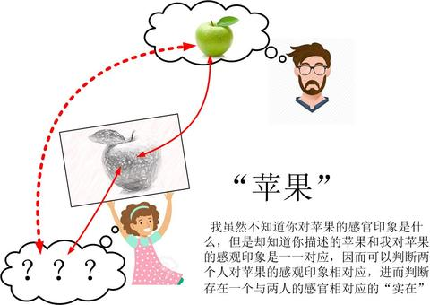
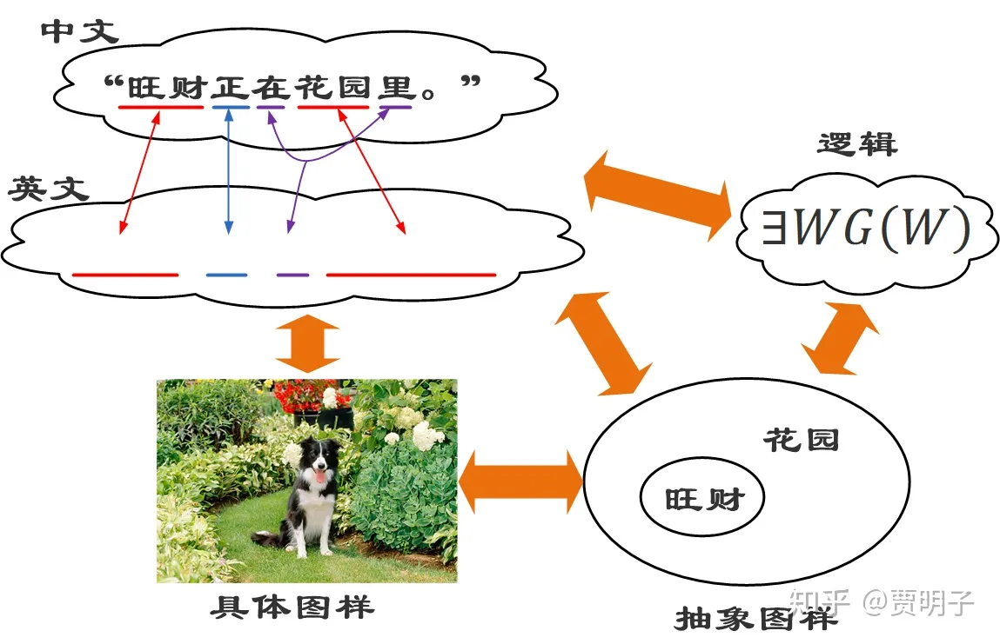
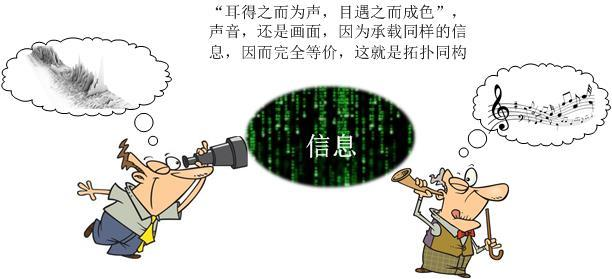
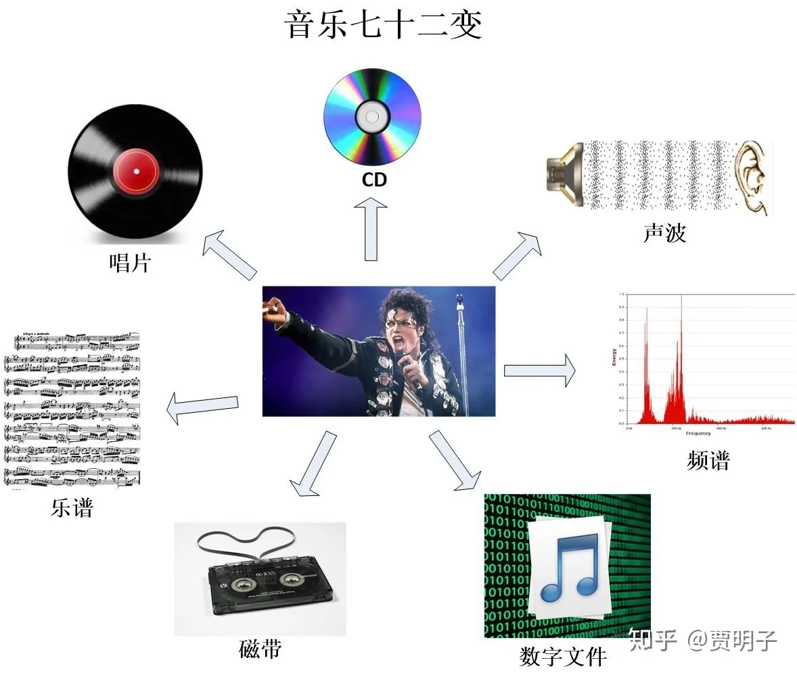
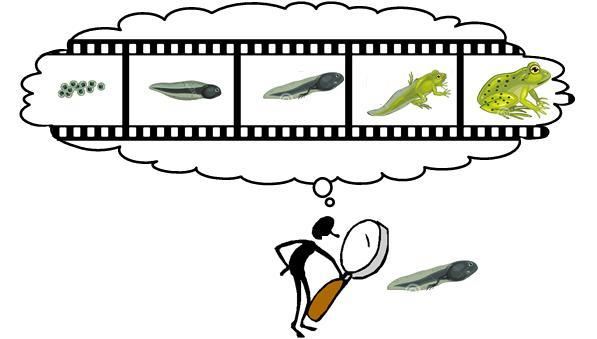
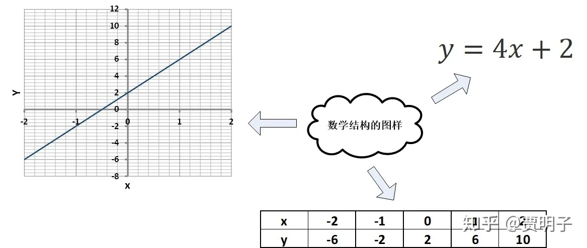
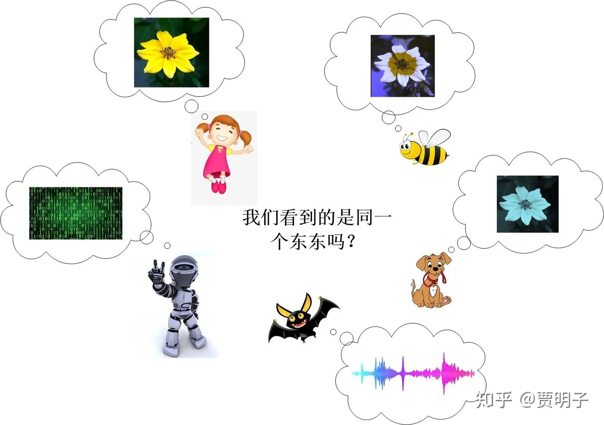
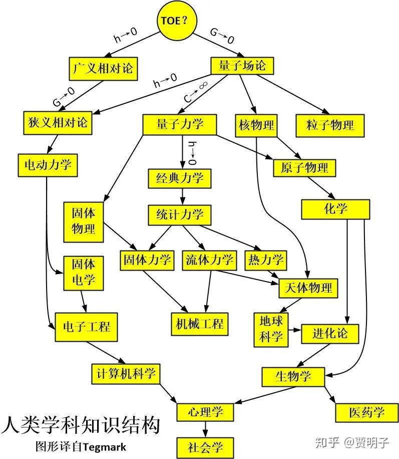

# 10、客观宇宙的唯一可能是数学？

> ***“道可道，非常道，名可名，非常名”\***
> ***–老子\***

***（注：本章修改自本人另外一个专栏文章[贾明子：现实的无心之心](https://zhuanlan.zhihu.com/p/37099562)，其中增加了一些直观的表述，可参考原文。）***

------

数学柏拉图主义中，还有一派观点，这种观点恪守了“数学的抽象实在”这种核心思想，但是，这里的数学抽象实在，并不见得是每一个数学对象，诸如集合、自然数、向量、函数等等，而是数学是一种抽象的**结构（structure）**或曰**图样（pattern）**。自然界具体事物之间的相互关系，其实也是这样的一种结构 – 一种具体的结构，因而它又被称作“**结构主义**”。而自然规律则阐明了这些**具体结构**的普遍性，而这种普遍性的背后，则是**抽象的数学结构**。这样一来，对“人们如何认识抽象实在”这种“认识论问题”也就迎刃而解了，它就是编码在具体结构背后的、普遍的、不变的抽象结构。进而这种观点还可以更进一步，认为我们整个物理世界也不过是抽象的数学实在的一种表象而已。这是一种结合了自然主义主张的观点，然而最终却走到了数学柏拉图主义的极致：不但抽象的数学实在是真实存在的，而且只有数学实在才是真实存在的。

我们不妨来回忆一下前面第二章，

[贾明子：2、存在337 赞同 · 75 评论文章](http://zhuanlan.zhihu.com/p/40119556)

这里面我们讨论过一个问题。对于一个具体事物，例如说苹果，我感知到的关于苹果的印象，和你感知到的关于苹果的印象是否一致呢？这个问题我们无从得知，因为我对苹果的印象专属于我自己，而你对苹果的印象专属于你自己。我无法进入到你对脑袋里体验你的印象，因而我也就不知道我所感知的“红色”和你所感知到的“红色”是否一致、我所感知的“圆的”和你所感知的“圆的”是否一致。那么，既然我们感知的苹果可能完全不同，为何我们还会认为我们看到的是同一个“**客观实在**”呢？

因为在我们的沟通中，你可以用某种方式把你的印象表达出来，例如画图。作为一个准确的表达，你的表达方式中所负载的信息，必然是与你对苹果的印象一一对应的。而我通过你的表达，显然可以判断你的表达和我的印象一一对应，因而我就可以知道，我们两个人的印象是一一对应的 – 它们可能完全不一样（甚至说“一样”这种描述在这里毫无意义！），例如我无法知道你和我是否红绿颠倒，但是我所能确知的，就是这种一一对应关系。同样，妈妈的印象也会分别与我们两个人的印象一一对应。那么自热而然地，**我们就认为我们这些相互一一对应的印象，必然会对应于一个确定的、抽象的东西：客观实体**。这个实体的某种性质，分别对应着我们感知中的颜色，我们把它叫做“红色”，它的另一种性质，对应着我们感知中的形状，我们把它叫做“圆的”，等等。那么这个客观实体就是这些性质按照某种图样组合起来的一种结构，它**表达**在我们的感知中为具体的印象，但是它本身是抽象的。

我们不妨另外举一个一个简单的例子。

比如说，我们知道一个信息，旺财正坐在花园里。我们可以用各种不同的语言来表达它，例如中文：

**“旺财正在花园里。”**

英文：

**“Wangcai is in the garden。”**

这两句话传达给我们的，是完全相同的信息，虽然它们的具体形式是不同的。只要你懂英语和中文，你根本不会认为它们说的是两件不同的事情。当你看到这两句话的任何一句，你都可以在脑海里浮现出同一幅画面，类似这样的：

这就是一幅很具体的图，图中就显示了旺财和花园之间的关系 – 一个具体的**图样 （pattern）**。而描述这个图样的中文和英文，本身不是具体的一幅图，但是却生动地传达出了这幅图的结构。这是因为，中文、英文、图之间存在着一一对应的关系：

“旺财”↔“Wangcai”↔ 图中的狗，

“花园”↔“garden”↔ 图中的环境，

“在……里“”↔“in“”↔ 图中的位置关系。

同样地，一个从来没有见过旺财的你的好友，例如小欣，听到这种描述后，也会立刻知道它们在描述这样的事实，但是她的脑海里就不会出现这样的画面，因为她不知道旺财长什么样子。她只是单纯地知道旺财坐在花园里这个事实：一个抽象的旺财和抽象的花园。虽则抽象，但是旺财是一只狗、狗坐着是一种什么样的姿势、旺财和花园之间的关系如何，小欣肯定是知道的。“旺财”、 “花园”、“在……里”这些词汇就描述了这样一种关于旺财和花园的抽象的关系网，这种网就是一种关系“图样”。小欣之所以知道这种图样的结构，是因为中英文的结构和这种图样的结构有着一一对应关系。如果我们用不同的颜色区分名词、动词、介词，我们可以把这种一一对应关系表示如下：

这里，中文和英文是完全不同的语言，但是它们所对应的却是完全相同的**事实**。同样地，从这两句话中，你和小欣感知的（perception）的具体信息可能有所不同，这和你们以前的具体经验有关，你知道旺财的样子，而小欣不知道，但是你们感知的信息之间却存在着一一对应的关系：

你心目中的旺财↔小欣心目中的旺财；

你心目中的花园↔小欣心目中的花园。

因而你们获得的抽象图样是一致的：一只个抽象的狗位于一个抽象的花园中。

所以说，中文、英文、脑海中的图片，它们之间有千差万别，但是正是因为这种一一对应关系，它们都必然对应着相同的结构：**一种确定的抽象图样。**所有的中文、英文、具体画面，最终都是这种抽象图样的表达。

我们再来回忆一下第一部分第五章，

[贾明子：5、用“几何观”看世界242 赞同 · 8 评论文章](http://zhuanlan.zhihu.com/p/28557211)

在那里，我们完成了一个很有趣的任务，把MJ的歌给画成了一幅山峦起伏图。我们曾经说过，其实如果我们找对了某一种一一映射的关系，那么世间万物都可以用几何来表述：万物皆可入“画”。一切现实都可以用这种映射关系反映到几何关系中去，因而一切现实都可以被画出来。这个画出来的图形本身是一种对物理现实的抽象表达，然而说到底，这个图形本身，却是具象的：它画在某种载体上，如纸上或电脑屏幕上。事实上，这个具体的图形虽然是物理现实的抽象，但是它同时又是一种**数学抽象图样的具体表达**。

在这里，音乐就代表了一个无数个音符的集合，这些个音符按照某种特定的关系串联起来，最终通过某一种方式实现出来（例如钢琴、吉他、小提琴、歌声等等），形成声波，传到我们耳朵里，使我们的耳膜振动，刺激我们的听神经，最终到达我们的大脑，被诠释为音乐。事实上，声波的振动，就表现为空气分子就是一种空间和时间中的图样（pattern）：什么时刻、音乐厅的哪一个位置、空气分子按照何种频率的组合以多大的能量进行振动。这个声波的振动，可以用波动方程严格描述出来。而再往上一层，就是乐谱。乐谱本身就是无数个音符按照相互关系排列组合形成的图样。

而这种图样，我们可以通过很多种不同的方式记录下来：比如说，写在五线谱上，刻在CD或唱片里，录制在磁带里，以数字文件的形式写在硬盘里或MP3播放器里，用图形记录在频谱曲线里，等等等等，我们可以有无数多种记录方式。所有这些记录方式物理上都很不同，但是它们记录的却是同样的一首曲子。

那么，我们来看，CD盘面上细密的小坑，声波中某个空气分子的振动，磁带中某处磁粉的密度，频谱的某一帧曲线形状，乐谱中某个蝌蚪一样的符号，以及数字文件中某一串10010110……，它们是如此的不同，从真实的物理结构上，我们根本就不可能找到相似之处，它们是如何记录了同样的一首乐曲的呢？

**一一映射**。

没错，从数学上，我们可以把上述的不同物理形式按照某种规则建立起相互联系。CD上的某个小坑就对应了频谱的某一段曲线，反之亦然。如此等等。既然它们互相之间都能建立起这种一一映射的关系，那么很显然，它们最终就可以被还原成同一样东西：**某种 “纯粹”的、抽象的图样。**这种图样可以不依赖于任何负载信息的介质 – 诸如五线谱、磁带、唱片、数字文件、频谱图形，等等。任何一种上述的表达方式的缺失都不会使我们的音乐消失。但是音乐可以通过任何上述方式表达出来。这种图样就可以让人们能够演奏乐曲。我们绝不会因为毁坏了一张CD，就丧失了对音乐的概念。同样地，这种图样也不依赖于任何理性活动的生物或非生物 – 人类、外星人、狗狗、猫咪等等一切，因为它并不是一个具体的事物，不必通过具象化的感知。

这种图样，就是音乐的抽象结构。这种结构，如果用我们的五线谱作为载体表述出来，就是“音符”之间的相互关系。就好像“旺财在花园里”这个事实可以被表达为中文、英文、图像、形式逻辑等不同语言一样，所有这些唱片、数字文件、乐谱、频谱等都是这种**抽象音乐**的**具体表达**。

我们前面讲到过，“**一一映射**”，或者叫做“**互射**”，所代表的，就是两种结构之间的**拓扑同胚**，或者说，是数学结构上的同构。我们在第一部分的第7章

[贾明子：7、茶杯与甜甜圈之辨171 赞同 · 22 评论文章](http://zhuanlan.zhihu.com/p/28566895)

讲到过这种数学结构上的等价性。

**这种贯穿于各种具体载体之间的、因而就不依赖于任何载体的、相互等价的数学图样结构，在某种意义上说，就是音乐的终极现实。**

音乐这个东西从数学上讲相对比较复杂，我们可以用最简单的自然数作为例子来更加清晰地加以描述。结构主义认为，数学的抽象实在，体现在这样一种抽象的结构图样中。具体的某个数学对象不必是一个独立的真实存在，它们相互依赖，相互支撑，成为这种抽象图样中的某种特定节点，或“位置”，共同构建起了一个整体的结构。比如说自然数，整个自然数是从零开始，一个后继数一个后继数地递归定义上去的，1是0的后继数，2是1的后继数……，如此循环。因而自然数的整体就是这样一种结构：一些离散的抽象“节点”（我们称之为数字）排成一队。自然界中一切离散的（或“可数的”）集合，包括具体事物或抽象事物，都有着同样的这种类似结构。比如说一筐苹果，我们对它们进行计数的过程，其实与皮亚诺算术公理就存在着类似一一对应的关系：

“存在一个自然数0” ↔“开始计数时还没有数苹果”

“0的后继数定义为1” ↔“从零开始下一个苹果是第一个”

“1的后继数定义为2” ↔“第一个苹果的下一个是第二个”

……

如此等等。

我们说所有的这些离散的实体，诸如一筐苹果、一筐梨子、一班学生、一束粒子、一列级数、一组可数集、……，它们不论是具体事物，还是抽象事物，都有着与自然数一一对应的这种结构，因此它们就可以对应于一种更加抽象的、普遍的结构形式，诸如冯诺依曼定义：

{∅}，{∅，{∅}}，{∅，{∅，{∅}}，{∅，{∅}，{{∅，{∅}}}}}……

自然数的数学实在中的关键，不在于每一个自然数字的实在性，而是在于这种普遍存在于离散实体之间的抽象结构。每一个自然数脱离了这种整体结构，都变成了无源之水，而整个自然数的整体才体现了数学的实在性。

再比如说，你们刚刚学过的一次函数。现在你拿到一个一次函数：

$f\left( x \right)=4x+2$

那么，你要如何具体地把这个函数表述出来呢？

当然，你可以说，这个函数式本身就是一种具体的表述形式。你们还学过列表和画图的方法。我们知道，函数式、列表、图形，它们都是这个同样的函数的不同表达方式：是这个函数所代表的数学结构的具体表现：

如果依赖于代数语言，它就表现为函数式，如果依赖于几何语言，它就表现为函数图形，如果依赖于表格，它就表现为列表。但是这三种具体的表现形式，都是某种数学结构的具体表达而已。

假如说，我们想要对某人传达“旺财在花园里”这个抽象事实的时候，我们需要用某种具体的表达方式，例如对中国人，我们说中文，对美国人，我们说英文，对一个数学宅男，我们可以跟他说形式逻辑表达式，对一个文盲，我们还可以给它看图片。同样一个抽象事实，可以有各种具体表达方式。如果我们遇到了一群外星人呢？怎么办？假如说旺财在花园里这个事实**是客观的**，不会因为不同的物种而有所不同，那么我们必然可以翻译成某种“外星语”。我们总可以找到一种表达方式，能够被我们的对象理解，而这种表达方式就和其它诸多语言一样，是一种**抽象结构的具体表象**。

如果说，我们遇到的星人和我们感官完全不同，我们想向它们介绍一下我们的音乐，怎么办？鉴于它们没有听觉，我们没有办法向它们演奏。如果它们有视觉，我们可以给它们看频谱，就像我们前面画出来的沿着连续时间变化的频谱曲线就构成了一座起伏的山峦。山峰的结构就代表了音乐的结构。它们就可以通过视觉来了解我们的音乐。如果它们没有视觉，仅有味觉呢？我们也可以想办法。比如说我们用酸甜苦辣咸以及它们的连续组合来代表高低不同的音频，那么我们可以通过味觉的变化，把音乐编码到味道当中，让它们了解我们的音乐。如果说，我们的音乐本身**不会随着接受者的不同而有所不同**，那么即使是它们的感官系统和我们没有任何重叠，我们也总是有办法：因为我们面对着一个共同的外部物理世界。我们总可以利用拓扑同胚的原理，把我们的音乐编码到某种它们可以感受到的物理载体里面。例如如果它们可以直接感受磁场，那么一盘磁带就可以做到我们的工作。总而言之，音乐的“纯数学图样”，才是我们传递的信息。

所有的这些例子，它们的抽象结构都可以表达为各种不同具体表象，但是我们这个结论存在着一个假设的前提：

**存在一个不依赖于感官的客观现实。**

因为只有这样一个客观现实的存在，才能构成两个具有完全不重叠的感官系统的物种之间的桥梁。如果最终的所谓“现实”是依赖于感官，依赖于观察者个体的，那么我们和外星人眼中就会有完全不同的现实。我们的数学图样依赖于我们的经验，而对方的，则依赖于对方的经验，两者是完全不同的：我们双方的现实，毫无共通之处。甚至说，我和你的现实都是完全不同的，因为它依赖于你我的主观世界。那么它们之间的一一对应就被打破了，我们就不可能找到一种共同的抽象结构来找到不同主观体验者之间的共同客观实在。

那么，一个独立于个体的客观现实到底是否存在？秉承数学柏拉图主义的答案当然是肯定的：是的。数学是一个不依赖于个体的存在，前面我们已经对此论述很多了，这里不再重复。而数学本身的客观性，就是客观实在存在的明证：因为存在着这样一种客观的结构，它总可以与一部分物理实体形成一一映射，这就是物理现实的实在性。但是，持有结构主义观点的人不满足于此，他们还会更进一步，认为这个现实中**只有数学实在，而没有其它**。比较著名的就是Temark的断言：

**如果存在着独立的客观现实，那么这个现实必然是数学的。**

这个，叫做“**数学宇宙假说**”（Mathematical Universe Hypothesis，**MUH**）。

前面提到，从早期柏拉图主义到20世纪人们在数学中的逻辑主义和形式主义的影响下，渐渐地倾向于把数学与现实剥离开来，而把它看做一种纯粹的形式理论，或是一种逻辑体系。它可以被自然科学拿来对现实进行表述，但是它本身却不包含现实。

但是，数学工具本身所不包含的现实，指的是那些具体的物理实体。而Tegmark却认为，物理实体本身不够“实在”，因为我们必须要通过各自的感官来感知它。真正的实在，是物理实体背后的数学结构。

作为有效的数学模型所必备的一个特征，就是与现实结构具有同胚性。也就是说，数学模型中的一部分概念与现实实体间有着一一对应的关系 – 只有这样，数学的结果才能够对现实有正确反映。现在Tegmark站起来说，这种同胚性，本身就是把打上了我们主观烙印的物理现实及其之间的关系抽象出来成为一种“客观”的数学图样。这即是最终极的现实：物理实体之间的结构（structure）和图样（pattern）。而具体的物理实体，反倒不能算作“现实”。因为物理实体总是依赖于观察和主观概念，但是数学的抽象结构却不必。

比如说，我们非常习惯于我们人类的视觉，但是，我们所能感知的五颜六色，仅限于可见光，其实是一个很宽的光谱中极小的一小部分，红外和紫外都是我们看不到的。并不太令人惊奇的是，其它的很多动物它们感受光的范围和人类不尽相同。例如，蜜蜂的感知就偏向于紫外线一些。因而它们看到的，就和我们很不同。我们无法想象看到紫外线是个什么感觉，但是我们可以通过人类的体验来“模拟”这种感觉。比如说一朵花儿，我们看到的是一朵纯色的黄花，而蜜蜂，由于它们的视觉偏向紫外，那么它们可能分辨不清楚黄色是什么，但是它们会明显地看到花心附近的紫外线（这可以使得它们更方便地采蜜），因此它们看起来，就是一朵双色的花儿 – 不管怎样，反正不是黄花。

那么，如果蜜蜂能够和我们对话，谈论这朵花，那么我们和蜜蜂之间就很难达成共识。如果我们考虑更多的有着不同感官系统，那么大家的分歧就更大了：

人：一朵黄色的花。

蜜蜂：一朵双色花

狗狗：什么是颜色啊？

蝙蝠：什么是花？明明就是一堆超声波！

机器人：你们都错了，这是一堆二进制的数字串！

每个人眼中，都以一个只依赖于自己的现实，那么我们就不禁怀疑：离开了人们的感官，这朵花到底“客观上”是什么？存不存在一个不依赖与感官的“客观现实”？

所幸的是，我们现在的科学理论暂时能够给出一个大家都认可的现实：电磁波的光谱。我们虽然无法体验紫外视觉或者红外视觉，狗狗虽然不知道红绿是什么，但是当我们把这朵花反射的太阳光的光谱列出来，大家都会毫无疑义。这是靠“电磁波”这种比颜色更加抽象的实体、用数学结构（傅里叶变换）表达出来的一种对现实的描述。它离开了人们直接感官，反而更加“客观”。

那么，电磁波又是个神马东东？我们需不需要更加抽象的概念来描述它？这就是MUH的关键。

那么，Tegmark这样说，如果存在着一个**独立于任何个体**的客观世界，那么，这个客观现实必然是**不依赖于任何个体所产生的具体概念表象**的。例如，我们说，宇宙是由各种微观粒子组成的 – 光子、电子、夸克、中微子等等。但是我们必须知道，所谓的这些微观粒子都是我们人类的主观意识赋予这个现实的具体概念，因而它们都是依赖于人的意识而存在的，它们就不可能是**独立的**客观现实。描述它们运动的薛定谔方程，依赖的是我们的抽象数学体系，函数、矢量、微分方程等等，它们不涉及任何我们经验中的具体事物，不依赖于我们的观察，因而是独立的。

而这些数学概念的更底层，就是连数学形式都不依赖的、抽象数学个体之间的关系，也就是**数学图样**。数学图样可以看做是一组抽象个体以及这些个体之间的相互关系。例如说，自然数就是这样一种数学图样：它包括了一系列的抽象个体：每个自然数，以及自然数之间的相互关系。其中的抽象数学个体，例如说自然数5，我们虽然在不同的语言和符号载体下，有着不同的具体表象，例如说阿拉伯数字5、汉字五、英文five、希腊数字V、或者二进制数字101等等，在形式主义中的数学概念都是依赖于具体的形式体系的 – 数学即形式体系。而柏拉图主义关注的，却是那些脱离了形式系统的、最终所指的、被冠以自然数概念的那个抽象的自然数。这些抽象自然数个体，既不依赖于具体实体，也不依赖于具体的符号系统。只有这种数学图样，才是不依赖与我们人类的，因而只有它们才称得上客观现实。所以，这就有了这样一个看似矛盾的结论：**所有对现实进行具体描述的，都不能称为现实，只有那些不对现实进行直接描述的，才可能是现实。**这种不直接描述的方法，就是抽象数学结构。这就是MUH的由来。

Tegmark接着对人类的各学科的知识结构做出了这样一种阐述：

人类的科学体系是一层层建筑起来的，每一层的科学都是建筑在它上一层的基础之上的。所有的这些科学理论，往往都包括了两个部分：

**一个是数学；**

**另一个是这些数学的使用手册。**

具体讲，每个理论的数学部分，对这个理论所涵盖的物理实体的运动行为作出了定量化的描述。但是，单单是面对着一个个裸奔的数学公式，我们并不能获得关于物理实体的任何知识。因此，在这些数学公式之外，我们必须要附加对这些数学公式必要的**诠释** – 这些数学概念对应的是什么样的物理实体。有了这种诠释，我们才能够根据数学计算的结果，对真实世界作出描述。例如说，在已经确立起来的量子力学形式理论（“裸”量子力学）的公理中，包含了这种数学：薛定谔方程、希尔伯特空间、本征值问题等；也同时包含了若干条这样的诠释：波恩规则、量子态和可观测量的含义、波函数坍缩等。这样的数学和诠释都是这个理论所必要的：数学给出定量结果，诠释把这些抽象的数字和现实联系起来。

在这个知识体系中，每一层都涌现出相比于上一层更多的概念。于是，层层加码，表现出来的的就是，这个知识树中，越往下的部分（越具体的理论），其理论过程中包含的“诠释”部分就越多，而相应地，这些概念就越贴近我们的经验，越具象。反之，越往上的部分（越基础的理论），则这种诠释就越少，就越接近裸奔的抽象数学。例如说心理学、社会学这些学科中，就几乎没有什么数学在里面。再往上的一些工程学科中，数学甚多，但是基本上对应的都是非常直观的概念。到了经典力学和统计力学这一层，已经有很多抽象的数学概念了，比如说系统的运动对应于高维相空间中的一个点。再向上量子力学，诠释的部分已经很少了，哪怕我们不要什么诠释，只是shut up and calculate也丝毫不会阻碍人们应用量子力学。而人们甚至不知道波函数究竟是个什么东东了。我们的讨论范围并不包括更加基础的理论，量子场论中，粒子都已经不再是基础概念了；而广义相对论中，时空则是一种几何。现在我们的科学理论，还是分成了两个暂时无法相容的部分，一个就是量子理论，另一个就是相对论。量子理论对微观世界以及电磁、强、弱相互作用有着很好的解释，但是却对引力无能为力。而相对论则相反。人们正在试图建立一种终极理论，它包含一切事物的运动，这种理论一般被称作大一统理论（Theory of Everything, TOE）。而Tegmark这样说：

> ***“……a TOE would probably have to contain no concepts at all. In other words, it would have to be a purely mathematical theory, with no explanations or“postulates” as in quantum textbooks” (大一统理论可能必然不包含任何概念。也就是说，他应该是一种纯数学理论，没有“诠释”或者量子力学课本中的那些“公设”。)***

这样一种纯抽象的，没有任何源自经验概念的数学理论，就是Tegmark心目中的终极理论，它所描述的，就是MUH中的终极现实：数学结构。

我们可以看到，这种不依赖与实体概念而自在的抽象现实，似乎跟康德主义有些类似。康德的“物自体”就是剥离了具体性质的、独立的、自在的、抽象的存在。由于物自体无关主观，因而它永远不可能被人们真正认识。

但是，我的理解是，MUH和“物自体”事实上是不同的。Tegmark的数学宇宙，并不需要一个我们无法触及的纯粹客体。它其实是在说，根据我们的感官和观念不同，我们每个人所接收的“现实”可以是完全不同的，但是，所有这些不同的、在主观上的映射的现实，它们必定是存在一一对应关系的，这种一一对应关系是不随主观变化的（所谓客观），也就是同胚的。那么，我们把这种一一对应关系抽象出来，就是数学图样的结构。

这种数学结构，我觉得它更像老子所说的“道”。《易经》里说：

> ***“形而上者谓之道，形而下者谓之器”。\***

这里，所有一切的实体概念，都是“形而下者”，它们包括那些具象的、我们直观可认知的东西；还包括那些不是具象的，但是通过具体的形式表达的符号系统，它们是“器”。而MUH的数学结构，这是那个“形而上者”，时它们背后的抽象结构，是“道”。那个终极的现实，就只包含抽象实体，而不包含任何的，我们直观可理解的东西 -- 所谓“道可道非常道”。

当然，我们的数学结构最终仍然要以某种符号体系表述出来，并且它最终仍然是建立在我们人类的概念系统之上的：它至少是建立在集合、映射这两个概念、以及形式逻辑之上的。**集合代表了存在，映射代表了相互关系，而逻辑则是这个数学结构的映射在人类思想中的思想结构基础**：这就是追根溯源我们所能达到的极致。但是不论集合还是映射，都是**可名之名**；不论数学还是逻辑，也都是**可道之道**。更往上一层，我们只能去想象、去意会那种不依赖于任何数学体系的“数学结构”、那种在我们主体所能想象之外的客体以及客体之间的相互关系，毕竟我们的思维是不可能脱离我们的逻辑系统的。因而我们就进入了**玄妙的哲学世界**。而在数学家看来，这种玄之又玄的境界恰恰是毫无用处的。

毕竟物理最终还是要建筑在实证之上的，而但凡涉及实证，就不可能是抛开实体概念的纯粹抽象理论。数学是要建筑在逻辑之上的，我们的数学永远不可能超越逻辑而存在（当然直觉主义可能不这么认为）。按照MUH的这种观念，必然存在着超越实证的数学抽象实在，对此我们稍加引申，那么必将存在更加终极的现实，它甚至是不依赖于逻辑概念的。**那个终极的、因而也就是脱离了逻辑的现实，可能将永远在彼岸 – 终于，兜了一大圈，我们绕回来和康德的观念不谋而合。**

**现在，我们对数学的若干关键流派：古典柏拉图主义、康德主义、形式主义、逻辑主义、数学柏拉图主义（包括纯血柏拉图主义和结构主义）做了一些简单的介绍，你更加喜欢哪一种？**

**下一章：[贾明子：11、时空是绝对的还是相对的？关于大船和水桶](https://zhuanlan.zhihu.com/p/48053634)**

**上一章：[贾明子：9、数学是实在还是工具？工作日的柏拉图主义和周末的形式主义](https://zhuanlan.zhihu.com/p/47212248)**

**专栏传送门：[何为现实？拉普拉斯之妖与薛定谔猫之决战](https://zhuanlan.zhihu.com/c_186387023)**

发布于 2018-10-23 17:05

