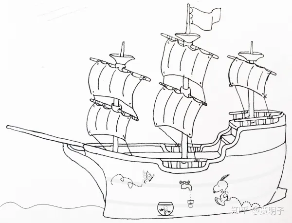
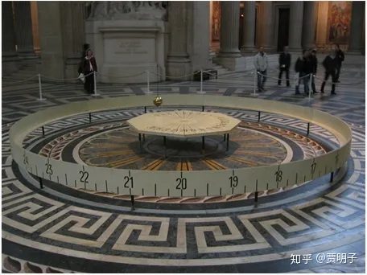

# 11、时空是绝对的还是相对的？关于大船和水桶

更新说明：原文后半部分限于篇幅说得语焉不详，因而删除，另开章节。

> ***“The original question, "relative to what frame of reference do the laws of motion hold?" is revealed to be wrongly posed. For the laws of motion essentially determine a class of reference frames, and (in principle) a procedure for constructing them.”\***
> ***“运动定律究竟相对于哪一个参考系才成立这个问题是一个伪问题。因为实质上是定律本身自己确定了一组参照系以及创建这些参照系的方法。”\***
> ***- Robert DiSalle\***

下面我们来看一看我们对时间和空间的看法：**时空观**。

这是一个比前面讨论的一系列问题都更加令人迷惑的问题，因为时间和空间的概念，它们如此深入地根植于我们的意识之中，以至于我们难以对它进行一个有意义的描述。我们总是下意识地把它们当做一种完全自明的东西 – 它无需、也无法被继续问是什么和为什么。

我们不妨先从一种具体的、直观的角度来想这件事。我们说，空间表示的是一种事物之间的位置关系，例如，“粲粲家距离爷爷家500公里”，说的是两家在**空间中的间隔**；而时间，则是事物先后顺序关系的一种度量，例如“看到闪电2秒钟后听到雷声”，这是一种事件发生的先后顺序的关系，是两个事件在**时间上的间隔**。

那么，空间和时间是否**仅仅是**具体事物位置和先后顺序的一种关系呢？我问你，一个纯粹的“空间”，它与其中的具体事物无关，而仅仅是物体的一种“容器”，这种空间存不存在？一个纯粹的“时间”，它与发生在其中的具体事件先后顺序无关，而仅仅是事件排列在其中的一个永不停歇的“流动”，这样的时间存不存在？

就是这样一种抽象的时间和空间，是什么意思？

你可能想，“空间”就是这样一种“容器”，它把一切物理世界中的事物都容纳在其中了，并且给了这些事物之间相互位置关系的一种标尺。这个回答很直观并且自然，但是并不能给我们解惑。“容器”本身是一种具体的事物，然而空间，在任何一种意义上都算不上是具体事物。你可以想象一个内部不存在任何事物的容器，但是你可以想象一个不存在任何事物的“空间”吗？容器的外壳本身就可以提供一种空间定位的基准，但是空无一物的“空间”中我们如何定位？无法定位的空间又有何意义？一个纯粹的空间，空无一物的绝对“空”的空间本身是难以名状的。如果存在这种空间，那么空间又存身何处？空间本身存身于空间中吗？如果说空间本身是一种抽象的存在，那么我们日常所熟知的、存身于空间之中的具体物体，说到底也只能是存身于抽象空间中的抽象事物了。如果说空间不存在，它只是我们的一种幻觉，这实在是有些令人难以想象：没有空间，那么我们又存身**何处**？

与空间相比，时间的概念更加难以捉摸。没有任何事件发生时，时间还有没有意义？时间仅仅是我们的心理感受，还是一种物理实在？

时间和空间之间有着很多的相似之处，例如它们都可以为事物变化提供一种度量：空间是位置的度量，时间是变化快慢的度量。时间和空间都是一个连续体，它们有着相似的数学结构，可以通过前文提到的“一一映射”的方式建立联系。例如时间中的每一个时刻都可以与钟表盘中的一个位置建立联系。但是它们又有着明显的不同。空间是**多维度**的，我们熟悉的三维空间有着前后、左右、上下三个方向，而时间则是**单维度**的，它只有先后一个方向；在空间的任何一个维度中都是**无方向**的，或曰各向同性的，我们都可以向前向后任意移动，而在时间维度中则是**有方向**的，我们只能由历史扑向未来而绝无可能回到历史，这又被称作“**时间之箭**”；空间是被“填充”的，有这样的一类具体事物，它们不能同时填充在空间中的同一点，而时间则不然，任意两个事物同时发生在同一时刻毫无问题。

前面我们曾经提到过，在形而上学中，时空观是基本的核心问题之一。自古以来一直有人试图对此作出探讨，但是由于它自身的难度，早期的哲学家们对时空的看法相对比较混乱，并且难成体系。现在看起来，它们中间谬误甚多，但是我们还是可以简单了解一下古人的智慧。例如说亚里士多德。

亚里士多德并没有一个很系统的对空间的理论，相对而言，他谈论的更多的是所谓的**“位置（place）”**。一方面他认为，一个事物的位置就是这个事物表面环绕起来所容纳的那一部分，类似于容器；而另一方面，他认为世间一切事物都有一个**“自然位置”** – 这个事物总是倾向于向着它的自然位置移动，例如火焰或空气总是向上，而重物总是向下，因而绝对的上和下就由此而定义出来了。关于空间，亚里士多德认为宇宙是一个有限的圆球，在其中地球处于正中心。加上前面所说的绝对的上和下，在亚里士多德心目中，空间是一个**绝对的、有着特殊位置和绝对方向的、连续的**这么一个东西。然而他另一方面认为空间本身不是独立存在的，自然界中没有一个不存在实体的“空”。著名的论断“自然害怕真空”即由此产生。这个论断历经2000多年，到现在仍然是一个有趣的话题，最早期人们确实无法制造真空，但是后来在人们研究大气压的过程中发现，真空是可以被制造出来的，然而现代物理学，尤其是量子场论之后，人们却又发现，所谓的“真空”其实包含了丰富的物理内容，完全一无所有的“真空”恐怕是不存在的。

而对于时间，亚里士多德的看法更加不成体系。他似乎倾向于认为**时间只是一种幻觉**：过去不复存在，未来尚未存在，而现在呢？现在不应该是时间的一部分，因为只是一个点，而时间是一个连续的东西，一个连续的东西如何可能被分割为一个个的点呢？[[1\]](https://zhuanlan.zhihu.com/p/48053634#ref_1)既然过去未来不存在，而现在又不是时间的一部分，那么时间如何可能存在？正如奥古斯丁曾经说：

> ***“何为时间？当无人问我时，我知道它；当我试图向人解释时，我却一无所知。然而我却信心十足：如果没有什么流逝而去，那么就不会有过去，如果没有什么在前路可期，那么久没有将来，如果什么都没有，那么久没有现在。”\***

从某种角度上讲，亚里士多德的空间是一个**绝对空间**，是一个有着确定的中心、确定的方向的，固定不变的“坐标系”， - 虽然他自己并没有明确这么说。

而笛卡尔则代表了另外一种关于空间的看法。在笛卡尔看来，**空间即是物质的广延**，也就是说物质的形状和大小。物质的运动，并非从一个空间变换至另一个空间，而物质的形状本身就是空间本身。笛卡尔对整个空间的看法类似于一片无尽的海洋，无处不被海水（实体）所填充。这些实体本身就是空间，而不存在实体之外的空间，甚或说空间本身就是一个幻觉。这种看法也有其直观性，但是它面临的一个问题就是，既然物质本身即空间，而不存在独立于物质之外的、作为物质运动参照标尺的空间，那么运动的物体其空间位置并不发生变化 – 因而也就不存在运动！

对此笛卡尔的答案是，运动是相对的，一个物体的运动，是它的空间相对于某个参照物的空间之间的变化。当然，笛卡尔也承认有某种运动比其它运动更加有优越性，也就是物体相对于直接“包裹着”自身的物体的空间的运动，笛卡尔把后者称为“真实运动”，而前者称为“相对运动”。但是说到底所谓的真实运动也是一种相对运动。

笛卡尔对相对运动的描述是有着很重要的历史作用的，一般说，我们可以在空间中任意取一点作为原点，然后在任意三个（线性无关的）方向建立三个维度，那么任何一个物体都可以表示为相对于原点的**相对位置**。比如说，任何一点都可以表示为三维笛卡尔坐标系中的一组坐标值。这个原点可以是静止的，也可以是运动的。那么，某个物体的相对位置就是一个有着任意性的概念，它取决于我们选取的坐标系。在一个坐标系看来，它是静止的，但在另一个坐标系看来它则可能是运动的。不同的坐标系看到的物体运动方式不同，但是它们可以以数学变换的方式建立起联系。这对后来的物理学发展作用重大。

时间延续到18世纪，另外一种时空观出现了，就是康德的时空观。康德认为，时间和空间是人们认知的先天基本形式。也就是说，时空是人们思考和认识外界事物的、生而具有的基本框架，是人类思维的方式。人类自身的性质决定了人们只能在空间中、在时间的长河里认识事物 - 拿现代的科学语言说，时空是人类思维的底层算法。

我们可以看到，康德的时空观并不讨论时空的“本质” – 它是否存在？它究竟是什么？它的性质如何？等等。相反地，康德主义是从认识论的角度来讨论时空的，时空观是人类认识事物的基础，人们只能借助时空的观念来认识世界，那么自然而然地，人类就不能认识时空本身。

然而对于自然科学来讲，时空观却是至关重要的基础：自然科学描述的是事物的运动和变化，而事物的运动和变化本身，必然涉及到**一定时间**内事物**在空间中的位置**变化。为了描述位置，就必然要对空间做出描述；为了描述速度，就必然要对时间做出描述。因而在自然科学中，对时空性质的探讨是极其深刻的而又极其具体的，远远超出了其哲学意涵。

从自然科学角度上，第一个对时空观作出明确回答的人，应该说是牛顿。牛顿基本上沿袭了亚里士多德的绝对空间的概念 – 当然，随着当时天文学的进展，牛顿肯定不会认为空间是一个有着绝对中心和绝对方向的东西，但是他认为存在着这样一种抽象的绝对空间，是一切运动的参照物。这样一个唯一的、绝对的空间，它是一切运动的最终度量准则，是终极的坐标系。相对于这种**绝对空间**的运动，就是**绝对运动**，而相对于其他任意选取的坐标系的运动，则是**相对运动**，牛顿的运动定律描述的是前者。

> ***“绝对空间，就其本性来说，与一切外物无关，总是保持一成不变和静止”\***

> ***“绝对运动是物体从一个绝对位置变到另一个绝对位置，相对运动是从一个相对位置变到另一个相对位置”\***

而对时间，牛顿认为存在着一个普适的、任何人都认同的世界标度。这种时间的流逝速度永远均匀，并且对一切外物毫无二致。在这种绝对时间中，你的十二点就是我的十二点，也是所有人的十二点。当然，对时间的具体单位和数值是可以不同的，但是它们对应的时刻却是全宇宙唯一的。

> ***“绝对的，真实的，数学的时间，自身的特性决定了它均匀地流逝，与一切外物无关”\***

为了能够对运动做出定量描述，作为整个理论体系的基石，时空观是必须明确严格的。牛顿的时空观又被称作“**绝对时空观**”，直观来说，空间是事件发生的“舞台”，是事件的容身之所，它是独立的、绝对的存在；时间是事件发生时浸泡其中的永不停止的长河，它为事件的先后、快慢提供标尺，却不受事件的影响。**绝对空间就为事物的位置提供了度量**：一个物体相对于绝对空间的位置，就是其绝对位置；相应地，**绝对时间就为事件发生的时刻提供了度量**，一个事件发生的时刻总是一个确定的、绝对的时刻。就是在这种绝对的时间和空间的基础上，牛顿把运动分为了绝对运动和相对运动。牛顿认为，只有绝对运动才是真实的运动，而其他的我们观测到的相对运动只不过是绝对运动的一种表象。相对于一个相对空间（参考系）静止的物体并不一定是“真实”的静止，而相对于该空间运动的物体也并非“真实”的运动。而物理定律所描述的就是这种“真实”的物理量，而不是相对的物理量。他写道：

> ***“因此相对量并非真实的量本身，而仅仅是对它们的一种可感知的度量，……那些把相对量诠释为真实量的人，他们玷污了纯正的物理文字。而那些把了真实量混淆为模糊不清的度量的人，他们也在破坏数学的纯洁性和哲学真理。”\***

牛顿很明确地指出了“真实”运动与相对运动可能遵循的不同的规律：

> ***“如果没有受到力的作用，真实运动不会产生改变，但是即使完全不受力，相对运动也可以产生改变，……同理，如果受到力的作用，真实运动总是发生改变，而相对运动就不必因此产生变化。”\***

也就是说，牛顿定律只能保证对绝对运动的正确描述，而对于相对运动却未必有效。比如说，我们在公交车上面，车辆突然的急刹车导致乘客向前跌倒。在车辆参考系看来，乘客在毫无外力影响下就发生了运动的变化，显然是不符合惯性定律的。因而在应用牛顿力学时，我们必须要意识到我们描述的是绝对运动。

既然牛顿把他的定律所描述的对象限制为绝对运动。而对于某个任意参考系，这些定律就未必成立。那么，牛顿定律的适用范围是不是仅仅局限在“绝对参考系”中呢？答案是：否。我们可以回忆牛顿第一定律的内容，在第一定律中，物体的“静止”和“匀速直线运动”两者是完全等效且不可区分的。也就是说，对绝对运动成立的定律，相对于那些匀速直线运动的参考系仍然会成立。

这里我们就需要提起著名的**伽利略相对性原理**。该原理说，**在两个相对匀速运动的参考系之间，物理规律总是保持完全相同**。我们没有任何办法通过力学实验区分这两个参考系哪个在运动哪个是静止的。

伽利略举了一个很形象的例子来说明这个原理。在这个例子是一条封闭的大船，这条大船在海上匀速运动着。而船里的人们被关在船舱中，无法看到外界的环境。那么船员们该如何判断来判断船到底是在匀速运动还是静止呢？答案是，他们没有任何办法。伽利略（借助一个叫做萨尔维阿蒂（Salviati）的虚拟人物之口）说：

> *“把你和一些朋友关在一条大船甲板下的主舱里，让你们带着几只苍蝇、蝴蝶和其他小飞虫，舱内放一只大水碗，其中有几条鱼。然后，挂上一个水瓶，让水一滴一滴地滴到下面的一个宽口罐里。船停着不动时，你留神观察，小虫都以等速向舱内各方向飞行，鱼向各个方向随便游动，水滴滴进下面的罐中，你把任何东西扔给你的朋友时，只要距离相等，向这一方向不必比另一方向用更多的力。你双脚齐跳，无论向哪个方向跳过的距离都相等。当你仔细地观察这些事情之后，再使船以任何速度前进，只要运动是匀速，也不忽左忽右地摆动，你将发现。所有上述现象丝毫没有变化。你也无法从其中任何一个现象来确定，船是在运动还是停着不动。即使船运动得相当快，在跳跃时，你将和以前一样，在船底板上跳过相同的距离，你跳向船尾也不会比跳向船头来得远。虽然你跳到空中时，脚下的船底板向着你跳的相反方向移动。你把不论什么东西扔给你的同伴时，不论他是在船头还是在船尾，只要你自己站在对面，你也并不需要用更多的力。水滴将象先前一样，滴进下面的罐子，一滴也不会滴向船尾。虽然水滴在空中时，船已行驶了许多柞。鱼在水中游向水碗前部所用的力并不比游向水碗后部来得大；它们一样悠闲地游向放在水碗边缘任何地方的食饵。最后，蝴蝶和苍蝇继续随便地到处飞行。它们也决不会向船尾集中，并不因为它们可能长时间留在空中，脱离开了船的运动，为赶上船的运动而显出累的样子。”*

这个例子非常形象直观，你可能没有机会坐一坐这样的大船，但是你做过很多次高铁、飞机、乃至汽车，在这些交通工具匀速运动的时候，你就很能体会到这一点：身在交通工具其中的你感觉就像静止状态一模一样。

如果牛顿定律对绝对空间而言是成立的，那么由相对性原理我们可知，在任何相对于绝对空间做匀速直线运动的参考系中，牛顿定律都是成立的。这样一来，我们就获得了**一整组参考系**，在其中牛顿定律都是成立的。

牛顿非常明确地指出了他的定律的适用范围：静止的或做匀速直线运动的（相对于绝对空间）参考系。在他的《原理》一书中“运动公理与定理”一章中推论5中写道：

> ***“在一个给定空间中的运动总是保持不变的，不论这个空间是静止还是在做没有旋转的匀速直线运动”\***

绝对时空观受到了来自牛顿的宿敌莱布尼兹的激烈攻击。在莱布尼兹看来，这种脱离了外物的、却严格定义外物运动的绝对时空是彻彻底底的空谈。空间只能是一种具体事物的**相对位置关系**，而不是脱离具体事物的独立存在。当没有了物体，也就没有了空间。例如英文A到Z的26个字母，形成了一种先后的队列关系，它们就构成了字母表的空间结构。但是当我们把字母全部拿掉之后，字母表本身也就不存在了。空间是具体事物的位置关系，那么相对应地，时间也就是具体事件的次序关系。因而，时间和空间都是依赖于具体的事物和时间的：没有事物就不存在空间，没有事件就不存在时间，它们是相对的而不是绝对的。

应该说，莱布尼兹的时空观和笛卡尔相对更加接近一些。这里其实有一种很有趣的现象，作为欧洲大陆理性主义死硬分子的笛卡尔和莱布尼兹各自坚持时间和空间的具体性和相对性，而作为英国经验主义代表之一的牛顿却坚持一个有着浓厚形而上学色彩的绝对时空，这让人不禁怀疑他们是否拿错了剧本。

牛顿当然不会抛弃他理论中最核心的东西，他决定用一种可实证的方式来回击对绝对空间的质疑。他找到了一个粉碎对方质疑的利器：一个水桶。

比如说，现在牛顿被关在一个封闭的房间里，房间绝无门窗，因而他无法看到房间外部是什么样子，他也与外界隔绝，没有人会通过喊话或者电话的方式告诉他房间外有什么。总之，他对房外一无所知。

这时通过观察他知道他正在相对于整个房间做自转运动，那么他面临着一个问题：究竟是他自己在做旋转运动而房间是静止的，还是说他是静止的而整个房间在围绕他做旋转运动？

如果说，存在着一个绝对空间，那么，究竟是谁在做转动，这是一个有明确答案的问题，那么原则上牛顿必须能够通过某种手段做出这个判断。如果说它没有任何手段区分这两种运动，那么他将不得不下结论说，只有相对运动，而不存在一个“真实的”绝对运动。

牛顿可以观察房间内的一切，但是仅仅是通过观察他自己和房间的运动关系他当然无法对前面的诘问做出判断。但是，“哈哈，你们没有想到吧？”牛顿说，“我有一个水桶”。

牛顿把水桶中盛满水，放在自己身边与自己保持相对静止。如果说整个房间是静止的，而牛顿和他的水桶正在旋转，那么必然他就可以观察到水桶中的水面被甩向桶的边沿，而呈现出一个抛物面的样子。而反之，如果他们静止而仅仅是房间在旋转，那么水桶的水平面必然不会发生任何变化，它依然是一个平面。这样一来，牛顿就可以对这个诘问做出明确的回复：看，水平面下凹了，因而必然是我们在做旋转运动！或者说，看，水面是平的，因此转动的是整个房间！总而言之，水桶就给出了一个可以实证的、对绝对空间判断的标准。

事实上，我们再来看牛顿第一定律，我们就立刻可以意识到，牛顿第一定律中，就有着强烈的暗示，暗示绝对空间的存在：

> ***“任何物体都要保持匀速直线运动或静止状态，直到外力迫使它改变运动状态为止。”\***

保持匀速直线运动或者静止，我们会问，相对于谁？在我们谈论牛顿第一定律之前，我们必须要能够对静止和匀速直线运动做出一个**定义**，这个定义并不简单，因为我们日常对速度的测量总是相对的：以100迈行驶在道路上的汽车，它的速度是多少？这个需要看相对于谁，相对于地球表面是100迈，但是相对于太阳系呢？就必须要附加上地球的公转速度和自转速度，它就不是100迈，它甚至不再是匀速直线运动，它的速度总在变化。如果我们不指明参照物，就无从谈论速度，当然就无从谈论静止和匀速直线运动。

因而，牛顿第一定律所说的前提，就是绝对空间的存在。所有的运动都是在谈论绝对运动。

在前面水桶实验中，如果水面是平的，它受力为零，并且保持水平面静止，那么它满足牛顿第一定律，因而它是绝对静止的。而如果水平面是凹陷的，那么水面的边缘部分受力就不为零，然而此时它的水面仍然静止，就说明受力不为零的水面仍然保持静止，牛顿第一定律就被违反了，因而这种运动必然不是绝对运动 - 因为绝对运动不会违背牛一。

水桶实验确实相当巧妙，它成功地使很多质疑者闭上了嘴巴。它其实是利用了相互之间**相对非匀速运动**的两个参考系之间的**物理规律不对等**，成功地找到了可实证的、判断相对于绝对空间匀速运动和非匀速运动的不同空间的实验依据。

但是，即使如此，牛顿的绝对时空仍然面临着一种尴尬：就像萨尔维阿蒂大船一样，我们没有任何办法区分无数多个（相对于绝对空间）匀速运动的空间，那么其中哪一个才代表了“绝对空间”呢？它们在物理定律上完全平权，是否意味一个特定的绝对空间是不存在的呢？那么，牛顿的**唯一**的绝对空间可能至少需要被**一组**互相呈匀速直线运动的空间所取代。

物理学家们为了避免这个尴尬，提出了**惯性参考系**或曰**惯性系**的概念。1885年，时隔《原理》一书200年后，Ludwig Lange为了把“绝对空间”这个概念剔除出去，给出一个具有操作性的概念，把牛顿定律成立的这一组参考系重新定义为“惯性系”：

> ***“惯性系是这样一组参考系，相对于它的三个自由粒子，从同一点向三个不共面的方向抛出后，全部都沿直线行进并且相互之间的距离成正比变化。惯性定律于是断言相对于任意惯性系，任意第四个粒子也以同样的方式运动”\***

在这种表述下，牛顿定律已经不需要“绝对空间”这样的东西来支撑了，靠着完全可实证的基础即可定义惯性系。然后对所有的惯性系我们都可以放心地应用牛顿定律。而DiSalle则干脆说道：

> ***“运动定律究竟相对于哪一个参考系才成立这个问题是一个伪问题。因为实质上是定律本身自己确定了一组参照系以及创建这些参照系的方法”\***

此话怎讲？在这里**“哪一个空间是惯性系（或绝对空间）”**这个问题，实际上就变成了**“我们的定律如何定义一个（绝对）空间使自己在其中能够成立”**这样一个问题了。事实上，牛一所描述的并不必是绝对运动在受力为零下的表现，我们完全可以抛开绝对运动，那么牛一事实上在说，**存在一种参考系，**在这个参考系下受力为零的物体保持静止或匀速直线运动，那么这种参考系我们称之为惯性系。而牛顿力学的一切讨论，都是在惯性系下成立的。从这个角度上讲，牛顿第一定律其实不是一个定律，而是一个参考系的定义了。牛顿第一定律的涵义也远远超出了“第二定律的特例”这一点，它其实是为牛顿定律划了一个使用范围。所以把它称作“第一”当之无愧，因为别的定律都要小心翼翼地行走于它划下的地盘之中！

这样一来，牛一就从**对绝对空间的定义**变成了**对惯性系的定义**。

但是不管怎样，我们称之为绝对空间也好，称之为惯性系也好，牛顿定律和伽利略相对性原理，确确实实地指出了**某一类特定空间的特殊性**。牛顿认为这一大类特定空间中有一个作为“零”的基准，叫做绝对空间，而后来人们则认为所有这些空间都是等价的，叫做惯性系。从这个意义上，是把绝对空间的概念推广了而不是推翻了。

那么，有这样一个问题，既然牛顿定律仅对惯性系成立，那么我们有何依据对我们地球上的物体不加分辨地使用它？**地球是一个惯性系吗**？牛顿在提出他的定律的时候曾经指出，恒星可以看做是对绝对空间的近似。事实上他直接把太阳看做一个惯性系。以太阳系作为参考系直接应用牛顿定律可以产生精确的天文计算结果，这早就已经被大量天文观测所证实。

可是既然太阳可以看做一个一个惯性系，那么地球必然就不是。因为地球并没有相对于太阳做匀速直线运动，地球相对于太阳有自转，也有公转，既有加速度又有角速度，那么我们地球肯定不是一个惯性系了。那地球上牛顿定律岂不是不成立了？搞了半天，**牛顿在地球上总结出来的定律原来是不成立的**！

事实上，确实如此，牛顿定律在地球上并不严格成立。由于地球的非惯性系的性质，我们会体验到一些很微小、但有时候却影响很大的效应，它感觉上类似于一种额外的受力，被称作“赝力”（fictitious force）、“假想力”（Pseudo force）、或者“惯性力”（inertia force）。其中之一就是科里奥利力，它是地球上风暴形成的关键因素。

一个非常经典的例子就是傅科摆。这是一个巨大的单摆。按照牛顿定律，一个单摆在摆动过程中它的摆线总是扫过一个不变的竖直平面，例如一开始它是东西向摆动，那么它会一直保持着这种方向。但是，当一个单摆做得非常巨大，它摆动一次的周期很长，我们就会发现它的摆平面其实是在不停旋转的：从一开始的东西向会渐渐变成南北向，然后再转回东西向。这是地球自转的一个明证：摆平面其实相对于惯性系是不旋转的，旋转的是地球，因而我们地球人就以为摆平面在旋转。也就是说，傅科摆本身不转动，但是我们的东西向和南北向的“坐标”在一直转动，因而产生了傅科摆在转动的假象。这种傅科摆在全球各大博物馆均有，例如下图就是巴黎天文台中的傅科摆：

我们可以看到，其实傅科摆和牛顿水桶是同样的道理，按照牛顿的观点，它向我们展示了绝对空间的存在：按照牛顿定律，单摆的摆平面必须是一个不变的竖直平面，那么我们为何还会观察到它在旋转呢？原因很简单，牛顿定律预言的不变的摆平面永远是相对于绝对空间的，而我们观察到的摆平面却是相对于地球的。所以说，不是因为摆平面在旋转，而是因为我们的这么巨大的地球和地球上的一切在旋转。

事实上，我们地球上的一切都会有这种效应，例如当一个人从篮球场一侧向另一侧的球员传球，球在飞行的过程中并不能保持直线，由于地球自转的原因，它会发生偏转，偏转的距离大约是零点几个毫米。这个偏差我们日常感觉不到，但是它却是地球是非惯性系的明证。

牛顿的绝对时空观念从一开始就让很多人不爽，莱布尼兹只是诸多人之一。但是，如果我们采取前面提到的**奎因的“不可分割性”原理**，那么我们必然要承认：**如果我们接受牛顿力学，那么我们必须要接受绝对空间这一观点。**事实上，牛顿力学的巨大成功，的的确确折服了绝大多数物理学家，因而牛顿的绝对时空观一度占据了主流。

直到200多年后马赫的出现。

自称为“相对论者”（注意，这是哲学意义上的相对论，并非爱因斯坦的那个。马赫以相对论者自居的时候爱因斯坦恐怕还没出世呢）的马赫坚信，宇宙中的所有参考系都应该是平等的。他在他著名的《the Science of Mechanics》中对牛顿的水桶实验进行了批判。他认为，水桶实验能够证明的仅仅是水桶**相对于整个宇宙中的天体**在转动，而不是**绝对**转动。

比如说，如果把马赫放入一个不存在任何物体的空间中去，周围没有任何参照物，那么他能不能判断自己是在运动与否吗？这是一个令人毛骨悚然的思想实验：独自一人在完全黑暗之中，外界传来的五感都完全失去了，那么我们如何判断自己是不是在运动？牛顿的说法中，如果此时自己能够感觉到四周有一种离心力把自己的胳膊向外拉扯，那么以此为据就可以知道自己正在旋转。但是马赫对此不同意，他认为如果没有了外界一切，也就没有了运动的参照，也就没有了运动本身。这时候即使自己在快速旋转，仍然不会有任何离心力的感觉。

也就是说，马赫认为，下面两种情况：

1、宇宙天体静止而水桶转动；

2、水桶静止而整个宇宙转动。

这两者是完全无法区分的，因而其运动的一切效果都是完全一样的，水桶的水面都会产生凹陷。

那么问题就来了。按照牛顿的说法，水桶在旋转的时候水面发生凹陷，这纯粹是惯性的原因：是外沿的水因为惯性而被向外甩出去（离心力）造成的。但是在马赫这儿，水桶即使不动，宇宙天体旋转也会造成同样的效果，也就是说，在这种情况下，水面并没有因为惯性而产生的离心力，那么，这种凹陷来自何方？马赫说，是宇宙万物的运动造成的，惯性是宇宙万物与水相互作用的表象。这就强烈地暗示，宇宙万物与水的相互作用才是惯性的起源，惯性并非如牛顿所言是物体本身的固有性质，而是宇宙万物与物体相互作用的综合结果。马赫说：

> ***“你站在旷野之中仰望星空。你的胳膊安静地垂在身侧，这时你看到众星静谧。现在你开始旋转，你看到整个星空也反向旋转，你的胳膊也因此甩开。为何你的胳膊在众星旋转的时候甩开，为何众星不动时它安静地落下来呢？”\***

马赫接着说，应该存在某种物理定律，它把远处的星体与你自身的惯性系联系在一起。他提出，整个星空的旋转影响了你使你感觉到了离心力。也就是说，你的惯性不是你自己的性质，而是你与众星之间的相互作用赋予了你惯性这个性质。 这种相互作用，最自然的猜想就是万有引力。因而，**惯性实际上是引力作用的结果**。

马赫的思想与牛顿是有本质区别的。按照牛顿的说法，地球表面上的物体必然感觉到非惯性系效应，傅科摆的摆平面必然旋转，这仅仅是因为地球的自转，与外物毫无关系。而马赫则认为，傅科摆现象是宇宙万物与摆的相互作用结果，它是因为宇宙万物在相对于地球旋转，而不是因为地球在绝对自转。如果把我们周围的星体一个个都移动到无穷远处，牛顿认为我们依然可以通过傅科摆判断地球是否在自转，而马赫就不然，他认为傅科摆这时就会驯服下来变成一部规规矩矩的单摆。我们也就没有任何办法判断地球自转与否。

马赫这种“不存在一个特殊的参考系”、“惯性来源与周围万物的引力作用”的哲学思想，一个人产生了重大影响，并且直接造成了人类思想史上可谓最为璀璨的灵感火花的产生。这个人，就是爱因斯坦，这个灵感火花，就是等效原理。就像是牛顿的水桶一样，爱因斯坦也有着他自己的大杀器：一部电梯。

**下一章：[贾明子：12.1、四维时空](https://zhuanlan.zhihu.com/p/49434398)**

**上一章：[贾明子：10、客观宇宙的唯一可能是数学？](https://zhuanlan.zhihu.com/p/47464032)**

**专栏传送门：[何为现实？拉普拉斯之妖与薛定谔猫之决战](https://zhuanlan.zhihu.com/c_186387023)**

------

## 参考

1. [^](https://zhuanlan.zhihu.com/p/48053634#ref_1_0)这一点，似乎和芝诺悖论中的“飞矢不动”有着异曲同工之妙。

编辑于 2020-07-23 10:29

