# 12.1、四维时空

> **“space by itself, and time by itself, are doomed to fade away into mere shadows, and only a kind of union of the two will preserve an independent reality.”**
> **“空间自身，以及时间自身，注定要消失于阴影当中。只有它们的整体才能保留独立的实在性。”**
> **- 闵可夫斯基**

爱因斯坦对时空观的影响是革命性的，可以说是近代物理学中最伟大的发现。他的理论的最初起源，来自于**电磁波**。

电磁理论是经典物理学的第二个高峰，它研究物体的电磁现象，起于安培、法拉第等人的工作，最终成于麦克斯韦。麦克斯韦方程组可以说是物理学中最经典的理论之一，优美简洁，而且对几乎一切电磁现象都预言精准。在经典的电磁理论中，主要的研究对象就是电场和磁场，以及电磁场之间的相互变化。麦克斯韦方程组的四个方程所表达的，用最简单的话来描述，就是这样的：

**第一个方程，描述了电场的性质，以及电场与电荷的关系；**

**第二个方程，描述了磁场的性质，以及不存在类似电荷的“磁荷”；**

**第三方程，描述了变化的电场产生磁场；**

**第四个方程，描述了变化的磁场产生电场。**

**电磁相互作用，是在我们日常经验中占有压倒性地位的一种作用力，人们经历的绝大多数物理现象，都可算是一种电磁现象。**我们日常所经历的各种各样的相互作用诸如压力、弹力、摩擦力、拉力等等，总而言之一切不属于万有引力的力都是电磁作用力。一切化学现象诸如燃烧、酸碱平衡、氧化、腐蚀等等进而一切生物现象包括各种生化反应、新陈代谢、神经传导、遗传变异，在本质上都是电磁现象。这一点，在人类几千年漫长文明史中，仅仅是最近一两百年来才认识到。这是因为，存在着正负两种电荷，而且电荷之间的相互作用力如此强大，以至于所有的正电荷最终都要找到等量的负电荷结合在一起，最终在宏观上相互抵消，以至于我们无法直接感知。早在1500年前，人们从摩擦起电中知道了电，1000年前，人们从地磁场和磁铁现象中知道了磁，但是直到200年，人们才真正开始了电磁现象的认知。从这个意义上说，经典电磁理论开辟了人类认识的全新领域。

而所有的发现中，场论，恐怕是电磁理论为我们人类智慧所带来的的最大贡献。从最早法拉第提出的“力线”、到麦克斯韦的以太理论，都在试图描述电磁相互作用的一种传播机制：它是如何在两个电磁物体之间从空间中传递过去的？我们现代的看法已经很明确了：就是电磁场。电磁场遍布空间，并且我们对其扰动，就像是在水面上投掷小石头那样，激发起片片涟漪，一直荡漾到无穷远出。从这个理念出发，电磁理论取得了它最为经典的成就：它成功预言了电磁波的存在，并且计算出电磁波的传播速度，进而断定光就是一种电磁波。它计算的光速达到了一种骇人听闻的精准。

但是，电磁定律有一个很有意思的问题：**它没有指明自己对何种参考系成立，而且也不满足伽利略的相对性原理。**

在牛顿力学中，任何一个惯性参考系观察到的物理定律都完全符合牛顿定律，但是电磁理论不同。如果它对一个参考系成立，在另一个与之相对匀速运动的参考系看来，整个电磁理论就完全失效了。例如说，你们已经学过，电流会在周围产生磁场。而电流，则是电荷的定向移动的宏观体现。电流所产生的磁场，是大量的微观电荷运动产生的磁场的宏观效应。的确，电磁理论告诉我们，一个匀速运动的带电球会在周边产生磁场（如下图所示）。因而我们可以推断，当电荷经过小磁针附近的时候，会引起小磁针的偏转。但是，在一个相对于该电荷静止的人看来，电荷并不运动，而是小磁针运动经过电荷，那么小磁针就不会经历磁场，因而也就不会发生偏转！在这个人的视角看来，带电球静止，而小磁针在运动：

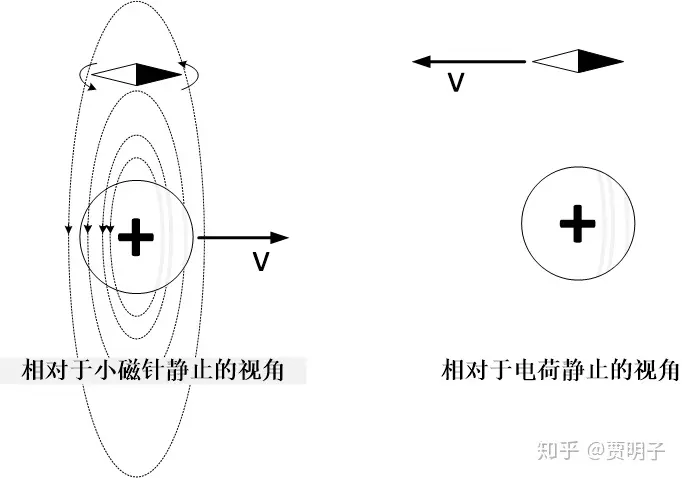

这两个人的观察显然互相冲突，那么到底谁观察得到的现象会出现？小磁针会不会发生偏转？他们如果同时应用电磁理论做出判断，到底谁的判断是正确的？也就是说，电磁理论究竟是对何种参照物成立的呢？

从伽利略相对性原理看来，电磁理论对不同的惯性系而言，所做出的理论预言互相冲突。具体到它对光速的预测上面，电磁理论虽然成功地预言了光速，但是并没有说这个速度是**相对于何种参照物**！它只是计算出光速应该是这样一个数值，但是，这个速度是相对于谁的呢？

在牛顿力学里面，如果我们预测一个物体的速度，我们必须要指定一个这个速度的参考系。如果我们在100m/s速度行驶的火车上，以10m/s的相对速度抛出一个篮球，那么相对于火车它是10m/s，相对于地面则是110m/s。我们能指出一个速度而不指定参考物！

**电磁理论和伽利略相对性原理，必须有一个是错误的。**

一般的机械波的波动理论表明，一列波的传播速度**与波源无关**，而是**相对于它的传播介质的**。例如说我们说声音在空气中的传播速度是340m/s，这个速度就是相对于空气而言的，而不是相对于声源的。在一个相对于空气运动的观察者看来，声速就不是这个数值：它需要叠加上观察者相对空气的速度。如果按照这种说法自然而然地加以推广，那么电磁波的速度应该是相对于它的传播介质的……

但是电磁波是电磁场的波动，而不需要什么介质！电磁场本身难以成为一个参考系，因为它没有一个确定的空间分布特征作为位置的定位基准：不同的速度看起来，电磁场是在变化的。

那电磁波的传播速度应该是相对于何物呢？这真是个难题。

早期的人们并不理解一个不需要介质传播的波，当时人们的想法是，电磁波的传播介质是一种布满整个空间的特殊物质，它无处不在、看不见摸不着、并且在电磁场的激发下振动，被称作“以太”。那么电磁定律断言的、没有指定任何参考系的行为，就是相对于以太的行为。也就是说，电磁理论是在以太参考系下成立的理论。由此人们自然而然地想到，这种无处不在的以太，就是绝对空间。那么人们可以通过电磁实验来验证绝对空间的存在。这个思路是这样的，，我们以不同的速度对光速进行测量，那么我们测量的光速应该是有所不同的：比如说，我们一个实验是静止状态做的，而另一个实验以光速的一半，0.5C，来做，那么两次实验的结果得到的光速就会相差0.5C。然后我们用麦克斯韦方程计算出光速，实测光速与计算光速相一致的时候，说明我们的实验时的速度与以太相对静止。

然而实验结果打碎了无数人的眼镜。这个实验就是迈克尔逊-莫雷实验，在此我略过细节。总而言之，无论我们以何种速度、如何做这个实验，我们得到的光速总是相同的。也就是说，这个实验无法检测到任何以太存在的证据！要么，以太总是在跟随者我们一起运动（这如何可能？！），要么，没有以太，而光本身就是这么奇怪。[[1\]](https://zhuanlan.zhihu.com/p/49434398#ref_1)

光速不变，意味着伽利略相对性的失效，也就意味着牛顿的绝对时间、绝对空间的颠覆。

1905年，名不见经传的爱因斯坦发表了一篇论文，在论文里他简单粗暴地把光速不变当做一个基本前提提出来[[2\]](https://zhuanlan.zhihu.com/p/49434398#ref_2)：没错，光本身就是这么奇怪。它的传播速度在所有的观察者看来都是一样的。如果光速是C，那么它就是**绝对**的C，与任何参考系无关。假使我们能够以0.99999C的速度与光同向前进，我们看到的光速仍然是C。这就是**光速不变原理**。

同时，爱因斯坦十分崇尚物理的简洁性和普适性，因而，他并没有抛弃相对性原理。相反地，他把伽利略的相对性原理推广了，伽利略相对性断言所有的机械运动规律在一切惯性系中保持不变，而爱因斯坦则认为，所有的物理定律，包括电磁理论，都必须在任何惯性系下都应该保持相同，这个就是爱因斯坦的**相对性原理**。

如果我们把相对性原理推广至涵盖电磁理论，那么，物理理论的不变性就必须要同时与光速不变原理相一致。相对性原理配合上光速不变原理，就和伽利略的相对性完全不同了：伽利略相对性原理是建立在绝对时空基础上的，叫做**伽利略不变性**。而爱因斯坦的相对性原理配合光速不变原理，得到的就与绝对时空观下的相对性不同，在这里物理定律的不变性叫做**洛伦兹不变性**。

从这两个原理出发，整个电磁理论的矛盾就立刻解决了。我们可以很容易证明，麦克斯韦方程天然地满足洛伦兹不变性：不做任何改动，它在**所有的惯性系下都成立。**电场和磁场本来就是一体的，它们是不同参考系观察下表现出来的相对性行为。需要作出改动的，是牛顿力学，因为在现在的相对性原理下，时间和空间已经不再是绝对的了，而是对每个观察者都不相同：

- 不存在绝对的空间度量，不同的观察者根据速度不同，看到的尺度不在相同，同一把尺子，不同的人看到的长度不同；
- 不存在绝对的时间度量，不同的观察者看到的时钟快慢不同，我的12点不必是你的12点，因为我们的时间不必相同。

这就是**狭义相对论**。

我们先从一个简单的例子来说一下，配合了光速不变之后，为何时空都变成相对的了呢？比如说，我们在北京和上海的正中点放置一个激光器，在0时刻，我们同时向北京和上海发射一束激光，然后北京和上海各有一个接收器来接受这束激光信号。比如说，我们通过光纤，向两地的两个终端个发送相同的信息，

“今天晚上吃红烧肉”。

那么，它们谁会先接收到这个信息？而谁会后接收到呢？

按照经典力学的理论，我们很容易知道，它们必须是同时的！因为光速相同，它们距离两个接收器的距离也相同。根据伽利略相对性原理，这个事件在任何人看来都是如此，不论是我们相对于地面静止，还是乘坐高速火车，甚至高速飞船，都不会有任何不同。也就是说，“同时收到信息”这个事实是在任何人看来都如此的。

但是相对论看来则会不同。

首先，在一个与地面相对静止的人看来，这个问题的答案是毋庸置疑的，因为它和经典力学没有任何变化：两个接收器必须是同时受到信息。

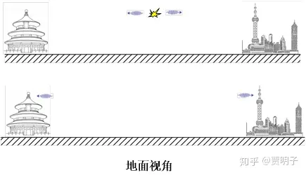

但是，我们现在考虑一辆高速火车向着北京方向行驶，在车上的乘客看来会如何呢？根据光速不变原理，乘客们看到的光信号的传播速度向着两个方向都不变（请注意在伽利略相对性原理中不会这样，乘客显然会看到光向着北京速度慢一些，而向着上海速度快一些，因为前者与我们同向行进，而后者反向行进）。而在光传播的同时，北京和上海在以同样的速度向着上海方向运动。在激光传播的过程中，北京是在“迎面”向着激光汇合，而上海则是在“背向”逃离激光。显然，激光会先到达北京，而后到达上海。

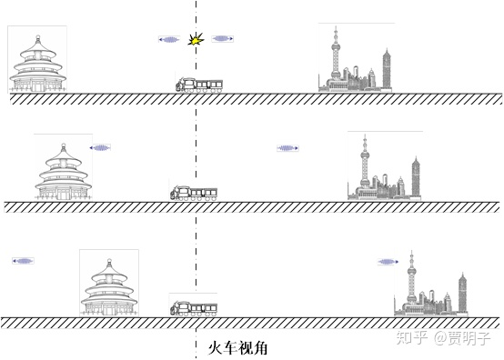

那么，“两地接收到信息”同样的两件事，在地面的人看来，是同时发生的，而在火车上的人看来，却是北京先发生而上海后发生的。为何会如此？原因就是，在相对论中，时间不是一个绝对的东西，地面上的人的时钟与乘客的时钟发生了变化。

类似地，一系列的我们常听说的“时间变慢”、“长度变短”等等看似奇怪的结论也就出来了 – 这里我就不一一列举了。**在狭义相对独立的框架下，时间变成了相对的。你的时间和我的时间并不一样，不存在一个“绝对的”大家都一致认同的时钟。你看到的同时在我看来不必同时。你的十二点也不必是我的十二点。同理空间也是相对的。不同的参考系看到的同样的空间距离不必相同。**进而就有了各种所谓的“双生子佯谬”、“车库佯谬”、“潜水艇佯谬”等等一系列看似古怪，实则逻辑上水到渠成的结论。

关于狭义相对论的科普读物可谓汗牛充栋，我这里就不再过多地涉及它的细节了。这里我想讲的，是一个更加美妙的、用几何的角度来看待它的观点。然后我们就可以知道，“相对论”这个名字实在是名不副实至极，它其实是彻彻底底的“绝对论”。

比如说，一个观察者Alice，她所观察到的任何事件，都有一个发生的位置和一个发生的时间。那么我们就可以用一组坐标（位置，时间）来表示这个事件的时空性质。所有的与她相关的事件，都可以表示为以一个时空坐标表示的时空图中的点，而这些事件的具体时空属性，就表示为时空图中的具体位置：事件的先后顺序、空间相对位置，就都表现为时空图中的位置关系 – 时空几何。如此此时，另一个观察者Bob正在以v的速度运动。那么，Bob的运动就涉及到空间的变化（它的位置在变化）和时间的变化（时间流逝）。如果说Bob以固定的速度V运动，我们可以把它在位置-时间图中表示出来：

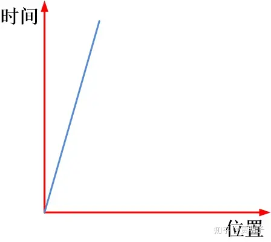

那么，这张图中的这条直线，在相对论中被称作“**世界线**”，而这张图又叫做“**时空图**”。Alice观察时空中的事件的坐标系，也就是这个红色的坐标系包括了空间坐标（位置）和时间坐标（时间）。在她看来，时间坐标和空间坐标是相互正交的，因为它们都是独立变量。那么在Alice看来，Bob的时空坐标应该是什么样子呢？

为了简便起见，我们这样来选取时间和空间的单位，使得光速为1（例如，我们选取时间单位为秒，空间单位为光秒）。那么，光的世界线就是一个45°角的直线：它与时间和空间坐标轴夹角相等。

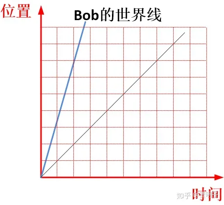

我们知道，时间坐标轴表示的是时间的流逝而不涉及位置，也就是说它就是位置不变而只有时间流逝的那条直线（也就是说，位置坐标轴垂直于时间坐标轴于原点）。那么，Bob的时间轴就必然是他的世界线 – 因为在他自己看来，自己的世界上的每一点位置都是不变的（因为自己总是相对于自己静止），只有时间在流逝。同时，根据光速不变原理，Bob看到的光速必然也是1，即光速直线平分时空坐标轴，因而，Bob的位置坐标轴就可以知道了：

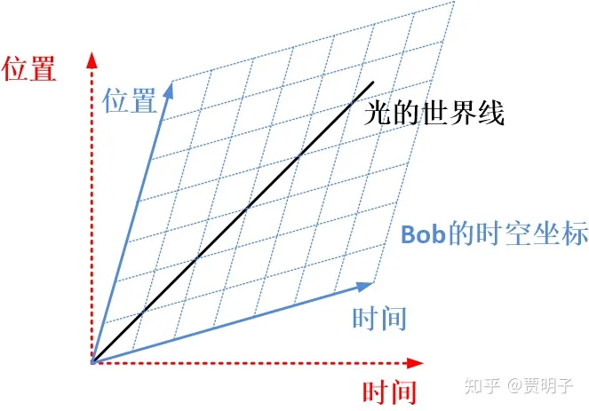

我们可以看到，在Alice看来，Bob的时空坐标，就在垂直光世界线方向上“压扁”了：这是一个变了形的时空坐标系。Alice坐标系中的每一个平直形状，在Bob的时空坐标系仍然是一个“平直的”，只不过几何性质有所变化：不同方向上的尺度不再均匀。这是一种非欧几何，叫做闵可夫斯基几何。而反过来，以Bob的视角看，他会认为自己的坐标系是各个方向均匀的，而Alice的则是在垂直光世界线的方向上被“抻长”了。

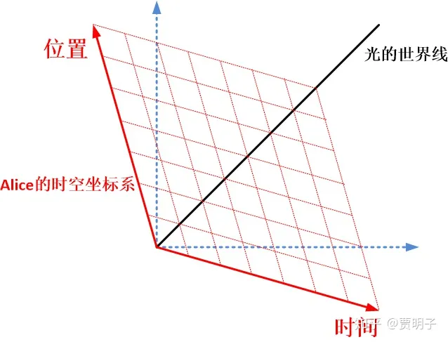

那么，从Alice的视角看Bob，她会发现Bob的观察行为相当古怪：本来时间和空间的观察都是从两个垂直的角度完成的，而Bob却偏偏地偏转一个角度来做。这样一来，在Alice看起来是同时的两个事件，由于Bob的这种偏转，就变成了不同时。而在Alice看起来空间中的同一个点，而在Bob的偏转视角下，变成了不同的点。

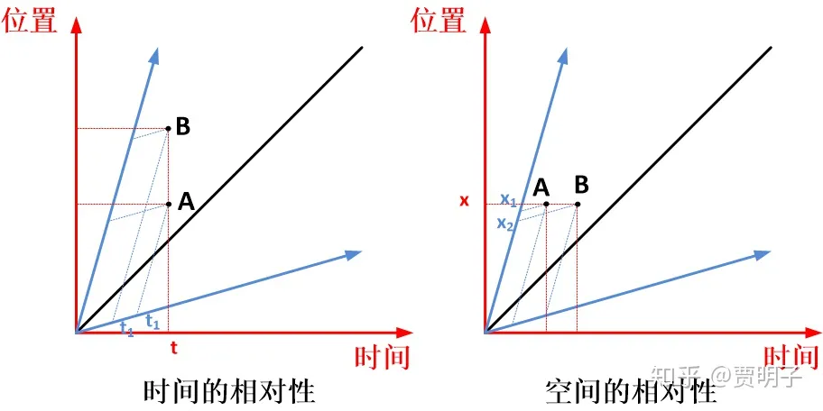

由于这两个人的时空几何的这种变形，就导致了两人的视角发生了变化。比如说，我们观察一个连续事件，一只猫做了一个跳跃的动作。

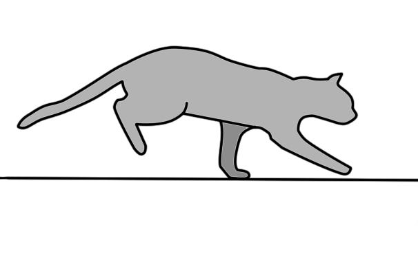

我们可以把猫的世界线画出来。事实上，我们在前面为了省事，空间都只画了一个维度，而事实上空间有三个维度，猫是个三维动物，加上时间，这个时空图应该是一个四维的奇怪形状。鉴于我们无法表示四维图形，我们可以只表示猫的一个两维平面结构，把它当做一个“纸片猫”，再加上时间，那么猫的整个奔跑过程的时空图就是一个三维图形。就好像是我们把每个时刻猫的状态都拍成照片，然后把这些照片沿着时间轴“拉开”，排列在世界线上，那么这只可怜的二维猫的时空图变成了就类似这样：

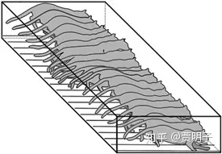

这个时空图看起来像不像是一条精心制作的有着猫形状夹心的长条面包？

在牛顿体系中，时间是绝对的，也就是说任意一个时间猫的动作都是确定的，在一个时刻观察到的猫的形态，就是把这个时刻的猫的照片抽出来，也就是相当于对这个“猫面包”在某一时刻做一个薄薄的“切片”：

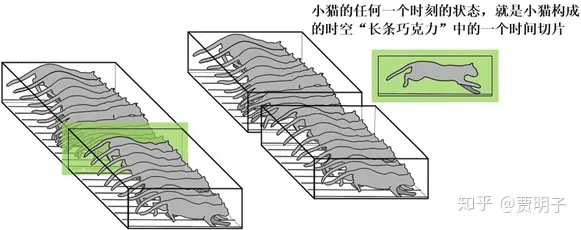

牛顿的时空观中，时间是时间，空间是空间，它们绝无相干，因而每个瞬间的观察 – 也就是每个时间切片都只能沿着一个方向进行（“垂直”时间的方向）。无论是何人，在某个绝对时刻看到的时间切片都是一样的。

但是，在相对论中就不同了，时间是相对的，空间也是相对的，不同的观察者看到的时间都是不一样的。在任何一个观察者看来，所谓的观察某个时刻猫的状态，就是在这个时刻我对猫身上所有部分**同时**做了一个拍照，得到的照片就是猫的状态。在相对论看来，由于时空的相对性，这个“同时拍照”也变得比较复杂了。在Alice看来是同时，在Bob看来却不是同时的，Alice可能觉得Bob的拍照在猫身上不同的位置不是同时拍的。因而得到的照片是这只猫在不同的时间和不同的位置的状态的混合。在前面我们看到，这就相当于现在的切片可以按照任意的方向“斜着”切 – 正如我们前面所说的，Alice看到Bob的观察视角是“偏转”的。那么根据每个观察者的速度不同，它们的观察角度倾斜程度不必相同。因而不同的观察者得到的“切片”就大相径庭。在某一个观察者 - 比如说Alice - 看来，他自己做的时间切片是严格“垂直”时间方向的，也就是说是在某一个瞬间对猫拍照的结果，得到的切片就是在这**同一个瞬间**下猫所有状态的总和。但是Alice看到的另外一个观察者 – 比如说Bob - 所做的切片就很怪异：它以一种奇怪的方式**混合了时间和空间**。具体讲，Bob的切片中，头部是一个时刻的状态，脖子是一个时刻的状态，腰部是一个时刻的状态，而尾部则是另一个时刻的状态。于是Alice就认为Bob的切片混合了猫在一段连续时刻下各个时刻的状态。而Bob则认为自己的切片才是同一时刻的状态，而Alice混合了不同时刻的状态。两人各自认为对方得到的是一种时空混合的照片。

那么，不同的观察者，他们“切片”的斜度就各不相同。因而它们对猫的观察就在不同程度上混合了时间和空间维度。然而他们各自认为自己的切片才是纯时间的，而只有别人混合了时间和空间。

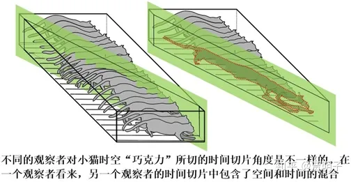

而不论我们用何种倾斜角度做这个切片，我们只是观察到的切片形状不同，然而这一条时空面包的整体却不会发生任何变化：时空的整体却是绝对的。这在数学上表现为存在着一种时空相对位置的定义，在任何观察者看来都是不变的。

我们接着来看看运动与时空几何的这件事。

狭义相对论中的时间和空间是一个混合在一起的巨大的“时空面包”，我们对一个事件的观察只不过是选取了某一个角度，对这个面包做了一个切片而已。在这里，我们其实是在一个时空的整体的角度上，把一个空间中发生的连续变化描述为一个时间+空间 – “时空” – 中的静态存在。这个理解，需要我们把我们的思路稍稍变一个角度：**运动就是时空中的几何**。此话怎讲？听我细细道来。

我们可以很直观地理解我们所熟知的空间中的几何：它就是在描述空间中不同形体的相对位置关系。我们在空间的三个维度上对这个位置关系做一个投影，它们就是在每个坐标轴上的排布序列。我们把三个维度上的序列综合在一起，就得到了它们在空间中的相对位置。如果这个时候，我们把时间维度也加入进来，那么，**一个连续运动的物体，就是一个个事件分别在空间和时间上的排布序列**。

例如我们前一章所说的猫咪跳跃的过程，猫咪的这个跳跃运动，就可以分解为在空间中的序列：身体低付再腾空，在时间上，它同时可以分解为一个时间序列（一个个事件按照时间顺序的排列）：

- 开始，猫咪站在地上；
- 在第0.1秒，猫咪开始伏地身子蓄力；
- 在0.2秒，它后腿发力，上身微微抬起；
- 在0.3秒，它前腿离地，后腿蹬直；
- 在0.4秒，它四肢腾空，身体重心上升；
- 在0.5秒，……

如此等等。

那么，空间维度上的排布序列与时间维度上的排布序列综合在一起，就形成了整个运动过程在四维的时空中的相对位置关系 – 就好像我们把三个空间维度中排布序列综合起来，就得到三维空间中的位置关系一样。这样一来，在空间中不断变化的过程，就成了一个在时空中的固定“形状”，这就是我们前面说的时空面包的由来。

我们把这种运动看作是时空中的几何，这中间有一个非常重要的核心：几何性质的不变性。作为一种几何，我们必须要求它是独立于坐标系的。

比如说，在我们熟知的欧几里得几何中，我们可以选取某个方便的点作为原点，然后选取三个方向，建立一个坐标系，在这个坐标系中描述这些几何的位置关系。但是，欧氏几何从来就不是依赖于任何坐标系：这些坐标系的原点可以在任何位置，也可以任意旋转，最终不会影响任何结果。几何形状、位置关系绝不会因为我们观察的位置和角度而发生变化。

比如说，在牛顿的时空观中，时间与空间是分离的，时间就是时间，空间就是空间，两者并无关联。我们任意选取参考系，空间的性质不会有任何变化：它都是由欧几里得几何描述的。两点之间的距离在任何人看来都是不变的。不同的坐标系中，两个点的坐标都会不同 – 因为我们的坐标度量基准发生变化了。但是不论我们选取何种坐标系，两点之间的距离却永远不会变化，都可以计算如下：

$l^2=\left( x_2-x_1 \right)^2+\left( y_2-y_1 \right)^2+\left( z_2-z_1 \right)^2$

这个计算结果总是一个固定值，它可以由任何一个坐标系中的两点的坐标（x1,y1,z1）和（x2,y2,z2）计算而来，然而结论却跟这些坐标值没有任何关系：它总是不变的。这种不变性起源于这样一个事实：空间中长度规则是欧几里得基本定理决定的，这就是勾股定理。而勾股定理的成立的唯一前提就是第五公设，它与所在位置无关、与谁来观察无关、与何时观察无关：长度的度量规则保持不变。这种度量规则叫做“**度规**”，在数学上，它是可以表示为一个**张量**。你可以不必过于关注张量是何种具体的数学量。如果用最简的类比来说的话，空间中的两个点之间的关系可以用矢量来表示，而两个矢量之间的关系，则可以用张量表示。

在狭义相对论中，前面的这种度量规则的不变性崩解了。我们知道，在不同的观察者看来，长度是不一样的，在运动的方向上，长度是收缩的；在不同的观察者看来，时间的间隔也是不同的，运动的时钟会变慢。因而不但在时间上不同的观察者发生了分歧，在空间上，我们所熟悉的欧几里得几何也无法成立了：因为在不同的观察者看来，长度的度量发生了变化。然而，正如上一章我们指出的，如果我们并不拘泥于空间与时间的分离，而把空间与时间全部看作是一个四维的时空整体的一个维度，那么这个四维时空整体中我们立刻就会发现，这种类似的不依赖于观察者的度规仍然存在。

事实上，最早发现到这一点的，并非爱因斯坦。爱因斯坦一开始是从纯粹的物理角度上看待这些问题的，而把它抽象成为时空几何的，却起始于数学家。庞加莱首先注意到，如果我们把时间轴看作是三维空间的三个坐标轴之外的“虚数轴”，那么我们构成了这样一个复数空间（x,y,z,ict），在这个复数空间中，四维的复空间勾股定理仍然成立。也就是说，如果我们把时间看作是一种虚数维度，那么狭义相对论中的时空无非就是一种四维的欧几里得几何。

而在大家所广泛熟知的闵可夫斯基的表述中，这种四维时空中的“长度”定义与勾股定理有一点点区别：

$l^2=c\left( t_2-t_1 \right)^2-\left( x_2-x_1 \right)^2-\left( y_2-y_1 \right)^2-\left( z_2-z_1 \right)^2$

这是一个实数四维空间中的长度定义，为了区别于我们观察理解的实际空间中的长度，我们把这个四维长度称作“**时空间隔**”。这个时空间隔与牛顿的三维空间相同的是，它与所在时空位置无关、与谁来观察无关，于是这种“长度”的度量规则保持不变。于是，在狭义相对论中，我们就有了一种与欧氏几何略有不同的时空几何。

但是不论是牛顿的欧氏空间还是狭义相对论的闵氏空间，它们有着很多的相似性，我们可以形象地把闵氏空间想象成为欧氏空间的一种“某个方向上的投射”或“某个方向上均匀挤压”。最重要的是，它们都是“均匀”的：它们的度规与时空中的位置无关，整个时空中任何一个位置，对时空间隔的度量规则都是一致的。或者说，它们都是是“平直”空间。因而我们也会成闵氏空间为一种“**类欧氏空间**”。

现在，时间和空间纠缠在一起，成为一个整体的时空面包，这个面包整体的“形状”是确定的。原本的三维空间和一维的时间，现在变成了四维的“时空”（spacetime[[3\]](https://zhuanlan.zhihu.com/p/49434398#ref_3)）。这个**四维时空**虽然是绝对的、不因人而异，但是，每个人**单独的时间**和**单独的空间**却不同了。那么到底是谁正确呢？谁的“切片”才是真正的“纯时间”的？爱因斯坦说，他们都正确，因为**时间是相对的，空间是相对的，而时空是绝对的**。人们只能以不同的角度去观察这个四维时空的形状，但是却不能改变它。

从牛顿的**绝对时间和绝对空间**，到爱因斯坦的混合在一起的四维**绝对时空**，这中间是个巨大的跨越。首先，不光是机械运动的定律，现在所有的物理定律都与惯性系的选取无关了：它在任何惯性观察者看来都是相同的。其次，现在时间和空间不再是各自独立的东西，而是一个整体的混合体了。原本用于描述**空间性质**的几何，现在变成了描述**时空性质**的时空几何，当然这个时空的性质和欧几里得空间有一点点不同，被称作“**闵可夫斯基空间**”。

但是，你可能注意到一点，就是这种四维时空，仍然是仅对于惯性系才能成立的。也就是说，仍然存在着一组优越于其它的参考系。因而，马赫的问题仍然不能解决，在马赫看来，所有的参考系应该是平权的。

前面我们提到的马赫对牛顿时空观的批判，被爱因斯坦盛赞。爱因斯坦把这一系列思想综合起来，称作“**马赫原理**”，虽然马赫本人从来没有在任何地方明确地提出过这一原理。受到前面马赫原理的启发，他进一步思考惯性系和任意参考系的关系，就像是牛顿发现了水桶这个利器一样，经过苦苦思索，爱因斯坦挟他的大杀器杀了回来，这个大杀器就是**电梯**。而这个电梯中装载的，是被爱因斯坦称之为“最为快乐的思想”。

**下一章：[贾明子：12.2、惯性系和弯曲时空](https://zhuanlan.zhihu.com/p/58995603)**

**上一章：[贾明子：11、时空是绝对的还是相对的？关于大船和水桶](https://zhuanlan.zhihu.com/p/48053634)**

**专栏传送门：[何为现实？拉普拉斯之妖与薛定谔猫之决战](https://zhuanlan.zhihu.com/c_186387023)**

------

## 参考

1. [^](https://zhuanlan.zhihu.com/p/49434398#ref_1_0)事实上历史中有很多对经典理论打补丁的做法，我们事实上是可以在理论中同时保留以太和光速不变的，只不过这些理论都过于复杂而被抛弃了。
2. [^](https://zhuanlan.zhihu.com/p/49434398#ref_2_0) 这一点，至今仍然存在着疑问，爱因斯坦提出光速不变的时候，是否已经知晓光速不变的实验结果？在爱因斯坦的论文中并没有提及迈克尔逊莫雷实验，并且整个推导过程的动机就是为了实现电磁理论的相对性，可以说，他是纯粹因为看到理论不够和谐才提出的这个原理，而不是因为理论与实验发生了冲突后试图解决这个问题。但是他的著名论文在发表之时，的确这个实验已经完成十几年了。
3. [^](https://zhuanlan.zhihu.com/p/49434398#ref_3_0)请注意，这是一个词，而不是space-time。也就是说时空是个整体，时间空间不可分。

编辑于 2020-07-23 10:33

