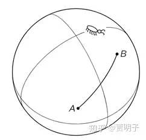

# 12.2、惯性系和弯曲时空

***本章注：本文是从原12章 - 时空面包与时空软糖 - 中拆解而来。\***

> **“Spacetime tells matter how to move, mater tells spacetime how to curve”** **“时空告诉物体如何运动，物体告诉时空如何弯曲。”** **- 约翰.惠勒**

前面我们讲到，闵可夫斯基用时空几何的语言描述了狭义相对论。闵可夫斯基恰好是爱因斯坦大学时的数学老师，他对爱因斯坦大学时的数学表现相当不满意，他曾经在自己的数学课上，他把爱因斯坦称作“懒狗”（lazy dog）。当他把爱因斯坦的狭义相对论用数学语言重新表述的时候，爱因斯坦一开始认为这不过是一种数学家对抽象和形式简洁过分追求的一种方便方法。但是很快，爱因斯坦接受并且着迷于这种抽象简洁，并且应用这种时空几何的思想进一步推广到引力理论，发现了一个更加令人惊异的结果：**时空不是平直的，而是扭曲的**。

而这个，我们需要从惯性系说起。

在前面章节中，我们看到，在牛顿力学和狭义相对论中，惯性系都是一个极其重要的概念：它是我们现有的物理定律的形式成立的前提条件。但是，我们会问：自然界的规律应该是独立于某个观察者视角的，它的形式不应该取决于某个特定的观察者。那么，惯性系为何会有这如此特殊的地位？

对此一个可能的诠释就是：**惯性系定义了时空的度量**，而物理规律，则是用这种度量来表述的。

我们说，当我们测量长度时，我们需要一个长度单位，来把各自不同的长度之间做出对比，这样我们才有了一根长度大小的比较基准。于是，我们就定义了某个特定的长度为“一米”，然后剩下的所有长度度量都何以以“米”为单位进行比较。比如说我们测量一条细杆的长度，我们把那个定义为“一米”的尺子的一端与细杆的一端重合，然后看如果我们与细杆的另一端重合，需要多少个这样的尺子。时间也类似，我们定义某一个时间间隔为“一秒”，然后来度量两个事件之间的时间间隔。但是时间的度量与空间度量有着一个显著不同，它更加微妙。说到底，我们无法像任意移动米尺一样，在时间中移动“时间尺”。

牛顿认为存在着一个“均匀流动”的绝对时间，但是我们对这种形而上学式的绝对时间没有任何实证的认知，可能我们真的没有什么办法严格定义出时间为何物，或许它真的如康德所言，是先天直观，是不可还原的。而物理学中的整个定量描述，却离不开一个时间的**可操作性计量**。牛顿的绝对时间在这方面无能为力。

那么从操作上我们如何计量时间呢？我们说，时间表示事件发生的先后间隔。正如我们可以用一个具体的“尺”来度量抽象的长度间隔，我们也可以用具体的事件来度量时间间隔 - 我们用两个事件发生的间隔来度量它。例如说，我们定义一个事件A：今天太阳初升，另一个事件B：今天太阳降落。然后我们定义AB的间隔为1天。那么，当太阳初升时，同时发生了另一个事件M：我吃早饭；在太阳降落时，同时发生了另一个事件N：我持晚饭。那么我们就知道我两顿饭之间间隔为1天。

但是现在的问题是，一个事件在时间长河中只会发生一次。我们通过把事件M在时间上与事件A重合（也就是“同时”），然后把事件N与事件B重合，那么我们就通过AB的时间间隔来测量了MN的时间间隔。AB作为一个时间间隔的两端，定义了一个“时间尺”。然而这个“时间尺”却是不可重复使用的，因为AB发生过就发生过了，它们立即“消逝”了，因而时间尺也就随之消失无踪了。

只能计量一次的计量方法，毫无意义。

你可以说，A和B是重复出现的，它们并不会消逝：我们未来还会经历无穷多次太阳的初升和降落，也就是说我们这把“时间尺”可以反复用来计量时间。事实上我们常用某种物理上反复出现的现象 – 也就是某种周期振动 - 来完成这种时间计量：这种振动会使它的每一个状态都会在时间的长河中不断反复重复出现并且绝不走样。这样一来，在任意时刻这个振动的状态，都会与历史上已发生的相对应，因而我们虽然无法把“时间尺子”在时间洪流中任意移动，但是我们知道这种周期性的振动能够把历史状态反复“复制”到随便哪一个时刻，与我们待计量的时刻重合。这样我们就可以实现在时间尺度上的“平移”。我们就把这种振动与时间对应起来，成为时间计量。在古时候，我们用一个日出日落的周期计量为一天，后来我们用一个单摆摆动周期来计量，在现代我们用铯原子的振动来做时间的精确计量。

但是你必须知道，反复出现的事件，其实并非同一个事件。我们通过这种反复出现的现象来计时，背后有一个隐藏的前提：这些反复出现的现象之间的间隔是等时的。

例如说，我们日常中这种周期性的运动有很多很多。一个非常常见的振动就是心跳 – 事实上在伽利略时代，他就说用心跳数计时完成了很多实验。如果我们以心跳来计时，比如说我们定义一个基本的计时单位，叫做“一跳”。当我坐在椅子上写这些文字的时候，我的心跳大约是每秒钟1次，这样一来，大约需要9万跳完成太阳的一次升降。但是当我出去运动的时候，我们会发现，同样的太阳升降大约需要18万跳时间，那么依照这种计时法，当我们运动时，太阳的运行变慢了。

你会觉得这种计时法很不合理，因为你认为心跳不是“**匀速**”的，所以“跳”这个单位不能描述**均匀流动**的时间，与之不同的是，单摆的摆动是匀速的，所以它的计时就更准确。但是我们可以问，凭什么我们认为单摆每个周期经历的时间间隔是相等的，而心跳则不相等？要知道，在我们还在讨论“用什么计量时间”这个问题的时候，我们无法定义一个周期运动中“一个周期时间是不是不变”这个问题，因而说单摆周期不变就是毫无意义的。

所以说，用周期性运动来计时 – 例如用单摆来计时 - 看起来是一个合适的假设，但是从逻辑上，却隐藏着一个陷阱：

第一，我们可以通过力学的计算，来证明这种周期（例如说单摆）是不变的，因而我们就有了用它计时的合理依据

第二，我们用这种方法建立时间度量，度量我们的运动，进而基于这种对运动的定量度量，我们就可以发展出一套动力学理论。

但是，我们回头看看上面的第一条：周期不变这个度量的基本前提，是通过运动定律得到的；而我们的运动定律，却是建立在时间计量的基础之上的。这明显就形成了一个逻辑循环。因为没有了合适的时间计量，就不会有力学，也就不会有单摆的振动周期计算，当然也就无法证明单摆的周期不变。

这就是牛顿在它的运动定律之前，必须要假定一个绝对时间的原因：它虽然很麻烦，并且毫无可操作性，但是它在逻辑上是必需的。

现在，我们退一步，我们暂且认可这种绝对时间，并且任性地认为这种物理周期（如单摆）真的是不变的，而不需要任何理由 – 毕竟科学需要一个我们认定的起点。我们仍然面临着一个无法解决的问题：这种周期相对于不同的观察者是飘忽不定的。

我们来说一个现实的例子。想当初，麦哲伦完成了人类历史上第一次环球旅行。船队从西班牙出发，然后经过了长达三年的艰苦航行，最终回到了西班牙。等船员们上岸是，却发现了一件奇怪的事，他们以为现在是1522年9月6日，但在岸上的日历上，却是1522年9月7日。也就是说，他们的日历中“丢失了”一天。这在当时是一件非常严重的事情：因为基督教规定每个周日都需要做礼拜的。如果船员们把日历搞错了，那么他们在船上做礼拜的时间就都不对了！这是对基督教义的严重违背。然而人们检查航行日志时，却发现每一天都有记录，人们并没有丢失哪一天。当时的人们并不能解释这到底是为何，然而现在看来这并不奇怪，因为船队完成了一次环球旅行，它们当然就比陆地上少旋转了一圈，这就是这丢失的一天。你们现在地理课中所讲的“国际日期变更线”就源于此。

这里我们不妨从物理的角度上来看这个问题：

从物理上讲，船员相对于地球做的是一个圆周运动。如果我们把地面看作是一个惯性系，那么船队就不会是一个惯性系。地面观察到的地球旋转速度，与船队观察的就不同了。而我们利用日出日落计时的本质，是利用了地球的“匀速旋转”这个特性。那么现在船队参考系与地面参考系对这种“匀速”却产生了分歧，因而在船队的计时系统中，他们所认为的时间的流逝速度就发生了变化！

以地球的旋转作为时间计量方法，这种计量人们已经用了几千年了，看似很可靠。但是当他做环球旅行时，这种计量就不一致了。因为我们每环球一周，时间就会相差一天。那么在做环球旅行（与自转同向）的我们看来，时间的快慢就和我们的速度相关了。如果我们把日出日落的计时法看作是一个前提，来定义一个日落日出时间间隔为不变的，那么当我们运动快时，我们就会觉得整个世界变慢了，反之则觉得整个世界变快了。

如果你觉得这种计量方法仍然有缺陷，你选择单摆，其实一样的。例如对于站在摆锤上的一只蚂蚁而言，单摆并不摆动，也就是说如果我们选取蚂蚁参考系中单摆作为时间计量的标准，时间就不流逝了！

也就是说，时间计量不仅仅从逻辑上有循环论证的嫌疑，在实操上，它也还和我们的参考系有关。

**在使用任何物体运动（包括单摆、日出日落、一年四季、乃至铯原子钟等等）做计量之前，我们必须有一个已经定义好的时间计量标准，以及这个标准相对的是哪一个参考系。**

在牛顿力学中，“匀速直线运动”就可以成为这样的标准。“匀速运动”可以根据运动的距离定义出时间。在任何两个事件的间隔期间，我们观察一个匀速运动的粒子走过的路程，就可以成为时间计量。但是现在前面的问题仍然没有解决：

首先，在没有时间计量的时候，就无所谓匀速不匀速。**在我们寻求时间计量的时候，我们不可能找到一个匀速运动的物体来承担这个工作。我们只有先定义一个匀速运动，才能找到时间的计量方法。**

其次，“匀速运动”，相对于谁？不同的人看同一个运动是不一样的。

现在，为了完成我们的物理定律，我们就只能简单粗暴地**认定**一种运动为匀速的，以及这种运动是相对于哪一个参考系的。也就是说，我们定义了某种运动形式和参考系，通过它们来定义时间的“流速”。

这样一来，匀速运动就不是一种 “客观”存在的、完全物理的运动形式，而是一种我们的**定义**：我们先定义某种运动为匀速运动，然后才能用它来定义时间的流速。**从操作上，我们没有任何逻辑来证明某种运动是匀速的，但是我们却可以定义它为匀速的。那么，当我们定义匀速运动的时候，同时就定义好了惯性系。**

就好像是说，我们事先定义好了“单摆是匀速摆动的”，然后才可以用它来计时一样 – 没有“单摆是匀速的”这个前提，就没有用它来计时的合理性。事实上，历史上伽利略就是这样做的，他先认为单摆周期不变[[1\]](https://zhuanlan.zhihu.com/p/58995603#ref_1)，然后用它来对物理实验进行计时。但是单摆的定义方式相对而言显得就很随意 – 为何我们的物理定律要建立在这么一个毫无理由的机械玩意儿上呢？我们应该选取一种更加普遍的、更加基础的东西。

于是，这就自然而然地引出了牛顿第一定律和惯性系的定义。首先，我们如何定义匀速运动呢？最简单的方式，就是自由粒子（受力为零的粒子）。然后，如何定义参考系呢？我们不妨回顾一下前面章节中Lang关于此的说法：

> ***“惯性系是这样一组参考系，相对于它的三个自由粒子，从同一点向三个不共面的方向抛出后，全部都沿直线行进并且相互之间的距离成正比变化。惯性定律于是断言相对于任意惯性系，任意第四个粒子也以同样的方式运动”\***

也就是说，如果我们抛开了牛顿的虚无缥缈的“绝对空间”，我们无法认为这是一个“定律”，因为在这里，首先“匀速直线运动”难以描述 – 因为我们还没有计时法；其次我们必须要有参考系，没有参考系的运动毫无意义，在一个参考系看来是匀速直线运动，在另一个中却不必如此。牛顿第一定律实际上真正的表述应该是这样的，

**“存在至少一个参考系，**在其中自由粒子总是匀速直线运动**”。**

那么这个参考系就是惯性系。有了惯性系，就有了严格的匀速直线运动的定义，因而就有了时间的定义。同时也就有了空间的定义（定义了“直线”）。

然后，在这个时空度量规则上，我们就可以建立对物理运动的描述：牛顿第二定律。而根据这些描述，我们就自然而然地计算出单摆的周期不变。也就是说，它可以用来作为时间计量。从逻辑上，单摆计时的基础是，我们定义了惯性系中自由粒子的运动是匀速的，然后根据这个推论出单摆的周期不变。这是在牛顿第一定律基础上的，是在惯性系之中的：单摆之所以能够作为一个计时标准，是因为它的一个摆动周期内，惯性系中的自由粒子运动距离总是相等的，这种计时法其实等价于“匀速直线运动”的定义。

而对一般非惯性系而言，我们却不是总看到它在匀速摆动的，自由粒子也不总是匀速运动的，因而在这个标准下，非惯性系就无法成为时间计量的基本参考系。这其实等价于这样一个事实：在一般非惯性系中，自由粒子不被定义为匀速运动。所以说，**惯性系就成为时空度量的一个标准**。

那么，惯性系的特殊性就容易理解了：**物理规律之所以只对惯性参考系保持不变，是因为惯性参考系的时空几何是我们对时空度量的定义标准，**而我们对物理规律的定量描述，是采取了这种度量标准的。这种标准，在牛顿体系下是欧氏空间和均匀时间，而在相对论下，则是闵氏空间中的度规张量。

至于我们为何会选取惯性系作为时空度量的基准，而不采取其它参考系呢？原因是它简单。在惯性系中，牛顿定律都有着非常简单的形式，按照物理学家朗道的说法，

> ***“惯性系就是物理定律有着最简形式的参考系”。\***

这样一来，我们就对惯性系的特殊性有了一个合理的解释。是吗？

\- 是的，如果不是有“万有引力”这个调皮的家伙的话。

万有引力到底有着何种奇怪之处呢？

首先，当爱因斯坦第一次完成狭义相对论的时候，他立即就意识到，这个理论虽然可以和谐地解释全部的电磁相互作用，但是却对万有引力无能为力 – 当时的引力理论就是牛顿的万有引力定律。也就是说，万有引力不满足前面所说的那种“不变性”。

其次，更加棘手的是，万有引力使得“惯性系”的定义本身产生了巨大的问题。原因就是，我们根本无法区分惯性力和万有引力。

何为惯性力呢？在牛顿力学中，惯性力是一种**赝力**，顾名思义，它是一种假想的力。比如说，当我们在汽车中，汽车被加速的时候，我们就感觉到背部传来椅子靠背的推力（所谓的推背感）。在汽车参考系中中看来，我们是静止的，我们的推背感来源于我们受到的某种向后的作用力。按照牛顿力学，这种力是不存在的，它仅仅是因为我们非惯性系的一种效应。但是，最为要命的一点是，这种惯性力所表现出来的性质，却和重力完全一致，没有任何分别！这两个力都是质量×加速度的形式，并且作用范围都是所有具有质量的物体。

爱因斯坦说，是时候祭出我的电梯了。

在爱因斯坦的理想电梯中装着各种实验仪器，还有一位实验物理学家，比如说名字叫做Bob，在里面进行各种测量。而有人，比如说Alice，在外面操作这个电梯。这个电梯与外界完全隔绝，Bob在其中没有任何办法对外部做出观测，那么他如何判定这个电梯是惯性系还是非惯性系呢？

首先他需要判断匀速直线运动。这个比较容易，作为实验家，他有着各种测量工具，做出这种判断。其次，他需要判断粒子是自由粒子。这个就比较微妙了。

比如说，Bob发现，在其中所有带正电荷的粒子全部受到一种向左的力，而带负电荷的粒子全部受到向右的力，这种受力大小与带电量成正比，而不带电的粒子不受到这种力，那么他立刻就可以知道，电梯处在电场之中，在其中所有的电荷都会受到作用力，因而都不是自由粒子。只有当带电离子感觉不到受力时，他才知道它们没有受到电场力的作用。

同理，Bob可以通过小磁针的偏转来判断粒子是否受到磁力的作用。

那么，万有引力呢？它有没有什么方法判断电梯是否处在一个引力场中呢？

比如说，一开始Alice让这部电梯相对于地球静止。此时，电梯内的Bob将看到，电梯里的东西都会受到一种力。如果没有其它的力与这种力相平衡，这种力就会使物体落向电梯的地板。而且，所有物体在落向地板时，加速度都是一样的。根据这些现象，Bob立即可以作出结论：他这个电梯受到了外界的引力作用。

现在，Alice在外面让电梯做做自由下落的运动。这时，电梯内的Bob将发现，他的电梯里这种引力突然“消失”了。他现在达到了“失重”状态。实验家观测任何物体的任何力学现象，都不能看到任何引力的迹象。他就会得到这样一个结论，引力“消失”了。

或者说，是这样吗？

不见得，爱因斯坦说，当电梯内的Bob检测到引力存在的时候，他又如何能确定自己感觉到的引力是“真的”万有引力还是一种因为加速电梯而产生的惯性力？相反地，当他检测到引力消失的时候，他又如何能确定这部电梯就是漂浮在一个没有引力的空间，还是在一个引力场中自由下落？

没有任何办法。

万有引力有一个非常奇怪的性质：在引力场的作用下，所有的物体从静止开始自由运动总是保持同样的步调。这个就是**自由落体定律**。因而它们的相对位置总是保持不变。我们没有任何办法检测出它们所表现出来的相对位置的分别。因而，是所有的物体步调一致地自由落体，还是所有的物体都保持不动，而是电梯在加速上升？这就是一个问题。

自由落体定律早在500年前就被伽利略注意到了。这是因为**质量既是万有引力的起因，又是惯性的起因**。而引力是改变物体运动的，关系是抵抗这种改变的，因而在引力场中的运动过程中它们就恰好被互相抵消了[[2\]](https://zhuanlan.zhihu.com/p/58995603#ref_2)。但是其它的作用力就没有这种性质，例如静电作用。在电场中的相同电荷的例证在运动的时候，质量大的运动慢，质量小的运动快，它们很容易被区分。而正是由于引力的这种“所有物体步调一致”的特性，导致了它与加速场无法区分。

牛顿第一定律断言，**不受力**的物体保持静止或匀速运动的参考系是惯性系，但是，我们我们发现，就万有引力而言，我们根本就**没有办法判定物体是否受力**。伽利略大船里面的水手如果观察到水滴一滴一滴加速滴落，他没有任何办法确定，这究竟是在空无一物的宇宙空间中的大船正在加速向上运动，还是地球表面上匀速运动的大船受到重力作用的结果？前一种情况，大船是一个不受重力的加速系，而后一种，它是一个重力场中的惯性系。到底大船是哪一种情况，这个可怜的水手完全给弄糊涂了。

既然我们无法判断物体是否受力，当然也就无法用牛顿第一定律来判断一个参考系是否惯性系。进而，既然我们没有办法判定惯性系，建立在惯性系基础上的整个物理学岂非空中楼阁，镜花水月？我们如何才能给这个物理学建筑一个牢固的基础？

爱因斯坦说，Bob不能通过自己电梯中的任何物理现象来判断电梯是否处在一个引力场之中，他也测量不出自己的电梯是否有加速运动，这是因为两者根本就是等效的！万有引力不是一种“力”，而是一种时空背景 – 就像是整个舞台是舞台上演员的背景一样。我们在观看一台舞台剧时，当我们看到一个人突然跳起来，我们知道，这个人相对于舞台做出了一个加速运动。但是当我们看到所有的人（包括地面）突然步调一致地跳起来，我们就不会认为是这些人和地面一起突然跳起来了，我们会认为整个舞台上升了。引力场就是这个例子中的舞台：它的作用是全局的，对任何事物的影响是公平的，绝不会偏向任何事物：对所有事物的相同的影响，就相当于对任何事物没有影响，而只对这些事物的背景产生了影响。因而我们说，引力就是一种时空背景。

所以，Bob不必苦苦纠结电梯里到底有没有引力，他完全可以、也只能认为不存在这种外来的引力。这样一来，我们就把自由落体的参考系作为惯性系。引力的这种可以通过在局部选取参考系而完全消除的本性，叫做**等效原理**[[3\]](https://zhuanlan.zhihu.com/p/58995603#ref_3)。

既然引力可以不再被当成一种“力”，那么它是什么？引力这种能够引起所有物体步调一致地运动的性质，表明它是一种**全局**的性质。恰如所有事物步调一致地加速运动就相当于它们不动而作为背景的时空舞台反向加速运动一样，时空的性质是通过位于其中的所有事物之间的相对关系而表现出来的，因而引力这种全局性质就是一种关于整个时空背景的性质：用数学语言来说，**它是一种时空的几何，**用来描述闵可夫斯基的时空面包的几何特性。

好了，爱因斯坦把他的电梯君收回自己的口袋，满意地拍一拍说，结论来了，引力根本不是一种力，是一种几何，惯性系不是“相对于绝对空间做匀速运动”，而是一个自由落体的参考系（或曰自由参考系）。任何非自由落体的电梯都等效于一个局部加速系，在其中的所有物体都因而不能保存匀速直线运动，它们不是惯性系。只有在自由落体的电梯里面，不受外力的物体才可以真正地在任意方向实现真正的牛一式的动者恒动。在这种惯性系中，狭义相对论中的物理定律才能保持一致，时空才是闵可夫斯基的四维时空形式。

等一等！我现在突然想到一种方法可以区分引力场和加速度。在一个加速系中，根据狭义相对论，我们就会观察到一些运动效应，例如，经过简单分析我们就可以知道，在电梯的顶上放一个时钟，在地上放一个时钟。站在地上的Bob观察这两个时钟，如果这时电梯是个加速系，他应该可以看到顶上的时钟走得更快，而地下的走得更慢。而如果它是一个引力场中的静止参考系，就不应该有这种运动效应，他会看到两个时钟速度一样。这样一来，我们就可以区分它到底是一个无引力的向上加速的电梯，还是引力场中静止的电梯了。

但是，现在爱因斯坦说了，加速度必须引力场等效，这是引力场能够实现在所有惯性系中满足洛伦兹不变性的基本要求。因而这种因为运动而产生的时间和尺度的变化，引力场同样可以产生。也就是说，发生在无重力的向上加速的电梯中中的事情，与发生在静止在地球上的电梯箭中的事情是相同的，地球上的电梯也会看到高度不同的钟表走的速度不同：**引力场将会导致时间和尺度的度量变化。**

实验表明，爱因斯坦是对的。

我们继续想象一下，在一台加速的爱因斯坦电梯中，一束光横向射入，我们会发现什么？很显然，光在电梯中行进的过程中，电梯加速行进了一小段距离。那么电梯中的Bob就会发现光的行进发生了弯折，就像是抛物线一样。那么根据等效原理，在引力场中静止的电梯仍然会发生同样的事情，光线弯折了。

这是怎么一回事？光学原理告诉我们，真空中的光总是走直线的，那么在引力场中它为何会弯曲呢？莫非是引力场中的“直线”本来就应该是这样的？

如果你注意到，我前面说等效原理的时候，非常小心地使用了“**局部**”这个词。“局部”在这里至关重要。因为引力场从来就不是一个均匀的、平直的东西。按照平方反比的空间分布形式，它可以被形象地理解成一个“球面场”。在空间任何一点，它都不可能是均匀的。因而一个自由落体参考系对引力的消除只能是**局限在在一个点**附近的、因而引力场可以被看做均匀的情况下才能完成。也就是说，引力场中的每一个点都有一部不同的爱因斯坦电梯来充当惯性系。在另一个点我们就需要另外一部爱因斯坦电梯来干这个活儿。

这样一来，按照等效原理的说法，并不存在一个全局的惯性系。在牛顿力学和狭义相对论中，如果你在匀速运动，那么你就是一个全宇宙的惯性系（全局惯性系），你看到的任何时间、任何地点的物理定律都是成立的。但是现在，这种全局惯性系在广义相对论中是不存在的，每个不同的时间、不同的地点都有一个特定的惯性系。例如在赤道上方自由落体的电梯，和北极上方的电梯，显然不是同一个参考系。没有全局的惯性系，只有无数个局部惯性系，以及更重要的，**维系这些惯性系之间关系的纽带：引力**。这些惯性系之间的相互关系，就是由引力场决定的。

刚才我们说过，惯性系提供了时空的度量，这在牛顿力学和狭义相对论中如此，现在，在引力场中同样也应该如此。在牛顿力学和狭义相对论中，一个惯性系就是全局的惯性系，因而这种时空度量在各处都是处处相同的，因而我们就有一个均匀的、平直的时空。但是现在引力场被牵扯进来了之后，根据等效原理，空间中无数个惯性系处处不同，也就是说引力场中的时空度量规则（也就是闵氏空间的时空间隔、即所谓的**度规张量**）会处处不同：这就是我们前面说到的，引力引起尺度和时间变化的根本原因。这个时空不再是均匀的、平直的，而是发生了扭曲。

时空中的度量规则处处不同，形象说，就是时空面包的“形状”和“密度”的变化。关于时空性质的描述，当然就是几何了。描述这种扭曲的面包的，就是一种我们陌生的、扭曲的空间性质。

而对于几何而言，空间任意一点的一个重要性质就是距离的度量。对于欧氏空间而言，两点之间的长度满足勾股定理。而对于任意空间的几何就不必如此。现在，每个点附近的每一个方向上都有一个不同的关于距离的度量。比如说，在某个特定的空间，我们拿着一把尺子来测量长度，我们所熟悉的常识告诉我们，这把尺子的标准和空间中的位置无关，同样的长度在北京和在上海是一样的。但是在弯曲的空间中则不同，这把尺子在不同的位置、以及不同的方向上可能会神奇地“伸长”或“缩短”，这种伸长缩短就是有度规张量所定义的。那么很显然在非欧几何中就会有很多反常识的几何性质。例如球面上不存在两条平行线、内角和大于180°等等。

费曼的物理学讲义中举了一个非常有趣的例子，一只二维的蚂蚁，这只蚂蚁对我们的三维世界毫无所知，它的全部想象力全部被局限在一个二维的平面内。对于一个尺度度量规则处处相同的平面而言，它对这个平面的一切性质的知识，就是二维的欧氏几何。如果有两个点，它想要找到两点之间的最短距离，那么很明显就是一条直线：

那么对于一个尺度度量规则处处不同的平面呢？情况就会非常不同。假如说有这样一个圆盘，圆盘的边缘处比较热，中心处比较冷，由于热胀冷缩，它在进行长度测量的时候，不同的地方尺子就会膨胀或缩短，因而它在不同的地方测量的规则就发生了变化。

现在它要发现AB两点之间的最短距离，它就会对空间进行测量。在它看来，这个最短距离就是一条曲线：它向着边缘处偏折。原因是，在更靠近边缘的地方，它的尺子会伸长，因而测出来的距离就变短了：

如果它所在的平面是一个球面，很明显，它对最短距离的认知也是一条曲线：

这就是时空度量规则不均匀带来的反常的几何性质。我们就是一种这样的“蚂蚁”，只不过不是两维生物的蚂蚁，而是一种局限于四维时空中的蚂蚁。对我们而言，四维时空中的度量规则由于引力的作用发生变化，就表现为这个时空的弯曲。

我们可以用一个例子来把这种时空弯曲变得具象化。比如说，在一部电梯的范围内，由于它的尺度如此之小，我们不会觉察到任何时空弯曲 – 在电梯的这个局部空间中，时空是平直的。当电梯自由落体的时候，我们释放两个小球，我们会发现它们同时静止地漂浮在半空，互相相对静止：因而引力的作用被消除干净了。但是如果说这个电梯很大，有全北京那么大。在里面丰台和顺义两个地方分别有两个小球。这个电梯在做自由落体运动。我来问你，两个小球会如何？会相对静止吗？

错。因为当电梯很大的时候，它就不能算作“局部”了，两个小球之间还存在着因为重力而引发的**潮汐力。**如下图所示：

当两个小球向地面自由落体的时候，它们都是在“竖直向下”运动的，但是它们落向的地面却是一个卷曲的球面，因而同为竖直向下它们的方向就不可能平行。（事实上它们都是以地心为球心的径向下落）因而在电梯里的科学家就会发现，两个小球渐渐地靠近，似乎是有一种力作用在它们上面一样。也就是说，一个局部惯性系并不能消除全局的引力效应。

这两个小球各自是一个惯性系，在没有外力作用下它们都应该保持静止，但是各自静止的它们为何会神秘地相互靠近了呢？爱因斯坦说，**并不是它们靠近了，而是时空本身受到了引力的扭曲而改变了**，因而长度的定义发生了变化。也就是说，**空间弯曲了**。

如果我们这个巨大的电梯位于一个引力很强的恒星上面开始自由下落。在下落的时候，我们在电梯的空中摊开一张柔软的巨大的方形地毯，这张地毯可以任意伸缩扭曲而内部没有应力。那么，地毯的边沿和中心的位置实际上距离引力源的高度就有所不同，中心处最近，因而引力场就最强，而边沿比较远一点，引力场就弱一些。在地毯下落的过程中，中间的位置下落的要比两边的快，并且越下落就越快。同时边沿处受到前面所说的潮汐效应会向中心收缩。那么我们作为在电梯里的观察者就会发现，这张地毯先是静止地漂浮在空中，并且渐渐地开始形变，中间凹陷，边沿收缩。如果这张地毯相对于恒星的尺寸很小（例如像我们人类的尺度），或者说恒星的引力较弱（例如像太阳的强度），那么这种地毯的形变是很难观察到的。但是如果相反，在与恒星相似的尺度上、恒星的引力又比较强的情况下，这种形变就会比较明显：随着向恒星的靠近，平直的地毯会渐渐地变成为一个类似漏斗的形状。

然而在整个下落期间，我们并不能感觉到任何力的作用，在没有受力的情况下这张地毯应该保持着平直的形状，而不应该发生形变。但是它的确发生形变了，那就只能被解释我们的空间本身在形变：它在不断地被扭曲，地毯的形变过程就是空间扭曲的具象化体现。越靠近引力源，也就是说引力越强，空间的扭曲就越明显。而潮汐力，则是空间扭曲的具体体现。

这样一来，我们就不时空的弯曲给具体表现出来了！

总而言之，每个局部惯性系中保持着平直的时空，但是在整体却构成了一个扭曲的几何形状，它就像是一个光滑的、表明贴满马赛克的艺术作品 – 每个马赛克都是平直的，但是它们组合在一起就成了扭曲的。这种几何形状在数学上被称作“流形”。

因而，时空就变成了一种果冻一样的东西：它不再是像面包那样平直的物体，而是柔软的、光滑的，可以被任意扭曲的东西：

总而言之，时空中的物体引发引力场，引力场就是时空弯曲。而时空的弯曲，则直接影响了空间的度量法则，因而必然反过来影响着物体的运动。描述这种**时空弯曲**与**物体运动**之间的关系的，就是**广义相对论（General Relativity）**。它在整个物理学史上都算得上是最令人震惊的理论。非欧几何自诞生之日，即使是最激进的数学家们也没有真的认为它可能是我们真实的空间法则，人们更加没想到，空间的法则竟然会受到空间内物体的影响。**时空不仅是一体的，而且是弯曲的。不但是弯曲的，而且是被空间中的存在弯曲的。**

更加令人震惊的是，**它不但是物理事件的舞台，而且还是物理事件的直接参与者。**

在牛顿力学中，空间是绝对的，时间是绝对的。我们的空间的性质由最可靠的数学 – 欧几里得几何 – 所描述，它必定如此且一成不变，完全不受物理过程影响。也就是说，时空的几何性质与物理过程是相互独立的。经典力学中的定律虽然有可能在不同的参考系下的表现形式会有所不同，但是它们都有着这样一种形式：

**一些物理量=f（另一些物理量）**

它们是一种纯粹的物理过程。时空的性质是早在我们考虑物理过程之前就已经确定的，并且为物理过程提供了一种背景和舞台。但是广义相对论的基本方程，爱因斯坦场方程，却不是这样的，这个场方程是这种形式：

$G_{\mu\nu}+\Lambda_{\mu\nu}=8\pi T_{\mu\nu}$

你不必细究它的含义，我们只来说一下它和经典力学形式的不同，它变成了：

**时空几何量=f（一些物理量）**

我们发现，引力既影响了参考系的性质（即时空几何），又影响了物理过程。也就是说，物理过程现在与时空几何纠结到了一起。物体导致时空的弯曲，而时空的弯曲又导致物体的运动，因此我们不可能在物理过程发生之前就事先知道时空的几何性质，时空性质也同物理过程一样，变成待定的、变化的、与物理实体纠缠不清的了。

而物体告诉空间如何弯曲，空间反过来告诉物体如何运动，最终，两者交替影响，就会产生大名鼎鼎的**“引力波”**。引力波可以说是物理学史上最伟大的预言之一，它如此超前，以至于在理论预言它的存在之后整整一百多年，人们仍然无法发现它的存在，直至今年早些时候的那件轰动全球的事件。但是，不论引力波的发现在实验科学中意义如何重大，人们却并没有对它产生太多的惊奇，因为相对论实在是太美妙了，它不可能是错误的。发现他的实证结果固然令人兴奋，但是即使是没有发现，人们也坚信总有一天会发现的。

最后，我打算说明一点。从伽利略相对性，到狭义相对论，再到广义相对论，整个过程中一个主题贯穿其中：物理定律的不变性，也就是说，**一个物理定律不应该相对于不同的观察者有所不同**。狭义相对论使得电磁理论中的特殊“以太”参考系失去了特殊地位，广义相对论则使得原有的惯性系失去了特殊地位。广义相对论使得这种物理定律的不变性变得普遍，并且更重要的，使得引力理论也能够获得这种不变性。

**物理定律的不变性，这才是广义相对论的真实动机。**而在对这种不变性的追求中，从牛顿力学到狭义相对论，人们意识到高速世界的不同，而再到广义相对论，人们意识到强引力场世界和宇宙尺度世界的不同。最终，人们意识到，**牛顿定律只是一种低速、弱场、较小尺度下的近似定律。**

在爱因斯坦刚开始他对引力的研究的时候，普朗克曾经劝他不要入坑，

> ***“As an older friend I must advise you against it, for in the first place you will not succeed, and even if you succeed, no one will believe you.”（作为一个年长的朋友我劝你不要选择它，首先，你无法成功，其次，即使你成功了，也没人会相信你）\***

爱因斯坦却坚持他的初衷，他说研究引力理论使他幸福。他没有料到的是，从他1907年找到“**一生之中最幸福的思想**”，到最终理论的成形，整整花了他八年的痛苦探索。

如果我们把广相与同时代的另一个伟大理论 – 量子力学 – 相比，我们会发现两者的产生原因如此之不同。量子力学基本上是**经验驱动**的：人们先发现了无法解释的实验现象，然后为了解释这些现象，而发展新的理论。但是相对论更多地是**理性驱动**的：人们先发现理论不够美妙，为了达成更优美的形式，而发展新的理论，整个过程中想象力、逻辑和数学环环相扣，成为人类理性活动的典范。

这种驱使爱因斯坦投身其中的理念就是，**变化多端的物理现象背后，必然有不变的、普遍性的物理定律**。

**下一章：[贾明子：13、宇宙间一切都在变化吗？](https://zhuanlan.zhihu.com/p/49963839)**

**上一章：[贾明子：12.1、四维时空](https://zhuanlan.zhihu.com/p/49434398)**

**专栏传送门：[何为现实？拉普拉斯之妖与薛定谔猫之决战](https://zhuanlan.zhihu.com/c_186387023)**

------

[[1\]](https://zhuanlan.zhihu.com/write#_ftnref1) 伽利略认为单摆周期不变，是通过数自己的心跳来判断的。它数单摆的摆动次数，与自己的心跳数总是相对应的，并且，当他感觉到自己心跳加速时，一个单摆周期中心跳的次数的确增加了，与感觉相一致。所以说，最早的这种计时法，其实是相当主观的，通过人们对心理时间的感受来判断。

[[2\]](https://zhuanlan.zhihu.com/write#_ftnref2) 这就是人们常说的“惯性质量”=“引力质量”

[[3\]](https://zhuanlan.zhihu.com/write#_ftnref3) 事实上，等效原理在广义相对论的发展过程中起到了里程碑式的意义，然而在广相的形式理论建立起来之后，人们发现它自然地蕴含在理论体系之中了，因而并不必成为广相的基础。所以现代物理学中一种主流的观点认为，等效原理其实只有历史意义，而不再有物理意义了。但是不论如何，对一个零基础的人，它仍然是一种思维利器。

## 参考

1. [^](https://zhuanlan.zhihu.com/p/58995603#ref_1_0)伽利略认为单摆周期不变，是通过数自己的心跳来判断的。它数单摆的摆动次数，与自己的心跳数总是相对应的，并且，当他感觉到自己心跳加速时，一个单摆周期中心跳的次数的确增加了，与感觉相一致。所以说，最早的这种计时法，其实是相当主观的，通过人们对心理时间的感受来判断。
2. [^](https://zhuanlan.zhihu.com/p/58995603#ref_2_0)这就是人们常说的“惯性质量”=“引力质量”
3. [^](https://zhuanlan.zhihu.com/p/58995603#ref_3_0)事实上，等效原理在广义相对论的发展过程中起到了里程碑式的意义，然而在广相的形式理论建立起来之后，人们发现它自然地蕴含在理论体系之中了，因而并不必成为广相的基础。所以现代物理学中一种主流的观点认为，等效原理其实只有历史意义，而不再有物理意义了。但是不论如何，对一个零基础的人，它仍然是一种思维利器。

发布于 2019-03-12 10:36

