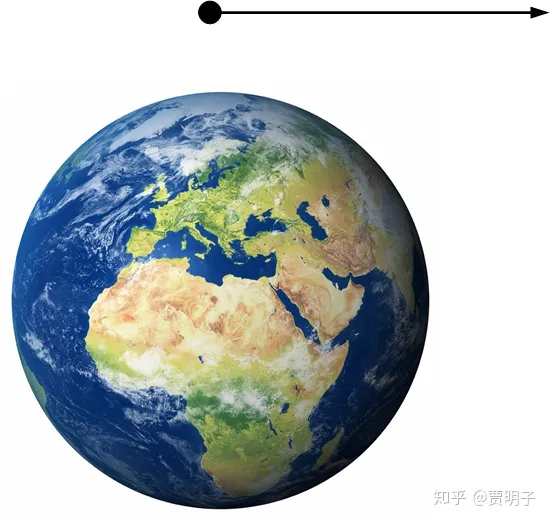
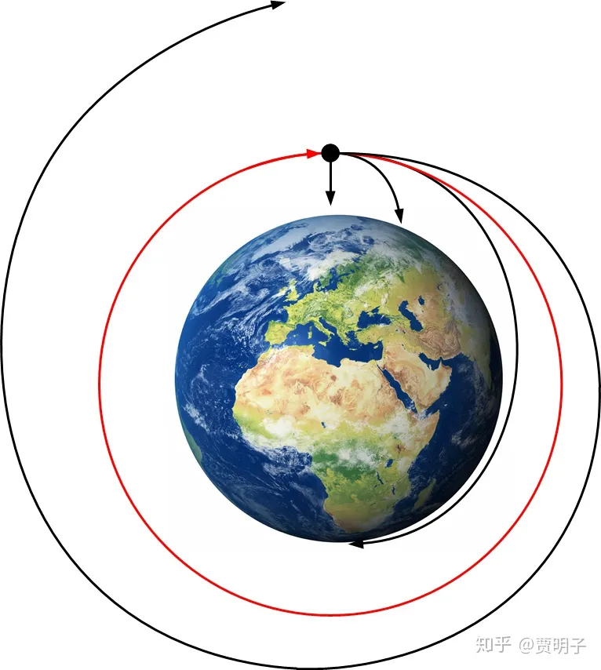
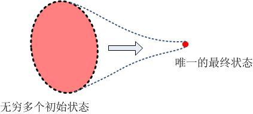
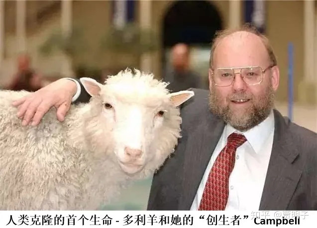

# 13、宇宙间一切都在变化吗？

> ***“Time is a moving image of eternity.”\***
> ***“时间是静止永恒中的流动影像。”\***
> ***- 柏拉图\***

费曼在他的自传《你干嘛在乎别人怎么想？》中记载了一段在他十几岁的时候，用他的数学知识成功地吸引到自己喜欢的女孩的关注的故事，非常有趣[[1\]](https://zhuanlan.zhihu.com/p/49963839#ref_1)：

> *……她说，“我们老师说，**任何事物都像纸张一样有两面**。”*
> *“就这个论断也有对错两面呢！”我说。*
> *“你指的什么？”*
> *我从百科全书上念到的墨比纸条（哦，我那美妙的大百科全书哟！）就是一例。那时代，墨比纸条还不是尽人皆知的，可谁都可以理解它，就像现在一样。墨比纸条平面的存在是直观可见的，不像那些油滑模棱两可的政治问题，也不像那些需要很多历史知识才能理解的东西。大百科全书里有一个神奇的世界，一个鲜为人知的世界。在阅读它的时候，不仅学知识令人兴奋，而且有一种使你具有独特性格的感觉。*
> *我拿来一张纸，扭了半圈，接成一个环形，做一个墨比环。*
> *艾莲也兴奋起来。*
> *第二天在课堂，她故意等到老师举着一张纸，说，“任何事物都像纸一样，有两面……”。艾莲举起墨比环说，“老师，**您所说的也有两面呢**！我这儿有个只有一面的纸！”于是老师和全班同学都惊奇不已。艾莲自然很得意。我觉得自那以后，她对我留意多了。*

看到这段故事，让人不禁感慨，用知识来吸引女孩，在当时的美国还是一件高端大气上档次的事情，只可惜现在，知识已经成为Geek的代名词了。不过这只是无关主题的感慨，这个故事其实向我们显示了，当我们在随意地用“任何事物都如何如何”这种语气来说话的时候，大概率会把自己绕进逻辑矛盾当中，例如，在很多讨论哲学的读物中，我们会看到类似这样的断言：

> “任何事物都不是一成不变的。”

或者说，

> “任何事物都处在变化之中。”

类似的论断，我听到过无数遍了，我相信你的耳朵也快要磨起茧子来了。这种说法看似非常有道理，并且符合人们的经验：难道我们日常事物不是总在变化的吗？难道人类关于自然的认知不是一直在颠覆中前进的吗？难道人类的整个历史不是一直在发展的吗？难道整个生物圈不是在一直进化、进而整个宇宙不是在一直演化的吗？

这些都没错 – 在我们日常谈天的场景下。但是，如果我们在严肃地（哲学或科学意义下）谈论自然界的变化，我们还是可以用费曼和他的小女朋友的逻辑来怼这种论断：如果这个论断成立，那么**这个论断本身**，也不是一成不变的，也是在不停变化的，因而也不总是正确的。我们现在的确处于一个日新月异的时代。但是，人们对知识的追求却从来没有变过，在多变的表象下寻求普遍的真理一直就是最崇高的目标之一。我并不太清楚为何强调变化和演进在当今社会中占据了绝对的“政治正确”的高地，以至于绝大多数不明真相的吃瓜群众对这种眼花缭乱的背后的永恒不变嗤之以鼻。最大的可能，是因为在科学史中人们对自然的认识总是伴随着对已建立的理论体系的颠覆 - 科学理论本身也是在不断成长和进化的。人们对科学发展的自我批判和自我否定印象如此深刻，以至于大家在津津乐道于科学理论的不断演化的同时，却遗忘了，绝大多数对既有理论的颠覆企图都是失败的，事实上科学理论有着极其强大的稳固性，在无数多次对旧理论的批判中，仅有少数几次是成功的 – 诸如燃素说、热质说的推翻，或相对论和量子力学的建立。更加重要的是，即使是算上所有的那些成功的颠覆和革命，在一切科学进化的背后，有一个不变的主题贯穿其中：**对理论的普适性的追求**。而普适性，包括了时间的普适性和空间的普适性：物理理论应该相容于所有时间，以及所有系统，它恰恰就是永恒和不变同义词。

正如前面所述，我们最基本的三段论逻辑推理是这样的形式：

1、所有的A都有性质P；

2、B属于A；

3、所以B有性质P。

其中，第一条是大前提，陈述的是一种普遍的陈述，第二条是小前提，是特殊的陈述，结论则是对特殊主体的性质的判定。**自然科学所努力的，正是在寻求那个普遍的大前提。**这种大前提，就是最基本的物理定律。而我们对这些定律的应用，则是在这个普遍的大前提下找到一个领域，进而得到相应的结果。正是这种普遍定律的存在，人们才能够自由地将这些定律应用到不同的领域而获得累累硕果。因而这种大前提的普遍性至关重要，例如在经典科学中，惯性是不变的，相对论中，光速是不变的，一切定律都有洛伦兹协不变性，量子力学中，幺正演化是不变的（至少人们希望如此），说到底，任何上述理论中，都有一个非常简单（形式上）的基本方程诸如哈密顿方程，场方程，薛定谔方程等等，这些方程在理论体系中是被认为是适用于任何情况的。我们前面提到，相对论的诞生，恰恰是因为人们对物理定律不变性的追求导致的：物理定律应该不因人、因时、因地而变。而贯穿于所有理论的，是三大守恒定律：能量、动量、角动量守恒，以及在它们背后的，最小作用量原理和理论对称性。

在浩如烟海的文学典籍中，充满了对人性、爱情、自由、真善美的赞美，我想，它们应该算是在人类价值观中一些永恒理念的追求 – 虽然我对社会科学和价值理论没有什么研究，但是我**愿意相信**无论社会如何发展，人类价值观中还是存在着一些相对稳定的东西的。而与之相对的，在人类对自然和宇宙的认识过程中，科学家们给自身的重大使命就是，无论我们眼前的表象如何纷繁复杂，眼花缭乱，**在它的背后找到那个不变的、普适的规律**。没有了这个觉悟，科学便不能成为科学。我们前面的章节中，正是因为对物理定律不变性的追求，促使爱因斯坦建立了相对论；正是对物理定律普适性的追求，促使玻尔兹曼建立了统计力学。我们在后面还会看到，正是因为同样的追求，导致了量子力学诠释问题的百年大论战，矛盾重重然而硕果累累。没有了这种追求，可能严谨的量子力学压根儿就建立不起来。

所以，在这里我要鼓励你，在哲学和科学领域中，对那些第一眼看上去似乎很“有哲理”、很“正确”、很“鸡汤”、但是在智慧上很廉价的说法，要建立起你的免疫力。对于这种“一切都必须变化”的说法，你要学会独立思考，是的它看似有一定的道理，但是，真是如此吗？我们凭什么就认为在这些变化的背后没有一个不变的内核呢？

不幸的是，在很多二流的哲学家群体中，却充斥着类似的廉价理论。对此，我们前面说到的少年费曼在几十年后功成名就，仍然对此诸多吐槽。他很尖刻地嘲讽这些二流哲学家为“**鸡尾酒会哲学家**”，意指这帮货只知道在鸡尾酒会上肤浅地夸夸其谈，却缺乏对他们谈论的事物的深刻了解。在相对论问世之初，这个理论搅乱了一大批哲学家的脑浆，这些人只能从字面上望文生义，而不具备从数学上和形式理论上理解它的能力。费曼感觉非常鄙夷的一点是，大批的哲学家 - 不仅仅是那些他所瞧不起的鸡尾酒会哲学家，轻易地散布着关于相对论的谬论：“啊哈，爱因斯坦说一切运动都是相对的，这对物理学产生了颠覆性的影响。但是这在哲学界早就是不言而喻的事实啊，这帮物理学家们直到现在才认识到这一点。如果我们早知道如此，而对科学做出哲学高度上的**指导**的话，物理学现在早就不是这样了！”你现在已经知道，相对论绝不仅仅是字面上那么简单，物理学家们也不是愚蠢至斯，连这样一些简单道理都不懂。然而的的确确有那么一大批肤浅的哲学家们，自己完全没有意识到自己的半瓶子醋，却时时刻刻不忘来“指导”科学。也难怪诸如费曼和温伯格这样的物理大家们对哲学不屑一顾[[2\]](https://zhuanlan.zhihu.com/p/49963839#ref_2)。费曼说：

> ***“These philosophers are always with us, struggling in the periphery to try to tell us something, but they never really understand the subtleties and depths of the problem.”（这批哲学家们总是不胜其扰地围着我们呱噪，试图教我们些什么，其实它们从来就无法理解问题的深度和精妙。）\***

关于世界万物无时不在运动的观点，其实最早起源于古希腊的赫拉克利特，他最著名的言论就是，人不能两次跨入同一条河流。这在当时确实算作是深刻的思想，但是，他当时却不可能想到，这条河流的水流虽然变了，但是它所遵循的流体力学原理却是不变的，构成水流的水分子乃至氢原子和氧原子们，彼此是完全相同的，它们遵守的量子力学定律无论你几次跨入都不会有丝毫改变。与赫拉克利特同时代的柏拉图给后人留下的可能是最珍贵的精神遗产就是，**变化的现象背后可能存在着某种永恒的东西。**科学家们未必会同意柏拉图的具体观点，但是这种理念却一直传承下来，驱使他们不断细致深入地进行探寻。虽然科学和哲学在很多问题上关注点完全不同，但是随着科学的发展，其在很多领域其深度和广度早已不是传统形而上学所能及。例如直到现在，我仍然看到很多人在为康德时空观辩护，说相对论其实与其并不冲突。是的，它们并不冲突，但是在相对论时空观的深刻面前，几百年前的康德思想确实显得非常粗糙，实在没有太多必要被这样关注了。

科学家们在万变背后寻找不变，这还不够，他们还希望，这种不变的规律是**简单的、优美**的。正如前面我们曾经提到过的，人们愿意相信，自然规律就像是围棋那样是一种现象复杂、但是规则简单的游戏。在不同的领域，诸如天文、地理、物理、化学、生物等等，它们表面上完全不同的变化形式，其根源应该发端于同一条规律。对至简和普适的规律的追求，就像前面章节所说的，

[贾明子：6、自然科学的实在和实证158 赞同 · 26 评论文章](https://zhuanlan.zhihu.com/p/43371148)

自然科学中不同的哲学流派有着不同的诠释，但是它们的目标却是一致的。现在物理学的最前沿，对所谓的**大一统理论（Theory of Everything， TOE）** 的追寻正体现了这一点。

这样的万有理论是否真的存在现在尚无定论，然则绝大多数科学家对TOE怀着极大的期望。对于这样一种只是“可能存在”的终极物理定律报以这样的热情，看上去是纯粹出于科学家们对终极定律的真实存在的一种信念。然而这种信念却不是毫无根据的，几百年的自然科学的发展，似乎每一步都在向我们暗示，**所有的科学都是相通的，它们都是某种基本定律在特定领域展现出来的一面。**下面我将带着你快速浏览几个科学发现，它们分别是万有引力定律、热力学第一定律、质量作用定律、法拉第电解定律、以及维勒合成。它们有些是科学中极为重大的发现，而有些却看似不那么重要，但是从本章的角度看却是至关重要的，因为它们中间贯穿着一个共同的主题：**融合**，天文学与力学、力学与热力学、热力学与化学、化学与电磁学、化学与遗传学之间的融合。就像是你在拼一个巨大的拼图，在支离破碎之际，其中偶然的不起眼的一块，却把两块看似毫不相干的拼图连成一片，让人顿生豁然开朗之感。不论这一块小小的拼图本身如何平凡，但是它却在人类认识自然规律的时候起到了跨越式的推动作用。从自然科学崛起之时起，人们努力进行各种自然发现，人类的知识之书越变越厚，然而正是这几个融合，**使得这本厚重的书变薄了**，并揭示出这纷繁表象背后的那个内核。

**万有引力定律**统一了宇宙间的天体运行与地面上的物体运动。在此之前，人们对天体和地球上的物体的运动规律的认识是完全分开的两套系统。天体按照天体的规律运行，总是在毫无理由地自转和公转；而地面上的物体则按照地面上的规律运行，总是会落向地面，两者没有什么交集。如果按照亚里士多德的说法，那是因为地面的物体和天体各自的“自然位置”不同导致的。从来没有人想到过这两种看似截然不同的运动方式会遵循着同样的运动规则。直到万有引力定律的发现和微积分的建立之后，人们才真正意识到，天体和地面的物体其实没有什么不同，它们都是牛顿定律和万有引力定律作用的结果。

惯性定律告诉我们，当我们从地面上抛出一个小球的时候，如果小球不受任何力的作用，它会一直以同样的速度沿匀速直线运动向前行进。如果地球对小球没有任何引力作用，小球将会以这种方式逃离地球，而永远不会返回地面。

然而，牛顿说，地球总是对小球有着万有引力作用的，所以当我们从静止释放小球时，它总是落向地面。当我们以一定的初速度抛出它时，由于引力的作用，它逃离地球的企图就被打破了，而会被“拉回”地面，走一条抛物线。我们抛出的速度越快，小球就逃离得就会越远，这一点完全符合我们的日常经验。我们从北极抛出小球，如果速度足够快，它可以一直飞到南极才会返回地面。那么当小球出发时恰好达到某种特定的速度时，它将永远不会返回地面，而是返回到抛出的位置：它逃离的企图和地面拉回它的企图恰好抵消掉。这时，它就会一直沿着同样的速度围绕地球旋转，像天体一样了。

是的，地面的小球和天空中的月亮的运动规律完全一样，别无二致。没有什么天体一套地面一套的两种不同的运动，它们都是同种运动的不同表现形式而已。我们根据地面的运动定律，就可以精确计算出太阳系所有星球的运动轨迹。一切速度足够小的物体，它们逃脱的能力就较弱，在引力的捕获下最终都会落到地面上；而速度足够大的物体，它们逃脱的能力就较强，与引力的捕获的较量中就可以达到平衡，因而就总是围绕地球旋转，既不能逃脱，也不会被捕获；速度更大的物体，就可以做到逃脱地球的束缚而逃离到外太空。

一切就这样顺理成章了，物理规律就是这么简单优美。**天文现象和力学现象实际上都是同样的运动规律在不同的领域发挥作用导致的**。

牛顿现在仍然面临着一个问题，既然同样的规律使得有些物体落向地球，有些仅仅是围绕地球旋转，那么到底是什么在一开始给了天体这样的初速度，使得它能够达到这种平衡呢？作为虔诚教徒的牛顿把这个位置留给了上帝，认为上帝在最初推动了天体，使它们可以获得了速度。然而在这之后，上帝就不再干涉了，任由它们按照物理定律运行。这个就是大名鼎鼎的**“第一推动力”**。

**热力学第一定律**，也就是**能量守恒定律**，把我们对热现象和机械运动现象的认识统一起来了。与力学不同，热力学所关注的，是与机械运动完全不同的另一类变化形式，热现象。冷热，作为人类的直接五感的一部分，是人们最早认识到的自然现象之一。然而正是因为它是人类最基本的感官，人们对它的理解就更加难以突破而仅仅局限在感官层面。最早期的对热现象的研究起源于化学家们，在燃烧过程中首先产生了燃素说，被拉瓦锡推翻之后又提出了热质说。应该说，热质说的提出，从一开始仅仅从表象上来认识热现象跨越到了对热现象背后的规律的探索。在热质说中热量被当做是一种有别于实际物质的特殊的流体，可以导致温度的升高，并且总是从高温流向低温。热质说取得了很大的成功，但是当时的人们并没有认识到，所谓的热质，其实是一种能量，和物体运动的能量并没有什么区别。它不但能够在不同温度物体间传递，导致温度的升高或降低，而且还可以用来做功，或在能量的耗散中产生。热质说对后者现象的解释显然无能为力。

第一个认识到热可能是一种能量的，是一个医生，叫做迈尔。他意识到能量可能有超出机械能的多种可能形式，并且热就是其中之一，但是他的这种认识来源角度可谓刁钻，既不是来自热现象，也不是来自机械现象，而是来自人类的血液。他在作为随船医生的时候，注意到海员们的血液在赤道要比在北方鲜红得多。当时医学已经知道血液的鲜红意味着含氧量，因而迈尔猜想，在热带人们消耗的热量降低，因而食物的燃烧过程就不需要像寒带那么强，所以血液中残留的氧就会更多。由此他进一步认为，食物中蕴藏着某种形式的“力” – 即现在我们所说的能量 – 可以转化为热。那么能量从一种形式转化为另一种形式就应该是事物变化的一种普遍现象。当然，他的想法以猜测和思辨居多，而缺乏实证证据，被当时的人们完全忽略了，迈尔本人也迈入了悲剧的后半生[[3\]](https://zhuanlan.zhihu.com/p/49963839#ref_3)。

真正确立能量守恒定律的最关键人物是**焦耳**，他用无可辩驳的实验证明了热量的做功能力，因而证明了热量与机械能之间的相互转化。以至于人们现在仍然用“焦耳”命名能量的单位[[4\]](https://zhuanlan.zhihu.com/p/49963839#ref_4)。能量守恒定律可能是人类历史上直接影响历史进程的最伟大发现，它直接导致了工业革命的发端。然而，在这里我们更加关注的，是它在人类认识自然界过程中的重大作用：它第一次使得各种学科有了一个普适的物理量来沟通，机械能、热能、化学能、电能、核能，光能，等等一系列想通却表现形式各异的能量，而能量这个概念，也成为后世“民科”们最为滥用的概念之一。能量守恒定律宣布了热力学的正式建立，人们知道了热原来是能量的一种形式，但是人们仍然不知道这是何种形式。很快地，由麦克斯韦和玻尔兹曼开路，大成于玻尔兹曼和吉布斯的统计力学揭示了热与机械运动的关系：热能就是大量微观粒子杂乱无章运动的动能和势能的总和[[5\]](https://zhuanlan.zhihu.com/p/49963839#ref_5)，而温度，则是这些粒子的平均动能。

哈！至此为止，人类终于可以给出一个队热现象的最本质的诠释了：它本身其实和牛顿力学中小球、天文学中的天体没有什么区别，都可以在原则上通过力学定律来描述。所不同的，是我们日常见到的热力学系统中包含了太多太多的微观粒子，因而不可能完成对它们的力学描述，只能从整体入手通过统计平均的手法 – 这就是统计力学。统计力学的成功之处不仅在此，它还第一次解释了最令人头痛的“时间之箭”的问题 – 我们为何总是从历史走向未来，而从来不能反向演化？在我们第一部分的如下章节曾经简单涉及到过一点点。

[贾明子：15、产生于不确定的确定性122 赞同 · 14 评论文章](https://zhuanlan.zhihu.com/p/28576046)

也就是说，在大量杂乱无章的粒子所构成的系统中，它们总是趋向于均匀：就像是砂土与大米一样，即使一开始它们可以完全分离，摇晃几下后它们最终总是会无可避免地倾向于完全混合。这里我并不想对此讨论细节，因为它已经超出了我们的讨论范围了，如果后面我有精力，我会在第三部分关于**时间**的讨论中回来重访这个问题。

总的说来，虽然在实际操作中，由于极高的复杂度，通过对系统的力学求解来获得热现象的结果是不可行的，但是原则上，热力学的现象归根结底还是遵循着与机械运动、天体运行完全相同的规律的。从这个角度，**热现象不过是力学规律在大量粒子的系统中的平均体现。**如果说万有引力定律统一了天体与宏观物体，那么统计力学则统一了宏观物体和微观粒子[[6\]](https://zhuanlan.zhihu.com/p/49963839#ref_6)。

统计力学还有一个重大的成果，就是统一了物理学与化学。我们先从化学中的一个实验定律说起，这个定律叫做**质量作用定律**。这个定律试图回答这样一个问题：一个化学反应发生的速率到底有多快？它和什么有关系？对此，化学家们通过对实验现象的观察，得到这样一个规律：对于一个简单化学反应[[7\]](https://zhuanlan.zhihu.com/p/49963839#ref_7)：

$aA+bB\Rightarrow cC$

它的反应速率正比于反应物浓度的化学计量数次方，即：

$r=e^{-\frac{E}{RT}}{C_A}^a{C_B}^b$

我们抛开这里的细节，只是从简单的定性规律上来讨论它。这个定律告诉我们，**反应物的浓度越高，则反应速度越快；同时温度越高，则反应速度越快。**这个实验结果非常符合我们的直觉，但是为何是这样呢？

不知道你还记不记得，我曾经跟你说过化学反应绝非几个分子之间相互结合那么简单。例如氢气和氧气的燃烧反应中，首先，氢气的两个氢原子、氧气的两个氧原子之间的化学键需要断裂，然后形成一些自由的粒子，称作自由基，例如氢的正离子、氧的负离子等等。然后这些自由基之间互相结合，形成新的分子：水分子。但是这个过程中，原来反应物氢气和氧气的化学键的断裂并非自己说断就断的，它需要外界给它一定的能量。具体讲，来源于分子间的相互碰撞，当碰撞剧烈到一定程度后，就会把原来的分子碰成碎片 – 也就是自由基。然后这些碎片重新组合，形成新的分子。它绝不是两个氢气分子和一个氧气分子结合生成两个水分子那么简单。如果只有这三个原子存在，我们基本上可以肯定它们无法发生化学反应：因为化学反应需要分子的碰撞、进而碰碎，而这三个孤零零的分子在广袤的空间中几乎不可能发生碰撞（想象一下分子的尺度多么小，就好像两个随机行走的人在整个银河系中偶然相遇那么不可能！）。事实上，只有当分子的数量足够多（浓度足够大），它们的碰撞频率才会足够高，才可能产生有效的碰碎。这就是为何浓度越高反应越快。同理，只有当分子运动速度足够快，它们的碰撞才足够剧烈，才能把它们原来的结构撕裂。这就是为何温度越高反应速度越快。

我们可以看到，化学反应中的分子的碰撞，其实就是一个热力学过程 – 因而也就是一个力学过程。但是，这其中更加关键的，化学键是如何撕裂，又如何形成的呢？

在人们认识到化学反应本质之前，物理和化学是两个基本上没有任何交集的学科：前者研究物体的运动和相互作用，而后者研究物质的结构和组成。但是一个看似不太起眼的发现把两者联系起来了，这就是**法拉第电解定律**。这个定律告诉我们，当电解反应发生的时候，产生的新物质的量正比于通电的电量。也就是说，例如水的电解反应，当我们给水通入越多的的电量，被分解的水分子、因而产生的氢气和氧气就越多，它们呈严格的正比关系。

这个定律看似没什么重要性 – 如果你不研究电化学的话，几乎不会想到它。但是，它却是联系两片不完整拼图的那个关键的碎片，它告诉我们，化学反应，和电力相互作用有密切关系，化学反应的过程，必然伴随着电量的交换。这个真可以算作是于无声中听惊雷，谁能想到这样一个不起眼的发现有着如此深刻的意义呢？现在在初中课本中我们就已经知道，化学反应不外乎是原子最外层电子的活动，但是在当时，人们甚至连原子的存在都不知道、连电磁学的基本定律都尚未建立！早在人们彻底认清化学反应和电磁规律之前，这个发现就已经悄悄暗示两者之间的密切关系。

事实上，我们现在知道，使得化学结构得以形成的关键作用力 – 化学键 –其实就是一种电磁相互作用。用一种经典的、不甚严格的解释[[8\]](https://zhuanlan.zhihu.com/p/49963839#ref_8)，就是说在化学反应中，一些原本属于氢原子的电子被氧原子夺走，因而两者分别带有不同的电荷，在库仑引力的强大吸引下，形成了稳定的水分子。而分子间的相互作用也可以由此解释：当分子距离很远时，由于它们平均下来都不带电，所以整体没有任何相互作用，也就是说它们都是自由粒子；而当它们距离靠近的时候，由于它们的电量分布，使得近距离下不能再当做不带电的整体看待，各自原子核对对方的外层电子的吸引力体现出来，表现为整体互相吸引，而当继续靠近的时候，原子核之间的相互排斥体现出来，就表现为整体相互排斥。

由此可见，化学反应、以及分子间的相互作用都是电磁力。化学就这样和物理学统一在一起了。

最后，我们再来看看，涉及到生命的科学：生物学，是如何与其他学科相通的。事实上，生物体内无时不在进行的各种新陈代谢过程，都是非常复杂的化学反应。然而，这种化学原理在生物代谢中的普遍性却在很晚才被人意识到。

无疑地，生命现象是人类最为迷惑、也是最为渴望认识的现象，因为这与我们自身的生存息息相关。但是同时，**生命现象也是人类思想史中最为禁忌的话题之一**，从一开始就笼罩着神秘的色彩。漫长的历史中，不论是简单工具、陶器、瓷器、青铜器、铁器等等，还是欧洲的炼金术、中国的炼丹术，人们发现自己可以合成、制造一系列的“新的”物质，但是从来就没有人能够创造一个生物，哪怕是最简单的微生物。这自然而然地给了神秘主义的生长空间。在大量的宗教或神话传说中，创造生命，那都属于神的专属空间。

进而在自然科学中，这种思想也很有市场。所谓的**“活力论（vitalism）”**就是其中的代表。这种理论注意到，虽然在生物体内发现了种种化学反应的迹象（例如18世纪就已经有了光合作用的早期理论），但是，人们在运用化学原理自行合成物质的过程中，从来就不能够完成对生命中所需的一些物质的合成，例如蛋白质、尿素、甚至极简单的甲烷，而这类物质则是生命代谢中不可或缺的。这些物质就被称作**有机物**，而相对的，人们可以自由合成的，就被称作为**无机物**。于是活力论就认为，生命体内的化学过程必须遵循着与其他化学过程不同的原理。生命代表着一种独特的活力 – 生命力，它能够驱使一些特殊的化学反应进行，是有机物产生的必备条件。生命力是独立于物理和化学原理之外的、生命独有的神秘能力。而这种理论，则成为人们反对**进化论**的利器。

18世纪末，随着化学的发展，生物学家们开始对生命力是否存在产生了怀疑，于是活力论和反活力论的争论开始了。1828年，维勒的一次化学实验失败了，他想要合成氰酸铵，然而他却发现，产物中有了尿素 – 一种有机物！这次貌不惊人的失败，产生了惊人的后果：人类有史以来第一次，用无机物合成了有机物！产生有机物所必须的“生命力”，原来确实是子虚乌有。

**维勒合成**，这样一个非常非常不起眼的、看似极其小众的化学反应，却引起了如此重大的结果，从此，化学原理在生命过程中的普遍性渐渐为人们所承认。现代生物学中，对生物化学的研究已经早已不是当时的状态，人们不但可以合成简单的有机物，而且可以合成各种直接参与生命活动的物质，如胰岛素，来应用于医学治疗。人们可以通过化学合成和基因工程一起，改变细菌的基因，和细菌们一起联手合成一些我们需要的有机物。人们甚至可以通过生物和化学的综合手段，完成对生命的克隆。现在，理论上我们没有任何障碍，来完成真正意义上的对人类的克隆。

当然，克隆一个生命和“合成”一个生命其难度是不可同日而语的。人类现在的技术水平距离合成生命尚有无穷远的距离，但是理论上，越来越多的人们相信，这是一个可能实现的过程。

好了，前面的几个例子，无一不体现了自然规律的某种普遍性：从天体到机械，从宏观到微观，从物理到化学，从化学到生物，我们似乎在遵守着完全一致的定律。类似的例证在科学史上不要太多，而沿着这条道路挖掘下去，我们在物理学中可以发现不同领域之间更加惊人一致性：**最小作用量原理**。经典力学、经典电动力学、量子力学、量子场论、量子电动力学、相对论，无论它们的基本方程有何千差万别，统统都可以用这个原理表达出来[[9\]](https://zhuanlan.zhihu.com/p/49963839#ref_9)。而我们又发现了伟大的**诺特定理，**告诉我们每一个守恒定律的背后，都是一种物理定律的对称性的体现：空间平移对称对应着**动量守恒**，时间平移对称对应着**能量守恒**，空间转动对称对应着**角动量守恒**。

自然界似乎在向我们耳语：“**变化是表象，普适和不变才是内核。**”这究竟是我们的幻听，还是我们对自然的呢喃的敏锐捕捉？我并不知道，但是我**愿意相信**是后者。

**下一章：[贾明子：14、自然科学的经典时代](https://zhuanlan.zhihu.com/p/51080213)**

**上一章：[贾明子：12.2、惯性系和弯曲时空](https://zhuanlan.zhihu.com/p/58995603)**

**专栏传送门：[何为现实？拉普拉斯之妖与薛定谔猫之决战](https://zhuanlan.zhihu.com/c_186387023)**

------

## 参考

1. [^](https://zhuanlan.zhihu.com/p/49963839#ref_1_0)这段故事摘自李沉简和徐杨的译本，中间有些地方翻译得并不令人满意。例如所谓的“墨比环”就是我们曾经谈论过的“莫比乌斯带”
2. [^](https://zhuanlan.zhihu.com/p/49963839#ref_2_0)事实上，现代哲学已经进入了极端严谨、分工细致的时代，对现代有着重大影响的几位主流哲学大家诸如罗素、维根斯坦、奎因、刘易斯等人无一不是数学、逻辑或科学大家。传统意义上的纯哲学家们如果不能跟上这种步伐，就会变得越来越像跳梁小丑。费曼本人对哲学的看法其实也是建立在对身边的二流哲学家的二流表现的偏见上，并不完全可取。
3. [^](https://zhuanlan.zhihu.com/p/49963839#ref_3_0)迈尔的理论被忽视而极度郁闷，后来两个儿子在短时间内相继过世，导致其崩溃自杀。自杀未遂后被送入疯人院。从疯人院出院以后事业与生活尽废，几乎销声匿迹。后来人们认识到他思想的伟大而授予其科普利奖章，但是在那时候他的精神状态下，这已经连聊胜于无都不算了。
4. [^](https://zhuanlan.zhihu.com/p/49963839#ref_4_0)人们仍然用“卡”（或“卡路里”）来命名热量，它是从“热质”这个词来的。卡和焦耳是通过热功当量等价的。
5. [^](https://zhuanlan.zhihu.com/p/49963839#ref_5_0)我这里用词并不严格，但是还是要指出，真正严格的用词应该是“内能”（internal energy）。物理学中并没有“热能”这个概念，有的是一个叫做“热”（heat）的概念，这是一个过程量，而不是一个系统的性质（状态量）。但是这里我想就不做区分了。
6. [^](https://zhuanlan.zhihu.com/p/49963839#ref_6_0)请注意，在这里的讨论中我不追求精确。事实上这里的很多说法只是基于经典力学、并且已经被证明是有着局限性的，更严格的说法应该是基于量子统计。
7. [^](https://zhuanlan.zhihu.com/p/49963839#ref_7_0)严格说，是基元化学反应。一般的化学反应是由很多步基元反映组合而成的，例如氢气和氧气燃烧过程中，就是由几十乃至上百个基元反应构成的，其中包括了化学键的断裂、自由基生成、化学键重新生成等等一系列过程。
8. [^](https://zhuanlan.zhihu.com/p/49963839#ref_8_0)严格的化学键理论是建立在量子力学基础之上的，由刘易斯在1939年的著作《化学键的性质》中建立。
9. [^](https://zhuanlan.zhihu.com/p/49963839#ref_9_0)这里热力学似乎是个例外，因为有别于一般的物理领域，研究事物变化的过程，热力学研究的是事物变化的方向。这个目标似乎先天地无法用最小作用量原理来解决。

发布于 2018-11-15 17:48・IP 属地未知

