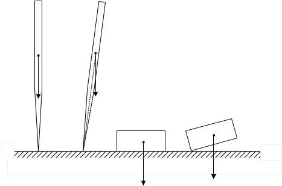
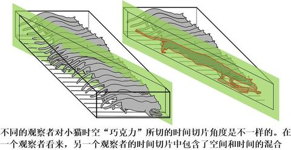
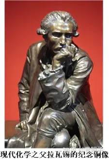
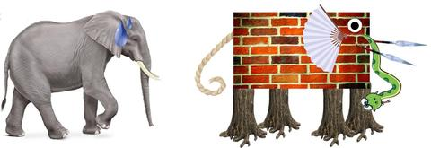
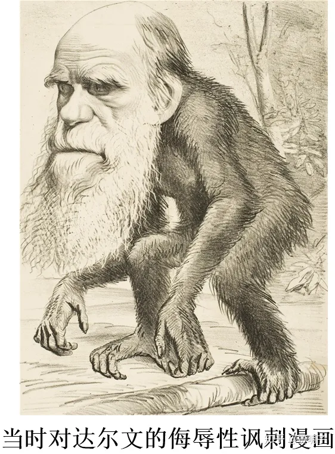
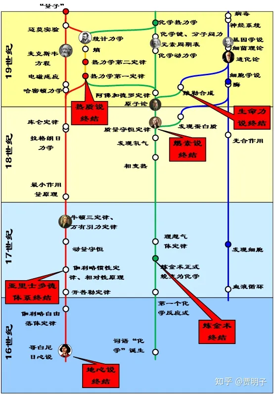
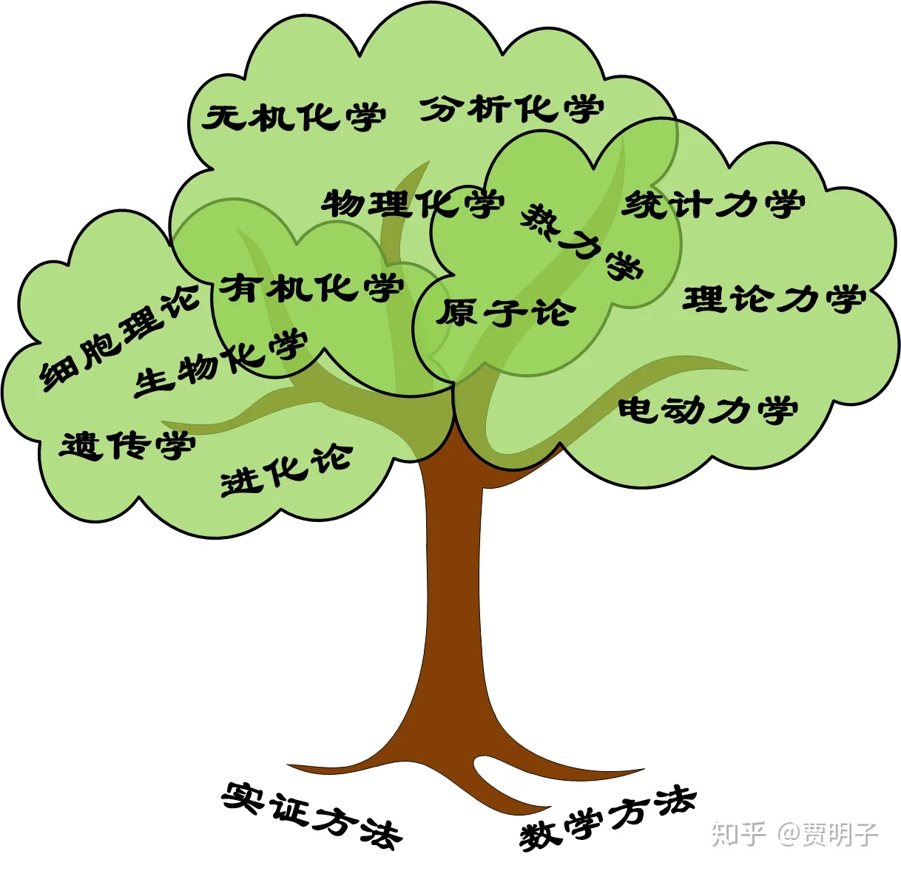

# 14、自然科学的经典时代

> ***“I believe the universe is governed by the laws of science. The laws may have been decreed by God, but God does not intervene to break the laws”\***
> ***“我相信宇宙被科学定律所支配。这些定律或许是上帝所创，但是上帝并不插手或打破这些定律。”\***
> ***- 霍金\***

我们到现在为止还没有真正讨论过量子力学 - 可能是有史以来最颠覆人类思维的科学 - 中关于现实的看法。在这之前，我们不妨先来回顾一下在它之前自然科学对此的认识。

我们在前面的章节中提到过16世纪发端自哥白尼、开普勒、伽利略的自然科学的崛起，从此自然科学作为一门独立的学科从自然哲学中独立出来。从此，人们以实证为基础、以数学和逻辑为工具开始了对自然界的探索。这种探索渐渐从天文开始扩展，从而奠定了自然科学中的三个主流分支：**物理、化学、以及生物。**从自然科学的诞生起，到量子力学的出现重新书写人们的认知止，这一段就是自然科学的经典史。

就像是文学、音乐、绘画中的经典时代一样，经典之所以被称为经典，是因为它年代“久远”，而且体系优美和谐，成就巨大。然而相对于人类的其它知识体系，自然科学只是一个非常年幼的小弟弟，这里的年代久远显然不能与哲学、文学、艺术等领域相提并论。应该说，如果我们从牛顿的《原理》开始算经典物理学的正式开启，至1900年普朗克的量子假说终止，整个自然科学的经典时代最古老处不过距今几百年而已。与动辄上千年的哲学和艺术史相比真如小巫见大巫。但是就是这短短几百年中，自然科学经历了积累、突破、融合、统一、直至繁荣的过程。我们可以快速浏览一下整个经典科学的发展历程。

我们在前面曾经提到过，自然科学的先锋包括哥白尼、第谷、伽利略、开普勒等一代伟大的科学家，他们遵循了以实证为基础的研究方法，根据实际的观察结果，总结归纳提出实验定律。他们是这些原则和方法的第一批践行者，但是但是真正在哲学上把这种实证方法和归纳手段上升到系统高度的，应该说是在落后他们半个时代的培根。培根应该说是经验主义的始祖，在他看来，用形而上学式的方法研究世界是行不通的，以数学和纯演绎的方法也是不可靠的，真正可靠的知识应该来源于观察。培根雄心勃勃，要做科学中的哥伦布，这可以从他的著作《伟大的复兴》（the Great Instauration）窥见一斑。在这部著作中，他要仿照圣经中的上帝七日创世，写下六章关于科学的伟大巨著，最终迎来科学的第七日[[1\]](https://zhuanlan.zhihu.com/p/51080213#ref_1)。这六章分别是：

1、科学的分类(De Augmentis Scientiarum)

2、新科学方法(Novum Organum)

3、自然历史(Historia Naturalis)

4、智慧的阶梯(Scala Intellectus)

5、迎来新哲学(Anticipations Philosophiæ Secunda)

6、新哲学以及科学(Philosophia Secunda aut Scientia Activæ)

从这个名字中我们就可以看出他的雄心壮志。可惜的是，他的著作至死都没能完成，但是仍然产生了巨大的影响。在他的著作里，他鄙视形而上学的思辨以及演绎方法，而极力推崇建立在观察基础上的归纳法。你可能感觉很奇怪，在现代科学中归纳法的应用是如此之广泛，乃至于我们都想之为当然，然而在培根之前却几乎没人真的把它正式地当做一个可靠的研究方法提出来。人们认为归纳是不可靠的、不完全的，因而不可能达到确定的真理 – 当然，我们已经知道在现代科学的观念中，我们并不追求确定的真理，而是在随时准备承认自己的错误并加以改进，科学理论就是这样一步步进化的。培根说，

> ***“Men have sought to make a world from their own conception and to draw from their own minds all the material which they employed, but if instead of doing so, they had consulted experience and observation, they would have the facts and not opinions to reason about, and might have ultimately arrived at the knowledge of the laws which govern the material world.”（人们总是从自己的概念出发一个世界，用自己的意想去得出物质世界的结论。但是如果人们不这么做，而是从经验和观察出发，那么人们得到的将是事实而不是我们的观点，进而最终到达支配这个物质世界的终极法则。）\***

培根本人并没有做出什么特别了不起的科学发现，他也不是第一个践行实证方法的人，但是，他却是第一个系统化地提出了实证和归纳方法的哲学家。我们曾经多次提及，科学定律就是人们在大量观察的基础上通过想象力“猜”出来的，从这个角度上说，培根可算是现代科学的祖师爷。在哲学上培根的影响力也是巨大的，英国经验主义的大师们，可以说都从他身上有着极深的传承。

于是在17世纪中叶，在一个个巨人的工作下，大量的经验数据被发现和整理，重要的实验定律诸如自由落体定律、惯性定律、开普勒定律等等被一个个提出。人们距离一个重大突破仅剩下一层薄薄的窗户纸等待着被捅破。于是伟大的牛顿成为第一个站在巨人肩膀上看见地平线后面那道曙光的幸运儿。在他划时代的《自然哲学的数学原理》中，三大定律以及万有引力定律终于呱呱坠地，成为整个经典物理学的基础，开创了后世200多年物理学的新局面。在《原理》中，质量、力作为物理学的基础概念产生了。整个宇宙万物的一切运动于是都被归结为它们相互作用力的结果。

如果说牛顿第一定律定义了惯性的性质，那么第二定律则定义了惯性的度量 – 也就是质量。物体的运动就体现为它受到的作用力和它的惯性之间的相互博弈的结果：惯性努力使物体保持运动状态不变，而作用力则不断地改变物体的运动状态。物体就在这一对冤家的对抗中纠结着，变化着。而从这个犀燃烛照的洞见，到人们真正理解变化无常的运动之间的那个桥梁就是数学。数学从古代被认为是描述形而上学本体的真理，变成描述具体运动现象的工具。牛顿的伟大之处并不仅限于发现了运动定律，更大程度上，这种伟大体现在他建立了从简单的运动定律到复杂的运动现象之间的关键连接 – 微积分。通过数学工具，人们得以建立数学模型，从简单的三个运动定律出发推演出各种复杂的机械运动。当然，但从运动定律 – 描述物体运动和力的关系的定律 – 出发，还缺失了对力本身的描述，我们可以把这部分定律称为力律，它描述了物体受力与物体状态之间的关系。例如万有引力定律说物体受到的万有引力与距离的平方成反比，这也可以是牛顿伟大发现中最为伟大的之一。此外，人们从对各种力的研究中总结了弹性定律 – 描述弹性力，摩擦定律 – 描述摩擦力，等等。于是乎，**力决定了物体的状态如何改变，物体的状态决定了物体如何受力**[[2\]](https://zhuanlan.zhihu.com/p/51080213#ref_2)，两者互相形成复杂的关联反馈，最终决定了物体的运动如何变化。请参考我们以前的章节。

[贾明子：9、我们这个反馈的世界226 赞同 · 31 评论文章](https://zhuanlan.zhihu.com/p/28573752)

而另一个极其重要的作用力，电磁相互作用力的发现，则是在牛顿之后将近100年才被真正认识的。人们很早以前就意识到物体可以带电，并且同性相斥异性相吸，但是对这种电相互作用人们并不理解。早期的人们并不知道，电磁相互作用，其实要比万有引力强大得多，并且在我们日常中也更加频繁出现，诸如弹性力、摩擦力、等等日常所见的一切非万有引力，其实都是某种不同形式的电磁相互作用。人们一直到如此之晚才认识到它，只是因为这样一个事实：与引力不同，电荷分为相反的两种，正电荷和负电荷 – 而引力则只有一种“引力荷” ，质量。电磁相互作用如此之强，以至于正负电荷自发地配对，小心翼翼地将它的宏观作用抵消掉了，只有在相互接触时才体现出来，诸如弹力或摩擦力。从摩擦起电中，这种正负电荷的平衡发生了些微的打破，物体带上了一丁点净电荷，人们得以从中研究电的性质。然后，人们又发现电可以生磁，磁又可以生电，于是库仑定律出现了，安培定律出现了，法拉第定律出现了，物理学中又一次重现了牛顿时期的情况：大量的发现被积累起来，突破一触即发。这一次，是麦克斯韦扮演了这个捅破窗户纸的幸运儿，他提出的麦克斯韦方程组，其优美堪称物理学中的典范。突然之间，人们的视野又一次豁然开朗，电现象、磁现象、光现象融为一体，物理学又一次开疆扩土。

与牛顿定律不同的一点、也是电磁定律带给经典物理学一个全新的概念，就是“场”。在电磁定律中，场成为描述物理现象不可或缺的物理概念。电磁相互作用不是跨过空间凭空产生的，而是通过遍布于空间的电场和磁场**传递**过去的。通过麦克斯韦方程的计算，这个传递也不是瞬间的，而是通过光速传递的。事实上，空间中任何一点的电磁场的一个扰动，都会像水面上的涟漪一样荡漾开去，这个荡漾的速度就是光速，这个涟漪就是电磁波。在牛顿的万有引力定律中并没有这个概念，万有引力是跨过空间、瞬间地、直接作用到对方的，这叫做“**超矩作用**”。超矩作用一直是万有引力定律当做最难以为人所接受的部分，事实上牛顿本人对此也没有明确解释，他说，

> ***“……one body may act upon another at a distance through a vacuum, without the mediation of anything else, by and through which their action and force may be conveyed from one to another, is to me so great an absurdity ……I have left open to the consideration of my readers.”（……一个物体故需要任何帮助，隔着真空中的一段距离作用到对方，这对我来说是一件困惑的事情，……我把它留给我的读者们独立思考。）\***

这个问题，一直到相对论才有了一个答案。在相对论中，引力的一切变化都是以引力波的速度，也就是光速向外传递的，两个有质量物体之间的引力绝非超矩作用。

[贾明子：12、时空面包与时空软糖136 赞同 · 14 评论文章](https://zhuanlan.zhihu.com/p/49434398)

这样一来，一切物质、能量、以及任何相互作用都不可能快过光速，因而任何信息和因果关系的传递也都是以光速为上限的。这种传递速度的上限决定了，一个事件的发生，在一瞬间只能影响到它周围的一小块区域。这叫做**“定域性”**。所有这些物质和能量从一处到另一处都是通过空间**传递**过去的，而不是消失在一点而同时出现在另一点 – **这虽然不违反守恒定律，但是却违反了定域性**。

几乎是在电磁定律获得突破的同时，经典物理学中的最后一块拼图也完整了，这块拼图就是热现象。热力学第一定律指出不同能量是可以互相等量转化的；第二定律指出能量的转化是有方向的，一般只会自发地从更“有序”的能量转化为更“混乱”的能量[[3\]](https://zhuanlan.zhihu.com/p/51080213#ref_3)而不能相反；而玻尔兹曼发展的统计力学则在热现象和微观运动之间架起了桥梁：热现象不过就是大量微观粒子的统计平均的结果而已。

热力学是与化学密切相关的一个物理分支，因为它讨论的是各种不同形式的能量之间的转化：人类在发现核能之前，几乎所有的能量都来源于化学过程。更加重要的一点是，热力学所关心的，和物理学其它部分并不一样。一般而言物理学关注的是事物变化的**过程**，而热力学却关注事物变化的**方向和极限**。例如说，两种化学物质A和B混合在一起，在某种特定条件下有没有可能会发生化学反应生成C？或者说，如果我们想要它生成C，那么我们必须给定什么样的反应条件？多高温度？多大压力？如此等等。热力学虽然能回答这样的问题，即化学反应的方向和极限，但是它并不能回答“反应速度有多快”这样的问题。

事实上，热力学第一定律的先驱们就既有物理学家又有化学家，说它是物理与化学共同建立起来的也毫不为过。人们对不同形式的能量转化的深入认识，最早可以说是起源于化学中对燃烧理论的研究。在热力学建立之前，主流的理论是“燃素说”，燃烧过程被认为是燃素从物质中剧烈脱离的过程。

与天文学起源于中世纪为教会的教义服务的地心说相似，化学最早也是起源于神秘主义浓重的学问 – 炼金术。在西方，早期的炼金术士们尝试各种化学物质之间的反应，其目的只有一个，就是能够点石成金：用日常常见的物质诸如岩石、矿物、铜铁之类，把它们“炼”成贵重的黄金，从而发家致富。而在中国，化学有着相似的起源，只不过中国古人的理想显然要比炼金术士们高得多，他们不想发家致富，而是想着长生不老：他们炼的是仙丹。而炼丹的人们，则是方士、道士。

无论炼金，还是炼丹，注定不会有什么结果。可是在长达千年的时间里，在人类对财富和寿命的欲望驱使下，这些貌似愚昧的行为有增无减。人们虽然达不到发财或长生不老的目的，但是却积累了极大量的关于物质变化的经验。这些经验数量庞大但是杂乱无章，不成系统，当然也就不能成为一门独立的学科。

在伽利略和培根的同时代，一位医生兼炼金术爱好者Helmont深受这两位以实验为基础进行研究的思想影响，并开始对气体的化学性质展开系统性研究。他抛弃了炼金术中大多数的神秘主义思想，以及哲学中形而上学的研究方法，而强调实验以及实验过程中对反应条件的严格控制。他还首次采取了定量分析的方法，例如他进行了著名的柳树实验，他将200磅的干燥过的土中种入柳树，5年后重新称量，发现土仍然为200磅，而柳树却增加了160磅，于是他认为植物的一切全部来源于水。当然限于时代，这个结论现在看起来相当幼稚，但是这种定量研究方法却正式开启了化学的先河。用同样的定量研究方法，他还发现空气其实是一种由很多组分构成的混合物。在他逝世之后，他儿子把他的著作整理成书，命名为《医学的源头》出版。在书中他极力驱除神秘主义在化学和生理学中的影响，主张物质的变化和生理过程均为某种“运动的力量”的体现，他还提出人的消化过程其实就是体内的某种化学反应。抛去了神秘主义而建筑在定量实验基础上之后，远古的炼金术开始了向化学的蜕变。而真正帮助化学完成了这种蜕变的，是波义尔。

波义尔的著作《怀疑派的化学家》中，用两个虚拟人物，一个化学家一个炼金术士，他们之间对话的方式确立了现代化学的基本原则。波义尔其实已经有了最早期的原子和分子的概念雏形，他认为一切物质都是由微小的颗粒（对应于现代的原子概念）以及这些颗粒的聚集物（对应于现代的分子概念）组成，物质的变化就是这些颗粒和聚集物之间的碰撞造成的，物质的变化是由于产生了化学反应，而不是古老的四元素之间的变化。我们可以看到，波义尔的理论已经与你们化学课中所学的相当接近了。

**如果说波义尔就是化学界中的伽利略或哥白尼，波义尔的《怀疑派化学家》就是化学界的《两个世界体系的对话》，那么拉瓦锡无疑就是化学界的牛顿。**在波义尔之后化学走向了正轨，接下来的一段时间里迅速发展。人们陆续发现了诸如氢气，二氧化碳，钴，氧气等化学物质，同时度气体性质的研究、相变的研究、化学热的研究都产生了大量的成果。化学的此时情形，就像是100年前物理学中牛顿所面临的情形一模一样，于是拉瓦锡出现了。拉瓦锡在化学中的成就可谓是集大成者，诸如确认了氧气的性质、分析空气的组成成分、发现了水的元素构成、总结了各种化学反应的性质、制定了化学命名法等等，但是他最大的成就并不是这些，而是燃烧理论、质量守恒定律、以及化学元素表等。

这些发现产生了巨大的影响，首先化学积累零散的知识终于统一在一个简洁普适的体系化之下，化学这本日益增厚的书终于变薄了，从一本**百科全书**变成了一本**理论体系**；其次但就质量守恒定律而言，在物理学、化学、生物学中都产生了极大的影响，不仅仅是在化学界，在整个自然科学领域都算是划时代的伟大发现；第三，拉瓦锡发现燃烧其实是一种氧化过程，而氧化过程的热效应其实是一种新的能量形式 - 化学能的释放，因而一手埋葬了燃素理论，这为几十年后的热力学第一定律铺好了道路。最后，拉瓦锡有别于以往化学家专注于发现现象和定性性质，他十分强调化学中的数学和物理的作用，将化学带入了定量时代，可以说是一手开创了分析化学这个分支，并且开启了**化学的数学化和物理化**的大门。此外，拉瓦锡整理了有史以来第一张元素表，其中列举了人类已知的33种元素[[4\]](https://zhuanlan.zhihu.com/p/51080213#ref_4)，为后世的化学反应研究提供了一个各种可能化学反应和化合物存在的研究依据，从此化学反应和化学物质的发现进入了繁盛时期。此外，拉瓦锡还是一位伟大的生物学家，他提出生物中的各项机能都是由化学反应实现的，而生物的由生变老其实就是一种缓慢的氧化过程，这个观点虽然在当时还很粗糙，但是现在看来有着令人难以置信的洞见力。

然而这样一位划时代的科学家，最终却陨落于政治倾轧。当时法国大革命爆发，激进的雅克宾派当政，而雅克宾派的一位政治家，马拉[[5\]](https://zhuanlan.zhihu.com/p/51080213#ref_5)，恰恰是拉瓦锡的死敌。马拉曾经给法国科学院提交一篇关于燃烧理论的论文，并希望加入科学院。拉瓦锡作为最有影响力的评委，对这篇论文评价甚低，导致马拉并未如愿。马拉后来成为雅克宾派的领导人之一，激烈煽动民众对当时身为税务官的拉瓦锡的仇恨。拉瓦锡为了防止走私而修筑巴黎城墙成为污染空气的罪证；为了防止烟草干燥而向上喷洒水成为盘剥百姓的罪证 – 而事实上收税一直是以干重为基准的；甚至他进行农业化学实验以期提高农业产量增加税收的行为也成为横征暴敛的罪证。最终拉瓦锡被送上断头台[[6\]](https://zhuanlan.zhihu.com/p/51080213#ref_6)，并且使得数项进行中的伟大实验戛然而止。

直至最终在断头台上，拉瓦锡仍然进行了可能是**人类历史上最令人震惊的实验**。传说他和刽子手约定，要计算人头离开身体后是否仍有知觉，最终他的助手站在断头台边，记录下他人头落地以后一共一共眨了15次眼睛，以此来确定头颅离开身体以后知觉停留的时间。

拉瓦锡在狱中给他妻子的最后一封信可算是他对自己身后的评价，他说道，

> “***我度过了非常幸福的一生。我想，人们会带着一些惋惜的心情记住我，也许在我的身后还会留下一些名誉，我还需要什么呢？”\***

事实上，后来人们并不仅仅是带着一些惋惜的心情，而是深深地痛惜他的逝去。伟大的物理学家和数学家拉格朗日说：

> ***“他们只一瞬间就砍下了这颗头，但再过一百年也找不到像他那样杰出的脑袋了。”\***

拉瓦锡被砍头了，然而化学的繁荣时代却来临了。拉瓦锡开创的定量研究方法揭示了一个重大奥秘，人们发现，无论是何种化学反应 – 何种反应物、何种反应条件、何种反映形式，参与反应的各元素如果按照一定的质量单位（我们现在知道这是原子量，或原子相对质量）计算，它们总是呈简单的整数比例。这就是道尔顿定律。道尔顿定律强烈暗示化学元素存在着某种最小单元，所有的化学反应都是这种最小单元的排列组合。于是道尔顿在波义尔早期模糊雏形基础上，提出了近代的原子理论：每种化学元素对应着一种特定的、具有固定质量的原子，原子在化学反应中保持不可分割性；化学反应就是原子之间的重新组合过程；同时同一种元素的所有原子保持相同的化学性质[[7\]](https://zhuanlan.zhihu.com/p/51080213#ref_7)。道尔顿的近代原子论已经非常接近现代理论了，它为化学反应提供了微观上的描述。应该说对微观领域的探索，化学已经走在了物理学之前。只不过道尔顿定律是一种完全基于化学反应实验事实总结出来的，原子论在物理学界直至100年以后，也就是量子力学崛起的前夜，才被公认。这期间伴随着我们前面提到过的，玻尔兹曼的孤军奋战。

[贾明子：6、自然科学的实在和实证158 赞同 · 26 评论文章](https://zhuanlan.zhihu.com/p/43371148)

19世纪物理学中的重大事件是电磁理论和热力学，而热力学则是化学和物理共同的领域，随着热力学的建立和统计力学的发展，化学热力学彻底建立起来，理论上对于任何一个化学反应，人们完全不必通过实际实验，单从理论计算即可判断它是否会发生，或在何种条件下才可能发生。由于在此时化学中对原子论的接受度远高于物理学，统计力学的方法在化学中也得到广泛应用，化学动力学也快速发展起来。因而化学中的一个核心分支，物理化学，彻底地建立起来了。

19世纪化学和物理之间的融合如此迅猛，化学从物理学中获益良多。同时也为物理学在微观领域的探索充当了先锋。化学中的原子论是其中一个先锋，而另一个就是元素周期表的出现。随着人们发现新元素的数目越来越多，人们发现这些元素可以分成一组一组，每一组之间的元素具有非常相似的化学性质。门捷列夫把这些元素分类总结起来，形成了化学周期表。这张表一出现就揭示了惊人的规律：随着元素序数的增加，元素的化学性质渐渐变化，并且不断往复呈周期特征。这无疑为原子内部可能存在的更加的微观结构提供了某些暗示。直到50年后量子力学发展起来，人们对原子物理的深入了解，才从微观上把这种周期规律解释清楚。

我们可以注意到，17世纪以后的很多化学家同时也是生物学家，例如拉瓦锡、迈尔等人。这是因为人们逐渐注意到生物体内的化学过程以及化学过程对生命的作用。然而作为一个完整独立的现代生物学的彻底建立，却要晚于物理和化学。从某种意义上讲，生物学是一个最古老也是最年轻的自然科学学科。

人们对生物的研究可以追溯到远古，甚至早于哲学。早期的农业和畜牧业需要人们对农作物和牲畜的生命规律做出观察和研究，同时疾病是一个从由人类以来就困扰着我们的一大问题，各种原始医学也离不开对生理现象的初步认识。然而此时人们对这些生物的了解，仅限于实用技术的水平，解决人们的食物和疾病问题，还不能算作是一门科学。

同时，生命现象可算是我们所能接触到的最复杂、最令人迷惑的现象了，因而生命也是神秘主义最有市场的领域。几乎所有文明的古老神话都和生命创造有关。目的论把持了人们对生命的认识的绝大多数时间，而在宗教中，生命是属于神的专属领域。因而人们一方面在赖以生存的农牧和医学中总结生物行为的规律，一方面在哲学领域以形而上学的方式谈论生命的目的，还有一方面，是对人们观察到的各类生物进行总结、分类、记录，成为博物学的一部分。

在人类战胜疾病的压力下，生理学一直就是早期生物学中相当活跃的部分。在中世纪，已经有了顶着禁忌而展开的解刨学，甚至有残忍的活体解剖。人们就是在那个时代建立了对人体基本结构诸如骨骼、脏器等的认识。在16世纪科学崛起的时代，实证的思想也影响了生理学领域，解刨学取得了更多成就，其中最为重大的，可算是哈维发现了人体的血液循环了。然而这时候，一个叫做虎克的人自制了显微镜，开始讲观察的目光引向微观 – 他发现了细胞的存在，虽然这距离现代细胞理论尚有将近200年的时间，但是显微镜的应用显然打开了生物观察的一道大门。

随着地理大发现和航海技术的发展，人类的足迹越来越远，在接下来的100多年里，人们对生物的探索大多集中在博物学的领域：发现各种物种，对其记录、命名、并且分类，这极大地扩充了人类对各色不同物种的知识积累。而这种发现逐渐地引起了人们对生物演化和古生物学的兴趣。人们开始关注到，古生物的遗迹可能会以化石的形式保存至今，让我们得以管窥远古时代生物的面目。接踵而至的，就是人们注意到古代生物与现代相比，似乎是有所不同的，于是问题就来了，各色物种是自古以来一直保持不变的，还是在漫长的历史中逐渐演化而来的呢？这个问题真的捋了基督教的虎须。

在当时，基督教的教义已经在物理学和化学的不断高歌猛进中节节败退，神的力量渐渐被压缩到那个终极的 “第一推动力”当中去了，而万物运动都不再受到神的直接干预，事实上在自然科学中神已经可有可无了。当然，物理和化学的发现只能压缩神的阵地，却并不对它产生致命的威胁：不论如何，神都是可以作为那个最终规则的制定者，独立于自然规律之后的。然而生命的领域却一直是一个禁忌。圣经明确说，世间一切生物都是神创造的，它只有神才能改变，而不会自发地发生演化 – 灭绝、涌现、变异。那么对生命演化问题的探讨真的已经威胁到基督教最核心教义了。生物学与神学的冲突越来越尖锐。

进入19世纪，在物理和化学的大繁荣和大融合的时候，生物学终于迎来了重大突破。随着现代细胞理论、进化论、遗传学的相继建立，生物学终于彻底地与神秘主义说白白，并且从博物学中完全独立出来，成为自然科学中第三个重要分支。

从人类第一次使用显微镜发现细胞到这时已经接近200年了，随着人们对生物的微观结构的不断观察积累以及对显微镜的观察能力的不断放大，人们认识到，最早观察到的细胞，其实并不是真正的细胞。真正的细胞本身有着精细的内部结构，诸如细胞核、线粒体等等，是组成宏观生物的基本构成单位，能够独立形成一定的生物功能。大量的这些细胞在一起形成的整体生态系统，就进而构成了各种组织和器官。细胞不但是基本单位，而且可以死亡，也可以从已有的细胞中分裂增殖。生物的成长和死亡的过程，就伴随着细胞的不断增殖和死亡。同时，作为遗传学的先驱，人们发现细胞核中包含着重要的遗传信息，使得生物在不断增殖过程中保持着自己的基本生命特征。伴随着细胞学的发展，微生物学也建立起来了，人们发现了各色的微观生命，诸如草履虫，变形虫，乃至细菌、原核生物等等。细菌理论的兴起在人类历史上功德无量，人们发现了大量疾病的罪魁祸首病菌，并因此大大促进了医学的进展。

而一个引起更大轰动的发现就是进化论。这个理论回答了前面提到的生命演化问题：随着地球环境的不断变化，在遗传和变异的驱动下，在自然选择的筛选机制下，生命在漫长的历史不是一成不变的，而是在不断演化的。这种演化极其缓慢，但是假以漫长的岁月，积累起来却变化惊人。远古生物不断灭绝，而生物同时在不断进化以适应环境，因而不断产生新的物种：说到底，现在的生命形式不是上帝创造的，而是它们自己在创造自己。

进化论起源于诸如拉马克、华莱士等多位生物学家和博物学家，但是真正明晰、完整地把它表述出来并且提出大量观测证据的，是达尔文。达尔文可能算作生物学史上最伟大的人，他年轻时作为博物学家随着航海船队游历四方，因此得以观察到大量的从所未见的新奇物种，他惊异于不同大陆上的各种生物对本地环境的适应性，以及看似毫不相干的生物之间的大量的相似性。航海结束后，他有大量接触到过去100多年来博物学的浩如烟海的记录。所有这些，都在他的眼前展开了一卷连续的画卷：生物的差异和相似，生物对环境的适应，以及生物的共同特征。于是进化论形成了，生物毕竟还是在不停演化的，演化过程中的变化是渐进的连续的，多样化在不断增加。这都在指向一个暗示：现有的各种各样的生物，可能有着共同的远祖起源。这个理论，和大量的博物学、古生物学证据一起发表在他的巨著《物种起源》当中。

在发表他的著作之前，达尔文是犹豫的。他清楚地知道这将会如何冒犯教会。因而他耗时十数年，收集总结各种证据，来对自己的理论加以支持和完善。在著作即将完成之际，一个年轻的博物学家华莱士率先发表了一篇论文，论文的观点与达尔文如出一辙。这让达尔文感到沮丧，但是也增加了他的信心。随后两人以共同署名的方式发表了进化论的主要理论。第二年达尔文出版了他的《物种起源》。

著作产生了轰动，毫无疑问地，也招致教会的攻击以及来自各方的冷嘲热讽。达尔文甚至每天都收到雪片般的恐吓信件，这让达尔文倍感忧伤，他在一次与华莱士的通信中说道，

> ***“我现在快成为最令人讨厌的人了。”\***

这时候，华莱士挺身而出，作为“**达尔文的挡箭牌**”与教会做出各种辩论、斗争。毕竟，现在已经不再是教会可以肆意对人施以火刑的时代了。在进化论强大而丰富的实证证据面前，只能对《圣经》引经据典的教会显然说服力不足。进化论所面对的，不是理论上的缺陷，而是人们已经形成的固定思维。而当时，另外一个科学家赫胥黎，自称为“**达尔文的斗犬**”，热烈地支持进化论，并且各处宣扬。在1860年，他与牛津大主教展开了一场公开辩论，这是科学史上的一次盛事，史称“**牛津大辩论**”。结果不言而喻，以主教的惨败而告终。在这之后，进化论渐渐为人所接受。

进化论的产生、以及与教会之间的斗争，有些人把它与哥白尼日心说并称，称之为“**第二次科学革命**”。在这次革命中，凭借着详实的观察，大量的证据，以及百年的博物学积累，科学在教会最后的阵地上取得了胜利。这成为科学方法又一次的巨大胜利，并且从科学家的范围内走出来，深入人心。它的意义是完全超出了生物界本身的。

在这之后，遗传学也取得了重大突破，一个名叫孟德尔的教士研究了豌豆植物的七大特征：植物高度，豆荚的形状及颜色，种子的形状及颜色，以及花的位置和颜色。在对豌豆的各种培育杂交的过程中，总结这些特征在亲代与子代之间传递的概率。发现了遗传基因在父母的组合以及如何传递给子代的规律，以铁一般的事实证明了遗传学的正确性。

而在同时，有机化学理论在生物学中不断应用，人们发现了各色生理现象背后的化学过程，发现了酶的存在。并最终在生物化学的基础上建立起了生命过程中重要的新陈代谢理论。而在半个世纪之后，生物化学再次大放异彩，找到了遗传物质DNA的化学结构，以及它在遗传过程中发挥作用的具体化学机理，为现代遗传学拼上了最后一块拼图。

前面大略地阐述了自然科学的经典时代中的历史过程，它们可以大致地表达在下面这张图中：

这里我无意向你科普科学史，而是想让你看到，在这几百年间科学的发展过程中，它背后的世界观的形成过程。这个过程中，以实证方法起始，从思辨的自然哲学中独立出来了物理学，从炼金术中抛弃了神秘主义的部分蜕变成化学，从博物学、医学、哲学、农牧学中建立了生物学。自然科学应用实证和数学的方法，一步步积累着知识，扩张自己的范围，覆盖面越来越广。渐渐地，人们发现不同领域中那些共通的原理，在各领域间互相借鉴融合，提出了若干基本的、普适的原理，进而将整个自然科学建筑在这样几个少量的原理之上。于是整个自然科学就成为一套完整的、自洽的、且覆盖面极广的**体系**。

这个过程中我们可以看到，经典科学的每一步发展，都在把其中**神秘主义的部分一步步从认识体系中驱离出去。**我们纵观整个经典科学史，就会发现，随着对一个个旧理论的打破，原有的一些超自然的、神秘的、或者依赖于宗教的东西就一步步被扫入历史的垃圾桶中。包括基督教的“官方”天文体系、古老的炼金术、神创论、生命力论等等，被天体力学、化学、进化论、生物化学等一步步取代。包括牛顿这样的虔诚信徒都仅仅在“第一推动力”中给上帝留下来十分有限的空间。人们开始寻求至高无上的自然规律而不是至高无上的神。对于绝大多数科学问题，人们都可以响亮地回答：

> ***“我不需要（上帝）这个假设”\***

这样一来，物理定律取代了人格化的上帝统治了这个自然界，它没有美德和品格，冷冰冰且不以人的意志为转移，普适地决定了世间一切事物的运动，和任何人、组织、乃至神明无关：自然规律决定了世间一切的发展轨迹。同时，“物理定律是优雅而简单的”这种思想渐渐深入人心。我们上一章曾经提到自然科学各领域之间的大融合过程（请参见上一章），

[贾明子：13、宇宙万变与不变61 赞同 · 68 评论文章](https://zhuanlan.zhihu.com/p/49963839)

人们发现，相对于整个理论体系的复杂多变，各个学科的绝大多数基本原理却是简单的、普适的、且数学上对称的。科学家们开始建立一种信念：**简单即美，不美的理论是不正确的**。我们所知的很多著名的科学家本身都有很高的艺术素养，例如爱因斯坦、费曼、罗素等人，在他们眼里，科学堪比诗篇。然而，还有另外一种科学家有着强烈的宅男气质，他们虽然坚决崇尚理论之美，但是同时坚信理论之美是一种与艺术之美完全不同的东西，甚至是完全相反的东西。狄拉克曾说：

> ***“In science one tries to tell people, in such a way as to be understood by everyone, something that no one ever knew before. But in poetry, it's the exact opposite.”（在科学中，人们用每人都能理解的语言讲述一件从未有人知道过的事情，而诗人则恰恰相反（以没人理解的语言讲述人人知道的道理）。）\***

于是乎在自然科学的巨大胜利背后，不依赖于个人的、独立的外部世界和统治着这个外部世界的客观规律就渐渐扎根于科学家的思想之中了。事实上，“普适规律”这种信念本身就强烈地暗示了一个不依赖于个体的独立宇宙：宇宙并非仅仅是被我们观察到的那些现象，我们所能观察的仅仅是宇宙面目的一小部分。我们有理由相信，我们的理论具有外推性。即使它并不能做到真正的宇宙普适，它必须是在一定范围内普适的。因而，我们应该相信理论预言的、但是尚未被观察的事实：理论的断言是真的，因而就是客观真的。更多的我们尚未发现的东西，它在支配一切的自然规律之下运行和存在，我们能够还是不能够认识到它都不能改变这一点。否认了这一点，显然所谓的“普适性”也就会沦为镜花水月般的笑话。

那么，与这种信念相对应地，经典自然科学倾向于认为，在观察者之外，存在着独立的“客观实在”。这个实在与观察者和观察方式无关。无论我们何人、何时、何地，只要是正确的观察，总能够获得一致的观察结果。比如说，我们总是可以谈论月亮在此时此刻的位置、体积、形状、运行速度、自转速度等等一系列性质：我们坚信，哪怕是现在没有任何人在观察它，它也总是确定地在那里存在的，我们可以不知道它此刻的状态，但是不能否认它的确实存在；同理，宇宙中的每一个物体，大至星系，小至微尘，无不如此。宇宙总是以其一致的方式存在的，不论它是不是被观察，也不论是否存在一个观察者 – 观察者本身，也是客观实在的一部分。

相应地，我们所说的每一个自然定律和定理，都有着明确的真假性 – 它要么是真的，要么是假的。那么这种真假的标准就来自它是否与外界客观事物相一致。

这就是经典自然科学中的**实在论**。

同时，在物理学中相互作用（力）无处不在，任何有质量的物体，其万有引力的影响范围遍及整个宇宙，虽然它在一定的距离之外就已经变得小到可以忽略。任何带电物体 – 事实上一切物体都带电，只不过绝大多数被正负电荷小心翼翼地抵消掉了 – 激发的电磁场以光速向外散播其影响。所有这些相互作用都有着被动承受者，同时这些承受者也是施加者，影响总是双向的。总而言之，所有的客观实在，总是与外界的一切以某种相互作用互相联系的。因而每一个物体的每一个变化都是一个起因，都会在外界产生其它的某种结果，而这个变化本身，又是其它变化的结果。

这就是自然科学中的“**因果论**”。

事实上，在经典物理学中，所有的这些因果影响都受到某些完全确定的自然规律所支配，任何一个因都会毫不含糊地导致一个确定的果。仍以月亮为例，根据牛顿定律和万有引力定律，我们可以准确预测它未来的运行轨迹 – 只有精度的区别，没有不确定的未来；哪怕是混沌系统，也只是我们不能预测而已，并非它的未来不确定 。观察者本身，包括观察行为本身，都是这个自然规律运作的结果。那么世间一切，如果我们精确知道其初始状态，我们就可以通过动力学方程计算出其未来一切时间的一切变化。这就是著名的“**拉普拉斯之妖**”，我们在整个第一部分全部的讨论就是它的故事，这里我就不再重复了。

[魔鬼眼中的自然界zhuanlan.zhihu.com/c_116602381](https://zhuanlan.zhihu.com/c_116602381)

这就是自然科学中的“**决定论**”

同时，电磁理论中人们发现了电磁相互作用所导致的因果关系传递是有速度的，如果我们考虑相对论的影响[[8\]](https://zhuanlan.zhihu.com/p/51080213#ref_8)，那么一切因果性以不超过光速的速度在空间传递。一件事情对周围的影响，不能跨过空间，而是通过“场”这种介质向外传递的。每一件事件的发生，在一瞬间都只能影响到它的周围一个小范围：这种影响从空间连续地传递过去，像流水一般。这个叫做“**定域性**”。

这种所谓的经典“机械唯物主义”世界观，在经典物理学取得巨大成就的同时，开始确立在科学家的概念之中。**“（客观）实在性”、“（确定性）因果性”、“定域性”**成为经典自然科学的三条不可或缺的支柱。这个非常符合人们的直觉，似乎无懈可击。直至后来狭义相对论和广义相对论以几何纲领重新表述了整个经典物理学，几乎是重建了人们的认识，但是，相比之下，这三个支柱并没有被触动，相反，它们更加牢不可破了。

从前面的经典科学的发展图谱中我们可以看到，19世纪是整个经典科学的集中爆发和繁荣的时代。物理学中的电动力学、热力学、统计力学，化学中的原子论、元素理论、化学动力学和化学热力学，以及生物学中的细胞理论、进化论、遗传学，如此之多的重大理论都是在这一百年间产生的。除此之外，三个学科之间的大融合频繁发生。人们在认识范围的迅速扩张的同时，所需要的公理体系却在渐次缩小，“用简单规律描述复杂现象”这个信念看起来越来越近。人类进入了空前的乐观情绪。1900年卡尔文爵士的著名演讲就体现了这种情绪：

***"There is nothing new to be discovered in physics now, All that remains is more and more precise measurement."（物理学中以及没有什么新东西可以被发现了，剩余的工作只不过是使测量更加精确。）\***

多么令人欢欣鼓舞啊，经典科学看上去如此完美无缺，直到……

人们发现了**一道诡异的光。**

**下一章：[贾明子：15、诡异的光：包含了一切量子怪异的干涉](https://zhuanlan.zhihu.com/p/51465207)**

**上一章：[贾明子：13、宇宙间一切都在变化吗？](https://zhuanlan.zhihu.com/p/49963839)**

**专栏传送门：[何为现实？拉普拉斯之妖与薛定谔猫之决战](https://zhuanlan.zhihu.com/c_186387023)**

## 参考

1. [^](https://zhuanlan.zhihu.com/p/51080213#ref_1_0) 据《圣经》记载，上帝创世一共用了6天，在每一天中分别创造了宇宙间的万物，第一天创造了光，第二天创造天空，第三天创造陆地、海洋以及各种作物，第四天创造日月星辰，第五天创造水生物和鸟类，第六天创造陆地走兽，并以自己的形象创造人类。到第七日，上帝完成了适宜人类生存的整个宇宙的创造，感到累了，于是休息。于是第七日就是伟大创世完成的日子 – 这就是为何一周分为七天，周日大家休息的由来。
2. [^](https://zhuanlan.zhihu.com/p/51080213#ref_2_0)这里包含我个人对牛顿定律的理解。牛顿第二定律是一个关于质量、运动、以及相互作用力的定律，从公理化角度上讲，有人认为它就是对“力”的定义，而我更愿意把它看作是一个经验定律，而不是一个公理化的定义 – 力是通过人们的经验由力律确定的，而质量可以看作是一个“原生”定义，根据马赫的具有操作性的定义是这样的：两个相互作用的物体，其加速度之比即其质量之反比，这样可以定义一个相对质量，我们可以确定一个质量标准（国际质量原器），定义所有物体质量的绝对值。如此一来，牛顿第二定律就是一个描述现象的定律，而不是任何定义。
3. [^](https://zhuanlan.zhihu.com/p/51080213#ref_3_0)“有序”和“混乱”严格讲就是高熵和低熵状态。在这里我粗略地采用这种不严谨的说法，后面有机会我们会回来谈论时间之箭的问题。
4. [^](https://zhuanlan.zhihu.com/p/51080213#ref_4_0)事实上这张表仍有错误之处，其中有几个元素其实是化合物。但是在当时时代限制下，这些错误是不可避免的。
5. [^](https://zhuanlan.zhihu.com/p/51080213#ref_5_0)我这里要吐槽一下我们历史中对这些历史人物的脸谱化。在我小时候所学的历史课中，马拉被描述成为一位伟大的革命家和政治家。然而历史的真实却是多面的，作为一个激进政党中的激进分子，马拉的政治纲领血腥恐怖，绝不是历史课本所描述的那种彻底的革命者。他是臭名昭著的“九月屠杀”的最激烈推手之一，在短短几天内巴黎处决了1000多名囚犯，而其中绝大多数是政治犯和普通罪犯，而这种屠杀风潮后来被席卷了法国其它各大城市。马拉后来被一名叫做科黛的美丽女子暗杀，科黛是一名温和的共和派，她痛恨激进分子的屠杀和暴政，并独自策划了暗杀马拉，她说，“我杀了一个男人，以拯救成千上万的人。”事实上科黛也并非历史课本描述的保皇分子，而是一位温和勇敢美丽的女子，后来被称为“暗杀的天使”。 不论马拉在法国大革命中的行为最终起到了何种“推进历史进步”的作用，这种用鲜血换来的进步总是令人毛骨悚然的。并且站在科学史的角度，马拉可算是历史上最大的罪人之一。
6. [^](https://zhuanlan.zhihu.com/p/51080213#ref_6_0)科学家陨落于外部势力总是令人扼腕叹息，王小波说知识分子最怕生在不理智的年代，“所谓不理智的时代，就是伽利略低头认罪，承认地球不转的时代，也是拉瓦锡上断头台的时代；是茨威格服毒自杀的时代，也是老舍跳进太平湖的时代。”此外，例如图灵因为社会对同性恋的偏见而自杀，莫塞莱作为伟大的科学家，却在战争中作为一个微不足道的通讯兵被枪击身亡。宗教、政治、社会偏见、战争，在作为科学的敌人时，有多大的破坏力啊。
7. [^](https://zhuanlan.zhihu.com/p/51080213#ref_7_0)当然这一点在现代观点看来并不正确
8. [^](https://zhuanlan.zhihu.com/p/51080213#ref_8_0)一般而言，人们倾向于把相对论算作经典物理的一部分，虽然它的产生实在量子概念之后，但是它秉承了经典科学的思想。

发布于 2018-11-28 17:50・IP 属地未知

