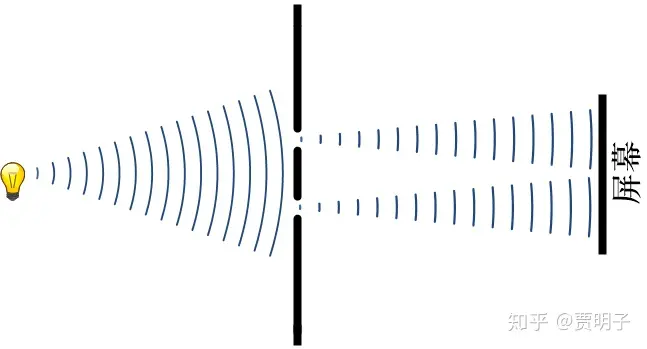
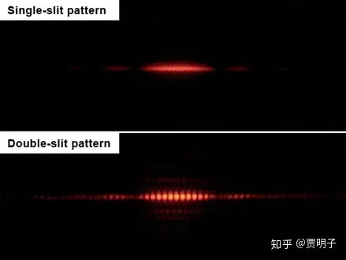

# 15、诡异的光：包含了一切量子怪异的干涉

> ***“And God said, Let there be light: and there was light.”\***
> ***“上帝说，要有光，于是就有了光。”\***
> ***- 《圣经》\***

我们看到，经典自然科学给我们描绘了一幅非常和谐优美的自然规律图景。经过了19世纪大繁荣，到19世纪末20世纪初的时候，经典科学的声望达到了顶峰。在这个阶段，无论是物理、化学还是生物，都被各种观测和应用广泛证实。在天文学中，太阳系的各大行星的运行被描述得清清楚楚，人们甚至通过理论计算预言、并因此发现了天王星和海王星；力学计算为各种复杂机械的发明铺平了康庄大道；热力学的崛起引发了伟大的工业革命，使人类有史以来迈入了最大幅的跨越；电磁定律的发现让人们认识到电能的巨大潜能，此外电磁波也被预言和发现了，人们的通讯业因此进入新时代。在化学中，各种化学品的合成层出不穷，橡胶工业、石油工业、能源工业等等都在彻底地改变人们的生活方式，它和机械工业一起，推动人类进入蒸汽时代进而进入电气时代。而在生物学中，细菌理论可算是功德无量，活人无数，一个简单的巴氏消毒法，就把过去高危的分娩变成了真正安全的天伦之乐，人类有史以来第一次大规模地战胜了疾病；狂犬疫苗、破伤风疫苗、白喉疫苗、炭疽疫苗等等让这些威胁人类生存的传染病几乎绝迹。这一切成就，都在向世人证明经典科学的伟大和正确。

在这个背景下，人们有意无意地忽略了一点事实：当时人们对物理现象的直接观测，从来就没有真正地到达过高速（与光速数量级相同）或微观（分子层面）领域。在这些从来没有被人们直接观察过的地方，经典理论是否能够保持其普适性？这一点人们并未怀疑，却从未有过直接证据。在人们熟知的经典领域，一切现象都已经洞若观火，使得人们非常笃定这就是最普遍的真理，因而乐观地推广到自己尚未了解的非经典领域，尽管在那里一切都还在黑暗之中。

然而，就在经典科学繁荣的顶峰，一些微不足道的线索[[1\]](https://zhuanlan.zhihu.com/p/51465207#ref_1)指向了一个事实：在非经典的领域中恐怕隐藏了不为我们所知的光怪陆离。这里说的“非经典领域”，就是高速世界和微观世界。向我们泄露了这两块处女地的秘密的，就是光现象，它如惊鸿般照亮了经典世界的边缘。光，这个《圣经》当中第一个被创造出来的万物，我们如此熟悉，但是在初次窥探经典之外的世界而大开眼界的我们看来，却是如此的诡异 - 这里我指的不是相对论。没错，相对论起源于人们对光的传播的研究，并且它揭示了很奇怪的现象。然而这些现象却在相对论严谨的逻辑和优美的形式理论中显得毫无违和感，人们在经历了最初的惊讶以后，便将它视为顺理成章了 – 它似乎违反常识，但是却水到渠成，只要是你理解了它背后的逻辑，就不得不相信它。

而在对光的本性 – 波动还是粒子 – 的研究中揭示出来的关于微观粒子的运动规律，却彻底挑战了人类智慧对新事物的接受能力。它前所未有地怪诞，这就是**量子理论**。

我们在第一部分的末尾部分已经初步讨论过量子现象的种种怪异之处，以及这些怪异之处对经典的决定论的冲击。我相信你一定会觉得有些奇怪，我们为何要放弃几百年间建立起来的如此和谐、如此符合直觉的经典理论，而转而建立这样一种看起来一点都不make sense的理论呢？答案很简单，因为我们所观察到的微观世界，本来就是这样的。

量子现象在历史上的首次亮相是从黑体辐射开始的，从第一次出现就已经让人感到不可思议了，以至于普朗克在提出量子的概念时，仅仅把它当做一种方便的计算手段和权宜之计，说白了就是为了符合实验数据的一种“凑数”的手段。然而随着人们陆续发现新的微观现象，人们终于认识到，微观世界，是无法用我们习惯的，来源于宏观世界经验的思维方式来认识的。这里我并不打算从量子力学的历史说起，而是向你展示一个非常简单的、然而却包含了量子世界中一切关键原理的现象：**光的干涉现象**。

我们来想象一下，如果说有一面墙，我们在墙的后面放置一面靶子，然后在墙上有一道缝隙。现在我们站在墙的前面，拿着一把冲锋枪，对着墙面扫射。我们可以假设墙的硬度很高，所有打在上面的子弹都无法穿过，因而要想打到靶子，子弹只能从缝隙中穿过去。这样在缝隙后面就会留下一个个弹孔，记录着子弹到达的位置。这时，有人站在后面（注意防弹衣！）观察靶子上弹孔出现的情况，那么他会看到什么？

很显然，他会看到，子弹是一个一个地到达靶子的，因而靶子上的弹孔是一个一个出现的，每次出现只留下一个点。

然后，他还会看到，随着弹孔数目的逐渐增多，绝大多数的弹孔都分布在墙缝背后的一个窄长条里面，中间的部分密集，两边的稀疏，偏离墙缝很远的地方就不会有弹孔。因为偏离缝隙很远的地方，子弹都被墙壁挡住了而过不去。

这种现象非常符合直觉，没有任何费解之处，你完全不必懂任何物理知识就能想象到。现在，我们改一下我们的实验，我们在墙上开两条平行的缝隙，会如何呢？没错，你会立刻想到，最后靶子上的弹孔分布密度，就是我们单条缝隙形成的弹孔分布的叠加 – 这里也没有任何奇怪之处。

那么我们来比较两次实验中在靶子上留下的弹孔的情况，无论我们怎么在墙上开缝隙，每开一道，相应地在背后的靶子就会多一道弹孔的分布。当我们关闭右侧缝隙，只留下左侧缝隙让子弹穿过时，在靶子上就会在左侧有一道弹孔的分布，反之则在右侧有一道弹孔分布。如果我们两条缝全开呢，我们会看到两条缝叠加的分布，如果我们把子弹的密度对应于它在靶子的位置做出一个密度分布曲线，那么这个分布就是一个有一定宽度的尖峰，中间密度高，然后向两侧递减。如果开一条缝隙，就会有一个尖峰，开两条缝隙，那么就是这两个尖峰的叠加：

现在我们再来把这个实验做一个改动，仍然是一堵墙，上面可以开两道缝隙。但是这一次我们不用冲锋枪扫射，我们改对着缝隙发出一列波，比如说声波或者水波 – 这里我们用水波作为例子。在墙的背后，我们用某种检测仪器来检测水波传过来的能量：水波是水面振动的传递，振动剧烈的地方，传递过来的能量就高，振动微弱的地方，传递过来的能量就低。而水波经过缝隙之后，被墙壁阻挡，后面所接收到的能量就会有空间分布的不均匀。我们假设我们的检测器是一面幕布，振动强烈的地方，幕布就会亮起，而微弱的地方，幕布就比较暗 – 这就像是前面用来检验子弹位置的靶子一样，只不过我们用振动强弱而不是用弹孔来做出检验。

很显然，和冲锋枪不同的是，我们在背后检测波强度的时候，不会像冲锋枪那样一次只看到一个弹孔，然后这些弹孔依次出现，渐渐形成弹孔在靶子上的分布图样。我们总是会检测到背后检测器上连续地接收到波的振动能量，它的分布总是连续的，而不是像弹孔那样一个个离散的点。但是有一个和冲锋枪很相似的地方，那就是在缝隙的背后我们可以检测到一个狭窄的能量分布：正对缝隙的位置振动最强烈，而距离缝隙越远，波的振动就越弱。用我们的能量检测幕布看起来，就是一条狭窄的光斑，就好像靶子上弹孔的分布密度似的。总是在缝隙的正后方接收到的能量密度最强。（在冲锋枪实验中，总是在靶子的正后方接收到的弹孔密度最强）。

当然，和冲锋枪的情形一样的是，不论我们是打开左边的缝隙还是右边的缝隙，在墙的背后水波的传递不会有任何区别，我们除了发现光斑位置发生了偏移之外，没有任何不同：检测到的振动强度分布都是一样的，所不同的只不过是在幕布上的位置变化而已。

如果我们把幕布接收到的能量密度按照位置画出分布曲线的话，它就是和靶子上的弹孔很相似的有一定宽度的尖峰。左缝和右缝对应的尖峰位置不同，但是形状是相同的。于是我们感到，水波和冲锋枪在缝隙背后的传递行为十分相似。

然而波动和子弹的行为毕竟有所不同。当两条缝同时开放的时候，情况就很不一样了。波动和子弹这样的质点或粒子不同，波是连续地弥散在空间的，不像子弹那样独占一个特定的空间，它们可以**叠加**。两列波相互叠加起来，就形成了类似下图的波动，很显然，叠加的结果使得在幕布上接收到的能量密度分布与两列波单独打在屏幕上直接相加不同。

例如当我们同时向水面不同的地方抛出两块石头时，它们就会激起两个不同的涟漪。这两个涟漪向外扩散，然后重叠，于是整个水面的波动就是这两个涟漪的直接叠加 - 这和子弹不同，两个子弹从来就不可能叠加在一起。当空间中的两列波叠加在一起的时候，无可避免地就会有的地方是波峰与波峰叠加，有的地方是波峰与波谷叠加。也就是说，在某一时刻、某一地点的两列波传递过来的振动可能不是同步的。在波峰和波峰叠加的地方，两列波激发的振动恰好是同方向的，于是振动就会更加强烈 - 波动的能量在这一地点就会增强。在波峰和波谷叠加的地方，两列波激发的振动恰好相反：一列波使水面向上振动时，另一列恰恰使它向下振动，于是它们就互相抵消掉了，此时振动就变弱，甚至消失，因此波动的能量就会减弱甚至消失。绝大多数情况下，这种波动的增强和减弱并不稳定，同一个地点传过来的波动有时候相互增强，有时候相互抵消，因而水面上就形成了杂乱无章的波动。但是在某种特定的情况下（两列波振动的频率和波长相同，并且保持稳定传播），我们会得到这样一种状况：在空间的某些区域，两列波**总是**互相增强的，而在另一些区域，它们**总是**相互抵消的，而不随时间变化。这样一来我们就在空间看到了一种稳定的增强区域和抵消区域的分布，形成一种花纹，这就叫做波的**干涉**。也就是说，波动的直接叠加导致了波动能量并不总是相加，在波动相一致的地方，能量是相加的，而在波动相互抵消的地方，能量则会减弱甚至消失。在我们的例子里，它看起来就是这样的：

当我们把墙上的两条缝同时打开时，波动就会**同时**从两条缝隙中穿过，然后在墙壁的背后相互叠加起来。而这种叠加就恰好满足干涉的条件。于是，有的地方振动抵消，有的地方振动加强：两条缝隙的背后就形成了干涉花纹。于是我们在后面的幕布上接收到的能量，就不再是两条单缝传递过来能量的简单相加，而是经过干涉以后分布的“条纹”。如果我们把背后的波动强度分布画出来，它就像下图这样子，其中绿色和橘色的两个尖峰是如果我们仅仅开启一条缝隙的时候，左缝和右缝背后的波动能量分布，而黑色的曲线则是当我们同时开启两条缝隙时，我们测得的波动能量分布。从这个图形中我们可以看到，两条缝隙同时开启时，波动的能量分布并不等于两个缝隙单独开启时的简单叠加。在有的地方，明明每条缝隙向它传递的能量都很强，但是他们相互抵消后，却变得很弱甚至消失了 – 于是在幕布上就产生了一条暗纹。

产生这种干涉现象的关键就是，第一，波是可以**叠加**的，第二，波的振动在不同地方**同步性**是不变的（用物理术语说，有稳定的相位差）。叠加使得两列波在空间中能够互相重叠，因而它们所激发的振动就是这两列波的综合效应；而这两列波的振动频率必须保持一致，这样它们传递到不同位置的时间差所造成的振动步调差别就总是一样的，同步的地方总是同步，而相反的地方总是相反。就好像你们跳绳的时候，两个抡绳子的人如果抡的频率一致并且步调相同，那么绳子就会稳定地抡起来；如果频率一致但是步调相反，那么绳子就总是抡不起来；无论如何绳子总是稳定的。但是如果两个人的频率不一样，那么就乱了，两人有时候恰好同时向一个方向抡，那么这时候绳子就抡起来了，而有时候一个向左一个向右，绳子就停下了，于是乎，如果频率不一致，绳子就会乱七八糟。

水波恰恰满足这两个条件，这是因为它是同一列波同时穿过两条缝隙之后在背后重新叠加起来的，因而它们频率一致，相位差稳定，所以就能形成干涉。

到此为止，一切都非常和谐和正常，它们都没有超出经典物理学的范畴。但是，当我们拿一道光照射这堵带有缝隙的墙的时候，一切就突然变得令人无比费解了。这个就是著名的光的**双缝干涉**。

双缝干涉的实验与我们前面的这两个例子非常相似，我们把一面不透光的“墙”上面开两个小缝隙，然后用一道激光照射这两条缝[[2\]](https://zhuanlan.zhihu.com/p/51465207#ref_2)，于是光就透过两条缝隙照射到后面的屏幕上，然后我们就可以观察屏幕上的光斑，整个实验大致如下图所示：

实验结果如下：

***上面这张图就是屏幕上的光斑的样子（图片来自Jordgette，原图在维基百科 ）***

[File:Single slit and double slit2.jpgcommons.wikimedia.org/w/index.php?curid=9529698%EF%BC%89%E3%80%82](https://link.zhihu.com/?target=https%3A//commons.wikimedia.org/w/index.php%3Fcurid%3D9529698%EF%BC%89%E3%80%82)

上面的图片是只有一条缝的时候光斑的样子，而下面的图片则是两条缝全部打开时光斑的样子。我们可以清晰地看到光的干涉现象。这个实验毫不含糊地证明了，光是一种波。的确，我们曾经说过，电磁理论表明光就是一种电磁波。事实上，用电磁波的波动方程计算一下，得到的结果确实与实验得到的条纹十分一致：条纹的宽度、间距，个数等等都和理论预言相当一致。

然而，这背后却隐藏着一个不容易被发现的大炸雷。在实验中，我们可以把光源减弱，弱到一定程度以后，在屏幕上就出现了一个不可思议的现象：光的粒子性。当我们不断减弱光源的时候，例如我们在光的传播路径上插入一个半透明的墨镜片，屏幕上的光斑就会变暗 – 这是当然的，并没有什么奇怪。随着光源的不断减弱，光斑就会不断变暗，按照这种规律，你可能会预期光源减弱一直到熄灭的过程中，屏幕上的光斑也会一直变暗，直到消失。这是波的性质决定的，能量是弥散在空间的、连续的。然而在实验中，当光源非常暗的时候，并不是光斑整个消失了，而是变成了一个个的光点，整个光斑就是这些光点构成的。如果我们把每个光点的位置记录下来（例如用感光胶片），我们就会发现，屏幕上接收到的光点，是一个接着一个不连续地出现的。就好像光源是一把特殊的冲锋枪一样，这把枪向外打出的，不是一个一个的子弹，而是一个一个的光子。每个光子打到屏幕上，都会在它上面留下一个小小的光点，就好像是子弹在靶子上留下一个弹孔一样。当光源足够弱的时候，人们在胶片上看到光子留下的痕迹，就是次第出现的一个个“弹孔”。

这不可能是波的性质！波总是分布在空间的一个连续场，怎么会是一个个地出现呢？看起来它更像是一个个的粒子 – “光子”，不断打击到屏幕上。

那么，我们持续观察屏幕上光点出现的情况，那么我们会看到什么事情呢？

首先，当我们只开启一随便哪一个缝隙的时候，我们都会发现，像子弹一样，光子会一个一个地打过来，在屏幕上留下一个一个小点。随着时间的增加，光点一个个增加，渐渐形成一个分布。这个光点分布的密度和子弹的分布看起来也非常像，在缝隙的正后方，我们得到的光子密度最高，远离缝隙则密度减弱，最终会形成一条竖条纹的分布。不论我们打开哪一条缝隙，都会出现一模一样的条纹。当光强增加的时候，大量的光子同时打在屏幕上，就形成了光斑。

如此看来，光不可能是波，而应该是粒子。难道电磁理论错了吗？干涉条纹又是怎么一回事？

这时候，我们把两条缝都打开，如果光是像子弹那样的粒子的话，顺理成章地猜想，我们会期望最后会得到叠加在一起的两道条纹。但是事实上却不是如此。当我们记录这些光点出现的位置和时间时，我们发现这些光点一个个无规律地先后出现，渐渐积累起来，最终形成的却是很多条明暗相间的条纹，就好像是波动发生的相互干涉一样，如下图所示***（图片来自维基百科“双缝干涉”词条，图片原作者Tonomura博士）。***

怎么会是这样？！光子单独行动的时候，就像是子弹一样一粒一粒的，但是大量的光子综合起来，最终形成的却是像波一样的干涉图样！光到底是粒子，还是波？

如果说，光就是想水波那样的波动的话，我们很容易解释干涉图样，但是，波动是弥散在空间的，它最终照射在屏幕上的强度是连续的，不可能是像实验中发现的那样，是一粒一粒地到达屏幕的。而如果光是像子弹那样的粒子的话，这虽然符合我们看到的光点一个个出现的现象，但是干涉又是怎么回事？因为像子弹那样的粒子是不可能同时穿过两条缝隙的，也是不可能互相叠加的，无法叠加怎么会出现干涉条纹？

对于子弹来说，子弹穿过一条缝隙，在背后留下一个弹孔。这个弹孔出现的位置是一个范围，每个位置都有某个出现的概率。我们来看子弹打到靶子上某个特定位置的概率。**因为子弹打到这里，要么是穿过第一个缝隙，要么是穿过第二个缝隙，不存在其它可能，**如果子弹穿过第一个缝隙打到靶子上某个特定位置的概率为P1，而穿过第二个缝隙打到同样的位置的概率为P2。那么最终打到该位置的概率就是（P1+P2）， 也就是说，两条缝隙形成的弹孔的密度必然是直接叠加的。而现在我们发现，光子的行为完全不同，比如说在一个干涉暗纹的位置上，光子穿过这两个缝隙到达这里的概率都不为零，但是两个缝隙全开之后，它反倒变成零了！

也就是说，明明一个光子分别通过任意一条缝隙都可以到达这个位置，可是如果当它面对两条通畅的缝隙可选择的时候，它却不再能到达这里了。就好像是说，我们家的前面锁了，你可以从后面进屋；后门锁了，你可以从前门进屋。而现在，前后门都打开了，你反倒进不了屋了！

我们前面计算的概率看不出哪里出现了问题，除非，我们所说的，“**要么是穿过第一个缝隙，要么是穿过第二个缝隙，不存在其它可能**”这个对子弹的前提用在光子上面是错误的。当然，无论如何，光子只能是从缝隙中穿过的，那么唯一可能的错误就是，光子并不是穿过了某一条缝隙，而是“同时”穿过了两条缝隙！如果光本身就是波，这个毫无问题，可是，如果它是一个粒子，怎么可能同时穿过两条缝隙？

你可能会这样想，是不是有可能大量的光子穿过各自的缝隙之后，互相干扰碰撞，最终导致了条纹的变化？这也不对，因为实验中的光之是**一个接一个**打过来的，不会同时有两个光子出现，因而就不存在光子之间相互碰撞的情况。除非它能够分裂成两个，同时穿过两条缝隙，然后自己与自己碰撞，真是见了鬼了。

那么，会不会光子本来就不是一个不可分割的微粒，而是本来就可以分裂、重组？一个光子经过双缝时，它分裂成两片，各自穿过一条缝隙，然后在缝隙后又重新“拼”成一个光子了呢？这也不对，因为我们无论如何观察，从来就没有能够真正看到一个光子同时出现在两个位置，它总是一次“整个儿”出现在一个位置，而不会分成几个碎片在几个地方同时出现 - **在我们观察它的时候，它总是一个不可分割的粒子。**只有在我们不试图观察它的位置时，它才以某种神秘的方式“同时”穿过两条缝隙。

现在我们被迫要这样看待光子的行为：它在传播过程中，**表现得**就像是一个波一样，它可以同时穿过两条缝隙，然后自己跟自己叠加，发生干涉。而当我们观察它的时候，它**表现得**像一个粒子，它总是一个一个独立地出现在某一个特定的位置，而不可能同时出现在不同的地方，也不会弥散在空间的一个范围中。然鹅它不可能是一个波，因为波不会出现后者的行为，它也不可能是一个粒子，因为粒子不会自己与自己叠加干涉。它只不过有时候表现得像一个波，有时候表现得像一个粒子而已。这个，在量子力学的早期，被叫做“**波粒二象性**[[3\]](https://zhuanlan.zhihu.com/p/51465207#ref_3)”。

好吧，我们可以暂时压下这种怪异引起的心理不适感，认可光子就是这样的 – 因为我们观察它就是这样的。但是，它何时像一个波，又何时像一个粒子呢？从这个实验看来，似乎这里起到关键作用的，就是“观察”。当我们不观察它的时候，它就像是一列波一样传播，弥散在空间中，可以分裂，可以叠加，可以干涉。但是当我们试图观察它“粒子”的性质 – 位置的时候，它突然变幻自己的行为，从弥散在空间的分布突然缩成一点，变成了一个粒子。它像一个波，还是像一个粒子，完全取决于我们的观察。我们观察它的粒子性质时，它就表现得相个粒子，我们观察它波动性质时，它就表现得像一个波。似乎是它能够未卜先知，知道我们心中所想，然后提前调整自己的行为来配合我们的观察一样！

科学家根据波动方程可以计算出光作为一个波的传播过程。如下图就是一个光子的波包 – 你这里暂时可以把它看做是一个空间中的波峰。我们可以清楚地看到，这个波包是如何同时穿过两条缝隙，被缝隙“打散”、“搅乱”，然后在空间中分散开来，在不同的位置形成不同的强度分布的过程。我们可以看到，当它经过双缝之后，在空间各处都有“强度”分布，有的穿过然后干涉，有的则被墙壁反射回去。整个过程可以完整地被波动性质描述。然而，明明它本来弥散在空间中无处不在，当我们观察它出现在哪一个位置的时候，空间中的这种分布却瞬间重新“聚集”成一点，变成一个粒子 – 这个波从整个空间的弥散状态“**坍缩**”成为一个点了。这个，就是我们在第一部分中提到的，波函数坍缩。

那么这个波绝对不可能是光子的“真正”形态，一个光子不可能同时出现在空间的各处。事实上，就如第一部分所提到的，这个波不是一个实际的物理的波，而是一种抽象的“**概率波**”。

[贾明子：18、量子：确定性和不确定性239 赞同 · 42 评论文章](https://zhuanlan.zhihu.com/p/28589770)

这个波动在空间某处的强度并不是实际光子的“一部分”出现在那儿，而是代表了光子出现在那儿的概率大小。上面的图中，亮斑显示的不是光子的实际形态，而是电子在空间分布的可能性，越亮的位置，光子出现的概率就越大，而黑暗的部分，光子就不会在那儿出现。这个波从光源发出，穿过双缝到达屏幕的整个过程，波函数所描述的演化是光子在空间出现的概率。

那么，既然波函数传播的是光子在空间中出现的概率，那么，这个概率是什么？按照经典概率的诠释，概率就是我们对某个事件的无知度。按照这种看法，在某个时刻，波函数只能告诉我们光子的大略位置，而光子的“真实”位置是一个我们无法获知的状态。但是，如果粒子真的存在一个“真实”确定的位置的话，我们是不可能获得干涉的，要知道，“要么穿过一个缝隙，要么穿过另一个缝隙”本身就使得干涉成为不可能。干涉的条件要求光子必须能够“同时”处于空间的各个位置。

所以，我们必须要承认，前面的这种经典概率诠释，肯定是在哪个地方出错了。在我们不观察光子的时候，它没有位置。它不在空间任何一个地方，而且同时在空间的任何一个地方。只有在我们观察时，它才随机地从空间中选取一个位置出现。这种随机性是真正的随机，而不是经典概率中的那种**确定的但是我们不知道**的状态。

这个结论看起来如此荒谬，它非常非常地不像是真的。我们为何不进一步做一些实验，把光子在空间中“实际”走的路径找出来呢？比如说我们在两个缝隙边上分别放上一个检测器，用来记录光子到底是从哪个缝隙穿过。很显然，我们无论如何观察，最后的结果总会有这样四种可能，而不可能有其它可能性：

1、我们看到它从第一个缝隙经过（我们叫做缝A）；

2、我们看到它从第二个缝隙经过（我们叫做缝B）；

3、我们看到它同时从两个缝隙经过；

4、我们在哪个缝隙中都看不到。

事实上，如果我们看到第四种结果，很显然这意味着光子没有穿过缝隙，它被墙壁反射回去了，因而就不会再墙壁留下光斑。这种情况对我们的干涉条纹毫无用处，因而我们不予考虑。剩下的三种结果，我们从来就没有观察到过第三种情况，也就是说，它总是从双缝中任选其一。这在我们前面提到过：我们所观察到的光子总是不可分割地出现在空间中的一个位置。也就是说，最后观察到的，能够影响光斑的光子，确实是要么从A缝经过，要么是从B缝经过的。然而，最令人迷惑的现象出现了：当我们架设好测量仪器，试图监控光子从哪一个缝隙穿过的时候，**干涉条纹却神秘地消失了**！

也就是说，当我们不去关注光子从哪一条路径穿过的时候，光子似乎是以一种神秘的方式同时穿过两条缝隙，然后自己与自己发生干涉，形成干涉条纹 – 这令人怀疑光子到底是如何穿过缝隙的；然而当我们试图躲在每条缝隙的背后观察光子的时候，我们的确能够偷窥到光子到底走的是哪一条缝隙，然而，此时光子的干涉就消失了。甚至说，我们不需要真的偷窥到光子，我们只要是试图偷窥光子 – 它路径信息有泄露的可能，光子的干涉就会消失。

的确，干涉要求光子必须能够“同时”经过两条缝隙然后自己与自己干涉，因而当我们能够确知它走了哪一条缝隙的时候 – 也就是说我们能够获得路径信息的时候，干涉就不可避免地消失掉。因而，路径信息和干涉条纹是两个互斥的信息，知道路径信息就必然观察不到干涉，而如果干涉存在，我们就必然不可能知道路径信息。这在数学上必须是这样的，但是，为何我们的观察能够选择到底是路径信息还是干涉条纹哪一种信息得以保存？难道它不应该是光子自己表现给我们看的吗？光子是如何知道我们在试图观察它的呢？

还有更大条的问题：不只是光子，我们发现，构成我们世界的**一切**粒子，都有这种性质。

**下一章：[贾明子：16、躲猫猫的猫：薛定谔猫怪异在何处？](https://zhuanlan.zhihu.com/p/51716696)**

**上一章：[贾明子：14、自然科学的经典时代](https://zhuanlan.zhihu.com/p/51080213)**

**专栏传送门：[何为现实？拉普拉斯之妖与薛定谔猫之决战](https://zhuanlan.zhihu.com/c_186387023)**

------

## 参考

1. [^](https://zhuanlan.zhihu.com/p/51465207#ref_1_0)这就是卡尔文爵士1900年演讲中著名的比喻“晴朗的天空中飘着两朵乌云。” 这两朵乌云一朵是以太的实验证据的缺失，另一朵是黑体辐射。人们始料不及的是，开尔文爵士话音刚落，这两朵乌云就突然电闪雷鸣，彻底颠覆了物理学的晴朗天空。开尔文爵士真可谓物理学史上最伟大的预言家，他指出的两朵乌云的背后，隐藏的是现代物理学的全部：相对论和量子力学。它们包含了高速和微观领域的秘密。
2. [^](https://zhuanlan.zhihu.com/p/51465207#ref_2_0)我们可以自己来做这个实验，这个实验的难处在于两条缝隙都必须非常细，而且靠得很近，缝隙的宽度大约小于0.1mm，而两条缝的间距也必须小于零点几个毫米。
3. [^](https://zhuanlan.zhihu.com/p/51465207#ref_3_0) 无论是“波”，还是“粒子”，都是宏观世界的概念。所谓波粒二象性，其实是在用宏观的概念去类比微观的行为，难免不伦不类。从现代的眼光来看，这个概念已经越来越不重要了。但是在科普或教育中，它仍然可以很形象地向人们展示微观粒子的与众不同之处。

发布于 2018-12-03 17:49・IP 属地未知

