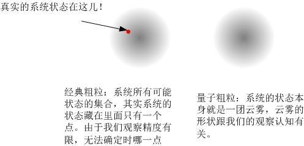

# 16、躲猫猫的猫：薛定谔猫怪异在何处？

> ***“The task is not so much to see what no one has yet seen, but to think what nobody has yet thought about that which everybody sees.”\***
> ***“我们要做的不是去见前人所未见，而是从人人所见中想前人所未想。”\***
> ***- 薛定谔\***

网上流传着一段很有意思的关于科学家的八卦，在多次转载之后已经找不出它最早出自谁手了，我这里摘录如下：

> *一、*
> *巴黎。*
> *一样的延续着千百年的灯红酒绿，香榭丽舍大道上散发着繁华和暧昧，红磨坊里弥漫着躁动与彷徨。*
> *而在此时的巴黎，有一个年轻人，名字叫做德布罗意（DeBroglie），从他的名字当中可以看出这是一个贵族，事实上德布罗意的父亲正是法国的一个伯爵，并且是正是一位当权的内阁部长。这样一个不愁吃不愁穿只是成天愁着如何打发时光的花花公子自然要找一个能消耗精力的东西来磨蹭掉那些无聊的日子（其实象他这样的花花公子大约都会面临这样的问题）德布罗意则找到了一个很酷的“事业”——研究中世纪史。据说是因为中世纪史中有着很多神秘的东西吸引着这位年轻人。*
> *时间一转就到了1919，这是一个科学界急剧动荡动着的年代。就在这一年，德布罗意突然移情别恋对物理产生了兴趣，尤其是感兴趣于当时正流行的量子论。具体来说就是感兴趣于一个在当时很酷的观点：光具有粒子性。这一观点早在十几年前由普朗克提出，而后被爱因斯坦用来解释了光电效应，但即便如此，也非常不见容于物理学界各大门派。德布罗意倒并不见得对这一观点的物理思想有多了解，也许他的理解也仅仅就是理解到这个观点是在说“波就是粒子”。*
> *或许是一时冲动，或许是因为年轻而摆酷，德布罗意来到了一派宗师朗之万门下读研究生。从此，德布罗意走出了一道足以让让任何传奇都黯然失色的人生轨迹。*
>
> *二、*
> *历史上德布罗意到底花了多少精力去读他的研究生也许已经很难说清，事实上德布罗意在他的5年研究生生涯中几乎是一事无成。事实上也可以想象，一个此前对物理一窍不通的中世纪史爱好者很难真正的在物理上去做些什么。白驹过隙般的五年转眼就过去了，德布罗意开始要为他的博士论文发愁了。其实德布罗意大约只是明白普朗克爱因斯坦那帮家伙一直在说什么波就是粒子，（事实上对于普朗克大约不能用“一直”二字，此时的普朗克已经完全抛弃自己当初的量子假设，又回到了经典的就框架。）而真正其中包含的物理，他能理解多少大约只有上帝清楚。*
> *五年的尽头，也就是在1924，德布罗意终于提交了自己的博士论文。他的博士论文只有一页纸多一点，不过可以猜想这一页多一点的一份论文大约已经让德布罗意很头疼了，只可惜当时没有枪手可以雇来帮忙写博士论文。*
> *他的博士论文只是说了一个猜想，既然波可以是粒子，那么反过来粒子也可以是波。*
> *而进一步德布罗意提出波的波矢和角频率与粒子动量和能量的关系是：*
> *动量＝普朗克常数/波矢*
> *能量＝普朗克常数\*角频率*
> *这就是他的论文里提出的两个公式*
> *而这两个公式的提出也完全是因为在爱因斯坦解释光电效应的时候提出光子的动量和能量与光的参数满足这一关系。*
> *可以想象这样一个博士论文会得到怎样的回应。*
> *在对论文是否通过的投票之前，德布罗意的老板朗之万就事先得知论文评审委员会的六位教授中有三位已明确表态会投反对票。*
> *本来在欧洲，一个学生苦读数年都拿不到学位是件很正常的事情，时至今日的欧洲也依然如此。何况德布罗意本来就是这么一个来混日子的的花花公子。*
> *然而这次偏偏又有些不一样——德布罗意的父亲又是一位权高望众的内阁部长，而德布罗意在此厮混五年最后连一个Ph．D都没拿到，双方面子上自然也有些挂不住。*
> *情急之中，朗之万往他的一个好朋友那里寄了一封信。*
> *当初的朗之万是不是碍于情面想帮德布罗意混得一个PhD已不得而知，然而事实上，这一封信却改变了科学发展的轨迹。*
>
> *三、*
> *这封信的收信人是爱因斯坦。*
> *信的内容大致如下：*
>
> *尊敬的爱因斯坦阁下：在我这里有一位研究生，已经攻读了五年的博士学位，如今即将毕业，在他提交的毕业论文中有一些新的想法……*
> *请对他的论文作出您的评价。*
> *另外顺便向您提及，该研究生的父亲是弊国的一位伯爵，内阁的**部长，若您……，将来您来法国定会受到隆重的接待。*
>
> *朗之万在信中，大约朗之万的潜台词似乎就是如果您不肯给个面子，呵呵，以后就甭来法国了。*
> *不知是出于知趣呢，还是出于当年自己的离经叛道而产生的惺惺相惜，爱因斯坦很客气回了一封信，大意是该论文里有一些很新很有趣的思想云云。此时的爱因斯坦虽不属于任何名门望派，却已独步于江湖，颇有威望。有了爱因斯坦的这一封信，评审委员会的几位教授也不好再多说些什么了。*
>
> *于是，皆大欢喜。*
>
> *浪荡子弟德布罗意就这样“攻读”下了他的PhD（博士）。*
> *……*

这段故事可能是迎合了广大学渣的八卦猎奇、以及“我要是纨绔子弟我也行”的loser心态，在网上流传甚广，甚至在很多主流的门户网站上都能找到它。的确，它很有戏剧性，但是，它是一个**不负责任的谣言**。

我不知道这段文字的始作俑者当初是出于何种心态编织了这个谎言，但是**我愿意以最大的恶意诅咒此人。**如此毫无底线地抹黑一个伟大科学家的声誉，已经不能单纯地用恶作剧来形容了。这个故事中，只有几件事是对的：

- 德布罗意出身贵族
- 德布罗意在博士论文中提出了**物质波**的概念
- 德布罗意的博士论文让答辩委员会很为难，因为没有人能够评价它 – 它的观点实在是太新了。郎之万本人十分欣赏这个观点，但是感觉拿不准，因而委员会询问爱因斯坦的意见，获得了爱因斯坦的极力赞赏，被称为“揭开了神秘幕布的一角”。德布罗意因而顺利通过答辩。

这件事告诉我们，**对网络流传的过于戏剧性的东西，一定要有抵抗力**。事实上，德布罗意自幼聪慧，学习成绩优秀，有过目不忘之能。他在求学的时候先是主修历史，然后改修法律。但是后来他发现自己真正感兴趣的是物理 – 这是受其哥哥影响，他父亲早亡，是他哥哥，一个物理学家，将其抚养成人 - 于是决定半道出家，同时选修了理论物理专业作为第二学位。即使经过这些波折，他仍然在21岁时获得了物理学学士学位（即1913年，而绝非上面谣言中所说的，他在1919年才决定半路出家）。随后第一次世界大战来临，他进入军队，成为无线电通讯兵，5年后，一战结束，他得以重返物理界攻读博士学位。在他32岁的时候，他完成了这段谣言中所谓的“一页纸的博士论文”。当然，这篇论文绝非如此不堪，它的英译本有至少有70多页，专业性极强，并且其重要性可算物理学史上的里程碑之一。

在这篇论文中，德布罗意提出了物质波的概念 – 它有时候也会以它的提出者命名，被称作“**德布罗意波**”。什么是物质波呢？我们在上一章已经介绍了光的波粒二象性，这里，德布罗意把它推广到一切微观粒子，甚至，一切宏观物质。也就是说，所有的微观粒子都有这种波粒二象性，例如电子、质子、中子等等。或者广泛地讲，所有的宏观物质都同时是一种波，不仅仅限于微观粒子，诸如子弹、桌球、汽车、乃至地球、太阳等等。只不过，随着物体的尺度越来越大，它的波动性就越来越弱，以至于宏观物体的波长如此之短以至于我们根本无法觉察。

那么德布罗意到底怎么就想到要把波粒二象性推广到一切微观粒子的呢？这可能是出于这样一种动机：这种推广使得原子模型更加合理。

当时人们已经发现，原子是由一个原子核以及原子核周边的电子构成的。电子一开始被认为是一种经典的微粒，它带有负电，在带正电的原子核的吸引下必然要围绕原子核做高速运动 – 就好像地球在太阳的吸引下围绕太阳旋转那样。但是这种模型却有着致命的缺陷。首先，绕核运动的电子无时无刻在做变速运动，这种运动必然要向外辐射电磁波。电磁波会向外带走能量，因而电子能量损失后就必然向着原子核靠拢，最终会“坠毁”在原子核上，因而这种原子就不可能稳定。其次，按照这种模型，电子的动能可以是一个连续区间内的任意值：它可以运动得快，这样它就距离原子核更近，它也可以运动得慢，这样他就距离原子核更远。但是，在人们从原子光谱的研究当中，电子运动的快慢并非可以任意取值的，在原子中只能有几个离散的动能，电子只能从中选取。就像是你们的化学课中所讲，电子在原子中是“分层”的，每“层”都有着属于本层的一个特定动能 – 能级。电子可以在不同的能级之间跳跃（**跃迁**），但是它却永远不通在两个能级之间。

玻尔提出了一个原子模型，在其中他假定了电子的能量必须是离散的。虽然这个模型大获成功，预言了很多实验现象，但是他却无法回答这样的问题：到底是什么原因，使得电子被禁止连续的能量，而只能拥有几个特定值呢？

德布罗意受到驻波的启发，提出了一个解决方案。什么是驻波呢？我们可以用一个绳波来作为例子。当我们挥动一根绳子时，这种挥动就会以波动的形式沿着绳子传播出去。如果绳子时自由的，绳波的形状就取决于我们挥动的频率：它可以密集也可以稀疏，而我们的频率是随意的，连续可变的，想多快就多快，而没有任何限制。

这时，如果我们把绳子两端固定下来绷紧，会怎么样呢？我们可以想象一根紧绷的琴弦，当我们拨动它时，琴弦就开始振动。但是由于琴弦的两端是固定的，因而这种振动的波长必然只能是琴弦的整数等分，而不可能是其它任何数值。当我们调紧或调松这根弦的时候，这种等分数就会有所不同，因而弦发出的音调就会有所变化 – 这就是吉他为何会奏出音调千变万化的音乐。但是不论如何，弦的长度总是被它的波长等分：也就是说，频率在这种情况下只能有离散的值可取，而不可能是其它的值。

事实上，琴弦的这种振动也是它的波动与自身干涉的结果。当我们从中间波动琴弦时，这个波就会沿着琴弦向两端反向传播。这种向外传播的波，总是沿着琴弦“行进”的，被称作**行波**。行波到达固定的端点后，就会被射回来。于是反向行进的两列行波就变成同向传播，在琴弦上相遇，然后互相叠加在一起，形成干涉。如下图的两列相反方向行波之间的干涉：

于是这两列反向传播的行波就这样反复反射、叠加，形成干涉，干涉的结果就是琴弦有的地方振动总是增强，有的地方总是减弱或消失，这种波动就在整个琴弦上呈一种固定的分布，而不会变化，总的效应就是，这列波不再行进，而是被“固定”在两端：它好像是停驻在琴弦上了。这就是**驻波**。

*（以上两个图形均来自网络，原作者美国宾州大学Daniel A. Russell。原图地址是：[Reflections from Impedance and the Standing Wave Ratio](https://link.zhihu.com/?target=https%3A//www.acs.psu.edu/drussell/demos/swr/swr.html)）*

两端自由和两端束缚所产生的波动就是这样不同：自由的波的波长是自由的，连续的，可以取任意值；而驻波的波长就只能是弦长的等分，它只有几个特定的、离散的数值可以存在。于是德布罗意意识到，电子就是这种被束缚在原子核周围空间的“琴弦”，这种束缚力与琴弦两端的固定端点相类似，来自原子核对电子的吸引力。距离原子核的远近不同就代表着原子核对电子束缚的强弱不同，因而它们就可能表现出波长的不同等分。你可以想象把上图中的琴弦弯成一个圆，把两个节点固定在一起的样子[[1\]](https://zhuanlan.zhihu.com/p/51716696#ref_1)：

如果电子是一种波的话，那么它在原子内部的这种离散性就得到合理解释了：它跟琴弦一样，只不过是**被原子核束缚的一团驻波**。我们这样就可以很形象地把一个原子周围的电子表示成这样的样子[[2\]](https://zhuanlan.zhihu.com/p/51716696#ref_2)：

这就合理地解释了电子的“分层”结构。在原子中，由于电子波被束缚在一定的空间里，它反复地与自身干涉，最终就只能容纳下可以被“等分”的电子波。所有那些波长不是“等分”的波，在自身与自身的干涉过程中都消失了。而每一种等分，就对应着一种电子的能量。这就是最早普朗克提出量子假说的时候的最基本关系：能量正比于它的波动频率：

$E=h\nu$

这个假说看似只是推广了光的波粒二象性，但是它的影响却是爆炸性的。它指出，不仅仅是光，一切物质都有这种怪异的行为！如果说光的双缝干涉在我们眼前把量子世界的大门打开了一条缝隙让我们得以窥视其后的一点点风景。而现在德布罗意的物质波把这扇大门彻底地推开了 - 然后我们满眼光怪陆离。根据物质波的推论，具有波粒二象性奇怪举止的不仅仅是光，而是一切微观粒子 – 甚至理论上宏观物体也会发生干涉现象，只不过它太难发生了因而我们在实际中无法观察到。

德布罗意的假说很快就得到了证实：人们做出了电子的干涉实验。这个实验的原理与光的双缝干涉非常相似，只不过它不是被缝隙干涉，而是被晶体的晶格所干涉的 – 因为现实中要实现电子的干涉需要的缝隙极小，没有什么实际的缝隙可以做到这一点。于是，物质波就成为一种被大家普遍接受的概念确立了。而正是由于物质波的确立，促使薛定谔提出了以他名字命名的方程，**薛定谔方程**。薛定谔方程描述了所有物质波的波动性质，成为量子力学的基本方程。于是，现代量子力学就建立起来了。

人们有了波动方程，对波动的性质做出了严格的描述，但是人们仍然不知道这种波到底是何种波。于是玻恩提出了概率波的诠释，我们可以回顾一下第一部分中关于概率波的讨论，

[贾明子：18、量子：确定性和不确定性239 赞同 · 42 评论文章](https://zhuanlan.zhihu.com/p/28589770)

这里我就不再详细解说了。

概率诠释的提出，可以算是量子力学发展的一个分界点：在它之前，人们不断地发现各种违反人们认知的量子现象，并且众志成城地努力对这些量子现象提出解释。大家虽然不清楚量子现象背后的物理机制，但是都一致认可了经典理论的失效，并且试图在颠覆旧理论，建立新理论。而在它之后，量子力学的形式理论系统化地建立起来了，物理学进入了快速发展的轨道，各种现象不断被解释，然而对这种形式理论的**诠释**却出现了大分裂，科学家们分化成为两大阵营：同意它的和不同意它的；或者更严格地说，认为它是**基本定律**的，和认为它只是一种**表象**的。这两个阵营开始了一场史诗级别的大论战，这场论战旷日持久，并且其深度涉及到物理学的最基础的部分，并且战火熊熊燃烧至哲学领域，这在整个科学史上可算独一无二，直至今日已经一百多年过去了，硝烟仍未散去。可能在哲学史上，只有理性主义和经验主义之争能与此相比。

这两个阵营的主帅，一方是**爱因斯坦**，另一方是**玻尔**。

我们先来看看这个争论的核心问题到底是什么。它集中在“波粒二象性”的本体论含义，以及当我们对它进行测量的时候到底发生了什么，也就是著名的**“测量问题”（measurement problem）。**

从双缝干涉中我们已经看到，在我们不观察光子的时候，它以一种波动的形式在空间传播：

- 它的概率同时弥散在空间各处；
- 它可以叠加；它以薛定谔方程的规则传播、演化；它的一切性质诸如波长、频率、相位等可以严格地由薛定谔方程计算出来；
- 它可以同时穿过两条缝隙，然后自己与自己叠加，发生干涉。

然而，当我们观察它时，我们却总是只看到出现在空间中一个位置的粒子：

- 它是是一整个的、离散的、不可分割的；
- 它不会同时出现在空间各处，不会分裂成几个“碎片”，它有着粒子的性质，它有能量，正比于频率；它有动量，反比与波长，但是我们无法同时确定它的位置和动量，位置越确定，动量就越不确定。
- 它当然不可能同时穿过两条缝隙，也不可能自己与自己叠加；

那么，到底是什么，使得粒子在这两种怪异的、互不相容的性质之间来回切换？

这一切，全都发生在我们观察粒子的那一刻，因而观察在这其中起到极关键的作用。在双缝干涉过程中，粒子的量子态弥散在空间，这个量子态决定了当我们观察粒子时，粒子在某个位置出现的概率。而当我们观察粒子到粒子出现在某一点A时，粒子的量子态就不再弥散在空间了，它在此时有着一个确定的位置A了。也就是说，对位置的观察有着某种神秘的作用：它使得一个弥散在空间的、也就是空间各个位置相叠加的波函数瞬间变成一点，并且是变成随机的一点 – 概率由玻恩规则决定。这个就是“**波函数坍缩**”。关于波函数坍缩，我们后面还会返回来详细谈论。

我们由此可以看到，量子测量和我们日常所熟知的经典测量非常不一样。经典测量中，粒子的状态是确定的，我们测量过程只是真实地**记录**了它的状态，经典测量是一道问答题，经典粒子只需要真实地告诉我们它的状态就可以了。而在量子测量中，我们还没有测量粒子时，它只是一团波函数 – 我们前面提到这个波函数代表了粒子在空间出现的概率，它像是一团云雾一般，我们可以把它叫做概率云，对这团概率云我们所能知道的仅仅是**如果**我们做出测量得到结果**可能**是什么。量子测量是一道选择题，不管它在这之前是何种状态，我们的观察给了它一系列选项，然后迫使它从中选取一个，并且必须要选取一个。也就是说，我们的观察迫使粒子变成了某种状态。

这种现象，显然是极具颠覆性的，在经典物理学中，人们已经习惯了这样的一种认知：观察无疑是我们认识外部世界的手段，我们观察到的一切都不过是外部世界真实面目的一部分。但是现在在微观粒子的观察过程中，似乎一切都在暗示着，观察并非揭示了世界的现实，而是造就了世界的现实。那么问题就来了：

首先，在我们尚未观察的时候，外部世界的“真实”状态是什么？概率云本身是一种我们对微观粒子的现实状态的描述，还是说它是用来描述我们对微观粒子观察结果的工具？也就是说它是一种**本体论**意义下的概念，还是说它只是一种**认识论**意义上的概念？

其次，观察过程中，到底发生了什么？或者说，观察到底是什么？是我们用我们的五感直接体验的过程，还是说观察仪器的记录过程？是我们人类的观察，还是说一切生物的观察、甚至仪器的观察都算是观察？观察过程本身难道不是一种物理过程吗？那么是什么让这个物理过程如此特殊、赋予它“造就现实”的超能力的？

我们前面提到过，量子效应在微观领域中无处不在，然而在我们的经典世界里，它却很难被观察到。从量子力学的形式理论中我们可以看到这种从量子到微观过渡中，量子效应被逐步弱化的过程。例如前面说到的德布罗意波，微观粒子中有着鲜明的波长和频率，而在宏观物体中，例如一粒子弹，它的振动波长就变得如此之小，大约为10^-34米，因而我们根本就不可能觉察到它的波动效应。同理，我们在第一部分如下章节提到过，不确定原理用在宏观物体上，其不确定度变得如此之小以至于我们无法察觉。

[贾明子：17、经典不确定和量子不确定156 赞同 · 24 评论文章](https://zhuanlan.zhihu.com/p/28582873)

对于这种过渡，玻尔提出了所谓的“**对应原理**”，也就是说一切量子行为，随着它的质量和尺度的增加，到达宏观尺度后，就必须能够自然而然地过渡到经典力学。也就是，我们完全可以接受微观粒子的种种奇怪之处，而不影响日常经验，毕竟日常经验中我们是无法直接去观察微观世界的。所以，对于微观世界的各种量子怪现象，我们大可不必忧心忡忡。

但是，我们那位浪漫的、想象力丰富的科学家情圣薛定谔，很不幸地是一个吸猫爱好者，他养了一只猫。这只猫却把前面只出现在微观世界的怪现象带入到了我们的宏观世界。

可能是薛定谔的猫平时喜欢与他玩儿躲猫猫的游戏吧，这让我们的大科学家无时不刻处在寻猫的崩溃边缘。他经常会想，“我的猫到哪儿去了？它在床底下，还是躲在柜子里？抑或说，……，它既在床底下又躲在柜子里？”这个怪念头如一道闪电，让他遽然而惊[[3\]](https://zhuanlan.zhihu.com/p/51716696#ref_3)。可能吗？不可能吗？还是既可能又不可能？

于是薛定谔提出了他的著名的虐猫实验，**薛定谔猫**的思想实验。前面我曾经说过，一些极其专业的科学领域，往往会因为一些戏剧化的思想实验而变得家喻户晓，这些实例中，恐怕薛定谔猫是最为典型的一个。现在各类科普书和网上的软文中，薛定谔猫的描述可谓汗牛充栋。我想我就不必费心重复了，我只是引用一下最初薛定谔在他1935年论文中的原话：

> ***“实验者甚至可以设计出荒谬可笑的场景。把一只猫关在一个封闭的铁容器里面，并且装置以下仪器（注意必须确保这仪器不被容器中的猫直接干扰）：在一台盖革计数器内置入极少量放射性物质，在一小时内，这个放射性物质至少有一个原子衰变的概率为50%，它没有任何原子衰变的概率也同样为50%；假若衰变事件发生了，则盖革计数管会放电，通过继电器启动一个榔头，榔头会打破装有氰化氢的烧瓶。经过一小时以后，假若没有发生衰变事件，则猫仍旧存活；否则发生衰变，这套机构被触发，氰化氢挥发，导致猫随即死亡。用以描述整个事件的波函数竟然表达出了活猫与死猫各半纠合在一起的状态。\***
> ***在这种典型例子里，原本只局限于原子领域的不确定性被传递到了宏观领域，而在宏观领域这种不确定性就可以通过直接观察来解决。这样一来，我们就不能天真地用这样一种“模糊的模型”来描述现实。就其本身的意义而言，现实不会蕴含任何不清楚或矛盾的涵义。一张失焦的模糊照片，与一张本来就模糊的云雾的照片之间，有很大的不同之处。”\***

简言之，薛定谔设计了这样一个实验系统，在一个封闭的箱子里，有一只猫和一个可以释放杀猫毒药的装置。这个装置用一个量子事件（粒子的衰变过程）引发杀猫毒药的释放，因而可以将猫杀死。毒药释放的概率为50%。那么，当我们打开箱子的时候，我们会看到一只死猫或一只活猫，它们出现的概率各为50%。（图片来自网络）

我们抛开爱猫心理带来的不适感来看，到现在为止，无论如何这都是一个略显无聊的实验。它想说明什么呢？难道不应该如此吗？

然而，薛定谔接着问，如果我们不打开箱子观察（或者以其他任何方式偷窥），那么这时猫到底是死的还是活的？

或是死的，或是活的，各有50%的概率！这时所有有理智人的第一反应。然而结合量子力学的怪异，这个答案却模糊不清了。因为在我们没有观察这个箱子情况的时候，里面的量子事件只是一团概率云。就好像我们不观察光子时它处在“穿过左缝”和“穿过右缝”的叠加态一样，我们不观察箱子的时候，这个量子事件处在“发生”和“没发生”的叠加态。而“发生”必然引发毒气释放，进而引发猫死，“不发生”则必然不会释放毒气，猫就会活下来。既然事件处于发生与未发生的叠加，那么自然而然地，毒气就会处于释放和未释放的叠加。那么，猫到底是会死去还是会活着？

倘若猫要么活着要么死去，那么按照这种因果链条，活着说明量子事件未发生，死去说明量子事件发生了，要么死要么活就说明量子事件要么发生了要么没发生，因而“发生”与“没发生”之间的量子叠加就是不存在的，因而就威胁到量子理论的基础。倘若猫不是要么活着要么死去呢？这又是什么意思？“死”和“活”的叠加态？“既死又活”？！

我们姑且接受猫的这种既死又活的状态，那么为何我们永远看不到？我们打开箱子观察的时候，总是看到“**或死或活**”的状态，而不是“**既死又活**”。是我们的观察造就了观察结果吗？那么在我们观察时，到底发生了什么，迫使一只既死又活的猫做出这种残酷的选择？难道我们真的有着这种上帝般的能力，只看一眼，就判定了猫的命运吗？

爱因斯坦在与薛定谔的通信中（1950），这样说：

***“You are the only contemporary physicist, besides Laue, who sees that one cannot get around the assumption of reality, if only one is honest. Most of them simply do not see what sort of risky game they are playing with reality—reality as something independent of what is experimentally established. Their interpretation is, however, refuted most elegantly by your system of radioactive atom + amplifier + charge of gun powder + cat in a box, in which the psi-function of the system contains both the cat alive and blown to bits. Nobody really doubts that the presence or absence of the cat is something independent of the act of observation.（在现在的物理学家中，除了劳厄，只有你一个人看到了这一点：只要一个人抱着诚实的态度，他就无法逃避客观实在这样一种基本假设。大多数学者都没意识到他们在玩火\*** ***– 现实实在与我们如何实验无关。可是，他们（反对现实实在的）的诠释已被你的放射性物质＋放大器＋火药＋猫这盒子系统\***[[4\]](https://zhuanlan.zhihu.com/p/51716696#ref_4)***精致地反驳。这个实验中波函数包含了既死又活的猫。没有任何学者会真正质疑猫的死或活与观察无关。）”\***

**下一章：[贾明子：17、波函数的形式：希尔伯特空间中的骰子](https://zhuanlan.zhihu.com/p/52220323)**

**上一章：[贾明子：15、诡异的光：包含了一切量子怪异的干涉](https://zhuanlan.zhihu.com/p/51465207)**

**专栏传送门：[何为现实？拉普拉斯之妖与薛定谔猫之决战](https://zhuanlan.zhihu.com/c_186387023)**

------

## 参考

1. [^](https://zhuanlan.zhihu.com/p/51716696#ref_1_0)这个比喻只是为了让你便于理解，它实际上仍然是一维琴弦上的波动。事实上空间的三维驻波并不是这个样子的，但是它们的原理完全一样。
2. [^](https://zhuanlan.zhihu.com/p/51716696#ref_2_0)当然这只是一种形象化的表示，并不是原子中电子的真正结构。
3. [^](https://zhuanlan.zhihu.com/p/51716696#ref_3_0)这是只是一个段子，博你一笑而已。历史上薛定谔如何想到了薛定谔猫的思想实验我并不知晓 – 但是，薛定谔确实养了一只猫。
4. [^](https://zhuanlan.zhihu.com/p/51716696#ref_4_0)在薛定谔最初的实验设计中，不是释放杀猫毒药，而是引燃火药来杀猫。

发布于 2018-12-06 12:58

