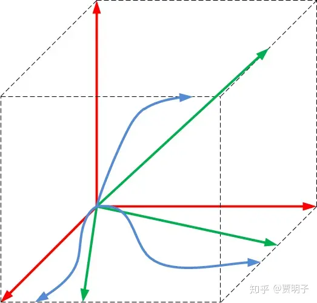

# 17、波函数的形式：希尔伯特空间中的骰子

> ***“Quantum phenomena do not occur in a Hilbert space. They occur in a laboratory.”\***
> ***“量子现象发生在我们的实验室中，而不是在希尔伯特空间中。”\***
> ***- Asher Peres\***

*（在此感谢* 

*[@傅铁强](https://www.zhihu.com/people/0db3972526e76f03b4f4dea428662af2)*

 *去年向我提及上述引用，作为一个贴切的题记。）*

薛定谔猫，是量子论战中所有那些有趣的思想实验中最著名的一个，但是它绝不是唯一一个，并且也不是最尖锐的一个。我们后面讲陆续看到各学派在“量子现实”这个领域中你方唱罢我登场，煞是热闹。你可能会感到疑惑，这样一个有着这么多争议的理论，它是如何成为物理学中公认的基础的呢？这是因为，人们虽然对量子力学中的关键概念诸如波函数、叠加性等等的**诠释**有着不同看法，但是并不否认它的变化规律本身。也就是说，人们对“是什么”这个问题是可以达成一致的，但是对“意味着什么”众说纷纭。如果我们不断地把这些不同的诠释剥离开来，搁置起来不去争论，那么我们就会取得越来越多的共识。如果最终我们剥离了全部的诠释，就只剩下单纯的数学意义上的量子力学体系 – 一个裸奔的量子力学，**“裸量子力学”（bare theory），**也就是它的**形式理论**，我们就可以获得最大的共识，在这一点上，它是确定的，而且几乎是毫无疑义的。

当然，不可能存在一个绝无诠释的纯数学体系可以完成一个物理理论。因为说到底，物理科学是一门实证科学，它所研究的对象最终要靠我们可以直接观察的现象来判定。因而，一个理论的数学体系究竟如何与可实证的现象相对应，这个并非数学体系本身可以回答，而必须求诸诠释：我们的数学中的变量（或其中的一部分变量）对应于何种可实证现象？诸如“看，这个公式里有一个变量a，它对应着物体的加速度”等等。我们前面在第？章曾经提到过数学柏拉图主义中的结构主义观点，它认为数学现实即结构图样，由此Tegmark提出了他的数学宇宙假说，认为终极的物理理论所描述的就是这样一种图样，而不附带任何诠释。我个人虽然非常欣赏结构主义的观点，但是对这种数学宇宙假说仍然持有不同看法。这种假说事实上最终将不可避免地物理理论蜕化为数学理论，从而剥夺掉物理的实证基础。从哲学上这是一种探究终极真理的思路，但是它必然要超出物理学的范围。而从物理理论自身而言，不论它的形式理论描述和何种抽象图样，我们都要将这种图样与可观测的现象对应起来：最理想的情况，就是抽象图样与观测现象形成拓扑同胚的联系（即一一对应）。这种对应关系，就需要物理诠释来指明。在量子力学中，我们所能够将诠释压缩到的最小范围，就是数学概念与可实证现象之间的联系 – 这是**物理上的诠释**。而理论中往往还包含这例如“这个数学概念对应着何种实在？”这种问题。这是一个哲学上的本体论问题，但是并非一个纯物理问题，因为本体论概念往往都是不可实证的。我们如何把形式理论与这种本体论概念建立联系？这可以划归为**哲学诠释**。从这个角度上讲，一个完备的量子力学体系的最小范围包括了它的形式理论和物理诠释，但不包括哲学诠释。对于这样一个最小范围，科学家们的认知是基本上没有分歧的 – 当然，所有的分歧早就已经被实证证据统一了。

我们现在就先来大致看看这个大家共识的裸量子力学：包括了它的形式理论和最基本的物理诠释。在量子力学的形式理论中，最核心的部分就是波函数和波函数的演化 – 薛定谔方程。波函数代表了量子系统的状态 – 所谓的**“量子态”（quantum state）。**这是量子力学中关于**演化**的部分：

*“给定初始状态，我们如何预言未来某一时刻的系统量子态？”*

关于这个量子态具体是何含义，它是不是包含了一个量子系统状态的全部信息 - 也即是完备的，这是一个有争论的问题，然而，量子态虽然是描述量子系统的工具，但是它却不是可实证的概念。我们没有任何办法直接观察一个完整的量子态，我们所能观察的，是那些所谓的**“可观测量”（observerables）**，例如粒子的位置、动量、能量、角动量等，也就是我们在经典世界中可以直接测量的东西。因而，在作为物理理论的量子力学中，波函数或量子态的含义本身并不重要，重要的是它能够准确地描述那些可实证的东西 - 可观测量。也就是说，从量子态到可观测量之间应该有一个映射关系，这样我们才能把理论计算中得到的量子态输出为可观测的东西。这种映射关系，是量子力学中关于**观察**的部分，是波恩规则来完成的：

*“已知一个系统的量子态，我们对其进行一个特定的观察，我们会得到何种可能的观测结果，以及获得这种结果的概率是多少？”*

于是，关于演化的部分和关于观察的部分在一起，就形成了一个完整的、前面提到的裸量子力学。然而，我们看到，这个系统当中，并没有回答这样的问题，

- *“量子态是什么？它是真实的，还是只是一个方便的计算工具？”*
- *“观察是什么？它真正把量子态坍缩了吗？”*

结合了演化的规则和观察的规则，它所回答的，是这样一种问题：

- *“在一个演化的系统中，在某一特定时刻我们对其进行特定的观察，会看到何种现象？”*

如果我们用薛定谔猫来说这两种问题的区别，那么第一种问题就是：

- *“薛定谔猫在箱子里究竟是死的还是活的，抑或是既死又活的？”*

而第二种问题则是这样的：

- *“当我们打开箱子时，我们会看到薛定谔猫是死的还是活的？”*

上面的第二种问题，问的是可以实证的问题，对量子力学的有效性可以做出直接判定，因而它就是一种纯粹的物理问题。而第一种问题虽然本身至关重要，但是它却不是可以实证的问题，除非我们能够提出一种能够对量子态进行直接观察的方法，或者对观察过程的直接描述。因为无法实证，所以它就是一种超越了物理范围的问题 – 当然，后面我们会看到，很多科学家正在努力地将其纳入物理范围之内，因而就产生了各种不同的诠释。我们在本章暂且把这些问题抛开，来看看裸量子力学的大致逻辑。

我们不妨先来看看单纯从数学上讲，波函数有何种性质。

第一个性质，就像我们反复提及的，波函数是可以**叠加**的。也就是说，空间中任意一点的波函数，等于所有传播至此的波函数的相加。

更加严格地讲，波函数的演化是**线性**的。何为“线性”呢？线性可以说是数学中最简单的一种运算规则，这个名字本身就暗示了它类似于一种正比例的关系：正比例函数就是一条直线。从数学形式上线性有着严格的定义，我这里不打算深入讨论。用简单的话说，就是任意波函数的**加权相加**（数学上叫做线性组合）仍然是一个有效的波函数。也就是说量子系统中可能存在的任意两个（或多个）波函数，它们各自乘以某个常数后加权相加，得到的波函数仍然是这个量子系统的一个可能状态。比如说，对于一个量子系统，有两个波函数

$\psi\left( x \right), \phi\left( x \right)$

都是满足它的一个解，也就是说，都是它的一个可能量子态，那么，这样一个由上面两个波函数的任意加权叠加，都是它的可能量子态：

$\Psi\left( x \right)=a\psi\left( x \right)+b\phi\left( x \right)$

其中，a、b为两个任意常数。

总而言之，抛去一切严谨性，你暂时可以把这种线性理解为一种**加法**规则。波函数的一切变化都满足这种加权加法：如果一个波函数是可能的系统量子态，那么它的随意倍数也都是；如果几个波函数都是可能的系统量子态，那么它们的任意加和也都是。

好了，这个就是量子力学中的一个非常奇怪的原理：**态叠加原理（superposition principle）**。

现在我们继续来看态叠加原理有什么含义。比如说，我们现在有一个粒子，这个粒子的波函数是这样的：

根据我们前面讲的，根据玻恩规则我们看到这个波函数，就大概知道这个粒子的大致情况。比如说，我们知道，如果我们观察一下这个粒子，我们最有可能在中间的位置发现它，而不大可能在边上发现它。事实上，这个波函数的图像以及这里对玻恩规则的表述并不严格，波函数是一个复函数，而作为一个复数本身并没有大小。我这里无意涉及复数的性质，这可以留到你们高二时学习。在不影响基本原理的情况下，我们可以忽略掉波函数中关于复数的部分[[1\]](https://zhuanlan.zhihu.com/p/52220323#ref_1)。但是你应该知道玻恩规则实际上说的是波函数的**模的平方**代表了该处粒子出现的概率，在这里我们只谈论它**振幅的平方**。另外，因为本文的这种模糊处理，事实上后面的表述并非严格的量子理论，如果你以后有幸学习量子力学，你将会发现其中的不同之处。但是在这里我们并不追求严谨，而是要能够向你传达它的一些基本思想。

根据态叠加原理，这个波函数我们可以看做是一组其它的波函数叠加构成的。我们可以任意选择这样的叠加形式。一个比较常见的选择方法就是，我们可以把这个波函数看做是无数个高度不同的“尖峰” 波（称做δ波），叠加在一起组成的，当这些尖峰的“密度”趋向于无穷时，它们的叠加就形成了上述的连续的波动：

而上述的每一个“尖峰”所代表的，就是一个确定的位置，因为它们只在一个确定的位置有一个概率，而在其它任何地方的取值都是零 - 也就是说不可能出现在那儿。在波动强的地方，这个尖峰的振幅 – “高度” - 就更大，而在波动弱的地方，这个尖峰的振幅就越小。这在数学上非常简单，你只要把这些波乘以一个系数然后加在一起就可以了 - 它们叠加在一起，就是无数个确定的位置的加权相加。如果是无数个波的叠加，只要做个积分就可以了。

这个在数学上毫无出奇之处，甚至可以算作trivial，但是在物理上怎么理解？这恰恰就是我们所说的波函数的概率诠释：一个粒子的波函数是多个确定的位置的叠加态 – 每个确定位置所代表的波函数就是这样一个δ波。而当我们观察粒子时，会使得粒子从它所有这些叠加分量中随机选取一个，从而“坍缩”到这上面去，而我们看到的相应的概率，就正比于该叠加波（δ波）在整个波函数中的叠加权重（它的叠加分量）的平方。

这是一个连续的波函数，在没有学习微积分的你看起来可能会有一些麻烦，我们可以转而举一个离散的例子。在双缝干涉实验中，粒子的某个波函数，我们可以把它写作穿过左缝的波函数与穿过右缝的波函数的叠加：

$\psi\left( x \right)=a\psi_L\left( x \right)+b\psi_R\left( x \right)$

我们知道，当我们观察这个粒子的时候，我们会看到它“要么在左缝，要么在右缝”。玻恩规则说，看到“左缝”状态的概率就正比于a的平方，而看到“右缝”状态的概率就正比于b的平方：

$P\left( “左缝” \right)\propto a^2; P\left( “右缝” \right)\propto b^2$

这里我们还有一个限制就是，缝隙后面的粒子要么是穿过左缝过来的，要么是穿过右缝过来的，而没有其它任何的可能性，因而这两个概率相加必须等于1。因而，任何一个有实际物理含义的波函数必须要满足所谓的“**归一化条件**”：

$a^2+b^2=1$

这种归一化的性质像极了几何中的勾股定理。如果我们把所有的波函数都定义一个“长度” – 这个波函数所代表的全部概率，那么这个长度必须是1。我们可以把这个长度记做：

$\left| \psi \right|=1$

这个很好理解，因为一个量子态是确定的，不存在概率性，它的总的概率必须是1。那么我们来看这个总的波函数的两个分量，左缝波和右缝波的分量分别算作三角形的两个直角边，那么叠加的波函数就是它的斜边：

很自然地，左缝波函数和右缝波函数是互相“垂直”的，它们在对方上的投影都为零，这是因为左缝和右缝是两个非此即彼的不相容状态，它们不可能同时被观察到。也就是说它们之间没有任何**重叠（overlap），**左缝的量子态永远不可能产生右缝的观察结果。这种垂直又叫做**“正交”**，它是一种抽象的垂直。而总的波函数ψ和ψL以及ψR都不垂直，它们之间有重叠的部分，角度越小，重叠得就越严重 – 如果角度为零，则完全重合。我们可以看到，两个叠加分量a和b就分别是它们夹角的余弦函数，夹角越小，重叠越严重，那么观察到的概率就越高，相应地观察导致波函数的“坍缩”就越容易得到它的结果。反之，夹角越大，观察得到它的结果就越小，坍缩到它的概率也就越小。这就是玻恩规则的一个很直观的表示。

这样一来，就引出了波函数的第二个性质，就是波函数有“**长度**”的定义，以及波函数之间有“**夹角**”的定义。在数学上，前者叫做“模（norm）”，而后者叫做“内积（inner product）”。正如我们前面提到的，波函数无论如何演化，它的全部概率必须保持归一性，也就是说波函数的长度必须永远等于1。这恰恰是薛定谔方程的直接结果，这种性质被称作“**幺正性**”。

因而观察过程中发生的事情，就可以用**波函数向着它的叠加分量投影并坍缩**这种直观的几何形式来描述。

这，就是波函数的基本性质，“线性”和“幺正性”。

这里，我们要引入一点点数学的抽象语言。就像是在第一部分中我们引入相空间的概念一样，

[贾明子：5、用“几何观”看世界242 赞同 · 8 评论文章](https://zhuanlan.zhihu.com/p/28557211)

这种抽象数学语言虽然在刚刚引入时由于它比较不同于你所熟悉的常规思维方法而显得有些晦涩，但是很快你就会看到它其实有一种独特的魅力，能够把极其复杂的问题变得明晰起来。并且，这些数学语言一旦习惯，你就会感到它其实很简单，并且再也离不开它了。在这里我们想引入的语言，叫做**“希尔伯特空间”**和线性代数。如果说，可观测量全部居住在我们日常熟悉的三维空间加一维时间这个空间中，那么这个**希尔伯特空间，就是量子态的居所**。

我们可以从几何中的欧几里得空间 – 也就是我们所熟知的我们周围的三维平直空间 - 说起。说到底从数学上讲，我们周围的三维空间其实不外乎是一种集合：空间中所有点的集合。在这个集合中，除了它包含的每个点的定义以外，我们还需要一些规则来定义这些点之间的相互关系，例如这些规则包括：

空间中的每个元素 – 也就是每个点 – 都有定义。有一种最直观有效的度量方法就是通过三维的笛卡尔坐标系，在笛卡尔坐标系中，我们用三个相互两两垂直的方向（x轴、y轴、z轴）就可以覆盖所有的平面空间。其中的何一个点，都可以用它在这三个坐标轴上的投影来表示，这就是这个点的坐标。空间中的任意一点W，可以用一个从原点出发向其引出的一个“箭头”来表示，这个“箭头”有方向，也有长短，在数学上叫做“**矢量**”或“**向量**”。对任意一个点，都有这样唯一的一个矢量，反之任意一个矢量，都对应着这样一个点。因而平面中所有的点都可以用一个矢量来表示。因而这种空间也可以叫做“矢量空间”。

这样一来，表示空间中任意一点的矢量V，则可以看做是沿X轴、Y轴、Z轴三个方向上的单位矢量（即长度为1的矢量）按照他们坐标作为加权的叠加：

$\bar{V}=x\bar{e_x}+y\bar{e_y}+z\bar{e_z}$

我们知道，任何一个矢量都可以看做几个方向上的矢量的叠加。例如，向东北方向的一个速度，可以看做向东的速度和向北的速度两个分量的叠加。总之，在一个平面中，我们只需要两个坐标轴，就能表示所有的矢量。相应地，在三维空间中，我们需要三个方向。一旦这三个方向确定了，整个空间的所有的点就确定了。

因而，我们就可以用三个相互垂直的坐标轴方向上的单位矢量，配合各方向上坐标值的加权叠加，表示出空间中任意一个矢量。我们可以任意选取这样三个坐标轴，而整个三维空间，就是这三个坐标轴撑起来 - “**张成**”的。同样，我们也可以任意选两个互相垂直的坐标轴，它可以张成一个平面，这个平面就是三维空间的一个子集。

在空间中，除了各个点的定义，还存在着长度的定义。一个矢量的长度可以由勾股定理来计算。同样地，还存在着角度的定义 – 日后你会知道，这种角度是由矢量的内积定义的。

于是，我们可以说我们所熟悉的三维空间，欧氏空间，就是这样一个定义了方向、长度、角度的矢量的集合。

那么现在，我们就可以把我们这个熟悉的、三维**空间中的点居住在其间**的欧几里得空间推广到一个抽象的、**波函数居住在其间**的希尔伯特空间[[2\]](https://zhuanlan.zhihu.com/p/52220323#ref_2)。

我们可以来看看欧氏空间中的矢量和波函数之间的异同：

1、欧氏空间中的矢量满足线性可叠加性，波函数满足线性可叠加性；

2、欧氏空间中的所有矢量都可以由任选的三个两两正交的坐标轴配合坐标值来表示，波函数根据情况，可以由多个其它波函数配合其叠加分量来表示；

3、欧氏空间中的矢量有长度，波函数需要“归一化”，即长度为1；

4、欧氏空间中的矢量之间有角度，波函数与其叠加分量之间也有角度。

由此可见，波函数的行为，跟三维空间中的矢量非常相似，因而它就可以看做是是一种广义的矢量。只不过这个矢量是一种抽象的矢量：它的整个法则与我们熟知的矢量并无不同。只不过它在实数域中的，而是在复数域中，并且它的维度并不一定是三维，而是多维甚至无穷维的。波函数作为这样一种矢量，就被称为“**态矢量**”。

我们可以进一步来看看这种相似性，我们继续来做一个一个类比：经典的速度矢量。

我们知道，任何一个速度都可以看做几个方向上的速度叠加。例如，向东北方向的一个速度，可以看做向东的速度和向北的速度两个分量的叠加。我们应该注意的一点是，这个叠加的方式是任意的，有无穷多种。相应地对一个速度而言，它所处的坐标系也就是是可以任意选取的。如下图，一个速度w，它在坐标系1（红色）中，是由vx和vy两个速度叠加的，而在坐标系2（蓝色）中，是由ux和uy两个速度叠加的。总之，在一个平面中，我们只需要两个坐标轴，就能表示所有的矢量。对于同一个矢量，我们选择不同的坐标系，对应的叠加方式（系数）就不同，因而，它的坐标表现就不同，例如，在坐标系u中，W的坐标为（a，b），而在坐标系v中，它的坐标就是(x,y)。也就是说，同样的一个速度矢量，在不同的坐标系下，它所表现出来的坐标是不同的，但是矢量还是那个矢量，一点都不会变化。

在一个二维平面中，所有的矢量都可以用两个互相正交的单位矢量（坐标轴）以及这两个方向上的坐标来确定；相应地，在三维空间中，我们需要三个方向。一旦这三个方向确定了，整个空间的所有的点就确定了。

同样道理，当我们把一个波函数看做是若干其它波函数的叠加时，我们是不是只有一种叠加方式选择吗？答案是否定的。就好像5可以是1+4得到，也可以是2+3得到，还可以是1.5+3.5得到，……，总之，我们可以把5看做是无数种数字组合相加的到底。相类似地，一个波函数也可以看做是无数种不同的波的组合模式。一个波函数，我们都可以看做其他几个波函数叠加而成的，和速度矢量类似，这种叠加方式也是任意的。比如说我们前面所说的波函数：

$\psi\left( x \right)=a\psi_L\left( x \right)+b\psi_R\left( x \right)$

如果我们先ψL和ψR作为“坐标轴”，那么，这个波函数的坐标就是（a，b）。我们也可以用这两个波函数的任意叠加构造出另外任意不同的波函数，例如，我们构造这样两个波函数：

$\psi_1\left( x \right)=\frac{1}{\sqrt{2}}\left( \psi_L\left( x \right)+\psi_R\left( x \right) \right)\\ \psi_2\left( x \right)=\frac{1}{\sqrt{2}}\left( \psi_L\left( x \right)-\psi_R\left( x \right) \right)$

请注意，上式中的1/√2是为了满足归一化的系数。前面我们提到过，ψL和ψR是不重叠的，因而是正交的。那么我们可以用矢量的表示方法把这种构造表示出来：

我们可以看到，在我们这种构造方法中，ψ1和ψ2也是正交的。现在，我们可以把我们最初的波函数ψ变换一下，用ψ1和ψ2的叠加方式来表示，很容易经过简单运算，我们就可以得到：

$\psi\left( x \right)=a\psi_L\left( x \right)+b\psi_R\left( x \right)\\=\frac{a+b}{\sqrt{2}}\psi_1\left( x \right)+\frac{a-b}{\sqrt{2}}\psi_2\left( x \right)$

也就是说，可叠加性就必然意味着，ψ不但可以用ψL和ψR叠加而成，也可以用ψ1和ψ2叠加而成，只不过是它们的系数变了。那么，ψ可以在ψL和ψR构成的坐标轴下表示，它的坐标为（a,b），同时，我们也可以选取ψ1和ψ2作为坐标轴，此时这个波函数的坐标就变成了：

$\left( \frac{a+b}{\sqrt{2}}, \frac{a-b}{\sqrt{2}} \right)$

这个坐标轴的变换和上述速度的坐标变换并无二致：

推而广之，对于一个任意的波函数Ψ都可以看做是一组波函数ψ的叠加，也可以看做是另一组波函数φ的叠加。我们总是可以根据我们的意愿选择这样的一组ψ或者一组φ，使得任意一个波函数都可以用它们的叠加来表示。这就是量子态作为“态矢量”的几何意义。

就像是空间中的每个点，我们都可以通过笛卡尔坐标系来度量一样，对于某一个量子系统，我们也想选择一组坐标轴特定的量子态φ，用它们的叠加把这个量子系统的全部可能量子态表示出来，这组φ就被称为一组“**基矢**”，它担当着类似笛卡尔坐标系中的坐标轴的作用 – 笛卡尔坐标系用三个坐标轴方向上的叠加把所有的空间矢量都表达出来，希尔伯特空间中用一组基矢的叠加把所有可能的量子态表达出来。与笛卡尔坐标系不同的是，要想覆盖所有的量子态，所需要的基矢数目是不同的。由一组基矢如果可以覆盖全部的量子态，那么这组基矢就可以定义一个量子态的空间（“张成”一个空间），这就是希尔伯特空间。

所以，我们用抽象语言来表达波函数或量子态，就可以这样说：

**量子态是居住在希尔伯特空间中的一个矢量 – 态矢量。态矢量的线性叠加决定了它的坐标系可以任意选取，态矢量的幺正性决定了它只能在希尔伯特空间中的单位球面上旋转。**

既然在态矢量的居所 – 希尔伯特空间 – 中我们可以任意选取坐标轴来描述一个波函数，那么我们一般应该如何选择这个坐标系呢？在前面速度矢量的例子里，一个三维欧几里得空间中，我们最常见的选择就是笛卡尔坐标系 - 这个坐标系的方向可以根据需要任意旋转。当然我们可以选择其他的坐标系，例如任意三个不同面的方向（不一定是两两垂直）都可以，在有的特定情况下这种选择更加方便。我们甚至可以选择三个曲线作为坐标系。例如在下图中，红色的是笛卡尔坐标系，绿色的是一般的直线坐标系，而蓝色的则是一般曲线坐标系。

显然，笛卡尔坐标系是最符合直觉的、最方便的一种坐标系选取方法。那么希尔伯特空间中有没有类似的，一般情况下都比较“方便”的坐标系呢？事实上是有的。例如说，我们前面提到的，任何一个波函数都可以看作是无数个确定位置的“尖峰” δ波叠加而成。因而这些尖峰就构成了一组基矢 – 一组坐标轴。而显然这些尖峰所代表的态矢量之间是没有重叠的 – 它们互相正交。因而这组尖峰就构成了一组类似于笛卡尔坐标系的互相垂直的坐标轴。我们可以把每个波函数都看作是这些尖峰的加权组合。在连续的系统中，这些坐标轴是无穷多个的、连续的，而在某些系统中，粒子只能有特定的离散位置，那么这些坐标轴就是离散的、或者有限多个的。

对于同一一个波函数，除了上述叠加以外，我们还有一些方便的叠加形式。例如，一个波函数可以看做是无数多个具有不同波长的简谐波叠加而成的。简谐波就是一种可以用你们数学中学过的正弦或余弦描述的[[3\]](https://zhuanlan.zhihu.com/p/52220323#ref_3)、具有严格周期性的、单一波长的波动。因为这种周期性，它必然是在空间无限延展的。

在量子力学中，波函数的波长是和粒子的动量联系在一起的[[4\]](https://zhuanlan.zhihu.com/p/52220323#ref_4)，一个确定的波长，就意味着一个确定的动量。因而，任何一个这样的简谐波，都代表着一个确定的波长，而不存在任何随机的概率。只有一个确定波长的波在数学中叫做“平面波”，它是一个在整个空间中均匀分布的，向前后两个方向无限延展的正弦波：

例如，同样是前面这个波函数，我们还可以用一系列平面波叠加得到：

数学上可以证明，任意一个波，我们总是可以找到某一组（可能是无数多个）具有一系列不同波长的平面波以及每个平面波的加权系数，把这个波写作它们的加权叠加。

给定一个波函数，我们把它“分解”成为这一系列的平面波以及它相应的权重系数，这在数学上叫做“**傅里叶分析**”。比如说我们讨论的这个波函数，它可以被分解成为9个不同波长的平面波的叠加（如上图所示）。我们同样可以证明，所有这些简谐波之间，也都是正交的。

而我们刚刚提到，每一个平面波都对应着一个确定的动量。那么一个波函数看作是这些平面波的叠加，就意味着这个波函数是由若干个动量态叠加而成的，根据玻恩规则，当我们测量它的动量时，我们会获得这些动量叠加中的其中一个结果，概率就取决于波函数与这个确定动量的量子态之间的夹角：

我们前面看到，对于一个“尖峰”的波函数，它的的位置是确定的。也就是说这样的波函数在我们测量时，总是会得到一个唯一确定的结果，而没有任何不确定性。那么我们把这个尖峰波函数称作**位置的本征态**。同理，对于一个空间无限延展的简谐波，它只有一个单一波长，因而我们测量它的动量时，就总会得到一个唯一确定的动量值，而没有任何不确定性。那么我们把这种简谐波叫做**动量的本征态**。在波函数的希尔伯特空间中，我们既可以用位置本征态作为坐标轴（此时我们可以把希尔伯特空间称作“位置空间，或**坐标表象**”），也可以选取动量本征态作为坐标轴（此时我们可以把希尔伯特空间称作“动量空间，或**动量表象**”），来表示一个波函数。这两种坐标系的选取方法，就是两个笛卡尔坐标系的旋转过程。如下图所示，我们用红色的坐标系来代表位置空间，它的两个坐标轴代表着粒子的两个位置本征态，而紫色的坐标系代表着动量空间，它的两个坐标轴是两个动量本征态。

现在再希尔伯特空间中有一个波函数，它既可以看做是动量空间中几个不同动量的叠加，也可以看做是位置空间中几个不同位置的叠加。当我们想要观测它的动量时，我们就只看动量本征态 – 动量空间的坐标轴，例如上图中，这个波函数与动量1的夹角为α，根据玻恩规则，我们观测得到动量1的结果的概率就是 $ cos^2\left( \alpha \right) $ 。

也就是说，这个概率是该波函数在动量1这个矢量的投影决定的。而观察之后系统由于已经具有了确定的动量1，那么观察后的波函数必然就变成了动量 的本征态 – 它坍缩到了“动量1”这根坐标轴上了。如果我们不依赖于希尔伯特语言来表述这个过程，那就是当我们观察动量时，我们把波函数用一系列简谐波的叠加表示出来，观察的结果必然导致这一系列简谐波的其中之一，而这个简谐波的出现概率就是它的加权系数的平方（归一化之后）。

同理，当我们观测粒子的位置时，我们就只看位置本征态 – 位置空间的坐标轴。而得到某个确定位置的概率，也是由波函数在这个位置本征态上的投影决定的，观测结束之后，波函数就坍缩到这个位置本征态的坐标轴上了。

因而，从形式理论上，玻恩规则又被称作“**投影公理**”。

进而我们可以把这个过程进行推广，除了位置和动量，其它所有的可观测量（诸如能量、角动量等）都存在着一组本征态：就是这样一种特定的波函数，它只包含了唯一可能的测量结果。进而，一个粒子的波函数其实不光可以表示为位置本征态的叠加、动量本征态的叠加。对每一个可观测量，它的一组本征态，都可以通过叠加的方式构造出这个粒子的波函数。这就是态叠加原理的普遍性。

从数学上可以证明，任何一个可观测量的一组本征态，都有一个非常有意思的特点，让它们表现的非常像欧氏空间里的笛卡尔坐标轴：

- 笛卡尔坐标轴相互正交。一个可观测量的一组本征态互相正交；
- 欧氏空间中的所有点都可以用笛卡尔坐标系来表示，希尔伯特空间中的任何一个量子态都可以用一个可观测量的一组本征态来表示；
- N维欧氏空间中一组n个坐标轴，是能够表示空间中所有点所用到的的最少数量的坐标轴，一个可观测量的全部本征态是能够表示希尔伯特空间中所有量子态所用的最少基矢。

简言之，任何一组本征态，它们两两之间互相正交，它们可以组合成为所有可能的量子态，并且它们是能够组合成所有量子态所用到的最少数量的基矢。用数学语言表述，它们可以构成一组**最简完备的正交基矢**。

那么，我们很自然地，**选取某个可观测量的一组本征态作为基矢（“坐标轴”），就像是欧氏空间中选取笛卡尔坐标系一样水到渠成。**用它来表示所有的波函数。任何一个波函数都可以看做是这组本征态的叠加。而每个本征态，就代表着一个确定的可观测量取值。因而，任何一个量子态所代表的力学量，都可以看做是它所有可能取值的叠加。

那么，自然而然地，我们可以把一个动量本征态（具有一定波长的平面波），表示为位置本征态的叠加。我们前面看到，动量本征态是一个在空间上无限延展，均匀分布的状态，这就意味着它需要在空间上前后无限远的范围内无穷多个δ波来叠加。也就是说，动量本征态是一个动量完全确定、但是位置分布在全空间的状态，也就是说，是一个动量完全确定，但是位置完全不确定的状态

反过来，位置本征态也可以用动量本征态来叠加。我们用不同波长的平面波来叠加，随着我们用到的各种波长数目增多，我们可以发现，叠加而成的波就会渐渐地从空间的均匀分布向中心集中。波长数目用到的越多，这个波就越集中，中间出现的波峰就越“尖”。如下图所示，我们可以比较2个不同波长的平面波叠加，以及4个、8个、16个叠加的情况，就可以看出这种向中心的尖峰集中的趋势。我们可以合理得到结论（这个数学上可以证明），当我们用到从零到无穷大分布的无数个波长的平面波叠加时，我们就可以得到一个无限窄的Delta波。这就是我们如何用动量本征态叠加得到位置本征态的方法。我们可以看到，一个位置本征态是由无数个波长叠加成的，也就是说，位置完全确定，但是动量却完全不确定。

那么我们可以看到很明显的趋势：当波函数在空间分布非常窄（极限情况是δ波）的时候，它的波长分布非常宽（极限情况是平面波）；而反过来，当它在空间分布非常宽的时候，它的波长分布非常窄。这样我们就得到了一个不确定原理的美妙的解释：动量越确定，位置越不确定，反之动量越不确定，位置就越确定。因而我们可以看到，**不确定原理其实是态叠加原理和玻恩规则的自然结论**。

我们在第一部分说到过冯诺依曼定义的两类量子演化。这里我们可以有更深的认识。U过程就是幺正演化的过程，也就是我们不观察粒子的时候，它安装薛定谔方程的演化。这个过程是决定论的、连续的、幺正的。我们可以完全确定地计算任何时刻下粒子的量子态。当我们对其进行观测时，U过程就失效了，取而代之的是R过程，也就是概率性的、突变的、非幺正的坍缩过程。这个过程取决于我们要观察的可观测量。如果我们观测位置，那么它会坍缩在某个位置本征态（尖峰波），如果我们要观测动量，它会坍缩在某个位置本征态（简谐波）

这个过程在希尔伯特空间中，就是这样的：U过程是态矢量由薛定谔方程决定的、连续的、确定的旋转过程；而R过程则包括了我们选择一组可观测量的本征态，然后态矢量突然地按照投影的概率坍缩到这个本征态上。

这两种表述方法，就是在实际空间中以及希尔伯特空间中的不同表现形式。现在我们就有了一个非常方便的类比：**波函数不过是希尔伯特空间中不断旋转的一个骰子**。为何这么说呢？听我细细道来。

通常，量子态的维度是很多维的，我们前面在三维空间或二维平面中只是表达一下它的大致意思而已。也就是说，任何一个量子态，都是一个由很多个面叠加而成的“骰子”。比如说我们就拿一个简单的立方体骰子做类比。这个骰子是由六个面组成的。但是我们是否就能说，它**只是**由六个面组成的吗？当然不可以，因为我们可以从很多个不同的角度来观察这个骰子。当我们从每个面的正面观察，它就是六个平面构成的。但是如果我们从每个棱的正面来观察呢？那么我们看到的每一面，都是由两个平面构成的。如果我们从每个角的正面来观察呢？它就会是这样的：

我们完全可以说，一个骰子是由上面六种状态叠加而成的，每一个状态都包含了三个平面。就好像是说，对一个量子态而言，我们可以认为它由一系列位置本征态叠加而成，同样我们也可以说它由一系列动量本征态叠加而成 – 每个动量本征态包含了若干位置本征态的叠加。

而对于一个量子态而言，我们如果问：“它**到底**是由什么状态叠加的？”无异于在问，“一个骰子到底是由那些面构成的？”是的，他有一种最方便的**描述方式** – 由六个平面构成，但是它完全可以由上面这六种方式构成 – 由六种三面组合构成。说到底，它只是这样一种立方体**结构，**而讨论它由何种状态组成，是完全任意的。

我们说过，当一个量子态在没有被观察的时候，它按照薛定谔方程的规则在希尔伯特空间中旋转。这个时候，如果我们问，“它的**真实**状态到底是什么？”这无异于我们在问一个抛在空中不停旋转的骰子，“这个骰子到底是几点？”再一次，我们对此的回答只能是：“**你这个问题毫无意义**，这个骰子只是这样一种立方体结构 – 它由很多种状态、以任意的方式叠加，我们无法回答它是几点。”

好了，现在最有趣的地方来了。这时候如果我们想要对这个骰子做一个观察，我们怎么办呢？我们需要让这个筛子落地。比如说我们现在拿着一个三维的笛卡尔坐标系，如果我们想要观察骰子的一面，那么很简单，我们把x-y屏幕端平，让骰子落到上面就可以了：骰子必定会有一面向上，并且哪一面向上，决定于它在落地的瞬间的方向：它虽然是概率性的，但是那个面与地面的夹角最小，它就更可能会以这个面落地 – 于是我们就可以观察这个骰子到底有几点。然而，我们的观察有很多形式，如果我们不关心这个骰子哪一面向下，而是观察它哪一条棱向下，怎么办？我们只需要报我们的坐标系旋转45°，比如说以水平的y轴向下，而另外两个屏幕个呈45°角。那么骰子落地时，就会有一条棱向上。我们就可以观察那一条棱 – 当然此时就意味着两个面向上了。同理，我们也可以观察一个角：我们只需要相应地旋转我们的坐标系就可以了。

因而，最终我们看到骰子确定的状态 – 是一个面、一条棱、还是一个角？- 完全取决于我们用这个三维坐标系以何种角度来“接”这个骰子。我们想要看一个面，我们就以一个平面来接它；我们想看一条棱，我们就用一条棱来接它；我们想看一个角，我们就用原点来接它。最终的结果，当然有概率性，但是概率却是由这个骰子落地时的角度决定的。我们观察到的一条确定的棱，可以是两个面的叠加，我们观察到的确定的角，可以是三条棱、或三个面的叠加。

在量子系统中，如果我们想观察位置，就要向位置本征态投影，如果想观察动量，就要向动量本征态投影，如果想观察能量，就向能量本征态投影。而观察的概率取决于态矢量的角度。我们观察到的确定的位置，可以是多个动量的叠加；我们观察到的确定的动量，可以是多个位置的叠加，如此等等，这和骰子的行为是何等相似！

所以说，量子态就是一个希尔伯特空间中的骰子；它按照薛定谔方程的确定演化，就是这个骰子在希尔伯特空间中的可预测旋转；它的观察过程，就是我们选取了一个角度来“接”这个骰子落地 – 不同的可观测量就是不同的角度，概率性就是骰子落地时的角度。

这么看来，波函数的叠加和坍缩，也并不神秘，不是吗？

神秘的是，这个骰子究竟是何种含义？

**下一章：[贾明子：18、哥本哈根诠释，成功与缺陷](https://zhuanlan.zhihu.com/p/52966255)**

**上一章：[贾明子：16、躲猫猫的猫：薛定谔猫怪异在何处？](https://zhuanlan.zhihu.com/p/51716696)**

**专栏传送门：[何为现实？拉普拉斯之妖与薛定谔猫之决战](https://zhuanlan.zhihu.com/c_186387023)**

------

## 参考

1. [^](https://zhuanlan.zhihu.com/p/52220323#ref_1_0)事实上，复数给量子力学的形式理论带来了很多有趣的现象。有一种说法，就是说量子力学其实是一种最简单的复数域中的概率论 – 它把实数概率推广到复数中去了。这是一种很有意思的观点，但是我并不想从复数讲起。因而在本文的全文当中，我都忽略掉复数的性质，而只谈论实数波函数。但是你需要知道，这些谈论不是严谨的理论探讨，而是趣味性的科普探讨。
2. [^](https://zhuanlan.zhihu.com/p/52220323#ref_2_0)我们已经知道，欧氏空间是这样一种集合，首先，它其间的所有矢量均满足可叠加性，严格讲是线性可叠加性。满足线性发展的空间我们可以称之为线性空间。在它其中定义了长度之后，这个集合可以称作巴拿赫空间（Banach space）。然后在在其中定义了角度，这个集合就是希尔伯特空间。而我们熟知的欧氏空间是一种特殊的希尔伯特空间：它定义在实数域中，并且有三个维度 。
3. [^](https://zhuanlan.zhihu.com/p/52220323#ref_3_0)严格说，应该是它的实部是个正弦波，整个复函数波是在复空间旋转的复数。这一点，我们在本文加以简化，只用实部来表示。
4. [^](https://zhuanlan.zhihu.com/p/52220323#ref_4_0)德布罗意波的一个最基本关系就是，粒子的动量与他的波长成反比，确定的波长就意味着确定的动量。

发布于 2018-12-12 17:54・IP 属地未知

