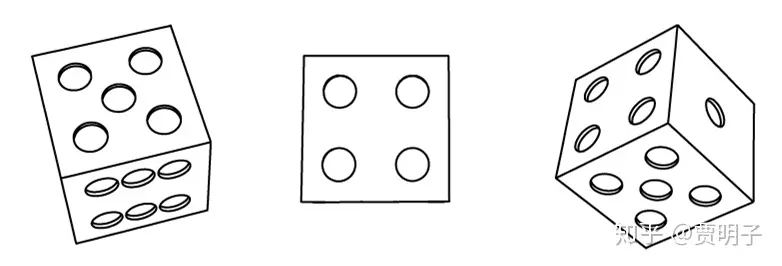
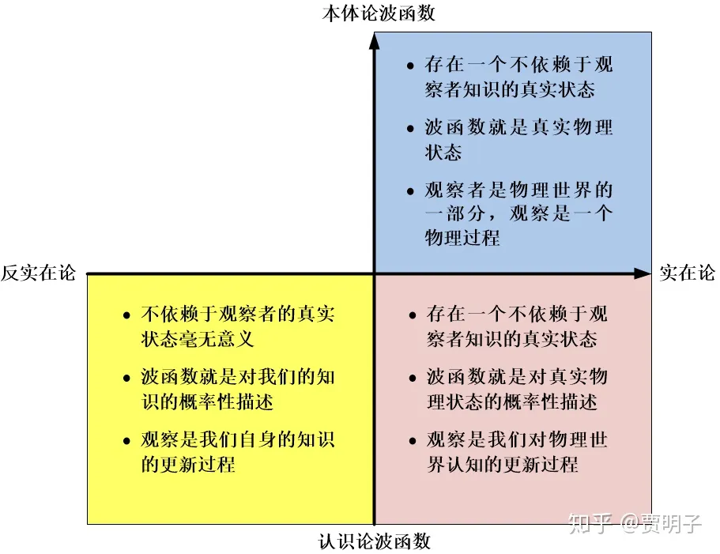
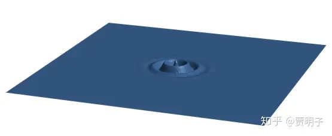
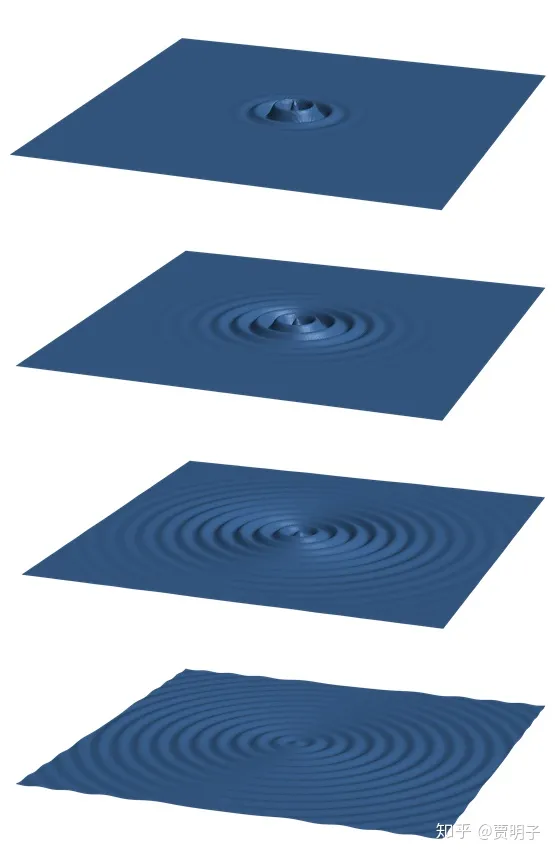
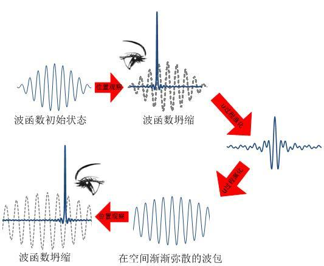
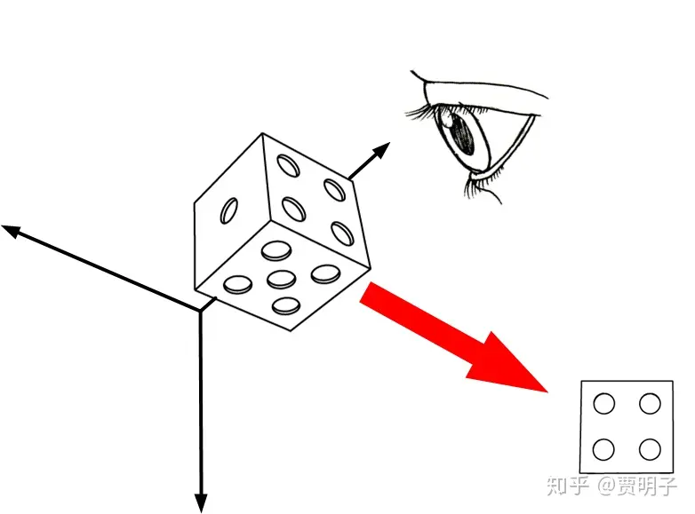
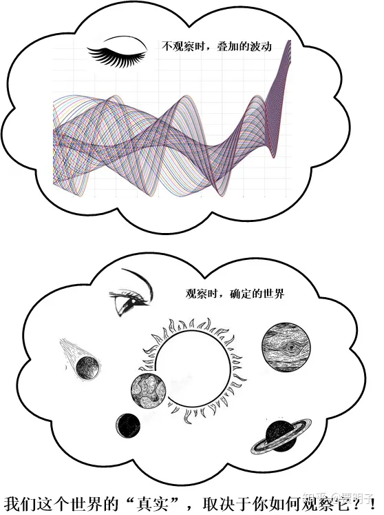
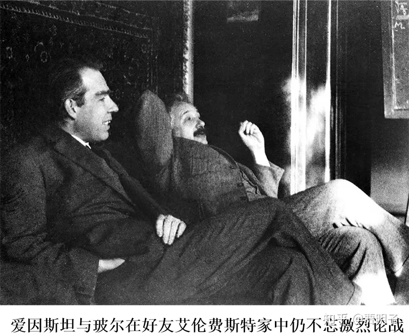
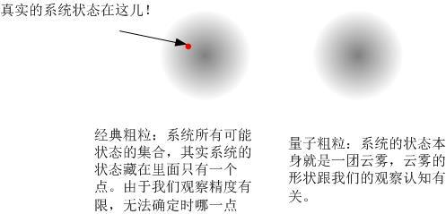
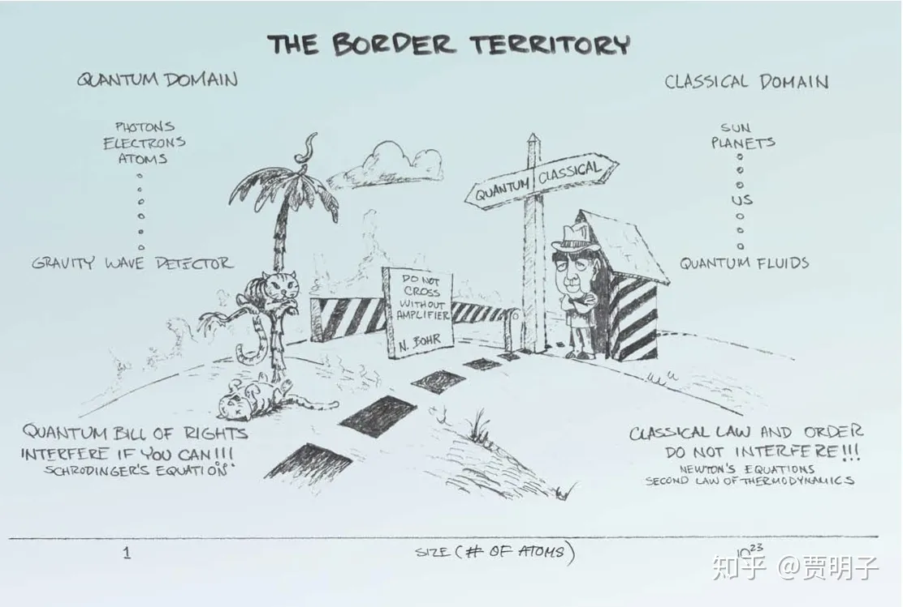

# 18、哥本哈根诠释，成功与缺陷

> ***“It is a peculiar mixture describing in part realities of Nature, in part incomplete human information about Nature — all scrambled up by Heisenberg and Bohr into an omelette that nobody has seen how to unscramble.”\***
> ***“（量子力学）是一个奇怪的大杂烩，它的一部分描述自然现实，而另一部分描述人们对自然的不完整信息\*** ***– 它们被玻尔和海森堡混在一起摊成了一个混合口味的鸡蛋饼，没有人知道如何把这个蛋饼（中的两部分）重新分开”\***
> ***- Jaynes\***

你现在来想象一下自己正在电脑上玩一个角色扮演的游戏（RPG）。我们可以想象这样一个哈利波特场景的游戏，你是玩家，扮演的是小哈利。而游戏中其它有一大批虚拟人物（所谓NPC），诸如赫敏、罗恩、邓布利多、伏地魔……，总而言之，有很多电脑虚拟人物。你在游戏中的目的就是要寻找魔法石。而为了寻找魔法石，你必须要从各个NPC处获得线索。现在，校长邓布利多可以在他的办公室中发布各种任务，你可以去领任务，每完成一个即可从他那儿得到一个线索。你要不断地积累你的线索，破解魔法石的秘密。当然这中间你还可以寻求赫敏、罗恩等朋友的帮助，同时要避免遇到伏地魔。好吧，这是一个非常典型的RPG游戏设定。

这时你进入邓布利多的办公室，发现他不在那儿，你只好失望地离开。过了一会儿，你再次去找他，发现他在那儿了 – 你于是就可以领任务了。然后通过游戏你会发现，你去校长办公室的时候，有时候能碰到校长，而有时候他却不在那儿，于是每次进门之前你都在想，“现在校长到底在不在里面？”

停！这时候你就犯了一个**实在论**者的错误 – 你太投入到这个游戏当中去了，因而把里面的虚拟人物下意识中全部当成真实存在的了。你假定校长要么在里面要么不在里面。但是这个电脑游戏的内部计算程序却不是这样的，由于内存有限，它并不会随时记录每一个NPC的状态。当他们不在你的视线范围之内时，游戏没有给“他的状态”赋任何值，他们被清除出内存了。电脑只是保留了这样一个信息：存在这样的一个NPC，他可能随机出现在某些特定的区域。例如，当你进入 校长办公室之前，游戏中并没有邓布利多的状态，而是只有一个“邓布利多出现在办公室的概率”的计算方法 – 这时很形象地，你可以认为他处于“在办公室”和“不在办公室”的**叠加状态**，而事实上在电脑程序的内部，此时邓布利多根本就不存在 - 邓布利多此时没有任何状态，而只有一个出现或不出现的概率计算法则，这个概率只是我们对他即将出现的预期，而不是他本身的状态。当你进门的瞬间，电脑根据内部的计算规则，例如产生一个随机数，当它为零时，电脑不会在办公室中显示邓布利多，而当它为1时，电脑就在办公室中显示他 – 这时候，邓布利多的状态“**坍缩**”了 – 从“在”与“不在”的叠加态坍缩成或者在或者不在的确定状态。而电脑计算邓布利多出现的概率的规则，就像是量子力学中的薛定谔方程。

那么，从你作为玩家的视角看来，每次进办公室，要么发现校长在，要么发现他不在，于是你就有了一个**幻觉**：校长是存在的，他可能在办公室，也可能在其它别的地方。于是你就被你的直觉欺骗了，然而这个幻觉并不影响你的游戏，因为以玩家的视角，邓布利多总是在或不在的，并不影响你完全投入地进入游戏当中，把一切当成现实。

这个，很类似与一种相对主流的对波函数和波函数坍缩的看法，被称作**哥本哈根诠释**。那么现在我们可以来看看看波函数这个骰子到底是个神马东东了。

前面章节里面，我们曾经提到“薛定谔猫”的思想实验，把这个问题中的矛盾彻底暴露出来了。就像是前面所提到的“蝴蝶效应”让每个人都知道了混沌一样，薛定谔的著名的喵星人，使得这场极端专业的，本应该是非常小众的辩论，成为了广大学渣们喜闻乐见的谈资。

薛定谔猫的思想实验，集中地暴露了两个量子力学诠释上的困难，它们分别是：

**1、** **波函数到底是何含义？**

**2、** **波函数坍缩到底是何含义？**

直到现在为止，我们还没有真正触碰这两个难缠的问题。我们先来看第一个问题，一个我们尚未观察的系统，它可以被一个确定的量子态来描述，这个量子态就像是一个骰子一样，是由很多个状态叠加而成的、多维希尔伯特空间中的一个矢量。那么，这个多态叠加的矢量在物理上是何含义？这有两种答案，

第一种看法认为，波函数所代表的，就是一个真实的物理状态。那么我们就必然面临着这样一种困境：既然如此，它的每一个叠加分量必然都是真实的，那么我们就需要回答“既死又活的猫是什么”这种问题。其实，这只是一系列问题中的一个形象化的例子，如果波函数完整地代表了一个真实的物理状态，那么叠加态就应该是一种普遍的现象。就好像是一粒真实的骰子，我们可以从任何侧面来观察它，我们可以看到它6面中的一面，也可以同时看到它两个，甚至三个面。

问题是，我们在现实中为何只能看到一个确定的状态，而不能看到多个状态的叠加呢？例如在双缝干涉中，我们只能看到粒子出现在某个确定的位置，但是从未看到过它同时出现在多个不同的地方。

那么，如果我们反过来，认为波函数不是一个真实的物理状态又会如何呢？这就是第二种看法，我们用波函数来描述一个真实的系统，它可以告诉我们关于这个系统的信息 – 然而它又不是这个系统的状态，也就是说，波函数代表的是我们对系统的认知。那么这个系统的“真实”物理状态又是什么？

在这种观点下，人们就又可以分为两派，第一派认为，当然存在一个真实的物理状态，波函数可以提供给我们关于这个真实物理状态的信息，这个信息可能是不完整的，所以就有了“概率”的问题 – 概率本身就是对不确定和不完整信息的描述手段。波函数就是我们对这种真实物理状态的知识而不是真实状态本身；而另一派则明确反对这一点，他们认为，什么？真实物理状态，在你不观察的时候，你怎么知道什么是“真实”的？真实状态就是一种自欺欺人的幻觉，毫无意义。因而波函数就只能说主观的、纯粹对人们知识的描述，而无关真实不真实。

认为存在真实状态的，我们可以从前面的章节认识到，是“实在论”的观点，而反对这种观点的，认为不依赖于观察的“实在”毫无意义，则更加倾向于纯粹的实证主义，叫做“反实在论”。而对波函数的看法，认为它代表了真实状态的，必然是一种实在论观点，它认为波函数是一种本体论意义上的概念 – 它描述实在；而认为波函数不代表真实状态，而只是我们能认识到什么信息的，则是一种认识论观点 – 波函数是我们认识系统的工具。那么**“实在论”、“反实在论”、“本体论波函数”、“认识论波函数”**交叉就会形成四种不同的组合。当然，持本体论波函数看法的，必然是实在论者，因而“反实在论”和“本体论波函数”就是无法相容的，因而就一共有三大类观点：

认识我们不妨来看看波函数的老爸 – 薛定谔是怎么看待这个问题的。薛定谔在提出了他的波动方程之后，做出了一个他认为自然而然的结论，即粒子只是看上去是一个粒子，而实际上是一个波，它是一个分布很窄的**波包**。何为波包呢？波包就是一个只在空间有限的部分波动，而在其余的部分都没有波动的一小团波动，如下图所示：

薛定谔说，粒子实际上就是这样的一种波动，它是一种真实的物理波，是局限在空间非常小尺度中的波动，所以它会看起来像一个粒子。然而很快，人们发现，粒子不可能是这样一种波，因为这种波有着一种性质，叫做“色散”。我们已经提到过，任何波动都可以看作是一系列简谐波的叠加，而这些简谐波在空间传播的速度（“相速度”）是不同的，因而这个波包就不可能仅仅局限在空间的一个小区域中，而是会迅速地扩散开去，如下图：

那么，如果粒子真的是这样的波包，它就必然不会在空间中稳定存在！这显然违背了人们的经验。因而很快地，薛定谔就放弃了这种解释。这样一来，最简单的、最符合直觉的一种实在论解释就被瓦解掉了。

这时候，玻恩和他的“概率波诠释”（或者叫做“统计诠释”）横空出世，并且开辟了哥本哈根诠释后续几十年的辉煌。概率诠释在第一部分的第18章曾经详细解释过，这里就略过不谈了。

[贾明子：18、量子：确定性和不确定性239 赞同 · 42 评论文章](https://zhuanlan.zhihu.com/p/28589770)

哥本哈根诠释应该说是量子力学的第一大诠释学派。他的领袖人物就是大名鼎鼎的玻尔。“哥本哈根”这个名称就来源于玻尔所就职的哥本哈根大学。这个学派的中坚则包括了海森堡、玻恩等一大票量子力学中殿堂级的人物。这里面玻尔和海森堡之间的关系，十分类似于进化论中达尔文和“达尔文的斗犬”赫胥黎之间的关系：前者是精神领袖和隐藏于背后的核心，而后者则是活跃的战斗者和思想推进者。玻尔对于海森堡而言，是一个亦师亦友的存在，海森堡的一系列观点和言论，无不受到玻尔的影响。但是我们看到的很多激进的哥本哈根学派的观点，却往往直接出自海森堡 – 虽然海森堡终其一生都没有在哥本哈根大学任职过。

在1920年代后半期，海森堡曾经在各种场合下发表学术演讲，后来这些演讲被总结至一本书《量子理论的物理原理》中出版，在这本书中海森堡这样说：

> ***“The purpose of the book seems to me to be fulfilled if it contributes somewhat to the diffusion of that 'Kopenhagener Geist der Quantentheorie'\*** ***if I may so express myself, which has directed the entire development of modern atomic physics.”（这本书的目的就是要尽力澄清哥本哈根量子理论的困惑，我个人认为，整个现代原子物理都是在其指导下发展的。）\***

这就是哥本哈根诠释这个名称的首次出现。但是严格讲，这个学派并没有一个统一的观点，而是集中了以玻尔为首的这个圈子中若干相似的观点，它们之间有时各有不同甚至冲突，因而很难说清楚这个学派的确切论点。但是这里可以大略说一下它的主要核心精神。

首先，这个学派旗帜鲜明地反对“独立于观察者的客观现实”这种概念，在他们看来，如果你不观察一个系统，这个系统的真实状态实在是毫无意义。因为不管你怎么描述它，你都无法确知你的描述所谓是否正确，因而，你的那些所谓对“真实客观现实”的描述统统都是一种随意的呓语 – 你没有观察它，谈何真实？波尔说：

> ***“everything we call real is made of things that cannot be regarded as real”（我们称之为“真实”的一切事物都是由那些不能被认为“真实”的东西构成的）\***

海森堡也说：

> ***“What we observe is not nature itself but nature exposed to our method of questioning”（我们观察到的不是自然界本身，而是自然界根据我们的观察方法展示给我们的东西）\***

这些话怎么理解？在玻尔他们看来“现实”是什么完全依赖我们对其观察，只有当我们真正观察到了，我们才能有信心认为它的“真实”状态是什么。因而，一个“不依赖于观察者”的现实无异于胡说八道。真正的“现实”不是现实**本身**，而是我们**看到了什么** – 这当然就取决于我们**如何去看**。我们从这里可以看出玻尔是一个鲜明的实证主义者，我们可以回顾一下前面章节

[贾明子：6、自然科学的实在和实证158 赞同 · 26 评论文章](https://zhuanlan.zhihu.com/p/43371148)

来体会一下这种实证主义思想的根源。

因而，像这样的问题“在我们不观察猫的时候，它是死的还是活的？”这种问题是自相矛盾的。在“不观察”的前提下，根本就谈不到事物的真实状态 - 不存在一种不依赖于观察的现实！

所以说，在哥本哈根学派看来，波函数就是、也只能是一种概率波，它不是真实的物理状态，而只是告诉了我们能够对现实期望些什么 – 也即是我们对现实的认知，而不是现实本身。关于波粒二象性和叠加态的解释困境恰恰说明了一个真理，就是“没有被观察的现实不是现实！”对此，哥本哈根诠释的信奉者们经常用“萨根隐形龙”的故事来嘲讽那些反对者，萨根的隐形龙是一个寓言故事，用来说明不可观察的事情无意义。故事是这样的:

***- “嗨！一条会喷火的龙住在我的车库里。”\***

***- “是吗？块让我看看,龙在哪？！”\***

***- “她就在这呢，我忘了告诉你，她是条会隐形的龙。”\***

***- “你在地上撒上些面粉，那么我们就可看到龙的脚印了。”\***

***- “但是这条龙浮在空中。”\***

***- “那我们可以用温度计探测它喷出的火焰。”\***

***- “建议不错，但是这个火焰同时是没有温度的。”\***

***- “你可以喷漆啊，她身上沾了漆就显形了。”\***

***- “但是她是条无形的龙，漆不会留在她身上的。”\***

***- “……”\***

***- “是的，她就是这样一只奇怪的龙！她存在，但是我们绝对没有任何办法观察到她！”\***

***- “@#￥%，你特么在逗我？！”\***

因而哥本哈根学派是一种典型的反实在论、认识论波函数的观点。这样一来，很自然而然地，他们就不屑于去回答“叠加态到底是什么”这种问题，真正的问题是，当我们观察时，我们会看到什么，以及我们用何种观察手段，会看到何种现象。这就是测量时的波函数坍缩。

测量，顾名思义就是我们用某一种技术手段[[1\]](https://zhuanlan.zhihu.com/p/52966255#ref_1)来获取关于一个系统状态的信息的过程。而量子力学中一旦涉及到测量，种种神秘事件就发生了。关于这个过程，哥本哈根学派这样说：

1. 在量子力学中，波函数是一个对粒子状态的完备描述，也就是说，量子态包含了关于这个粒子运动状态的**一切**信息，而不存在任何其它的、我们尚未发现的东西可以告诉我们额外的信息。
2. 与量子态相对应的，就是“可观测量”。量子态代表着粒子的运动状态，是确定的、唯一的；而“可观测量”则是当我们观察这个粒子的时候，我们能够实际得到什么结果，比如说粒子的位置具体在哪儿，它的动量具体是多少等。量子态代表着关于可观测量的这样一种概率：当我们观察一个粒子的时候，我们得到它的某一个可观测量（位置、动量等）的确定数值是多少，出现这个数值的概率是多少。比如说，当我们观察一个粒子的自旋状态时，我们可能得到两种结果，上旋和下旋，它的量子态会告诉我们，出现这两种结果的概率各是多少。
3. 量子态有一种非常怪异的行为，就是它可以叠加。**任何**一个量子态，都可以看做是其他若干量子态相互叠加的结果。这种叠加态是一种**已知的、确定的状态**，而不是一种“非此即彼”的未知状态；而对于将要发生的对可观测量的观测结果，则总是不确定的。我们永远不会期望看到一个“既在这儿又在那儿”的粒子，一个“同时经过两条缝隙”的光子，甚至一只“既死又活”的猫。而只能期望一个“或者这样或者那样”的不确定情形。
4. 在我们不观察系统的时候，量子态就像是一个骰子 – 当然，按照他们反实在论的观点，这是一个虚拟的骰子，因为此时系统并没有一个状态 - 按照薛定谔方程的演化规则连续地旋转着，我们可以精确计算任意时刻它的角度。而在我们观察的瞬间，发生了两件事：第一，根据我们观察什么，我们选取了一种观察“角度”，我们只可能骰子在看到这一组角度上的投影 - 也就是说，我们已经限定了观察结果的范围；第二，这个骰子突然之间坍缩了，它不再是一个立体的结构，而变成了一个“平面”的投影 – 它根据观察角度随机地选取一个方向，在其它所有方向上的一切立体结构全部神秘消失了，而只剩下这个方向上的投影，它从一个立体的（虚拟）骰子变成了一个（真实）平面 – 它被“降维打击”了！

也就是说，而当我们观察一个粒子的时候，非常奇怪的事情发生了。首先，根据我们想要观察的可观测量不同，我们事实上强行选择了一组“本征态”供粒子选择，测量结果只能是其中之一，而其它的叠加方式都不存在了。其次，在我们观察的瞬间，我们迫使这个粒子从这些本征态中随机地选择其中一个本征态，而扔掉其余所有的状态，变成了一种确定的状态，这就是所谓的“坍缩”。这个过程是在所谓“玻恩规则”支配下的完全随机的过程。当我们完成观察以后，粒子就会呆在它所坍缩到的状态上。

而它原本的“叠加态”本来是可以按照任意的方式来叠加的，比如说我们可以用一组随便的，不是任何本征态的量子态来叠加构成。那么在观察过程中，它会随机选取哪一个状态中坍缩过去呢？事实上，粒子有着不完全“自由”的选择。首先，它不能随便选择某一个状态，而只能从我们想要观察的可观测量的一组本征态中选择。比如说，我们观察动量的时候，实际上就限制了这个粒子，让它只能在一组动量本征态中选择它的归宿；其次，当我这组限定好的本征态确定以后，它就可以按照玻恩规则从中自由选取了。也就是说，我们的观察使得量子态发生了一个随机的突变，让它从一个叠加态变成了某一组确定的本征态的其中之一。

可能这一点深深地迷惑了你。这个世界怎么啦？当我们不观察它的时候，它就变成了一堆状态的叠加态。而仅仅是心血来潮地，不知何时我们好奇地睁开眼睛看了一眼，它突然之间在一瞬间就就变成了你眼中的现实？更加奇特的是，根据我们想观测的变量不同（位置、动量、能量……），这个世界竟然会变幻它的面目来响应？！为何这个世界会**根据我们一个主观的决定而变幻它的面目**？我们如此渺小的人类，在宇宙间有如沧海一粟，竟然因为我们的一个“我想要观察一下”这样的决定，而导致了整个宇宙的巨变！

\- 当然不是！玻尔说，你被实在论的思想束缚住了。在我们闭上眼睛不观察的时候，根本就不存在一个真实的宇宙状态，因而当我们睁开眼睛时无论观察到何种状态，都不算是所谓的“宇宙巨变”。然而这并不能给我们解惑，因为由此产生了更加荒谬的效果，没错，宇宙的真实状态并不根据我们的观察方式变幻面目，而是根据我们的观察方式**被创造**出来了！我们的观察就是这么伟大地造就了这个宇宙的真实状态。

我们可以看到，哥本哈根学派眼中的量子世界，就非常类似于一开头我们提到的那种RPG游戏。观察者所能知道的，就仅仅是自己看到了什么，但是对“是什么”却一无所知。那么，难道说我们真的就生活在这种虚拟的游戏世界中吗？对此哥本哈根学者们回答道：这个问题毫无意义，世界是虚拟的还是真实的并不重要，**重要的是你看到的和经历的是什么**。

这种观点，是极具冲击性和颠覆性的。在17世纪的经典物理学建立以来，科学家们似乎已经取得共识：

1、 在观察者之外，存在着独立的“客观实在”。这个实在与观察者和观察方式无关。无论我们何人、何时、何地，只要是正确的观察，总能够获得一致的观察结果。我们总是可以谈论月亮在此时此刻的位置、体积、形状、运行速度、自转速度等等一系列性质：我们坚信，哪怕是现在没有任何人在观察它，它也总是确定地在那里存在的，我们可以不知道它此刻的状态，但是不能否认它的确实存在。

2、 所有这些客观实在，都受到某些（确定的、至简的）自然规律所支配，任何一个因都会毫不含糊地导致一个确定的果。根据牛顿定律和万有引力定律，我们可以准确预测每个行星未来的运行轨迹 – 只有精度的区别，没有不确定的未来；哪怕是混沌系统，也只是我们不能预测而已，并非它的未来不确定。观察者本身，包括观察行为本身，都是这个自然规律运作的结果。

这种经典的“机械宇宙观”，在经典物理学取得巨大成就的同时，根深蒂固地确立在科学家的概念之中。我们前面曾经提到过，**“实在论”、“因果论”、“决定论”**成为自然科学的三条不可或缺的支柱。这个非常符合人们的直觉，似乎无懈可击。

然而哥本哈根学派对量子力学的诠释，却同时冲击了这三大支柱。在他们看来：

- 上帝是掷骰子的，不但掷骰子，而且还会根据我们的观察需要来掷骰子：如果我们想观察一个面，它就会让一个面落地，如果我们想观察一条棱，它就会让一条棱落地，如果我们想观察一个角，它就会让一个角落地；
- 状态是不确定的，当我们观察它时，它会毫无理由地取一个状态给我们看，这个状态没有必然的因果链来决定它。我们看到的状态不必然取决于一个原因，而一个原因也不会必然导致某个确定的结果；
- 演化是不确定的，我们没有任何办法准确预言未来。**拉普拉斯之妖遭到剿灭**：首先它不可能确切知道宇宙的初始状态，其次由于R过程（坍缩）中的概率性演化，它也不可能做出准确预言。

总而言之，早期的哥本哈根学派就像是一个对一切都叛逆的熊孩子，无疑是让很多人讨厌的。这些讨厌它的人里面就包括了量子理论早期的几个缔造者：爱因斯坦、薛定谔、德布罗意。其中，薛定谔所提出的薛定谔猫思想实验，就是为了批驳哥本哈根学派中反实在论的倾向。事实上，从上面的介绍我们就可以看出来，玻尔等人的观点可能不仅仅止于反实在论，他们往往把物理理论看作是一种我们用来做出理论预言的工具，除此之外别无意义。这种**“工具主义（instrumentism）”**的看法，无疑触动了很多以发现客观真理为己任的科学家的底线。

和薛定谔猫同样知名的，是爱因斯坦的名言

> ***“上帝不掷骰子**”，*

这句话集中体现了爱因斯坦的决定论立场。秉承经典自然科学思想核心，爱因斯坦坚信存在着一个决定了世界万物运动的自然规律，万事万物的一切运动，莫不是由这个自然规律严格确定的。我们不妨回顾一下前面所提到的斯宾诺莎的泛神论观点，爱因斯坦的自然规律有着鲜明的这种“泛神”的影子：自然规律至高无上，不受任何个体影响，且决定了所有个体的命运。事实上爱因斯坦并不信奉上帝，这句话中的“上帝”指的就是这种泛神论式的自然规律。而玻尔坚信的、自然界中的实在取决于观察者，与爱因斯坦的这种信仰就严重冲突了。

大家往往把这句话认作爱因斯坦对量子力学的最大不满：违反决定论。其实，爱因斯坦真正最在意的远不是**决定论**，而是**实在论**。爱因斯坦还有另一句名言：

> ***“当你不看月亮的时候，它还在吗？”\***

可能是因为这句话不像“上帝不掷骰子”简短有力，它的流传度远远不及前者。但是，这却是爱因斯坦更加关注的 – 实在论，他对之的执着看法甚至远远超过了决定论。

爱因斯坦就像是在动荡变革中坚守着传统美德的令人景仰的老绅士，在科学发展的洪流中岿然不动。而他的对立面，以玻尔为首的哥本哈根学派，则更像是标新立异的、试图颠覆一切的大男孩，一切传统的都是他们力图破坏的目标。两派中各有重量级的大佬，各执一词，展开了关于量子力学诠释的大论战。这场论战，在整个人类思想史上规模都属罕见，有如特洛伊战争一般，可算是史诗级别。它并没有随着爱因斯坦本人的离世而终止，反而在其后延续了60多年，直至今日仍然未分胜负。

爱因斯坦本人与玻尔有着很深厚的个人友谊，但是两人的学术观点却势同水火。这个在人类思想是也是少见的。虽说学术观点有着客观性，与持有观点的人并不必然相关，但是在激烈论战中仍能保持友谊的，即便是在自然科学中也属罕见。两人一直就这样保持着相爱相杀的关系，直至爱因斯坦离世。期间爱因斯坦对玻尔的论点展开了多次猛烈抨击，有几次几乎就要成功了，但是最终却总是功亏一篑。爱因斯坦思维敏捷、尖锐，直指核心，多次令玻尔哑口无言，但是最终玻尔总是可以想到办法予以回击。所谓生于忧患死于安乐，在爱因斯坦这个令人头痛的劲敌面前，哥本哈根学派不断更新、修正，修补漏洞，得以更加完善。

最根本的，哥本哈根诠释虽然看起来显得有些惊世骇俗，但是它的确是可以自圆其说的。并且更重要的是，它与实验结果都是兼容的。因而它很快获得了很多支持 – 毕竟，科学理论的终极目标是追求可实证，至于它是否惊世骇俗并不重要，如果观测现象告诉我们它是这样的，那么我们就必须要承认它，别无选择。如果实证与我们的信仰相冲突，我们就必须改变我们的信仰，无论是决定论，还是实在论。正是因为这种原因，在与爱因斯坦军团的大论战中，玻尔领导的大军不断取得优势，赢得了更多人的支持，渐渐在上世纪40年代以后成为最主流的一种说法。并且一度被认作为量子力学的**“正统诠释”**。

但是，这不代表人们对待哥本哈根诠释满意，因为它有着非常尴尬的地方，就是**二元对立**的问题。首先，是**量子-经典的过渡问题**。这个问题是这样的，为何量子系统和经典系统会有这这样截然不同的表现？量子系统按照薛定谔方程和玻恩规则描述，有着态叠加、干涉、不确定性等非经典行为，而经典系统则按照牛顿定律描述，确定的、完全可预测的。第二个二元对立的问题是**两类演化**问题，为何量子演化有着按照薛定谔方程幺正演化的“U过程”和随心所欲跳变的概率性“R过程”两种截然不同的形式？这种**二元性**起源在哪里？

这两点哥本哈根诠释解释起来显得捉襟见肘。

关于二元对立，玻尔有一个非常著名的“原理”，被称作“**互补原理**”。这个原理按照严格意义上讲，并非一个真正的科学原理，因为它缺乏相应的严谨性。它更像是一个一般性的、对一大类问题的总结性陈述。在这个原理中，玻尔说，一个物理系统包含了两类互不相容、然而却互相补充的性质。它们无法同时体现出来，但是却共同确定了粒子的性质。最典型的一个例证就是所谓的“波粒二象性”。正如前面我们所讲到的，一个微观粒子同时具有类似波动的性质和类似粒子的性质，它们都是这个粒子的基本性质，然而却不可能同时体现出来。当我们观察它的波动性质（例如干涉）时，它体现出来的就是波动性，当我们观察它的粒子性质（例如位置）时，它体现出来的就是粒子性。因而，粒子既不是波，也不是粒子，但是它同时具有波动的性质和粒子的性质。类似这种互补性还有很多，诸如干涉时的路径信息和干涉条纹、演化过程中的幺正演化和坍缩、不确定原理中的位置和动量、经典行为与量子行为等等。这个列表我们还可以不断往上添加新的这样的“互补对”。玻尔认为，这种互补性就是微观粒子的一种基本特征。

然而我们可以看到，不光是这个原理非常含糊不清，它不像是其它科学原理那样明确、严谨、定量，而且它只是**陈述**了这种二元对立，但是并没有**解释**它。也就是说，这是一个强加给理论的假设，而不是理论的自然推论。要知道，一个理论中添加任何一个假设，都将会使这个理论的说服力大打折扣。更加令人不满的是，它并没有指明这种二元划分的**界限**在哪儿：微观粒子何时表现出波动性？何时表现出粒子性？粒子何时幺正演化，何时坍缩？

当然，玻尔可以说，一切二元分化都发生在观察时。但是这就引起了更大的麻烦。观察在哥本哈根诠释中是一个无比重要的概念，甚至说，是有别于经典理论的最核心概念。但是他却并没有清楚地定义什么是“观察”[[2\]](https://zhuanlan.zhihu.com/p/52966255#ref_2)。是我们作为一个有意识的生物的观察，还是一台无意识的仪器记录下实验结果也算观察？如果仪器也算的话，那么我们理论上毫无障碍可以把粒子穿过的双缝也算作一种观察仪器，因为缝隙完全可以接收到粒子的作用力，那么这种观察显然不能使粒子坍缩。如果说必须是有意识的生物，那么必须是人类才可以做观察者，还是阿猫阿狗也可以？对此，海森堡对观察的定义是“瞬时、不可逆地记录观察结果”。这个说法就更加不清不楚，严重地犯了循环论证的错误。另外，观察必须是一个连续的事件，它需要一段时间才能完成，那么坍缩是什么时候发生的？它是瞬间发生，还是渐进发生的？如果是前者，在一个连续的观察行为中，哪一个时刻如此重要触发了波函数的坍缩？如果是后者，那么坍缩的过程又是怎样的？

作为量子演化中如此关键的一个概念，采取这样模糊的看法是完全说不过去的，这可以说是哥本哈根诠释一个无法洗白的槽点。

关于量子-经典过渡，玻尔还有一个原理，叫做“**对应原理**”。在这个原理中，它要求量子力学的理论在**经典边界**必须能够自然而然地与经典理论兼容。何为经典边界？我们知道，微观粒子尺度微小，质量很低（诸如电子），在这种领域下，各种量子现象诸如干涉、叠加占主要地位；然而在经典领域，尺度宏观，质量很大（诸如一个垒球），这时候我们把这些条件代入量子理论，就会发现它得出的结论与经典理论相一致：量子理论在尺度渐趋增大时，渐渐地蜕化为经典理论。这个要求是自然而然的：因为量子力学的预言必须要符合我们的经验。例如我们前面提到的不确定原理在大质量物体上，不确定度就会变得极小而可以忽略；

[贾明子：17、经典不确定和量子不确定156 赞同 · 24 评论文章](https://zhuanlan.zhihu.com/p/28582873)

再例如物质波在宏观物体上波长如此之短，以至于我们无法察觉。那么，量子行为在经典世界中无法被察觉也就是顺理成章的事情了。这就是玻尔对量子-经典过渡的解释。

这个解释看似非常合理，并且在绝大多数教科书中都是这样讲的。但是它仍然存在着极大的漏洞。我们前面提到的“薛定谔猫”的思想实验[[3\]](https://zhuanlan.zhihu.com/p/52966255#ref_3)，就把整个微观的种种怪异传递到宏观来了，让我们无法接受。这个思想实验表明，所谓的对应原理肯定在某处有问题了。事实上，人们发现，虽然表面上这个原理非常有道理：既然一切微观状态在尺度增大的过程中都渐变为经典状态，那么就不应该存在这种微观-经典的边界。然而事情并非那么简单，这种经典-微观的对应关系，实际上是经典的确定状态与微观量子不确定性的统计平均的对应，而不是经典状态与量子态的对应。也就是说，在经典世界中，量子怪异只是看似消失了而已。在混沌系统中这种矛盾就被放大了：无论我们如何增大系统的尺度，量子力学都是线性的，都不可能产生混沌现象，而经典世界中混沌却无处不在。Zurek等人的研究表明，如果没有退相干理论[[4\]](https://zhuanlan.zhihu.com/p/52966255#ref_4)的介入，**对应原理在这种情况下根本就无法成立**。

事实上，玻尔对他的对应原理的态度也很明确：对应原理所说的只是量子理论在**统计解释**的意义上重现了经典理论的结论，但是它并非**自然蜕化**为经典理论。也就是说，在经典边界上，量子理论的**统计平均**与经典理论的确定结果**近似**一致。这二者有着截然的不同。经典理论是独立于量子理论的存在，而并不能从量子理论中合理推论出来。玻尔认为，我们不能指望从量子力学中得到我们对观察结果的合理解释，因为我们作为宏观物体，必然是经典的，我们所需要的观察仪器，也是经典的。那么这种经典-量子边界就在观察过程中起到了迫使波函数坍缩的作用：波函数生活在微观领域，我们对观察结果的接收必然处在宏观领域，那么对波函数的观察，必然要使得观察结果穿越这种边界，从量子变为经典，从“既此又彼”的叠加态变为“非此即彼”的概率。

也就是说，玻尔认为**，R过程（坍缩过程）必然是一种独立于U过程（幺正演化过程）的演化规则，这种二元对立事实上起源于量子-经典的二元对立**[[5\]](https://zhuanlan.zhihu.com/p/52966255#ref_5)。

那么我们就又一次遇到了这种二元对立的边界问题的尴尬了。如果真的存在这样的边界，那么这个边界在哪里？你玻尔不是一直在强调波函数只是一种我们计算观测结果预期用到的工具吗？那么你当然应该指明，我们何时可以用这种工具，又何时不能用它呢？

对此，海森堡深信不疑存在着这样的一种边界，这个边界，一般被称作**“海森堡边界” （Heisenburg Cut）**，边界的一边是经典世界，一切必须按照经典定律来描述，没有叠加，没有干涉，没有不确定性；而另一边则按照量子力学的定律来描述，处处充满了叠加、干涉等量子现象。但是，对于这样一种十分重要的界线，他却语焉不详 – 我怀疑他自己就根本说不清楚，他说：

> ***“在一边，是我们用来帮助观察的仪器，因而必须看作是我们（经典世界）的一部分，在另一边，则是我们想要研究的物理系统，数学上表现为波函数，在这中间我们需要划分一条分界线。……这条划分被观察系统和观察仪器的分界线是由我们所研究的问题本身的性质决定的，但是很显然在这种物理过程中不应该有不连续性。因而这条线在什么位置就有着完全的自由度”\***

这是一段让我感到十分拱火的言论。什么鬼？首先，你宣称存在这么一个边界，然后你却不说它在哪儿？！这近乎敷衍。既然我们人类、我们的观察仪器无一例外都是由微观粒子组成的，那么为何所谓的这些“经典事物”就要必须遵守一种特别的规则呢？事实上，直到今天人们一直都在寻找这个边界是否存在，人们在越来越大尺度的物体上观测到了量子现象，例如，双缝干涉实验已经做到了由810个原子组成的巨大分子尺度，仍然发现量子现象的存在。随着人们在越来越宏观尺度上直接观测到量子效应，人们完全有理由相信，宏观物体从根本上讲，也是遵循着量子规律的。

**那么这种海森堡边界，也就是量子-经典的边界，是否存在就十分值得怀疑了。**

所以说，哥本哈根诠释把物理过程分成了两个互不相容的领域：经典领域和量子领域。这个不和谐的区别，一直被很多人所诟病。下面这张图就是一张很经典的漫画，它出自物理学家Zurek（“Decoherence and the Transition from Quantum to Classical - Revisited”）之手：

这张漫画叫做“分开的地盘儿”，图的最底下有一个坐标轴，显示尺度，从最左边的1个原子的大小，到右边10^23个原子的大小。中间被一条分界线划开，左边是“量子区域”，有一棵长相怪异的树，树上（下）有一只猫，它既是死的，又是活的。这个区域写着“量子法案：请尽量干涉！！！ - 薛定谔方程签发”。而分界线的右边，是“经典区域”，写着“经典律法：禁止干涉！！！ - 牛顿定律和热力学第二定律签发”。在分界线上，由玻尔把守，界碑上写着：“没有放大器（指的是经典测量仪器）的禁止通行！”

这张漫画表达的，就是哥本哈根诠释中的那个极不和谐的经典和量子之间的划分。量子世界中，到处都是波粒二象性、干涉、叠加态、纠缠等等一系列现象；而经典世界中，所有这些现象都被禁止了。前面提到的问题就很难回避，首先，难道宏观世界的一切物体，不都是由量子微粒组成的吗？为何宏观和微观就要遵循不同的规律？其次，量子到经典的转变是如何发生的？第三，如果真的存在着一条鸿沟，那么这条鸿沟应该在什么地方？

种种诘难表明，虽然哥本哈根学派在对传统的实在论和决定论的战役中大获全胜，但是它本身也是困难重重。基于此，人们虽然对哥本哈根诠释有了一定的接受度，甚至有人把它称作量子力学的“正统诠释”，但是它却远远达不到令人满意的水准。例如著名物理学家温伯格这样说：

> ***“The Copenhagen interpretation describes what happens when an observer makes a measurement, but the observer and the act of measurement are themselves treated classically. This is surely wrong: Physicists and their apparatus must be governed by the same quantum mechanical rules that govern everything else in the universe.”（哥本哈根诠释把观察行为和观察者看做经典，这当然是错误的：物理学家和他们的仪器都必需被同样的量子力学规则所支配，就像它支配了宇宙间万物一样。）\***

因而，除去对经典理论、乃至人们根深蒂固的信仰的颠覆，这种二元对立的困境，以及对观察和坍缩这样关键问题的含混不清，就成了各奔哈哥学派的致命伤。如果无法回答这些问题，科学家是不会感到满意的。最早对这个问题进行详细分析的，是一个少见的天才，冯诺依曼。然而经过详尽分析之后，他打开了一个潘多拉盒子，不但没有澄清问题，反而使得问题更加复杂。

*更新说明：重新组织了一些内容，同时把冯诺依曼测量理论放到后续章节中去。*

**下一章：[贾明子：19、波函数坍缩是意识引起的吗？世界是真实的吗？](https://zhuanlan.zhihu.com/p/53193425)**

**上一章：[贾明子：17、波函数的形式：希尔伯特空间中的骰子](https://zhuanlan.zhihu.com/p/52220323)**

**专栏传送门：[何为现实？拉普拉斯之妖与薛定谔猫之决战](https://zhuanlan.zhihu.com/c_186387023)**

------

## 参考

1. [^](https://zhuanlan.zhihu.com/p/52966255#ref_1_0)当我们观察一个事物的时候，观察手段可能不是那么“技术”，比如说用肉眼看。但是对微观世界，不用某些特殊的技术，我们是不可能“看”到它们的
2. [^](https://zhuanlan.zhihu.com/p/52966255#ref_2_0)后面我们会看到，在现代量子力学中，人们对观察有了更加明确的看法。
3. [^](https://zhuanlan.zhihu.com/p/52966255#ref_3_0)事实上，薛定谔是一个坚定的哥本哈根诠释的反对者，可以说是它对立阵营中除去爱因斯坦之外的二号人物。薛定谔猫实验就是他提出来反对哥本哈根诠释的重要一击。
4. [^](https://zhuanlan.zhihu.com/p/52966255#ref_4_0)退相干理论是一种从纯粹量子力学出发、抛弃坍缩概念的研究量子-经典过渡的理论，我们在后面将会提及。
5. [^](https://zhuanlan.zhihu.com/p/52966255#ref_5_0)事实上，这只是玻尔的看法，我们知道，哥本哈根诠释并非是一个诠释，而是相类似的一大类诠释的组合，对待坍缩这个问题上，其内部有着多种不同的、甚或相互矛盾的看法。

发布于 2018-12-21 17:24・IP 属地未知

