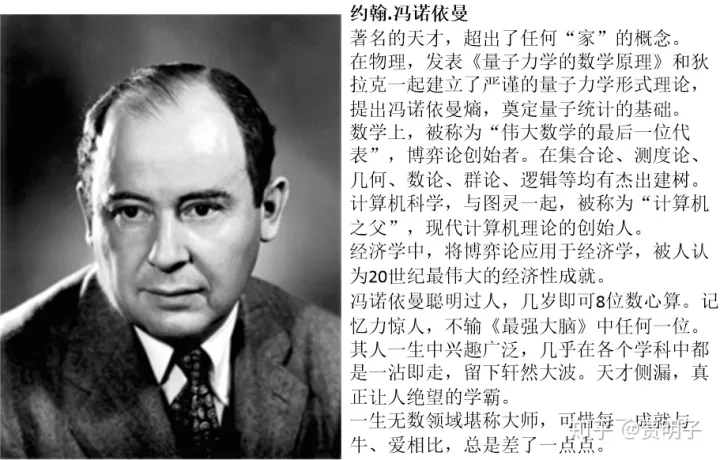
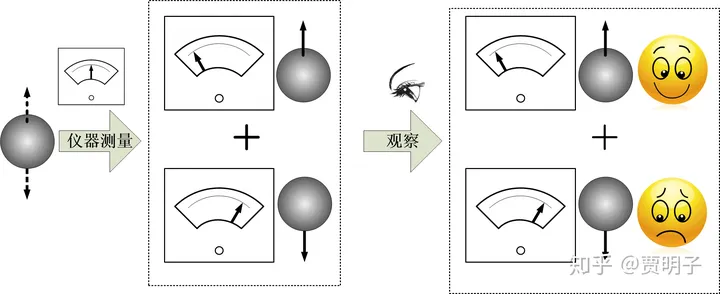
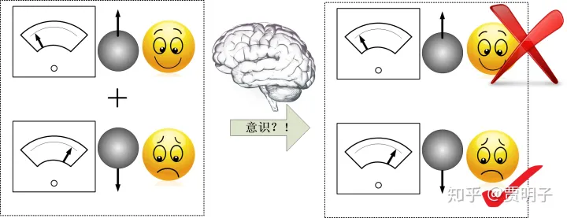
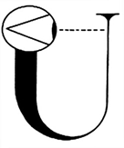
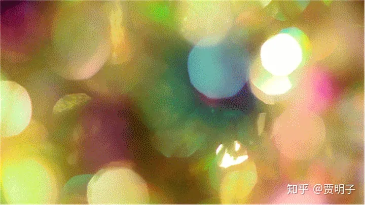
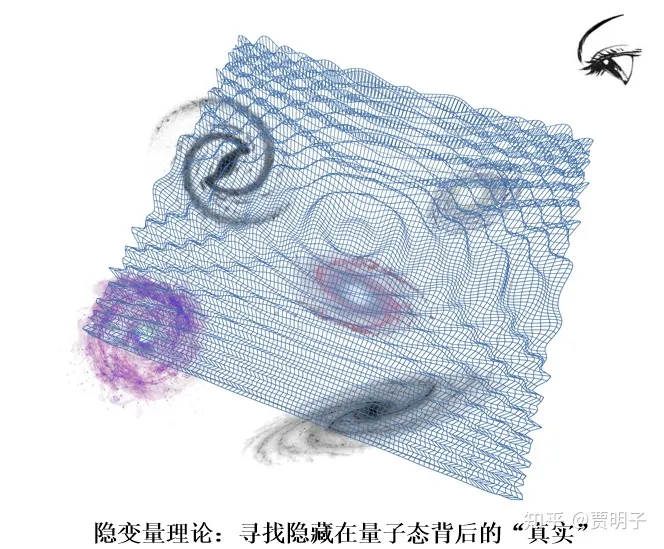
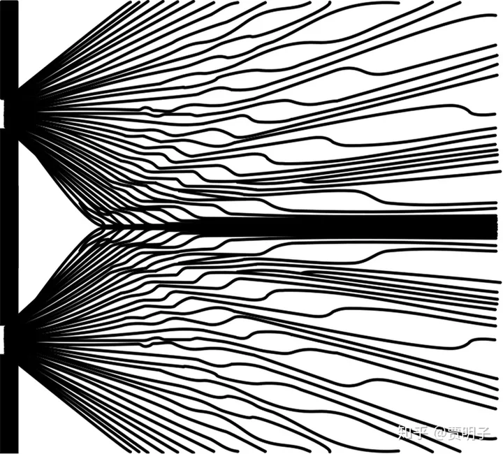

# 19、波函数坍缩是意识引起的吗？世界是真实的吗？

> **“Solipsism may be logically consistent with present Quantum Mechanics, Monism in the sense of Materialism is not.”**
> **“唯我论或许可以逻辑上能够与量子力学兼容，但是纯粹的唯物主义显然不能。”**
> **- 魏格纳**

1956年，也就是伟大的爱因斯坦去世后的第二年，一个尚在攻读博士学位的学生，**休.艾弗莱特（Hugh Everett）**想到了一个问题：“现在的量子力学中，观察导致波函数坍缩。那么在薛定谔猫实验中，猫的观察到底有没有同样的功能呢？我们没有办法向猫求证这件事，因为猫没有办法告诉我们它的感受，但是如果是一个人呢？”于是，为了回答这个问题，他把薛定谔猫实验给改动了一下：

比如说，还是在薛定谔猫的实验中，为了便于对猫的监控，我们把一个朋友和猫一起关进盒子。当然，为了这个可怜的朋友免于被毒死的厄运，我们可以给他一副防毒面具。我们的朋友向我们保证，他绝不是一个动物保护主义者，在全部的实验过程中，他只在那儿静静地观察，不论猫死还是或，他都会保持冷眼旁观，而不会采取任何对实验的干涉行为。然后，实验开始了。一小时之后，我们知道，盒子里的猫有50%的概率被毒死，50%的概率仍然活着。那么这时候我们发出与薛定谔同样的疑问：在我们打开盒子之前，猫是死的还是活的？

这个答案与原版的薛定谔猫实验有何不同？我们可以看到，唯一的不同就是，盒子里多了一个旁观者，见证了盒子内部的全部过程。那么对我们而言，这不会有任何区别 – 如果我们把我们的朋友看作是一堆符合物理和化学定律的蛋白质、脂肪、无机物的组合的话。那么，本着哥本哈根精神，没有被观察的现实不是现实，那么我们自然认为，猫仍然是处于死和活的叠加态，既死又活。而我们的朋友呢？必然就会处于“看到猫死”和“看到猫活”的精神分裂的叠加态。这就更加不可思议了！对我们的朋友而言，他的观察会使得波函数坍缩，因而早在这之前，猫就已经被坍缩为或死或活的确定态了。我们可以向我们的朋友询问加以求证 – 当然，我们的朋友不会突然地变成了精神分裂的发疯状态，他会告诉我们，他看到的一切确定无疑。那么问题就来了，我们的朋友和我们的理论预言就明显冲突了，到底是谁对谁错？

Everett在提出这个思想实验[[1\]](https://zhuanlan.zhihu.com/p/53193425#ref_1)的时候，名不见经传[[2\]](https://zhuanlan.zhihu.com/p/53193425#ref_2)。因而这个故事并不为人所知。五年之后，著名的物理学家魏格纳重新讲了这个故事，于是它获得了巨大的关注度，因而这个故事就成了“**魏格纳的朋友**”思想实验，直到现在人们仍然对此不甚清楚，然而当我们翻开尘封的历史，我们会发现那个被大家忽略的小人物 – 当然，Everett在生前一直没有成为理论物理界的大人物，但是现在，他的理论传承却几乎覆盖了量子力学的半壁江山。

说到底，这个思想实验暴露出来的，就是哥本哈根诠释中二元对立的矛盾：决定论的波函数演化和突发的波函数坍缩之间的矛盾。说到底，玻尔他们说从微观系统到我们的观察之间存在着某种量子-经典界线，导致了波函数的坍缩，但是他们也说不清楚这条界线到底划在何处。于是，不同的观察者就对这条界线的位置有了不同的解释，于是矛盾就产生了。

那么，这条量子-经典界线到底应该在何处呢？我们在上一章中曾经提到过，有一个天才人物，冯诺依曼，对此展开了探讨。

冯诺依曼所做的第一件事，就是去触碰那个各奔哈哥学派一直含糊处理的测量过程。他把测量过程当做一个具体的物理过程来进行详尽的分析，而整个分析的起点，就是假设**量子力学不但对微观粒子有效，对宏观的测量仪器乃至于观察者同样有效。**也就是说，**不存在所谓的经典世界和量子世界的边界**，它们都是由量子力学描述的。

那么，我们考虑这样一次测量：我们要测量一个粒子的自旋状态。首先，我们有一个自旋1/2的粒子，我们知道，每次测量它都会有两种可能的结果，上旋或下旋。为了测量这个粒子，我们还需要一个测量仪器。我们假设，这个仪器用一个指针来显示测量的结果，如果粒子是上旋，那么它的指针偏向左侧，如果是下旋，那么它的指针偏向右侧。最后，还有一个观察者，我们。我们通过指针的左偏或右偏就可以知道粒子是上旋还是下旋。比如说我们特别喜欢上旋的粒子，看到指针左偏就很高兴；相反我们特别讨厌下旋的粒子，看到指针右偏我们就会特别沮丧。无论是粒子、仪器、还是我们，都由量子力学来描述。那么，粒子、仪器、和我们都可以用量子态来描述。

冯诺依曼说，测量，不外乎是**被测量的粒子和测量仪器之间的相互作用**。这个假设非常合理，因为只有这种相互作用，才会发生粒子与观察者的因果关系，从而使得粒子的信息得以传递给观察者。

如果我们考虑一个初始状态：粒子处于上旋状态，仪器此时没有读数，我们认为它是就绪状态。此时粒子通过仪器，粒子与仪器的相互作用必然会使得仪器指针会左偏。否则的话，这个仪器就是故障的。同理，如果粒子一开始是下旋状态，那么仪表指针就必然会右偏。

那么对于一个一般情况，一开始粒子处于上旋和下旋的叠加态，我们知道，不可能会出现粒子上旋而指针左偏的情况，也不可能出现粒子下旋而指针右偏的情况。那么，在我们不看这个仪表的时候，量子力学的演化规则就要求，上旋的叠加态导致仪表指针左偏，而下旋的叠加态导致右偏，那么一个叠加了上旋和下旋的例子就必然导致（粒子+仪器）这个系统共同处于一个（粒子上旋，指针左偏）和（粒子下旋，指针右偏）的叠加态。

当仪表和粒子完成了相互作用以后（仪表完成了对粒子的测量），作为观察者的我们开始观察这个仪表。此时，粒子、仪表、我们所组成的组合系统，共同处于（粒子上旋、指针左偏、我们高兴）和（粒子下旋、指针右偏、我们沮丧）的叠加态。

这个过程可以表示如下：

整个过程按照量子力学的规则必须如此演化。但是，这个演化的结果却是荒谬的：现实世界中，我们只能得到一种结果，要么是是粒子上旋、指针左偏、我们高兴，要么就是反之。如论如何我们也无法想象两种情况的叠加态是怎么回事。原因很简单，因为我们整个过程中并没有引入任何二元对立的过程，因而量子态就不会自发地切换为与之对立的经典态。

冯诺依曼表示，在这整个过程过程中，不存在所谓的“经典”仪器，一切仪器，包括我们的感官，都是由量子微粒构成的，因此它们全部遵从量子定律。粒子的上旋与下旋的叠加，就必然会把仪器拖入左边和右边的叠加，然后当我们观察时，我们的眼睛就被拖入看到上旋和看到下旋的叠加，进而把我们的视神经拖两种不同方式的激发状态的叠加，这个相互作用一直发生，直至传入到我们的大脑，被大脑诠释：如此种种，所有的中间过程都没有坍缩发生，一切都处于叠加态。但是，我们无法回避的是，无论这个过程的链条有多长，我们的经验告诉我们，最终我们只能看到一个状态。最后终止于我们意识中接收到的，要么粒子上旋、指针左偏、我们高兴，要么粒子下旋、指针右偏、我们沮丧的二者之一的状态。整个链条中间，必定是某一个环节出现了打破量子力学演化规则的事情，使得叠加态“坍缩”成为一个确定的状态。到底是哪里出问题了呢？

冯诺依曼认为，物理定律应该是普适性的，但这种普适性应该仅限于**物质世界**，也就是说，一切宏观物质都是由量子微粒构成，因此我们必须假定即使是宏观物体，也会遵循量子力学规律，所谓的经典现象，是大量量子微粒在一起显示出来的综合效应，是一种“涌现（emerge）”的现象。我们有理由相信量子力学是普适的，但是我们没有理由相信它对物质以外的现象也是是普适的 – 对于精神和意识，没有任何证据表明它们也满足物理定律。对于意识而言，至今物理学还不敢说对它有一丁点的了解。因此，冯诺依曼断言，一定是意识在作怪。意识是这整个链条中唯一的一个**可能**不遵守物理规律的因素。所以说，必定是意识导致了波函数的坍缩！意识是存在于物质之外的那个神秘的“观察者”，因而它也就是波函数坍缩的唯一可能的罪魁祸首。

这就更加尴尬了！冯诺依曼对观察做出了明确的分析和回答，他拒绝哥本哈根式的含糊和二元对立，但是这个答案却无可避免地让意识直接决定物质世界了！说到底，从多态叠加的量子态到单一确定的经典态，中间必然要经历某种独立于幺正演化的第二类过程才可能实现，因为幺正演化就其本身的性质而言必然要保持这种叠加态永不消失的。那么这种第二类过程必然意味着一种二元对立，因而如果我们去掉了**量子 – 经典**对立之后，我们必须需要一个角色来替代它的作用，在冯诺依曼这里，这个角色就变成了**物质 – 意识**的对立。说到底，**冯诺依曼的诠释仍然是某种哥本哈根诠释，它只不过是把原本模糊的二元边界明确地划在了人的意识边界处。**

冯诺依曼在这个问题上的最大贡献，是建立了一套具体的测量理论，把玻尔他们含糊处理的观察过程用物理的手段进行了分析，并且这种分析成为后人进行量子力学诠释问题研究的基础，成为了后人得以站在他肩膀之上的那个巨人。至于“意识坍缩”，他却并没有深入探讨，而只是简短地对此评价到，**“坍缩发生在从仪器到被意识接受的时刻”**。然而，他的整个分析过程，绝大多数是纯粹的物理理论，而不仅仅是一个诠释。

对此，物理学家Schreiber总结道：

> ***“The rules of quantum mechanics are correct but there is only one system which may be treated with quantum mechanics, namely the entire material world. There exist external observers which cannot be treated within quantum mechanics, namely human (and perhaps animal) minds, which perform measurements on the brain causing wave function collapse.”（量子力学的规则是正确的，但是它仅对一种系统正确，也就是说是所有的物质世界。在此之外存在的外部观察者却不能被量子力学所描述，诸如人类（也许包括动物）的精神。正是这种外部的观察者在它的大脑中展开的测量坍缩了波函数）\***

由此我们可以看到，冯诺依曼虽然相信意识必然与坍缩有关，但是态度仍然相对模糊。而真正对此进行扩展并详尽分析的，就是前文提到的魏格纳 - 在他的“魏格纳的朋友”实验中。

我们不妨回忆一下在本部分的开头出提到的笛卡尔和他的“我思故我在”，这是笛卡尔的精神-物质二元论的核心slogan。魏格纳是这种二元思想的坚定拥护者，他坚信，意识和物质是两种截然不同的东西。在魏格纳看来，观察是一种可以被严格界定的东西，而不像哥本哈根学派的那种含糊描述。他说：

> ***“对于一个物体，波函数可以给我们关于它的一切可能知识。它是一个数学概念，其确切含义我们完全不必关心。……更加确切地讲，如果我们让这个物体直接或间接地与我们发生作用，波函数可以让我们事先预见到，这个物体将以何种概率让我们对其产生一种或者其他印象。”\***

因而，观察其实不过就是**人们在意识中形成印象（impression）的过程**。比如说我们观察薛定谔猫，我们所谓的“猫死了”或者“猫活着”的观察结果，不过就是“我们的大脑中产生了猫死了（或活着）的印象”。离开了我们的印象，观察结果将不会是一种观察结果 – 它毫无意义。也就是说，观察结果就是被我们的意识所接受到的信息。所以，波函数只不过是一种描述我们对外界事物的知识的数学工具，与“预测事物的未来行为”毫无关系。基于这个原因，我们与事物的相互作用在我们的意识中创造了一种感觉（sensation），这就是观察。当我们获得关于外界印象的时候，我们就对外界的知识形成了更新。同时，当我们接收到某种确切信息（例如“猫死”的信息）的时候，一切与之相悖的信息（例如“猫活”的信息）就自动被我们排除掉了。这就是波函数坍缩的最自然解释：它只不过是我们大脑中的信息更替而已。

在“魏格纳的朋友”实验中，当我们打开盒子的瞬间，我们并不知道猫的死活，它是一种“叠加态”：**对它的两种预期印象同时存在于我们的意识中 -** 对于一个现实的状态，死活叠加确实是一种难以理解的概念，但是对于我们意识中的印象，却毫无滞涩 - 然后我们问我们的朋友，“猫死了还是活的？”，朋友回答说，“死了（或活着）。”这个回答立刻给了我们一种确定的信息，这种信息就立刻**在我们的意识中排除掉了另一种可能**，在这一刻，猫态坍缩了 – 它在我们意识中坍缩了，实在是再简单不过了，一点都不奇怪。至于在这之前，波函数表达的叠加态是何意义，魏格纳早已经明确说过，它不过是对我们意识中关于猫可能影响我们印象的数学描述，仅此而已。这时候，我们继续问我们的朋友第二个问题：“在我问你这个问题之前，猫是死的还是活的？”，此时我们的朋友会感到一点不耐烦，他会说，“我早就告诉过你了，它是死的（或活的）！”于是我们就知道，其实早在我们意识中关于猫的印象形成之前，我们的朋友关于猫的确定印象早已经形成了。我们关于印象的信息是可以互相交流的，这就使得我们产生了矛盾：在我们第一次问我们的朋友之前，我们对猫态的描述仍然是一个叠加态，然而我们的朋友在第二次提问的时候却告诉我们，早在这之前，在他那儿猫态早已经是一个坍缩的确定态了！

如果我们的朋友仅仅是一台仪器，那么我们在第一次查询仪器测量结果之前，我们可以很安心地用叠加态来描述猫和仪器：仪器此时处于观测到猫死和观测到猫活的叠加态。但是现在实施观测的不是一台仪器，而是我们的朋友，这就未免太过奇怪了：我们的朋友不可能处于看到猫死和看到猫活的叠加态。当然，我们也可以认为我们的朋友和一台仪器没有任何区别，但是这很难令人接受。因为我们自然而然地会假设我们的朋友应该有着**和我们一样的印象和感觉** – 他应该的印象不会处于两种状态的叠加，而是应该有着确定地感知到猫死或猫活的印象。否则的话将会让我们陷入**唯我论**的泥潭 – 我们逻辑上无法证实别人是否有着和我们一致的印象，从而断然否认他们的意识。所以更加自然的观点就是，我们必须认为在我们知道猫态坍缩之前，它就早就已经被坍缩了：它坍缩在我们的朋友看到它的那一刻。也就是说，一台没有意识的仪器可以处于叠加态，但是一个有意识的人却必然会使得叠加态坍缩。因而，结论就非常简单了：

> ***“It follows that the being with a consciousness must have a different role in quantum mechanics than the inanimate measuring device”（于是乎，我们知道在量子力学中，一个有意识的生物与无意识的仪器有着不同的作用。）\***

那么，不可避免地，我们必须认为，意识是使波函数坍缩的罪魁祸首。

魏格纳的朋友的思想实验，其实就是把冯诺依曼的测量因果链用一种非常形象的形式向我们表达出来了。冯诺依曼首次提出意识可能与坍缩有关，而魏格纳随后把这个论述具体化，明确化了。因而，持有“意识使波函数坍缩”这类观点的诠释，一般被统称为“**冯诺依曼-魏格纳诠释**”（简称**VW诠释**）。

我们可以看到，VW诠释包哥本哈根的二元分立的界线个明确化了。但是却更加令人难以接受。如果说哥本哈根诠释的致命之处在于含糊不清，并且把同样的物理世界划分为对立的两个领域的话，VW诠释的问题就在于打开了潘多拉盒子：它把意识引入到了物理世界。哥本哈根只是认为不依赖于观察的客观实在没有意义，而VW则明确认为没有客观世界，它是由我们的意识创造的！这种观点，注定了让它受到更多人的排斥，而只能是一种小众理论。但是在我看来，**VW的理论却显然比哥本哈根的理论更加符合一个物理理论的特征：**

首先，它明确，没有任何含糊空间，因而就更加容易被证伪。而反观哥本哈根诠释，**它的模糊不清给了它近乎无赖的、自由腾挪进而百战百胜的空间**，面对任何实验，它都可以随意地变形从而逃过被证伪的命运，而一脸嘲讽地看着你气急败坏却拿它毫无办法的样子。正如波普尔指出的，**“不可辩驳绝非理论之善，而是理论之恶”**。

其次，的的确确，我们现在的物理学中没有任何人敢说对人类的意识有了一丁点的认识，假定它不遵守物理定律是没有任何问题的。但是哥本哈根诠释中，把物理的世界划分为两个不相容的领域就更加不合理：我们没有任何理由认为那些有微观粒子构成的经典事物不遵循量子定律！否则的话，我们将不可避免地陷入逻辑矛盾中。预期在理论中引入逻辑矛盾，我们更加愿意引入未知或奇怪的因素。当然，我个人觉得，把VW的“**意识导致波函数坍缩**”改为“**波函数在意识中坍缩**”会更加合理一些。

但是，VW仍然有着巨大的模糊空间，例如说，我们可以问什么是“意识”？我们怎么来判定一个观察者是有意识的？一般我们认为人类有意识，但是猫狗有没有？鸡鸭呢？甲鱼呢？蚂蚱？蚯蚓？变形虫？如果猫是有意识的，那么薛定谔猫就不会处于既死又活的叠加态：因为它自己就把自己给坍缩了。其次，如果我们认为只有人类的意识才算意识，那么我们人类为何在宇宙中有着如此特殊的地位、可以把宇宙的叠加态坍缩掉，并且造就了宇宙现在的状态？

更有甚者，如果我们接受了“意识坍缩波函数”这种说法，那么一个逻辑必然就是，意识不但是创造了宇宙的**现在**状态，它还创造了宇宙的**整个历史**！因为宇宙早期还不存在意识生物的时候，按照这种逻辑显然是没有什么东西使它坍缩的，于是宇宙自诞生之日起就一直是一种模模糊糊，云山雾罩的概率云。这种存在状态一直保持到宇宙中第一个意识出现，它看了一眼宇宙，于是宇宙就坍缩成了现在这个样子，包括它的一切历史，从大爆炸到原子的形成再到星云星系的整个演化，就都变成了现实。也就是说，在150亿年的现在，一个意识看了一眼，就导致了150亿年前，宇宙诞生了！

物理学自从诞生以来，一直致力于描述那个不以人的意志为转移的客观世界为己任，可是发展到现在，这片神圣的阵地开始被“主观意识”这个妖怪入侵了！

哥本哈根诠释一直小心翼翼地避免谈及意识这个话题，因为玻尔显然明白，在物理学理论中引入“意识”这个不属于物理世界的概念是多么危险。然而，不论玻尔多么不愿意，**对哥本哈根的穷究就必然会导致导致意识坍缩的结论** - 这种结论几乎就是逻辑必然的，只要我们认定这个宇宙存在着一个一致的、普适的理论，就不得不如此。与玻尔的观点 – 现实必须依赖于观察者 – 相比，意识坍缩的观点更加极端，它直接认定意识可以改变现实。这就与爱因斯坦的坚定实在论更加冲突，所幸魏格纳提出他的意识说的时候，爱因斯坦已经过世，否则的话，我们可以想象他将会受到何种抨击。

爱因斯坦坚信，这个世界的客观实在必须是**独立**于人们的观察之外的，即使我们不做观察，甚至是即使我们不存在，这个世界仍然是确确实实存在的，不会因为我们看了一眼就会突然变成我们眼前的世界。因而，他完全不能接受所谓“当我们不观察一个系统时，它不具备确定的状态”这种观点。最开始，他认为量子力学肯定是什么地方搞错了，但是随着量子力学精准地符合实验结果，他渐渐地相信量子力学是**正确**的，但他坚信它是**不完备**的。这里，“不完备”的意思是说，它虽然能够得到正确的、符合实证的结果，但是，它并没有揭示底层的运动规律，而只是对表象的一种描述。他认为，量子力学之所以只能用概率的方式描述世界，是因为我们还没有发现隐藏于概率背后的因果关系。它无法揭示量子态背后的、独立于主观的客观现实。这种真实的客观现实应该有着比波函数更加本质的变量来描述，只不过我们暂时尚未发现，被隐藏在波函数的概率表象背后了，因而，这种背后的真实状态又被称作“隐变量”。

总而言之，爱因斯坦看来，量子力学只是一个**唯象**的理论，远远算不上完备，只有我们找到隐藏在概率背后的真正的规律（“**隐变量理论**”），我们才能说我们已经建立了完备的理论。

爱因斯坦的信念具有广泛的代表性。在量子力学早期，人们也一直没有放弃建立一种隐变量理论的努力。隐变量理论认为，我们用波函数描述世界，只是一种表面上方便的工具，是一种权宜之计。在波函数的背后，仍然有更深层的现实和规律没有被发现 – 波函数只是一个展现（emerge）在我们面前的**表象**。例如，薛定谔曾经说过：

> ***“一幅失焦的模糊照片与本来就模糊的景物是不同的。”\***

薛定谔的意思很明确，波函数是展现在我们面前的一张模糊照片，然而主流的量子力学却根据这幅图片断言，说原本的景物是模糊的。例如我们有这样一张图片：

我们可以看到五彩斑斓的图块，像一团彩色的雾一样虚无缥缈。我们从这张照片中能够获取的确定的信息就非常少，我们甚至不知道它拍出来的原本景物是什么。这时候我们可以做两种事，第一种，我们认为原本的景物就是这样的雾，因而尽最大可能地从这张照片中获取更多的信息：它不确定，但是我们也就只能这样了；而第二种，则是仅最大可能地去拍摄一张更加清晰的照片，从而找到事物的本来面目：

现有的关于波函数的理论就像是前者的模糊照片，而哥本哈根学派犯了一个巨大的错误，就是把模糊的照片（不完备理论）当做现实就是这样（概率性诠释）了。当然，这张模糊照片是“正确”的，因为它确实可以反映出真实世界的某些颜色的大略信息，但是它远算不上是完备的信息，因为我们完全可以寻求更加完备的理论（更清晰的照片）。不论是爱因斯坦还是薛定谔，都坚信存在着位于波函数背后的更加清晰的、更加本质的现实。为了揭示这种现实，我们必须不能满足于现有的量子力学，而需要更加奋进，寻求新的理论 – 隐变量理论。

最为著名的，也是最接近成功的隐变量理论是**德布罗意-玻姆理论，又叫做玻姆力学**。顾名思义，它是由名字中的两人发展起来的。和哥本哈根显著不同的是，哥本哈根诠释中强调波粒的**互补**性，也就是说，对量子系统而言，波动和粒子是两种互补的性质，它们共同构成了系统的所有性质，然而却同时是互斥的，不可能在同一个观测中出现。而玻姆力学则强调波粒的**共存**。也就是说，在玻姆力学中，除了波函数以外，每个粒子都像是经典粒子那样，有着确定的位置和动量。然而在这里，波函数不再是玻恩所诠释的那样，是一种概率波，而是作为一种真实的物理波存在：它是一种**引导波**。用简化的直白语言来描述，就是说引导波指引了粒子的运动。也就是说，一个粒子的性质现在就包含了两部分：一部分是引导粒子运动的引导波，另一部分就是被引导波引导的、与经典粒子性质相近的粒子。相应地，玻姆力学的方程也就有两个，一个是引导波在空间分布和传播的方程，即薛定谔方程，另一个是粒子在引导波的引导下的运动方程。因而玻姆力学又被称为**“引导波理论”**。这样一来，粒子就像是经典粒子那样，不必有不确定性，也不必有概率性，更不必在观察时发生神秘的坍缩。当然，在经典边界它也就自然而然地变为经典理论，量子-经典的边界问题也就自然而然地消失了，完美。

对于双缝干涉实验，也就有了非常符合我们日常经验的解释。干涉不是要求必须有某些东西同时穿过两条缝隙吗？没错，那个同时穿过双缝的东西就是引导波，而在空间中形成干涉的也是引导波。而粒子则在这种引导波的指引下，沿着确定的轨迹运动，最终一个一个地到达屏幕，渐渐积累起来形成干涉条纹。一切都那么简单自然。当我们观察路径信息时，很自然地只能观察到一个粒子：因为它本来就是有着确定的位置的粒子啊。如下图，就是玻姆力学计算出来的双缝干涉中所有粒子的可能轨迹：

人们发现，计算结果与实验结果符合得非常好。

玻姆力学提出了一个符合人们经典直觉的模型，但是它的接受度却很低，可以说是跟意识坍缩理论同样都属于小众理论。哥本哈根学派对玻姆力学的主要攻击点在于，它比裸量子力学多了一个运动方程：粒子在引导波的引导下的运动方程。因而玻姆力学就过于复杂，完全破坏了量子力学的简洁。并且，玻姆力学并没有提出一个独立于量子力学的理论预言，它虽然能够重现量子力学的所有预言，但是，在更复杂的理论框架下，却没有提出更多的预言。这一点，就连爱因斯坦也不满意，称之为“**一张无法兑现的支票**[[3\]](https://zhuanlan.zhihu.com/p/53193425#ref_3)。” 根据奥卡姆剃刀原理，它应该被剔除掉。

然而，我们站在毫无偏见的角度上对它进行解读，却会发现**哥本哈根学派的这种指责犯了严重的双重标准的错误。**首先，玻姆力学虽然没有独立于哥本哈根的独立预言，但是它却可以兼容所有的现有实验结果，一点都不比哥本哈根来的弱。如果我们把缺乏独立预言作为一个黑点来指责玻姆力学，那么同样的指责也可以加之于哥本哈根诠释：因为**后者同样也不能提供独立于前者的预言**！我们没有理由对玻姆力学的要求更加苛刻，而对哥本哈根诠释网开一面。其次，虽然玻姆力学比量子力学多了一个运动方程，但是它却不需要坍缩的假设，也不需要量子-经典边界的假设，同理也就不需要在观察时用到投影假设和玻恩规则。也就是说它用一个额外的方程取消了观察的特殊地位。因而它并不比量子力学来的更加复杂。没有理由对它应用奥卡姆剃刀，而放过了根本哈根诠释中同样无法实证的坍缩、量子-经典边界、以及两类对立的演化过程。

因而，**从这个角度上讲，玻姆力学其实不失为一个很好的物理理论。**

但是，爱因斯坦却对它坚决反对，因为引导波作为一个波动，必然会受到全局的边界条件的影响，因而玻姆力学是一个**非定域的理论**。我们前面章节曾经提到，经典力学的三大支柱之一就是定域性。玻姆力学虽然拯救了决定论和实在论，但是却触碰了爱因斯坦的另外一个不可动摇的底线：定域性。

那么，定域性意味着什么？爱因斯坦又为何会对定域性这样在意呢？

**下一章：[贾明子：20、量子纠缠、定域现实、自由意志](https://zhuanlan.zhihu.com/p/53259306)**

**上一章：[贾明子：18、哥本哈根诠释，成功与缺陷](https://zhuanlan.zhihu.com/p/52966255)**

**专栏传送门：[何为现实？拉普拉斯之妖与薛定谔猫之决战](https://zhuanlan.zhihu.com/c_186387023)**

------

## 参考

1. [^](https://zhuanlan.zhihu.com/p/53193425#ref_1_0)事实上，他的思想实验并没有直接采用薛定谔猫的套路，但是基本精神是一样的，这里为了有趣，我稍加引申。
2. [^](https://zhuanlan.zhihu.com/p/53193425#ref_2_0)事实上，在他第二年提出了那个从根基上改变量子力学的理论时，他仍然不为人所关注，直至沉寂了20多年以后，才被人重新提起。这是后话，我们后面还会花很大的篇幅介绍他的理论。
3. [^](https://zhuanlan.zhihu.com/p/53193425#ref_3_0)意即该理论承诺了一个确定的粒子，却没有办法提出一种方法检验这种粒子的存在。

发布于 2018-12-25 00:43・IP 属地未知

