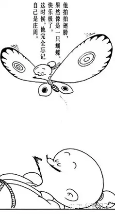
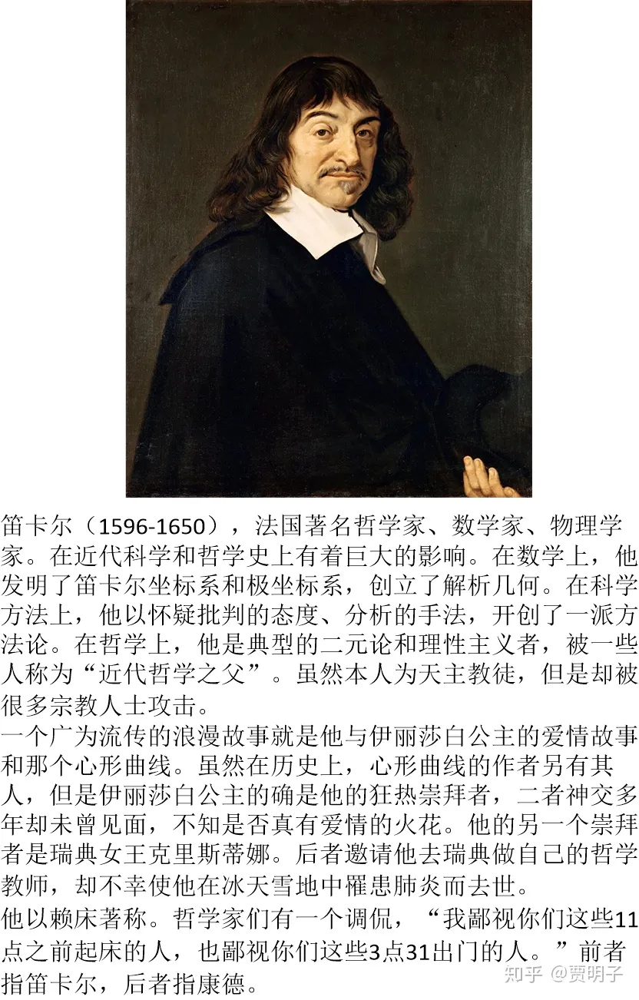

# 1、“我思故我在”说的是何种恶魔？

***“\*cogito ergo sum”**

**“我思，故我在”**

**- 笛卡尔**

2000多年以前，中国，楚地的一个开满鲜花的山谷里。

“啊，从来没有这样自在过。”他惬意地伸展了一下懒腰，“最近一段时间，什么牵挂的事都没有啊！”跟随着适意的心情，他的身体在空中轻巧地翻滚了两圈。
“嗯，看起来真的是美好无处不在，作为一只蝴蝶，有生以来，竟然第一次发现飞翔是这么美妙的一件事！”他轻轻地忽闪了一下美丽的翅膀，感觉到清风徐徐地从翅膀下面掠过，舒服极了。他于是更加欢快地扇动起来，越飞越高。

他低头俯看着地面，花朵像是海洋一样没有边际。有几只蓝色的蜻蜓优雅地停在花海之上，在阳光之下熠熠生辉。他感觉到这美极了。

“真的，我已经习惯了天空，以前竟然没有发现从空中俯瞰地面也是这么美丽……”他感慨着。

“不知道下面的蚂蚁仰头向天看的时候是什么感觉，它们看到的天空是不是和我看到的地面是一样的呢？”他突然感到非常的好奇。决定落下去，学着蚂蚁体会一下从地面看天空的感觉。

他看准了一朵鲜艳的向日葵，落了下去。花蕊散发着醉人的香气，让他忘掉了原本想要做些什么，一时之间慵懒得不想做任何事情。于是他闭上眼睛。

黑甜一梦……

不知道过了多少时间，他缓缓地睁开双眼。脑子里似乎还淹没在无边的睡意当中，一切显得那么缥缈、不现实。

“我想干什么来着？啊，想起来了，我要试试仰望天空是什么感觉”他睁开双眼向天空仰望。

黄昏，太阳躲在地平线边上，天上早已经开始闪烁着一颗星星了。“是那只蓝蜻蜓吗？我过去打个招呼吧！”

他下意识地挥动翅膀，突然之间，他发现自己的身体沉重之极，翅膀也不像往日那样轻盈。他惊讶地看过去，没有看到翅膀，看到的是……一双手。

他矍然一惊，翻身坐起来，然后，就从吊床上重重地跌向地面。

“我这是怎么了？”他惶然四顾，风仍然徐徐，花海仍然灿烂，但是他栖身的向日葵不见了。他再向远方看去，旁边有一间小茅屋。然后他又看看自己。

“我是……人？”他惊慌起来，“一定是什么东西搞错了，对了，我一定是在做梦！”他掐了一下大腿，然后疼得咧了一下嘴。

“看来这不是梦。难道说，蝴蝶才是一场梦？”他感觉三观被颠覆掉了。“不对，我感到疼，这应该不是梦。可是，这种痛觉也许是我的梦在骗我，毕竟，梦里面想要什么感觉都会发生的”

“我是谁？”他迷惑地摇晃了两下脑袋，脑子里似乎装满了浆糊，摇晃后更加糊涂了。他想喝一点茶。于是就走向茅屋。

像是随着他的心意出现一样，他发现茅屋前的石桌上放着一壶热茶。“梦中果然可以随心所欲啊！”他拿起茶来闻了一下，一股清香缓缓流入四肢百骸，他精神为之一振。

“我好像是庄周！”他想起来了。不过他又不敢确定，因为刚刚他还觉得自己是一只蝴蝶呢，可是呢？觉得自己是庄周，自己就是庄周吗？

“我到底是蝴蝶，还是庄周？到底现在是一场梦，还是刚才呢？”他感到越来越迷惑。“不管怎样，就算是现在是一场梦又能怎样呢？又有谁知道，梦本身就不是一种现实，而现实不是一场梦呢？”他感觉现在的思绪奇妙极了，于是想要把这场奇幻之旅记录下来。又一次，似乎是随着他的心意突然出现的一样，他发现手边就有一支毛笔，和一卷书简。

“笔真的是好东西，竟然可以记录想法，有生以来第一次感到这也是一件奇怪的事情呢！”他一边胡思乱想着，一边疾书：

**“昔者庄周梦为蝴蝶，栩栩然蝴蝶也。自喻适志与！不知周也。俄然觉，则蘧蘧然周也。不知周之梦为蝴蝶与？蝴蝶之梦为周与？”**

最后，他在竹简的抬头写下了一个题目《庄子·齐物论》

“又写完了一篇，”他长出了一口气。

“咦，我为啥说一个‘又’字呢？”他喃喃自语。

2000多年以后，茶桌旁边。

“庄周真的是一个有意思的人啊，有幸活在他的梦中真是一件奇妙的事情。我应该和我的乖女儿分享一下，她肯定喜欢。”一个中年大叔把手里的那本《庄子》合上，“话说回来，在这样一个怪人的梦中，我竟然有一个女儿。女儿，这可真是一件费心又可爱的事情呐！”

========================================

你有没有做过这样一个梦，这个梦虽然荒诞无比，但是感觉到头脑却是非常清醒，以至于你自己在梦中都不禁怀疑，这是不是个梦境？然后你掐了一下大腿，却总是得到一个结论：“没错，这不是梦。”可是当你醒过来之后回忆一下，似乎你掐自己的大腿根本就没感觉到疼！但是你在当时却坚定地咧了一下嘴。似乎掐那么一下子疼不疼根本不重要，它仅仅是个坚定自己对这个梦中现实信念的一个仪式。

你有没有做过这样一个梦，在梦中经历了一件恐怖的事情，然后矍然惊醒，心中大呼庆幸这不过是一个梦而已。然后你接着沉沉睡去，居然发现这个梦沿着刚刚的“剧情”继续下去，似乎中间你惊醒的那一下根本就没有发生过，你不禁怀疑到底是自己做了一个“连续剧”的梦，还是这个“连续剧”才是现实，而刚才惊醒的那一下子才是梦。

还有，像段子里说的那样，自己正在考试，发现一道题都不会做，一着急就醒了，发现只是一个梦。心里大呼庆幸的时候，更恐怖的事情发生了，发现自己原来自己真的是在考场上，真的一道题也不会做！

你又有没有这样一种经验：当你身边发生了某一件不可思议的事情时（例如，你突然抽中了全校仅有一个的大奖），你会一时之间难以相信，然后不禁怀疑自己是不是身处梦中。这时你也会掐一下自己，也会咧一下嘴，坚定地认为眼前一切都是真实的。但是，你会不会有那么一丢丢感到不那么坚定？会不会害怕下一刻你突然从床上翻身坐起、然后摇摇头觉得自己掐自己那么一下子纯属多余？

你现在会不会有一种冲动，掐一把自己试一试自己是否在梦中？你的周围，你的身体，你手里的这本书是不是纯粹自己在梦中制造的幻象？

那么，你现在会不会在想，到底是凭什么，我们觉得我们现在是身处现实之中，而梦是虚幻的？为何不是反过来，梦是个现实，而我们现在是虚幻的？或者说，梦和现实都是“真实”的，是我们经历的两个不同的世界？

“庄周梦蝶”中所说的，就是类似这样的一种经历。这个故事无疑是非常有趣的，它以一种浪漫的想象力，结合了庄子本人潇洒的文笔，直下2000多年，至今仍然保持着迷人的魅力。蔡志忠在他的漫画中，生动而诙谐地表现了庄周的这个奇梦：

但是，如果我们仅仅把它当做一个有趣的故事来听，未免辜负了这位先贤的伟大思想。这里，我们来挖掘一下这个故事背后的哲学命题。

1、 我们外部的世界是“真实”的，还是只不过是我们的梦境为我们制造的一个幻象？我们感官所认识的“真实”，到底存不存在？

2、 我们的意识透过五感来获取关于世界的知识。而在梦中我们自己所营造的幻象却可以轻而易举地欺骗我们的五感。那么，我们现在的认知，我们又如何知道它是可靠的呢？在一个不那么可靠的五感表象的后面，我们如何能够认知这个世界的“真实”？我们的知识，距离一个内核的“真理”有多远？我们有没有可能哪怕是接近这个内核？

这是两个相互关联但是又不同的问题，第一个，是个“**世界是什么**”的问题，而第二个，是个“**我们能否、又如何认识世界**”的问题。在后面我们会陆续看到，围绕着这两个问题，几乎涵盖了自然哲学的全部：“世界是什么”这个问题涉及到的是**本体论**，“我们如何认识世界”涉及到的是**认识论**。

我们通过感官获得的关于这个世界的知识，到底可靠不可靠？这个问题，困扰了一代又一代的思想家。我们如此痴迷于获得关于这个宇宙的“真理”，但是，谁又能够有自信说，“我对这个世界的认识是它的真实面貌”？我们甚至没有确凿证据来证明我们有能力区分“真实”和“虚幻”！

比如说，我们通过我们的各种感官体验一个事物，我们可以很肯定地说出我们对这个事物的观察：它的大小、形状、颜色、硬度、声音味道，等等。但是，你怎么知道你的感官“准确无误”地反映了现实呢？它有没有骗你？

当我们拿起一个苹果，我们会立刻得到对它的一些印象：比如说，它是红绿相间的，非常漂亮。但是我们知道，旺财是不辨红绿的。它是不会看到苹果的这种鲜艳的颜色的，在它看来，苹果是灰色的。那么，红绿色和灰色，哪一个才是“真实的”颜色呢？

你可能自然而然地认为，旺财是个红绿色盲，因而它看到的，是一个“假的”苹果。但是你凭什么认为我们不是某种颜色的色盲？就像是旺财从来就无法想象红绿是何种体验一样，是否有某些颜色，是我们先天漏掉而无法自知的呢？事实上，苹果反射的光有着很宽的颜色分布（色谱），而我们只能看到其中很小的一部分。比纯紫“更紫”的紫外线、比纯红“更红”的红外线，我们是看不到也无法想象它们会是神马感觉的。但是，像猫、蛇等动物可以看到红外线、而蜜蜂等昆虫可以看到紫外线。那么是否它们会认为我们看到的也是一个“假的”苹果呢？

我们以此类推，凭什么它们看到的就是“真的”苹果？

再例如说听觉，听力最好的人类也只能听到20Hz~20KHz的声音。更低的低音（次声波）和更高的高音（超声波）我们是听不到的。但是旺财就可以听到。这就是为何狗哨是无声的，但是旺财听了会很兴奋。我们所能听到的，只是这个世界的一小部分。

再比如说触觉。如果把你的眼睛蒙起来，然后拿两根针轻轻扎你的皮肤，当这两根针扎的位置比较靠近的时候，你会感觉到只有一根针在扎你，只有当它们距离足够远，你才能知道有两处地方同时在疼。

再比如说，我们去看3D电影，电影中的一些镜头如此逼真，例如一颗子弹向你飞来，让你惊得跳起来。然而当你摘下眼镜，你立刻发现这都是假象。那么你怎么就知道你在“日常”看到的栩栩如生的各种事物，不是你的眼睛这幅“眼镜”造成的错觉？

**我们的感官究竟欺骗了我们多少？**

那么我们继续探寻下去：即使说，我们的感官能够真实地反映世界。那么，我来问你，何为“真实”？你能否有任何办法可以确定，我看到绿色的感觉，和你看到绿色的感觉一模一样？如果说，我看绿色的感觉和你看红色的感觉是一样的，而反之我看红色的感觉和你看绿色的感觉是一样的，我们有任何办法可以察觉吗？根本就没有。你甚至无法分辨我看红色的感觉是不是跟你听到小提琴的声音是同种感觉。

那么，你通过你的五感所感知的外部世界，和我通过我的五感所感知的外部世界，可能根本就是完全不同的。我们看到的世界，是透过我们的感官、由我们的主观进行诠释过之后的世界。当我们带上红色的有色眼镜看世界时，我们看到的一切都是红色的。我们所认为的“真实”，与眼镜后面的真实大相径庭。那么，我们前面已经知道，我们的眼睛本身，其实也是一种有色眼镜– 滤过了红外和紫外的眼镜。同理，我们的其它一切感官也同样都是这样的“有色眼镜”。甚至，我们的主观感觉 - 我们大脑对各自感官信号的处理 - 也是受限于我们大脑功能的，是滤过了一切大脑所不想、不能、不该处理的信号的一副**主观有色眼镜**。我们看到的世界，是被我们佩戴的主观的有色眼镜扭曲过的真实– 你甚至不知道这幅有色眼镜背后有没有一个所谓的“真实”。于是你急切想知道，脱离了主观的有色眼镜，这个世界是什么样子的？

然而我们没有任何办法脱离这种有色眼镜看世界：我们被自己的主观和感官牢牢地框住了，感官提供给我们一种感知外部世界的手段，但是同时也把我们限制在感官的局限之中。离开了感官、离开了主观，我们甚至不可能知道有没有外部世界。

这么看来，我们对世间的一切事物的感知和观念，可能都是不那么可靠的。

那么究竟，**我们能不能找到任何一种我们的观念，我们可以确信它是可靠的呢？**这个问题，被笛卡尔回答了。

笛卡尔最初也是对“我们对世界的感知到底可不可靠”这个问题困惑不解。和庄子类似，他也是通过思想实验来论证这个问题。但是在我看来，笛卡尔的思想实验远远不及庄子浪漫，但是却得到了一个哲学史上里程碑式的论断。

笛卡尔想象了一个邪恶魔鬼（“evildaemon” 或“evil genius”）。这个恶魔具有非凡的能力，与上帝相比，它几乎具备了上帝的一切无所不能的能力，只是它是一个很调皮的魔鬼，它把它的全部能力都用来玩弄笛卡尔的感知和观念：它营造了一个宏大的幻象来迷惑笛卡尔。当笛卡尔睁眼看、侧耳听、伸手摸、探鼻闻时，他所能感受到的一切，都是这个恶魔用幻术骗他的。他看到自已有一双手，手上的触觉真实无比，可是他完全没有任何办法辨别清楚，这双手是自己真实所有的，还是恶魔在欺骗他的呢？他喝一口葡萄酒，一股芬芳沁入心脾，然而他同样无法确定，这种芬芳的感觉到底是从何而来？他可以想象一下看似确然无误的几何定理，以及数学运算，但是，这是不是恶魔操纵他的灵魂，让他觉得这些数学就是这么严谨准确的呢？他同样无法回答。也就是说，他几乎有理由怀疑他所见、所感、所知的一切。

然而，笛卡尔最终还是发现了一个无可怀疑的、确定无误的事实：那就是“我”在思考。没错，当“我们能不能找到一个无可怀疑的观念”这个问题提出的时候，至少有一件事是可以肯定的，那就是**有一个东西正在提出这个问题，**在思考这个问题 - 这个东西就“我”。“我”确定无误地知道自己正在思考，这才使得我前面的一切怀疑成为可能。那么，既然“我”在思考是一件确定无疑的事情，那么我们自然就知道，**不论外部一切事物真实存在与否，“我”一定是存在的**– 否则的话，思考就失去了主体从而变得不可能。那么，“我是真实存在的”这件事是毋庸置疑的。因而，笛卡尔说：

> ***“cogito ergo sum（我思故我在）”\***

不难看出，笛卡尔关于“我”的认识就是：**一个正在思考的东西**。这是我们唯一所能够确知的，也就是“我”的全部含义，而无关肉体和器官。

那么，现在我们有了这样一个**可靠的观念**，笛卡尔认为，剩下的一切，我们就可以以此为基础，运用**分析和逻辑判断**，来一一作出判定：它们是可靠的，还是不可靠的？

笛卡尔在他的《第一哲学沉思集》中，践行了整个对这些观念的分析和判断过程。他的详细论证过程过于详细，我就不一一讨论了。这里大致说一下他的思路。

**首先，证明上帝的存在**：因为我存在，那么我不是凭空存在的，我的存在必须要有一个原因。这个原因是什么？是父母吗？是我自己？是某种不完美的存在？还是我根本就一直存在？他把各种原因一一分析，在排除了其它可能后，笛卡尔把它归结为一个完美的上帝。在此基础上，笛卡尔进一步论证上帝的存在。他说，“我”是一个不完美的个体，然而“我”却可以想象一个完美的上帝存在。而一个完美的存在是不可能从不完美的存在中产生的，那么“我”心目中上帝的概念，必然不是我自己产生的，它一定是源自完美的上帝本身。

**然后，论证外部世界的存在以及外部世界与精神世界的差异性**。他说道，由于上帝是完美的，因而他不会欺骗我，也不会容许一个欺骗我的“恶魔”存在，所以，我的所知所感，不会是产自恶魔的欺骗，那么它必然就是产自外部世界。因而外部世界也是存在的。然而外部世界有着和我的精神世界种种截然不同的差异性。例如，任何外部世界的存在都是可分的（比如说身体可以分为头部四肢躯干，头部又可以分为面部后脑勺等等），然而作为“一个思考的东西”的“我”是一个不可分的存在。我们从来就不能想象存在一个“我1”和“我2”之类。

**再然后，论证精神与肉体的分立性**。上面已经提到了精神世界和外部世界的明显差异。然后，精神和肉体有一个决然不同的性质，笛卡尔进一步如是说，那就是他们的可疑性。也就是说，“我”的思考– 我的精神和意识活动 - 是一件可以确定无疑的事情，然而在此之外的每一件事情都不具备这样的性质，因而都是可疑的。精神和肉体之间的这种不同，是不需要任何其它证据，由“我思故我在”直接推论出来的，因而这是一种无可怀疑的不同。那么，根据莱布尼兹的**“无区分原理”（indiscernibility of identical principle），**我们可以认为，如果两个事物是相同的，那么它们的所有性质都必需相同。然而现在我们已经确定无疑精神和肉体有这么一个性质完全不同，那么精神和肉体（或者一切物理实体）必然不同的两种事物。因而，笛卡尔很自信地断定：精神和物理实体是两种分立的、不同的事物。精神是存在的，物理实体也是存在的，那么精神和肉体（物理实体）就是两种并立存在的不同事物。

那么，我们就达到了笛卡尔的哲学沉思的结论：

1. **精神-客体分立性（mind-body dualism）**[[1\]](https://zhuanlan.zhihu.com/p/38473195#ref_1)
2. **外部世界可理性认知。**

这两点中，第一点，是本体论的观点，讲的是存在；第二点，是认识论的观点，讲的是我们对存在的认知。我们说，笛卡尔的哲学观点是本体论的**二元论**，以及认识论的**理性主义**。这两个词具体是何含义？笛卡尔的想法真的就那么可靠吗？我们后面来讨论。

下一章：[贾明子：2、形而上学是什么？](https://zhuanlan.zhihu.com/p/40119556)

进入专栏：

[何为现实？拉普拉斯之妖与薛定谔猫之决战zhuanlan.zhihu.com/c_186387023](https://zhuanlan.zhihu.com/c_186387023)

------

## 参考

1. [^](https://zhuanlan.zhihu.com/p/38473195#ref_1_0)经常被译作“灵肉分离”，但是我不喜欢这种翻译法，因为它暗示了某种神秘主义的东西。这显然不完全尊重笛卡尔本人的哲学观。

发布于 2018-06-25 16:14

