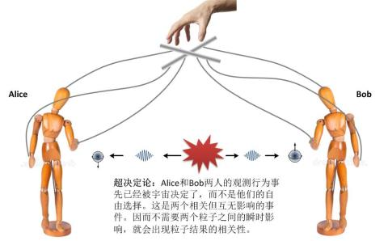
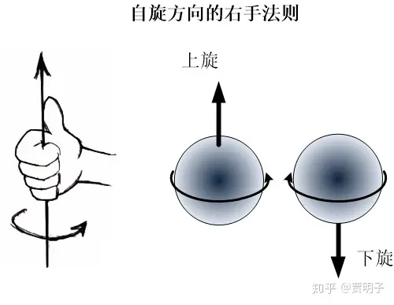
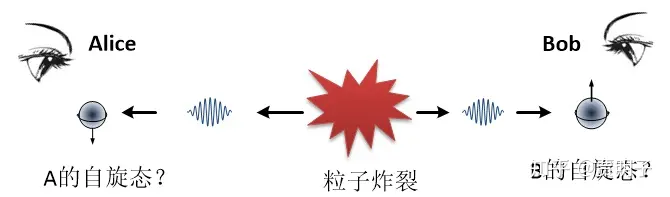
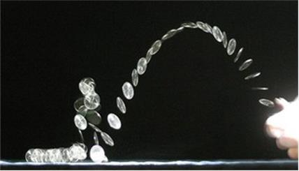
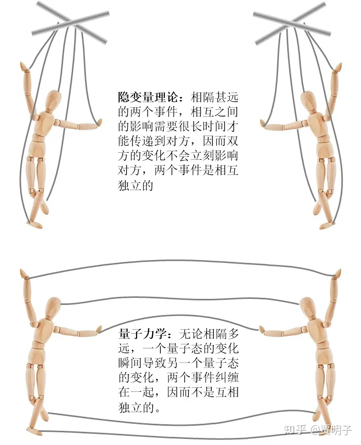
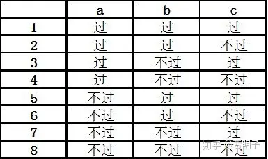
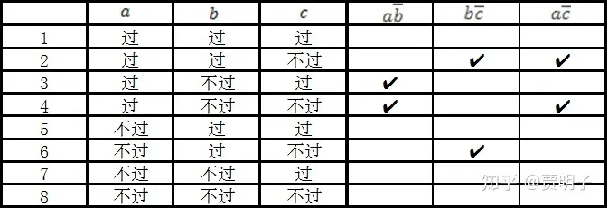
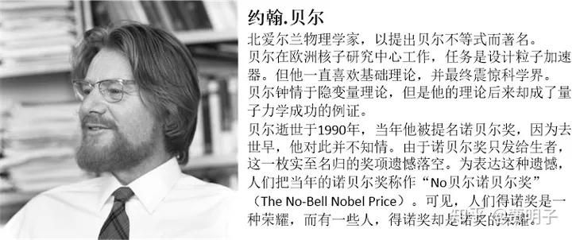

# 20、量子纠缠、定域现实、自由意志

> “Bell’s theorem is the most profound discovery of science.”
> **“贝尔定理是最具深远意义的科学发现。”**
> – Stapp

*注：本文从本人如下专栏文章合并简化而来：*

*[贾明子：未竟稿之二、量子纠缠83 赞同 · 12 评论文章](https://zhuanlan.zhihu.com/p/29819368)*

*[贾明子：未竟稿之三：实在性、定域性、以及自由意志566 赞同 · 98 评论文章](https://zhuanlan.zhihu.com/p/30050315)*

玻姆力学在现代量子力学的发展中可算是一个异类，它几乎是唯一一个并不遵守裸量子力学 – 也就是狄拉克和冯诺依曼总结的五大公设 – 形式体系的的量子理论。它为大家提供了一个新的视角：我们不必为量子理论打上“革命”、“怪异”、“震惊”等标签，在保留了绝大多数经典视角的情况下，仍然可以得到一个符合实证的物理理论。

然而，在保留了决定论和实在论之后，玻姆力学对经典理论的最后一个观念，定域性，却无能为力了。这是因为，引导波并非是一个在真实空间中的一个可以观测的波动，而是在所谓的**“位形空间”（configuration space）**，的抽象波，这里的术语你大概不懂，指的是粒子的所有可能状态的波动。它的后果就是在多粒子系统中，一个粒子的变化就不可避免地瞬间影响空间中的所有其它粒子 – 无论多远。这就是“**非定域性**”。

物理学家为何对“非定域性”如此敏感？因为物理学中，任何影响都是局部的，有传播速度的。A的变化不是不可以影响到远方的B，但是这个影响是以一定的速度传播过去的，而不是瞬间跨过千山万水。这个传播的速度有一个上限，就是**光速**。比如说，你在远方喊我，必须是你先喊，过一点时间后，我才能听到。再比如，我们看到的远方的星星，其实是它们以前的样子，因为光通过如此遥远的距离传播过来花了一段的时间。还有，如果现在我们的太阳突然发生了大爆炸毁灭掉了，我们是不会立即知道的，直到8分钟以后我们才知道，因为那是光从太阳跑到地球所用的时间。

在我们前面的章节我们提到过，在相对论中，没有一个普适的时钟，每个人的时间都是不同的。因而所谓的“瞬时影响”也就不会存在。因为我们提到“瞬时”的时候必然要问：“相对于哪一个观察者是瞬时的？”例如Alice看到A瞬时影响到了B – 也就是说AB同时发生，但是在Bob看来，它们就可能不是瞬时发生的，而是A先发生而B后发生；但是在第三个人，例如Cathy看来，就又可能是B先发生而A后发生了。这样一来就会引起因果关系的错乱，一件事的起因还没发生，可是它的后果却可能已经出现了；或者说一个人穿越时空回到过去杀掉自己的外祖母阻止自己出生，如此等等，天下大乱。因此科学家们是不会容忍这种超光速的瞬时影响发生的。

不满足定域性，这就是爱因斯坦对玻姆力学最不满意的地方。随后，爱因斯坦意识到，更加严重的问题出现了：并仅仅不是玻姆力学非定域，而是**整个量子力学都是非定域的**。玻姆力学的非定域性其实就是起源于量子力学本身的非定域性。

其实在我们前面谈到波函数和波函数坍缩的时候，这种非定域性的影响就已经随处可见了，只不过你可能还没有注意到。一个波函数在坍缩时，会同时改变它在整个空间的概率分布，这本身就是一个非定域性的源泉。比如说，我们有一个位置不确定度很高的电子，它的波函数在空间分布很宽，也就是说它在一个广袤空间中随处都有出现的可能。当我们对它进行观测的时候，它各个位置的叠加态迅速坍缩，变成空间中的某一个点（我们把它叫做A点）。那么这时我们立刻知道，这一瞬间，这个电子在空间其余的任何地方，无论距离有多远多近，都不可能出现。此时，如果空间中有另外一个电子，那么两个电子之间就会互相影响。比如说，因为相互之间的斥力，一个电子出现概率高的地方，另外一个就不大会出现在附近。此时，如果我们观测了其中一个电子A，就会瞬时改变它的量子态，使其在空间的分布清零。那么，另一个电子B的分布也就会瞬时受到影响。因为B的概率是受到A的概率影响的，观察之后，A坍缩了，变成了确定值，那么此时B的概率就会受到这个确定值的影响，所以分布就不可避免地因此变化：也就是说，对A的观测瞬间就影响远方的B。

按照经典图景的看法，这个过程是没有任何“瞬间影响”的。原因是，两个电子在空间概率性的分布，只是因为我们的**无知**造成的：两个电子都有确定的位置，只是我们不知道而已，并不是它们真的在空间中弥散开的。我们测量A，得到A的位置信息后，同时改变了B的空间概率，但是，这个瞬间发生变化的只是**我们对B的知识**，而不是**B的状态**。而按照量子力学的看法，两个电子的量子态就是它们运动状态的全部，当A坍缩时，B的改变，是其量子态实实在在的改变。因而，我们对A的改变，实实在在地瞬间改变了B的状态。

真正把这种非定域性的效应明显地呈现在我们眼前的，是所谓的**EPR佯谬**，在石破天惊的1935年，爱因斯坦以他超凡的洞察力，对量子力学发起了最为致命的最后一击。这一击，把量子力学最为尖锐的矛盾，也是最为奇葩的一面暴露在了物理学家的面前。就是非定域性和实在性之间的矛盾。

下面我们一起看一看著名的EPR佯谬以及它所引出的量子力学最为独特的现象：**量子纠缠**。在这里，量子纠缠有史以来第一次明确地展现在世人面前。

EPR三个单词，是三个人名字的组合，爱因斯坦（Einstein）和他的两位博士后助理，Boris Podolsky 和 Nathan Rosen。在1935年，三人发表了一篇论文，题目叫 “量子力学对物理现实的描述是完备的吗？”（Can Quantum-Mechanical Description of Physical Reality Be Considered Complete?） 对于波函数（态矢量）对物理实在描述的完备性，提出了强有力的质疑。值得一提的是，EPR中的另外两位，虽然在这个话题中不幸掩盖于爱因斯坦的巨大阴影中，也都不是凡人。其中Rosen 很著名的贡献就是提出了“虫洞”理论（这无论放在物理学史的哪一个阶段，都是一个了不起的发现）；而Podolsky，据证实是前苏联的克格勃。

当然众所周知，这篇论文中的核心思想全部出自爱因斯坦。但是因为当时爱因斯坦的英文水平还很不行，文章是Podolsky执笔写的，并且在提交之前，爱因斯坦并没有阅读过。事后爱因斯坦对论文的表述表示了一些不满意，认为它画蛇添足地讨论了一些无关主题的东西，使得真正的主题反而有些模糊。后来，直至1951年，玻姆提出了他的版本的EPR佯谬，用“自旋1/2”系统，简单明了，成为我们现在最广为人知的一种版本。这里我们略过最初的EPR版本，直接谈论玻姆版的EPR佯谬。

“自旋”是微观粒子的一个独特现象，这在我们宏观世界中是不存在的，并且很难以用宏观现象来直观想象。最接近的类比，就是一个旋转的小球，虽然它和微观粒子的自旋有着种种显著的不同，但是现在我们暂时用它来类比还是可以的。一个旋转的小球，它可以有不同的旋转方向，比如从一个方向上看去，它可能是顺时针旋转，也可能是逆时针旋转。因为顺时针和逆时针从不同的方向看过去是不同的，因而物理学里面不用这种称谓来区别旋转方向，而是用一个叫做“右手规则”的方式来规定自旋的方向为“向上”或“向下”。

EPR佯谬是一个**思想实验**，着这里，我们设想一个静止的、没有自旋的粒子突然发生了一个爆裂，分成了两个相同的粒子A和B，然后这两个粒子向着两个相反的方向离去。整个过程我们对它不进行观测。直至A跑到宇宙的边缘，而B跑到宇宙的另一端。这时候有两个人，分别在两端等着，A这边是Alice，B这边是Bob[[1\]](https://zhuanlan.zhihu.com/p/53259306#ref_1)。然后他们都在同一个方向上对这两个粒子分别作出观测，结果会是怎样？

物理学中有一个普适的基本定律，叫做**角动量守恒**定律[[2\]](https://zhuanlan.zhihu.com/p/53259306#ref_2)，这个定律指出，孤立系统的总角动量保持不变。角动量是一个旋转的“强度”的度量。既然一开始的粒子没有自旋，那么它分裂成两个粒子之后，两个粒子就必然会把整体的自旋抵消掉，也就是说，A和B的自旋方向必然是相反的。**这件事可以说是非常古怪了。**

你可能会觉得，这简单得很啊，哪里来的古怪？且听我细细道来。

按照经典图景来理解，这件事当然没有什么可奇怪的：粒子分裂成为两个自旋相反的粒子，然后这两个粒子就保持着自旋的状态一直到了Alice和Bob那儿，这没毛病。你只需要把粒子当做经典的小球就可以了：两个人观察到的结果总是相反的，是因为这两个粒子本来就是**以相反的自旋产生**的啊，它们从在一个粒子分裂出来的时候起一直就是相反的啊。在我们观察它们之前，我们只是不知道它们各自是什么状态罢了，但是我知道，即使我不观察，它们的自旋也总是相反的啊。

但是按照量子力学的思维，古怪之处就来了：按照哥本哈根的思想，**当我们没有观察粒子的自旋态时，它们没有确定的自旋方向，**它们一直保持着一种上旋和下旋相互叠加的叠加态！直到它们分别到达Alice和Bob身边，两个人对它进行观察的时候，它们才被坍缩，因而获得了确定的自旋方向，是观察这个行为**造就**了它们的确定状态。当Alice观察A的时候，A从叠加态坍缩到了一个状态，比如说，上旋。那么在同时，宇宙另一端的B就会立刻从叠加态坍缩到下旋态。也就是说，在宇宙的一端对一个粒子的观察，瞬间导致了宇宙另一端的另一个粒子获得了一个状态！

有一个常用的例子来更加直观地说明这个问题：比如说有一副手套。我们现在随机地用两个盒子分别把两只手套放进去，这个过程谁也没有偷看，因此谁也不知道两副手套各自在哪一个盒子里。然后Alice和Bob分别保管一只盒子，乘坐飞机，Alice来到北京，而Bob到了地球另一端的纽约。两个人约好，明天中午同时打开盒子，看看各自盒子里面的到底是左手还是右手。在这之前，两人谁也不知道打开会是什么结果，于是就他们自然而然地认为结果将是随机的，得到左右手的概率各是50%。而这种随机性，就像是我们在第一部分，

[贾明子：4、抛硬币和概率性173 赞同 · 25 评论文章](https://zhuanlan.zhihu.com/p/28551569)

中所说的，表现的是我们对这副手套**认知的不确定性**，而不是手套状态**本身的不确定**。我们虽然用概率来描述我们的观察结果（“左手”还是“右手”概率各占50%），并不是因为手套的问题，而是我们的问题 – 我们没有能力发现那个“隐变量”（盒子中所藏的手套真实的“左右”状态）。

到了约定的时间，Alice打开盒子，发现里面是左手，那么她即使是只用脚后跟考虑也会瞬间知道，在纽约的那一只是右手。Bob也是同理。这是我们日常生活中非常常见的画面，一点都不奇怪。反过来如果两边得到的结果不总是相反，那样才会奇怪呢！**这里瞬间发生变化的，是Alice对纽约手套的认知，而不是纽约手套的状态，**因为它从一开始就是右手，从来就没变过。

但是如果我们的手套是一副“量子手套”，在量子力学看来，一直到约定的那一刻之前，两个盒子里装的，不是确定的哪一只，而分别是两只手套的叠加态，左手+右手！这一双手套的量子态可以这样描述：

$|\psi\rangle=\frac{1}{\sqrt{2}}\left( |左手\rangle |右手\rangle+|右手\rangle|左手\rangle \right)$

这个公式的含义就是，这两个手套的**复合系统（composite system）**由两个状态的叠加：其中一个状态是A是左手B是右手，另一个状态是A是右手B是左手。那么，当Alice看到北京的手套时，她的观察“赋予”了北京的手套一个坍缩的状态（比如说，左手），而在这一瞬间，她也同时决定了纽约的那只手套从叠加态向着另一个状态（右手）坍缩。

这，就是量子纠缠，是爱因斯坦打死都不相信的**“幽灵般的远距离作用”（“spooky action at a distance”）**。

因此，爱因斯坦说，既然量子力学必然导致这种超光速的瞬时作用，那么说明它必然是有问题的，问题就在于，它忽略了“隐变量”，也就是说，叠加态的背后其实是“真实”确定的状态，我们用叠加态来描述粒子是不完备的，它不能够告诉我们，比量子态更加基本的、“真实”的状态。

EPR思想实验是爱因斯坦对量子力学的深刻洞察力的一次大表演，足以让世人震惊。很多人被大众科普所误导，认为爱因斯坦一直不能理解量子力学，其实不是的，爱因斯坦恐怕是当世对量子力学理解最为深刻的人了。这个思想实验一针见血，直接把量子力学的终极特征（薛定谔说的，“THE characteristics”）暴露给世人。而在同时，玻尔在相当长的一段时间内却无法get到爱因斯坦的深刻之处。但是理解归理解，爱因斯坦却至死不能相信它。

平心而论，爱因斯坦用超光速作用来质疑量子力学，未免苛求。因为量子力学从一开始，就**不是一个相对论性的理论**，它不满足洛伦兹变换（直到后来，狄拉克发现了相对论量子力学的基本方程，狄拉克方程，再后来发展了量子场论，才是真正的相对论量子力学）。因而要求它和相对论兼容，就有些鸡蛋里挑骨头的意思。

但是，有趣的是，量子纠缠其实并没有与相对论冲突。没错，它确实意味着远距离的瞬间影响，但是这种影响是完全随机的。相对论所不允许的超光速，指的是**信息的传递速度**，或者说**因果关系的传递**不能超光速。但是，当Alice观察A的时候，她是完全不可能控制观测结果的。现在她想利用量子纠缠给宇宙另一头的Bob发一条短信，她用上旋代表1，下旋代表0的话，如果她可以控制每次的结果，那么当她观测得到0的时候，Bob必然就得到1，她就可以用这种方式发出一串数字串，把想发出的信息编码到其中，Bob就可以立刻得到短信了。但是，我们知道，她每次的观测结果都是完全随机的，她自己对此**毫无控制能力**，她想发0的时候，可能观测结果却是个1。因此，Bob那边得到的编码只能是毫无信息负载的白噪音，除此之外什么都得不到！我们唯一知道的，是Alice和Bob观测结果之间的相关性：它们必然是相反的。而这个信息，并不需要观测时才揭示出来，在两个粒子产生的时候，我们就**早已经**知道了，观测结果并没有给我们带来任何新的信息。因而，**超光速的信息传递是无法实现的。**

还有，Alice和Bob同时做出观测，这个“同时性”在相对论中是相对的。这时在地球的人可能看到，Alice先做出观测，导致了A的坍缩，进而导致B的坍缩，因而容易得出结论：Alice观测是因，而B的坍缩是果。而在一个快速飞船的人可能看到的正相反，是Bob先看到了B的状态，而后Alice对A才进行观测，那么这是不是结果先于起因产生了呢？其实， Alice观测导致了B的随机坍缩，还是Bob先观测导致了A的随机坍缩，这两者之间是完全**无法分辨**的，因为不论是谁先谁后，Alice和Bob的观测结果都是一串无意义的随机结果而已，他们都没有办法分辨，自己所观测的这个粒子，是已经被对方坍缩过的，还是没有被坍缩过的？而这时，地球上的人和飞船上的人只是互相对谁先谁后产生了分歧，但是却丝毫不影响因果关系。

因此，量子纠缠虽然产生了远距离的瞬时关联，却从严格的操作层面上并没有违背相对论。

但是这也足以引起很多科学家的极度不舒服。让他们急于想得到一个答案：爱因斯坦说，**客观现实是独立的，物理是定域的**（没有“幽灵作用”）；而量子力学则说，**只有依赖于观察者的外部世界，没有所谓的“客观”实在，并且物理是非定域的。**这两者之间，怎么看都是前者容易让人接受，而后者更像是梦话。我们为何要抛弃一个顺理成章的思想，非要去认可一个如此怪异的想法呢？

爱因斯坦是正确的吗？量子力学真的不完备吗？我们需要用事实说话。

好了，现在我们有两种说法：

\1. “经典观”：爱因斯坦说，两个盒子里的手套分别有明确状态，当我们知道了一只手套的状态时，我们立刻就知道了另外一只手套的状态。

\2. “量子观”：两个盒子里的手套没有确定状态，都是左手和右手的叠加态，直到观察其中一只，它才能获得一个状态。在它获得一个确定的状态后，另一只手套同时获得了另外一个状态，然后我们同时知道两只手套的状态。

我们现在需要设计一个实验，让事实说话，来看看哪一种说法才是正确的。乍看上去，这两种说法的区别仅仅在于说法而已，它们的核心区别，指向的是“尚未观察时”是否存在一个确定的的状态？然而，在尚未获得观察结果的时候，粒子发生了了什么，在实证中是不可能加以判定的。只有在我们观察它之后，我们才知道它是否正确。但是一旦我们观察了，我们得到的结果就必然是一样的：它们必然是相反的。而我们需要的是这样一种实验，让这两种说法的区别能够体现在它们所导致的不同的**观测结果**上。

从实证的角度讲，上面的这两种说法可以分辨吗？它们的说法虽然不同，但是最终表现给我们的，难道不是一模一样，无法区分的吗？实验对两种说法会有不同的结果吗？如果两者的结论在实验上真无法区分，那么它们的区别就不是一个物理问题，而变成了一个哲学问题。

但是，令人欣慰的，也是令人惊奇的是，我们确实有办法做实验对这两种说法加以分辨。这就是**贝尔不等式**。

要知道，我们所纠结的，在于两个事件之间的相关性，以及发生这种相关性的机理。当我们谈到相关性的时候，我们必须要明白，有两种不同的情况。

1、 两个事件之间存在着相互影响，因而导致一个事件的发生会直接影响另外一个事件。比如说，你和我各自在自己的房间里，这时候午饭时间到了，我喊你一声“开饭了”，然后我们两人同时出门走向餐厅。这时候我们之间的这种同步行为 – 这种关联性 – 就是因为我们之间的直接相互影响。

2、 两个事件之间不存在互相影响，但是它们的发生都同时决定于同样的一个第三者事件，因而两个事件如何发生都是由这个第三者事件决定的。这样这两个事件之间也会表现出相互关联。比如说，你和我各自都在自己的房间里待着，这时，妈妈在厨房里喊了一声“开饭了”，于是我们两个同时从自己的房间走出，然后一起到达餐厅。这时候我们之间虽然没有直接相互影响，但是仍然表现出行为上的相关性。

按照“经典观”，两个粒子在诞生之后，就各有相互**独立**的状态[[3\]](https://zhuanlan.zhihu.com/p/53259306#ref_3)。当两个粒子远远地分开后，A的任何事件，都不会再影响到B了[[4\]](https://zhuanlan.zhihu.com/p/53259306#ref_4)。A和B两者在被观察时的行为必然都是相互独立的，两个粒子之间的相关性由它们诞生的事件决定的，而与后续一切事件无关。这时候，无论我们对A做什么，B的行为都不会受到影响。我们观测B时，其观测结果仅取决于它的产生时那一刻，与A不再有任何关系。

而按照“量子观”，两个粒子在诞生后就共同处在一种纠缠的叠加态，相互不独立。其中任何不管哪一个发生了任何一个事件，必然会同时影响到两个。所以对两者的**观察所产生的结果**就不再是独立的事件，而是**互相影响**的。在这里，如果我们先观察了A，由于不同的观察行为会产生不同的影响，因而B的观察结果会根据先前A采取了什么样观察行为而相应地表现出不同的结果。也就是说，如果我们先观测A，那么B的观测结果就不再取决于它诞生时刻了，而是取决于对A的观测行为。

也就是说，在一开始，A和B存在着某种关联，这种关联取决于它们的诞生事件。按照经典观，这是前面说的第二类相关性，不论我们作何观测，这种相关性将完全保持不变，如果我们一次次地重复实验，就可以看到两边观测结果的关联性保持着前后的一致；但是按照量子观，对AB任何一方的观测都同时影响两边，所以A所经历的不同观察行为，会以不同的方式干扰B的观察结果，因而B的观察结果会根据A采取了何种观察行为而有所不同[[5\]](https://zhuanlan.zhihu.com/p/53259306#ref_5)，从而AB的观察结果的相关性就不仅仅取决于它们的诞生事件，而且还取决于我们采取了什么样不同的观测组合。因而在重复多次的实验中，我们随机地变换观测组合，我们就会发现观测结果的相关性不再保持一致。按照这种逻辑，我们就可以设计我们的实验，来判断经典观和量子观之间的区别。如果我们的测试手段足够多，这种相关性的变化就能体现出来。

现在我们准备了3种不同的观测实验手段（分别记做实验a、实验b、实验c），每个实验都会产生两种结果，“通过”和“不通过”。然后我们用一个发射器，发射一对互相纠缠的粒子。我们的发射器可以设计成这样：它所发射的一对纠缠粒子，用同一种测试手段，必然会产生相同的实验结果（互相**正关联**）。它们可以同时通过a，也可以同时通过b、c，而决不会发生一个通过而另一个不通过的情况。现在我们不停地产生很多对相互纠缠的粒子，一一发给Alice和Bob，然后他们每次都各自做随机地从这三种实验手段中取其一来对收到的粒子进行测试。那么我们看看，他们的实验结果会是如何。

按照经典观，每一对粒子都各自有着“隐变量”，当它们在诞生的时候，它们的状态就已经被这些隐变量唯一确定了。而不论这些隐变量遵从何种规则、它们的具体状态是什么，它们都是不依赖于观察者而唯一确定的。这些粒子的产生是随机的，在产生它们的过程中唯一的约束就是前面提到的关联性：它们在同样的实验中得到同样的结果。而对于一个有着某种确定状态的粒子，进行3种测试的任何一种，必然会产生某一种确定的结果。比如说，对于一对确定的A和B，它们可能会同时通过实验a，而不通过b和c；而对于另一对确定的A和B，它们可能会同时通过实验b，而不通过a和c。这3个测试结果一共有几种不同的可能性呢？每一种实验都有通过和不通过两种可能，那么三种实验，一共就会有2×2×2=8种可能，我们很容易列表把所有的可能都列出来：

不论我们如何变化这个实验，不论这两个粒子在发射出来的时候有什么样的状态，它们的测试结果必然是以上的8种之一，而不可能超出这个范围。

那么，我们开始不停地给Alice 和Bob发射一对对的纠缠粒子，然后他们各自随机地从3种实验手段中任选其一来对收到的粒子进行测试。有时候他们碰巧选择了相同的测试手段，那么他们必然获得相同的测试结果：要么都通过，要么都不通过。当他们碰巧选择了不同的测试手段呢？就会有各种不同的测试组合和相应的测试结果。比如说，从所有的这些实验结果中，我们从中只抽出三种情况，来看它们发生的频率：

1、一边a的实验通过，而另一边b的实验不通过，我们记做$a\bar{b}$

2、一边b的实验通过，而另一边c的实验不通过，我们记做 $b\bar{c}$

3、一边a的实验通过，而另一边c的实验不通过，我们记做 $ a\bar{c}$

我们把这几种情况全部列表出来：

根据上表，我们可以看到，只有在3、4两种可能性的情况下，会出现a过b不过的结果，只有在2、6两种可能性下，会出现b过c不过的结果，而只有在2、4两种可能性下，会出现a过c不过的结果。我们很容易发现，不论我们的纠缠粒子对是以何种状态发射出来，如果得到了ac的结果，那么这对粒子对其他的测试组合，必然会得到要么$a\bar{b}$、要么$b\bar{c}$。而反之则不成立。也就是说不论粒子按照哪一种状态发射，大量实验结果下来，我们得到a过b不过的频率P（a\bar{b}）、b过c不过的频率P（$b\bar{c}$）、a过c不过的频率P（$a\bar{c}$）之间，必然有如下关系：

$P\left( a\bar{b} \right)+P\left( b\bar{c} \right)\geq P\left( a\bar{c} \right)$

这里，如果我们发射的粒子只有2、4两种情况，上面的不等式就变为等式，否则，它就是不等式。

这，就是**贝尔不等式**的一个变种。

贝尔不等式，顾名思义，它是由一个叫做贝尔的人最早提出的。他的全名叫做约翰.贝尔。他本人一直是隐变量理论的支持者，因此，他相信，我们做实验得到的结果，必然会满足这个不等式。

贝尔不等式的逻辑非常简单，我们不需要任何高等的数学知识就可以大概理解。但是它所揭示的思想，却不可谓不深刻。要知道，我们事先并没有限制某一种**特定的**隐变量理论，这里只有一个预设前提：定域性，即相隔足够远两个事件之间不存在瞬时的相互影响，因而两个事件是独立的。也就是说：

**任何一种可能的定域隐变量理论都满足贝尔不等式。**

这句话说的直观一点，可以这样解释：如果有一种关于粒子运动的理论，不论这种理论具体是什么样子，只要它有这样两个特征：

1、 这个理论认为，粒子存在一种独立与观察者的状态；（**实在性**）

2、 这个理论认为，粒子之间不存在瞬间相互关联。（**定域性**）

那么，它必然满足贝尔不等式。这两个条件综合起来，就叫做**定域实在性**。

而反观量子力学，则会有不同，因为它没有上述的两个前提。第一、在你没有测试的时候，它们都处于“通过”和“不通过”的叠加态（而不存在确定的状态）；第二、a、b、c三种测试互相间是瞬时影响的，但是当你测试一个粒子的a的时候，会立刻改变另一个粒子的b和c的测试结果，所以量子力学会出现不同的实验结果。因而它就不必满足贝尔不等式。因而我们就可以通过实验测试来判定，到底是哪一个才对。

贝尔不等式于是就提出了一个**实证**的方法，从而可以对人们关于量子力学“本质”的争论做出一个判决：我们世界的存在，到底是不是像人们传统认知那样，是一种“**客观**的”、“**定域**的”，还是像量子力学中那种颠覆性的认知，是**依赖**于我们的观察、**瞬间**影响整个宇宙的？

实验物理学家们先后做过几次实验[[6\]](https://zhuanlan.zhihu.com/p/53259306#ref_6)，这些实验的过程我就略过不提了。结论非常明确：实验结果**不满足**贝尔不等式，与量子力学的预测完全一致，而与隐变量理论预测不相符。这就宣告了定域隐变量理论的破产，也就是说，定域隐变量理论中的两个前提：

1、粒子具有确定的状态（实在性）

2、粒子的相互作用是需要时间传递的（定域性）

这两者不可能同时正确。否则的话贝尔不等式应该是成立的。根据贝尔不等式以及它的实验验证结果，人们总结道：

***定域性隐变量理论是不存在的。\***

这就是**贝尔定理**。

这个结论无疑是令人震惊的：要么，这个世界不是“实在”的，我们必须放弃**实在论**；要么，它不是定域的，我们必须放弃**因果论**[[7\]](https://zhuanlan.zhihu.com/p/53259306#ref_7)！它对我们的整个世界观产出了最为颠覆性的冲击，而它的逻辑却又极其简洁明确，令人难以辩驳。

实在论和定域性，这两者都是我们思维中极其根深蒂固的概念，无论我们放弃哪一个都将是一个十分不爽的选择。但是，与**实证**的原则相比，无论是实在论还是定域性都要让路。一个无论是多么美妙、多么逻辑合理的理论，只要是不符合事实，就必须被放弃掉。贝尔本人是一个隐变量理论的支持者。因此他宁愿舍弃定域性，而支持实在论，他的选择是玻姆力学。我们前面看到，玻姆力学是一种非定域的隐变量理论，因而它本身不能被贝尔定理否决 – 事实上，玻姆力学的非定域性的来源和量子力学本质上是一样的。但是现在绝大多数科学家们都已经干脆放弃掉所有的隐变量理论了，因而玻姆力学也随之受到重创。

虽然贝尔定理现在已经是一个被普遍接受的结论，但是，对贝尔定理的验证过程却并不简单，由于逻辑和实验的复杂性，人们前前后后进行过数次不同的实验，以排除实验过程中可能出现的各种**漏洞（loopholes）**。现在我们基本上可以说，已知的可以堵上的漏洞都已经堵上了。

当然，也有一个我们永远都不可能堵上的“漏洞”：自由选择漏洞。我们再回来仔细观察贝尔不等式的前提：实在性和定域性。但是事实上它有一个更加隐含的前提。当我们谈及**定域性**的时候，我们实际上指的是两边的观察行为的**独立性**。因而，贝尔不等式的打破，实质上否定的不是定域性和实在性，而是独立性和实在性。

比如说，在实验中我们发现两个粒子之间存在远距离同步，这时我们并不能直接下结论说存在着非定域关联，因为有可能两个粒子在实验一开始就已经存在关联。例如，我们向两个方向发射了两颗导弹，并设定它们在1小时后起爆。那么一小时候我们发现相隔很远的导弹同时起爆了，我们并不能说两个导弹之间存在着远距离瞬时关联，它们的关联起始于发射的时刻。因而，实验中两个粒子起始的关联就意味着它们在实验前就有可能已经“串好供”来欺骗我们，让我们误以为它们分开很远之后可以瞬间“心电感应”，其实它们不过是事先“商量好”了而已。因而实验中必须要排除这种隐藏的关联。

也就是说，在对贝尔不等式的验证实验中必须要排除这种“隐藏”的关联。我们对Bob和Alice两边的测试必须是完全独立的、随机的。于是人们想了一个办法，叫做**“大贝尔实验”。**

这个实验以游戏的形式，在全球的网络上发动了10万多志愿参与者，由这些志愿者们决定要采取何种实验方式。这些来自天南海北的参与者显然不可能事先互相商量好。如果实验者们可以完全按照自己的意愿自由选择实验方式，这样就可以保证实验方式的随机性，因而粒子就不存在“事先串供”的空间，因为它们事先不知道我们要做何实验。

结果仍然是一样的，贝尔不等式不成立。

但是，这里仍然有一个原则上不可消除的漏洞。因为大贝尔实验中的假设就是，所有的志愿者之间是没有关联的，他们都是“自由”的。但是如果我们较真起来，我们没有100%的依据认为这些志愿者之间没有事先关联。比如说，如果我们所有的人类，和被实验的粒子一起，都是都是同一个决定论演化的产物，那么无论多少人参加了实验，人们自以为“自由地”、“随机地”选择了实验方式，其实都是假的。我们的“做何种实验”的决定也是事先注定的，既不自由也不随机。这种事先的关联甚至远远早于实验开始之前，来自大爆炸初始状态。也就是说，早在实验开始之前，**我们就已经和粒子一起串好供准备来欺骗我们自己了**。

于是，**我们就回到了决定论**。拉普拉斯之妖这个难缠的怪物再一次出来困扰我们了：如果一切行为都是由一个决定论的宇宙定律决定的，那么我们对粒子的观测行为分别都是事先注定的。这个宇宙本来就已经决定了，我们分别在这个特定的时刻，要对这个特定的粒子，做出一个特定的观测！这是两个相关的但是互不影响的两个观测行为。粒子B也不必在瞬间“知道”粒子A做出了何种观察，并且瞬间“感受到”这种观测的影响，事实上，早在A的观测行为发生之前，B就已经“知道”要知道A将要发生何种观测行为了。因而这里根本就没有瞬时影响，只有同步行动，如此而已。

因而，对于贝尔不等式的违背，我们其实不必得到结论要必须抛弃定域实在性。可是，为了同时保留实在性和定域性，我们所要付出的代价似乎也不轻。因为我们必须要舍弃**自由意志**。Alice和Bob两个可怜的家伙只是宇宙的两个提线木偶，而丝毫没有任何自主的能力来做出一个何时观测、如何观察的决定。这意味着**超级决定论**：不仅仅宇宙中的各个粒子都是事先注定的，而且每个人的思想和主观决定也是事先注定的！我们在研究量子纠缠的过程中所表现出的兴趣和好奇，都是假的。而物理学家Michael Hall曾经建立了一个定域实在的解释，他说其实不必有真的有超级决定论，人们只需要把我们的“完全自由意志”降低14%，我们就可以合理解释贝尔实验而不必抛弃定域现实。

因此，一个不那么为人所知、为人所接受的扩展版本的贝尔定理可以这样说：

***定域性、实在性、自由意志三者不可得兼。\***

对此，贝尔本人说道：

> *“有一种方式可以避免超光速影响和远距离的幽灵作用。但是这种方式假定了**绝对的**决定论，以及自由意志的**完全**丧失。如果假设这个世界是超级决定论的……我们所坚信的，我们可以自由选择来做这个实验而不是另一个实验，这些都是绝对事先注定的。包括实验者从若干测试方法中选择其一的‘自主决定’也是如此。这样一来，我们面临的困难就消失了，**根本就不需要超光速的影响，来‘通知’粒子A到底粒子B发生了什么，因为整个宇宙，包括粒子A，事先就已经‘知道’B将要发生了什么了。**”*

**
下一章：[贾明子：21、量子力学的“终极特性”](https://zhuanlan.zhihu.com/p/53348823)**

**上一章：[贾明子：19、波函数坍缩是意识引起的吗？世界是真实的吗？](https://zhuanlan.zhihu.com/p/53193425)**

**专栏传送门：[何为现实？拉普拉斯之妖与薛定谔猫之决战](https://zhuanlan.zhihu.com/c_186387023)**

## 参考

1. [^](https://zhuanlan.zhihu.com/p/53259306#ref_1_0)Alice 和 Bob 是两个在现代物理学中的传奇人物，几乎每一个思想实验中需要有人做出观测，都会把他俩请出来干这件事，因而他们在理论物理界大名鼎鼎，他们的地位，就相当于你们数学应用题中的“小红”和“小明”。离开了小红和小明，你们的数学课就没法上了。同样地，离开了Alice和Bob，科学家们就不会思考了……
2. [^](https://zhuanlan.zhihu.com/p/53259306#ref_2_0)在观看花样滑冰的时候，角动量守恒体现的最完全了，我们一起曾经讨论过好几次了，这里我不再详细说明。
3. [^](https://zhuanlan.zhihu.com/p/53259306#ref_3_0)这里的“独立”，和两个粒子状态的相关性是不同的意思。显然，这两个粒子的状态是相关的（互相相反），它们的相关性是在产生它们的事件中决定的。但是我们说它们是独立的，意思是指两个粒子一旦产生，就各自不受对方影响，它们后面的状态变化是独立的，不会再对另外一个粒子产生影响。
4. [^](https://zhuanlan.zhihu.com/p/53259306#ref_4_0)严格说，A和B之间可以存在各种相互影响，但是这种影响的传播速度是有限的，当它们距离足够远，那么我们在测量的时候，它们的的作用就需要很长的时间才能被对方“感受”到，因而实际上不存在影响。
5. [^](https://zhuanlan.zhihu.com/p/53259306#ref_5_0)这里的不同，会在AB两者本别观察一对不对易量的时候表现出来：比如说观察A的某个力学量a，然后观察B的某个与a不对易的力学量b。如果我们先观察A的力学量a，A的观察导致双方同时坍缩至a的一个本征态，而a的本征态却意味着完全不确定的b。此时我们再观察B的b时，其相关性就完全变了。
6. [^](https://zhuanlan.zhihu.com/p/53259306#ref_6_0)应该指出的是，做这样的实验并不简单。如何制造一对纠缠粒子并且保持它们的纠缠状态不被破坏直至观测，这是一件要求很高的事情。同时如何保证实验过程中不存在任何的漏洞也并不简单，这就是为何经历了好几次实验，人们才逐渐相信实验结论的有效性。
7. [^](https://zhuanlan.zhihu.com/p/53259306#ref_7_0)我们知道，量子力学中的非定域影响并不能传递任何信息，因而它并不违背相对论，也不违背因果律。但是非定域的实在论却可以实实在在产生了瞬时的信息传递，因为一个有效的隐变量理论是应该能够描述粒子的确定状态的，由于两个粒子间的瞬时影响，可以通过粒子的状态变化，进行信息传递。这种信息的瞬时传递在相对论中就可以导致结果先于原因发生、穿越到过去阻止自己出生的荒谬情况。

发布于 2018-12-25 18:12・IP 属地未知

