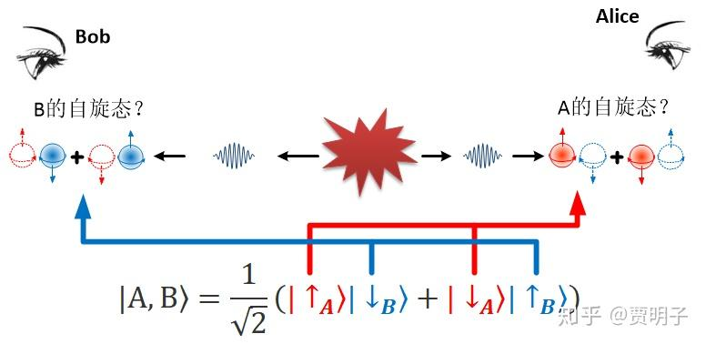

# 21、量子力学的“终极特性”

 ***“I would not call that one but rather the characteristic trait of quantum mechanics.”\***
***“我不想说这是量子力学的一个特性，而想说它是终极特性。”\***
***–- 薛定谔\***

好吧，你已经看到了，量子纠缠这种跨时空的关联实在是一种仅属于量子力学的、前所未见的现象。很多科学家都在这个问题上感到深深的迷惑。

爱因斯坦对量子纠缠感到了极大的不安，因为这意味着人们在某个地方的一举一动，都可以瞬间影响到整个宇宙。而相对论断言，任何物质、能量、因果关系、或信息的传递是不可能超过光速的。这就是为何他坚定地认为量子力学是**不完备**的。然而贝尔定理的确立，却结结实实地怼了他一脸：定域性的隐变量理论是不存在的。遗憾的是，贝尔不等式的提出以及后来的验证，都是在爱因斯坦死后发生的，我们无法想象如果他活着，对此会有何感想 – 谁知道他会不会找到一些蛛丝马迹的破绽，从而开辟人们更加深刻的视野呢？有人说：

> ***“我不知道爱因斯坦会对贝尔定理发表些什么看法，但是我知道，他一定会说一些非常聪明的言论。”\***

即使是现在它已经被实验结果实锤了，人们仍然感到不可思议。我国的潘建伟院士，量子纠缠这个领域的顶尖科学家，曾经这样说过：

> ***“只要我把为什么会有量子纠缠弄明白的话，我马上就可以死。但是现在又不能马上搞清楚，所以我又希望活得很久，我特别想看到对这个问题的解答。”\***

我相信，潘院士在说这句话的时候，是用了一点点夸张的修辞手法的。如果我们暂时抛开它背后的哲学意涵，而只从量子力学的理论体系中来看的话，其实它很简单，甚至不需要我们有什么高深的数学知识。问题的一切核心，实际上还是回到我们前面讨论的“叠加态是什么”这种问题。

我们不妨来回顾一下前面对量子纠缠的描述。当两个纠缠粒子相互分开的时候，它们都处在叠加态，**A和B都处在上旋和下旋的叠加。**当Alice在宇宙的一边观察A时，立刻导致了A的状态的坍缩，变成了确定的上旋（或下旋），而B在此时必然也会因此而坍缩，变成了确定的下旋（或上旋）。因而，Alice对A的观察瞬间就导致了宇宙另一边B的状态的改变。这就是非定域的瞬时影响，爱因斯坦所谓的“幽灵般的远距离作用”。

但是，这里我必须要向你坦白，前面的这种描述采取了一种简化的方法，它其实是**错误**的。

按照量子力学的逻辑框架，正确的描述应该是，当两个纠缠粒子相互分开的时候，**它们的复合系统处于A上旋B下旋和A下旋B上旋的叠加**，当Alice在宇宙的一边观察这个复合系统的时候，立刻导致了复合系统的状态坍缩，变成了确定的A上旋B下旋（或A下旋B上旋）。因而Alice在宇宙的一边对这个复合系统的观察瞬间导致了AB复合量子态在整个宇宙范围内的坍缩。

能看出这两种说法的不同之处吗？这里其实有一个巨大的拐弯，如果你对脑筋能够完成这个大拐弯，你会立刻生出“山穷水复疑无路，柳暗花明又一村”的豁然开朗之感，突然之间，前面的一切量仔怪异一下子变得合理了。

听我细细道来，希望本章结束之后，你能够完成这个关键的拐弯。

我们前面关于量子力学的讨论，到现在其实刚刚开始涉及到多个粒子的复合系统，而并不仅仅讨论单独的粒子的种种行为。我们知道，对单个粒子而言，它的任意量子态都可以表示为其它若干量子态的叠加。为了对观测过程描述的方便，我们一般会把它表示为一个可观测量的本征态的叠加。例如前面的例子里，一个粒子 – 我们把它叫做A - 的叠加态可以表示为它的上旋和下旋的叠加：

$|A\rangle=a|\uparrow\rangle+b|\downarrow\rangle$

对于A的任何不同自旋态，我们都可以通过适当的a和b的取值，来完成对它的“分解”。如果我们对这个表述完成归一化的话，那么我们的测量就会有a^2的概率得到上旋的结果，而有b^2的概率得到下旋的结果。用量子力学的形式语言来说，A的态矢量就位于一个两维的希尔伯特空间中，我们可以把这个空间记做：

$\mathcal{H}_A$

在这个希尔伯特空间中，上旋和下旋就可以组成一对笛卡尔坐标系统：它们两两垂直，且以它们作为“骨架”可以覆盖所有可能的A的量子态。那么，现在我们手里有一对粒子，A和B。那么对于这两个粒子组成的复合系统，它们应该有一个复合的量子态 – 我们暂且把这种复合的量子态看做A的量子态和B的量子态的某种综合，那么，我们应该用何种叠加来表示它呢？

我们知道，如果我们观察A，我们会得到两种可能的结果，上旋或下旋。同理我们观察B的时候，我们也会得到上旋或下旋的两种可能结果。那么，对于AB两个粒子，我们一共会得到几种可能结果呢？很显然，这两个粒子的可能状态组合一共就有四种可能：A上旋B上旋、A上旋B下旋、A下旋B上旋、A下旋B下旋，表示为：

$|\uparrow_A\rangle|\uparrow_B\rangle, |\uparrow_A\rangle|\downarrow_B\rangle, |\downarrow_A\rangle|\uparrow_B\rangle, |\downarrow_A\rangle|\downarrow_B\rangle$

那么，我们就知道，这个复合系统的任何可能状态，都能够用上述四种 状态的组合来叠加组成。

$|A,B\rangle=k|\uparrow_A\rangle|\uparrow_B\rangle+l|\uparrow_A\rangle|\downarrow_B\rangle+m|\downarrow_A\rangle|\uparrow_B\rangle+n|\downarrow_A\rangle|\downarrow_B\rangle$

正如我们所讲，一个单独粒子的所有状态都位于一个希尔伯特空间中，这个空间是由一组 “坐标轴”撑起来的。就像是前面所说的由上旋和下旋两个状态“坐标轴”所张成的空间就囊括了所有的可能自旋态。而两个粒子的自旋态所位于的希尔伯特空间就是两个单独粒子的希尔伯特空间“混合”而成的。而这种混合的基本规则就是这样的：两个粒子的所有可能状态的各种组合，就构成了复合空间的“坐标轴”。也就是说，组合而成的希尔伯特空间变成了一个四维空间，这个四维空间中混合了A和B各自的可能状态，这种混合就表现为上述的四种状态组合在AB复合系统的希尔伯特空间中组成一个四维的笛卡尔坐标系：它们两两垂直，且覆盖了全部的可能状态。这个“组合”可以简单表示为：

$\mathcal{H}_{AB}\left( |\uparrow_A\uparrow_B\rangle, |\uparrow_A\downarrow_B\rangle, |\downarrow_A\uparrow_B\rangle, |\downarrow_A\downarrow_B\rangle \right)\\=\mathcal{H}_A\left( |\uparrow_A\rangle,|\uparrow_A\rangle \right)\otimes\mathcal{H}_B\left( |\uparrow_B\rangle,|\uparrow_B\rangle \right)$

这个四维空间的构成看起来非常像是两个二维空间的乘积：

$\left( |\uparrow_A\rangle+|\downarrow_A\rangle \right)\otimes\left( |\uparrow_B\rangle+|\downarrow_B\rangle \right)\\=|\uparrow_A\rangle|\uparrow_B\rangle+|\uparrow_A\rangle|\downarrow_B\rangle+|\downarrow_A\rangle|\uparrow_B\rangle+|\downarrow_A\rangle|\downarrow_B\rangle$

这种发生在两个抽象空间的“乘积”叫做**张量积**[[1\]](https://zhuanlan.zhihu.com/p/53348823#ref_1)。

要知道，我们现在面临的，是一个由两个子系统构成的**复合系统**。非常合理地，对于一个不限于两个子系统的任意复合系统（也就是说，包括了多个子系统的系统），我们用于描述它的希尔伯特空间是各个子空间的张量积：

$\mathcal{H}=\mathcal{H}_1\otimes\mathcal{H}_2\otimes……\otimes\mathcal{H}_n$

很显然，复合系统希尔伯特空间的维度就是所有这些子系统的维度的乘积。如果我们有n个粒子，每个粒子的自由度为m，那么这个n粒子系统的量子态所在的希尔伯特空间的维度就是：

$dim\left( \mathcal{H} \right)=n^m$

你可以看到，随着系统的增大，它的维度会以指数的速度迅速扩张，趋向于无穷大。**这是希尔伯特空间臭名昭著的一个特性**。

对前面EPR佯谬中的的双粒子系统，用这个复合希尔伯特空间中的四个“坐标分量”表示，就是：

$|A,B\rangle=k|\uparrow_A\rangle|\uparrow_B\rangle+l|\uparrow_A\rangle|\downarrow_B\rangle+m|\downarrow_A\rangle|\uparrow_B\rangle+n|\downarrow_A\rangle|\downarrow_B\rangle$

其中，我们已经知道，双方的自旋必然是相反的，因而就排除了同时上旋和同时下旋的两种可能。因而在上述的表达中，就有k=0，n=0；于是：

$|A,B\rangle=l|\uparrow_A\rangle|\downarrow_B\rangle+m|\downarrow_A\rangle|\uparrow_B\rangle$

于是整个AB的态矢量就是由两个分量叠加而成。简单起见，我们假设两个分量的概率相等，在归一化后，就成了：

$|A,B\rangle=\frac{1}{\sqrt{2}}\left( |\uparrow_A\rangle|\downarrow_B\rangle+|\downarrow_A\rangle|\uparrow_B\rangle \right)$

我们可以看到，非常相似的公式在前面章节已经出现了，就是那两个纠缠的量子手套：

$|\psi\rangle=\frac{1}{\sqrt{2}}\left( |左手\rangle|右手\rangle+|右手\rangle|左手\rangle \right)$

前面AB的复合量子态所表达的含义就是：**AB的状态是由“A上旋B下旋”以及“A下旋B上旋”两个状态的叠加。**这里有一点必须非常小心地注意，前述的状态与**“A的上旋与下旋的叠加，以及B的上旋与下旋的叠加”**是完全不同的。按照后者的表述方式的话，将不会有任何量子纠缠发生。

我们现在知道，两个子系统的希尔伯特空间如何构成它们复合系统的希尔伯特空间：那绝不是简单相加。那么，**如果我们已知一个复合系统的量子态，我们如何从中获取每个子系统的量子态呢？**这个问题看似并不起眼，但是在量子力学中却实在是一个非常非常关键的问题，并且对这个问题的回答，引出了更加深刻的认识。

我们知道，两个互相独立的事件同时发生的概率，就等于两个独立事件概率的相乘。所以如果A和B互相之间没有关联，它们各自独立，那么AB系统的某个事件发生的概率就等于A和B两个独立系统的概率的乘积。例如，两盏灯，分别可能亮或灭，两盏灯亮的概率分别是P1和P2，那么，两盏灯同时亮起的概率就是P1P2。这是经典概率论的一个最基本的原理：乘法原理，也是非常符合我们直觉的。既然量子态映射了某种概率（不论这种起因如何，形式上至少是如此的），那么同样的道理，如果A和B相互独立，那么AB系统的量子态可以表示成A的部分与B的部分的乘积（张量积）形式：

$|A,B\rangle=|A\rangle\otimes|B\rangle =\left( a|\uparrow_A\rangle+b|\downarrow_A\rangle \right)\otimes\left( |c\uparrow_B\rangle+d|\downarrow_B\rangle \right)\\=ac|\uparrow_A\rangle|\uparrow_B\rangle+bd|\uparrow_A\rangle|\downarrow_B\rangle+ad|\downarrow_A\rangle|\uparrow_B\rangle+bc|\downarrow_A\rangle|\downarrow_B\rangle$

那么反过来说，**如果一个复合系统的量子态可以分解成两个子系统的某种量子态的张量积形式，那么构成这个张量积的两个因式就是这两个子系统分别的独立的状态**。也就是说，当一个复合系统的状态可以分解为两个子系统乘积（张量积）的形式，此时我们谈论每个粒子的状态是完全没有问题的。但是，对一个A和B并不互相独立的系统，它的一般状态：

$|A,B\rangle=k|\uparrow_A\rangle|\uparrow_B\rangle+l|\uparrow_A\rangle|\downarrow_B\rangle+m|\downarrow_A\rangle|\uparrow_B\rangle+n|\downarrow_A\rangle|\downarrow_B\rangle$

它可不可以表示为A和B的张量积呢？

$|A,B\rangle=k|\uparrow_A\rangle|\uparrow_B\rangle+l|\uparrow_A\rangle|\downarrow_B\rangle+m|\downarrow_A\rangle|\uparrow_B\rangle+n|\downarrow_A\rangle|\downarrow_B\rangle\\=\left( a|\uparrow_A\rangle+b|\downarrow_A\rangle \right)\otimes\left( |c\uparrow_B\rangle+d|\downarrow_B\rangle \right)??$

这在数学上是一个很简单的因式分解问题，每个小学高年级的学生都会做这个题目。但是你知道，并不是任何一个公式都可以完美地分解成两个因式相乘的形式的，事实上，绝大多数公式是不能分解的。比如说，A和B在处于我们前面所说的纠缠态：

$|A,B\rangle=\frac{1}{\sqrt{2}}\left( |\uparrow_A\rangle|\downarrow_B\rangle+|\downarrow_A\rangle|\uparrow_B\rangle \right)$

这个复合系统的状态就没有办法分解成A的状态和B的状态相乘的形式。那么，在这个系统中，A的“独立”状态是什么？我们发现，无论如何，我们都不可能把B的状态剔除去来谈论A的状态。反之，B的状态也是这样。也就是说，此时，AB这个系统中，已经不存在一个**独立**的A或B的状态了。我们只能考虑AB的**共有**状态。

这种情况就发生在量子纠缠当中。当两个粒子处于纠缠状态以后，我们就只能把这两个粒子看做是一个不可分割的整体，来谈论它们的共有状态，你这时候已经不能够谈论其中单独的某一个粒子的状态：不是你不知道，而是它单独的状态已经不复存在了。或者说，**单一的一个粒子已经不复存在，只有作为量子纠缠的一部分的粒子**。

自古以来，人们对自然界的研究就早已经习惯了把整个宇宙划分为“系统”和“环境”的区别，因为我们认为，一个系统划分成不同的子系统之后，我们只要把每个子系统的行为研究清楚，那么把它们组合起来，然后考虑好它们之间边界上的相互作用，最终我们会得到一个宇宙的整体。

例如说，你们的学校要考察各班的学习成绩，怎么办呢？我们的做法非常简单，把各自班级中的每个同学的成绩统计下来，然后这些成绩的综合就体现了班级成绩，我们可以比较平均分、中位数、最高分等等：毕竟，班级成绩是班级中每个同学的成绩的综合。这种“把系统划分成部分，然后研究每个部分，最后加和起来得到整个系统”的方法我们一直在各种场合应用，在科学中，甚至在数学中都是如此。例如我们前面提到过的欧几里得的基本公理中就有一条“整体等于部分的加和”。

但是，现在我们看到，在量子系统中，它不再成立了。首先，对某些系统而言，整体就是整体，我们无法把它划分成部分 – 理论上没有任何办法。其次，相应地整体就不可能是部分的加和。

这个结论从量子力学的数学形式上看是如此简单，简单到连小学生都可以理解，但是在物理上却如此令人不解。这里我可以试着解释一下。

我这里用一个非常不严格的类比来说明一下这个事情。我们知道，概率论中的乘法原理只对相互独立的事件适用。两个相互作用的粒子，它们不是相互独立的，因而它们的概率就不能用简单的乘法来描述。

比如说，假设某天早上，爸爸和你都要读书，并且互不影响。我们都可以在餐厅或书房读书。那么，我们同时在餐厅、同时在书房、一个在餐厅另一个在书房的概率就很简单，只要把我们两个人选择的概率相乘就可以了。例如：我们同时在书房的概率是：

$P\left( 同时在书房 \right)=P\left( 爸爸在书房 \right)P\left( 粲粲在书房 \right)$

$P\left( 爸爸在书房，粲粲在餐厅\right)=P\left( 爸爸在书房 \right)P\left( 粲粲在餐厅 \right)$

$P\left(爸爸在餐厅，粲粲在书房 \right)=P\left( 爸爸在餐厅 \right)P\left( 粲粲在书房 \right)$

$P\left( 同时在餐厅 \right)=P\left( 爸爸在餐厅 \right)P\left( 粲粲在餐厅 \right)$

这时，就对应着一个复合系统可以分解为两个子系统乘积（张量积）的情形。但是，如果我们之间会有互相影响，这种乘法原理就不再成立了。比如说我们都想在同一个屋子里一起读书。如果你选择书房，则爸爸必然会选择书房，如果爸爸选择餐厅，那么你必然也会选择餐厅，如此类推。那么，我来问你，我们同时做出决定在哪儿读书，最后你在书房的概率是多少？

这个问题就很微妙了：你选择在哪儿完全取决于爸爸选择哪儿，但是同时，爸爸选择在哪儿也完全取决于你选择哪儿！想象一下，一个早晨，你拿着一本书出来，心理想着，“爸爸要在哪儿读书呢？我要和他在一起”，而此时，正好看见爸爸也拿着一本书，爸爸心里同样在想，“粲粲要在哪儿读书呢？我要和她在一起”。于是乎，我们两人就只能愣愣地站在那儿大眼瞪小眼，等待着对方的行为，然后大家任何决定都做不了。也就是说，爸爸的选择和你的选择都已经不能够单独完成了：我们的选择都要以对方为前提。最后，我们只能在一起通过某种共同参与的方法，来让一起做出决定：比如说我们在一起抛个硬币什么的。但是无论是爸爸还是你都不能够单独决定了。这就是一种类似于纠缠态的经典概率问题。

当然，这个类比并非完全恰当，因为经典概率是一种非此即彼的问题，而叠加态则是“既此又彼”的状态，就会使得它们的纠缠更加无法分割。那么，我们展开想象力，想想我们两人是两个“量子人”。在我们做出决定以前，我们共同处于“去书房”和“去餐厅”的叠加态，那么此时我“自己的”状态是去书房与去餐厅的叠加吗？当然不是，因为这时候“我的”状态已经不仅限于我了，它决定并且决定于你的状态了：我们无法分割。

这种纠缠使得粒子丧失独立状态的特性，是薛定谔在爱因斯坦的EPR佯谬发表之后提出的，并且是历史上首次是使用“纠缠”这个词语：

> ***“When two systems, of which we know the states by their respective representatives, enter into temporary physical interaction due to known forces between them, and when after a time of mutual influence the systems separate again, then they can no longer be described in the same way as before, viz. by endowing each of them with a representative of its own. I would not call that one but rather the characteristic trait of quantum mechanics, the one that enforces its entire departure from classical lines of thought. By the interaction the two representatives [the quantum states] have become entangled…the best possible knowledge of a whole does not necessarily include the best possible knowledge of all its parts.”\***
> ***“当两个系统 – 我们可以知道它们各自自身的状态 – 发生了某种已知的相互作用，它们相互影响，过一段时间后，它们又各自分开，那么它们不再能够像以前那样，对它们各自赋予它们自身的性质了。我不想说这是量子力学的一个特性，而想说这是它的终极特性，这个特性使得它和经典思维彻底决裂。由于相互作用，两个系统的性质变得纠缠在一起。……关于整体我们可能获得的全部信息，不一定就是包含了它所有组成部分的全部信息。”\***

如果说EPR佯谬首次发现了量子力学中**超远距离的同步关联**，那么薛定谔提出的“量子纠缠”则更进一步，指出了超远距离的两个系统的“**不可分割**”：整体不等于它所有部分的综合。这一点就更加令人困惑：在Alice处的粒子A，和在Bob处的粒子B，你不能把它们看做是**两个**粒子的组合，而只能看做是**一对**粒子的整体。这里绝不是在玩儿什么文字游戏，而是确确实实地，这两个粒子作为一个整体，是没法分开来描述的。如果我们非要硬把这两个粒子分开，当做两部分来看，那么我们必须要吞下苦果：这两个粒子分别的状态，综合在一起必然不能反映他们整体的状态。也就是说，在经典物理学中，我们惯于把宇宙分成若干系统单独研究，而把系统间的相互作用表示为系统的边界条件。**但是量子纠缠告诉我们，以这种方式划分得到的所有系统，组合起来必然不是整体的宇宙本身。**

这里矛盾就出来了，我们现实世界中，任何观察都是**局域**的。我们一般没有能力同时观察到A和B这对粒子。当Alice在观察A的时候，她“以为”她观察的是单独的A的状态，但实际上，由于量子纠缠的存在，她观察的是AB复合系统的一部分：A粒子与B纠缠的那部分信息由于是空间广域的，她并没有看到。她丢失了很多信息而不自知。同理，当Bob在观察B的时候，AB纠缠的那部分信息他同样观察不到。因此，当我们把Alice和Bob的观察结果放在一起的时候，我们并没有得到AB复合系统的整体状态：它们的纠缠信息已经丢失了。

那么我们回来继续谈论EPR佯谬。我们在前面提到，相互纠缠的两个粒子，它们之间的相互影响是“瞬间发生”的。但是，这种说法是在用经典的经验描述量子行为，它其实是不准确的。严格说，两个粒子之间并没有所谓的“互相影响”。因为双方发生的变化是“瞬时”的，而“瞬时”则意味着一个绝对的“同时”。我们所说的一个粒子A的变化影响另一个粒子B，必然意味着两者不可能是“同时”的，必然是A先发生，然后作为因果关系的结果，B才跟着发生。而对绝对的“同时”，你根本就不能说是哪一个的发生**影响了**另外那个的发生。

例如，前面我们提到的，相隔千里的一对自旋态互相纠缠的粒子，分别在Alice和Bob处。如果此时Alice对A进行观察，得到一个上旋的结果，那么我们立刻知道B为下旋。那么，我们直觉上认为，Alice观察导致了A坍缩为上旋态，而A的坍缩导致B立刻坍缩到下旋态，但是这种说法是站不住脚的。“同时发生”就意味着两个事件不可能有因果关系：因为因必须先于果。不可能是A的坍缩导致了B的坍缩。在相对论看来，不同的人会对它们“先后”顺序有着不同的看法。因而我们根本就无法定义到底是谁对谁产生了影响。我们只能认为，Alice的观察同时坍缩了A和B。更进一步，我们认为A和B作为一个系统，它们共享一个“分散”在空间的状态。

所以，量子纠缠在更严格的意义上说，是指两个粒子的**共有状态**在空间中的扩展（delocalize），一直扩展到相隔千里。当你观察粒子A的时候，你观察的不是粒子A，而是在广袤空间中相互纠缠的AB的一部分：你**觉得**你通过观察A获得了A的全部信息，但是实际上，所谓“A的信息”这里已经失去意义了，只有AB这个纠缠系统才是有意义的，而AB的信息扩展在整个空间，**观察者在一个局部，就只能获得它的一部分信息。**当你强行把系统划分为AB两部分的时候，你自认为你所观察的A，其实只有一部分A，但是同时又纠缠了B！于是乎，我们对前面EPR的描述就应该是像下图一样：

那么，现在我们就看到了一个量子纠缠态的另外一个特征，可能是比超远距离瞬时关联更加不同凡响的特征，就是它的**不可分割性**。也就是说，两个粒子组成的系统当中，我们没有任何办法来严格谈论其中的某一个粒子，我们只能谈及它们两个的组合 – 两个粒子“融为一体”了。

说了这么多，其实中心的问题就是：**一个纠缠的复合系统中，单个子系统无法具备独立的状态，它们只能和整个复合系统有一个共有状态。只有相互独立的子系统才可以具有独立状态。**

好了，现在我们重新来看看冯诺依曼对测量的分析，我们仍然考虑测量一个粒子的自旋状态。要完成这样一个测量，我们需要一个具有自旋的粒子和一台仪器。同样地，这个仪器用一个指针来显示测量的结果，如果粒子是上旋，那么它的指针偏向左侧，如果是下旋，那么它的指针偏向右侧。此外还有一个观察者，我们。我们通过指针的左偏或右偏就可以知道粒子是上旋还是下旋。那么，粒子、仪器、和我们都可以用量子态来描述。分别为P、A、和O （**P**article、**A**pparatus、**O**bserver）。最一般的量子态就可以表述如下：

$|P\rangle=a|\uparrow\rangle+b|\downarrow\rangle\\ |A\rangle=m|左\rangle+n|右\rangle\\ |O\rangle=k|高兴\rangle+l|右\rangle$

那么，对于粒子和仪器组成的系统，它的量子态就包括了粒子的状态和仪器的状态。这个组合的状态表示为**张量积**：

$|PA\rangle=|P\rangle\otimes|A\rangle$

这个张量积如何理解呢？我们可以这么来考虑。一个粒子是由两种可能的状态组成的，上旋和下旋，它是一个两维的系统。而一个仪器也是两种可能的状态组成，指针左偏和右偏。也是一个两维的系统。那么这个组合系统一共就有四种可能：

粒子上旋，指针左偏

粒子下旋，指针左偏

粒子上旋，指针右偏

粒子下旋，指针右偏

那么组合系统就是由四种可能组成的，它是一个四维系统。所以：

$|PA\rangle=|P\rangle\otimes|A\rangle=am|\uparrow\rangle|左\rangle+an|\uparrow\rangle|右\rangle+bm|\downarrow\rangle|左\rangle+bn|\downarrow\rangle|右\rangle$

那么对于一个一般情况，一开始粒子处于上旋和下旋的叠加态。在一开始，粒子尚未被仪器检测的时候，它们之间没有发生任何相互作用，因而是相互独立的，那么这个时候，（粒子+仪器）这个复合系统的整体量子态就是两个量子态的乘积（张量积）：

$|PA\rangle=\left( a|\uparrow\rangle+b|\uparrow\rangle \right)\otimes|就绪\rangle\\ =a|\uparrow\rangle|就绪\rangle+b|\downarrow\rangle|就绪\rangle$

我们知道，如果一开始粒子处于上旋状态、仪器处于就绪状态，这时我们让粒子通过仪器，粒子与仪器的相互作用会使得仪器指针会左偏：

$|\uparrow\rangle|就绪\rangle\rightarrow|\uparrow\rangle|左\rangle$

同理，如果粒子一开始是下旋状态，演化过程就是

$|\downarrow\rangle|就绪\rangle\rightarrow|\downarrow\rangle|右\rangle$

那么很显然，上述的测量就必然会导致整个量子态发生这样的变化：

$|PA\rangle=a|\uparrow\rangle|就绪\rangle+b|\downarrow\rangle|就绪\rangle\rightarrow a|\uparrow\rangle|左\rangle+b|\downarrow\rangle|右\rangle$

也就是说此时（粒子+仪器）这个系统共同处于一个（粒子上旋，指针左偏）和（粒子下旋，指针右偏）的叠加态。

你是不是注意到，这个叠加态和前面我们讲的两个粒子的纠缠很像？如果一个粒子上旋，另一个粒子必然下旋，反之亦然。这里是：一个粒子上旋，指针必然左偏，反之亦然。事实上，这就是一个**纠缠态**。我们可以看到，这个系统已经无法被分成仪器+粒子两个子系统了。我们可以看到，**一个测量过程必然会导致纠缠的形成**：系统与仪器之间的纠缠。

当仪表和粒子完成了相互作用以后（仪表完成了对粒子的测量），作为观察者的我们开始观察这个仪表。在观察之前，我们处于一种完全无知的状态：

$|PA\rangle=\left( a|\uparrow\rangle|左\rangle+b|\downarrow\rangle|右\rangle \right)\otimes|无知\rangle\rightarrow a|\uparrow\rangle|左\rangle|高兴\rangle+b|\downarrow\rangle|右\rangle|沮丧\rangle$

也就是说，此时，粒子、仪表、我们所组成的组合系统，共同处于（粒子上旋、指针左偏、我们高兴）和（粒子下旋、指针右偏、我们沮丧）的叠加态。那么，这就是一个粒子、仪器、我们这三个子系统之间的纠缠了。

也就是说，随着冯诺依曼的测量因果链一步步地向前延伸，这种纠缠就会一步步地加深，把整个链条所涉及到的一切子系统卷进来，这个纠缠的范围就会不断地扩大。

然后，我们发现，正是这种纠缠，导致了我们在观测的时候，干涉现象神奇地消失掉。我们可以不需要坍缩假设，就能够解释干涉消失的现象。而这个，正是**退相干**过程和**多世界**诠释的最精髓部分。

下一章：[贾明子：22、干涉是如何消失的？](https://zhuanlan.zhihu.com/p/53612788)

上一章：[贾明子：20、量子纠缠、定域现实、自由意志](https://zhuanlan.zhihu.com/p/53259306)

专栏传送门：[何为现实？拉普拉斯之妖与薛定谔猫之决战](https://zhuanlan.zhihu.com/c_186387023)

------

## 参考

1. [^](https://zhuanlan.zhihu.com/p/53348823#ref_1_0)线性空间以及在其中的矢量的乘积有很多种，例如点积或数量积、叉积或向量积、还有张量积。张量积是看上去最简单的一种。

编辑于 2022-12-26 15:22・IP 属地未知