# 22、干涉是如何消失的？

> ***“The interference terms still exist, but they are not there!”\***
> ***“干涉仍然存在，只不过它不在那儿了。”\***
> ***–- Zurek\***

我们来玩一个思想游戏。假如说，孪生双胞胎之间存在某种神秘的“心灵感应”，使得他们（或她们）之间能够在某些特定的事情上穿越时空做出某些相一致的行为，就像是处于纠缠状态的两个粒子一样。那么，我们现在来做这样一种游戏，我们找来100对双胞胎，然后把所有的哥哥（姐姐）集中在一组（1组），而把弟弟（妹妹）集中在另一组（2组）。我们让1组进入一个一班教室，让2组进入二班教室。两个教室相隔甚远，比如说在两栋不同的教学楼里面。并且这两个教士都完全隔离，互相之间没有任何通讯。然后，我们让两组孩子们开始在一面画布上作画，每个人都可以在画布上画上一笔，并且只画一笔。我们给1组的孩子们红色和绿色两种颜料，而给2组只有黑色的颜料。当他们各自完成之后，我们来看他们各自的画作。我们看到大家都是随机地自画布上涂抹，然后各自形成了不同的乱七八糟的图样，例如就像下图那样：

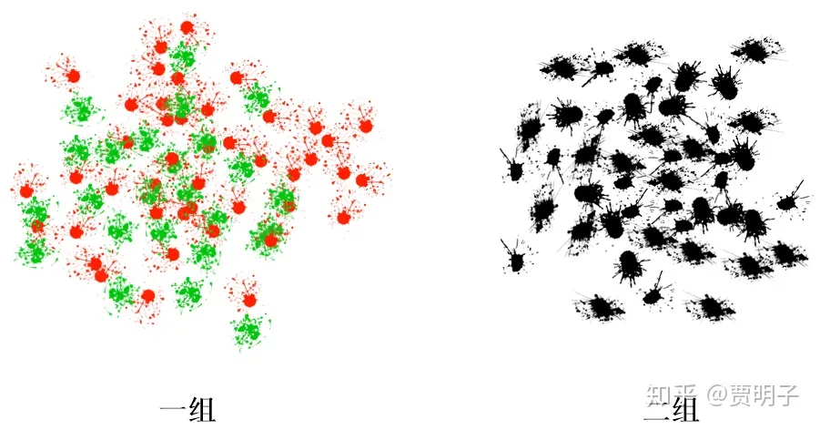

在整个作画的过程，赵老师在一班，观察一组的行为，而同时，钱老师在二班做同样的观察。然后，这两个老师就分别得到结论：这个作画过程中杂乱无章，毫无规律。两个老师凑在一起，综合各种得出的结论，最终仍然认为：大家是各自乱七八糟地自行其是，既没有团队精神，也没有绘画天赋。

然而，赵老师和钱老师所不知道的是，这时候，一直在监控室同时监控着两个小组的孙老师站出来说，错！我在监控室里面，可以同时看到两个班级。我密切地关注每个孩子每一次的选择，同时对比他们选择的结果，我发现：在一班，凡是选择绿色的同学，那么他们在二班的兄弟（姐妹）总是会把自己的那一笔画在画布靠中央的位置，而凡是选红色的同学，相应地他们在二班的兄弟姐妹就会画得比较靠四周，我不知道他们是怎么做到的，应该是通过他们双胞胎之间的神秘联系吧。然后，我们就可以把两个画面放在一起，来统计一下它们隐藏在两张画之间的规律。我们把一组的红色和绿色分开，同时，把它们对应的二组的黑点也分开，然后我们再来看这两幅画：

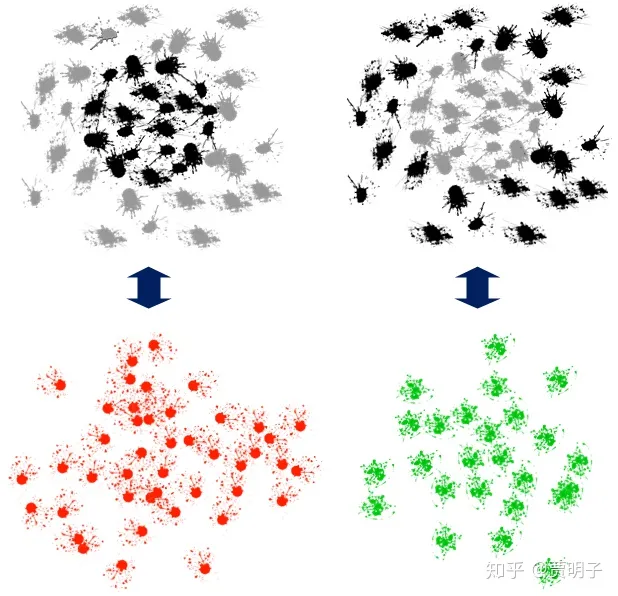

这时候，我们惊奇地发现，其实两组孩子利用它们的神秘感应，画了一个圆！这个圆，并不在任何一幅画中可以体现出来，即使是我们把两幅画拿到一起对比来看，看到的仍然是两幅乱七八糟的随机涂鸦，而不会有任何规律。只有当我们同时监控两组孩子的作画过程，然后加以对照甄别，我们才能够把孩子们隐藏起来的规律给揭示出来！

当然，如果说，双胞胎们之间并不存在这种神秘的跨时空关联，而是说，他们之间使用某种经典的通讯方式 – 例如通过手机 - 来实现这种协同操作，赵老师和孙老师是可以通过对两个组的分别监控而还原出他们的画作的。很简单，两位老师只要严密监控两个小组所在的两个教室以及进出教室的所有信息就可以了：当他们把各自的监控结果放在一起对比时，他们立刻就可以通过双胞胎之间的通讯信息，还原出他们之间的协同操作。但是，现在的情形是，孩子们之间的这种跨时空的、不需要信息传递的神秘感应是无法监控的 – 这个同量子纠缠的跨时空关联如出一辙，因而我们没有任何办法通过两个老师的监控而发现孩子们的画作，**唯一的方法就是同时监控两个教室**！

这个简单的思想游戏，可以来类比说明我们对纠缠系统的观察先天的不完整性。对纠缠的量子系统而言，单方面的观察是有先天缺陷的，即使是我们把两边的观察结果重新凑到一起，最终也得不到整体的信息，因为我们丢失掉了双胞胎之间的一一关联信息，这个但从两个图片上是看不出来的，只有通过同时观察他们的作画过程才能够得到。也就是说，互相纠缠的“共有信息”不可避免地丢失掉了。而这种共有信息的丢失，就使得深藏在其中的有规律的图形变成了一种随机分布：图形仍然**在那儿**，只不过你**看不到**了。

这也就解释了，为何量子纠缠有着远距离的关联，却没有办法用它来实现超光速通讯的原因：这些关联隐藏在纠缠系统整体当中，单独对其一部分的观察完全无法获得这种信息。而我们试图通讯，必然是两个分开的部分之间的信息传递，没有办法同时对系统整体进行观察，因而也就无法完成信息的传递。

好了，我们回过头来回想一下，上一章曾经提到过一个很重要的结论，观察必然导致纠缠。

[贾明子：21、量子力学的“终极特性”165 赞同 · 42 评论文章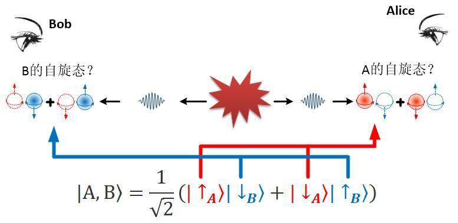](https://zhuanlan.zhihu.com/p/53348823)

那么你有没有感到大脑中的灵光乍现？

- 在上述思想游戏中，双胞胎间的跨时空感应导致了共有信息不可见，因而导致本来隐藏在整体的图案变得不可见。
- 在干涉实验中，观察导致纠缠，而观察使干涉条纹消失。

这两者之间，有没有必然联系？我们把它们放到一起来看，会不会能够破解波函数坍缩的神秘？

那么，我们再回来看看双缝干涉实验，在这个实验当中，包括了一切量子力学中关于观测过程的奇怪现象。你已经知道，双缝干涉是一个什么样的实验，如下图所示：

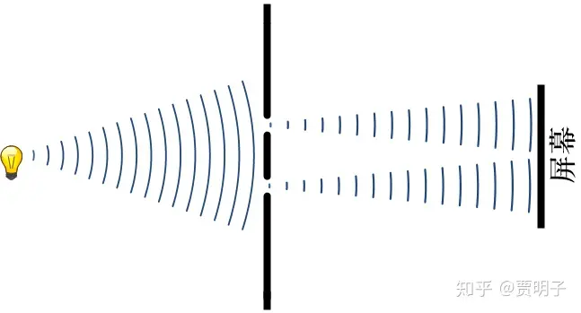

一个光源照射到一个双缝装置上，当缝的宽度足够小的时候，透过双缝的两道光会在背后的屏幕上产生明暗相间的条纹。这就是光的双缝干涉现象。关于干涉，我们前面已经比较详细地提到过，这里不再细细重复。但是有一个与经典现象非常不同的是，光的“哪一条缝”信息（Which-Way Information，简称WWI）和干涉条纹之间存在一种“互不相容”的现象。当我们试图观察光子是从哪一条缝中通过的时候，干涉条纹就消失了。例如说，我们在其中的一条缝背后放上一个光子探测器，用来探测光子是否从该条缝中通过的时候，不论光子是否经过这条缝，背后的干涉条纹都会神奇地消失掉！而当我们不去试图搞清楚光子从哪条缝中通过的时候，干涉条纹又会神奇地出现了！这就是着玻尔所称之为“互补原理”的、光的“粒子性”和“波动性”之间的不相容性。

我们如何来观察光子经过了哪一个缝隙呢？我们可以这样来做，我们在每一条缝的背后都放置一个能够产生一对纠缠光子的装置 – 姑且叫做“纠缠光子对发生器”。实际上，它可以通过一种叫做SPDC的晶体来实现。当光子撞击到它时，会被它吸收掉，同时又产生两个互相纠缠的光子，每个光子的能量都是被毁掉的光子的一半 这样，一个入射光子，就变成了一对“双胞胎”光子了，而这对光子之间就保持了“双胞胎”之间的心灵感应，也就是纠缠。现在，我们把这一对光子的其中一个（图中用蓝色表示）让它仍然射向原来的屏幕（屏幕1），然后我们布置另外一个屏幕（屏幕2），让另一个光子（图中用橙色表示）射向这个屏幕。这样一来，我们有两个屏幕，每个屏幕都从双缝的光源中接受到照射[[1\]](https://zhuanlan.zhihu.com/p/53612788#ref_1)。

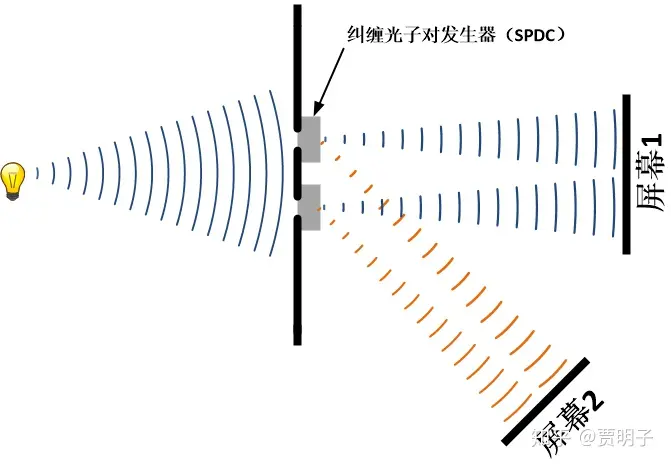

现在，我们可以把两个缝中的橙色光子分别引入不同的探测器，来观察它的来源。比如说，如果我们发现一个橙色光子来源于上缝，那我们必然知道，相对应的那个“双胞胎”的蓝色光子也是来源于上缝。用这种方式，我们就可以知道射向屏幕1的每个光子都来自哪一条缝隙。这样一来，我们知道了“WWI”，必然会毁掉屏幕1上的干涉条纹。但是，现在我们并没有这么做，我们把橙色光子打到屏幕2上，因而我们根本无法判断一个过来的一个光子到底是来自上缝还是下缝。因而，理论上，我们并没有获得任何的关于路径的信息，那么此时，两个屏幕上是否会有干涉条纹出现呢？

答案很明确，在实验中，无论你如何调整实验的设置，想尽一切办法不去“观察”光子的路径信息，在两个屏幕上，你仍然看不到任何的干涉条纹！它们永远都是两个“正常”的光斑。

按照我们前面的“标准”解释，观察使得粒子坍缩 – 由“左缝”和“右缝”的叠加态坍缩至左缝或右缝的单路径状态，因而就失去了干涉源，也就不再有干涉条纹了。但是，现在我们没有做任何观察啊！橙色的光子自诞生起，一直到打在屏幕2上面，中间没有受到任何“观察” – 不论是有意识的人类还是无意识的机器的观察 - 的干扰。这个过程中，没有任何观察能够坍缩掉光子，那么干涉条纹应该仍然存在才对啊。没有这样就显得颇为诡异了。当然，在量子力学中，比这个诡异的事情多得是，你应该已经习惯了不去大惊小怪了。但是，你可能还会问，为何我们看不到干涉条纹？整个过程中，我们没有任何办法知道光子的路径信息啊？为何干涉就消失了呢？

答案是：**干涉仍然存在，只不过你无法看到而已**。就像是前面那个双胞胎实验中，图案是存在的，只不过你看不到了。

下面我来具体分析一下，**干涉到底藏在哪儿？**

我们应该知道，当我们分别看屏幕1和屏幕2的时候，我们就像是前面双胞胎实验中的赵老师和钱老师一样 – 它们只观察了双胞胎中的一组孩子。赵老师和钱老师相信，他们分别观察一组孩子，然后再把两人的观察结果组合起来，就会得到这两组孩子的全部信息。然而孙老师却指出了他们的错误：分别观察然后在组合起来，这个过程中损失掉了一部分重要的**“共有信息（mutual information）”，**而孩子们画出来的图案，恰恰就隐藏在这部分共有信息之中。因而，对这一对对的纠缠光子的行为，我们分别看两个屏幕，然后把两个屏幕的结果组合起来的行为，正是犯了赵老师和钱老师同样的错误。那么，我们不禁就会问自己，如果我们采用孙老师的做法，会不会在两个屏幕之间，找到那个丢失掉的干涉条纹呢？也就是说，我们必须要**同时观察两个屏幕**！

那么，我们现在来学习一下孙老师的行为，我们关注每一对“双胞胎”光子，以及它们之间的关联。

现在我们为了记录光子打到屏幕上的位置，对每一块屏幕，都在上面添加刻度。我们分别以屏幕的中心为0，向右为正方向，向左为负方向。我们把第一块屏幕的位置记做x，第二块屏幕的位置记做y。每个屏幕我们都把最左侧标记为-1，而最右侧标记为+1，这样一来，我们就会得到两个一维的从-1到+1的标尺。现在，我们关注屏幕1，首先，我们只关注那些到达它正中附近的那些光子，也就是x=0的位置。对这一部分光子，我们观察它们的“双胞胎”光子的行为，然后记录下来。这时候，我们就会发现，它们的双胞胎兄弟们表现出一种有规律的行为：它们会形成类似干涉的条纹：

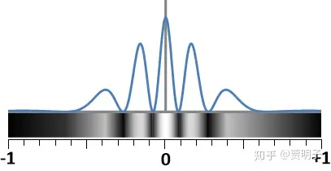

然后，我们再关注屏幕1上面偏离中心一点的位置，例如说，在标尺x=+0.2的位置附近。然后我们只关注那些到达此处的光子，以及它们的“双胞胎兄弟们”在屏幕2处的行为。同样地，我们发现，这些兄弟们在屏幕2也会形成类似干涉的条纹，只不过，这一次这种条纹的位置不一样了，它们“错开”了一点：

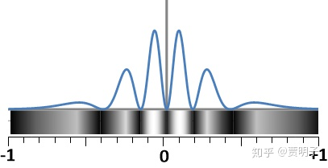

同理，我们重复做这样的观察，在屏幕1的任何一处，记录所有到达该处的光子，以及这些光子的“双胞胎兄弟们”在屏幕2处的行为。无一例外，我们会观察到双胞胎兄弟们在屏幕2形成条纹，但是，随着在屏幕1的位置不同，它的兄弟们在屏幕2的条纹位置不断地错开。

最后，当我们考虑所有到达屏幕2的光子时，我们会发现所有这些条纹重叠在一起，所有的条纹互相覆盖，最后形成了一个普通的光斑:

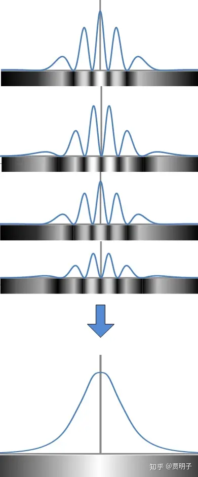

反过来，我们同样可以指定屏幕2特定位置的光子，来观察它们双胞胎兄弟在屏幕1处的行为，毫无悬念地，我们得到了同样的行为模式。

也就是说，通过比较每一对光子在两个屏幕上的行为的关联性，我们发现了隐藏在两个屏幕之间的干涉效应。它们的的确确存在，只不过当我们对其进行分部分观察的时候，它就消失不见了。

我们有一个非常方便的办法来把这种隐藏的干涉条纹视觉化。这里我们换一种方法来对这些光子进行计数。对于一对光子，它们其中之一必定打在屏幕1上面的位置x，而另一个必定打在屏幕2上面的位置y，因而从-1到+1之间的所有的（x,y）组合，就涵盖了任意一对光子的最终归宿。也就是说我们现在面临的，是一个由两个子系统构成的**复合系统**。我们已经提到过，对于一个复合系统（也就是说，包括了多个子系统的系统），我们用于描述它的希尔伯特空间是各个子空间的张量积：

$\mathcal{H}=\mathcal{H}_1\otimes\mathcal{H}_2$

然后，每一对光子，我们都可以用这样的（x,y）对它们进行标记。然后，对于任意一个屏幕1上的位置x附近，屏幕2上的位置y附近，我们就可以记录到达这两个位置的光子对的数目。这个数目，除以总的光子对的数目，就是 “一对光子中其中一个打在屏幕1的x位置附近，另一个打在屏幕2的y位置附近”这个事件发生的概率：

$P\left( x,y \right)$

比如说，P（0,0）的意思是指，一对纠缠光子对，同时击中两个屏幕正中心的概率。而P（0,1）的意思是，“一个粒子击中第一块屏幕中心，而同时另一个粒子击中第二块屏幕位置坐标为1”这样的概率。也就是说，一个事件发生的概率是x和y的二元函数。我们可以把x和y当做两根坐标轴，这两个坐标轴就可以确立一个平面空间，这个平面空间就是我们前面提到的经典意义上的“**相空间**”。相空间中的任意一点，都对应着（x,y）坐标对，也就是代表了“光子对中的一个击中第一个屏幕x位置，同时另一个击中第二个屏幕y位置”这样的事件。这个平面空间的所有点，就囊括了所有可能的事件。

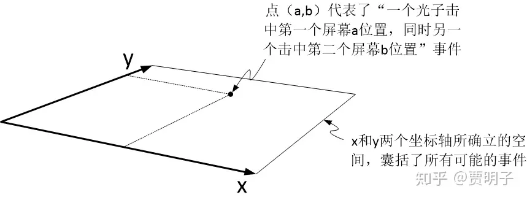

那么，对应着每一个事件，都有一个发生的概率。我们在第三维度上把这个概率值[[2\]](https://zhuanlan.zhihu.com/p/53612788#ref_2)表示出来。这个概率可以根据量子力学原理计算出来。我们把计算结果[[3\]](https://zhuanlan.zhihu.com/p/53612788#ref_3)画出来，它看起来是这样的（图中的不同颜色是为了标注等高线）：

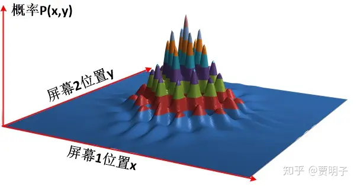

我们可以看到，这张图好像是一丛漂亮的山峰。那么，我们如何来看这些山峰呢？首先，我们知道，“地面”的每一个位置都代表了一个事件，那么，这个位置上所坐落的“山峰”，就是这个事件所发生的概率。而所有这些“山峰”的高度就代表了所有可能发生的事件的概率大小。例如，最高的一座山峰位于正中心，也就是x=0，y=0的位置。意思是说，光子有最高的几率同时击中两个屏幕的中心位置。而相应地，每个“山谷”就代表了一个低概率的事件。而在x和y都偏离中心的位置，就是一片平地，高度约等于零。也就是说，光子同时击中两个屏幕偏离中心的概率几乎为零。

我们从正上方来俯视这个由x和y构成的相空间，它看起来就是这样的：

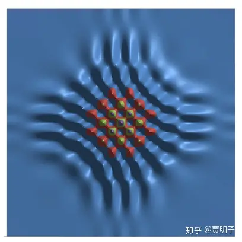

非常漂亮的干涉花纹！干涉确实是存在的，它存在于相空间中，奥耶！

你知道，相空间是一个抽象空间，而不是我们实际看到的空间。一个“存在于相空间”的干涉条纹，在实际空间中 – 即在Bob和Alice的两块屏幕上，我们是看不见的，即使我们分别观察了这两块屏幕，在把它们组合起来，也不可能发现隐藏于其间的干涉条纹。

比如说，现在Alice只想关系那些击中她的屏幕正中心的那些光子。对这些光子而言，相对应的另外一个光子会击中Bob屏幕上的哪一个位置呢？很简单，根据上面的计算结果，我们只要令y=0，那么P(x,0)表示的就是另一个光子在Bob屏幕上x位置出现的概率。如果Alice关心的不是她屏幕中心，而是任意另外一个位置y1、y2、……，那么集中该处的光子相对应的另一个光子出现在Bob屏幕上x位置的概率就是P(x,y1)、P(x,y2)、……。同理，我们也可以把Bob和Alice的视角反过来，如下图所示：

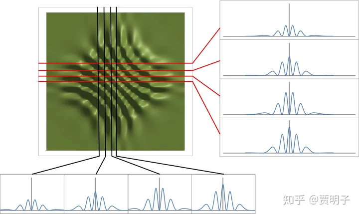

我们可以更加形象地来理解这个事情：我们知道，在（x,y）所组成的相空间中，存在着干涉条纹。更加严格说，(x,y)组成的是一种所谓的组态空间（configuration space），这个两维的坐标，一个来自屏幕1，另一个来自屏幕2。

我们可以回忆前面关于子系统的张量积构成复合系统的故事：在构成复合系统的时候，复合系统的每一个可能事件都是子系统可能事件之间的组合：复合系统每一个自由度都是其包括的每个子系统自由度的组合，形象地说，所有子系统的可能事件都“编织在一起”了。而在实际空间中，屏幕1和2是分开的两部分，所以我们实际观察的时候，是只能看到独立的屏幕1和独立的屏幕2的，而不会看到“编制在一起”的两块屏幕。也就是说，当我们在观察一块屏幕的时候，那么所有的概率分布就必须全部“投影到”我们所观察的那块屏幕上，叠加在一起，使得干涉条纹完全消失不见了。

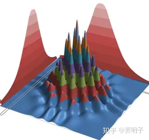

量子力学中的信息，两个光子总是**纠缠在一起，无法分割的**，而我们的观察，却总是把两个光子当初各自独立的粒子来看待。只有当Alice和Bob真正地坐在一起，两个人把打在各自屏幕上的光子一一对比：“当这个光子出现在这儿的时候，另一个光子出现在哪儿？”，他们才有可能一起把干涉条纹还原出来。而像我们常规的想法：“我只关心我屏幕上的光子”，那只能丢失掉所有的干涉信息 – 因为你把另一个纠缠的信息抛弃掉了！

这一切，都起源于那个看似神秘的量子纠缠。在原始的双缝干涉实验中，干涉条纹来源于光子的左缝和右缝路径之间的干涉。但是现在，为了观察路径信息，我们在每条缝隙增加了纠缠对发生器，那么现在我们就有了一对纠缠光子。在此时，我们所面对的，就不再是单纯的左缝和右缝两条路径了，现在，我们有“蓝色光子左缝路径”（路径1） 、“蓝色光子右缝路径”（路径2）、 “橙色光子左缝路径”（路径3）、 “橙色光子右缝路径”（路径4）四条路径了。由于量子纠缠的原因，橙色光子与蓝色光子之间是共享同一个整体状态的，因而此时的干涉就是这四条路径之间的干涉，而不是蓝色光子的两条路径的干涉，以及橙色光子的两条路径的干涉，这两个互相独立的干涉了。因而此时屏幕1和屏幕2也就成了一个整体而不可分割了，单独对每个屏幕的描述都忽略了大量的信息，而只有同时描述两个屏幕我们才能找到干涉条纹：**整体不等于部分的加和**。

那么，此时我们可以试着来探讨一下在这里到底何为“观察”了。我们说，通过产生了橙色和蓝色的光子对，我们通过对橙色光子的观察，就可以完全确定蓝色光子的路径：如果橙色光子来源于左缝，我们就必然知道蓝色光子也来源于左缝，如果橙色光子来源于右缝，那么我们也必然知道蓝色光子也来源于右缝。而这种通过观察一个系统就可以完全确定另一个系统的情形，恰恰就是量子纠缠的最初定义：它们之间完全关联：

$|\psi\rangle_{整体}=\frac{1}{\sqrt{2}}\left( |左\rangle_蓝|左\rangle_橙+|右\rangle_蓝|右\rangle_橙 \right)$

我们说，一个具有这种完全关联的系统是纠缠的，那么，纠缠有没有“大小”？也就是说我们有没有某种度量，来衡量纠缠的“深度”有多少呢？

是的，纠缠是由“深度”的。如果我们可以通过对一个子系统的观察，获知另一个子系统的全部信息，那么它们就是“最大纠缠”的。两个最大纠缠的系统，又被称为“**贝尔态**”。如果通过观察一个子系统，我们无法对另一个子系统获得任何信息，那么两个子系统就是“完全无关”的，它们相互独立，于是它们就没有纠缠。

比如说，我们来看薛定谔猫的系统。如果我们把猫和粒子隔离开来，粒子的衰变与否都不会对猫产生任何影响，那么我们说猫和粒子各自独立。我们观察粒子不会告诉我们任何关于猫的信息，反之观察猫也不会告诉我们任何关于粒子的信息。那么此时猫和粒子就完全没有纠缠。

但是，当猫和粒子在一起相互作用的时候，我们就可以通过粒子知道猫的信息：如果我们观察到粒子已经衰变了，那么，猫必然是死的。反之，如果我们观察到猫是死的，我们必然知道粒子已经衰变了。也就是说，我们可以通过观察一个子系统，就可以完全确定地知道另一个子系统的状态，这就是一种“完全关联”的状态。那么，这两个子系统是处于“最大”的纠缠程度：此时猫-粒子就是一个“贝尔态”。

如果我们把我们的实验改一下，粒子的衰变不会释放杀猫毒气，而是会释放出一种病毒，我们姑且把它叫做“猫流感病毒”。这种病毒对猫来说**几乎**是致命的，它可以杀死猫，但是猫也有一些可能战胜病毒并且存活下来。比如说，这种病毒有80%的概率会把猫杀死。那么，这时候就是一种“部分关联”的情况：如果粒子没有衰变，那么猫一定还活着，但是如果粒子发生了衰变，那么，猫有80%的概率已经死了。和前面不同的是，已知粒子的状态并不能使我们完全确知猫的状态，但是我们可以“大致”知道猫的死活。此时，粒子和猫仍然存在着一定程度的纠缠，但不再是最大程度的纠缠了，它们此时处在一种相对比较“不严重”的纠缠中。

在这里，“死”和“活”、 “衰变”和“没衰变”这些状态两两之间是互不相容的，它们之间没有重叠。用量子力学的术语来说，就是死和活、衰变和没衰变，这两个状态是“正交”的。我们可以形象地在希尔伯特空间中想象，死和活两个态矢量互相垂直，因而一个矢量到另一个矢量的投影为零。也就是说两个矢量没有任何重叠的部分。所以说，当两个子系统各自**一对互相正交的状态与对方形成一一关联**的时候，它们就达到了最大程度的纠缠。但是，我们知道，“80%可能性死，20%可能性活”和“活”这两种状态之间是存在重叠的（即20%活的概率），它们之间就不是正交的关系。所以当衰变与“80%可能性死，20%可能性活”这种状态相关联的时候，它们就不再是最大程度纠缠了。

没有纠缠的子系统，就不存在“共有信息”，最大纠缠的子系统之间，就存在着最多的共有信息，而部分纠缠的子系统之间，就存在着部分共有信息。一般而言，我们可以用一个叫做“**冯诺依曼熵**”的概念来度量纠缠程度。这里我就不再继续往下探讨了。

我们回到我们的干涉实验，蓝色光子的左缝和右缝是不重合的（两条分离的缝隙），同理橙色光子的左缝和右缝也是不重合的。因而此时它们之间就处于最大的纠缠态。而如果我们把屏幕2划分在系统的范围之外，把蓝色光子作为我们要观察的对象，而把橙色光子和屏幕2看作是对系统观察的仪器的一部分，那么当橙色粒子（仪器）完成了与蓝色粒子（系统）的纠缠并且离开系统的时候，它就把系统的全部路径信息带离了系统。换句话说，橙色光子把蓝色光子的**路径信息完全泄露出去**了。而这种路径信息的泄露的直接结果，就是干涉的消失 – 它在系统的范围内消失了，但是如果我们综合观察系统+仪器的“大系统”，**这个干涉只不过是扩展了**，它的覆盖范围延伸到系统之外了。而正是因为干涉扩散到系统之外，才导致了我们对其观察的不完整，进而导致了完全观察不到干涉。

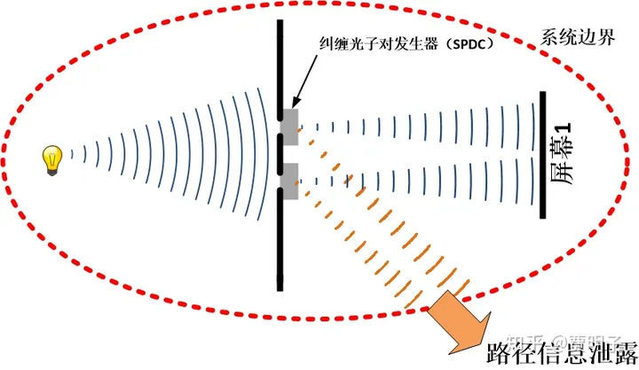

我们考虑一种相反的情形，如果我们的实验系统发生了故障，过程中产生的橙色光子与蓝色光子毫无关联，它们各自独立。那么当我们观察橙色光子的时候，我们无法获得关于蓝色光子的任何信息，它们没有纠缠。而这时，系统内的蓝色光子的两条路径之间的干涉仍然被保留在系统之中，而没有被纠缠“劫持”到更大的范围当中去，因而它仍然是“正常”的双缝干涉，我们可以看到干涉条纹，而此时橙色光子与之毫无关系，它并没有把蓝色光子的路径信息带出系统之外。

这样一来，我们在不知不觉之间解决了一个难题：我们简单明了地地解释了玻尔所谓的互补原理的一个版本：路径信息和干涉条纹之间的互补。**路径信息的泄露导致干涉消失，这只不过是量子纠缠的自然推论，**简而言之，它可以被总结成两个等效的联系：

- **“观察”****= “路径信息泄露”****= “量子纠缠”**
- **“观察导致波函数坍缩”****= “路径信息泄露导致干涉消失”****= “对广域纠缠系统的局部观察无法发现干涉”**

这个过程不需要特殊的观察者，甚至不需要观察（只要是路径信息有被观察到的可能，干涉就会消失），当然也就不涉及到任何坍缩和量子-经典边界。

这就给我们打开了一个视野：虽然我们并不能因此说，观察者的特殊地位不过是一种幻觉，坍缩也不过是一种多余的概念，但是，我们却看到了一个可能性：**一个单纯幺正演化的量子力学是可能的**。

那么，我们进一步来看看，如果我们考虑一个实际的观察，会导致何种结果。在前面的这个实验设置中，我们实际上是没有办法完成一个真正的观察的。因为我们想要通过橙色光子的行为体现出蓝色光子的路径信息，但是我们所能看到的，不过是屏幕2上面的一个光斑：橙色光子的两条路径在屏幕2上面重叠在一起而不可辨了。我们要想获得任何关于蓝色光子的路径信息，必须都要要求橙色光子的两条路径是可辨的，也就是说它们不能重叠。从数学上讲，就是橙色路径必须是**正交**的。

我们有办法把橙色的两条光路分开：我们可以在橙色的光路上放上一个棱镜就可以了。棱镜有一个光学性质，就是通过折射让光路发生偏折，它又叫做分光镜。因而，在橙色光路尚未重叠之时，用分光镜把它的两条路径完全分开，这样一来，橙色光子打到屏幕2上面就会是两个不重叠的完全分离的区域，我们就可以通过橙色光子到达的位置完全区分它是从哪一条缝隙传播过来的。于是我们就形成了一个理想观测仪器：左边的光斑完全来自左缝，而右边的光斑完全来自右缝，没有任何模糊之处。

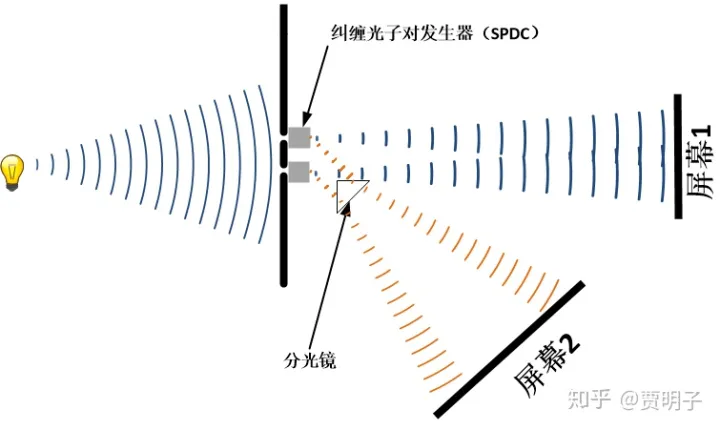

我们可以来看看这两种情况下相空间中的干涉条纹有何区别。下图中左侧是未加分光镜，因而橙色光路重叠的情形，而右侧则是橙色光路分离的情形。我们可以看到，这时候，我们向屏幕1看去（向着x轴的投影）我们会看到一个经典光斑，我们向屏幕2看去（向着y轴投影），我们会看到两个分离的光斑。而两个屏幕之间，并没有隐藏任何干涉。

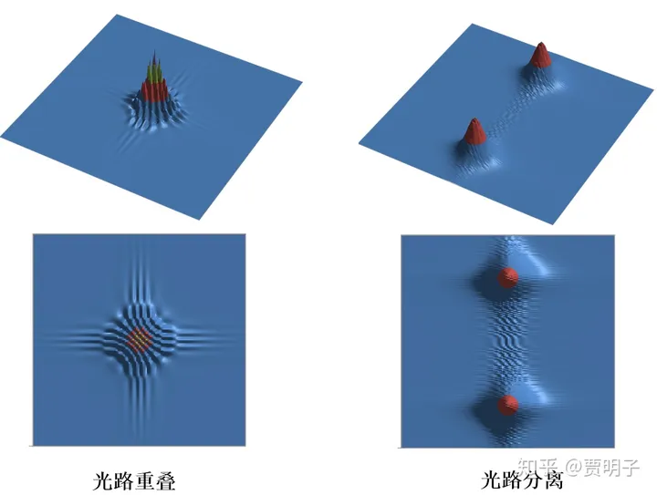

这时候，在这个时候，干涉条纹已经几乎消失殆尽了 – 尚存的些微干涉是因为光路在理论上无法完全分离，总会存在着一点点重叠所导致的。干涉不是在那儿而我们看不见，而是已经不在那儿了。这是为何呢？因为我们为了获得理想的观察而在实验设置中采用额外手段，让橙色光路分离导致的。我们前面说过，干涉是四个路径的共同干涉，而不是单独的蓝色光子的两条路径干涉。量子纠缠系统中的状态不可分离性，就导致了在橙色光路丧失重叠的时候，使得四条路径丧失了重叠性：于是干涉消失了。

随着我们把橙色光路的一点点分开，我们会看到干涉条纹的逐渐消失的过程：波函数渐渐地“坍缩”了。

这会不会是坍缩的一种合理起因呢？如果这真的是坍缩的起因，那么我们在整个过程中并没有在任何地方引入违反薛定谔方程的幺正演化的过程，理论上干涉将永远存在。那么它又是如何消失的？我们后面会继续谈论它。

**下一章：[贾明子：23、跨越经典-量子鸿沟：经典世界为何是“经典”的？](https://zhuanlan.zhihu.com/p/54202504)**

**上一章：[贾明子：21、量子力学的“终极特性”](https://zhuanlan.zhihu.com/p/53348823)**

**专栏传送门：[何为现实？拉普拉斯之妖与薛定谔猫之决战](https://zhuanlan.zhihu.com/c_186387023)**

------

## 参考

1. [^](https://zhuanlan.zhihu.com/p/53612788#ref_1_0)请注意，这是一个思想实验，具体是否有此完全一样的实际实验我并不知道。但是这个实验与“延时擦除实验”非常相似。
2. [^](https://zhuanlan.zhihu.com/p/53612788#ref_2_0)事实上，是“概率密度”的值，这里不做区分。
3. [^](https://zhuanlan.zhihu.com/p/53612788#ref_3_0)这是我自己做的一个小计算，经过了若干假设，例如，远场条件假设，单色光假设，不考虑SPDC产生的相位变化，等等。你只要知道虽然有假设简化了计算，但是原则上都是一样的。

发布于 2018-12-29 15:43・IP 属地未知

