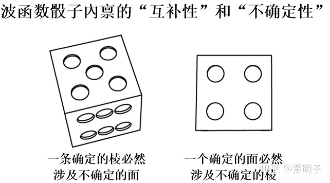
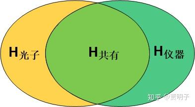
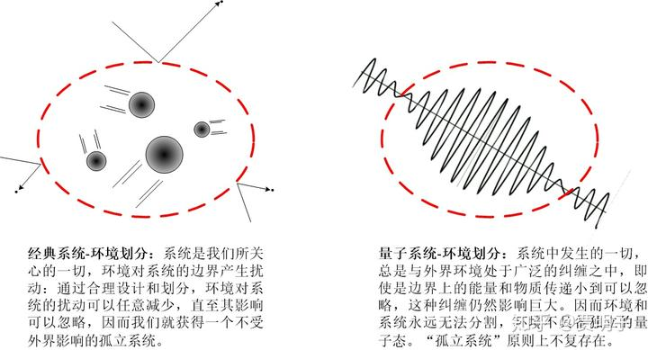
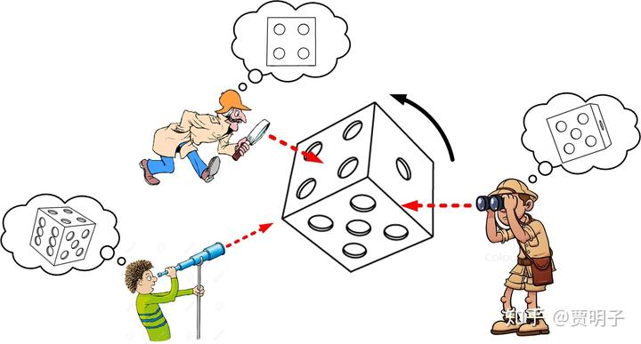
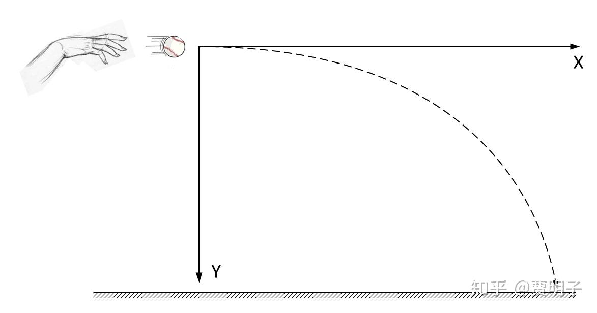
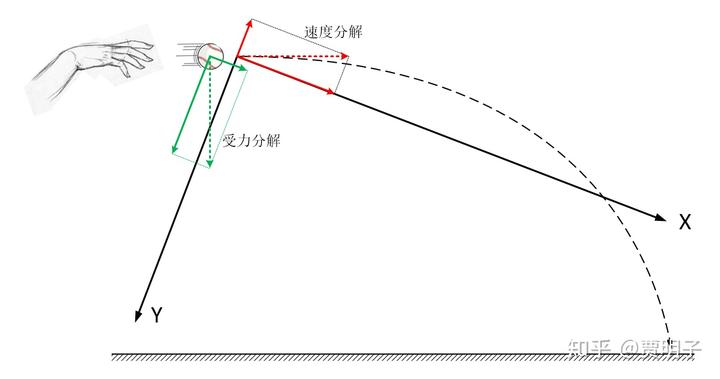
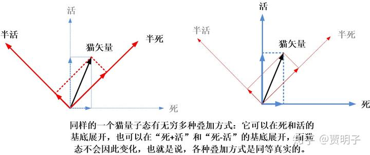
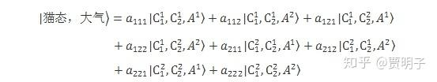

# 23、跨越经典-量子鸿沟：经典世界为何是“经典”的？

> ***“The border between classical and quantum phenomena is just a question of money.”***
> ***“量子-经典边界在哪儿只不过是花钱的问题。”***
> ***–- Zeilinger***

在前面的章节我们曾经提到过，量子态（波函数）就是一个在希尔伯特空间中不停旋转的一个骰子[[1\]](https://zhuanlan.zhihu.com/p/54202504#ref_1)。

这个骰子可能会有很多个面，在绝大多数情况下，它的面数多得数不清 – 这是因为那个臭名昭著的希尔伯特空间维度一般而言都是巨大无比的。我们这里暂时不去深究那些高维空间中的奇特现象 – 在后面多世界理论的讨论中，你会对此大开眼界 – 而只来看我们日常熟知的三维的、6个面的骰子。对于我们不对其进行任何观察的这个骰子，它可以进一步描述如下：

首先，这个骰子的结构不会发生什么变化：它总是由六个面构成的一个立方体，不论它向着哪一个方向旋转，变化的只是它的角度而已，构成它的各个面是不会发生变化的，面和面之间的关系也不会发生变化。

其次，这个骰子的“体积”为1且不发生变化，也就是说它不会膨胀和缩小。这里的“体积”有着这样一种含义：它是各种概率的总和，因而总是可以归一化的；因而它的体积又有另一个含义，就是它所包含的“信息量”是不随时间变化的，也就是说它是**信息守恒**的。这就是所谓的“**幺正**”演化的含义。

第三，我们可以选择某一个角度来观察这个骰子。理论上我们对这个观察角度没有什么限制。而观察它的结果，就是这个骰子在观察角度上的**投影**决定的。

第四，这个骰子的结构就决定了，它先天带有玻尔所谓的“**互补性**”或海森堡所谓的“**不确定性**”。例如说，我们得到了一个确定的面的结果，那么必然地我们就要失去棱的确定结果 – 因为每个面都包含了四条棱。相应地，如果我们得到了一条确定的棱的结果，那么必然地我们就不可能得到一个确定的面的结果 – 因为每条棱都是由两个面相交而成的。于是，“面” 和 “棱” 之间就构成了类似“位置”和“动量”之间的互补性和不确定性。因而不确定原理就显得非常自然而然，一点都不会费解了。

从宏观上来看，这种幺正演化的量子态就非常违反直觉，我们前面说到过，诸如态叠加、干涉、不确定性、量子纠缠等等一切量子现象。然而我们在宏观世界中的 经验告诉我们，这些怪异的量子现象不会再宏观世界中发生：一个垒球从来就不会既在这儿又在那儿，一只猫不会既死又活，你也不可能同时从前门和后门进入房间；当你在跑步中和同伴相撞的时候，你们两个人也不会突然变成了两团波纹，互相叠加、干涉，然后毫无滞涩地穿过对方 – 你们只会撞在一起然后弹回去，不论你们如何努力地加快速度，你们都只能发现你们撞得更加头晕眼花，而不可能穿过对方。

经典世界和量子世界为何会有如此大的不同？

当然，我们可以把这种不同当做理所当然：既然我们的经验告诉我们这样，那它必须是这样的。可能这个世界上，经典尺度和量子尺度上的确遵循着不同的运动规律。单个粒子必须满足量子力学，当这些粒子数目渐次增多，达到10^26这种宏观尺度的过程中，随着复杂性的增加，在某个时刻，量子力学就失效了，经典力学取而代之。我们不知道量子力学具体在何时失效，也不知道它为何失效，但是我们可以假设它在某时因为某种原因失效了 – 这样我们才可以简单合理地满足我们的观察结果。

这就是哥本哈根学派的“**量子-经典边界**”问题，也是它最令人诟病的地方。

这种说法显得很不自然，绝大多数人们并不满足于这种逃避的做法。我们前面提到，物理学家有一种近乎执拗的信念：物理规律是普适的、至简的。

人们不愿意看到同一个世界出现两种不同的理论。毕竟，对于同一个世界而言，两个相互不同的理论不可能同时是正确的。人们之所以能够接受哥本哈根诠释，只是因为它暂时可以符合人们的直接观测结果。但是，如果有选择的话，人们更愿意相信，经典力学是从量子力学中“涌现”出来的。

我们前面已经讲到过很多关于“涌现”的事例了。最典型的就是经典的统计力学。我们知道，在经典物理看来，每个分子都像是一个桌球，当只有少量分子的时候，我们可以用牛顿定律来精确地刻画它们的运动。这时候，一个容器中的寥寥数个分子和一个桌球游戏没有任何区别。但是当分子的个数增多的时候，我们就会陷入混沌的泥潭，从而失去了对每个分子精确描述的能力。

我们被迫要用概率统计的手法，从整体上来把握这些所有的分子。这样一来，我们就从对包含了机械运动的动力学系统的描述变成了对包含了热运动的热力学系统的描述。于是，温度、压力、熵、内能等概念就自然而然地出现了。这些热力学概念是我们从整体上描述大量分子的平均运动的有效工具，它们的定义依赖于大量分子的整体运动，而在单个分子中往往没有什么意义。但是这并不意味着单个分子的运动规律在热力学系统中失效了，恰恰相反，热力学系统的整体概念是依赖于每个分子的运动规律的。统计力学的目标就是把这种从微观到宏观的过渡桥梁架起来，使得宏观的热力学定律成为一种微观尺度渐渐增大过程中自然而然出现的规律 – 这样一来，微观定律和宏观定律就是互相相容的、同时又在各自领域中各司其职的两套规律，然而归根结底它们来源于同一个普适定律。这种从一个尺度向着另一个尺度过渡时，自然而然地出现新的概念或规律的现象就是**“涌现”，或者叫做“浮现”（emerge）**。在这个涌现过程中，并没有明显边界，就好像我们一粒一粒地将沙子堆起来，它自然而然就变成了“一堆”，但是它何时变成“堆”的？这个问题就没有明确答案。

同样道理，量子世界和经典世界完全不同的现象之间，有没有这样一个桥梁，使得一个没有“量子-经典边界”的和谐统一的理论，自然而然地从微观现象过渡到宏观现象呢？如果存在这种桥梁，那么我们就要放弃哥本哈根诠释的那种强行假设的坍缩过程，转而用一个普适的理论来描述一切。这个理论显然应该是量子力学而不是经典力学，因为经典力学在量子领域早已被证明是错误的。那么，我们就需要寻找到这样的一种机制：量子力学可以合理地把“坍缩”归结为一种表象的、涌现的效应，而不是一个我们强加给理论的突兀假设。

最早起源于冯诺依曼的测量理论，然后受到爱因斯坦和薛定谔两位大神对量子纠缠的论述、以及后来Everett的多世界理论[[2\]](https://zhuanlan.zhihu.com/p/54202504#ref_2)的启发，从1970年代起，人们开始了对量子经典过渡问题的突破。这一类理论，被统称为“**退相干理论**”。

所谓“退相干”（**Decoherence**），从字面上理解，意思是“相干性的退却”，也就是说，叠加态之间相干性在经典世界中的消失过程。但是它所研究的，并不是字面上看起来那么简单。这里涉及的更深层问题，就是“**量子到经典过渡**”的问题。也就是说，量子和经典两个领域之间的冲突，如何解决？

这里的量子经典之间的冲突，被物理学家**Zurek**总结为三个问题：

1、“**干涉消失问题（loss of interference）**”：干涉现象在微观是普遍存在的，为何宏观中看不到任何干涉现象？状态之间的相干性是如何消失的？

2、“**偏好基问题（preferred basis problem）**”：在量子力学中，态叠加是一个普遍存在、并且从逻辑上不可避免的现象：每一个量子态都可以看做是其他若干量子态的叠加。然而，在我们的经典世界中，我们日常看到的物体总是有确定的位置，而不是同时处于不同位置的叠加；总是由确定的动量，而不是同时处于不同动量的叠加。这究竟是为什么？何我们在宏观世界看不到一般的“叠加态”，而总是看到确定的位置、确定的动量这样的“经典状态”？为何诸如“确定的位置”之类的经典态如此特殊，被观察所“偏好”？**为何我们看不到既在这儿又在那儿的桌球，看不到既死又活的猫，而只能看到一个确定位置的桌球或者要么死要么活的猫？**

我们前面提到过，我们的观察过程其实分两个部分，首先，我们选取了一组特定的坐标系（基底），然后，量子态向这组坐标系的每个坐标轴上投影，由投影决定了各种可能的概率。那么，这里的问题就是，为何存在这样几组特殊的基底？为何我们不能观察到其它的基底？

3、“**确定结果问题（outcome problem）**”：如果说，偏好基问题指的是观察过程中的第一步，基底的选取，那么这个问题就是第二步，量子态向某个基底的投影。也就是说，即使是我们能够合理解释为何会存在着某一组特定的状态优于其它状态，我们能够解释为何不存在“既死又活”而只能存在“或死或活”，我们仍然面临着另外一个问题：为何我们的观察能得到某一个确定的结果？我们的观察在“死或活”二者之间是如何做出选择的？粒子被观察时，在这一组偏好基中那么多的本征态中，是什么，使得粒子在被观察的时候，“选择了”某一个特定的本征态而不是其它？说到底，“玻恩规则”是怎么回事？“概率性”又该如何解释？

我们在上一章中，已经讨论了在没有“坍缩”的时候，干涉是如何自然地从观察者眼中消失的。

说到底，观察意味着纠缠，而纠缠意味着干涉扩散到一个更大的范围中，当我们不能同时观察这个更大的范围时，干涉的信息就丢失了：它被扩散到观察所不能及的外部了。这里，纠缠系统的两个特性，**不可分割性**以及**整体不等于部分的加和**就成为干涉消失的罪魁祸首。

这个从数学上也是很简单的，我们知道，光子的路径是从两个缝隙穿过的路径的叠加：

$|光子\rangle=|路径1\rangle+|路径2\rangle$

而正是由于这种叠加，导致了它们之间干涉的形成。对于一个测量，如果我们能够完成一个正确的测量，我们需要测量仪器与光子的两条路径形成纠缠。也就是说，两个路径所代表的状态分别与仪器的某个自由度形成了纠缠，例如，路径1与仪器的一个状态 \psi_1 形成关联，路径2与仪器的另一个状态 \psi_2 形成关联：

$|光子\rangle|仪器\rangle\rightarrow|路径1\rangle|\psi_1\rangle+|路径2\rangle|\psi_2\rangle$

这样我们就可以通过对仪器的观察而得到光子的路径信息。如果我们想得到最为准确的观察，就要求仪器的状态能够完全关联路径信息 – 我们说过，这就是最大纠缠。然而这种纠缠态就是光子的路径和仪器状态变得无法分割。干涉由原来发生在光子的“路径1”和“路径2”之间，变成了发生在光子+仪器的“光子路径1，仪器状态1”和“光子路径2，仪器状态2”之间了。

对这样一对（仪器、光子）所形成的最大纠缠的系统而言，整个系统所包含的信息就可以分为三个部分：单独光子且不涉及仪器的信息H光子、单独仪器且不涉及光子的信息H仪器、以及共有信息（mutual information）H共有：

不论我们观察光子还是观察仪器，我们都会把共有信息给丢失掉。实际上我们并不能直接观察光子，我们只能对仪器进行观察，这时我们把共有信息给抛弃掉的结果，就是抛弃了一切可能与光子有关的信息。然而，如上所说，干涉的两个状态必然要包括光子路径信息的。因而抛弃了共有信息就等于抛弃了所有的干涉信息。也就是说，我们所抛弃的部分，是了解干涉信息所需要的必要信息，因而没有了它，我们就看不到干涉了。就像是前一章中，赵老师和钱老师不可能看到孙老师所看到的隐藏的图画一样。此时干涉并没有消失 – 因为我们并没有假设一个使之消失的坍缩存在 – 它只是扩散到更大的系统中去了。我们的“整体划分为不同部分”的观察方式就必然不能捕捉到全部的信息，所以我们看不到这种干涉。当我们能够对整个复合系统进行观察时，我们仍然能够观察到干涉的存在 – 然而一般情况下我们做不到。

我们上一章的讨论还显示，当我们要求我们的仪器输出明确的输出值 - 即 |\psi_1\rangle 和 |\psi_1\rangle 之间没有重叠性（相互正交） - 时，即使是在（仪器+光子）的复合系统中，干涉仍然不能存在。这是由于仪器的两个状态之间不能重叠，因而就必然导致上述“光子+仪器”的两个复合状态不能重叠，这样一来干涉就无法存在了。

这就是所谓的互补原理：如果光子的路径信息被泄露出去，必然会导致相干性的破坏，光子从双缝路径的叠加态变成某一条单缝路径的确定态。这里何为“**路径信息泄露**”？很简单，我们通过对 |\psi_1\rangle 和 |\psi_1\rangle 的观察就可以知道路径1或路径2的信息。它们变成了互相独立 – 它们之间的叠加性消失了。

同样地，我们还是没有假设那个直接导致干涉消失的“坍缩”，那么此时的干涉又藏在何处？其实很简单，我们对仪器“不同的输出值不能有重叠”的要求必然要引入额外的控制变量– 在上一章的例子里是分光镜实现的。而这种控制变量就会与仪器的输出值形成纠缠，进而把（光子+仪器）的纠缠复合系统变成了（光子+仪器+分光镜）的更大的纠缠系统，干涉就进一步扩散到分光镜的自由度中去了。而我们所谓的“干涉消失”仅仅指的是干涉在（光子+仪器）这个范围内消失了。也就是说，**我们想要扩大我们的观察范围的努力往往不可避免地引入更多的系统参与到干涉中，从而导致干涉更进一步向外扩散**。

这个，就是退相干理论对第一个问题：干涉消失问题的解答。

理论上讲，我们有可能做到巧妙设计，使得干涉不因为越来越多的纠缠而被扩散、“泄露”出去，这就是为何我们通过精巧的实验室设计而观察到干涉现象的原因。但是，在绝大多数现实情况下，我们仍然面临着一个极大的不可控因素 – **环境**。在绝大多数情况下，环境会不断地侵入到系统之中，与系统形成或多或少的纠缠，虽然不必每个环境自由度都会与系统形成最大纠缠，但是由于环境自由度如此之巨大，最终也会将干涉整个泄露出去而无法非观察到。

我们所能观察的，必然是一个有限的系统，我们不必，也没有可能对整个宇宙同时做出观察。因而，我们所研究的，就只能是宇宙的一小部分。我们在第一部分中，曾经提到过经典物理中的“孤立系统”的概念，

这个概念可以说是物理学发展史上最重要、做出贡献做大的概念之一：它使得我们的研究变成可能。在经典孤立系统中，我们总是可以通过适当地划分边界，合理地减少环境的干扰，让这个系统近似地处于不受外界任何干扰的孤立状态，然后我们就可以研究系统中的规律。但是这个概念，在量子力学中却崩塌了。因为纠缠所引起的粒子间的关联，一旦形成就会永远保持下去，并且这种关联不但不受时间和空间的限制，而且不受能量传递和信号传递的限制，因而它是普遍的，并且是遍布整个环境的。无论我们怎么试图减少系统边界的扰动（能量传递），我们都不可能哪怕是些微消除这种广域的关联。所以说，系统与环境总是无时无刻处于纠缠之中，并且相互之间互相无法分割。我们强行在系统与环境之间做出划分，必然导致纠缠信息的损失，从而导致系统相干性的破坏 – **量子系统永远都是开放系统。**

由于纠缠的原因，系统的信息总是不可避免地泄露到环境中去，并且遍布整个环境。并且值得一提的是，在我们用骰子对量子态的类比当中，我们曾经提到，波函数这个骰子在希尔伯特空间中不停转动的过程中，它的体积总是保持为1，既不膨胀也不收缩，这里的“体积”所类比的，就是波函数所包含的信息量。体积不变，就是量子系统的幺正演化以及它直接导致的一个特性，就是**信息守恒**。系统的量子信息永远不会消失，也不会增加[[3\]](https://zhuanlan.zhihu.com/p/54202504#ref_3)。所以，当我们试图观察系统状态的时候，我们其实是在于环境“争夺”关于系统状态的信息。我们必须要知道，**环境是巨大的，而我们是渺小的**。环境巨量的自由度与系统之间的纠缠是压倒性的，因而系统的大量量子信息扩散到环境中而无法被我们捕捉到。我们只能获得关于系统状态的极少量信息：那些没有被环境“劫持走”的信息。

而这，就是第二个问题，偏好基问题的核心。

我们先来看看，科学家们为何要提出这个所谓的“偏好基问题”。为何我们就不能心安理得地接受确定的位置或确定的动量作为一种自然界的特殊存在呢？

答案其实很简单，量子力学中不存在所谓的“确定”的状态，因为任何状态都是其他状态的叠加！我们看到的确定的位置所代表的量子态，同样是一种叠加态，它可以看做若干其它量子态的叠加：就像是我们在前面所展示的，它可以是一系列平面波（动量本征态）的叠加 – 当然，除此之外，我们可以把它看作是无数种方式叠加而成的。

它们共同构成了波函数这个骰子的立体结构，我们可以从任意的角度来描述它，而不能把某种特定的角度看作是特殊的：

我们在前面说过，**量子态是希尔伯特空间中的一个单位矢量**。量子态的演化其实就是这个态矢量的旋转过程 – 只不过因为希尔伯特空间的维度巨大，因而这个旋转就变得复杂无比。而对于一个矢量而言，我们可以通过选择一个坐标系来描述它。为了更加形象地说明这一点，我们来举一个简单的经典运动学的例子：一个平抛运动。当然，这是一个纯经典的过程，运动规律和量子世界完全不同，但是却能给我们一些符合常识的类比。

如图，我们水平向外抛出一个垒球。如果我们完全忽略掉空气阻力，那么这个球行走的轨迹就是一个严格的平抛抛物线。当你将来上到高中，你会学习具体的运动方程，但是现在你可以想象，如果我们选择水平方向为X轴，竖直方向为Y轴，那么，很显然，这个运动在水平方向是是一个匀速直线运动，而在竖直方向上是一个自由落体运动。我们说，**垒球的运动是由一个匀速直线运动和一个自由落体运动叠加而成的**。

但是，我们对坐标系的选取是完全主观的、任意的。上面这种选取方式无疑是计算上最简的一种，但是并不是唯一“真实”的一种。我们完全可以把这个坐标系任意旋转某个角度。如下图：

那么在这种坐标系的选择下，它就不再是一个匀速直线运动和自由落体运动的叠加了。因为速度和受力也可以按照任意坐标轴分解，那么他们分别在这个坐标系下的叠加方式就有所不同，如图所示。这也是一个高中物理的基本知识，在这个坐标系中，**它是一个匀加速运动（X方向）和匀减速运动（Y方向）的叠加**。它不再是匀速运动和自由落体运动的叠加了。

这两种叠加方式哪一种更加“真实”？很明显，它们都是**完全等价**的，所不同的只是我们的观察角度不一样。如果这时候我说，不对，垒球的运动只能看做匀速运动和自由落体运动的叠加，其他的叠加方式都是不对的，你一定会觉得我脑袋进水了。

我们回到薛定谔猫的讨论。这里完全可以一一类比：比如说水平方向对应“死”，竖直方向对应“活”。那么“死”和“活”并非猫态的唯一的叠加方式。因为量子态这个矢量和速度矢量表现完全一致。猫态的“死”和“活”是一组坐标轴，我们完全可以用“死+活”和“死-活”作为坐标轴。例如我们暂且把后者称为“半死”和“半活”：

$|半死\rangle=\frac{1}{\sqrt{2}}\left( |死\rangle+|活\rangle \right)$

$|半活\rangle=\frac{1}{\sqrt{2}}\left( |死\rangle-|活\rangle \right)$

那么，任意的一个量子态，可以用前者表示，也可以用后者表示。

就好像空间中的坐标系可以任意选取一样，“死”、“活”这样的状态，并不比“半死”和“半活”来得特殊。我们之所以下意识地把“死”和“活”当做确定的状态，而把“半死”和“半活”当做叠加态，这是来自于我们经验的偏见：死和活是我们日常所见的“经典”，所以我们认为它们是确定的、特殊的状态，这**不是因为理论预言如此，而是因为我们的经验告诉我们如此**。严格说，所谓的这样一种说法：我们在经典世界中只能看到**确定的**“死”或“活”的状态，而不能看到**叠加态**，它其实是不正确的。“确定的”经典状态之所以确定，只是我们习以为常罢了。事实上，**我们看到的任何状态，都是叠加态，**包括哪些“确定的”经典状态，它们也是叠加态 - 死和活都是半死和半活的叠加：

$|死\rangle=\frac{1}{\sqrt{2}}\left( |半死\rangle+|半活\rangle \right)$

$|活\rangle=\frac{1}{\sqrt{2}}\left( |半死\rangle-|半活\rangle \right)$

既然猫态的各种叠加方式同等“真实”，那么，从理论上我们就没有任何理由认定死和活这样的“经典态”就比半死和半活这样的“叠加态”更加“真实”。偏好基问题问得恰恰就是这个：既然它们在理论中同等真实，那么为何在现实中我们永远看不到一只既死又活的猫？

用我们前面的类比来说，在没有坍缩的幺正演化过程中，波函数这个骰子可以从任意的角度来观察，它可以用任意的坐标系来描述：既可以是6个面的叠加，也可以是12条棱的叠加，甚至可以说若干个“棱面混合态”的叠加。总而言之，它有任意多种叠加方式。但是，现在量子力学预言，我们在观察中，只能看到它的各个面，而看不到其它角度的投影。Why？

这个问题在哥本哈根诠释中并不是一个问题，– 当然，这也是个问题，但是哥本哈根诠释把这个问题包装在“坍缩”中了，它事实上强行假设了这组偏好基的存在，并且强行要求观察在其中选取其一。这是一个很不自然的假设，但是很实用。而如果我们想取消哥本哈根的量子-经典边界，只用薛定谔方程来描述所有的自然程，但是**同时又必须完成哥本哈根诠释所能做到的一切预言，**那么我们就必然面对这个问题。

我们当然可以偷个懒，简单粗暴地采取一种解决方案：我们**假定**自然界预设性地存在偏好基，而不去考虑为什么 – 因为这是我们的经验告诉我们的，所以它**必须**这样。但是这种方案就需要偏好基这种额外的假设。假定一组外在的“偏好基”，等同于假定存在着某种隐变量，也在某种程度上假定了与“坍缩”相同的框架。与哥本哈根诠释相比，也就没有任何优势可言。

那么，我们现在面临的问题就是，如何在不引入额外假设（或者至少是，引入一个比坍缩要更加显而易见的假设）的情况下，解决掉这个偏好基问题。具体讲，就是要在不引入坍缩的前提下，回答这样一个问题：**我们为何只能看到某些确定的经典状态，而不能看到这些经典状态的任意叠加？**

前面我们提到，量子力学中没有严格意义上的孤立系统。那么系统的信息就会被环境不断劫持走，泄露到环境中去，从而变得与环境混为一体而不可分割。这时，就不存在一个独立地量子态可以单独描述系统。如果我们强行把系统从环境中划分出去，我们就不得不面对着抛弃共有信息这种棘手的问题。现在，如果我们反过来，非要假定存在一个一个完全孤立的系统，它不就可以用一个独立的波函数来描述它的量子态了（纯态）吗？那么这个独立的量子态中的所有干涉、叠加也就总是存在的。是的，理论上**一个不包含任何子系统的孤立系统中，是不存在所谓的“坍缩”问题、也就不存在偏好基的问题的**。然而，这种系统毫无意义，因为它是没有办法被观察到的，也没有任何办法会影响到我们，与我们没有任何因果关系，我们甚至没有任何办法知道它是否存在。因而这个“完全孤立的”系统对我们也就毫无意义。

**我们所面对的有意义的系统，包含至少三个子系统：被观察系统、观察者、以及环境。**

因而，信息被环境不断劫持走，这是一个无法避免的问题。并且，绝大多数信息都会因为与环境发生纠缠而泄露在环境当中消失无踪影，只有极少量的信息能够保持独立性。而这种可以保持独立性的信息，才是那些可以被我们观察到的。这些信息，就是在与环境相互作用中，不与环境发生纠缠的那一些。

比如说，我们有这样一个系统，它会与环境发生特定的相互作用，而这种相互作用的结果，会使得它的某两个态矢量， 和 ，分别于环境一起，发生如下演化：

$|\psi_1\left( t=0 \right)\rangle|E\left( t=0 \right)\rangle\rightarrow|\psi_1\left( t \right)\rangle|E_1\left( t \right)\rangle$

$|\psi_2\left( t=0 \right)\rangle|E\left( t=0 \right)\rangle\rightarrow|\psi_2\left( t \right)\rangle|E_2\left( t \right)\rangle$

这里， E_1 和 E_2 之间相互正交。它们与环境发生相互作用后，演化过程中仍然可以保持在张量积的形式，也就是说，在演化过程中，这两个状态不会与环境形成纠缠。因而，它们的信息就分别保持在独立的系统之内，而不会被环境“劫持”走。我们就总是可以通过观察获得这两个状态的完整信息。

而这时候，我们有另外两个状态（忽略归一化）：

$|\psi_\pm\rangle=|\psi_1\rangle\pm|\psi_2\rangle$

那么，对于这样的状态，与环境发生相互作用的结果就会是如下的：

$|\psi_\pm\rangle|E\rangle=\left( |\psi_1\rangle\pm|\psi_2\rangle \right)|E\rangle\rightarrow|\psi_1\rangle|E_1\rangle\pm|\psi_2\rangle|E_2\rangle$

我们发现，此时，演化产生的状态就是系统与环境之间的最大纠缠态。因此，这个叠加态的信息就被环境劫持，扩散到环境当中去了。那么，在我们对系统进行观察时，这个状态我们就观察不到 – 它损失掉了。 \psi_1 和 \psi_2 在与环境的相互作用中可以保持不发生纠缠，因而它们就能在环境的干扰下保持稳定，被我们观察到，但是 \psi_+ 和 \psi_- 则会发生纠缠，因而它们就在环境的干扰下被破坏殆尽，永远不能被观察到了。

稍作进一步分析我们就可以看到，对这种系统-环境的相互作用，它的两个状态\psi_1 和 \psi_2 的完整信息就被环境保留下来，而其余的任意形式 – 它们其它所有的叠加态 – 就被环境破坏掉了。也就是说，整个外界环境形成了一个“筛子”，把 和 之间的所有叠加态全部筛掉，只剩下这两个状态可以被我们观察到：**系统与环境的相互作用替我们“选择”了一套我们能够观察到的“偏好基”，**而屏蔽掉了它们的叠加态，使它们观察不到。这个，就叫做**“环境选择”（Environment induced superselection，或者简写为Einselection ）**[[4\]](https://zhuanlan.zhihu.com/p/54202504#ref_4)

上面的例子说明，环境的参与导致了大量状态的不可见。那么，现在问题来了：对于一个一般的量子系统，我们知道了系统与环境的相互作用，会筛掉大部分的量子态，只选择一小部分让我们观察到，那么那些被环境保留下来的“偏好基”到底是什么呢？

这个问题就需要对薛定谔方程的详细求解，过程中涉及到大量的数学，并且不同的情况这个过程会很不同，我这里无意进行详细推导。但是我可以告诉你结果，**那些被环境选择的，恰恰就是我们日常看到的经典状态：确定的位置、确定的能量、确定的电荷等等**[[5\]](https://zhuanlan.zhihu.com/p/54202504#ref_5)**。**

因此，无处不在的环境影响，使得系统的状态信息不能完整地到达我们，从而被我们观察到。那些能够“适应”环境的，得以生存下来，而那些“不适应”环境的，统统被环境淘汰。这种量子信息在环境中的“适者生存”，与生物学中的进化论何其相似！因此，这个理论又被称为**“量子达尔文主义”**[[6\]](https://zhuanlan.zhihu.com/p/54202504#ref_6)**。**

这个过程，其实我们可以换一种角度来看待，就会清楚很多。由于环境无时无刻不在与系统之间形成纠缠，从退相干的基本理念来看，这种环境与系统之间的相互作用，就**等效于一种观察过程**：环境对系统的“观察”。这种观察中，并没有一个有意识的观察者在观察链条的尽头接收这个观察结果，也没有类似磁盘之类的记录设备在记录这个观察结果，但是它的效果与观察并无二致 – 别忘了，观察过程就是仪器（环境）与系统形成纠缠的过程。如果按照哥本哈根的说法，那就是环境作为观察者，在持续对系统进行着观察，因而系统就一直处于“坍缩”的状态。那么环境观察的是系统的何种可观测量、进而系统是向着何种确定状态坍缩的呢？

自然界中绝大多数的相互作用力（在量子力学中表现为“**势函数**”），都有着相似的形式，它们大都与相互作用双方的位置有关：

$V=V\left( x \right)$

例如，静电作用力的库仑定律就是与距离呈严格的平方反比关系。也就是说，这种相互作用会能直接体现系统中粒子的位置信息 – 不严格地说，我们在系统外部通过相互作用的情况，就可以直接判断系统的位置信息。因而，在绝大多数的这种相互作用下，环境扮演了一个**对位置进行观测的观察者**。因而，位置就总是能够在纠缠中保持独立，也就是说，系统总是在环境的观测下坍缩在确定的位置状态。这就解释了为何我们日常看到的物体总是有一个确定的位置，而不是多个位置的叠加态。

爱因斯坦曾经对量子力学在经典领域的过渡问题上，曾经说过：

> ***“……对宏观系统的波函数要求其必须狭窄是违背量子力学基本公设的。……在宏观坐标中要求波函数的狭窄，不但是一个独立于量子力学之外的假设，而且是一个与之不相容的假设。”\***

这里，爱因斯坦所谈论的“狭窄的波函数”，指的就是宏观系统中确定的位置。他虽然没有明确提出偏好基的问题，但是他显然已经意识到，确定的位置本身是一件量子力学所面对的难题，如果不能在理论中合理解决它，而仅仅像哥本哈根诠释那样把它当做一个独立假设提出来，量子力学就不是一个完备的、自洽的理论。

退相干理论中的Einselection过程，则提供了一个这种确定位置自然而然地从幺正的量子力学中涌现的机制。在这整个过程中，我们完全没有用到“坍缩”的假设，而只采用了量子力学的薛定谔方程。一个独立的量子系统必然要满足薛定谔方程，也就是说独立的波函数就只能像个骰子一样在希尔伯特空间中旋转，因而各种叠加态都不但是**必须**的，而且是**任意**的。然而，在环境的干预下，独立的量子系统已经不复存在，只有（环境+系统）的这个大系统才可以被一个有意义的整体波函数描述 – 这个整体的波函数满足幺正演化。而单独的系统的状态就不是一个纯粹的量子态（所谓的纯态），它的运动规则就不再是线性的和幺正的。**环境的干预可以被看作是一个“筛子”，把所有的非经典的叠加态筛除掉而只留下我们日常所见的确定的位置这样的经典态；它也可以被看作是一个观察者，对系统的位置做出持续的观察导致它总是“坍缩”在一个确定位置上。**

这就是退相干理论对偏好基问题的诠释 – 我这里并没有说它**解决了**偏好基问题，因为说到底，幺正演化中的对称性并非如此简单就被解决。我们仍然可以继续向下刨根问底。既然量子力学中确定的位置与位置的叠加态并没有区别，确定的位置只是被一个与位置相关的环境相互作用筛选出来的，那么为何这种相互作用会与确定的位置相关，而不是与任意的位置叠加态相关呢？这个，已经不再是量子力学能够回答的问题了。

那么，我想现在我们可以试着来进一步说明一下著名的薛定谔猫的问题了。从1935年薛定谔提出这个有趣的问题以来，大家一直以来习惯于把猫态描述成：

$|猫态\rangle=|死\rangle+|活\rangle$

但是，我们必须注意到，严格讲，**这个描述是错误的**。一只猫，是由大量的微观粒子构成的复杂系统，它的每一个粒子，都可以由一些状态的叠加来描述。但是，请注意一点的是，猫的所有这些构成粒子，它们之间是无时不刻处于相互作用、因而也就是处于相互纠缠的状态，因此，作为一只猫的整体状态，是所有这些粒子共有的一个状态。构成猫的每一个粒子，我们可以把它们称作C1、C2、……、Cn。这里，n的数目是庞大的，大约为10^26。而每个粒子都会有若干不同的可能状态[[7\]](https://zhuanlan.zhihu.com/p/54202504#ref_7)，那么，这么多数量的粒子个各种状态的不同组合，也就是说，所有这些粒子状态的张量积，就构成了它的希尔伯特空间的维度：

$|猫态\rangle=\prod_{i}^{}\otimes|C_i\rangle$

那么，一只与外界完全孤立的猫，它的量子态就可以表示为：

$|猫态\rangle=\sum_{a1,a2,...an}^{}{\alpha_{a1,a2,...an}|C_1^{a1},C_2^{a2},...C_n^{an}}\rangle$

其中a1、a2……分别表示第1个粒子、第二个粒子……的不同状态的量子数。这是一个有着近乎无穷多项的线性叠加。正如前面我们曾经提到，**希尔伯特空间是巨大的，**巨大到我们无法想象。正是由于这种巨大的维度，才导致了很多看似奇特的现象。这个维度到底有多大呢？如果展开这个公式，恐怕写到整个宇宙的边缘都无法写完其中的九牛一毛。现在，为了简化起见，我们就用两个粒子来表示这个猫态（2个粒子和10^26个粒子之间，并没有原则上不可外推的限制），每个粒子假设有两个状态。那么：

请注意，这里我们讨论的是一只“孤立的”猫。因为按照我们前面的描述，只有**当这只猫是完全孤立的时候，它独立的量子态才有意义**，这是一个所谓的**“纯态”**。但是，一只“孤立的”猫是不可能存在的，因为作为一只猫，它必须要依赖于和外界的物质交换和相互作用才能存在下去，如果把它放到与外界完全隔绝的真空中，它立刻就要窒息而死。因而，它至少要与外界的大气有所交流。大气中的粒子数当然更加远远多于猫的粒子数，但是我们这里仍然考虑简化：我们假设只有一个大气的粒子，A。那么猫和大气的整体状态就是：

这就是我们前面所说的，猫和大气的纠缠态。更加严格地讲，是***构成猫的所有粒子与大气的所有粒子之间的纠缠态***。这仅仅是一个极端简化的表示，你可以想象一下，如果我们考虑了10^26个粒子，这个公式将会有多巨大。因此在这种纠缠态中，不但是构成猫的所有那些粒子之间互相无法分割，猫和“非猫”的外界环境也不可分割 – 它们是互为一体的，我们无法谈论单独的“猫态”。

而我们对猫的描述，不可能包含它所处的整个环境，而只能是简单粗暴地“剔除”切掉大气粒子的部分，因而必然是不完整的。在这个“猫+大气”的整体系统中，我们所能做到最好的，是把所有大气粒子不同状态下对应的构成猫的粒子状态（“相对态”）进行一个综合平均 – 也就是说，我们忽略了这个量子态中大气粒子的那一部分，而把它们仅仅当做一个模糊的平均权数[[8\]](https://zhuanlan.zhihu.com/p/54202504#ref_8)。因此，经过这样一个“过滤”过程，我们把这个整体中大气粒子过滤掉，同时我们必然会过滤掉大量的猫和大气共有的状态。这样做的后果就是，我们得到的猫态，就不是一个真正的、完整的量子态[[9\]](https://zhuanlan.zhihu.com/p/54202504#ref_9)。因此所有构成猫的粒子的组合而产生的**“死”和“活”也就不是真正的量子态**，而是一种“约化”的量子态，它从表现上和经典的“非死即活”就完全一致，看上去，可以完全被当做是经典态了。

总而言之，当一个系统与外界形成纠缠的时候，处于纠缠的状态之间的干涉仍然在整体中存在[[10\]](https://zhuanlan.zhihu.com/p/54202504#ref_10)，但是从任何一个子系统看，都再也不会看到了[[11\]](https://zhuanlan.zhihu.com/p/54202504#ref_11)：它们**看起来**，和一个经典态没有任何区别了。所以，一个系统一般而言不能被分成若干子系统独立对待，因为不论你研究哪一个子系统，你总是会把它们之间的纠缠信息丢弃掉，导致了最终结果就是，你研究完了所有的子系统之后，把它们组合起来，得到的结果并非系统整体的结果：**整体≠各部分的加和**。

你看到一只活蹦乱跳的活猫，但是在你看不到的角落中，死和活和整个宇宙在一起纠缠着，干涉着。

**下一章：[贾明子：24、命运多舛的的多世界理论](https://zhuanlan.zhihu.com/p/54551194)**

**上一章：[贾明子：22、干涉是如何消失的？](https://zhuanlan.zhihu.com/p/53612788)**

**专栏传送门：[何为现实？拉普拉斯之妖与薛定谔猫之决战](https://zhuanlan.zhihu.com/c_186387023)**

------

[[1\]](https://zhuanlan.zhihu.com/write#_ftnref1) 当然，这是一个比较形象和比较方便的比喻。从更加严格的数学意义上说，它是一个在希尔伯特空间中不停旋转的、维度极高的、长度为1的矢量。但是我想这里我们不必去追究那些严谨的数学细节，为了把道理讲明白，我选择用更加形象的语言。

[[2\]](https://zhuanlan.zhihu.com/write#_ftnref2) 这又是一个个性极其鲜明的理论，我们后面会详细探索它的种种有趣并且匪夷所思的地方。

[[3\]](https://zhuanlan.zhihu.com/write#_ftnref3) 我们在第一部分“未来”中关于刘维尔定理中曾经提到这一点。事实上，量子力学中也有刘维尔定理的版本。

[[4\]](https://zhuanlan.zhihu.com/write#_ftnref4) 这个术语非常有意思。它最早是由Zurek提出的，这个缩写的前半部分和爱因斯坦名字的前半部分完全一样：**Eins**election Vs **Eins**tein。我不知道当初Zurek创造这个术语的时候是否有向爱因斯坦致敬的意思。

[[5\]](https://zhuanlan.zhihu.com/write#_ftnref5) 或者这句话应该反过来说，正是由于它们被环境选择成为偏好基，才能被我们日常观察到，成为我们的经验，也就是所谓的“经典状态”

[[6\]](https://zhuanlan.zhihu.com/write#_ftnref6) 这里我偷了一个懒，量子达尔文主义不仅仅包含了这种“适者生存”的思想，它涉及到量子信息通过环境通道到达我们感官的过程，还包括了某些信息的冗余性以及在环境中的“繁衍”和“遗传”过程，和生物进化中的繁衍和遗传也十分相似。这个过程过于复杂，留作你以后的进一步探索方向吧。另外，量子达尔文主义其实只是退相干理论的一种延伸诠释，两者并非等同。

[[7\]](https://zhuanlan.zhihu.com/write#_ftnref7) 等你学习了高中化学后，就会知道它们可以用所谓的量子数来标记。

[[8\]](https://zhuanlan.zhihu.com/write#_ftnref8) 这个过程，叫做“密度矩阵的部分求迹”（partial trace of density matrix）

[[9\]](https://zhuanlan.zhihu.com/write#_ftnref9) 它可以用“约化密度矩阵”（reduced density matrix）表示

[[10\]](https://zhuanlan.zhihu.com/write#_ftnref10) 因为整个过程中一直是薛定谔方程描述下的幺正演化。

[[11\]](https://zhuanlan.zhihu.com/write#_ftnref11)这中间涉及到很多线性代数的数学推导，我就不做详细讨论，而只是很粗略地说一下它的原因。

## 参考

1. [^](https://zhuanlan.zhihu.com/p/54202504#ref_1_0)当然，这是一个比较形象和比较方便的比喻。从更加严格的数学意义上说，它是一个在希尔伯特空间中不停旋转的、维度极高的、长度为1的矢量。但是我想这里我们不必去追究那些严谨的数学细节，为了把道理讲明白，我选择用更加形象的语言。
2. [^](https://zhuanlan.zhihu.com/p/54202504#ref_2_0)这又是一个个性极其鲜明的理论，我们后面会详细探索它的种种有趣并且匪夷所思的地方。
3. [^](https://zhuanlan.zhihu.com/p/54202504#ref_3_0)我们在第一部分“未来”中关于刘维尔定理中曾经提到这一点。事实上，量子力学中也有刘维尔定理的版本。
4. [^](https://zhuanlan.zhihu.com/p/54202504#ref_4_0)这个术语非常有意思。它最早是由Zurek提出的，这个缩写的前半部分和爱因斯坦名字的前半部分完全一样：Einselection Vs Einstein。我不知道当初Zurek创造这个术语的时候是否有向爱因斯坦致敬的意思。
5. [^](https://zhuanlan.zhihu.com/p/54202504#ref_5_0)或者这句话应该反过来说，正是由于它们被环境选择成为偏好基，才能被我们日常观察到，成为我们的经验，也就是所谓的“经典状态”
6. [^](https://zhuanlan.zhihu.com/p/54202504#ref_6_0)这里我偷了一个懒，量子达尔文主义不仅仅包含了这种“适者生存”的思想，它涉及到量子信息通过环境通道到达我们感官的过程，还包括了某些信息的冗余性以及在环境中的“繁衍”和“遗传”过程，和生物进化中的繁衍和遗传也十分相似。这个过程过于复杂，留作你以后的进一步探索方向吧。另外，量子达尔文主义其实只是退相干理论的一种延伸诠释，两者并非等同。
7. [^](https://zhuanlan.zhihu.com/p/54202504#ref_7_0)等你学习了高中化学后，就会知道它们可以用所谓的量子数来标记。
8. [^](https://zhuanlan.zhihu.com/p/54202504#ref_8_0)这个过程，叫做“密度矩阵的部分求迹”（partial trace of density matrix）
9. [^](https://zhuanlan.zhihu.com/p/54202504#ref_9_0)它可以用“约化密度矩阵”（reduced density matrix）表示
10. [^](https://zhuanlan.zhihu.com/p/54202504#ref_10_0)因为整个过程中一直是薛定谔方程描述下的幺正演化。
11. [^](https://zhuanlan.zhihu.com/p/54202504#ref_11_0)这中间涉及到很多线性代数的数学推导，我就不做详细讨论，而只是很粗略地说一下它的原因。

编辑于 2023-01-03 11:25・IP 属地未知 

