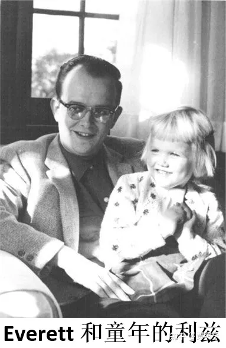
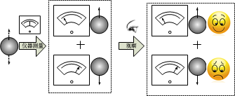
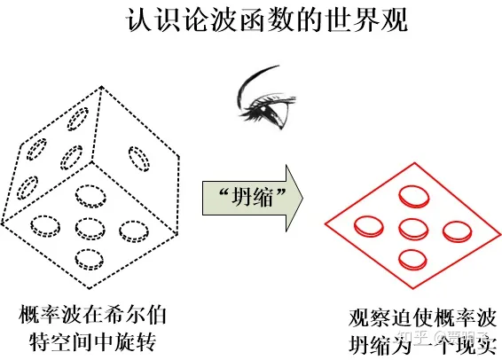
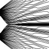
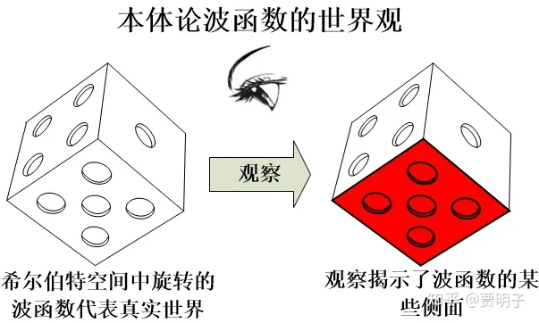
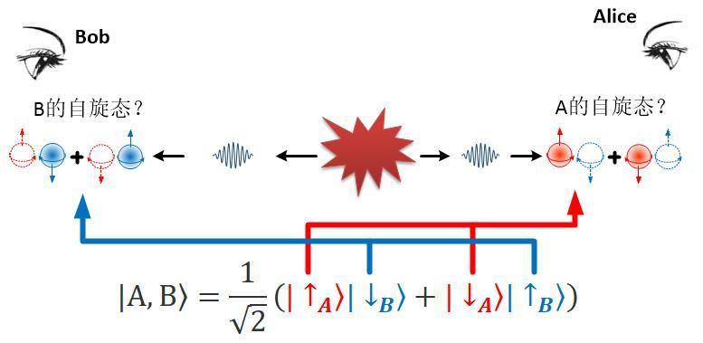
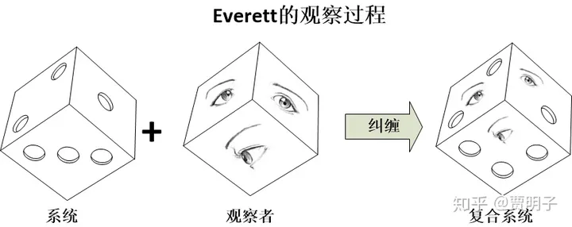

# 24、命运多舛的的多世界理论

> ***“We will first understand how simple the universe is when we recognize how strange it is.”\***
> ***“宇宙有多么简单，就有多么奇怪。”\***
> ***–- John Wheeler\***

***更新notes：删减浓缩一部分内容，主要保留了多世界理论的历史沿革，一些其他内容留待后续章节\***

1996年夏天，39岁的利兹.埃弗雷特（Liz Everett）第二次决定用过量安眠药让自己离开这个世界，这一次，她成功了。她给世界留下的最后的话是：

> ***“我不需要葬礼。请将我火化，并且不要保存我的骨灰。把我洒在一个像样的水面……或者垃圾桶中，这样的话我可能在一个正确的平行宇宙中见到我的爸爸。”\***[[1\]](https://zhuanlan.zhihu.com/p/54551194#ref_1)

这个世界对利兹并不友好，她受困于精神分裂和抑郁，成长轨迹中充满灰暗，父爱缺失、放纵、酗酒、吸毒、强奸、不幸的婚姻、一直靠父母资助维持生计。然而在她的童年，一次夏令营中她给父亲的一封信中这样写道：

> ***“我非常想念您，我想立即就见到您……，您和家里的猫们过得好吗？我有好多次把你们都给忘记了，但您一直是我的男友，猫们也是。”\***

说出这样令人泪目的甜蜜话语的小姑娘该是多么可爱，我很难想象最后竟然会是这种令人伤感的结局。她的父亲，就是**休.埃弗雷特三世（Hugh Everett III）**。他一生最大的成就，就是遗言中提到的平行宇宙。

从Peter Byrne写的传记的描述来看，Everett不像是一个合格的父亲，他极不善于对亲近的人表达爱意。利兹可能一直都在试图得到父亲的关爱而极少能够享受其乐融融的温馨时刻。她的第一次自杀企图发生在24岁，1981年。所幸被弟弟发现并送往医院抢救。事后Everett只是说了一句，“我真没有意识到你竟然这样悲伤。”当时他正因为公司破产、家庭生计难以为继焦头烂额，悲愤无比。然而就过了两个月，在一次突发的心脏病袭击下，Everett离开了人世。按照生前的愿望，他的骨灰被扔进了垃圾桶。这可能就是他妻子所说的，外人所不能理解的“**极大的幽默感**”吧。

利兹和她的弟弟马克，事后都多次寻求心理医生的治疗，来填补从童年期就一直没能被填补的内心的情感缺失。他们的母亲曾经对他们说，父亲对他们并非不闻不问，相反地，他“***以死守护他们的自由不受任何限制\***”。我想，这可能是作为一个妻子对丈夫发自内心的评语，而没有任何粉饰。因为Everett本人就是一个**极其叛逆**的人，因而他身体力行地容忍他的子女的任何行为 – 这使得他的儿子终于成功地成为一个摇滚明星，同时也让女儿走上了一条放纵无节制的死胡同。

Everett本人童年也很不幸，尚在襁褓之中母亲就离开了父亲。经过了马拉松式的诉讼终于得以离婚，他的监护权判给了母亲，但是他却一直生活在父亲的家里。他从小渴望母爱但是却又刻意保持对母亲的冷漠。他在宗教方面无疑是极端的，他是一个坚定的无神论者，但是却进入了一个天主教大学。在大学里他自己搞了一套证明上帝不存在的逻辑，并且使他的一位教授对自己的信仰陷入了绝望。学校只好让他宣誓以后绝不再用这套逻辑对付一个有宗教信仰的人。但是后来他又成功地说服另外一位天主教教授相信，上帝只是一个信仰，而不可证明。这时候他已经是众人眼中的叛逆者了。

大学毕业后，他决定投身理论物理，并且成功进入普林斯顿大学，先是师从魏格纳，研究博弈论。后来在玻尔的一次来访中，他受到启发，离开了博弈论，改投著名物理学家惠勒门下。开始了对量子力学基础问题的研究。这是一个极其艰辛的研究方向，因为首先它本身难度重重，诸多大神诸如爱因斯坦都一筹莫展；其次，当时玻尔领导的哥本哈根大军已经看似一统天下，牢不可破了。Everett当时不知道的是，他的这个选择让他走上了一条辉煌而又极其痛苦的道路。

我们前面提到，波尔领导的哥本哈根学派对量子力学的诠释，以及这个诠释中最令人不满的地方，就是其中的量子-经典的冲突。

[贾明子：18、哥本哈根诠释，成功与缺陷387 赞同 · 22 评论文章](https://zhuanlan.zhihu.com/p/52966255)

哥本哈根诠释把物理世界划分为经典的和量子的两种不同领域，根据玻尔的“互补原理”，经典理论与量子理论互补才能完成对物理事件的描述：观察者是经典事物，他必须遵守经典规律，其中一切都是确定的。而被观察系统则是量子事物，它遵守量子规律，所有状态都是叠加的、不确定的。而观察行为中不可避免的就是观察结果跨越量子-经典边界：不确定的、叠加的状态变成确定的唯一状态，这就是坍缩。

这样一来，物理世界被划分成了两个区域：量子区域和经典区域。同时事件的演化就遵守两个不同的规则：不涉及观察的、按照薛定谔方程的幺正演化，以及观察时按照玻恩规则的概率性突变。

于是，观察就成为量子力学中一个极特殊的事件，因为在这个过程中跨越了量子力学规律的边界：作为经典一侧的事件，观察者不但不受量子理论的影响，而且独立于量子规律。因而，观察就必定是独立于量子规律的假设，而不能被量子力学描述。

我们前面提到，对波函数的诠释包括两派，一派就是认为波函数并不代表真实的物理实在，而是一种帮助我们获得认知的计算工具，这种观点一般被称为**认识论波函数，或** �����������；而另一派则认为波函数描述的是一种真实的物理实在，这种观点一般被称为**本体论波函数，或** ������。

哥本哈根学派所认同的，就是认识论的波函数。在它看来，不观察时量子态才会按照薛定谔方程的规则演化，而不观察的现实不是现实，它只能是我们对现实的一种预期。也就是说波函数只能是认识论的。因而，玻恩的概率波就是对波函数的最好诠释 – 它只是一种云山雾罩的概率。只有在观察时，它才会从概率变为现实：

因而，在哥本哈根学派看来，**现实是观察造就的，而这是一个真正的随机过程，它先天如此，我们除了玻恩规则以外没有任何办法对其做出更详尽的描述。**

按照玻恩诠释，波函数是系统所有的可能状态按照概率规则的某种组合。而薛定谔方程描述，那就是这个系统所有的可能性的概率随着时间的演化。

当我们不观察的时候，所有的这些可能性都同时并存。在这个时候，波函数，不过是一堆概率的组合而已，我们必须认为此时量子态仅仅是所有可能性的叠加。而当我们出观察的时候，这些概率就必须变成某种现实。这时候，系统的所有可能性必须要按照概率选择其一，而剩下的所有可能性，不论它的概率是多少，就同时消失不见了。 “实在”只能在它被观察的时候才能成为“实在”。

Everett首先不满足于这种把观察行为排除在量子力学之外的做法，一个观察行为应该是**受到观察者状态影响、由观察者与被观察系统之间相互作用所决定的。同时观察者本身也应该受到量子规则约束。**这个问题，在宇宙学中协调广义相对与量子力学的过程中尤为重要，也是惠勒一直头疼不已的一个问题，它就成为了Everett的最初动机。具体说，我们如何描述我们整个宇宙？宇宙基于它自身的定义，是不存在一个外部观察者的。那么这个包括了观察者和所有观察行为的宇宙，是不是就不能被量子力学描述了呢？

Everett进一步想，“观察导致波函数坍缩。那么到底什么才定义了一个观察？在薛定谔猫实验中，猫的观察到底有没有同样的功能呢？我们没有办法向猫求证这件事，因为猫没有办法告诉我们它的感受，但是如果是一个人呢？”于是，为了回答这个问题，他把薛定谔猫实验给改动了一下：

比如说，还是在薛定谔猫的实验中，为了便于对猫的监控，我们把一个朋友和猫一起关进盒子。当然，为了这个可怜的朋友免于被毒死的厄运，我们可以给他一副防毒面具。我们的朋友向我们保证，他绝不是一个动物保护主义者，在全部的实验过程中，他只在那儿静静地观察，不论猫死还是或，他都会保持冷眼旁观，而不会采取任何对实验的干涉行为。然后，实验开始了。一小时之后，我们知道，盒子里的猫有50%的概率被毒死，50%的概率仍然活着。那么这时候我们发出与薛定谔同样的疑问：在我们打开盒子之前，猫是死的还是活的？

这个答案与原版的薛定谔猫实验有何不同？我们可以看到，唯一的不同就是，盒子里多了一个旁观者，见证了盒子内部的全部过程。然而这个观察者向我们承诺了他不会干涉任何实验进程，那么对我们而言，实验结果不会有任何区别。那么，本着哥本哈根精神，我们会认为，猫仍然是处于死和活的叠加态，既死又活。但是我们的朋友呢？必然就会处于“看到猫死”和“看到猫活”的精神分裂的叠加态。这就更加不可思议了！对我们的朋友而言，他早就观察到了猫的确定的死活，因而在我们的朋友看来，早在我们认为坍缩发生之前，猫就已经被坍缩为或死或活的确定态了。我们可以向我们的朋友询问加以求证 – 当然，我们的朋友不会突然地变成了精神分裂的发疯状态，他会告诉我们，他看到的一切确定无疑。那么问题就来了，我们的朋友和我们的理论预言就明显冲突了，到底是谁对谁错？

前面章节提到，这就是“魏格纳的朋友”思想实验的最早版本，这个思想实验把哥本哈根学派的矛盾暴露出来 – 当然，看名字我们就知道，这个实验后来归功于魏格纳了。

[贾明子：19、波函数坍缩是意识引起的吗？世界是真实的吗？615 赞同 · 100 评论文章](https://zhuanlan.zhihu.com/p/53193425)

因而，Everett就有了自己的断言：别去瞎扯什么量子力学之外的观察者了，Enough is enough！我们必须假设整个宇宙的状态可以被一个超大的波函数描述，它按照薛定谔方程演化，并且这个宇宙的存在不依赖于任何外部观察者。观察者不但可以被量子力学描述，而且是量子力学中最关键的部分。观察就是一个物理过程，而不是某种独立于物理之外的神秘过程。Everett在给玻尔的助理Petersen的信件中，毫不掩饰地宣告了他的核心动机：

> ***“I believe that basing quantum mechanics upon classical physics was a necessary provisional step, but that the time has come … to treat [quantum mechanics] in its own right as a fundamental theory without any dependence on classical physics, and to derive classical physics from it …. We should no longer regard quantum mechanics as a mere appendage to classical physics tacked on to cover annoying discrepancies in the behavior of microscopic systems.”（我相信，把量子力学建立在经典力学基础上是一个必要的权宜之计，但是现在已经是时候了……我们应该给量子力学正名，应该把它看做独立于经典物理的基本定律，并且由它推出经典物理了。……我们不应该仅仅为了解释宏观现象的不同而把它看做经典物理的附庸。）\***

因而Everett拒绝量子经典对立，拒绝独立的观察者。那么波函数所描述的，就绝不仅仅是一堆说不清道不明的概率或外部观察者的预期，它只能代表宇宙的真实状态。按照薛定谔方程演化的，并不仅仅是概率云，而是宇宙的真实状态。根本就不必扯什么互补原理，这个世界只有一套普适规则，就是量子力学，不存在所谓的量子-经典边界。整个宇宙就是一个巨大的波函数，它只按照薛定谔方程演化。哥本哈根学派的其余一切关于观察的假设，都是画蛇添足之举。

那么，既然波函数只能看做是对真实状态的描述，那么，它的每个叠加态必须是一个真实的宇宙状态。进而，由波函数演化描述的宇宙状态的演化，就是所有这些叠加态的平行演化。多世界理论，显然认同的是本体论波函数观点。

这就是Everett对这个问题的简单到不可思议的方案，它把测量的特殊性简单粗暴地去除了。– 没错，不存在坍缩，作为希尔伯特空间中的一个矢量的波函数，永远按照幺正演化的规则旋转着。下面两个观点，可以说是多世界理论的台柱子：

1. **世界是真实的，它可以完整地被波函数描述，包括观察者本身亦是如此；**
2. **世界只有一种运动规则，就是量子力学，不存在量子和经典两套规则。**

这两个简单的假设，却衍生出极其复杂的结果。如果说波函数描述的就是真实的世界，而不是人们对世界的认知，那么我们被迫要承认，真实的世界也是由各种真实的状态叠加而成的。抛弃了让这些真实状态消失的“坍缩”过程，那么它们就必须永远存在，共同构成了波函数的立体现实。

当然这就不可避免地得到了另外一个奇怪的结果。按照哥本哈根诠释，按照玻恩诠释，波函数是系统所有的可能状态按照概率规则的某种组合。而薛定谔方程描述，那就是这个系统所有的可能性的概率随着时间的演化。波函数只代表概率，所以他的叠加、干涉，不论多么反常，多么不符合经典概率论，总还是相对比较容易接受的。然而如果说波函数代表真实状态，那么，多个真实状态叠加就意味着，我们的世界是多重的。我们这个世界和无数个平行的拷贝共同存在，互不相干却同等真实。

Everett把自己的想法称作“**普适波函数（universal wavefunction）**理论”，意即世间一切都可以被一个巨大的普适波函数描述。

作为希尔伯特空间中的矢量，波函数的叠加从数学上讲毫无奇怪之处，甚至说，作为一个矢量，它不得不如此：例如我们从来不会觉得我们同时向东走和向北走是一件奇怪的事情。所奇怪的是，希尔伯特空间并非我们看到的几何空间，而是一种状态空间。在这里面的叠加，就意味着同一个事件的各种不同版本的叠加。

- 一个速度矢量是它在“向北”的投影和“向东”的投影上叠加而成的立体结构；
- 一只猫是猫态在“死态”和“活态”上的投影叠加起来的希尔伯特空间中的立体结构。

在数学上这两者可以形成和谐的类比，但是从物理解释上，多重现实叠加起来得到一个完整量子态，就绝对违反直觉。对猫而言，要么只有“死态”，要么只有“活态”。在我们的日常经验中，“死”和“活”是**互斥**的，绝不会和谐并存。但是既然多世界理论认为，波函数描述了真实状态，那么它的每一个叠加态都是真实的，是平行共存的。

既然多重现实并存，我们为何总是不能同时看到它们？我们观察到的，只有一个经典世界。为何我们不会同时看到猫的死和活？多世界如何使理论预言和我们的经验相一致起来？Everett的答案就是：因为**我们在观察猫的同时，自己就已经和猫的死态和活态纠缠在一起了**。

多世界理论非常明确地赋予观察一个物理意义：观察只不过是观察者和被观察系统之间的某种**相互作用**，它可以、也必须**由量子理论本身来描述**。并且同时，观察者本人也不过是某种物理实体，从物理上，观察者和一台观测仪器的观察行为并没有任何区别，他们的观察行为和信息的接收也是由量子理论来描述的。而我们前面已经提到了量子系统的一个非常独特而且普遍的现象就是，**观察导致纠缠，纠缠导致独立性的丧失**。

[贾明子：21、量子力学的“终极特性”165 赞同 · 42 评论文章](https://zhuanlan.zhihu.com/p/53348823)

我们仍以薛定谔猫为例。那么对于任意一种猫的初态（死+活），以及观察者的初态（尚未观察），在一开始两者相互独立，因而猫和观察者的复合态就是：

**{死+活；尚未观察}**

这时候我们打开箱子进行观察，猫和我们就发生了相互作用，这种相互作用就导致纠缠。我们知道，对于死猫状态我们会看到猫死，对于活猫状态我们会看到猫活，那么量子力学的线性演化规则就必然导致，在观察后，整个复合态就是这样的：

**{（猫死，看到猫死）+（猫活，看到猫活）}**

如前所述，当观察者完成了对猫的观察之后，观察者和猫之间就形成了量子纠缠。完成观察后，猫的每个状态（“死”和“活”）、观察者的每一个可能状态（“看到猫死” 和“ 看到猫活”）都不再独立。

纠缠态的最大不同，就是我们没有任何办法把这个状态分解为单独的观察者的状态和单独的猫的状态。也就是说，我们如果笼统地问：猫是死的还是活的？这个问题就变得毫无意义了。因为猫已经不是一个独立存在了，它和观察者纠缠在一起了。此时我们对猫的状态的描述必须建立在观察者某个状态的前提下，反之亦然。也就是说，猫的状态是相对于观察者状态存在的，而观察者的状态也是相对于猫的状态而存在的。Everret把这个叫做“**相对态**”（**relative state**）：系统的每个叠加态仍然存在，但是它们是相对于观察者存在的，反之亦然。

因此，在观察的时候，观察者的一个状态（看到猫死）就会和猫的一个状态（死）关联起来，而他的另一个状态（看到猫活）和猫的另一个状态（活）关联起来。这是由薛定谔方程的线性演化导致的必然结果。这样一来观察者并不是以**一个**独立的观察者而分别观察猫的“死态”或“活态”，而是以一个多态叠加的形式，分别与猫的各个状态纠缠。

当观察者问自己，“猫是死的还是活的？”我们只能这么回答：相对于我们看到猫死的状态，猫是死的；相对于我们看到猫活的状态，猫是活的。而你非要想问，猫**自己**本身到底是死的还是活的？对不起，猫**自己**是什么？只有一个和整个宇宙纠缠在一起的波函数，没有独立的猫自己存在。当我们在用“猫自己”这种词语的时候，我们指的就不会是纯的量子态，而是量子态相对于观察者的的一个分支（**branch**）。

现在，不论是观察者还是猫，都不可能完全与外界环境隔绝，他们都浸泡在大气当中，在引力场中，并且在宇宙的背景辐射中游泳。并且，量子纠缠与经典的相互作用完全不同，它是长程的，相互作用的两个物体可以跨越时空相互关联，并且保持这种关联。那么很迅速地，系统就会和外界环境纠缠起来，而环境又会和环境之外的环境纠缠起来，把系统与外界的纠缠不断扩大。最终，系统与整个宇宙浑然一体而不可分割。

**{（猫死+猫活；尚未观察；宇宙）}→{（猫死/看到猫死）+（猫活/看到猫活）；宇宙）}→{（猫死/看到猫死/宇宙1）+（猫活/看到猫活/宇宙2）}**

这样一来，整个宇宙的叠加态们都会不可避免地与观察者的状态纠缠在一起。宇宙态1与死猫和看到死猫的记忆在一起，宇宙态2和活猫以及看到活猫的记忆在一起。它们就构成了宇宙波函数的两个分支。

从数学上讲，每一个分支，就是宇宙波函数在极高维度的希尔伯特空间中的一个侧面。我们用一种形象的方式，分别定义这些侧面“世界1”和“世界2”。那么，由于观察者与外界的相互作用，整个宇宙的叠加态就分成了两组：世界1和世界2。所有的这些侧面在一起，就构成了量子态的整体的立体结构。这个“立体的”波函数浑然一体，不分你我。但是从**身处其中的经典的“我们”眼中看来，它的经典分支在看似分裂了。**

这种想法无论从何种角度看，都是非常叛逆的。与其他博士生的工作不同，他的工作基本上出自自己的独立想法，而不是由惠勒提出而只是做出具体工作。不论是Everett还是惠勒，都十分清楚这个新理论所带来的非同凡响的革命，以及它将要给“正统”理论带来的冒犯。Everett对此毫不掩饰，他在他的毕业论文中说：

> ***“因为（正统理论）的极度保守，它可能过于小心翼翼了。我们坚信，理论物理的核心目的绝不是要建立一个“安全的”理论，为此不惜牺牲概念的适用性，相反，它应该建立一段时间内可用的模型，并将在它变的陈旧时被新理论替换掉。”\***

相对地，惠勒要更加保守。1955年，Everett把他的博士论文提交给惠勒，惠勒当时正在头痛于广义相对论与量子力学之间的难以融合，Everett的理论却令他眼前一亮，他立即意识到这是一个解决这种冲突的方向。惠勒断定这将是一个非同一般的理论，但是他还是对其中的一些表述方式做了调整，删除了一些类比的表述手法，使之变得更加严谨 – 当然也就不那么多彩了。然后，这篇论文的题目被改做“**无概率量子力学**”。而在期间这个理论又多次被冠以“**相对态理论**”的称谓。

当时爱因斯坦已经去世，物理学的泰斗就是玻尔，而惠勒本人就是玻尔的崇拜者，他虽然对Everett的想法极其欣赏，但是，这个想法如此新颖和叛逆，让惠勒感到一些拿不准，于是他想听一下玻尔的看法，希望得到他的支持，或者退一步说，得到他的建议。

于是Everett的论文此时面临着和当初德布罗意的毕业论文同样的境遇。想当初，爱神寥寥数语的赞誉，肯定了德布罗意初生的新理论，并开启了量子物理的新时代。郎之万当初咨询了爱因斯坦，现在惠勒要去咨询玻尔，而玻尔会对Everett说些什么呢？

结果可想而知。

Everett没有德布罗意那样幸运，他的这个同样叛逆、同样影响深远的理论并没有遇到爱因斯坦这样的伯乐。惠勒可能还是高估了哥本哈根圈子的开放性，低估了玻尔对自己既有看法的坚定性，也低估了玻尔的个人魅力对整个圈子的影响。这个新想法直接冲击力玻尔理论的最核心的基础，怎么可能会获得认可呢？彼时的哥本哈根学派，已经是拳打爱因斯坦，脚踢薛定谔的江湖第一大门派，与自己诞生时的那种叛逆一切、颠覆一切的心境完全不同。哥本哈根的学者们可能压根儿就不想打破自己的既定思维模式而考虑一下这个新理论成立的些微可能性。总而言之，惠勒利用访问哥本哈根的机会，在这里把Everett的论文展示给玻尔和他的同事，结果令人沮丧：新理论完全被拒绝了。但是惠勒本人对这个理论相对持正面意见，根据讨论内容，他安排Everett对自己的论文进行大调整，删减很多针对哥本哈根诠释的直接批评，重新组织语言进行描述，把一些看上去比较反常识的描述删去，而更多地只保留理论的数学表述。惠勒建议Everett本人亲自前往哥本哈根与玻尔进行面对面沟通，他和玻尔两人愿意承担所有费用。

Everett又能如何呢？为了得到博士学位，他只能对最初的论文进行一番修改，原来的长论文几乎被砍掉3/4，变成了一篇较短的版本。令人惋惜的是，论文的一整个章节，关于量子信息的讨论，被完全砍掉了 – 这可能是历史上最早的对量子信息进行研究的先驱性工作。这个短论文就成为他的博士论文，使他得以在1956年获得博士学位。这篇论文后来投稿到《现代物理评论》中，惠勒在投稿信中对之盛赞，论文顺利发表。

然而发表的版本中，他的原本思想被大量删减了。我们并不确切知道这会让Everett产生何种感受。但在Everett去世之后，人们从他的遗物中发现了很多并未发表的笔记，反映出他对哥本哈根学派的愤怒之情。

这其中包括了很多来哥本哈根写给Everett和惠勒的信件中对新理论的批评。从这些批评中，Everett发现他和哥本哈根学者们简直就是两个星球的物种，根本无法对话。在Peter Byrne写的Everett传记中，摘录了这些记录和信件的片段，从中我们可以看到一些哥本哈根学派对曾新理论的批评。在读这些批评的时候，我当时心里感慨的是，所谓**叛逆假以时日就成为权威**，诚不我欺也！

Everett的研究动机是针对哥本哈根诠释中的问题，他抛弃外部观察者，抛弃量子经典边界，不论是这种思路正确与否，总归是一种解决方法。然而，来自哥本哈根学派的很大一部分批评竟然是：哥本哈根诠释不存在所谓的问题；坍缩与薛定谔方程并不矛盾，它们被共同包含在互补原理之中了；Everett根本就不理解互补原理；以及新理论不应该试图把观察者包含在理论之中。总而言之，这些批评吧哥本哈根诠释放到了一个不可触碰的位置上，并以此批评Everett。然而他的理论本来就是在质疑哥本哈根啊！这样一来，他们就毫无共同语言。很多批评看上去就好像是在说：“**哥本哈根诠释没有问题，所以你错了。**”

例如说，哥本哈根学派批判他说，讨论测量仪器的波函数根本就是无稽之谈，测量仪器根本就是经典仪器，怎么能用量子理论描述呢？在这样的评论旁边，我们看到Everett的笔记中用铅笔写道“胡说八道！”

还有评论说，Everett对量子力学的基本原理根本就没有理解，谈论一个包括在观察行为当中的观察者毫无意义。Everett在笔记中写道“放屁！”

还有的批评说，Everett没有意识到概率性是量子力学的基本特征，他的理论抛弃了概率性诠释，但是又不能给出能够描述观察结果的理论。Everett写道“很显然你就没有看过我的论文！！！”

如此等等。我们可以想见当时他的愤懑。我们不知道Everett后来所患的抑郁症是否源于此（毕竟他的母亲和女儿都有抑郁症，可能有家族史），以及后来他的家庭悲剧是否与之相关，但是这种外因肯定会有推波助澜的作用。这也就成了Everett悲剧的起始。

虽然，Everett答应惠勒要在接下来几个月内亲自面见玻尔来解释他的理论，但是显然他早已经对此彻底失望了。直到两年之后，当他看到前苏联科学家Fock写的自己在哥本哈根大学的访问经历，他才重新燃起了希望 – Fock在文中盛赞哥本哈根开放的学术思想。他觉得，可能哥本哈根毕竟还是能够容得下他这种异端的。于是他终于决定去试一试。他举家安排了欧洲的旅行，其中有两周时间呆在哥本哈根。然而会面并不成功，用他自己的话说，

> ***“这个决定从一开始就是个灾难。”\***

他充满期望的会面只用了一天时间就草草结束。在哥本哈根的剩余时间内，它呆在旅馆的酒吧内不停喝酒。但是也就是在这个期间，另一个灵感击中了他，他发现了一种全新的优化理论 – 广义拉格朗日乘子算法。

> ***“While drinking beer yesterday several ideas came about our maximization problem.”（昨天，在喝啤酒的时候，我突然对我们的优化问题产生了几个好点子）\***

然后，他彻底投身美国五角大楼的工作，用他在博弈论、优化理论、计算机算法等方面的造诣，成为武器系统专家。后来，在整个冷战时期，评估美国的核武器系统，古巴导弹危机、核恐怖平衡等等，背后都有他的影子。他成为美国国防部中有着最高机密权限的有限人物之一。用一位美国上将的话说，

> ***“他的价值等价于与他体重等量的白金\***[[2\]](https://zhuanlan.zhihu.com/p/54551194#ref_2)***”\***

后来，他与人合伙，成立了多家公司，为五角大楼服务，还同时涉足金融行业，他成为百万富翁。在此期间他经历了冷战时间所有的紧张局势，对一触即发的核大战的恐惧比一般人体验更加深刻。冷战结束后，他又因为军费削减而面临破产边缘。期间他嗜烟、酗酒，生活毫无节制，然后在毫无征兆的时候突然逝去。他在家里如冰山一般沉默寡言，对自己最亲近的人毫无温暖，导致了自己的家庭悲剧。

总而言之，在哥本哈根的经历促使Everett就此决定彻底离开理论物理这个伤心地。对此惠勒深感惋惜，在今后的几十年中他多次努力，试图将自己的学生拉回来，最后甚至建议以他的名字建立一个独立的实验室，然而这个建议最终未能成行。

我觉得，在这件事上惠勒本人也犯了一个严重误判的错误。他并没有预料到哥本哈根圈子对Everett的理论如此不屑一顾。在那段时间里，他周旋于哥本哈根之间，力图使自己学生的理论能够被后者接受，但是却毫无进展。对于新理论，惠勒所预期的由此引发的理论物理学界的争论并没有发生，相反地，在长达十年的时间里，Everett的论文仅仅被引用了两次。这个叛逆的新理论就此蛰伏下来，成为后来人们口中的“**被保持最严密的世纪秘密。（one of the best kept secrets in this century.**[[3\]](https://zhuanlan.zhihu.com/p/54551194#ref_3)**）**”

后来，在1959年Xavier的“量子力学基础”大会上，Rosen（就是EPR佯谬中的那个“R”）看到Everett的论文有感而发：

> ***“有时候，我对一些量子力学学者们的态度感到厌烦，他们总是在讨论问题的时候恪守某种教条。有句名言，叫做昨天的革命派就是今天的保守派。某些人甚至拒绝考虑在正统诠释之外还有其它的可能性”\***

但是这些声音并没有引起人们的注意。直到十多年后，当时已经功成名就的物理学家DeWitt[[4\]](https://zhuanlan.zhihu.com/p/54551194#ref_4)重新审视Everett的理论。他首先在会议上推介这个理论，并且用自己的语言重新加以表述。他放弃了相对艰涩的“**普适波函数**”和“**相对态**”，而采用了更加有戏剧化的语言“世界”。这个理论于是首次获得了闻名于世的“**多世界理论**”的称谓。在DeWitt的描述中，我们每做一次观察，都会导致我们所处的世界的一次“**分裂**”，每个观察结果都存在于所分裂产生的每一个世界当中。惠勒指导下Everett所小心翼翼避免的过于惊世骇俗的描述，就这样DeWitt直接粗暴地提出了。在1970年，DeWitt发表了对这个理论普及的关键性文章，**《量子力学与实在》（Quantum mechanics and reality），**他在文中提到了过世的爱因斯坦，他说，

> ***“Yet it is a completely causal view, which even Einstein might have accepted.”（这是一个完全因果论的观点，爱因斯坦也会支持的。）\***
> ***“……surprised and pleased at Everett’s conception … for it is the only conception that appears capable of unifying general relativity in a profound way with the quantum theory,…… It is the only conception that, within the framework of the presently accepted formalism, permits quantum theory to play a role at the very foundation of cosmology”（爱因斯坦）会对多世界理论感到惊奇但是同时很高兴，……因为这是唯一的一个可能与广义相对论相容的量子力学理论，……它是在现有已经建立的理论框架中唯一一个可以是量子力学在宇宙学中得到应用的概念。\***

也许是因为DeWitt本人的声望，也许是由于他的言辞尖锐，这篇文章引起了巨大关注。有很多愤怒的读者对这种“打扰爱因斯坦英灵”的做法深感不满，纷纷对文章进行批评。然而，公开的批判总比完全沉寂要好得多。DeWitt对这些批评一一回复，拉开了他作为多世界斗士的序幕。他列举了500多篇关于量子力学基础的文献，并由此指出，其中多数是在对哥本哈根诠释进行批判的 – 这个诠释并没有什么优势，他不客气地说，我们不应该再在这个已经“入土半截的‘解决方案’”（half forgotten “solution”）浪费时间了。

得益于DeWitt，Everett终于可以在一个小圈子里小有名气了。在1973年，DeWitt组织了一系列论文做成合集，称作《量子力学的多世界理论》发表。其中他辗转通过惠勒联系到Everett，获得了他最初的长版的论文，发表在这个合集中。这是20年后，Everett的初始工作的首次得以面世。

然而此时惠勒开始与多世界理论保持距离了。惠勒作为玻尔的狂热粉丝，他自己对多世界理论的态度也多次摇摆，在理论的沉寂时期先是尽量宣传，然而当理论重新回到人们的视线并大获关注时，却与之划清界限，并有些倾向于冯诺依曼-魏格纳的诠释，这让魏格纳很高兴并宣称惠勒本人放弃了多世界理论。但是，在随后的时间里，各种场合下，惠勒又把这个理论放到极高的历史地位。甚至一次大会上，他把Everett与薛定谔、狄拉克这样的大神级人物并称。

在2001年，量子力学的100周年纪念时，惠勒已经是一个物理学中活着的神，他与Tegmark共同署名发表了《百年量子力学（100 years of quantum mechanics）》，其中对Everett，自己这个优秀但是悲剧的学生的盖棺定论：

> ***“Everett’s idea that physics is unitary (that there is no wave function collapse) is now …… replacing the collapse interpretation as the dominant paradigm.”（Everett关于物理学是纯幺正的（也就是说不存在波函数坍缩）的说法，现在已经……正在取代坍缩诠释成为物理学压倒性的范式。）\***

我想，多世界理论在一开始被人忽略，也有很大程度上是因为在当时它自己的一些理论困难。受限于历史局限，它对一些关键问题描述并不甚清楚。例如前面提到的偏好基问题。然而多世界理论提出的，不附加坍缩假设的、纯幺正的量子力学为物理学开启了一扇大门。正是由于受到多世界理论的启发，才开始有了退相干理论的发展。退相干理论秉承了“没有量子-经典边界”的理念，从更加详尽的角度上论证了从量子是如何过渡到经典的，但是说到底，它是依赖于多世界理论作为底层支撑的 – 当然，就像前面所说，它本身是一个纯物理理论，因而并不必然需要依赖于多世界，事实上它可以应用于各种诠释之中，成为它们的补充。但是无疑它是与多世界理论最为珠联璧合的。我们在下一章将看到退相干理论是如何解答多世界理论的一些关键问题的。

退相干理论兴起于1970年代，也是经过了早期十几年的蓄力之后，在1990年代开始快速发展。退相干理论的兴起，极大的解决了多世界理论的诸多障碍，两者相互推进，现在在量子力学基础领域大有成为下一个“正统”的趋势。

很可惜，Everett本人已经看不到了。

在多世界理论提出、遭到压制、然后重新抬头并艰难前行的这段时间里，始作俑者本人Everett，却几乎终身在量子力学领域再也没有露面，只除了两次会议报告，一次是包括狄拉克等大佬的会议中，大家突然临时感到需要他来，而打电话请他做一个报告，另一次则是他的老师惠勒为他安排的一次公开学术报告。在1981年去世之后，他的家人甚至是在杂志的介绍中才知道，自己的父亲曾经提出过这样石破天惊的物理理论。

在多世界理论重现江湖后，物理学家Leblond曾感到有一些问题从他论文中无法澄清，于是在1976年写信问他，他愤而回复：

> ***“我从1955年完成我的论文起就不再这个领域干任何事了（这篇论文的全貌直到1973年才得以面世，被冠以“多世界诠释”云云）。这当然不是我的本来题目，因为我当时愿意让任何人以任何方式随便对我的论文做任何事情，使之得以发表！我自己，已经从1956年起就金盆洗手了。”\***

所谓的“金盆洗手”，应该是他的一时激愤之语。在他去世之后，人们在他的遗物中，发现他美国物理学会的注册单，其中要他填的5项个人专长中，他填道，“控制理论”、“运筹学”、“相对论”、“博弈论”，而排在第一位的，是：

**“量子力学”**

愿在另一个平行世界中，他成为成功的理论物理学家，与女儿 live happily ever after。

**下一章：[贾明子：25、多世界并不奇怪](https://zhuanlan.zhihu.com/p/54938678)**

**上一章：[贾明子：23、跨越经典-量子鸿沟：经典世界为何是“经典”的？](https://zhuanlan.zhihu.com/p/54202504)**

**专栏传送门：[何为现实？拉普拉斯之妖与薛定谔猫之决战](https://zhuanlan.zhihu.com/c_186387023)**

------

## 参考

1. [^](https://zhuanlan.zhihu.com/p/54551194#ref_1_0)出自传记《休.埃弗雷特的众多世界》，下面的那段引用也是出自此书。
2. [^](https://zhuanlan.zhihu.com/p/54551194#ref_2_0)Everett是一个胖子
3. [^](https://zhuanlan.zhihu.com/p/54551194#ref_3_0)Jammer，1974
4. [^](https://zhuanlan.zhihu.com/p/54551194#ref_4_0)他从一开始就知道Everett的工作，并且展现出了很大兴趣。他对Everett提出很多批评，但是与来自哥本哈根学派的批判不同，这些批评是相对建设性的。

编辑于 2023-01-03 12:48・IP 属地未知

