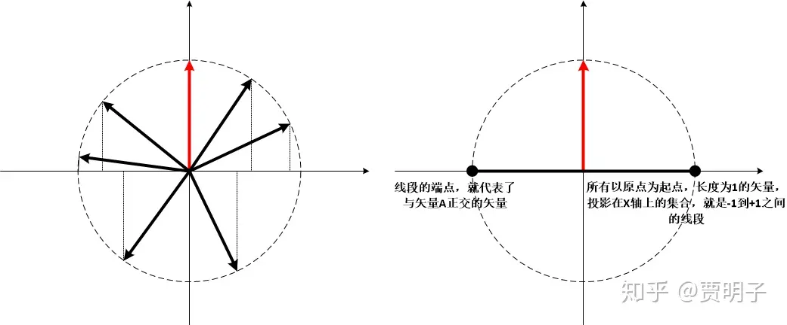

# 25、多世界并不奇怪

> ***“I regard [the many worlds interpretation] as self-evidently correct.”\***
> ***“我认为（多世界理论）的正确性是不言而喻的。”\***
> ***–-霍金\***

多世界理论自诞生起被忽略，直至今日，成了一个集诸多毁誉于一身的理论。一方面，很多人（早期的玻尔、海森堡、以及后来的贝尔等其它大佬们）觉得这个理论极尽扯淡之能事，疯狂、荒谬、复杂无比、无法验证，完全不配成为一个科学理论，不值一哂；而另一方面，还有一批人（著名的包括：理论物理学家John Wheeler、DeWitt、费曼、Greene、Vaidman，宇宙学家霍金[[1\]](https://zhuanlan.zhihu.com/p/54938678#ref_1)、Sean Carroll、Tagmark、及退相干理论的发起者Zeh、Zurek、量子计算的大神Deutsch，量子哲学的David Wallace等人，还有很多人认为也支持它。），他们则认为这个理论极其简洁，是量子理论最自然最直接的结论，其揭示的深刻思想完全不亚于哥白尼当初在天文学中的革命。

总而言之，现在大家对它的态度仍然两极分化。但是总的看来，在新生代的物理学家中，它的支持者在逐渐增多。好像是费曼曾经说过，一个新理论被大家接受的过程，不过是旧一代科学家的逝去，新一代科学家诞生的过程。我不知道这个说法是不是适用于多世界理论。

对多世界理论的支持有多热情，对它的批评就有多尖锐。但是这些批评中泥沙俱下，在真正有意义的严肃评论中夹杂着各种傻乎乎的误解。在这一章我们可以先澄清一下这些误解是什么 – 你将会看到，多世界理论其实是最简单的一种量子力学理论，甚至说是一种没有诠释的诠释；然后，我们再看看多世界理论真正的困难在哪儿。

我们先来看看那些**通俗化**的、甚至**科幻化**的、广大吃瓜群众所理解的多世界理论是怎样的。

我们仍然以那只倒霉的薛定谔猫为例。我们已经知道，按照“正统”的量子理论，这只猫在我们没有观察的时候，处于一种无法描述的“死”和“活”的叠加态。只有在我们对它进行观察的那一刻，它的状态才会突然“坍缩”，变成“死”或者“活”其中之一：我们的一个观察行为，造就了这只猫的“真实”状态。这而按照多世界理论的说法，根本就不存在“坍缩”一说，猫的“死”和“活”两种状态一直就和谐地并存着 – 并存于两个平行的世界中，与我们的观察无关：观察在其中并没有起到任何“造就现实”的作用。但是，在我们进行观察的那一刻，整个世界“分裂”了，它“分裂”成为两个分支：一个世界里面，猫死了，我们观察到猫死了，而倍感忧伤；而在另一个世界里，猫仍然活蹦乱跳，我们感到无比欣慰。死猫和活猫，忧伤的我们和欣慰的我们，都同时存在与两个分裂的世界中，并且这两个世界同等“真实”，并没有哪一个世界比另一个更加“实在”。

更加神奇的是，这两个平行的世界互相之间毫无干涉，我们没有任何办法去获知那个与我们“平行”的那个世界的任何信息 – 对于我们而言，它就和根本不存在一样！虽然另一个世界中有一个和我一模一样、有着我的全部记忆和思想的我，但是我并没有任何办法感知那“另一个我”的存在。包括那个不可理喻的“分裂”，也是在我们毫不知觉的情况下悄悄发生的。因此我们根本就意识不到，当我们观察这只猫的时候，我们正在进行着一次“分裂”。

而这种分裂，发生在我们的每一次对外界的观察中：每一次观察，所有可能的观察结果都会发生—发生在互不相干的平行宇宙当中。考虑到我们无时无刻不在对外界进行观察，于是宇宙无时无刻不在分裂。所有**可能发生**的事件全部都发生了，只不过因为每个可能都发生在不同的世界中，我们只能看到诸多可能性的其中之一。

既然我们的世界无时无刻不在“分裂”，那么它所产生的世界的总数必然是一个天文数字。那么，又有多少个平行的“我”呢？当然“我”的个数不会是这么大，因为在很多这些世界中，“我”已经死了，而在更多的世界中，“我”压根儿就没有出生过，或者是人类就压根儿没有存在过。但是仍然，“我”的个数也是一个令人炫目的数字。想象一下，这么多个“我”平行存在，却又互相不认识，也不知道对方的存在。有些“我”现在是人生赢家，百万富翁，甚至是国王或皇帝，而另外一些“我”则贫困交加，是一个彻头彻尾的loser。

哦……，你觉得，这种说法，比起“观察造就现实”如果？比起“意识造就现实”又如何？

更加荒谬？无稽之谈？我猜你可能会在脑袋中蹦出这几个词语。为何那么多的大科学家会整这么一出，仅仅是为了一个波函数坍缩的问题，就搞出来这么一大堆的“世界”？我们又如何解释这些世界、这些“我”、互不相干但是又同时并存？难道这些问题，比起一个波函数坍缩来说，不是更麻烦吗？

多世界、或者由它衍生的平行宇宙，在科学界的话题热度还远远不及在科幻界。因为它真的非常符合科学幻想的特征：脑洞大开，极具颠覆性。我想，这也是很多科学家们难以接受的原因之一。但是，那么多天才的科学家并不是吃饱了撑的，无聊透顶后想改行当科幻小说家。多世界理论，并非像看上去那么异想天开。很多大众对多世界的“过于荒诞不经”的观念，实际上忽略了严谨的逻辑和数学过程，而把一些比喻的说法过于当真了。这可能得归咎于DeWitt的激进措辞，是的，这些比喻性的措辞（例如“世界”）确实有助于帮助理解多世界理论的大致思想，但是它是双刃剑，在普及了严谨的理论的同时，让它在大众、甚至很多不明真相的专业人士眼中，变成为一种**奇幻的、而不是科学的理论**。（DeWitt的描述参见上章）

[贾明子：24、命运多舛的的多世界理论224 赞同 · 19 评论文章](https://zhuanlan.zhihu.com/p/54551194)

于是乎，基于人们对多世界理论这种严谨的科学理论的奇幻认知，在吃瓜群众、乃至于很多专业人士当中，存在着大量的对多世界理论的误解。这些误解导致了很多对多世界理论不公平的抵触和批判。显然这些批评都源自对多世界理论的不了解。Tegmark曾经抱怨说：

> ***“每个人都会站出来对多世界理论指手画脚，但是极少人真的读过Everett的论文。”\***[[2\]](https://zhuanlan.zhihu.com/p/54938678#ref_2)

这些，就是前面我说的，对多世界理论傻乎乎的指责，真正了解过这个理论之后，它们其实都不值一提。这些指责包括包括：

1. **多世界理论太“玄”（absurd）啦！**
2. **多世界理论不能提出独立于“正统”理论的可实证理论预言，不具备可证伪性，因而不是一个物理理论，顶多算是形而上学。**
3. **多世界理论提出了“多个互不相干的世界”，用这样冗余的前提来解决测量问题，理论代价太大。**

**这些指责，其实不值一驳。**

但是，可能是出于历史原因，也可能是出于DeWitt的戏剧化语言导致了误解，上述指责却在圈子内外造成了很大的影响。以至于很多圈内人都想当然地在这些批评中随大流。我现在对上面的批评来一一作出澄清。

我们先来看第一个问题，**多世界理论真的“太玄”了吗？**

首先，我们先不谈论多世界理论玄不玄，而是要明确一件事情：对于物理理论而言，它的判据绝不是看它玄不玄。所谓的“玄”，其实指的是违反常识，但是物理理论的目标从来就不是为了符合常识，而是为了对自然的运行做出符合实证的判断。在物理史上，人们曾经认为自由落体定律违反常识，人们曾经认为大气压违反常识，人们曾经认为生物进化违反常识，人们曾经认为光速不变违反常识……。这样的例子不要太多，但是它们从来就不是物理学家考虑的事情。而量子力学，则是所有那些玄之又玄的理论中最“玄”的那一个。费曼说：

> ***“I hope you can accept the nature as she is – absurd。”（我希望你能够对自然的本来面目以习为常 – 它很玄。）\***

说道玄，量子力学的每一个诠释都很玄。哥本哈根中的神秘的观察过程玄不玄？魏格纳的意识坍缩玄不玄？和他们相比，多世界理论至少诸多看起来很疯狂的说法之一，如此而已。这是有原因的：因为**我们观察到的自然界本来如此**。

哥本哈根诠释认为，量子态不是系统的物理性质，而是一种认识论的工具 – 用于预测系统的观察结果。现实只有被观察才能被称之为现实，在这个过程中，“观察”被赋予了一个极为特殊的使命：它造就了我们称之为“现实”的东西。这一点，和经典哲学流派中贝克莱大主教所说的**“存在就是被感知”**不谋而合。更进一步说，**坍缩必然导致意识坍缩。**这一点哥本哈根学派小心翼翼地避免谈及，因而就把坍缩过程变得模糊不清，无比神秘。而冯诺依曼对细节的穷究却打开了这个潘多拉盒子：如果坍缩存在，那么它必然发生于意识介入的那一刻，否则别无解释。这就彻底地把“客观实在”给抛弃了。如果我们再向前一步，对此的进一步细究就必然导致它最终会彻底否定一个现实世界的存在：所谓的叠加态本身毫无意义，只是我们对世界运算的工具而已，是我们对世界的信念的叠加。这必然把它引向**反实在论的极致**。

相比之下，多世界理论只不过是对“客观实在”做出了一个明确的肯定而已：实在是独立于观察存在的、它就是那个普适波函数。**如果我们承认观察的物理属性**[[3\]](https://zhuanlan.zhihu.com/p/54938678#ref_3)**，那么我们就必然要承认多世界这样的结论：**因为幺正演化保证了叠加态永远存在。而作为物理过程的观察也会满足幺正演化，叠加态就不会受到观察的影响，因而也就不会有观察导致的坍缩，所以叠加的现实永远不会消失。

在这里，观察不再是一个神秘的过程，它仅仅就是观察者与被观察系统之间的相互作用而已。观察者本身也是这个物理世界的一部分，观察结果并不单单由系统本身状态决定，而是观察者与被观察系统之间的相互作用决定：两者不可避免地进入纠缠状态，因而观察者永远不能跳出系统以独立的“鸟瞰”视角观察到所有的分支，而只能以“井娃”视角观察到诸多分支之一。这种以鸟瞰视角才能观察到的复杂的多分支现实，正是多世界理论的本体论：**多世界理论其实就是实在论的极致**。不但不玄，而且极其符合我们的哲学直觉。

下图我列举了若干大佬的主要观点，上面的是哥本哈根阵营的，下面是多世界理论阵营的。

在多世界理论中，我们感到最“玄”的地方，无非是世界数目如此之多，而且人们的观察行为竟然会使得世界发生“分裂”。如果说哥本哈根诠释的观察行为是神秘的，那么能分裂世界的观察行为岂不是疯狂的？

这，其实是人们对多世界理论最大的误解。其实，“**多世界**”被称作“**一个整体世界**”更合适（就像是“相对论”应该被叫做“绝对论”更合适一样！），而“分裂”只是一个比喻的说法，这个整体世界**从来就不会真的发生“分裂”。**

从我们上一章的描述就可以看到，在多世界理论中，其实只有一个唯一的“普适波函数”是这个宇宙的底层现实。并且，这个普适波函数是不可分割的，这是量子纠缠的基本性质。在量子角度看，这个普适波函数是确定的、唯一的、并且是维度巨大的。而这种巨量的维度就决定了，它可以在无数个相互正交的方向上- 也就是事件的无数种可能性上 - 的“投影”。它有无数个“侧面”，每个侧面就构成了我们所说的每一个“世界”。

[贾明子：24、命运多舛的的多世界理论224 赞同 · 19 评论文章](https://zhuanlan.zhihu.com/p/54551194)

因而，我们可以用相对严谨一点的语言来说一说什么是“世界”了：**一个“世界”就是普适波函数在一个经典基底上的投影，也被称作一个经典分支（branch）。作为量子事物的我们纠缠在普适波函数中，而在每一个经典侧面中，的作为经典事物的我们可以观察到的所有经典现象的集合，就是“世界”。所有的“世界”共同构成了唯一的量子现实。**

何为“观察”？我们说过，观察就是观察者与系统之间形成纠缠的过程。随着我们的不断观察，我们与环境的纠缠就不断扩大。前面提到过，复合系统的一个特点，就是随着它尺度的变大，它的希尔伯特空间维度以一种指数速度增加。因而，我们所观察到的宏观事物所处的希尔伯特空间的维度也在指数增长，结果就是我们所面对的“分支数”在以指数速度疯狂增加，这就是“世界在不停分裂”的含义：**没有什么真正的、物理的分裂在发生，有的只是我们不断与外界发生相互作用，导致我们与环境的整体系统不断扩大，维度不断增长而已。**

因此，在抛开了DeWitt的“多世界”语言后，我们可以看到多世界理论的真实原貌：所谓的多世界，其实是唯一的量子世界在经典层面上的表象。这一点，Everett在看到Leblond的描述时，评论道“这是一个精确的理解。”

> ***“这只是一个术语的问题：我的观点是，只存在一个量子世界，被普适波函数描述。没有‘多世界’或‘分裂’云云，它只是因为我们坚持从经典图景来看世界造成的。”\***

> ***“在我看来，Everett的观念并非多世界并存，而相反，是只存在一个唯一的量子现实。‘多世界’这个术语的主要缺点就是让人产生疑问， ……如果我们用完全的量子视角来看问题，它就变得完全无关了。”\***
> ***- Lévy-Leblond，1976，“Towards the Proper Quantum Theory”\***

如果我们抛开哲学上的本体论含义不谈，单看逻辑和数学框架，其实人们一直忽视的一点就是，**即使是在哥本哈特诠释中，多世界也是一种无法避免的问题。**这是因为，无论如何诠释，量子力学的最基本的基础：希尔伯特空间和幺正演化都是必须的 – 它们是裸量子力学中的基本骨架。那么希尔伯特空间的性质就决定了叠加态的必然存在，而幺正演化则决定了叠加态的无法消除。我们只要是认真考虑叠加态是什么，就难免陷入“多重现实是什么”这种问题。多世界理论正视了这种希尔伯特空间的性质，而哥本哈根诠释的态度就是：坚决否认。

例如说，我们有一个骰子，这个骰子在暗箱中被投掷，然后我们可以观察，但是每次投掷完成后，我们只能被允许从一个观察窗口观察它：我们只能观察到它的一个侧面，而它的立体结构被暗箱完全遮挡住了。我们可以用一个三维的模型对它进行描述 – 这个骰子的“形状”。这时候，我们问，“这个骰子的三维形状是它的物理性质吗？”，答案是不言而喻的，它当然是。这时候，玻尔说，“你观察不到它的立体结构，所以这个立体结构是虚幻的，它只是一种计算工具，用来预测骰子的投掷结果”这个说法当然从逻辑上难以辩驳，但是它很别扭。因为，即使是仅仅作为一个计算模型，一个三维形状的模型可以唯一地确定一个骰子，而一个特定的骰子也对应着一种唯一的三维结构模型，那么我们为何不把这个三维模型看做是骰子自己的结构呢？

这恰恰就是如何定义一个系统的本体论性质的问题。Harrigan 和 Spekkens（2010）提出了一个非常有力的判据，简言之，对一个系统的全部性质的完备描述，是由它的本体论状态完成的。如果一个模型能够确定一个本体论状态，那么这个模型就应该被认为是本体论的。也就是说，如果我们认为量子态完备地确定了一个量子系统的全部性质（这个，即使是哥本哈根学派都是坚持承认的），那么量子态就是本体论性质。

简单说，如果我们认为的量子态不描述现实性质，而仅仅是人们虚构出来的计算工具，那么，我们等于在说，“**看！这就是量子态，它是虚幻的，它本身不描述系统的物理性质，但是它却可以告诉我们，观察到的系统的物理性质是什么。**”那我们不禁要问，这么绕来绕去有意思吗？为什么我们就不能直接说，“**量子态描述的就是物理性质**”呢？就好像是说，我们说，“牛顿定律不能描述物体如何运动，但是它却能告诉我们，我们会看到物体如何运动。”我们为何要采用这样别扭的说法，难道不能直接说“牛顿定律描述物体如何运动”吗？既然波函数是理论中的核心概念，我们为何不能大大方方地承认它，反而非得要说它不是系统的物理性质？

如果说它是系统的物理性质，那么，哥本哈根诠释本身就无法避免多世界。因为还没有被观察的量子态没有发生坍缩，那么这种物理性质的多重性就一直存在：波函数实实在在地处于多重现实的叠加当中，和多世界理论别无二致。既然多重现实本来就已经无法避免了，那么何必在观察的时候强加一个坍缩假设呢？

所以，哥本哈根诠释所做的，无非就是用一种多此一举的方式，强迫地抹杀理论体系中本来无可避免的多重性。这种做法，掩盖了这样一个事实：**多重现实是量子力学中的一个先天性质，无论你采用何种诠释。你可以在诠释中否认它，但是它就出生在理论形式当中。**

所以说，如果我们认为多世界理论很玄，至少，在哥本哈根诠释中，这个很玄的问题同样存在。我们无法认为多世界就比哥本哈根更玄。

那么，我们再来看看第二个批评：**多世界理论是个物理理论吗？**

这个批评的核心论点就是：多世界理论只能做出与“正统”理论相同的预言，但是没有额外的独立预言。多个“平行世界”存在于多世界理论中，但是我们没有（或暂时没有）实证手段来证实它 – 它不可证伪。因而多世界理论不可证伪，不是一个物理理论，而是一种形而上学。

事实上这并不正确。多世界理论有自己的理论预言，只不过在可证伪的范围内，它的预言与“正统”理论重合而已。我们可以单独从多世界的形式理论出发而抛弃一切诠释，就可以重现“裸量子力学”（bare quantum mechanics）的一切预言。它的预言精度和范围一点都不比哥本哈根诠释来的少。如果我们要以“没有可验证的独立预言”来攻击多世界理论，同样的逻辑我们也可以用来攻击哥本哈根理论，因为它与多世界理论相比，也同样“没有独立预言”。

所有这些预言都是多世界理论的证伪手段。它的可证伪性不比“正统”理论来得弱，一点点都不。所以用“可证伪性”来指责多世界就是一种双标的行为。多世界理论和哥本哈根的区别在于，**前者舍弃了不可证伪的假设，获得了一些不可证伪的预言；而后者则为了消除不可证伪的预言，而添加了不可证伪的假设。**

我们从前面的讨论知道，MWI只有两条基本假设，1、量子态由希尔伯特空间中的态矢量描述；2、量子态的演化满足薛定谔方程。这两个假设从来都是纯物理的、可证伪的。但是它从来就没有假设存在多个平行世界，一旦你接受了这两个基本假设，平行世界作为一个推论就自动出现了。所以说，以可证伪性来指责多世界理论的说法完全跑偏了：每个理论都会有一些不可证伪的预言，例如，广义相对论是否对150亿光年之外的某个恒星适用，我们永远无法证伪，但是我们不会因此质疑广相的合理性。**重要的是理论的基础是否可证伪，而不是理论的一切预言都要求可证伪。**

相比之下，哥本哈根诠释中作为基本假设的观察（完全没有确定定义）、坍缩（完全提不出过程描述）、以及量子经典边界（任意的、主观的），却是结结实实的不可证伪概念。哥本哈根诠释对它们的描述过于模糊，根本就没有想过要提出可证伪的预言。就像海森堡所说的量子经典边界***“是任意的，可能位于观察者与系统之间的任何地方”\***。这种含糊不清的说法给了它极大的腾挪空间，在各种情况下免于被证伪。

事实上，如果不是因为哥本哈根诠释对“观察”定义的模糊性，如果它可以给出明确的预言，坍缩何时发生，如何发生，它可能早就已经被实验证伪了[[4\]](https://zhuanlan.zhihu.com/p/54938678#ref_4)。或者说，按照海森堡的说法，观察是“实验结果不可逆地记录下来”。那么什么叫“不可逆记录”？记录在硬盘上同样也可以被擦除，记录在纸面上也可以被撕毁。说到底，只有被“我”观察后，记录在我的记忆中，才是不可逆的记录 – 那么我们就回到了冯诺依曼的意识坍缩了。**这种对“观察”定义的模糊性，就成了一种非常耍流氓的手法：它的诠释具有任意性**，人们可以根据结果任意地进行有利于自己的解释 – 它根本就是不可证伪的。或者说，这根本就是一种循环论证：首先定义观察为不可逆的，然后论证坍缩是不可逆的。

而反观多世界理论，如果我们把眼光放开，其实很多实验证据都在对它提供支持（当然还谈不上直接验证）。例如一个叫做**Elitzur-Vaidman炸弹**的实验[[5\]](https://zhuanlan.zhihu.com/p/54938678#ref_5)，如果我们拒绝多世界理，那么我们就必须要认为，在不与系统发生任何相互作用的情况下我们就可以完成一些对它的观察。再例如，其实贝尔实验也提供了对多世界的支持 – 如果我们拒绝多世界，我们就必须承认跨时空的神秘影响，而多世界则可以提供一种完全定域的描述[[6\]](https://zhuanlan.zhihu.com/p/54938678#ref_6)。

现在，一个是建立在**完全可证伪基础上**的、有着部分不可证伪预言的理论（多世界理论），一个是建立在**部分不可证伪基础上**的、有着更少不可证伪预言的理论（“正统”理论），哪一个更优越？

所以，站在哥本哈根的阵地上指责多世界不可证伪，真是一种赤裸裸的讽刺。

另外，多世界理论与“正统”量子力学在理论形式上并不等价，它不仅仅是一个诠释，而是有着不同的物理理论。它没有坍缩假设，也没有玻恩规则的假设 – 这两者都是多世界理论的结论而不是前提。它是一个彻底的物理理论而不仅仅是一种诠释。

最后我想说，我们姑且认为多世界和哥本哈根所能做出的理论预言在可证伪的范围内没有分别。但是谁知道随着科学和技术的发展，后面有没有可能打破这个僵局呢？说到底，多世界理论提出了更多可证伪预言（多个世界），因而它有更多的被证伪的可能 –如果我们能够找到证伪它的手段的话。这样多世界理论的可证伪性甚至远远超出了哥本哈根。

我们再来看第三种批评：**多世界理论为了消除一个“坍缩”过程而引入了多个平行世界，理论太复杂了吗？**

这个批评说的是，多世界理论引入了近乎无穷多个平行的世界，而这些世界之间有毫无关联，完全无法相互感知，因而它就是完全无法证伪的。那么根据奥卡姆剃刀原理，这种不可证伪的概念就必须被剃刀剔除：它是完全冗余的东西。关于奥卡姆剃刀原理，我们可以参见以前的章节：

[贾明子：5、科学无权威150 赞同 · 14 评论文章](https://zhuanlan.zhihu.com/p/42256676)

我说，这是对奥卡姆剃刀原理的误用。**真正的奥卡姆剃刀不是这样来用的，**它只能割伤自己。而事实上，如果我们正确使用这个剃刀，我们会发现，应该被剔除的，恰恰是哥本哈根诠释。

奥卡姆剃刀原理是这样说的：如果两个理论做出完全相同的预言，那么，那个**引入假设更简**的理论更加优越。而不是说那个**预言更简**的理论更加优越。

人们实际上可以通过贝叶斯概率理论来证明奥卡姆剃刀原理。我这里无意重复这个证明过程，只是说一下它的结论：如果有两个理论T1和T2，其中T1所包含的假设少于T2，那么如果两个理论在满足相同的试验结论数据集C的前提下：

$\frac{P\left( T_1|C \right)}{P\left( T_2|C \right)}>1$

也就是说，引入假设更少的理论（T1）其为真的概率大于引入假设更多的理论。

那么，你一定很敏锐地铺捉到这里的关键点了：**更简单的理论是那些假设更简的理论，而不是预言更简的理论。**请注意，多世界理论中，“存在多重现实”这个论断是个结论，而不是假设。事实上多世界理论的假设极少，我们可以从上面的讨论就可以看到,多世界理论中只有一个唯一的规则就是薛定谔方程。至于说，在浙江基础上预言了不可证伪的平行世界，So what，它是理论的自然结论，并不能增加理论结构的复杂性。如果我们认真对待量子力学的基本理论诸如希尔伯特空间和薛定谔方程，那么多世界就是一个必然结论。对此Sean Corroll说：

> ***“……multiple worlds automatically occur in quantum mechanics. They are an inevitable part of the formalism. The only remaining question is: what are you going to do about it? ……\*** ***anger, denial, and acceptance”（多重世界从量子力学中自然而然地出现了。它是形式理论不可避免的一部分。现在剩下的问题就是：我们对此该怎么办？……愤怒，否认还是接受它？）\***

反观哥本哈根诠释中，不同的领域（经典、量子）遵循两套不同的规则，不同的过程（U过程、R过程）遵循两套不同的规则，而且坍缩和玻恩规则都是基本假设，都是不可置疑的。因而它显然是一个更加复杂的理论。

有人说，多世界理论才是没有诠释的量子力学，而“正统”量子力学则是附加了“单一世界假设”的、经过诠释的量子力学。

那么，谁该被剃刀砍掉，还不是一目了然了吗？

从根本上说，多世界理论的预言，是整个高维希尔伯特空间的结构，而哥本哈根诠释预言的，是这种结构中的某一个分支。

经过我对上面三种完全没有get到理论重点的批评的澄清，你可能已经大概清楚了，为何那么多科学家会钟情这个看似如此疯狂的理论？因为世界本来可能就是疯狂的，因为这个理论如此之美，如此简洁，让人难以抗拒。

那么，我们再来看看，多世界理论所面对的，真正的困难在哪儿。首先第一个，就是**理论如何与经验相符**的问题。无论多世界理论的理论形式多么简洁，它的数学是如何优美，说到底，作为一个物理理论，它必然要描述我们能够经验到的现象。那么，它的**理论预言就必须要与经验相符**。

多世界理论的确预言了无数个与我们并存的“世界”，而有着无数个平行的“我”存在在每一可能的世界里。不论如何，在我们实际的观察和经验中，这都是需要解释的事情，这种解释就包括了两个问题：

1. **我们为何对其他的平行世界毫无所知？**
2. **我们为何不知道我们自己的“分裂？”**

这里让人迷惑的，就是真实状态的叠加。一方面，人们对它难以接受，而另一方面，我们又对状态的叠加习以为常。比如说一个人向东北方向行进，那么人们习惯地把这个动作看做“向东”和“向北”的叠加，我们从来就不会觉得一个人既向东走又向北走这是一件不可思议的事情。玻姆曾经举了一个很形象的例子，玻璃缸中的金鱼，我们从不同的侧面观察，看到的是不同的形象：有的只看到尾巴，有的只看到脑袋，如此等等。而我们对这只金鱼的整体状态认知，其实是所有这些侧面的叠加。对此我们从来就不会感到奇怪。

如果我们采取一种数学柏拉图主义的立场 - 希尔伯特空间中的波函数不仅仅是描述了现实，而且本身就是抽象的现实，那么，这种叠加就毫不奇怪：它就是“矢量”这种抽象数学实体的基本性质。例如Tegmark或彭罗斯等人就持这种看法。然而现在我们讨论的是我们的实际经验。这种矢量叠加就必然意味着多重现实并存。

**巨大维度空间中的任意两个矢量，几乎都是两两互相垂直的。**

这一点在习惯了三维的欧几里得空间的我们来看，似乎是很不可思议，但是这的的确确是一个高维空间的几何性质。我们有很多的数学方法可以证明，但是我这里不打算完成一个这样的证明，相反地，我会用一种更加直观的方法，来形象地说明这件事。

我们想象，在二维平面空间中，一个以原点为起点，长度为1的空间矢量A。那么在空间中那些和它正交的矢量的集合怎么表示呢？首先，这个空间中任意一个以原点为起点，长度为1的矢量就构成一个圆。如果我们A方向为Y轴，那么，与A正交的方向就是X轴。我们把所有的这些矢量都投影到X轴上面，那么X轴上从-1到+1的一个线段上面的每一个点，就代表了一个矢量的投影。X轴的零点，代表了矢量A，而线段的两端，就是与之垂直的两个向量。

我们进一步把它推广到更高一个维度，也就是三维空间。很显然，在三维空间中，以原点为起点，长度为1的矢量，构成的集合就是一个球面。它们可以投影在一个与A垂直的平面中，形成一个圆饼。如下图所示。同样道理，这个圆饼的边缘 – 一个圆 – 就代表了所有与这个矢量A正交的矢量。也就是说，如果所有三维空间矢量的集合表示为一个圆饼，那么，与A矢量相正交的所有矢量，可以表示为这个圆饼的边缘。

那么，如果我们进一步把它推广到更高的维度，也就很容易以此类推了：四维空间中的矢量可以表示为一个三维的球，而与A矢量正交的所有矢量就是这个球的球面；N维空间中的矢量可以表示为一个N-1维的球，而与A矢量正交的所有矢量就是这个N-1维球的球面。

在很高纬度的空间中，一个球的体积几乎全部集中在它的球面上。这一点也很容易理解。因为N维球的体积正比于半径的N次方[[7\]](https://zhuanlan.zhihu.com/p/54938678#ref_7)。要知道，我们日常生活中的宏观物体，维度是个天文数字。在这种维度下，一个球体的表面就占据了几乎所有的球体积。

由于N为空间中的所有矢量可以表示为N-1维的球体，而球面所表示的矢量全部与矢量A正交，所以，我们可以看到，高维空间中几乎所有的矢量都与A正交。又因为我们的A是任意选取的，所以，**几乎任意两个矢量都相互正交**。

这里“几乎”的含义是这样的：存在不存在两个不正交的矢量？的确是存在的，但是它们的数量与正交矢量的数量相比，趋向于无穷小。我们可以做一个类比，在一根数轴上，我们任意选取上面的一个点，它是有理数的概率是多少？我们很容易想象，这个概率趋向于零。因为与有理数的“数量”相比，它的数量就是无穷小，虽然数轴上有理数的绝对数量也是无穷多。

我们知道，前面所说的“世界1”和“世界2”都可以表示为希尔伯特空间中的一个矢量，它们都是整个宇宙的波函数在不同维度上面的投影。那么，根据我们上面的讨论我们知道，几乎100%可以肯定，这两个矢量它们是正交的。正交意味着什么？意味着它们相互之间没有任何重叠。从“世界1”不可能知道任何关于“世界2”的信息，反之亦然。就好像是一个方块，我们从正面看，我们只能看到一个平面长方形，我们永远不可能知道任何它从正侧面看会看到什么形状 – 因为正面和侧面是正交的两个方向。

在我们这个宇宙所对应的巨大的希尔伯特空间中，宏观物体所有的状态都是正交的。而一个系统由于不可避免地与外界发生纠缠，它的维度就不可避免地与这个巨大的希尔伯特空间的维度混合起来，变成其中不可分割的一部分，因而，系统的各个状态之间就等效于完全分离，根本就没有任何重叠性，也就不能发生干涉了。而对于微观系统，由于它的自由度很低（希尔伯特空间的维度很低），所以各个分支也不像宏观系统那样，等效于完全分离。我们完全可以把两个分支重叠起来，观察它们的干涉 – 用多世界的语言，就是我们可以把不同世界中的关于这个微观系统的一小部分维度重叠起来，两个世界于是就发生了干涉。

这，就是科普语言中常说的，“平行”世界的含义：**从一个世界，永远不可能获得另一个世界的任何信息。**也就是说我们不可能觉察到其他世界的存在。

前面我没说过，所谓的“分裂”，其实就是我们在与环境不断地形成纠缠，并没有什么真正的“分裂”。那么，自然而然地，我们就不会感觉到自己的分裂成为两个意识。

那么，“分裂”后的我，哪一个才是“真的”我呢？从物理上看这其实是一个没有什么意义的问题。Everett在他的长版论文中，用一种近乎“奇幻”的方式讨论了这个问题：我们可以假想有这样一种有着高级意识的阿米巴虫，这个阿米巴虫会不断地分裂，但是分裂产生的子代都会保留下上一代的记忆。那么随着阿米巴虫的不断分裂，我们会得到越来越多的阿米巴虫，这些阿米巴虫就构成了一个历史“树”而不是历史“线”。每个阿米巴虫都会认为自己有一个确定的历史，而根本不知晓其它的同类存在。

这种关于“我是谁”的命题在哲学界更加普遍。例如David Parfit关于自我认知的讨论就更加疯狂。他说，如果我们动手术把自己大脑连接左右脑的胼胝体切断，会如何？当然，这并非一个真正疯狂的实验，因为实际在医学中已经做过了 – 对某些特定的脑科损伤，这种手术确实是有记录的。结果如何呢？这时候病人会发展出两个不同的人格，就像是两个人共用了同一个躯壳一样。比如说，小明经过这种手术后，变成了小明左和小明右。我们问，你们谁是小明？它们会各自毫不犹豫地认定，自己就是小明。但是如果我们问小明左：为何你不是小明右呢？小明左可能会因此感到被冒犯了：为何要把我的存在与别人混为一谈？

当然，Parfit的思想实验要更加疯狂。如果说，我们切断小明的胼胝体后，把他的左脑和右脑分别放入两个不同的脑壳，会发生什么？更进一步，如果说，做完手术之后一段时间，我们又把这个切断的胼胝体重新连接起来，两个人如何可能会合并成同一个人？这些，我想就留给你自己去阅读了。

抛开纯物理的考虑，多世界可能在哲学上提出了一个很棘手的问题，那就是“我是谁”，或者说，叫做**“personal identity”**问题。多重的“我”的存在确实在这个本来就已经混轮不堪的话题上增加了复杂度。而由多世界又衍生出了所谓的**“多意识”理论（many minds interpretation）。**就像我前面讲的，哥本哈根诠释穷根究底就会导致“意识坍缩”，同样地，多世界理论穷根究底就会导致“多意识” – 也就是说，每个“世界”都会导致一个“我”的意识，这个意识是如何定义自己，又是如何定义自己的“世界”的？

这个问题，在哲学上充满了艰辛和不确定性，但是确实多世界理论难以逃避的一个话题，这就让人们在面对多世界理论的时候，犹豫不决。

我们再来看看多世界理论的第二个困难：**偏好基问题**。

我们在前面讲了退相干理论在解决量子-经典问题上的努力。其中就提到了偏好基问题。

[贾明子：23、跨越经典-量子鸿沟：经典世界为何是“经典”的？196 赞同 · 30 评论文章](https://zhuanlan.zhihu.com/p/54202504)

偏好基问题问的，就是这样的疑惑：

如果我们认为量子力学就是由希尔伯特空间中的矢量描述的，而不存在预设的经典状态，那么一切叠加方式 – 任意的叠加方式 – 都是等价的，我们可以用任意的基底来完成对普适波函数的描述，为何那些经典的基底 – 诸如确定的位置等等又是如何是在宏观世界中变得如此特殊？为何我们看不到那些任意的叠加态？

这个问题在哥本哈根诠释中，并非一个问题，因为它在预设了量子-经典边界的时候，就已经预设了一组特殊的经典态的优越性了。经典的“偏好基”是一个理论的预设前提。然而多世界理论的目标就是要取消这个量子经典边界，它就必然面临这个问题。

退相干的成功之处，在于秉承了多世界理论的核心观念，并且关注到了一个人们以前一直忽视的问题：没有真正独立的孤立系统，纠缠无法消除，而这就意味着系统与外界无法分割，人们强行分割的后果就是，每一个子系统的独立的纯态量子态不复存在。这就是Einselection，在它的影响下，量子现实的整体性，在每一个部分都被打破了，整体中仍然存在的叠加和干涉，在每一个部分都消失了。那么这种思想用在多世界演化中，就很明显了：宇宙波函数永远按照幺正规则演化，它永远是一个纯的量子态。而我们作为观察者所观察到的日常“世界”，却无一不可避免地经历过了退相干。这个过程，就使得所有那些与环境纠缠的信息都泄露到广域的环境中去而变得无影无踪，不可捕捉。只有少数独立的状态不与环境形成纠缠 – 那些“定域的”状态。只有那些定域的状态，才可以被我们观察到，因为我们的观察只能是局部的。在波函数整体的演化中，广域的量子态保持着一个整体，而对我们有意义的，仅仅是少数的几个定域未来 – 也就是经典未来。于是从量子角度看，只有一个纯态，但是在经典的我们看来，未来就面临着这样若干不同的路径：于是我们的经典世界“分裂”了。“世界”在“分裂”的过程中，所有的非经典状态全部存在，只不过它们与整个宇宙完全混为一体而不可感知了。

Einselection对偏好基问题的解答是相当有成效的。但是正如我前面说的，它并非解决了这个问题，而是把**“我们的世界为何是经典的？”**推到了**“我们的世界中的相互作用为何是定域的？”**这无疑将我们的认识更加推向深入，但是却并没有一劳永逸地解决它。说到底，多世界理论的框架虽然没有预设偏好基，但是在我们的相互作用理论中却已经隐含了这个预设前提了。

这是个很大的问题，并且已经超出了量子力学的能力了。但是，**提出一个很大的问题本身，总比提不出问题来强得多。**相比之下，哥本哈根诠释根本就没有提出这个问题。这是我喜欢多世界理论的一个原因。

多世界理论的第三个困难，就是**“输出值问题”：**既然每一种可能发生的事情都发生了 – 发生在不同的“世界”，那么，“概率”又有何意义？我们如何来谈论可能性的问题？

多世界理论对退相干所提出的“输出值问题”的回答就是：其实并没有什么概率，也没有什么随机性。一切可能发生的最终都发生了。但是，在深陷于一个分支的“我们”看来，却充满了不确定性：我们不确定我们自己身处哪一个分支。所以说，与经典拉普拉斯之妖所不同的是，在一个特定的经典分支中，我们感觉似乎是有随机性。从跳出宇宙波函数的“鸟瞰视角”来看，这种随机性只是一种幻象。

不论如何，作为一个分支中的一个观察者，我们必须要用概率来描述世界。如果我们要抛弃坍缩，但是又想重现一切量子力学的预言，那么我们必须要从薛定谔方程出发，推导出玻恩规则。Everett在自己的长论文中，做过一个很聪明的推导，但是后来经过人们仔细分析，却发现这个推导过程中存在循环论证：它的前提中已经隐含了玻恩规则。

输出值问题，不但包括了“**概率如何起源于决定论方程？**”，而且还包含了“**概率的定量规则为何是玻恩规则？**”这就是多世界理论走向成功之路的最后障碍，也是最难的障碍。人们是如何看待它的呢？我们下面来讨论。

**下一章：[贾明子：26、量子世界中拉普拉斯之妖的重生](https://zhuanlan.zhihu.com/p/55902617)**

**上一章：[贾明子：24、命运多舛的的多世界理论](https://zhuanlan.zhihu.com/p/54551194)**

**专栏传送门：[何为现实？拉普拉斯之妖与薛定谔猫之决战](https://zhuanlan.zhihu.com/c_186387023)**

------

## 参考

1. [^](https://zhuanlan.zhihu.com/p/54938678#ref_1_0)关于霍金对多世界的态度，很多人认为他是多世界的粉丝，这一点我没有发现直接证据，但是至少，他认为多世界是一个非常可能的正确理论。（Byrne，2008）关于费曼，他对MWI的态度众说纷纭，有人认为他是支持者，有人认为他仅仅是认为这是一个可能正确的理论。
2. [^](https://zhuanlan.zhihu.com/p/54938678#ref_2_0)Tegmark，《Our Mathematical Universe》
3. [^](https://zhuanlan.zhihu.com/p/54938678#ref_3_0)确实如此，根据退相干理论的计算，我们确实可以看到，观察不过就是一种相互作用，不必牵扯任何主客观的分界，一个纠缠的物理过程就可以完成观察以及观察过程的“坍缩”。
4. [^](https://zhuanlan.zhihu.com/p/54938678#ref_4_0)事实上量子擦除实验就是一个实锤的证伪。光子先被反光镜“观察”，然后又被棱镜把观察结果“擦除”掉，最终得到了干涉结果 – 坍缩被逆转了。当然，哥本哈根的支持者是不承认这个结果的，因为他们可以否认反光镜是个观察仪器。
5. [^](https://zhuanlan.zhihu.com/p/54938678#ref_5_0)这个实验我这里暂时略过不提，后面如果有时间再回来谈论它。
6. [^](https://zhuanlan.zhihu.com/p/54938678#ref_6_0)这和贝尔定理并不矛盾。贝尔不等式的推导前提其实暗含了一个假设，就是一个实验只存在一种确定的实验结果。贝尔定理其实严格的表述应该是“单一世界的定域隐变量理论是不存在的。”已经有很多文献论证了多世界理论的定域性。
7. [^](https://zhuanlan.zhihu.com/p/54938678#ref_7_0)你可以想一下，一个16寸的披萨和两个8寸的披萨的大小对比就知道了。

编辑于 2023-01-09 13:22・IP 属地未知

