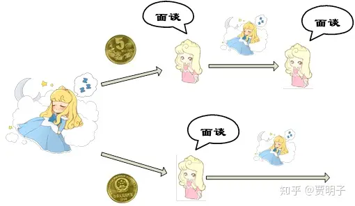
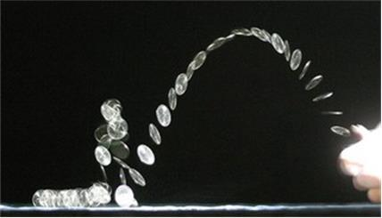
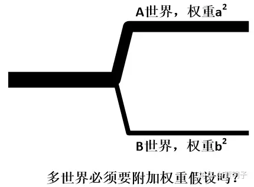
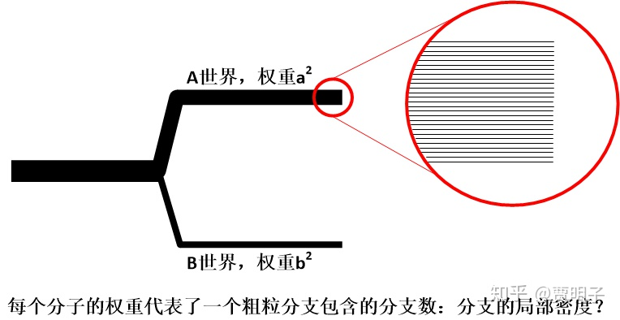
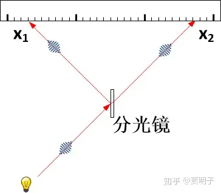

# 26、量子世界中拉普拉斯之妖的重生

你应该已经注意到了，多世界理论和退相干理论一起，抛弃了“正统”量子力学中随机的坍缩过程，变成了一个严格的决定论理论。它只遵守唯一的、完全决定论的薛定谔方程。因而整个过程中，没有任何“随机性”的生存空间。**每一个符合量子力学定律的事件都必然发生**，它们发生在不同的“世界”中。进而，“可能性”也就没有生存空间了：一个事件要么是**必然发生**的（符合量子力学定律），要么是**必然不发生**的（不符合量子力学定律）。没有“**可能发生**”的情况出现。那么，上一章结尾提到的输出值问题，就必须认真对待：

1. 我们所说的“可能性”是怎么回事？或者说，“概率”是怎么一回事？我们如何在一个完全决定论的世界里产生“概率”的概念？
2. 玻恩规则又是怎么一回事？为何我们会按照玻恩规则来“指定”一个事件的“概率”？

这，就是人们彻底接受多世界理论之前，横亘的最后一个壁垒。如果这个问题无法解决，多世界理论最终总归是面临着一个喉中鱼刺，让人无比难受。

在近几十年，无数的人们在试图寻求这个答案，这些试图从纯幺正的量子力学中推导出玻恩规则的，从最早的Everett开始，至今已经有不下几十人提出了各种不同的理论，同时有更多的人在对这些理论进行着近乎吹毛求疵式的批评。在人们不断地深入探讨的同时，人们渐渐意识到了这样一个问题： “概率”的问题，并非只在量子力学中存在。事实上，作为一般概念，“概率”自诞生之初就问题重重。我们现在必须要先跳出量子力学，从概率的根子上探寻。

概率可以算作是数学理论中一个比较奇怪的概念。一方面，作为一个纯数学理论，它的逻辑结构清晰，理论体系完备，在自然科学、社会科学等各领域应用十分广泛。最严谨的概率论公理体系是建立在测度论的基础上的，称作Kolmogorov公理。而另一方面，在纯粹的数学含义背后，概率到底意味着什么？作为一个核心概念，它的严格定义又是什么？说到底，人们**对概率如何诠释**？对此人们的认识可以说仍然是一笔糊涂账。这一点非常像量子力学的现状：对严格的形式理论和逻辑体系，人们不会有任何分歧，但是，这种结论如何诠释，大家却公说公有理婆说婆有理。

我这里举一个经典概率的例子，来说明大家的分歧，就是**睡美人问题**：

我们邀请睡美人做志愿者协助我们做这样一个实验，我们给睡美人喝下安眠药让她入睡。然后我们扔一枚硬币（这是一枚所谓的**公平硬币**，也就是说正反面落地的概率相等），根据硬币的结果决定后续的实验过程.

如果硬币是正面，那么：

1. 我们会在周一把她叫醒，面谈；
2. 然后给她喝下健忘药，让她彻底地忘掉这次叫醒，然后让她继续入睡；
3. 然后在周二再把她叫醒，面谈。

如果硬币是反面，那么：

1. 我们会在周一把她叫醒，面谈，
2. 然后给她喝下健忘药，让她彻底地忘掉这次叫醒，然后让她继续入睡；
3. 然后让她一直睡下去。

在每一次面谈的时候，我们会问她一个问题：

**“你认为这次硬币反面朝上的概率是多少？”**

在我们实施这个实验之前，我们会把实验计划的每一个细节全部告诉睡美人，因而她在每一次面谈的时候，都知道背后的所有安排和一切可能性。但是，她不知道自己的这次面谈究竟是在上述计划中的哪一环。

你觉得睡美人的答案应该是什么？

对这个问题有好几种思路，得到了不同的答案。我们一一看来：

首先，第一个答案是，当然，硬币反面朝上的概率是50%。因为在整个实验过程中，她是否被叫醒和对硬币的落地毫无影响。而我们知道这是一枚公平硬币，它每一面向上的概率都是50%。睡美人一开始就知道所有的实验细节，那么，不论她何时被叫醒，她所知的信息总是一模一样的。因而不论如何，在她看来，硬币落地的概率是清清楚楚的：两面都是50%。

第二种答案说，50%是错误的！真正的答案应该是1/3。如果我们反复重复这个实验1000次，那么睡美人被询问的时候，硬币反面向上的次数有多少次呢？因为这是个公平硬币，我们知道，大约有500次实验中，硬币是正面向上的，而另500次则是反面向上。在正面向上的实验中，她被询问了两次，也就是说一共有1000次询问中，真实答案是正面向上。而在所有的反面向上的实验中，她只被询问了一次，也就是说一共有500次询问中真实答案是反面向上。所以，反面向上的概率是1/3。如果我们让睡美人每次醒来是都给自己的答案下注，她当然会把更多的赌注下在正面向上：因为多次实验中，显然正面向上的情形更多。

这两种答案究竟哪一个才是正确的呢？这个看起来是一个很简单的问题，但是令人惊异的是，现在这两种答案的支持者们却是各执一词，争论不休。直到现在，人们仍然不能达成共识。这就说了，概率这个概念本身，存在着一些模糊不清的空间 – 诚然，如果人们可以明确定义整个问题，它的答案就不应该是不明确的。

我们在第一部分的第四章曾经非常简单地讨论过概率到底是什么，以及在经典决定论下概率的含义,但是我们并没有深入探讨。

[贾明子：4、抛硬币和概率性173 赞同 · 25 评论文章](https://zhuanlan.zhihu.com/p/28551569)

那么我们现在可以再来看看，“概率”到底是个什么东东，以及人们现在对它的理解到底有哪些不同的方向。

概率就是，我们前面说过，我们对一个事件的“可能性”的定量描述。这个说法虽然看起来很合理，但是它作为一个定义，还是嫌太模糊不清了。更有甚者，即使是作为一个大体的描述，它也并不显而易见，很多人并不同意这种说法。

- 首先，什么是“可能性”？
- 其次，我们又如何对“可能性”来定量？

对此有很多种不同的说法，如果把这些一一列举，这将是一个非常巨大的话题，恐怕没有200页是讲不完的，我这里我这里仅用最简的语言挑几个有代表性的观点。基本上，它们可以分为两大类：一类是**主观概率**，认为概率是我们在主观上对事物认知的缺失或对事件发生的信心；另一类是**客观概率**，认为概率是属于外部世界本身的性质。

首先我们来看看“经典”的概率诠释。在我们的第一部分中，有一段拉普拉斯的引言（关于拉普拉斯之妖），这包含了拉普拉斯最早对概率一种哲学观。在这种思想背景下，并不存在所谓的“可能性” – 一件事要么发生，要么不发生，不存在“可能发生”的情况。但是对我们有限的信息而言，我们并不能完全确知这些事件的发生情况。在我们的信息范围之外，我们是完全无知的。那么我们就被迫用有限的、支离破碎的信息来判断某个事件能否发生 – 我们就没办法做到完全肯定。于是，我们就只好退一步，来谈论“可能性”。也就是说，**在经典的概率理论中，可能性表示的是我们对完全确定事件的无知程度，**而概率，则是我们指定的某种对这种无知程度的定量度量。

那么，我们通过什么样的规则来指定这种定量度量呢？就是经典概率的一个原理，叫做**“无差别原理”（Principle of Indifference），**这个原理简单来讲，就是：

**如果对若干个可能的事件，没有任何证据更加偏向其中一方，那么，它们的概率是相等的。**

比如说一个骰子，它有6个面，我们知道它落下时必然会有一个面向上。但是在我们不知道我们投出它时的精确的力度、高度、角度的情况下，每个面向上的证据对我们是“同等不确定”的，因而我们必须认定，所有的面向上的概率都是相等的。

经典概率的一切，基本上就是基于这个原理推出来的。

但是这种经典概率有着它的漏洞。所谓的没有偏向一方的证据，要么是对任何情况都**完全无知**，要么是**完全对称**的证据，这两者都有着难以自洽的地方。

对于我们完全无知的两个事件，我们可以用不同的方式来看待这种不可区分性，并且他们之间不相容：比如说所谓的**Bertrand悖论**。这个悖论是这么说的[[1\]](https://zhuanlan.zhihu.com/p/55902617#ref_1)，如果一个工厂专门生产一种骰子，它的边长可以从0到1之间变化，对此我们毫不知情。那么从这个工厂的产品中我们随机取一个出来，它的边长小于0.5的概率应该是多少？根据无差别原理，在我们完全无知的情况下，边长小于0.5和大于0.5应该是等概率的，那么这个概率是50%。但是，如果我们问，我们随机取出的这个产品的一个面的面积小于1/4的概率是多少？同样根据无差别原理，我们对各自可能的面积也是完全无知的，那么面积小于1/4的概率就应该是25%。同理，我们也可以说体积小于1/8的概率是12.5%。那么同样的一个产品，为何会有不同的概率？

这里的问题就在于，对于完全无知的情况，“边长大于0.5”和“边长小于0.5”两个事件；以及“体积大于0.5”和“体积小于0.5”这两个事件，按照无差别原理，它们都应该是等概率的。但是，显然这两者是是相互冲突的。

那么如果我们按照对称性来考虑呢？我们把无差别原理看作是一种对称性的描述。这就涉及到了我们对证据的“证明力”的一种权重指定：一种偏向某一个特定的事件的证据，如何确定其重要性？在对证据的权重指定的过程中，其实已经暗含了对可能性的一种权重指定了。因而它就难逃循环论证的指责。

对经典概率还有一种不安，就是它表达的是人们的“无知程度”，这看起来多少有些主观的意思。当然，拉普拉斯对此辩称，一旦确知了我们对初始条件的认知精度，这就是一个确定的客观概念。当然，这仍然不会消除“主观性”的影响。就像我们前面章节讨论的，如果一个机器可以很好地控制抛硬币的力度，那么硬币落地的状态是可以精确确定的，概率将毫无用武之地。在“抛硬币机”看来，硬币的概率显然和肉眼不同：它并非仅仅是事件本身的性质。

“主观性有那么可怕吗？难道不同的人对一个事件发生的概率不应该有所不同吗？”有人站出来问。没错，这些人对概率的诠释就是主观的。它们的代表就是大名鼎鼎的**贝叶斯概率**。贝叶斯概率认为，一个事件的概率并非是随机事件本身的客观性质，而是人们对事件发生可能性的主观信心程度。例如，当我们拿到一枚硬币时，我们可以问，我把它抛出去它正面向上的概率是多少？我可以根据自己的猜想，假定它有一个概率，这个概率不是别的，而是我对“硬币正面向上”的**信心**，是一个主观的东西。但是，我的主观信心是随着我获取的信息量增多不断变化的。比如说，我认为硬币正面向上的概率是50%，但是我做了一个试验，发现它果然正面向上，那么这时我的信心就增加了一点，比50%更大。如果我第二次试验发现又向上，那么我的信心更大，我认为硬币正面向上的概率就更高。但是随着试验次数的增多，我发现有时候出现正面，我的信心相应上调，有时候出现反面，那么我们就相应地调低我们的信心。每一次试验，我们对它的指定的概率都会有所变化，因为我们的信心都建筑在前面又多了一次试验结果的基础上。如此大量试验完成后，我们对下一次抛硬币所指定的概率就根据前面所有试验结果来确定。

概率的主观诠释很好地消除了经典概率的一些逻辑上的bug，并且，它的概率更新的方法在统计学中获得了巨大的成功。随着今年的AI技术和大数据的兴起，贝叶斯统计更加在深度学习和数据处理方面大显身手。

很多人对它的诠释感觉不爽的是，它把数学理论归结为某个主体的主观信心。难道数学不应该是确定的、跟谁在用它毫无关系吗？在整个数学理论中，还有哪一个理论会被认为是主观的度量？ 如果说一个事件的概率是随着每个关注着的主观而变化的，那么，岂不是每个人都会有一个概率？那么作为概率理论的公理体系、整个概率的计算方法又有何用？

这的确是一个躲不过去的问题。对此，主观诠释者这样解释：概率，是一个“理性人”对随机事件的信心程度。可以证明，如果我们不按照概率理论计算一个事件的概率，那么，人们总是可以根据我们的主观概率规则，建立起一套博彩机制，让我们不可能赢（所谓的“Dutch Book 问题”）。所以说，现有的数学理论是唯一一个可以免于我们总是输钱的考虑方式：概率理论是对“机会”做出评估的、唯一一种自洽的理性思维模式。

这样一来，如果我们认为一个人的主观信念满足概率理论，那么从数学上很容易推出，贝叶斯概率就会要求，这个人在逻辑上永远不会犯错误。一个永不犯错的主观信念 – 说到底，一个绝对的“理性人” – 怎么可能？对于这种绝对理性的主观信念，它和一个客观性质有何区别？

主观概率的一个核心问题，就是一个人的主观信念如何与外部事件自身的“机会”相关联。不论我们的主观如何评估一件事的可能性，我们总归是对这件事做出某种机会判断，因而主观概率必须在某种程度上体现外部事件的客观倾向，否则这种主观概率毫无用处 – 除非我们彻底否定外部客观世界的存在。对于这种“主观信念”和“客观机会”之间的关系，David Lewis曾经提出所谓的**“Principal Principle”**[[2\]](https://zhuanlan.zhihu.com/p/55902617#ref_2)**，**基于此在数学上弥合主客观概率。这个原理（大概）说：

> ***“对未来某机会事件的信心，等于我们已知的该事件的机会，除非有了更新的信息应该被我们考虑。”\***

也就是说，作为一个理性人，他对一个事件的概率的主观指定，应该等于已知的该事件的客观概率。然后根据事件的新信息不断更新我们的认知。这反映出，在事实上，贝叶斯概率并非等同于主观概率 – 我们仍然有**主观贝叶斯**和**客观贝叶斯**两种诠释。纯正的主观概率信奉者相对比较小众。

另外一派人说，对一个随机事件而言，**概率必须是一个客观的、属于事件本身的性质**。这个性质就是：如果我们完全重复这个事件，它发生的结果每次都会可能有所不同，但是如果我们重复它很多次，我们会发现，某种特定的结果发生的频率（它出现的次数与所有试验次数的比值）就会渐趋稳定。在做这个抛硬币实验时，当你抛出次数很少的时候，你几乎找不到任何规律，正面还是反面朝上每次都完全不可预测，但是这个硬币不停地抛出时，渐渐地规律出来了：似乎正面出现的次数和反面出现的次数很接近，大约一半时间是正面朝上，而另一半时间是反面朝上。并且实验次数越多，它们就越接近。比如说，你抛了1000次，大约500次是正面，500次是反面。于是，人们就假定，如果我们后面再抛1000次，我们仍然会有500次左右正面，500次左右反面。如果我们重复无穷多次，那么，这个相对频率就会是一个确定值，这个确定值就是概率。这个叫做“大数定律”。

这种说法认为，概率就是一个随机事件在大量重复中，它所出现的相对频率。因而这种诠释又被称为“**频率派**”。频率派显然是一种客观概率诠释，它不依赖于随便一个人的主观印象。但是这里也有很大的问题，首先我们想到的是，“无穷多次”？什么鬼？！按照这种说法，我们永远都不可能真正做出一个定义。其次，“完全重复”？我们理论上不可能完全重复同一个事件，它的初始条件必然是不可能相同的。

你可以说，我们实际操作中，并不见得真的要做到“无穷多次”，只要是次数足够多，也不见得完全重复，足够相似就可以了，这样我们就知道足够精确的概率了。比如说在上面的例子中，我们只需要抛出1000次硬币，就可以基本上断言正面向上的概率为50%。

那么，你怎么知道，这1000次的试验结果是可靠的呢？既然是随机事件，你怎么就知道从1000次开始，后面不会连续1000次抛出正面？

“你这是在抬杠，连续1000次正面，那样太不可能啦！”你可能这样分辩。

但是等等！你是在说，连续1000次试验，正面向上的相对频率“很可能”，或者说“非常非常非常可能”是50%吗？请记住，我们在试图用相对频率来定义可能性，在这个时候，你是不能使用“很可能”这样的词语的，因为它还没有被定义！你等于在说：

“硬币正面向上的概率在很大概率上是50%”

这是在循环论证！

对此，人们发现，很难通过这种相对频率的方式来解决对概率的诠释问题。没错，在操作上，频率派是一种非常方便的做法：我们在判断一个事件的概率时，只需要做大量实验，然后在看它的出现频率就可以了。但是，它无法回答“概率是什么”这种问题，从概念上，它很难给出一种自洽的概率定义。

人们进而提出了另外一种概率的诠释，就是“**物理倾向性**”，或者是“概率本性”。也就是说，概率代表的是事件本身的一种特性：它相反于拉普拉斯的概率 – 这是一种对确定事件的无知性 – 而是把事件的随机性看作是一种真实的內禀性质 – 我们可以称为“真▪概率”。或者说，它就是随机事件产生某种结果的“倾向性”，正是这种倾向性，导致了大数定律：虽然随机，但是大量重复的相对频率趋向于稳定。

显然这种诠释并不解决问题，它把一切问题集中到了这种“倾向性”上面去了。这种“倾向性”消除了频率派的逻辑困难，也带来了自身的问题，就是这种“倾向性”又是如何定义的呢？对于一个单一的随机事件，“倾向性”肯定不可能被直接观察到，因为人们只能观察到确定的结果，而不可能观察到“可能性”。因而这种“倾向性”难以确切定义。持“倾向性”观点的人们辩称，很多东西都无法确切定义，但是我们不能无限制地穷究下去 – 必须有一个“原生的”定义。这个原生定义就是概率。

这样一来，物理倾向性的概率定义就不能算是一种定义，它是模糊的。从操作层面上，人们仍然必须通过大量实验的相对频率来确定这种“倾向性”。所以操作上它和频率论没有可辨的区别。

我们列举的这几种不同的关于概率的诠释，各有其道理，然而各有其问题。这些诠释到现在为止和量子力学还都没有什么关系，是属于概率这个概念本身的问题。关于概率的诠释还有很多种，这里不一一列举。我们可以看到，每一种诠释都看起来非常有道理，但是同时它们又各自有着自身的漏洞或不完美的地方。它们其实在很多情况下并不能得出相互一致的结论。

所以说，概率诠释的问题，并非量子力学自身的问题，至少不全是。前面提到的多世界理论和退相干理论的三大问题中最棘手的“输出值”问题，本身就是一种对概率的诠释问题。人们对它的一筹莫展，其实并不能完全怪在多世界理论头上，它很大程度上起源于概率这个数学概念本身。即使是在哥本哈根诠释中，它也是问题重重。

我这里不想再重复哥本哈根学派的全部基本理念，只是要强调一点，玻恩规则 – 事件发生的概率是它概率幅的平方 – 是哥本哈根学派的一个基本假设，它是整个理论框架的基石之一，它不需要推导，也不需要解释，因为它很任性地天然真。

根据我们前面所提到的概率的各种诠释，这里，哥本哈根的概率似乎非常适合概率的物理倾向性诠释，即所谓的“真•概率”。因为在它看来，世界本身就不是决定论的，而是內禀随机的。不但我们不可能准确预言下一刻将发生什么，而且下一刻发生什么本身就是不确定的：我们只能预测它“可能”发生什么，而且整个自然界也只能知道它“可能”发生什么。而玻恩规则给了这种“可能性”一个定量的度量。

我们前面曾经提到过，概率的倾向性诠释有着自身的问题，就是这种“倾向性”没有办法严格定义。玻恩规则的出现，另很多人感到很兴奋，因为终于，我们的真•概率有了一个严格的定义！真概率是什么？就是玻恩规则从数学上所锁定的那个数值。因此，哥本哈根诠释似乎是可以把“概率”这件事说圆了。有了哥本哈根诠释，真概率这个概念就有了坚强的背书。但是如果我们仔细推敲，却发现它不那么圆满。

首先， “倾向性概率”本身的问题是个概念问题，它没有办法通过玻恩规则来解决。没错，玻恩规则给了这种概率一个**定量化的度量**，但是它并不能给出这个概率的**概念化定**义。事实上，玻恩规则从操作层面所断言的，是大量的量子事件的相对频率，至于它是不是一个量子事件的“倾向性”，或者说，是不是真•概率，我们无从确认。因为说到底，对于一个单一的随机事件，“倾向性”是不可能被直接观察到的，因为人们要么观察到它发生，要么观察到它不发生，无论如何都只能是确定的结果，而“可能性”，必须通过大量事件来推论。从这点而言，玻恩概率操作上和频率论的概率没有可辨的区别。与其说玻恩规则给了倾向性概率一种背书，还不如反过来：**正是因为我们有了“真•概率”这种概念，玻恩规则的数学结果才有了背书。**

其次，我们必须要知道，严格讲玻恩概率讲的其实并不是**粒子本身的性质**：粒子本身的运动“倾向性”或“随机性”，而是在讲**观察行为所产生的结果的一种性质**。而观察过程就涉及到了观察者和粒子两者之间的复杂作用。哥本哈根诠释一再强调，在没有进行观察的时候，粒子的“真实的”状态毫无意义，因而脱离开观察而谈论概率就毫无意义[[3\]](https://zhuanlan.zhihu.com/p/55902617#ref_3)。因而**这个概率就不可能是粒子自身的性质**。那么我们就回到了“观察”这个神秘事件本身了。玻恩规则所涉及的“真•概率”，到底是粒子的性质？观察过程的性质？还是两者混合的性质？就无法说清楚。但是如果我们对这个不能清晰地完成分析，我们就无法断言粒子的“真•概率”。因而，把玻恩规则归结为粒子自身具有的內禀随机性是有很大问题的。

对此，一种把哥本哈根诠释向着极致化[[4\]](https://zhuanlan.zhihu.com/p/55902617#ref_4)引申的理论出现了。这种观点继承了波函数的认识论诠释并将之推向更远。它直接断言，薛定谔方程所描述的，不是物理现实，而是我们对物理现实的认识信念，因而量子概率就是主观概率，这个，叫做“**量子贝叶斯主义（QBism）**”。在它看来量子力学是一种纯粹的认识论（epistemological）理论，而不是本体论（ontological）理论。也就是说，它描述的不是现实，而是“我”的认知状态 - 我对事件的信心（beliefs）。这是一种纯粹主观的、个人化的概念。所谓的客观概率是不存在的，玻恩规则不过是把主观概率应用到了量子力学中去了而已，波函数坍缩只不过就是贝叶斯概率中的信息更新而已。那么现实是什么？QBism对此毫不关心。甚至说，由于主观概率涵盖了量子力学的一切，这个世界上基本上就没有所谓的“客观存在”。

这类理论，我们可以想象，是一种极具个性的、评价两极分化的理论。这就基本上注定了它的小众化，不可能获得主流物理学界的认同。很多物理学家对它的兴起很关注，并且承认它的确给物理学带来了一些不一样的洞见，但是绝大多数物理学家同时认为，它对粒子的概率行为的解释完全不令人信服。比如说，一个粒子的在某个时间段内有50%的概率会发生衰变，我们说的是这个粒子自身的性质 – 半衰期，而很难令人相信这只是我们对粒子的主观看法。要知道，我们制造的原子弹的基础就是这种理论，如果它只是人们的一种主观印象，那将是一种多么令人毛骨悚然啊。

对这种看法，Wallace很不客气地直斥其为“极端的工具主义”。并且，量子力学的预言可以很好地符合各类（近乎无穷多次的）实验结果，这中间所表现出来的客观性很难让人认同它们不过都是“个人信念”。如果这中客观性真的只是一种幻觉，那么量子力学对人们的信心的描述达到了一种令人发指的精确程度 – 这怎么可能？量子贝叶斯如何与客观经验相容的问题是难以回避的。

那么，现在我们来看看多世界理论中对概率的看法。事实上，在Wallace看来，多世界理论对概率的诠释并不比概率本身的诠释麻烦多，相反地，它能够给出更加自洽、合理的概率诠释 – 这其实是多世界理论的一个巨大优势。我们可以看看他的信心来自何处。

有一点是可以肯定的：**在多世界看来，“真•概率”是没有存在的意义的，**概率必然是某种幻觉。既然一切可能的事件在各个“世界”中全部发生了，那么事件本身不存在任何不确定性，存在不确定性的，是“我”最终发现“自己”位于哪一个“世界”。那么，概率其实就是“我”在这个复杂的世界树中的**自我定位问题（self-allocation）。**但是现在问题来了，既然多世界理论宣称所有的“世界”（波函数分支）都是同等真实的，那么从频率派看来，它就会与玻恩规则产生矛盾。

我们仍然以薛定谔猫为例来说明。例如说，某个试验最终演化成为这样一个状态（我们省略细节）：

$|猫\rangle=a|放毒\rangle |死猫\rangle + ba|美毒\rangle |活猫\rangle \equiv a\left( 世界A \right)+b \left( 世界B \right)$

那么，根据玻恩规则，我们知道，当我们观察猫的时候，我们有a^2的概率发现猫死，b^2的概率发现猫活。而在多世界理论中，世界A和世界B同等真实，那么根据无差别原理，它们应该有着相同的概率才对，也就是说，我们应该有50%的概率发现自己位于世界A中，发现死猫，而有50%的概率发现自己位于世界B中，发现活猫 - 这明显与玻恩规则不相容。

而玻恩规则是一个已经验证的结果，多世界理论在抛弃它的同时，**必须要提出一种机制来把它变成自己理论的自然推论。**如果不相容，那么就不是理论瑕疵的问题，而是理论颠覆的问题了。所以说，前面提到的量子-经典三大问题中，最难缠的“输出值问题”的核心就在此。

Everett本人在提出多世界理论的博士论文中，就以一种简化的过程从薛定谔方程推导出了玻恩规则，然而他提出了一些额外的假设，这些假设被后人严格检查后，发现其实已经隐含了玻恩规则在里面了。后来人们给出了一波又一波的解释，到现在为止，已经有很多种理论来导出玻恩规则了。对此人们仍然在争论当中。当然，近十几年中这个领域进展神速，有几个理论研究初露峥嵘。

首先，我们说一下频率派概率。频率概率的基本原则是，概率就是大量（无穷多？）事件中我们所关注的事件发生的相对频率。对世界而言，就是多个世界中特定“分支”的相对个数。例如说，我们想要观察某一个事件E发生的概率。在观察过程中，系统“分裂”成为多个平行的分支，在某些分支世界中，E发生了，而在另一些中E没有发生。我们把这些分支数一数（branch counting，或者叫分支计数）那么那些包括了“E发生了”的分支的数目，占所有分支数目的百分比，就是A发生的概率。

在前面例子中，人们可以解释说 A和B两个世界在概率上是不等价的，因为它们的“系数”a和b（也就是概率幅）不相等，它们的概率应该与a和b有关，在考虑时应该附加上这个系数作为权重。根据玻恩规则，这个权重分别是它们的平方。也就是说，我们也像哥本哈根诠释一样，把玻恩规则作为一个天然真的前提 – 我们不过是附加了一个假设而已，即使是这样，多世界理论仍然比哥本哈根理论简洁。

但是这样做严重违背了多世界理论的初衷：创建一个自然相容的、纯幺正的理论。如果我们附加了玻恩规则作为假设，不但增加了理论的复杂度，而且会带来相容性的问题：如果这个权重是概率性的，那么纯幺正的演化规则和概率性假设是无法同处一个房檐下的；如果这个权重不是概率性的，那么它又是如何与概率挂钩的？这对哥本哈根学派并不是那么严重，因为哥本哈根的演化规则本身包含了一个非决定论的坍缩。也就是说，如果我们在操作上，必须采用这种“权重”的处理手法，我们也必须要找出一种关于这种权重的合理解释。

一种理论认为，所有这些都与退相干的过程相关。我们前面曾经提到过，一个整体的波函数在退相干的过程中，那些非定域的性质会迅速扩散到环境中去从而消失无踪，保留下来的都是可观测到的经典“分支”。我们应该注意，退相干过程所导致的，是一种波函数的**近似**分支：1、退相干的过程很迅速，大约在10^-20秒就基本完成了，但是，快归快，它并非瞬间发生的；2、非经典状态迅速消失，但是并没有完全消失，它们只是在极短的时间内变得小到可以忽略而已。从观察的角度，世界在级短的时间内就**几乎**完全分支了；但是理论上，这些非经典状态永远存在，退相干过程是个连续过程 – 也就是说它永远不会结束。每个分支的世界并非严格的一个“细粒化”世界，而是由与这个世界很相似的一系列“临近分支”的“粗粒化”世界混合而成。

也就是说，现实中（FAPP）我们所观察到的这个世界不是严格的一个世界分支，而是一组由很多个非常非常接近的分支的混合。我们可以分辨的任何一个世界，都是一个个粗粒世界 – 它们由多个真实的世界分支组合构成的。每一个粗粒世界包含的真实分支数目，也就是他的“粗细”。而这种粗细恰恰就是这个分支的概率权重，就代表了我们一个粗粒现实所包含的分支数目。我们考虑每个世界的“粗细”，恰好就可以推导出玻恩规则。

这种从FAPP出发的，粗粒化世界的概率权重，就是每个波函数分支的相对频率，因而我们得到的，就是一种频率化的概率结果。说到底，这种理论指定了一种“分支计数”的规则：那些“相近”的分支因为在实际中无法区分而被分组成为某种粗粒化的世界，而那些因为退相干而“几乎消失”的分支则被忽略掉。按照Robin Hanson[[5\]](https://zhuanlan.zhihu.com/p/55902617#ref_5)的说法，就是“小世界”在与“大世界”的相互作用中“消失”（mangled）掉了。但从理论上讲，它仍然有很多令人诟病的地方。

而真正里影响力比较大的理论，是近十几年出现的，一种是以Deutsch和Wallace主导的，基于**决策论**的推导方法，另一种是以Zurek和Carroll主导的，基于**量子对称**的方法。我们一一道来。

我们先来看看Deutsch应用决策论得出的结论[[6\]](https://zhuanlan.zhihu.com/p/55902617#ref_6)。决策论是一个主要研究我们的决策怎样影响我们获得的价值、以及我们如何决策才能获得最优利益的理论。你也可以把它看作是**一个人如何理性看待概率的理论**。用决策论的视角，我们可以把一切量子事件看作是博彩游戏[[7\]](https://zhuanlan.zhihu.com/p/55902617#ref_7)。要知道，概率论的起源就是来自博彩业，一个博彩的预期回报，就是这个博彩的随机结果的概率预期，因而博彩的结果本身就体现了概率的本性。

比如说，我们用一个量子事件制作一个博彩游戏机。例如说我们可以用一个分光镜来实现这一的博彩：一束激光射向这一一种半透的反光镜，这束光有一定的概率直接透过它，一定的概率会被反射。然后，我们发射一个光子，检查光子最终到达了标尺的哪一个位置，由此来确定我们的回报。如果我们发现光子到达了x1，我们就得到x1元钱，反之我们就得到x2元钱。

我们可以来估算一下我们在这个游戏中可以得到的收获 – 用决策论的术语，也就是这个游戏的价值。

现在我们可以通过调整刻度尺的位置来改变这个博彩的赌注 – 也就是它的价值。不论如何改变这个博彩的价值，我们从决策论的公理中可以知道，有几个规则是必然成立的：

1、如果把我们游戏者和游戏的庄家身份调换，那么对我们而言游戏的价值就必须成为他的相反数。这很容易理解：如果原来这个游戏规则下，我们会赢得某些价值，那么把原来游戏规则的全部“输”和“赢”反过来，总的说我们就会输掉同样的价值。我们可以想象这种情况就是对于零和游戏，原本赢多少的，现在当然就会输多少。

2、如果对游戏的每一个结果，原来的回报都加上一个固定的价值k（想象一下我们把标尺平移一下），整个游戏的价值就要增加k。这个也很容易理解：因为每个可能回报都增加了k，而我们只能得到一种可能，当然总的回报就会增加k。

那么根据这两条公理，我们就可以计算这个游戏的价值了。整个数学过程我们这里就省略掉了，计算的结果恰恰就是波恩规则。什么意思呢？决策论告诉我们，作为一个理性的游戏参与者，**我们的一切选择，就必须认为这个量子事件好像是满足玻恩规则一样。**

这个过程中，我们仅仅需要的假设就是决策论的两个公理能够成立 – 这几乎是显而易见的。虽说整个过程中，我们并没有用到“概率”这个概念 – 概率是什么并不重要。但是，从结果上看，整个过程**等效于**存在一个满足玻恩规则的概率。至于是否真的存在这个概率，以及它是否“真的”满足玻恩规则，这不重要。理性决策者尽可以认为真的存在满足玻恩规则的概率。根据Principal Principle，这就是主观概率和客观概率之间的等价性。

决策论的方法并没有直接回答“概率”是什么，但是它的分析显示，从表象上看，我们完全不妨认为存在专业一种叫做概率的东东。

现在，我们再来看看Zurek的关于量子对称性的论证方法[[8\]](https://zhuanlan.zhihu.com/p/55902617#ref_8)。秉承了退相干理论一脉相承的思路，他仍然是从量子纠缠以及系统与环境的关系来论证的。他发现，量子系统中由于量子纠缠的存在，有一种非常独特的性质，人**们即使是对系统整体全知全解，仍然会对局部一无所知。**

这在经典系统中是不可思议的。在经典世界中，对一个系统的全知必然意味着对系统的每一部分的全知：比如说你不知道你们班一个同学的名字，你当然就不能说你认识了全班的每一个人。但是在量子系统中这个逻辑却崩溃了。就好像是你们班的同学在一起的时候，你都认识，但是一旦把他们分开，你却发现一个都不认识了。我们前面提到过好几次，量子系统中整体≠每个部分的加和。或者这样说，纠缠系统是一个不可分的系统，因而严格上是不存在所谓的“系统的每个部分”这种东东的 – 系统没有“每个部分”。而我们把宇宙划分成为系统、环境、以及“我”这几个部分，就必然导致了对系统整体信息的抛弃 – 即使是你完全知道这些信息，你仍然不得不抛弃它。

我们前面说过量子系统的非定域性。但是，多世界理论是一个严格的定域性理论。贝尔定理所说的定域性隐变量不存在，其实有一个隐含前提，那就是“单一结果的隐变量”。而多世界是一个多结果并存的理论，并不违背贝尔定理。事实上，我们所说的非定域性，其实是量子态本身的非定域，而绝非相互作用的非定域。

那么，Zurek说，一个量子系统，它可以有“广域性质”和“局域性质”。所谓的广域性质，就是这个系统的整体波函数，一个态矢量。对这个系统而言，它描述了系统的所有信息。而局域性质，这是那些我们对系统的一个局部所指定的性质。一个很合理的假设就是，**系统的局域性质只取决于我们观察的局部范围**：我们观察一个粒子的结果，不会受到远处事件的影响。然后，他发现，系统的局域性质存在着一种特殊的对称性，所谓的“**环境干预对称性**”[[9\]](https://zhuanlan.zhihu.com/p/55902617#ref_9)（“Environment Assisted Invariance”，或者叫“**Envariance**”），这种对称性告诉我们，一个对整体全知的观察者，对局部却无法获得确定的认知。

这是一种基于经典概率的诠释：对称性导致等概率。说到底，这其实说明的是**我们的观察（相互作用）的局域性与量子系统的广域整体性之间的矛盾**所导致的。整个过程中我们一直保持着对系统+环境整体的全知，而没有任何经典概率的“无知”在里面，但是仍然，对局部的无知就这么发生了。

我们可以看到，前面从相对频率、主观概率、以及经典概率三个角度，我们对多世界理论的终极问题“输出值问题”做出了不同的阐述。但是，这里仍然有一个问题，那就是，假设说上述论证都是有效的[[10\]](https://zhuanlan.zhihu.com/p/55902617#ref_10)，我们证明了玻恩规则的成立，但是并没有明确说明概率到底是如何产生的。比如说，相对频率中，为何分支计数的相对数目就对应了概率？决策论中，一个主观概率，并不能说明不确定性到底是如何发生的？而在量子对称性中，我们可以看到，如果系统可以用概率描述，那么它必然满足玻恩规则，但是为何系统可以用概率描述？说到根本上，多世界理论仍然是绝对的决定论啊。

总而言之，下面这个问题

“**这个世界中某事件发生的概率有多大**？”

是“正统”量子力学所问的问题。然而在多世界理论中，这个问题就变成了：

“**在所有的一个世界分支上，哪一个我才是‘我’？**”

这是个自定位（self-allocation）的问题，我们可以进一步引申，它就变成了：

“**在近乎无穷多个意识分支中，我将会如何定义我自己？**”

这就变成了一个**自定义**的问题。

“我”这个字，可能是我们日常中最常用的字之一，但是我们平时基本上没有注意到过，说到底它包含了一个终极哲学秘密：自我定义。**自我定义注定是逻辑不完美的，因而我们的世界注定是概率性的**。

那么我们回来看看第一部分最开始的话题，拉普拉斯之妖。从多世界理论出发，没错，在处于宇宙之外的全知的拉普拉斯之妖看来，世界是决定论的，一切都是注定的。但是，对于那些唯一宇宙之中的、无时无刻不在与宇宙发生纠缠的“槛内人” - 我们 - 看来，未来是完全不确定的，有无穷多种可能性。在量子力学中，拉普拉斯之妖确实有它的生存空间，但是它却对我们毫无用处，因为它无法与我们发生因果关系 – 这将导致它陷入纠缠的宇宙中而失去全知能力。

**下一章：[贾明子：27、量子现实：两大阵营的对话](https://zhuanlan.zhihu.com/p/56101545)**

**上一章：[贾明子：25、多世界并不奇怪](https://zhuanlan.zhihu.com/p/54938678)**

**专栏传送门：[何为现实？拉普拉斯之妖与薛定谔猫之决战](https://zhuanlan.zhihu.com/c_186387023)**

------

## 参考

1. [^](https://zhuanlan.zhihu.com/p/55902617#ref_1_0)Bertrand悖论有更加严格和更加“数学”的表述，这里就不过于展开来说了。
2. [^](https://zhuanlan.zhihu.com/p/55902617#ref_2_0)这个原理相对翻译起来有些困难。其中，“Principal”意指“原生的”、“根本的”、或“大佬”之类，我想我可以暂且称之为“原生原理”
3. [^](https://zhuanlan.zhihu.com/p/55902617#ref_3_0)事实上，真•概率如果真的是量子事件的內禀属性，那么我们从逻辑上必然会导致脱离观察的粒子不存在确定的真实状态这个结论。即使是抛开贝尔定理这个实证的判定，单纯从概念上，粒子的真实状态就无法自洽。 -- 如果我们承认粒子存在真实的状态，那么立刻，这种真•概率就被还原成为经典的“无知”概率了。更加严重的是，如果我们认为粒子随时都存在着“真实的”状态的话，对于一个完全连续的时间线中，连续演化的概率分布（薛定谔方程）、同时伴随着不连续的真•随机运动，这种“真概率”会吧芝诺的“飞矢不动”悖论中的矛盾极端放大。
4. [^](https://zhuanlan.zhihu.com/p/55902617#ref_4_0)有人倾向于把量子贝叶斯划为独立的一类诠释，但事实上，它起源于哥本哈根诠释，并且把后者的一些模糊的（或者是故意回避的）问题给出了一种沿着哥本哈根道路走向更加极致化的答案。这里我不想用“极端化”这样的词语，因为我们不能对一个科学理论使用带有强烈主观倾向的描述。但是，从个人喜好而言，我觉得这种引申是极端化了。
5. [^](https://zhuanlan.zhihu.com/p/55902617#ref_5_0)arXiv:quant-ph/0108070v3
6. [^](https://zhuanlan.zhihu.com/p/55902617#ref_6_0)arXiv:quant-ph/9906015
7. [^](https://zhuanlan.zhihu.com/p/55902617#ref_7_0)Deutsch和Wallace的论证很formal，牵涉了严谨的数学和逻辑，是一个比较复杂的过程。Wallace的论文就长达20多页。这里采用的，是Corroll在一个科普性讲座中比较形象化的论述，因此才有了用博彩类比量子事件不太严肃的说法。
8. [^](https://zhuanlan.zhihu.com/p/55902617#ref_8_0)arXiv:quant-ph/0211037
9. [^](https://zhuanlan.zhihu.com/p/55902617#ref_9_0)我自己的翻译，因为中文文献中找不到一个已经确立的翻译法。
10. [^](https://zhuanlan.zhihu.com/p/55902617#ref_10_0)由于这部分论证都是在近些年才出现的，它们是否有效仍然有待于科学界进行评判。

发布于 2019-01-28 17:38

