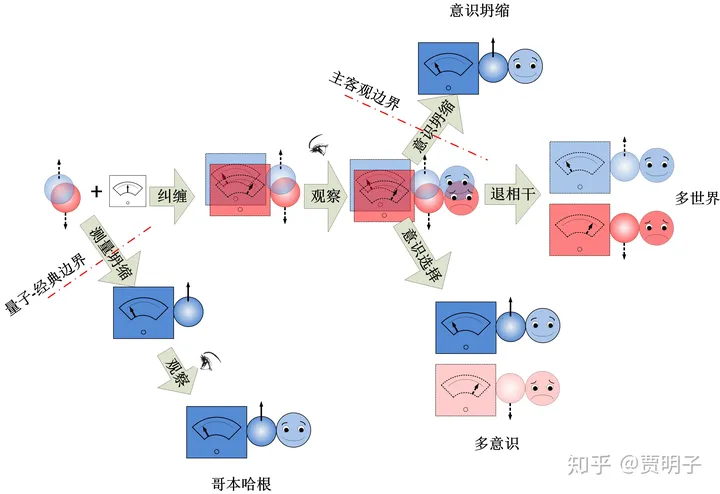
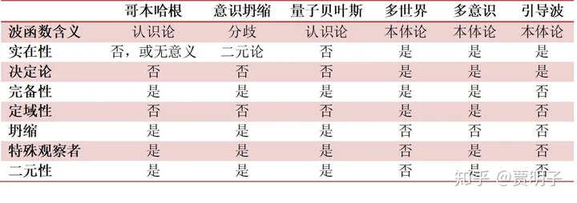
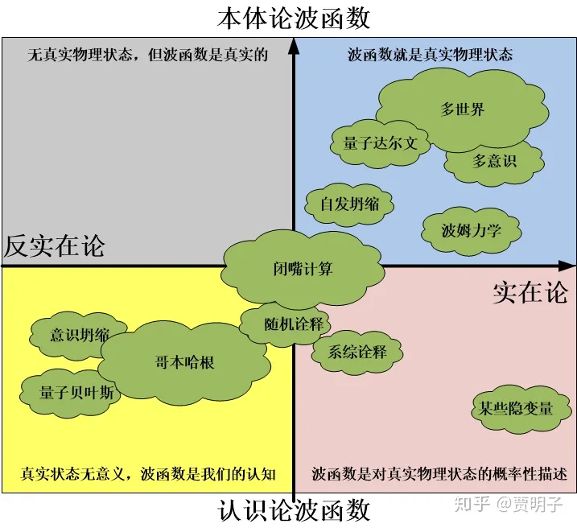

# 27、量子现实：两大阵营的对话

> ***“I went to Godel, and I asked him, ‘Prof. Godel, what connection do you see between your incompleteness theorem and Heisenberg’s uncertainty principle?’ And Godel got angry and threw me out of his office!”\***
> ***“我找到哥德尔，问他：‘哥德尔教授，您觉得您的不完备定理和海森堡不确定原理之间有什么内在联系吗？’哥德尔听后非常生气，把我轰出了他的办公室！”\***
> ***– 约翰.惠勒\***

我们来整理一下前面谈论的关于量子现实的一切。我们从违反常识的双缝干涉开始，逐步介绍了那些日常生活中绝对不会出现的、难以想象的奇怪的量子现象：诸如态叠加、不确定性、纠缠、非定域性等等。然后我们试图对这些奇怪的现象提出解释 – 量子力学诠释。我们简略地讲到其中几个诠释。我应该指出，关于量子力学的诠释，是一个非常大的问题，绝不仅仅是这两个理论。事实上，各种诠释加起来已经不下20多种了。人们众说纷纭，知道今天，仍然没有一个被主流认可的诠释。为何如此呢？

因为量子力学所关注的，是人们从未涉足过的微观世界。因此一切微观现象对我们而言都是毫无征兆的、全新的。人们习惯于将自己在宏观世界中的经验延伸到这块新领域 – 诸如波动、粒子、自旋等等，都是我们在宏观世界中建立的概念，是我们认识宏观世界的模型。当我们信心满满地把这些模型照搬到微观世界的时候，我们并没有一个逻辑上的必然理由，认为这些模型仍然有效 – 是的，我们发现，在微观世界中，这些符合我们惯常经验的概念完全格格不入。

人类科学史上，经历过两次这种观察视野的扩展过程，第一次是由哥白尼和伽利略发端的对宇宙的探索，结果就是诞生了牛顿力学；第二次是从微弱的摩擦起电开始，对围绕在我们周围的、但是从未被发觉的电磁现象；结果就是诞生了场论和相对论。这是两次非同一般的历史大事件，每一次都对我们的世界观产生了重大冲击，前者冲击了人们对宇宙和神的观念，后者冲击了人们的时空观。我们现在回头看，这两次冲击，没有一次像量子力学带来的这样强烈。但是，这只是我们身在庐山之中的视角，我们并没有亲身经历当初哥白尼带来的革命，是难以体会其中的震撼的。又有谁会知道，“多重现实”这个观念会不会有一天变得像“地球在旋转”这样，被人们习惯，渐入平平无奇之境？

我忘记了是哪一个科学家了，他曾经说过，一个新理论带来的革命性的理念，往往要经历一代人才能渐渐为人所接受，持有传统观念的老一代逝去，白纸一般的新一代诞生，然后新的理念得以在上面自由涂抹。

然而到现在为止，量子力学老一代大神们，爱因斯坦、玻尔、薛定的、海森堡、狄拉克等等都已逝去，诞生在新一代中，虽然观念在不断进化，但是共识仍未形成：**关于量子力学的诠释，现在远远还不到盖棺定论的时候。**人们众说纷纭，各抒己见。哥本哈根学派和多世界理论的坚定信徒加起来也不会超过50%。虽然大家会时不时地谈起“正统”诠释，但是事实上，直到现在，根本就不存在一个真正意义上的“正统”诠释。如果你强迫大家都必须“选择”一个诠释，历史上人们可能选最多的就是哥本哈根诠释。但是这不意味着大家对它满意。事实上大多数人选择宁愿谁都不信，只不过哥本哈根诠释占据了确立时间比较早的优势，人们已经比较习惯了它的思维方式，所以在还没有更好的选择的时候，姑且认为它正确。要知道，改变自己的观念是需要成本的，如果没有很好的理由，早期哥本哈根圈的粉有着一定的稳定性。可是，大家一直以来都非常清楚它的致命伤：关于量子 - 经典过渡问题的难以自洽以及关于观察和坍缩问题的含糊不清。尤其是前者，不但理论上让人难以满意，现代的科学实验已经一步步地在越来越大的系统中观察到量子力学的特性，一遍遍地否认了所谓的“海森堡边界”（Heisenberg Cut）[[1\]](https://zhuanlan.zhihu.com/p/56101545#ref_1)的存在[[2\]](https://zhuanlan.zhihu.com/p/56101545#ref_2)，让人们越来越对其失去耐心。

爱因斯坦和玻尔的大论战在公众眼里以玻尔胜利告终，但实际上，爱因斯坦固然没有成功推翻哥本哈根诠释，但是玻尔也并没有赢。相反地，今年来的一些新进展表明，爱因斯坦笑到最后的可能性越来越大。

> ***“虽然大多数人认为在那场论战中玻尔获得了胜利，但是，我的观点是，爱因斯坦一直致力于寻求关于现实的解释，而他的对手们则是一直在宣扬一堆废话。Everett的理论不能让爱因斯坦成神，但是它的确让爱因斯坦正确。”–Deutsch\***

> ***“玻尔关于量子力学的看法有着致命的缺陷，但是这个缺陷却并非如爱因斯坦所言。哥本哈根诠释把观察行为和观察者看做经典，这当然是错误的：物理学家和他们的仪器都必需被同样的量子力学规则所支配，就像它支配了宇宙间万物一样。” - 温伯格\***

爱因斯坦死后60多年了，人们仍然在争论。在2013年的一次量子力学会议上，组织者专门做了一个调查。结果显示，21%的人认为玻尔是正确的，但是27%的人认为它是错误的。而在另一次会议的一个“民调”中[[3\]](https://zhuanlan.zhihu.com/p/56101545#ref_3)，高达70%的人认为玻尔是错误的！

相对而言，关于爱因斯坦的观点，其实也好看不到哪里。在一次民调中，28%的人认为爱因斯坦正确，45%的人认为他错误。而在另一次民调中，没有一个人认为他是正确的！

这其实说明了大家对量子力学诠释的纠结：去你妈的爱因斯坦和玻尔，在我看来都在胡说八道！从这里看，不论是爱因斯坦还是玻尔，都远远算不上“主流”。

我这里说这些的目的，不过是想让你明白，**目前物理学界对诠释问题并无定论。**前面的探讨很容易让你产生一种错误印象：量子力学诠释的主流是哥本哈根与多世界之间的战斗。其实不是的，这两种诠释可能算是没有主流中的最“主流”。而你，也不应该被这两种思想完全框住。这个问题到现在为止，仍然是完全开放的，并且有可能永远不会关闭。我们通过仪器探究微观世界的过程中，我们一直在疑惑，在仪器背后，究竟是何种“真实面目”？但是要知道，我们试图讨论在五感这种“人肉仪器”背后的世界的“真实面目”已经有2000多年了，从柏拉图到笛卡尔，从康德到黑格尔，从罗素到维根斯坦，这个话题仍在继续。

现实就是，关于诠释问题的争论已经持续了一百多年了，人们仍然看不到明确的方向。这种难缠的争论的一个后遗症就是，人们已经厌烦了：所有这些争论，基本上都是人们对形式理论的理解，但是却不会影响这个理论的实际应用和实际结果。所有的诠释，最终都会做出几乎完全相同的理论预言；而大家的分歧，却绝大部分处于那些无法实证的领域。在这种情况下，争论还有意义吗？这就是**“闭嘴计算”（shut up and calculate）**的态度。它认为，我的理论能够做出正确预言就足矣，何必纠结于“它到底意味着什么”这种无意义的问题？

我们在前面提到，量子力学，包括了“裸量子力学”的部分，就是量子力学的形式理论，以及对它的诠释。我们可以看到，裸量子力学的几条公设给了我们一个用于预测粒子行为的“手册”。按照这个手册所规定的步骤123完成计算，我们就可以知道，当我们观察一个粒子的时候，我们会有多大的概率发现它具有何种状态。这是一个“纯数学”的手册，我们完全不需要知道所谓的“波函数”、“叠加态”、“坍缩”这些概念在其数学意义背后的“物理”涵义是什么。我们只需要知道，我们根据这个手册的指引一步一步完成计算，最后得到的结果就是，如果我们对这个粒子做一个观察，我们会观察到的、这个粒子的所有可能状态，以及每个状态出现的概率。因此，我们完全可以不在乎这些看起来很奇怪的问题：

- 波函数描述的现实还是我们的认知？
- 测量到底是否占据着特殊地位？
- 它是否会导致“真的”波函数坍缩？
- 存在我们无法干涉的“多重现实”吗？

我们不必在乎它们，因为就 我们的最终疑问，“我们将会观察到的粒子的状态是什么？”这个问题而言，上面那些问题都可以看做是纯数学概念：不管这些问题的答案是什么，都不会影响我们就算得到的最终答案，只有这个最终结果，才是可以实证的。而“实证”才是自然科学所必需的，也是自然科学所要求的一切。我们非要去问，没有观察到的“叠加态”是什么，还有我们观察的瞬间发生了什么“坍缩”，这些问题就算是你有一个答案，因为它们都不是实证概念，你又能如何证明你的答案是正确还是错误的呢？所以，“Shut Up and Calculate！”

这种答案，你觉得这样满意吗？

好吧，当我写到这里，我立刻就想象出来你那张不服气的小脸。你当然不会满意这种回答。但是，无论你服不服气，现在多数的物理学家都持有这种态度，以至于“shut up and calculate”这句话已经成为科学界知名度极高的一句名言。那么，物理学家们为何会学鸵鸟，把脑袋埋进沙子里，回避这些如此明显的问题呢？当然物理学家们可以用上面那种纯粹的实证主义言论来回答，用“萨根的隐形龙” 来嘲讽你，甚至用泡利的名言 “This is not even wrong （这连个错误都算不上） ”来怼你，让你无言以对。但是，这些闭嘴计算的物理学家们心里难道就没有一点点好奇心、想要知道那个荒诞的叠加态究竟是什么，而我们的观察又是如何会让宇宙的状态坍缩的呢？

科学家们当然想知道，非常非常地想。据我所知，已经不止一人曾经表示过，如果让他知道了在观察过程中，叠加态是如何坍缩成确定态的话，他们哪怕立刻就死了也开心。这里的真正问题是，人们习惯于用经典思维来考虑这件事，并且总是不自觉地要求量子现实符合我们的经典思维。这简直是不可能的任务！然而完全打破我们的经典思维，我们又对未知的微观世界毫无所知。所以，很多人只能无可奈何地耸耸肩：微观粒子就是这么奇葩，世界本来如此，我又有什么办法？先把这个问题放一边，别费脑细胞了，等有人搞到好的答案，我再去选择相信或不相信吧！应该说，绝大多数人至今仍然持有这种态度，原因其实未必是他们真的满足于对物理的一种（不加诠释的）纯数学描述，而是因为现有的诠释难以服众，人们暂时采取这样一种逃避的态度。

但是这种态度也产生了一种恶果，那就是关于量子力学基础的问题的讨论现在成为一种小众话题，被冷落、被无视，甚至被认为毫无意义。Tegmark曾经抱怨说，他曾经一篇文章比较深入地探讨基础问题，被审稿的人退稿了，并且劝诫他说，他的理论功底不应该被浪费在这种“民科”（crackpot）的领域。他说他的策略就是，花绝大多数时间思考基础问题，但是在发表文章的时候，总是想方设法把他的思想“包装”在一个实际问题当中。这样一来，他的思想得以发表，但是人们往往只看到他的实际结果，但是真正想发表的思想却被人忽视！

这种实用主义和工具主义倾向的思维模式，其实是可以理解的，因为诠释问题实在是太玄、太难、以至于看起来太空洞了，以至于难以展开有效（明确、可实证）的探讨。但是，我并不希望你陷入这种思潮之中。我想起一个故事：当法拉第第一次发现电磁感应的时候，一位贵妇问他这个发现有什么用，他反问道：“一个初生的婴儿有什么用？”我们当然不能脱离实践，但是，在考虑实际结果的同时，我们并不应该放弃我们的好奇心，这种好奇心驱使我们去钻研那些个看起来无用、无实际结果、但是非常有趣的问题。而这种探索终将体现出它的价值。即使是它最终毫无价值，至少它是有趣的，我认为，**仅仅是“有趣”就足够成为我们沿着这条路走下去的理由了**。这种“有趣”才是驱使人类不断做出突破的终极驱动力。我很欣赏王小波的一段对科学的评价：

> ***“在器物（具体应用\***[[4\]](https://zhuanlan.zhihu.com/p/56101545#ref_4)***）的背后是人的方法和技能，在方法与技能的背后是人对自然的了解，在人对自然的了解背后，是人类了解现在、过去和未来的万丈雄心。”\***

这就是为何，我还要继续带领你深究这些诠释背后的含义的原因。

我们说，我们提到过的这些理论的主要分歧点，就在于那个神秘的观察过程：观察者是独立于理论的特殊存在吗？没有观察的时候，波函数描述的是粒子的真实状态吗？坍缩到底有没有发生？如此等等。我们用下图来大概说明一下：

还是那个经典的冯诺依曼观察链条：一开始，我们有一个处于上旋与下旋叠加态的粒子，以及以太处于就绪状态的仪器，当然，还有一个喜欢上旋、讨厌下旋的观察者，我们。

首先，在哥本哈根诠释看来，量子力学是一种认识论的理论，它描述的是“我们能够对粒子状态说些什么”而不是“粒子的状态是什么”。在一开始的时候，粒子的状态毫无意义。由于仪器是经典的，粒子是量子的，两者处于不同的领域，遵循不同的规则。经典仪器无法用叠加态的量子态来描述，因而，在我们用仪器测量粒子的时候，就不得不跨越那条神秘的量子-经典边界，因而仪器就只能随机地从“显示上旋”或“显示下旋”两种状态中旋转其一 – 这时候，坍缩发生了，粒子从叠加态坍缩到某一个确定的本征态。因而我们就只能随机地观察到一个令我们高兴的上旋粒子，或令我们伤心的下旋粒子，这个随机事件的概率由玻恩规则指定。

在冯诺依曼和魏格纳看来，物理规律应该是普适的，不存在量子-经典的分界线，所谓的“经典仪器”是一个伪概念。仪器需要用、也只能用量子态来描述，因而仪器是可以存在叠加态的。测量的过程就是仪器与粒子的相互作用 – 这就必然导致仪器与粒子状态之间的纠缠。随着我们的介入，我们的感官系统、神经系统都会不可避免地陷入这种纠缠之中，进入到“观察到上旋”和“观察到下旋”的叠加之中。然而，当我们的意识介入时，我们就把物理世界之外的东西引入这个过程了，而我们没有任何理由相信，物理定律的普适性也涵盖我们的意识行为。因此，意识介入的那一刻，就是量子规律被打破的那一刻：坍缩就发生在此时。我们位于叠加态的感官在被意识接受的时候，就坍缩成“高兴地意识到粒子上旋”或者“伤心地意识到粒子下旋”两者之一。在这里，虽然量子-经典边界不存在了，但是主观-客观边界取而代之。

多世界理论继承了冯诺依曼的“不存在量子-经典边界”以及“量子规律是普适”这种观念，并且更进一步，把观察者的特殊地位 – 不论是主观还是肉体 - 完全取消掉了。整个量子力学的幺正演化会自始至终贯穿到底，因而叠加的每个状态将永远不会消失：这个宇宙就是由这些多重的现实共同构成的。最终，整个系统进入（粒子上旋，指针左偏，我们高兴）+（粒子下旋，指针右偏，我们伤心）的叠加态。这时候，退相干过程强势进入，在极短的时间内，为这个叠加的整体系统选择了若干经典投影，于是所有的非经典状态都变得不可见，看起来这个系统似乎是“分裂”成为两个不相干的“世界”，一个世界中我们发现粒子上旋而高兴不已，另一个世界中我们发现粒子下旋而无比伤心。由于世界的复杂性，两个世界自“分支”后就再也不相干了。在多世界理论中，没有坍缩和和随机性，但是从一个特定的“世界”中经典的“我”看来，一切观察结果与坍缩效果无异。玻恩规则也是这个复合系统中幺正演化的自然推论而已。

在多世界理论中，我们不可避免地要谈论哪一个“我”才是“我自己”的问题。无数个“我”在每个“世界”中存在，每一个“我”都会有一个自我意识。因而我们就逃避不了“多意识”的讨论，这就形成了多世界理论的一个分支，称为**“多意识理论”（Many minds interpretation）**。多意识理论秉承了多世界理论的基本思想，但是又有所不同。在最初多意识理论的出现是为了解决前面所说的“偏好基问题”以及“输出值问题”。在多意识理论看来，偏好基问题不是问题，而是我们看问题的角度不同。就像是整个宇宙的物理状态一直处于多重叠加一样，每个意识生物，对应着它们各自的各种物理状态，都有着一个“意识分支”。当整个意识与外部世界进入纠缠之后，整个世界并不分裂（这里，**多意识理论与Dewitt的“分裂”的多世界理论形成冲突，但是，它恰恰与Everett最初的普适波函数相一致！**），但是这些意识的每一个叠加态 - 意识之所以能够成为意识，其一个必要条件就是它有着确定的自我认知状态 – 必然是确定的、经典的。因而从每个意识角度，偏好基就自然出现了：那些叠加的、不确定的意识状态必然不能成为意识，因而也就无法形成主观经验。所有那些可以形成主观经验的、也即是可以被认知的，都必然是在确定的意识态视角下的。这些确定的意识态就是偏好基。因而，**在多意识理论看来，整个世界并不分裂，“分裂”的是观察者的意识：这些意识从不同的视角（偏好基）观察宇宙波函数，就形成了不同的观察结果。**而“我”则是随机地选择了某一个观察视角，观察到了一个可能结果。当然，随着退相干理论对偏好基问题的研究，多意识理论中的很多附加假设已经变成了不必要，现在渐渐地与多世界理论融合在一起了。

而玻姆力学与上述理论则有着显著不同，因为它是一种隐变量理论，在它看来，从一开始，就不存在叠加态。所谓的叠加态，只不过是一个波的基本性质，毫无奇怪之处，这个波就是引导波。而粒子则一直是一个有着确定状态的粒子。因而，就不必扯什么多重现实，也不必扯什么坍缩，观察毫无神秘之处。

总而言之，这里的主要分歧点包括：

1、**波函数的含义**。波函数到底是本体论的（ontological） - 描述粒子的性质，还是认识论的（epistemic） - 描述我们对粒子的认知程度？显然，多世界理论、多意识理论、引导波理论都是本体论理论，而哥本哈根、量子贝叶斯则是认识论理论。意识坍缩理论有些不同，在冯诺依曼看来，波函数是本体论的，但是经过魏格纳的重新诠释以后，它则成了彻头彻尾的认识论概念。

当然，在本体论波函数理论中，引导波理论有有所不同，多世界/多意识理论认为波函数是完备的 – 它完整地描述了粒子的所有性质，而引导波理论则认为它是不完备的，它只是粒子性质的一部分：在引导波之外，还存在着确定的粒子。

2、**坍缩的含义。**同样地，在三个本体论理论，多世界理论、多意识理论、引导波理论中，是没有坍缩的。而在哥本哈根三巨头（哥本哈根、量子贝叶斯、意识坍缩理论）中，则是明确有着坍缩的。

3、**决定论。**引导波理论是一个完全决定论的理论，而哥本哈根三巨头是非决定论的、随机的。多世界和多意识理论则是一个整体决定论、但是在单个观察者视角中表现出非决定论表象的理论。

4、**观察者的作用。**哥本哈根三巨头中，观察者是特殊的、独立于理论之外的、不受理论约束的神秘角色。它们是整个物理过程中不确定性的起源。多世界理论中，观察者是物理世界的一部分，与一部观测仪器毫无区别。多意识理论中，观察者的作用于多世界理论相似，但是它保留在有着一点的特殊性：它是偏好基的定义者。而引导波理论则完全没有观察者的地位。

5、**量子力学普适性。**哥本哈根三巨头中，存在着两类互不相容的、但是又互补的演化规则：U过程和R过程，哪一类规则在起作用取决于我们是否在观察系统。同样地，另一个额外的假设 – 玻恩规则 – 就是R过程中的基本规则。多世界理论和多意识理论则只有一种单一的演化规则：纯幺正演化。只不过，多意识理论在偏好基问题上，采取了一种类似人择原理的策略。而引导波理论包括了引导波的传播和粒子在引导波指引下的运动两个规则，但是它们同属一套，共同决定了粒子的演化 – 而不像哥本哈根中两种规则不相容。

哥本哈根中，量子-经典是二元对立的，量子规律在经典领域失效；意识坍缩中，主客观是二元对立的，量子规律在主观领域失效。多世界理论、引导波理论中，都只有一个领域，物理定律在其中普适存在。多意识理论也是一种近似于一元理论，只不过其中意识在定义偏好基问题上仍然有所不同。

6、**定域性。**一切包含着坍缩的诠释，必然都是非定域的。引导波理论也是非定域的。而多世界和多意识理论，则是保留了定域性。

7、**我们最关心的，对客观实在的看法。**对波函数持有认识论诠释的，一般而言都是反实在论或非实在论的。它们之间又略有不同。玻尔认为，没有被观察的事物，其“真实状态”毫无意义。对此一般的看法是，玻尔是一个鲜明的实证主义者，但是玻尔本人对此坚决否认，他说，他并不否认实在，而只是认为，实在就是它所表现给我们的那些东西。冯诺依曼事实上是一个二元论者，他既承认客观实在的存在，同时又认为主观意识是独立于客观实在的东西，并且主观意识甚至可以使客观实在坍缩。与之对立的，多世界理论是一种极致的实在论理论，它把希尔伯特空间中的巨大的波函数看作是实在的，它的每一个叠加态都真实存在。而多意识理论则进一步引申，它把意识引入到物理理论中，认为物理状态决定了意识状态，然而基于意识本身的定义，只有那些确定的意识态才能成为真正的意识，因而意识反过来决定了观察物理状态的视角（偏好基）。

关于各种不同的诠释它们之间的关系，著名物理学家Sean Carroll 曾经这样说过：

> ***“多重世界从量子力学中自动产生了，它们是形式理论不可避免的部分，那么现在剩下的问题就是，我们该怎么办？有三种不同的策略：愤怒、否认、以及接受”\***

在Carroll的三种分类中，“愤怒”的阵营持有这样的态度：“多重世界实在讨厌，因而我要修改量子力学的基本规则来避免它。”这种策略包括那些对基本的薛定谔方程做出修改 – 增加非线性项、增加自发坍缩项等等。例如自发坍缩诠释（spontaneous collapse）；还有一类则是隐变量理论，例如引导波理论，它们则是在薛定谔方程之上打补丁。

“否认”的阵营的基本态度就是，采取前述的“认识论波函数”策略，否认波函数描述的是真实世界，而是把它的描述内容看做是我们对世界的认知。例如哥本哈根诠释和量子贝叶斯。在意识坍缩的诠释中，魏格纳也持这样的观点。

而“接受”的阵营，则把量子力学中的这种多重性认可下来，既然理论形式中不可避免地包含了多重性，那么我们就承认这种多重性好了，这是逻辑上最自然的做法 – 虽然对我们的常识有冲击。Everett理论的一系列变种，包括原始的普适波函数或相对态表述，Dewitt的多世界表述、退相干领域中的存在性诠释、量子达尔文主义等等。人们一般用最流行的名称，“多世界”，来称呼它们。

在这里，我不想涉及那些所谓的“愤怒”阵营。现在的一切实验证据，都没有发现任何量子演化的非线性效应，我们倾向于认为薛定谔方程就是最好的描述， 甚至有人，诸如温伯格，坚信演化就是严格线性的。但是，我这里对诸如自发坍缩类的诠释不做评价，因为我对它们并不了解，但是我相信它们存在总是有它们的理由的。

那么剩下的，就是两个阵营了。基本上，“否认”派，包括哥本哈根、意识坍缩（魏格纳版）、量子贝叶斯在一起归于哥本哈根阵营（其它的一些诠释，诸如系综诠释、一些随机诠释、部分一致性历史诠释的持有者也可归于此）；“接受”派，包括多世界（包括Everett的普适波函数、Dewitt的多世界、以及后来退相干领域中兴趣点所谓“存在性诠释”和量子达尔文主义）和多意识则归于多世界阵营。我们可以看到：

**哥本哈根阵营的鲜明特征包括：认识论波函数、反实在论或非实在论、非决定论、坍缩存在、观察者是特殊的、量子定律与其他规则互补存在。**

**而多世界阵营的特征包括：本体论波函数、实在论、决定论、纯幺正、观察者是物理世界的一部分、量子定律是普适的。**

它们两者在绝大多数问题上都是对立的。

然而，着这里想要梳理一下，在看似对立的两大阵营的背后，有着丝丝缕缕的一致性和统一性。这起源于这样一个事实：无论它们的观点有何分歧，它们都必须对应着同样一套**观测事实**。

在量子-经典过渡的问题，是两大阵营最尖锐对立的地方。哥本哈根认为必须存在量子-经典边界，而多世界则坚决认为量子力学是普适的。但是退相干理论的出现，提供了一种量子到经典的合理过渡机制：干涉是如何消失的、经典现象是如何从量子的爱丽丝奇境中浮现出来的。那么，这种主观的、不确定的、强加给理论的量子经典似乎已经没有存在的必要性了。我们可以通过量子力学公式实际计算出这个边界在哪儿，以及经典现象如何、多快地从量子世界中产生的。因此，量子-经典边界不再是一个强加给理论的一个突兀假设，而变成了理论的自然推论。这个的确对早期的哥本哈根诠释造成了很大的冲击，因为它的一个基本假设现在看似乎已经变成了冗余的。然而，哥本哈根学者们可以转而辩称，这并不会破坏其理论基础，相反地，它能够提供一种合理的量子-经典边界的界定机制，使得这个在早期理论中模糊的概念变得清晰起来。但是，我们仍然面临着“坍缩”的困境，因为退相干只是给出了量子世界向着经典过渡中，可能出现的状态，但是我们还需要一个过程，使得这些可能状态其中之一成为现实。这就是概率性的坍缩以及玻恩规则出现的坚实基础。也就是说，输出值问题仍然存在，概率性演化仍然存在。只不过，现在的哥本哈根诠释面临着新的问题：既然量子-经典边界已经可以认为是纯幺正演化的合理结果，那么，这种违背幺正演化的坍缩，是为何、如何、何时发生的呢？

反观多世界，它则从退相干理论中获益良多，这主要是因为多世界的基本观念 – 不存在量子经典边界 – 与退相干理论的核心动机，量子经典过渡问题，珠联璧合。在退相干理论之前，量子-经典过渡问题同样困扰着多世界理论，那就是前面提到的偏好基问题。多世界理论作为一个纯量子理论，它必须要解决如何与经典经验相符的问题。退相干的过程就非常合理地描述了世界所谓的“分裂”过程。作为一个整体的量子态，经典世界是如何自然而然地被环境筛选选择下来，变成了一个稳定的“分支”。但是现在，输出值问题仍在困扰着多世界理论：概率是如何从纯幺正动力学中起源的？

哥本哈根的“量子经典边界”，多世界的“偏好基问题”，分别或多或少地从退相干理论获益。它们现在所分别面临的问题，都跟坍缩有关。哥本哈根中，坍缩是随机性的起源，然而，在量子经典边界已经渐渐失去其存在的必要性时，它需要一个关于坍缩的合理描述。多世界理论中，不存在量子经典边界，但是从幺正演化到概率性，中间需要一个打破平衡的机制。

随着对波函数的认识论性质的深究，在哥本哈根阵营中，看起来最合理的一种坍缩机制，就是人们在认识过程中的信息更新，也就是说，作为人们认知的波函数，在人们获得新信息时发生突变，这是一个逻辑上的合理结论，也是哥本哈根阵营中近年来比较获得认可的一种说法。就像是我前面说过的，坍缩如果穷就下去，就无可避免地进入讨论意识坍缩的棘手状态。从这个角度上说，**波函数坍缩就与冯诺依曼和魏格纳的意识坍说缩融合在一起了**。

在多世界中，我们前面讨论了如何从纯幺正演化中获得玻恩规则。现在有着各种进展，并且前景光明。但是每一种推导方法，都进入了新的假设。例如，Wallace和Deutsch的理论，假设了决策论的两个公理；Zurek 的Envaiance引入了定域性假设。它们只不过是从一个更加符合人们的直觉的角度上解释了玻恩规则，而不是从纯决定论中导出了玻恩规则。Vaidman甚至认为，没有必要去试图导出玻恩规则，因为没有可能不附加任何假设就从决定论中导出概率论，那么干脆我们就把玻恩规则作为那个假设。也就是**“概率假说”（probability postulate）**：

**每个分支的“显示度量（existence metric）”由其概率幅确定。**

这一点我们如果采用一种数学柏拉图主义的角度来看，其实是一个非常合理、自然而然的假说，因为它就是态矢量的几何性质。但是不论如何，多世界理论 – 至少从现在的情况看，仍然无法彻底摆脱玻恩规则，只能使之更合理。

同时，人们还在诘难这样一个问题，即使多世界理论解决了玻恩规则的问题，也只是回答了“如果存在概率，那么概率应该按照何种规则计算”，并没有解决“概率从何而来”的问题。

Carroll对此有着一段论述，他认为这取决于所谓的**“自定位不确定性”（self-locating uncertainty）**。也就是说，我们虽然对未来世界的分支可以做到完全预测，但是我们所不能预测的，是我们自己将在会出现在哪一个世界，这就成为不确定性的根源。他对所谓的“后观察过程”（post measurement）分析道，退相干的过程极其迅速，它在10^-20秒中就完成了，也就是说，世界的分支几乎瞬间就完成了，但是人的意识的产生则慢得多，在毫秒级。当人们完成了观察，世界完成了分支的时候，我们对此毫不知情。等过了无穷长（相对于退相干时间来说）时间之后，我们才意识到自己处于哪一个分支上。而这，就成了不确定性、也就是概率的起源。

这种“后观察过程”就把人的主观意识引入到多世界理论的框架中了。这是必然的，因为在一个完全决定论的理论中，唯一可能的概率性，只能来自人们的无知度，它就只能是一种主观概率。那么，多意识理论的说法就更加有意思了。多意识理论中，我们所观察到的每一个可能结果，都是我们的一个意识分支选定的一个视角。而意识在选定观察视角的同时，就定义了自己。而这种自我定义，就完成了偏好基的定义。“我”是什么，它首先必然是一种**自我意识**。而这种自我意识，就必然是一个确定的、与外界完全区别（distinct）的东西。我们之所以能够谈论我们的经验，我们的观察，这一切的基础全在此：“我”这个定义必然会对物我之辨做出一个划分，因为否则的话，在这个纠缠的量子世界，“我”将会囊括整个宇宙，就无所谓“我”，也无所谓“物”了，进而整个世界都毫无意义。因而，整个不确定性的起源，不仅仅是**自定位**的问题，而且是一种**自定义**的问题。

如果我们回到本部分的引子，笛卡尔的“**我思故我在**”上面。

[贾明子：1、“我思故我在”说的是何种恶魔？181 赞同 · 35 评论文章](https://zhuanlan.zhihu.com/p/38473195)

我们可以把这个思辨进一步挖掘，我们将不得不下这样一个结论：“我思”和“我在”之间是互为因果的。首先，“我思”是“我在”的因。因为只有我思，才有我的自我意识。而自我意识恰恰就定义了“我”的存在。如果我不能“思”，那么就不会存在自我意识，当然就不存在“我”了。其次，“我在”是“我思”的因。因为“我思”的主体就是“我”，如果我不在，当然也就谈不到“我思”了。

我思故我在，就是表现了这样一种自定义的逻辑循环。你还记不记得前面我们关于自由意志、以及哥德尔不完备定理的探讨，自定义问题必然伴随着不确定性。

Frauchiger和 Renner曾经设计过一个非常巧妙的、但是复杂的类似于魏格纳朋友的思想实验，并且从中得到一个定理[[5\]](https://zhuanlan.zhihu.com/p/56101545#ref_5)：**单一世界的量子理论不可能是自洽的**。这个定理现实，如果我们认为量子力学是普适的定律，我们必须要承认多世界的平行存在；反之，我们如果否认多重现实的存在，那么量子力学就做不到自洽，它必须在某些地方被违背了 – 比如说，我们必须需要一个理论之外的观察者来救场。说到底，一个量子理论不可能自洽地描述一个使用量子理论的观察者，这个就涉及到了**自指**和无限递归了。人们经常会有所疑惑，量子理论中的不确定性，与哥德尔不完备定理中的不确定性，两者到底有何内在联系？一般而言，大家对此问的直接反应就是，一个是物理问题，是一个基于经验的，另一个是数学问题，是基于逻辑的，两者不可能有何关联。然而，这个定理却显示，它们之间确实可能存在着某些微妙的联系。

所以说，这个定理告诉我们，**要么，我们承认量子理论不自洽或不完备，要么，我们承认多世界。**在哥本哈根的单一世界理论中，导致这种不自洽的自指，与在多世界中，导致不确定的自定义。两者何其相似。

所以说，与意识坍缩相比，多意识理论可以被看作是换了一个角度看问题。意识坍缩中，多重性被意识任选其一保留下来，其余则被抛弃；而在多意识理论中，多重性一直存在，而每个意识分支选择了一个视角，“我”只不过是选择了这些意识分支中的其一而已。

**如果从“我”的视角来看，意识坍缩与多意识理论也就自然融合在一起了。**

所以说，如果抛开我们对“现实”的看法，两大对立阵营最终在各个问题上都有着令人意外的一致性。

所以，说到底，两者的最大分歧就只剩下一个：

**量子理论所描述的，到底是客观实在，还是我们的认知？**

如果我们简单粗暴地给它们打上一个哲学标签，那么，哥本哈根阵营是实证论（positivism），多世界阵营是实在论（realism）。关于实在论与实证主义的不同，我们在前面章节曾经提过。如果你还记得，我们曾经说过，这两者在自然科学中，属于**不同纲领下产生的相同的实践准则**。

[贾明子：6、自然科学的实在和实证158 赞同 · 26 评论文章](https://zhuanlan.zhihu.com/p/43371148)

那么，人们能否对这两种纲领做出一些判断呢？Harrigan与Spekkens曾经提出一个很有意思的讨论[[6\]](https://zhuanlan.zhihu.com/p/56101545#ref_6)，来从操作层面对认识论波函数与本体论波函数做出区分。我们大致描述一下这种区分准则。某个物理状态λ（无论是何种状态，确定的或不确定的，定域的或非定域的，决定论的或非决定论的），它决定了我们观察时会看到何种现象。如果任何一个状态都仅对应唯一的一个波函数，那么我们可以说波函数就是一个物理性质。如果我们再放宽一点，如果两个不同的物理状态，分别对应着两个波函数，而这两个波函数之间不存在任何重叠，那么波函数就应该被看作是一种本体论的性质。也就是说，它是“真实”的物理状态或是其编码。反之，如果对于两个分立的波函数，它们所对应的物理状态的分布有着重叠，那么在重叠的区域中，就有着一个物理状态λ，它有可能同时对应着这两个波函数，那么波函数就不能看作是本体论，因为一个物理状态不可能有两种编码。也就是说这时候波函数就只能表示了我们对物理状态的认知，是认识论的。

事实上，在量子力学的实践中，人们一般都会认为一个波函数唯一地确定了一个系统的状态（“纯态”），也就是说，大家在做这样的判断时，就已经强烈暗示了这个所谓的“纯态”就是一种物理状态。那么实际上是否如此呢？

就在几年前，Pusey，Barrett，Rudolph（简称PBR）做过一个详细的分析，得到一个定理，被称作**PBR定理**。这个分析过程在这儿我就略过了。结论很明确：如果我们认为，独立制备的两个粒子行为之间是相互独立的，那么，波函数就不可能认识论的。也就是说，**波函数不可能是对一个确定物理实体的概率性（认识论）描述。**

[贾明子：PBR定理：波函数不可能是一种统计概率？180 赞同 · 27 评论文章](https://zhuanlan.zhihu.com/p/52722531)

这个，看上去是对哥本哈根阵营的灭顶打击。但是，其实它并没有真正地一劳永逸地结束这个争论。因为首先，哥本哈根学者们可以质疑那个独立性假设，就像是贝尔在对贝尔定理的完全决定论解释中，曾经提到，其实不存在完全独立的制备 – 它们共同起源于宇宙起点。其次，他们还可以辩称，根本就不存在什么本体论的物理现实，一切都是人们的主观意识而已。

我们仍在等待，期待着未来的发展能够对它们做出明确的评判，但是，大概率这个明确评判永远不会到来，我们只能选择相信。

你要问我更喜欢哪一个阵营？答案很明显，我更喜欢多世界阵营。如前所述，在多个角度上，多世界理论更加优美、简洁、明确、自洽。但是这里我想说的是，这并不是我更加喜欢这个理论的最主要原因。这个最主要的原因就是：多世界理论打开了一个大门，使我们有了更加广阔的可能性。

哥本哈根诠释是从经验出发，把自己局限于经验的范围以内，对经验以外的，全部斥之为无意义而拒绝讨论。而多世界理论则从原理出发，以理论简洁和逻辑自洽为更高的追求，而对它所预言的我们经验之外的东西持开放态度，得到的看似荒谬，却逻辑严谨的结论。未来我们有可能会证伪这些结论，但是至少，它并不局限于我们的现有经验，有着更大的格局。

人类历史上的重大科学突破，有两类动机。其一，是由实证驱动：人们发现现象在先，新理论在后 - 为了解释些现象，从而发展出新的理论。这类突破包括诸如开普勒定律、牛顿力学、麦克斯韦方程、量子力学；其二，则是理念驱动：人们对现有理论不满，可能是由于理论不够简洁、不够自洽，总而言之有若干形式理论上的缺陷。为了消除这些不简洁、不自洽、甚至不美的地方，人们发展新理论。例如哥白尼日心说（地心说过于繁复）、统计力学（热力学与动力学的矛盾）、广义相对论（引力理论与电磁理论的不相容）、弦论（引力与量子理论不相容）等等。

如果，放弃了对理论之美的追求，放弃了对理解客观实在的追求，而把自己局限在经验之中，如果，诸如地心说、唯能论、绝对时空，它们当初压制了那些看似荒谬、但是从原理出发水到渠成的理论诸如日心说、分子理论、相对论等等，我们的世界现在会是如何呢？实证是自然科学的第一原则，但是强实证主义诸如马赫、玻尔，拒绝讨论现有实证范围以外的可能性，终将扼杀人类探索自然的终极动力。

**下一章：[贾明子：结语：存在，认识，转向](https://zhuanlan.zhihu.com/p/69075979)**

**上一章：[贾明子：26、量子世界中拉普拉斯之妖的重生](https://zhuanlan.zhihu.com/p/55902617)**

**专栏传送门：[何为现实？拉普拉斯之妖与薛定谔猫之决战](https://zhuanlan.zhihu.com/c_186387023)**

## 参考

1. [^](https://zhuanlan.zhihu.com/p/56101545#ref_1_0)“海森堡边界”（Heisenberg Cut）认为，在观察者/观察仪器与被观察系统之间，存在着一种界限，在界限的上面，观察者一边，我们需要应用经典处理方法；而在下面，量子系统的一边，我们需要应用量子力学。海森堡说：“In this situation it follows automatically that, in a mathematical treatment of the process, a dividing line must be drawn between, on the one hand, the apparatus …, and on the other hand, the physical systems we wish to investigate.”(“在这种情况下我们自然而然地得到，对这种过程的数学处理中，必须要划一道分界线。一边是观测仪器……，另一边是我们想要观测的物理系统。”)
2. [^](https://zhuanlan.zhihu.com/p/56101545#ref_2_0)例如就在今年，人们已经可以在宏观的铝箔（肉眼可见的15微米）上实现了量子纠缠。
3. [^](https://zhuanlan.zhihu.com/p/56101545#ref_3_0)这两次会议分别是“quantum physics and the nature of reality”，2011年澳大利亚，以及“quantum theory without observers”，2013年德国。
4. [^](https://zhuanlan.zhihu.com/p/56101545#ref_4_0)括弧内是我自己添加的说明
5. [^](https://zhuanlan.zhihu.com/p/56101545#ref_5_0)arXiv:1604.07422v1
6. [^](https://zhuanlan.zhihu.com/p/56101545#ref_6_0)arXiv:0706.2661v1

发布于 2019-01-31 18:00・IP 属地未知

