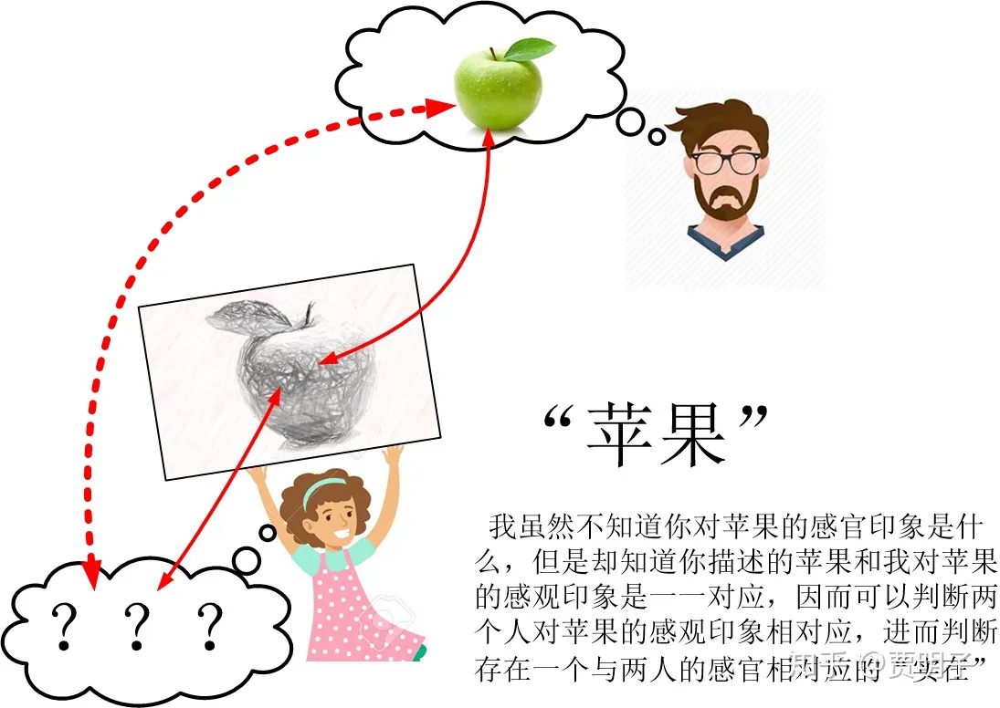
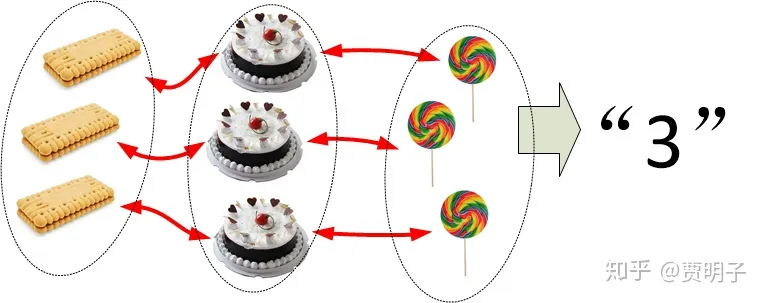
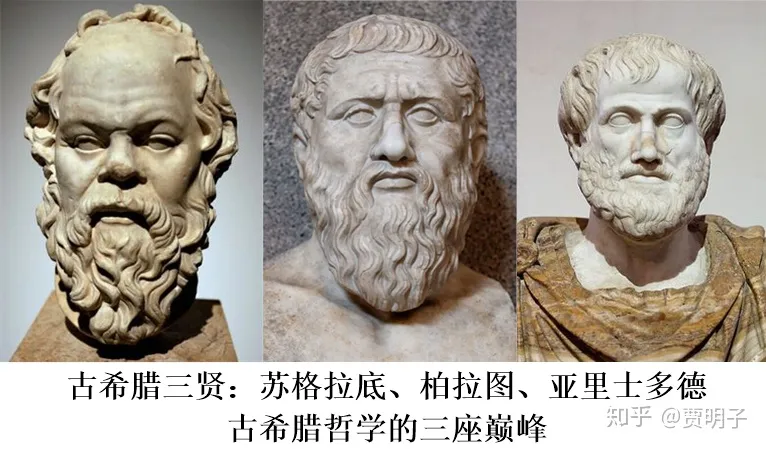
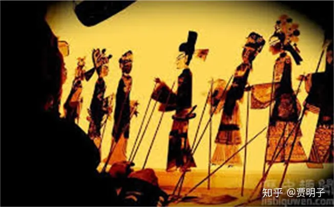

# 2、形而上学是什么？

> **“形而上者谓之道，形而下者谓之器”**
> **–** **易经**

我拿着一个苹果，陷入了深深的困惑：我手里的这个东西，到底是什么？

在我问这个问题的时候，其实已经暗中假定了一个前提，就是我手里这个人们称之为“苹果”的东西，是**存在**的。但是，这个“存在着”的东西，又是什么？

我当然知道，我手里拿着的，是人们**称之为**“苹果”的某种东西。我可以确确实实地**看**到，它是一种红绿相间的、鲜艳的圆圆的球形物体，它占据着一块特定的空间，它在时间的长河中存在且渐渐发生变化 – 如果时间长了，它表面光泽会变得黯淡，并且会腐烂；我可以确确实实地**触摸**到，它表面光滑；我可以确确实实地**闻**到一股清香；如果我咬一口，我还可以**尝**到它甜脆的口感。所有这些感官体验告诉我，我手里确确实实地拿着一个苹果。

然而，我还是不知道，苹果是什么？确切说，苹果是一种什么**实在**？

它是我所看到的红绿相间的颜色吗？显然不能这么说，苹果的颜色其实并非来自苹果本身，而是外界光照然后被反射之后的性质：它其实是苹果和外界光线的共有性质。太阳发出的自然光照射到苹果上，我们看到了红绿相间的颜色，但是如果说一束蓝光照射在上面，我们将会看到一个蓝色的苹果；如果外界光线很暗，我们将只能看到一个灰色的苹果；反之如果一束强光恰好反射到我的眼睛中，我会看到苹果上有一个白色的高光点……，如此等等。

并且，颜色本身是一种主观的感觉。我看到红色，我在主观中产生一种关于红色的印象，红色
\- 这种印象 – 实际上是属于**我的**而不是属于**苹果的**。就像是我们前面章节谈到的，我不可能知道你对“红色”的印象到底是何种**感受**。它和我的红色印象一致的吗？它和我的绿色感觉一致？它和我触摸一块冰的感觉一致？它和我听到小提琴的感觉一致？还是说，它是一种我根本不可能理解的感受？毕竟，你对红色的感受是仅仅属于你自己的，我从来没有体验过、也不可能去体验。也就是说，颜色是关于苹果的一种**感官素材**，被我的感官接收到，然后再被我的主观诠释后形成的概念。而我永远不知道你的主观如何去诠释它。

更加关键的是，我们看到的，苹果的颜色，只是一种**现象**，而不是产生了这种现象的**实在**：颜色的感官素材只是苹果的一种性质，而不是苹果本身。

它是那种香甜的味道吗？很明显也不是。那么光滑的触感呢？也不是。它们和颜色都是相同的道理：它们都只是一些**感官素材**，是表现给我们、被我们接受、然后被我们主观诠释之后的**现象**。

这些现象是如何产生的呢？它们的背后，有没有一种不依赖于主观的**实在**？

这个问题似乎很顺理成章。我们习惯于认为，当然苹果是实在的，正是由于这个实在的苹果，才能给我们**提供**各种感官素材、形成了各种我们可以感受到的现象。

那么，什么才是“实在”？

从上面的分析我们可以看到，实在，是一种不同于现象的东西。现象是那些可以被主观接受、诠释、并且形成感官印象的东西；而实在，则是一种不依赖于主观的、是形成现象的那个原因。它不同于那种可以直接被我们的感官所接受的东西，而是独立于我们而存在的。所谓独立于我们的主观而存在，被称作“客观”。

一切现象都是依赖于主观而存在的。就像前面所提到的，并非每个人都会看到相同的颜色，而每个人对颜色的感受也不必相同。当我们闭上眼睛，我们将无法看到苹果，苹果的颜色、形状等现象对我们而言将不复存在。那么，当我们把苹果拿走，看不到、摸不着、闻不见，因而没有从苹果这儿接收到任何感官素材的时候，苹果是否继续存在呢？既然感官素材是我们获得外部信息的全部手段，那么理论上讲，对上述问题我们是没有办法给出确定答案的。在你无法获得苹果的任何信息的时候，你怎么能够认定苹果这时仍然是存在的呢？

甚而，正如笛卡尔恶魔所揭示的，即使是我们感受到了关于苹果的一切现象，我们又如何能够确知这些现象背后，是一个真正的苹果的“实在”？

那究竟是何原因，让我们直觉地认定，存在着这有一个我们无法直接感受到的、现象背后的“实在”？

我们现在再把苹果拿回到我们的眼前，于是我们又重新看到一个红绿相间的、鲜艳的圆圆的球形物体；它表面光滑，散发着一股清香；咬一口仍然可以尝到它甜脆的口感。这些和我们记忆中关于苹果的一切都一模一样、完全重合。这前后两种完全一致的现象，难道不是**同一个**实在先后所表现出来的吗？我们当然没有办法证明这一点。但是如果我们非要认为，说这些现象背后没有一个实在，而是我们的主观恰好造就了先后这两个一模一样的现象，这未免太过离奇。

那么我们进一步考虑，我所看到的苹果，和你看到的、和其他人看到的，是同样的现象吗？关于这一点我们前面也讨论过，我们无法**证明**它们是一样的或是不一样的。但是，你可以把你看到的苹果的印象画出来给我看，然后让我来观察你所画出来的关于苹果的印象。这一点倒是容易，并且在我们的经验中已经无数次证实了的，我可以确定无误地认出你画的就是同一个苹果：颜色、形状、花纹等等。即使你的主观印象和我的大相径庭，我也有理由相信，在你的主观中，关于苹果的每一个细节，和我看到的苹果是有一一对应的关系的：因为你画在画面上的苹果，包含了你对苹果的印象，你力图把你对苹果的所有印象都在画面上表示出来：你的印象与画面上的线条和颜色是一一对应的；而同时我又可以把我的印象与你的画面一一对应，因而我对苹果的印象和你对苹果的印象必然是一一对应的。假使说，你对苹果的印象和我的印象完全不同，比如说你看到的绿色和我看到的红色的感觉相同，反之亦然。但是不论我们有多么不同，我们所能确定的是，你看到的苹果的每一块颜色，和我看到的是一一对应的（在这个例子中，红色对应着绿色）。那么既然我们所接收到的现象是一一对应的，那么它们就会共同对应着同样的同一种抽象的“信息” – 感官素材。因而我们所接受的信息都是相同的，所差别的，是我们各自主观对它的诠释而已。那么，我也就**有理由相信**，存在着一种现象背后的、独立于你我主观的、一致的实在。正是由于这种实在，才给你我提供了同样一套感官素材，让你我主观各自加以诠释，形成了**可能是**完全不同的、但是又一一对应的**印象**：这种实在，是独立于你我的、不会因为你我主观而改变的**客观**的东西。当然这一点也是我们无法证明的，但是如果我们非要认为不存在这种独立于主观的客观实在，而你我的主观恰恰形成了一套一一对应的感观印象，这未免过于矫情。

假使说，我看到一个苹果，眨了一下眼睛后，发现它变成了一条黄花鱼；或者说，你我都看到的一个苹果，而你画出来的，我却到了哈利波特，那么，我们必然会怀疑是否有一个独立的实在：因为很显然，你我的印象并不一一对应，也就没有理由相信他们来自同一个独立的“实在”。但是事实上不是如此，我每次看到同一个苹果前后印象总是一致的，而你画出来的苹果我也不会认为它是一个小魔法师。我想，正是由于我们对一个物体观察过程中前后多次、你我之间的这种现象的**同一性**，让我们在直觉上认定了，在依赖于感官的现象之外，必定有一种脱离于感官的实在。

这就好像是我们以前讨论过的自然数。你有三个饼干，我有三个蛋糕，而妈妈又三个糖果。我们各自拥有的事物可以形成一一对应。自然而然地，我们就有了“3”这个数字，我们认为数字是存在的，尽管我们的感官从来就不能真正地获得一个纯粹数字的感官素材。

既然现象不可能是独立于人们主观而存在的，而我们又有理由相信，现象起源于一个独立的实在，那么，如果我们把现象与实在区分开来，实在是个什么东西，就很耐人寻味了。

在现代科学充分发展的今天，我们已经知道，苹果，跟我们日常接触的其他物体都一样，是由原子分子等微观粒子构成的，苹果之所以成为苹果，是由于构成它的那些个粒子的排列组合方式决定的。苹果的颜色，是含有一系列各色光构成的自然光照射到它的上面，被苹果表面的分子吸收和反射导致的。并且我们已经有了各种确切的证据来证明我们的这种理论：我们可以用显微镜看到苹果的细胞以及细胞内部的精细结构；我们可以用化学方法分析构成苹果的各种营养物质包括糖分、维生素、纤维素等等，因而可以解释它的味道：**甜味已经可以通过某些特定的化学结构来表达，而不必通过我们的舌头**；我们可以分析苹果反射光的光谱，把颜色归结为光谱中特定的频率：不论你我看到的红色是什么主观体验，它们都对应着一个数字、电磁波的某个频段，**我们靠频率表示颜色，而不必靠眼睛**；我们甚至可以用电子显微镜给分子和原子拍照，以确证我们关于分子的理论：**苹果的硬度不必直接取材于触觉**，而是可以归结为分子间的相互作用力。

所有这些，都给苹果描绘出了一幅很好的现实主义的图景。我们说，我们透过苹果的表面的现象（红色、光滑、香甜等）看到了苹果的“真正”组成实体：分子、原子、电磁波。

但是，我们仍然不会认为关于“存在”的问题已经解决，我们可以继续追问，分子、原子、电磁波它们又是什么样的存在？在它们的现象背后，又是何种“实在”？这些问题，本质上和我们对于苹果的疑问没有什么两样：电磁波的频率、分子间作用力、化学结构等等，也都属于分子原子的现象。我们对它们的认识，到底是揭示了某种“实在”呢，还是不过是在我们的主观印象中增加了一些经验？这些问题，事实上已经超出了自然科学的研究范围了，它是纯粹的哲学问题，这种对于“实在”的信念和研究，构成了整个哲学体系中最为重要的一个分支，“**形而上学**”。

形而上学起源于古希腊哲学的的思辨，而最终成型于三座巅峰，他们分别是苏格拉底、苏格拉底的学生柏拉图、以及柏拉图的学生亚里士多德。

早在苏格拉底之前，古希腊的思想家们就对外部世界的存在有着深刻的思考，诸如世界是一种什么存在？万物如何运动？等等问题。流传至今的诸如古典原子论、四元素说、芝诺悖论、以及“人不能跨入同一条河流”等等。表明了先贤们对“存在”这个基本问题的各种思考。

苏格拉底的学说现在已经很难恢复原貌了，人们往往在柏拉图的著作中看到苏格拉底的各种存在，但是现在大家基本上认为，这其实是柏拉图借苏格拉底之口阐述他自己的思想。现在大家所熟知的，是苏格拉底对话式的教育以及对智慧的热爱和启迪其学生对智慧的热爱[[1\]](https://zhuanlan.zhihu.com/p/40119556#ref_1)。但是无疑他对古希腊哲学的后续发展起到了巨大的作用。

柏拉图以其“理念世界”和“现象世界”的划分著称。这种划分可以说影响了后续2000年的哲学世界。在柏拉图看来，世界由真实的、永恒不变的“理念世界”和人们感官所接触到的、理念世界的表象“现象世界”所组成。这一点，在我们前面的讨论中，就可以看到它的影子。

在著名的《理想国》中，柏拉图打了一个比方：有一群囚犯被羁押在一个洞穴中，他们背对洞口，而且全身无法动弹，因而也就不可能回头看洞穴之外的东西。在他们面前有一堵白墙，那么洞穴之外的东西就会以影子的形式投射到白墙上面。于是这些囚徒除了这些影子之外，不可能再获得世界的其它任何信息。于是，囚徒们对世界的认识就仅限于这些影子 – 他们以为影子就是真实的实在。这时，如果某人挣脱了羁押，得以回头，发现了“真实的”世界。当他试图向其他人解释那些影子其实只是虚幻的事物时，其他人却不可能理解。他们认为，世界上除了墙上的影子之外，再也没有其他东西了。

这其实已经是一种很完善的形而上学了。但是真正的形而上学作为独立的学问提出来，还得等到亚里士多德。

亚里士多德可以说是古希腊哲学的百科全书，他几乎精通任何一个方面，是集大成者。这在现代的知识体系中，这种程度的百科全书已经是绝不可能的了。他真正地使得自然哲学从神秘主义中彻底脱离出来，真正地开始由自然出发研究自然。在我看来，他最伟大之处，一是创立了关于自然界的整体哲学体系，以若干终极法则来描述万物的规律。这使得和谐的自然法则（尤其是**因果律**）成为后世哲学和自然科学的基本信念，并且使物理学具备了雏形；二是创立了严谨的逻辑学，使得后世2000多年的思辨和研究有了基础；三是使形而上学正式成为哲学舞台上的主角，并成为后续支撑人们持续探索真理的伟大动力。

形而上学的英文名字叫做“**metaphysics**”，这是一个很有意思的单词，其中，“meta-”这个词根意味着“在……之后”的意思，而“physics”是物理的意思。从字面上看，形而上学意味着“物理背后的科学”。这很能够表现出形而上学的精髓：它研究的是，在这个物理世界背后的那个终极实在。比如说，物理中，微观粒子很多都带有电荷，并且有电荷守恒定律。物理理论研究电荷的相互作用、电荷的运动规律等等，但是，“电荷”却是物理理论的一个起始概念，它不可以（暂时）被进一步解释。然而形而上学所关注的，却是“电荷是一种什么样的存在？”这样的命题。它是物理背后的、超越物理的科学。

但是对metaphysics这个词的这种理解，其实只是历史的一个美丽的巧合而已。真正的故事是，亚里士多德有诸多关于物理世界运动的著作，被整编到《物理学》的一本著作之中。而后人，则又把他的包括存在、灵魂、自由意志等其它若干著述编著成册，排在物理学之后，命名为“metaphysics”，意思是“物理学之后的著述”。但是它恰恰可以引申为“超越物理之学”。成为一种非常贴切的命名。

而它的中译名 –形而上学 – 来源于日本哲学家**井上哲次郎**。他虽然是个日本人，但是无疑对中国古代哲学有着深刻的认识。这个名字起源于《易经》中的一句话：

> “形而上者谓之道，形而下者谓之器”。

我们知道，《易经》记述了道家思想，而道家的最高存在就是所谓的“道”，这是超越于一切现象（所谓的“形而上者”）的终极实在。而形而上学所研究的恰恰就是这个“道”。相反，所谓“形而下者”则指的是所有的现象，被称为“器”。

老子《道德经》有言：

> **“道可道，非常道。名可名，非常名”**

这句话的意思是说，作为终极存在的“道”，是无法用我们日常经验中所熟悉的语言所描述的。凡是那些可以言喻的东西，势必包含了我们的日常经验 - 那些关于现象的 – 因而就不可能是现象背后的“道”。而真正的实在，则是一种彻底的抽象，无法言传但是可以理解。这与古希腊形而上学何其相似。

道家作为中国古代唯一的有影响力的形而上学，包含了深刻的智慧。非常遗憾的是，它在后续的发展中被大一统的政府所压制。后续中国的思想界一直以儒道法三家共生的关系存在，但是其中的道家所被看重的，却主要是它的价值理论而不是其关于自然哲学的形而上学 – 道家关于自然哲学的这部分最后一步步走向神秘主义，演变为为纯宗教。而中国2000年的历史中，一直保持技术领先，却没有发展出基础的科学理论，我觉得，缺乏一种底层的形而上学信念、因而缺乏探索自然的终极秘密的动力，这是主因之一。

现在我们再回来继续我们形而上学的讨论。我说过，不同主观印象之间的一一对应，使人们产生了独立于主体的客观实在的信念。但这只是一种**信念**，而不是一种**可以完全可靠地证明的观念**。例如说，很著名的**唯我论**就说，这个世界的一切，都不过是“我”主观中的印象而已，除此之外，别无他物 –因为我们根本就不可能真正获得关于那个抽象的“实在”的直接证据。没有独立于我主观的“苹果”存在，苹果的一切现象就是苹果的一切，它必然是依附于我的主观的。除了“我”之外，也没有“你”的存在。我可以跟你对话、和你交流思想，但是我没有任何直接证据表明你也是和“我”一样是个有着自己思想、有着自己主观印象的存在 – 你只不过是“我”主观中的一个印象，你看似和我一样是独立的、自由的，但那也只是看起来而已，都是我们主观中的幻觉。既然外部的一切都不过是我的意识产物，那么你所具有的的主观感受也是我主观印象的一部分，不过是我自己的意识在我创造出来的“你”的幻觉中的映射，那么你我主观印象之间之间所表现出来的同一性也就是自然而然的了，它并不必然意味着存在一个外部的“实在”。

这种观点，的确是难以反驳的。

但是，相比于实在论，唯我论过于惊世骇俗和违反直觉 – 我当然不是说违反直觉就一定是错误的，自然科学中有很多个一开始违反直觉但后来被证明是正确的理论 – 以至于几乎没有几个人会认真地相信唯我论。关于唯我论，我记得曾经和你有过讨论，你也曾经表达过你的看法：唯我论是完全可能，但是你也并不完全相信它。关键的问题是，我们同样没有证据证明唯我论是正确的。其实，当我们讨论唯我论是不是“正确的”这个问题的时候，我们对“正确”的定义并不一目了然。对于实在论，我们可以很明白地定义何为“正确”：它与外界的存在相一致。但是对于一个否认外界存在的理论，我们有何方法来说它是正确还是错误的呢？我们不但失去了真理的判断标准，而且会失去真理本身。既然它无所谓对错，那我们为何还要纠结于它的对错呢？如果你还认为我们能够有一个判断对错的标准的话，我们最好放弃唯我论。

但是，无论如何，**“存在”是无法证明的，因而它只是个信仰**：你可以相信，也可以不相信。但是，你没有办法用严谨的逻辑来说明它就是正确的。

著名的数学家、哲学家、以及文学家、我的爱豆罗素认为，哲学其实是一系列信仰构成的，而哲学的任务，是区分这些信仰的层次，考察它们的那些是可修正的，那些是可放弃的，由此找出最基本的那种本能信仰：我们关于宇宙整体的认识，关于对“存在”这种最根本问题的认识。然后把这种本能信仰作为我们只是基础来加以接受，同时对其可靠性保持开放的谨慎态度：

***“我们发现，一切知识都必需根据我们的本能信仰而建立起来，如果这些本能信仰被否定，便一无所有了。但是，我们的本能信仰中，有些信仰比起别的来要有力得多；同时，其中许多信仰由于习惯和联想有何其它信仰纠缠在一起。……哲学应当为我们指明本能信仰的层次，从我们所最坚持的那些信仰开始，并且尽可能把每种信仰都从不相干的附加为之中孤立出来。……一种本能信仰，除非和别的信仰相抵触，否则就永远没有任何理由不被接受。当然，我们全部的信仰或其中的任何一条都是可能错误的，因此，对一切信仰都至少稍有存疑。”\***

与唯我论相比，一种温和得多的、因而更加为人所接受的、反对形而上学的学说，叫做**经验主义**。经验主义认为，人们对这个自然界的唯一认知来源就是我们对感官素材的直接经验（比如说颜色、形状、大小、味道、触觉等等）。抛开了它们，我们一无所知。因而，妄图讨论经验背后的“实在”是一种毫无意义之举，纯属浪费时间和精力。我们对自然界的认识，不过就是这些直接经验的组合，我们为了使我们的认识更加方便，我们对其归类、整理，因而总结出各种所谓的规律和定律。这些定律，并非是自然界的真实面貌，而仅仅是一种我们整理我们经验的工具。

这是一种令人难以辩驳、却不那么惊世骇俗的说法，因而受众甚广。在自然科学中，这种思路结合实证科学的需求进一步发展，就成为实证主义和逻辑实证主义等延伸。例如实证主义坚持认为。我们的理论只能描述那些我们可以实际测量的东西，除此之外，一切全是虚妄。这种观念，在物理学家中有很大的市场。其实，与其说它是**反形而上学**的，它更是一种**非形而上学**：它并没有直接反对形而上学的理论，而是把它看做无意义而束之高阁。从哲学上讲它更是一种认识论。我们在后续的章节会继续这个话题，讨论经验主义。

谈及哲学，有一个人在任何领域都是是无可避免的，他就是**康德**。如果说古希腊三贤是古代哲学的三座巅峰，那么康德就是现代哲学的、高度绝不亚于前者的一座巅峰。康德对哲学的最大贡献主要还是在认识论领域，但是他对存在的见解也是形而上学中的一个核心的、极富争议的观念。

我们还以开头的苹果为例。康德对苹果的“实在”的看法是很明确的。前面我们说过，对于苹果，有着各种各样的现象：颜色、位置、形状、气味等等。这些现象被我们所接收，是我们认识苹果的途径。但是唯其可被我们直接接收，它必然是符合我们主观经验的、依赖于每个个体的。因而它就必然不是那种独立于主观的客观存在。那么，为了深究现象背后的“实在”，我们就必须要把这些依赖于主观的现象一一剥离。例如说，去掉苹果的颜色、形状、气味等等，所剩下的，就是苹果在现象背后的“实在”，所有的现象，都发生在时空当中，但是这种抽象的“实在”，却不占任何空间、不在时间长河当中、不依赖于任何表象，是一种纯抽象的存在，被叫做**“物自体”或“自在之物”（thing-in-itself）。**对此康的说：

> ***“And we indeed, rightly considering objects of sense as mere appearances, confess thereby that they are based upon a thing in itself, though we know not this thing as it is in itself, but only know its appearances, viz., the way in which\***
> ***our senses are affected by this unknown something.”（如果我们正确地把那些感官对象看作是一种表象，我们必须承认它们起源于一种自在之物。因其自在，我们无法对其认知，只能通过能够对我们感官产生影响的表象来认识它）。\***

因此康德认定，我们永远不能真正地认识物自体，我们所能够认识的，是物自体在我们的感官世界中产生的映射。就好比是我们在看一个皮影戏，我们看到的是光线透过屏幕，产生的似乎是生动的人物的影子，但是真正的现实却是背后操纵它们的人。

就像前面我们提到的，自然科学现阶段给苹果描绘的现实主义的图景（粒子，电磁波），并**不能**回答我们的终极问题：苹果到底是何种“存在”？也就是说，它们并不能告诉我们何为“物自体”。我们在科学上的这些进展只不过把我们这个问题从宏观一直推到了微观领域。我们用于描述分子的，仍然不外乎空间中的位置、振动、分子间的力，等等这一切，说到底都是属于现象。我们看到了分子的照片；我们可以通过各种测试手段分析分子的组成，它们之间的作用力和化学键，它们的电荷分布等等。但是何为分子？何为电荷？我们通过实证的手段“证明”了它们的存在，但是它们到底是不是一种客观实在？还是它仅仅是我们观察得到的印象的组合？[[2\]](https://zhuanlan.zhihu.com/p/40119556#ref_2)比如说，我们观察到带电物体之间的作用力，因而发现了电荷的存在。但是作用力和电荷难道不都是我们对感官素材的接收和整理的结果吗？那真正的“存在”又在哪里？说到底，甚至原子分子电子这些粒子的概念本身，也都是基于现象的，因而也不是那个物自体。

因而，在康德看来，**物自体是不可能被认识的，它永远位于“彼岸”。**这是康德认识论的一个核心结论。在后面我们关于认识论的探讨中，我们会更加详细地讨论康德。

康德在哲学上的成就在那个时代是登峰造极的，康德之后的哲学发展中，一个哲学家可以赞成他，也可以反对他，但是绝不可能忽略他，因为他像一座巨大的山峰，让每个人感受到他的阴影，有人高山仰止不胜崇敬，有人则努力从这个阴影中走出来。形而上学，终于在亚里士多德之后，又一次形成了一个宏大的整体体系。

谈到康德就不得不提黑格尔。黑格尔对康德的批评主要集中在那个无法被认知的“物自体”上面。康德的思想与著作本身及其艰深晦涩，但是与黑格尔相比，却小巫见大巫了。黑格尔的思想，不仅仅是一种颠覆性的，处处违背人们常规思维的，并且其著作因为种种含混不清之处而遭人诟病。阅读黑格尔，是智商和语言的双重折磨。因而对黑格尔的理解，往往见仁见智，不同的人往往会产生完全相反的解读。在后文如果有篇幅和能力，我可能会回过头来继续谈论一下黑格尔，但是这里我不想过多展开。只是想说一下，黑格尔对形而上学的基本观点很明确：**绝对唯心主义**。在他看来，绝对存在就是绝对精神。

在此之后，再无一个形而上学体系能重现康德和黑格尔这种规模和高度，关于本体论，渐渐形成几个流派：**实在论**，即坚持秉承形而上学的传统，认为存在一个不依赖主观的实在，并且在哲学和自然科学中践行这种理念，以探寻终极现实为己任；**主观主义**，引申并放大了笛卡尔关于“我思故我在”的理念，认为我们自身的精神活动是唯一可靠的事实，因而是最核心的问题，而外部的独立世界则是可疑的；**相对主义**，则认为真理必须是相对于不同的主体和不同的场景的；此外，还有前面提到的**逻辑实证主义**，基本上继承了经验主义的传统，坚持认为只有可观测的才是有意义的，因而拒绝讨论形而上学意义上的实在。

而在此时，自然科学开始进入了第二次革命性的跃进，表现为**量子力学**和**相对论**的建立。在我看来，从这时起，自然科学对实在论的认知突然之间加深了几个层次，走在了哲学的前面，并且开始远远地把哲学抛在身后[[3\]](https://zhuanlan.zhihu.com/p/40119556#ref_3)。相对论的**时空观**，是实在论的一次淋漓尽致的体现，如果不是同时期的量子力学中极尽争议的几个核心问题，形而上学估计已经被实在论一统天下了。而关于量子力学诠释的那场史诗般的百年论战中，**基本上是以科学家为主角、以科学理论为武器的关于实在论、主观主义、以及实证主义之间的混战**。在现在，一个不是科学家和数学家的学者，去研究形而上学的话，往往因为跟不上科学的脚步而显得滑稽可笑。

到这里，我们可以看到，形而上学所探讨的，是关于现实与存在的最基本的问题。我们这里只提到了关于“存在”（**Being**）的部分。形而上学的其它核心问题还包括**变化与永恒、时空观、因果论、必然性和可能性**等等。

然而如果我们看一些哲学书籍，我们会发现还有**另外一种语义**的“形而上学”（主要集中在中文的初等哲学教育书籍），此形而上非彼形而上。这种语义的形而上学，所代表的是黑格尔和马克思所深恶痛绝的、强调永恒不变的本质和理念的那种，它意指一种静态的、不变的哲学。其实，黑格尔本人在批评形而上学的同时，建立起来的本身也是一种形而上学（马克思的辩证唯物主义也是一种第一种语义的形而上学）。在本文中如无特殊指明，我们所说的形而上学，都是第一种语义的、对终极现实探讨的形而上学，切不可混淆。

另外，形而上学所关注的，在西方哲学界，除了上述的核心问题，还有若干“外围”的重大问题，**例如宇宙起源、第一因、精神-物质关系、自由意志和决定论**等等。值得一提的是，与西方哲学界不同，在中国，精神-物质关系问题被更加重视，有时甚至被列为哲学界最基本的问题。这可能与中西方文化差异以及意识形态不同有关。那么，我们在下一章就谈一谈这个问题。

上一章：[贾明子：1、“我思故我在”说的是何种恶魔？](https://zhuanlan.zhihu.com/p/38473195)

下一章：[贾明子：3、物质和精神](https://zhuanlan.zhihu.com/p/42043099)

专栏传送门：[何为现实？拉普拉斯之妖与薛定谔猫之决战](https://zhuanlan.zhihu.com/c_186387023)

**广而告之：本专栏及[魔鬼眼中的自然界](https://zhuanlan.zhihu.com/c_116602381)专栏已同步更新于微信公众号“魔鬼眼中看世界”。欢迎扫码关注！**

------

## 参考

1. [^](https://zhuanlan.zhihu.com/p/40119556#ref_1_0)柏拉图的名言：“我爱苏格拉底，但是我更爱真理”
2. [^](https://zhuanlan.zhihu.com/p/40119556#ref_2_0)事实上，这个问题并不简单，在量子力学中已经争论百年无法达成共识。我们后续的讨论中你会看到这一点。
3. [^](https://zhuanlan.zhihu.com/p/40119556#ref_3_0)在这之后，哲学和艺术一起进入了后现代主义。与传统形而上学所追求的大格局、基本问题相比，新兴的后现代主义怀疑、叛逆、颠覆、反传统，并且很大程度上反形而上学。而形而上学的很多基本问题，已经被自然科学接手了，因为随着自然科学的不断深入，原本那些“超越物理之学”的命题，已经很大程度上成为自然科学命题。

编辑于 2020-07-23 09:01

