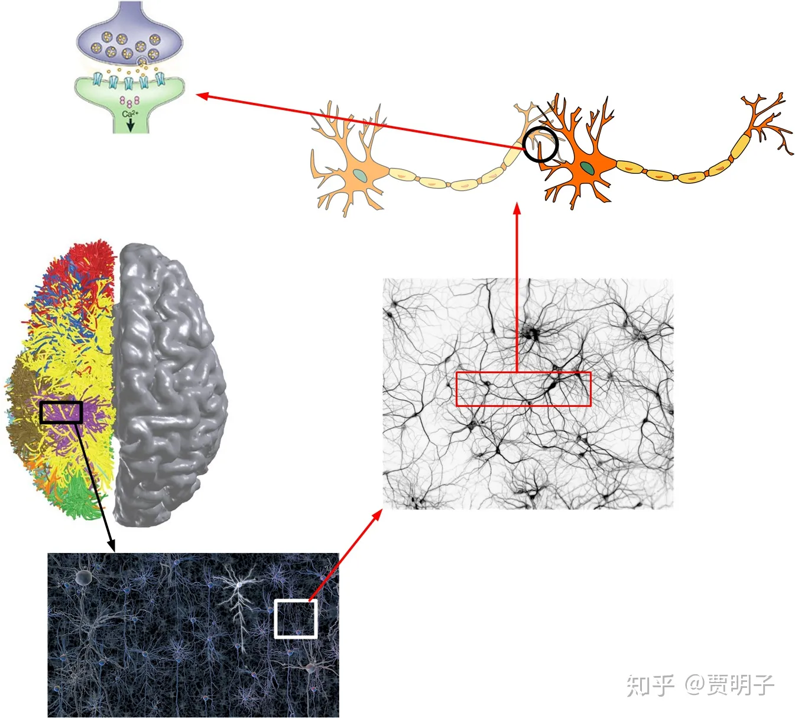
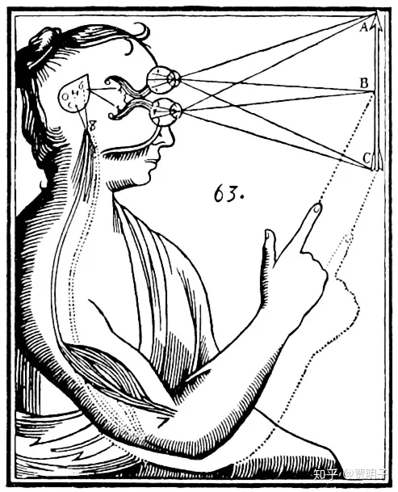
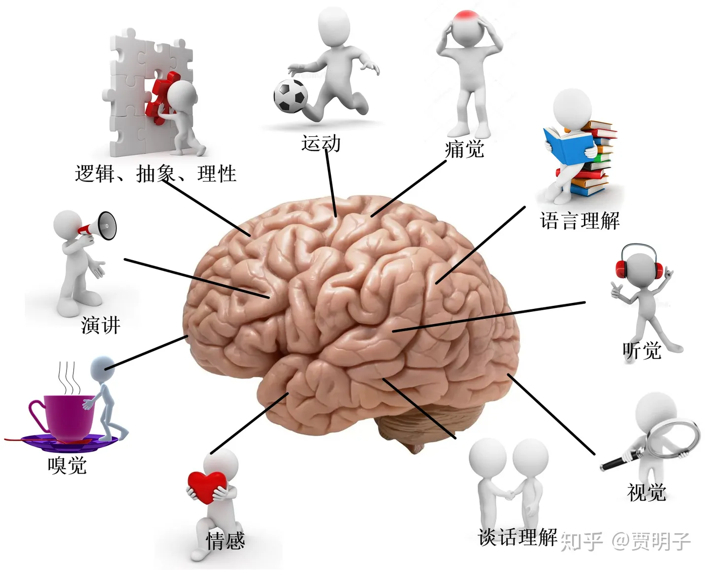
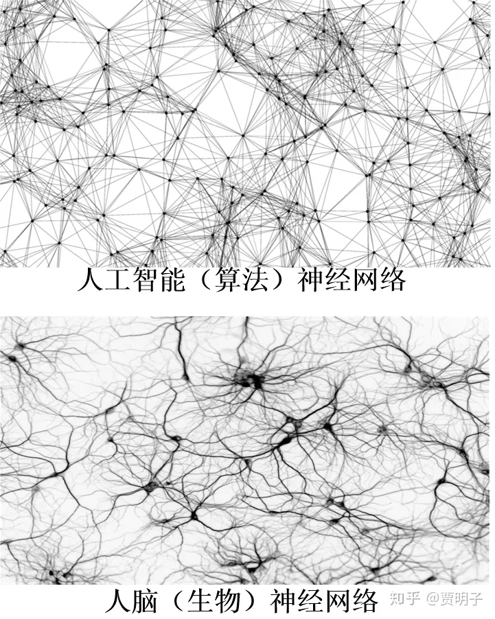
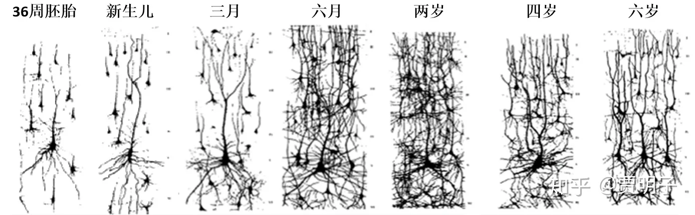
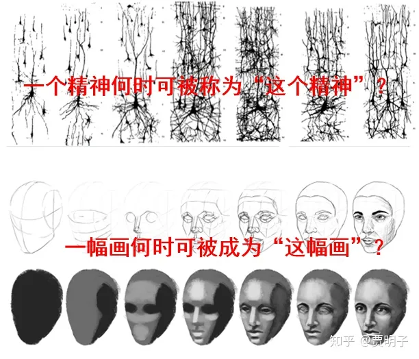

# 3、物质和精神

> **“天地不仁，以万物为刍狗”**
> **–** **老子**

前面我们讨论了有没有一个 “实在”的问题，我们现在来看看，这样一个“实在”，它会是一种怎样的存在呢？具体讲，它是一种“物质”的，还是一种“精神”的存在呢？

我们回到第一章笛卡尔的哲学沉思。他说，外部物质世界是存在的，精神世界也是存在的，但是两者是截然不同的两种存在，它们并立于这个宇宙之中。我们说，这叫做“二元论”。所谓的二元论，所涉及到的是哲学中一个重要话题，精神-物质问题：这个自然界的最基本存在，是精神还是物质？是物质决定精神，还是精神决定物质？。二元论的基本观点就是，精神和物质两种存在并立。

实际上，在我们很多人的下意识中，都会多多少少有一些二元论的观念，有时会不自觉地把我们的精神和肉体区分对待。例如说，中国古代把人的精神世界看作是由“三魂七魄”组成，认为精神是肉体的居住者，就算是现在，我们也经常说类似“精神和肉体的双重折磨”、或者说“好看的皮囊，有趣的灵魂”等等这样的话，二元论是一种非常符合人们直觉的理念。

但是，笛卡尔从“我思故我在”到达二元论的层层推理，却不像他自认为的那样可靠、无懈可击。这中间有着不少漏洞。比如说，他的关于精神-物质分立性的一个重要论据就是，作为精神的“我”的存在是无可怀疑的，而“我”的精神之外的一切都是可怀疑的，这就体现了这两者之间的根本不同：精神确定存在，而物质世界可疑。基于这种根本的不同，精神和物质世界当然是不同的。

但是，这个推理过程并不完美。这里所说的，无论是精神的“无可怀疑”，还是物质的“可怀疑”，都有一个暗含的前提，那就是“怀疑”的主语“我”。这里真正说的，其实是某种事物是否“可**被我**怀疑”，而不是它自身是否“可被怀疑”。离开了“怀疑”这个谓语的主体“我”，怀疑本身也就没有意义。那么，精神和物质可**被我**怀疑或**被我**确信无疑，这究竟是这个事物的性质，还是“我”的性质？如果说它是这个事物本身的性质，那么没错，我们的确可以根据物质的“可疑性”和精神的“不可疑性”来认定精神和物质具有两种截然不同的性质，因而它们就不会是同一类存在。但是如果它只是“我”的性质，那么我们显然不能用**“我”的性质**来作为精神和物质的区分依据，笛卡尔的推理就无可避免地崩溃掉了。

比如说，你和爸爸妈妈一起参加一个化装舞会。每个人都必需把自己伪装成其他人，因而你不可能分辨出谁是谁。那么你在聚会中不免疑神疑鬼，你看自己身边的爸爸妈妈都会用怀疑的眼光：“他们到底是爸爸妈妈，还是别人伪装的？”

那么，爸爸妈妈的这种“可疑性”，是爸爸妈妈自己的性质吗？还是仅仅是你的一种怀疑？你的怀疑，会成为爸爸妈妈作为一种不同存在的基础吗？显然，爸爸妈妈一直就是爸爸妈妈，不会因为你的怀疑而有所改变。

还有，笛卡尔关于上帝存在的证明。笛卡尔所认为的、“我”存在的那个因只能是上帝。因为它不可能是别的东西 – 别的不完美的东西我们可以继续追寻它们存在的因，因而陷入无限递归。此外，“我”可以想象一个**完美的**上帝，但是一个完美的东西不可能来自不完美的“我”，因此我心目中关于上帝的完美印象必然是来自完美的上帝本身。

但是这个论断也有问题。首先，我不知道笛卡尔如何想象出的一个“完美的”上帝。在我贫乏的想象力中，这是一个无法完成的任务。比如说，上帝可以像拉普拉斯之妖那样预测一切未来吗？如果能，就说明他自己的一切未来都是注定的，他自己连自由决定的余地都没有，何谈完美？如果不能，那么上帝显然也不能算是完美。类似的悖论还很多，最简单的莫过于“上帝可以制造一块自己搬不动的石头吗？”。从人类的逻辑来看，一个完美的上帝总是充满了自相矛盾的，如果我们非得说，上帝是超越人类逻辑的，因而我们的逻辑悖论对上帝无效。那么请原谅我这个不完美的造物，我真的无法想象一个**超越逻辑**的存在。

既然我们自己都不可能想象一个完美的上帝，那么笛卡尔所说的，完美的形象不可能来自不完美的“我”，因而只能来自上帝本身，就无法立住脚了。

那么，进而，笛卡尔所断言的，“上帝是完美的，因而不可能欺骗我，因而我感觉到的外部世界必然是存在的。”也就难以自圆其说了。于是我们就又回到怀疑论的起点：**这个世界，除了我自己，我还能确信其它任何存在吗？**

我们退一步，即使说“我”的存在必须起源于某个完美的“第一因”，我们为何非得要把这个第一因归结于上帝呢？为何不是释迦牟尼或是太上老君？或者不是一个一神论的上帝，而是某种多神论的多个神，或者是**泛神论**的自然界？

综上所述，笛卡尔所坚信的，本着怀疑的态度、从“我思故我在”这个坚实的理性基础出发、层层推理得到的上帝存在以及二元论思想，其实并非像笛卡尔一开始的雄心壮志那么可靠。当然，这并不能说明这种二元论是错误的，只是说明，二元论并非像笛卡尔所说，从纯理性即可**证明**为确定无疑。

前面提到的“泛神论”，简单讲，意即认为上帝（或者其他某种whatever至高无上的存在）就是自然界本身（例如中国人常说的“老天爷”），而不必是一个精神的、人格化的、具有道德和美德的神。再简化一点说，如果有一个至高无上的存在的话，那么它是**自然界的终极规律**：自然界的一切事物都必需遵循它的支配。而这个终极规律，从它支配一切的意义上讲，就是上帝，但是它和基督教的上帝、以及佛教的释迦牟尼、道教的太上老君、乃至古希腊多神论传说中的宙斯阿波罗雅典娜诸神、中国古代盘古女娲伏羲诸神等等一切神灵完全不同：它冷冰冰地按照自己的既定规则运行，或者说它就是规则本身，而不具备人格和美德。这和中国道家思想中的“道” 就非常能体现这种泛神论的观点。例如《道德经》中说：

> **“天地不仁，以万物为刍狗”**

这句话表面上看，似乎是在控诉命运的不公和天地的不仁，其实并非如此。这句话所的意思，说的是作为支配万物的“天地”，本身不带任何感情，是一种纯粹的支配规律。万物，包括有生命的、无生命的、人类、小猫小狗、善的、恶的、美的、丑的，在“天地”的眼中，全部如土鸡瓦狗一般，一视同仁。既为“万物”，则必然无差别地遵守“道”的支配。

这里的自然神，归根结底说的是一种信念：自然界的一切存在和运动，都遵循某种规律。这种规律是先于一切而存在的、至简且至高无上的。体现在自然科学中，就是各种定律 – 当然这些定律只是对“自然神”从各种不懂角度的近似描述，而绝不像经验主义思想所认为的，定律只是人们用来整理自己经验的工具。

泛神论的代表人物叫做**斯宾诺莎**，他是荷兰哲学家，是当时理性主义思想家的代表人物之一。他出生在犹太家庭，早年是犹太教的信徒，但是渐渐受到笛卡尔等人的影响，偏离了犹太教的信念。他的“泛神论”说白了，其实完全可以认为就是“无神论”。他反对一切宗教中的人格化的、超自然的神，而认为自然界整体就是“神”、万物皆神。因此他不但被犹太教所不容，而且得罪了当时的所有主流宗教。后来搬离了自己的家，遗世独立，独自一人醉心于磨制镜片，过着清贫的隐士式生活，不幸因为镜片的粉尘患了肺病，年仅45岁就去世了。此人清心寡欲，淡泊名利，有着很高尚的情操，但是因为泛神论的观点为当世之人诋毁。但是他的“自然神”却成为后世很多科学家所钟爱的理念 - 它给了自然科学家们一个非常诱人的奋斗目标：“终极自然规律”。正是这个看起来非常崇高的目标，让无数的科学家们孜孜以求。爱因斯坦曾经不止一次说过，他不相信一切宗教，但却是斯宾诺莎的信徒[[1\]](https://zhuanlan.zhihu.com/p/42043099#ref_1)。他的一句名言：

> ***“上帝不掷骰子”\***

其中的“上帝”完全无关宗教，而是在表达一种信念：自然界有着确定无疑的规律。

斯宾诺莎的泛神论无疑与笛卡尔的二元论不同，它认为精神和物质都是这个自然界统一体的一部分。因而他是一种“**一元论**”的观点[[2\]](https://zhuanlan.zhihu.com/p/42043099#ref_2)。

顾名思义，一元论所持有的观点认为，这个自然界的终极存在只有一种，而非笛卡尔的物质-精神并存。那么，在物质-精神之间的关系方面，一元论的持有者要么认为物质是终极存在，精神只是物质的体现 – 被称为**唯物主义**；要么认为精神是终极存在，物质只有在精神中才得以存在 – 被称为**唯心主义**。当然，还有一小撮人持有所谓**多元论**的思想，即认为物质和精神之外，还有其它存在形式。

唯物主义是一种非常符合我们直觉的一种本体论思想。例如说，我们前面提到的苹果，一个苹果，是不依赖与任何精神而存在的特定的物质：它是红绿色的、圆的、光滑的、香甜的。这一点，不论我们有自我意识的人类是否存在、是否在观察它，都是属于它自己的性质。苹果的存在就是一种独立的存在：它是由一大堆细胞组成的，进而是各自糖类、纤维素、蛋白质、核酸等大小分子组成的，再进而是由碳氢氧氮硫以及各自微量元素 – 以及构成它们的中子质子电子组成的。苹果的存在和任何意识或精神无关，早在这个世界上人类出现之前，就已经有苹果、有各种化学元素、以及微观粒子存在了。不论是我们何时观察它、在何种场合观察它、亦或是何人观察它，我们总是可以观察到一种表现一致的苹果存在 – 因而我们自然而然地相信，苹果就是一种独立于精神存在的物质。

然而一个比较纯粹的唯物主义对物质的定位并不止于此，还包括了**物质对精神的决定作用**。借助于现代医学和生理学，我们得以对人脑和神经系统有了长足的进步（但是相对于人脑的复杂度而言，仅仅是九牛一毛而已），基于此，一种强唯物主义认为，我们人类的意识和精神，其本质就是一堆神经元细胞以及细胞之间的化学递质组成的庞大无比的电路系统。这个电路系统由细长的神经元细胞之间的连接作为“线路”、神经元之间的化学递质以作为“开关”、以及细胞膜主动地对一些带电离子的运输作为电源，构成了电信号在这个电路系统中的各种不同方式的传输。结果就是各个神经元细胞以不同的“图样”（pattern）处于激发和未激发状态 – 这种图样的变化就形成了我们的精神活动：感觉、记忆、乃至意识。

例如说，我的眼睛看到苹果，是因为苹果的反射光进入到我的瞳孔，经过眼睛的晶状体成像，汇聚到眼底。眼底被光线照射的感光细胞因而进入激发状态，产生一系列电脉冲。这些脉冲沿着细长如丝的神经元细胞向大脑传输，经过一个个神经元的接力，这些电信号传入大脑中的相应区域，对脑细胞产生刺激，使得该部位脑细胞一部分处于激发状态：这种不同的脑细胞的激发状态、以及这些脑细胞之间的相互连接关系，就产生了各种各样的视觉：于是我就看到了苹果的红色和绿色。

这个“看到苹果”的过程在现代医学中已经有了很坚实的解刨学基础了，令人惊异的是，在笛卡尔当时的年代，他就已经猜到类似的过程，并在著作中实际地表述出来了[[3\]](https://zhuanlan.zhihu.com/p/42043099#ref_3)：

现代医学对大脑的研究刚刚起步，但是已经使人们获得了关于人类精神活动的某些洞察。科学家们通过对精神病人、大脑损伤病人、以及一些其他实验和解剖的研究，对大脑的功能的认识在一步步加深。下图大概表示了人的大脑中不同区域的主要功能：

近年来，人们模拟人脑的工作方式，开始在**人工智能（AI）**中开发相应的算法（神经网络算法）。在这种算法中，所有的复杂运算全部是由很多个独立的运算单元（神经元）协同完成的，每个神经元的运算都很简单，但是这些神经元相互之间的连接方式却又很多种。随着神经元数目的增加，这种相互连接的复杂程度也会呈指数速度增长，形成一种以神经元为节点的巨大的网络。这种网络以何种方式进行连接、编织，以及每个连接的强度，就决定了整个AI的运算能力和运算效率。在学习的过程中，这些节点的运算强度以及整个网络的连接程度会随着外部信息的不断输入而不断调整、适应。一般而言，网络的连接越复杂，运算能力就会越强大，但是相应地所需要的运算资源（更好的硬件，更多的能耗等等）就越大。因而在学习过程中，不但是要实现更强大的运算能力，而且要实现更好的运算效率。人工智能的不断学习，就是在不断地更新和健全这个网络的过程。

那么在整个AI系统中，并没有某个运算节点承担关键的运算过程，但是所有的这些神经元通过神经网络连接起来，协同运算，最终就可以实现很复杂的运算过程，诸如人脸识别、实时翻译等。

我们尚不知道人类的精神活动是否和AI算法是一样的，但是很多迹象表明，二者是有相似性的。比如说

- AI中不存在一个（或多个）神经元作为运算中枢，而是整体实现预定功能；人脑中也不存在某个神经元或某一撮神经元（诸如笛卡尔所猜测的、精神居于其间的松果体）作为运算中枢，而是整个大脑协同完成精神活动。
- AI中如果损伤若干数量不多的神经元，基本上不会改变整个AI的“性格”；人脑中会有神经元的死亡，但是也不会改变一个人的“灵魂”。
- AI在学习和强化自身的过程中，并不会增加自己的运算节点的个数；人的神经元细胞个数在一出生就已经定死了，后续成长发育中也不会再增加。
- AI在学习过程中，运算节点之间的连接会不断更新、强化（或弱化）；人在学习过程中，内部神经元细胞的连接也是如此。

在人大脑中，神经元细胞通过长长的触须互相连接，这些连接之间可以传递电信号。当某一些连接之间频繁传递信号时，这些连接就会不断强化，最终成为一种近似永久的连接；而当一些连接中的信号传递很少的时候，它们之间的连接就会越来越弱，最终完全断开。因此，当我们不断从外界获取信息，这些信息在大脑的神经元之间不断传递，就会导致有的连接强化，而有的弱化。因而根据我们的经验不同，大脑内部的连接就会形成相应的网络，这种网络与我们日常经验相适应，以帮助我们在这个环境中生存下去。久而久之，大脑就形成了我们现在这种样子：有着各种感官、记忆、技能、思维能力、情感等等。整个过程中，神经元细胞的数量并不变化，所变化的，是神经元之间的连接。下图所表示的，是科学家对不同年龄的大脑所拍的“照片”：

我们可以看到人在不断成长和学习过程中，大脑内部网络的变化。在胚胎期或新生儿期，这种网络相对简单，神经元之间的连接寥寥无几[[4\]](https://zhuanlan.zhihu.com/p/42043099#ref_4)。但是随着出生，新生儿开始大量从外界获取信息，就像AI的学习过程一样，婴儿开始根据这些信息学习起来，这就使得大脑中神经元之间的网络快速成长起来，迅速变得复杂。到两岁的时候，每个神经元的“触须”会从出生时的2500个变成15000个左右。这时幼儿的大脑中信息像发了疯一般传递[[5\]](https://zhuanlan.zhihu.com/p/42043099#ref_5)，来帮助新生的宝宝快速地学习外部环境。在两岁的时候这种网络达到顶峰，随后，随着宝宝不断重复经历一些经验，相应的连接会不断强化，而不太重复经历的经验，相应的连接就会慢慢消失。这样，人们就不必在那些不太有用的信息处理[[6\]](https://zhuanlan.zhihu.com/p/42043099#ref_6)中耗费过多的能量，因而达成最好的费效比。到六岁时，大脑中的网络基本上跟成人相差无几，每个神经元的“触须”大约降到7500个左右。但是这个过程中，宝宝不断重复学习和经验的信息基本上达到了永久性的连接，大脑至此形成了一个整体协作的系统。这也是为何我们往往并不能回忆起两岁以前的记忆的原因：因为那些连接在后续学习中都断开了。并且，种种迹象表明，2岁以前儿童并不具备像成人那样完备的自我意识，这似乎也可以归结于大脑发展的拐点：2岁前先建立各种有的没的连接，之后再对这些连接进行优化，作为人类精神活动最高级的自我意识，于是就产生了。

这个学习过程，和AI的学习过程何其相似。

基于这些生理学的发现，我们很容易对人的精神活动获得这样一种认知：**人的“灵魂”，就是由大脑中数以百亿计的神经元之间的相互连接形成的网络所决定的。**这种网络，就像是一幅油画，它把一个人的精神整体给绘制出来。一幅画，并不取决于画布上某一点的颜色，也并不是由画布上某一小块的区域的颜色决定的。相反地，从每一个像素的微观角度，在这块画布上，没有哪一点的颜色会比其它地方更加重要[[7\]](https://zhuanlan.zhihu.com/p/42043099#ref_7)，只有当我们在欣赏这些颜色之间的相互关系，因而把这些颜色在画布上的排列当做一个整体来看时，我们才能欣赏这幅画作。但是同时，一幅画中，从宏观角度看，某一些“重要的”区域，其色块更加能够决定这幅画的整体风格（例如蒙娜丽莎的嘴角显然要比她的背景更加“重要”），这些“关键区域”与人们大脑中的关键区域何其类似。当我们观察这幅画的创作过程时，从一块空白的画布，到简单的线条色块，渐渐成为一幅画，我们并不能说清楚它究竟是何时变成了“这幅”画，同时，当画布因为年久难免有些地方损坏时（例如老照片渐渐发黄），虽然单纯从颜色的角度上讲它已经不再是原来的样子了，但是我们仍然能够认出原画的神韵 – 就好像一个人，即使是记忆减退，或者是脑震荡使得部分机能受损，我们仍然可以清晰地辨认出他是谁。前面我们曾经说过，一首歌可以无损地画成一道连绵起伏的山峦，**如果我们想要对一个人的“灵魂”无损地作画，那么他大脑中的神经网络图无疑是最好的画作** – 当然这个画作无疑复杂到令人头晕目眩。

进而，我们可以说，人的精神不是某个特定的过程定义的，更不是像一般的二元论中描绘的，大脑内部存在着某个“小精灵”类似的灵魂来定义的，而是当我们纵观全部神经元的集体行为时，渐渐浮现出来的 – 这是一个地地道道的**“涌现”（emerge）**过程。所以说，精神之成为精神，它的边界是模糊不清的，一个“灵魂”有没有意识，能不能称之为灵魂，我们找不到一个严格的标准，就像是我们一粒一粒地把沙子堆起来，何时我们能把它称之为“堆”那样；也好像一幅画从白板起始创作过程中，何时可以被称为“一幅画”那样。从一个个神经元起，到何种规模即可称之为“精神”也是渐进的过程。

这个，在我们这些从小熟悉无神论和唯物主义思想的人看来，似乎是一个自然而然的事情，然而在很多西方国家里，那些浸淫于宗教信仰的人们看来，是很惊悚的。著名的生物学家 - DNA结构的发现者 - 克里克在他的著作《惊人的假说》当中说道：

> ***“惊人的假说是说，‘你’，你的喜悦、悲伤、记忆和抱负，你的本体感觉和自由意志，实际上都只不过是一大群神经细胞及其相关分子的集体行为，正如刘易斯·卡罗尔 （DewisCarroll）书中的爱丽丝（Alice）所说：‘你只不过是一大群神经元而已。’这一假说和当今大多数人的想法是如此不相容，因此，它可以真正被认为是惊人的。”\***

所有这些现代科学的发现，无疑为“物质决定精神”的唯物主义提供了大量例证。然而，这却不能证明精神最终是决定于物质的。

首先，如果说一个足够复杂的神经网络即可自然而然地涌现出精神活动，那么我们完全有理由认为，AI在复杂到一定程度后，必然也会产生像人一样的“灵魂”。而这一点，我们还远未达到共识：相当主流的一部分观点认为，AI不论如何发达，无论如何都不可能像人类那样产生自我意识、以及七情六欲。这种观点到底是坚守了人类的精神家园，还是只是一种自我膨胀的大人类主义？我们仍然期待后续的IT行业发展给出进一步例证，也许有一天，就像当初热力学第二定律宣称“不可能存在第二类永动机”那样，我们也会出现一个AI定律“不可能存在类人AI”。也或许像当初蒸汽机和发电机石破天惊地面世颠覆了整个世界那样，能够达到人类智慧水平的AI在某一天真正地成为这个世界中的一种生命。我们只能拭目以待，至少在现在一些比较流行的AI软件诸如微软的小娜、苹果的Siri，还远远达不到与人类意识相当的智力水平，或者说，还仅仅是一个稍微复杂一点的能够对各种外部输入产生机械反应的冷冰冰的程序。

当然，我们也可以反过来，认为我们人类自己，也不过是类似的冷冰冰的程序 – 只不过复杂得多，乃至于骗过了我们自己。这无疑让很多人无法接受。并且，我们在意识到外界信息（例如苹果的红色）的同时，我们还意识到我们意识到了外界信息。“我思故我在”，一个仅仅响应外部刺激的程序，是不能意识到自己的存在的。我们很难认为我们的自我意识也只是一个对外界冷冰冰的响应而已。

进一步说，我们可以考虑某些广义的“神经网络”。一个著名的问题叫做**China brain问题**，这是1974年Lawrence Divis提出来的。问题最初是这样的：

***如果十亿中国人每人一个对讲机实时与其它人保持实时通讯，那么整个中国作为整体会不会产生独立意识？\***

这里，是用大量的个体人代替了大量的个体神经元细胞，来模拟我们的神经网络系统，当每个人都可以与其它人产生实时的联系的时候，作为这个人群的整体，按照前面的原则，每个人的大脑都会成为网络中的一个运算节点，通过某种快速链接的方式，把所有这些节点串成网络，组成一个巨大的运算系统，必然可以自发形成某些协同运算，这和神经网络算法何其相似。那么中国本身也就很可能也会成为一个更大范围的超级大脑。进而国家意志、社会道德、法律系统、文化传承等等可以看做是“中国”这个超级大脑的情感和理智。再说到底，问题就是：**一个足够复杂的神经网络系统，是否可以自发产生自我意识？**

现在大家沉迷于移动网络、微信、社交平台，人与人之间的关联，要远远高于1974年人们想象的“每人一部对讲机”那种简单的联系。不但是人与人之间的联系空前快捷密切，人与电脑、手机、各种智能终端（自动驾驶系统、智能家居系统等等）都在互相连接，人脑和各种电子终端，它们各自构成了这个巨大的运算网络中不同形式的运算节点。**我们似乎正在不自觉地进行这个无比宏大的China Brain实验**，并且似乎，这个实验正在向着预期的方向发展：社会神经网络在一步步强化。未来我们人类整体会不会经历类似新生儿的神经网络急速膨胀，然后再整合统化[[8\]](https://zhuanlan.zhihu.com/p/42043099#ref_8)那样的过程，进而产生独立的国家大脑？

细思恐极。

但是，这个庞大的实验其结果我们应该永远无法知道：一个神经元细胞能知道大脑的意识吗？

我们不妨进一步海阔天空地联想，想象一下整个地球上的人类获得了整体意识。那么，地球本身就变成了一个生物，所有的人类和各种智能终端就是神经元，而整个地球的生态系统包括山川、河流、大地、空气、等等一切，则是维持神经系统运转的内环境。而太阳则是生物地球的食物 – 地球靠摄取太阳能生存。如此一来，难道是万物有灵？

这一点可能对很多人来说，都未免有些脑洞大开了。但是它却符合上面的一切逻辑。我们知道，生物的进化最早起源于一些简单的蛋白质和核酸：核酸是生命的遗传信息，而蛋白质则是核酸用于构建一个用于支持自己稳定存在和有效复制的环境的材料。进而就有了病毒、单细胞生物。然后多个单细胞聚集在一起，就可以更高效地改变自己的生存环境，而构建和维持这个环境的材料就越来越多样化，成为生物的核心 – 遗传物质 – 以及维持核心生存的基础设施 – 各类器官、组织的生态社会。直至最后的人类。而人类同样聚集成一个社会，共同协作用周围的材料来构建适于自己生存的环境：从最早期的房屋、衣服、工具一直到畜牧、农业、工业。直至今日，电气化、信息化等等。那么人类社会，包括支撑人类社会的一切基础设施，为何就不能构成一个超级生命呢？

那我们能否可以再疯狂一点，想象一下整个宇宙就是一个巨大的整体意识？这似乎把我们引向了另外一个极端 - 黑格尔的“绝对唯心主义”。

当然，黑格尔是不懂我们现在所说的这些神经系统的生理学知识的，而他的哲学思想和我们这里所说的宇宙整体意识还是很不同的，但是他所认为的 - 世界的存在就是“绝对精神”，而我们不过是这个绝对精神的一部分 – 却有异曲同工之妙。

然而，我个人觉得，唯物论的“精神是物质的涌现现象”这一观点，最大的困难在于**主客观之间难以弥合的鸿沟**。

如果我们坚持认为，精神是物质的涌现现象的话，理论上，我们必然可以仅仅通过对客观物质的描述来描述一切主观的精神行为：我们描述构成一个人神经系统的客观物质 - 每一个神经元以及神经元之间传递的那些信号，就可以描述这个人的一切主观世界。但是这如何可能？当我看到一个苹果，我会对这个苹果得到一种主观印象：它是红色的、圆的。请注意，这里的“红色”，甚至说“颜色”本身都是一种概念化的语言，我们把它和我们真正的主观感受建立一一对应的联系，用来整理和表述这种感受，但是“红色”这个概念与我们真正的对“红色”的主观体验是完全两码事 – 这种“真正”的体验是难以言喻的，专属于我个人主观的。说到底，我们现在所谈论的一切，包括决定了精神现象的客观物质，都必须是基于我们个人的主观概念的，脱离开主观体验，我们甚至无法理解客观世界。那么，用这种建立在主观之上的概念，来谈论脱离主观的客观世界，并试图以它来解释主观世界，岂非不那么可靠？

对这个问题，另一类的唯心主义观点的看法是，以精神为主，物质为客。

既然我们对外部存在的认知必然是基于主观的，那么我们就必须承认，谈论脱离主观的外部世界毫无意义。著名的唯心主义者贝克莱有句名言，叫做：

> ***“存在就是被感知”\***

就是这个意思。我们只知道我们可以感受到的东西，而那些无法被我们主观接受的一切，根本就无所谓存在。我们日常所说的“这儿有一个苹果”其实是一个误会，我们应该说“我**看到**一个苹果”。我们只能谈论我们看到了什么东西，至于我们看到的是个幻象还是个“存在”，超出我们主观感受之外，不可能被我们感知，因而也就无从谈起[[9\]](https://zhuanlan.zhihu.com/p/42043099#ref_9)。即使我们硬要谈论，我们也不可能知道对错，所以它只能是是空洞的。

判断是否存在一个精神之外的物质世界，我们可以考虑这样一个问题：假如“我”不存在了，外部的世界还会不会继续存在？这类唯心论的观点认为，这个问题毫无意义，因为这是作为主观的“我”提出的问题，既然“我”本人都已经不存在了，那这个问题当然也就不存在了，何谈外部世界？

我们前面看到了现代生理学以及信息科学在大脑和神经系统的研究中的重大进展。这些都是实实在在的科学结论，我们必须要承认的。那么在这么多的例证面前，唯心主义是否已经被否定了？其实也不然。

从唯物论的角度出发，大量的微观结构组成了神经系统必要的构建材料诸如蛋白质之类，这些材料构建成了无数的神经元，它们之间形成的网络形式，这些统统都是不依赖与精神的物质世界。而这种神经网络形式决定了大脑的思维过程，因而物质决定精神。我们可以把这个故事反过来再讲一遍：即这些生理学结论并不能说明**精神是神经网络决定的**，而是**精神借助于神经网络得以具体实现**。

我们仍然以计算机系统作为类比。我们知道，计算机系统分为软件系统和硬件系统。软件系统包括了所有的数据、指令、信息等等，而硬件包括了软件的各种载体和实现方式诸如存储器、CPU、键盘鼠标等。我们把精神类比于软件，神经网络类比于硬件。比如说你在玩王者荣耀，那么软件层面上，包括各种人物、人物属性、对人物的各种操作指令、整个由程序搭建起来的虚拟世界。而在硬件层面上，则是各种电路、逻辑门、存储器、输入输出设备等等。站在硬件角度上来说，我们搭建了一个复杂无比的电路系统，一且都是电流窜来窜去、各种电子元件开关、磁盘的磁场分布等等，最终表现出来的，是王者荣耀游戏在输出设备（显示器、音箱）上与人的交互。而站在软件角度上说，王者荣耀的游戏规则设定好之后，按照规则编好程序，然后计算机硬件不过是实现这些软件功能的一种工具。孰先孰后？谁决定了谁？

再比如说，人的学习过程，我们可以说是大脑不断地受到外界信息刺激，使得神经网络中的某些连接更加强化，因而**神经网络的结构（物质）发生了变化导致学习了新知识（精神）**；但是我们也可以反过来说，是我们为了学习而不断寻求外界信息的输入，从而不断改变神经网络的物质结构，使得我们的学习成果得以实现，是我**们的学习（精神）改变了大脑的神经网络结构（物质）**。

我们不得不说，在这里只能是公说公有理婆说婆有理，谁都无法证实自己、证伪对方。诚如罗素的所言，关于形而上学的很多基本问题，绝大多数是信仰，而非严格的真或假。关于精神-物质问题也是如此。

到现在为止，我个人还是愿意用更加广泛一点的**物理主义**观念来看待主客问题：对意识行为的描述，都可以等效于某一个物理过程的描述。比如说，我们对我们某种主观情绪的描述，可以等效于对生理过程诸如激素分泌、扩散、神经电传导、神经网络的激发状态等的描述。但是，这和狭义的唯物论的区别在于，我不去区分主客之间何为“第一性”。

下一章：[贾明子：4、我们如何认识世界：理性还是经验？](https://zhuanlan.zhihu.com/p/42119989)

上一章：[贾明子：2、形而上学是什么？](https://zhuanlan.zhihu.com/p/40119556)

专栏传送门：[何为现实？拉普拉斯之妖与薛定谔猫之决战](https://zhuanlan.zhihu.com/c_186387023)

本文同步更新于微信公众号，欢迎扫码关注：

------

## 参考

1. [^](https://zhuanlan.zhihu.com/p/42043099#ref_1_0)这一点，在很多不严肃的网络科普，乃至一些宗教人士的口中，往往被无意误解或有意曲解了：它们认为爱因斯坦曾经在大量场合中口称“上帝”，因而他是相信基督教的。爱因斯坦本人明确说道： “It was, of course, a lie what you read about my religious convictions, a lie which is being systematically repeated. I do not believe in a personal God and I have never denied this but have expressed it clearly. If something is in me which can be called religious then it is the unbounded admiration for the structure of the world so far as our science can reveal it.”（你们所读到的关于我的宗教信仰的东西，都是一个谎言，一个被蓄意反复提及的谎言。我不相信任何人格化的神，对此我从未否认，相反我曾经明确表明过。如果我内心中有什么可以被你们称之为“宗教”，那么就是我对自然科学所揭示的世界的结构的无限崇拜。） 事实上，如果我们把爱因斯坦的关于“上帝”的名言中，所有的“上帝”二字全部替换为“自然”，绝大多数对他的原意毫无影响。
2. [^](https://zhuanlan.zhihu.com/p/42043099#ref_2_0)斯宾诺莎并没有明确提出物质-精神中哪一个更加基本，在他看来，物质和精神都是自然神这个统一体的组成部分。因而我们似乎很难将其定义为唯物或者唯心。一般国内似乎把他看做唯物主义的居多，而实际上，他并没有明确提出物质决定意识。
3. [^](https://zhuanlan.zhihu.com/p/42043099#ref_3_0)当然，笛卡尔也有很低级的猜错的地方。在他的二元论体系中，一个核心问题就是，既然精神和肉体是分立并存的，那么精神和肉体是如何交流的？笛卡尔坚定地认为人的精神位于大脑中的一个小小的腺体：松果体。松果体是人的精神和肉体交互的地方，人看到的视觉体验就是被送到松果体然后被精神处理。这个论断看起来十分儿戏，当然后来被证明是错误的。
4. [^](https://zhuanlan.zhihu.com/p/42043099#ref_4_0)那些出生以前就已经建立起来的连接，就成为我们的本能和非条件反射：例如膝跳反射、以及新生儿的击剑反射和行走反射等等。
5. [^](https://zhuanlan.zhihu.com/p/42043099#ref_5_0)这就是为何小宝宝们往往有一些奇异的想象力，是成人们所达不到的。
6. [^](https://zhuanlan.zhihu.com/p/42043099#ref_6_0)那些我们日常中几乎不能经验到的、因而从进化角度讲我们不必对其形成有效适应的场景。
7. [^](https://zhuanlan.zhihu.com/p/42043099#ref_7_0)当然，一幅油画中，某一部分可能会是整幅画作的核心，它可以认为比另外的部分更加重要，但是这个作为核心的部分本身也是一个整体，而不是单独的一些像素点。就好像大脑中大脑额叶前扣带回，主控人类的学习、认知、情绪等能力，集中体现了精神活动的最核心地位。但是它也是作为一个整体与其他大脑功能区一起运作的，但是任何一个该区域的神经元细胞并不具有特殊性。
8. [^](https://zhuanlan.zhihu.com/p/42043099#ref_8_0)例如说，现在很多网络APP中所谓的“精准投送”或“个性化定制”之类，就是在根据个体运算节点的特征，针对性地强化某些连接，而弱化甚至断开某些连接。具体就表现为我们从自己的手机上越来越多地接收到某些类型的信息，而另外一些信息却基本上不会出现在我们的推送中，也就是说，我们和某类运算节点的联系在不断加强，而和另一类的联系在不断弱化。从万物互联的整体角度看，就是网络连接的不断进化过程。
9. [^](https://zhuanlan.zhihu.com/p/42043099#ref_9_0)甚至有一种语言学上的主张，认为英语里面最常用的单词“be”（有、是、存在）是一个麻烦，应该被彻底从英语中清除出去。这种去掉了Be动词的英语，被称为“E prime”或者“E’”

发布于 2018-08-14 19:25

