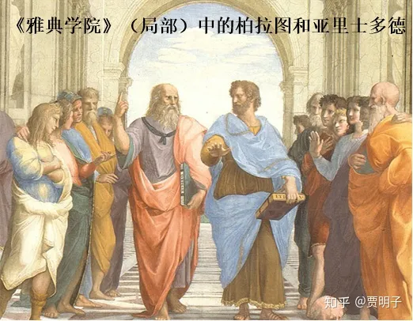
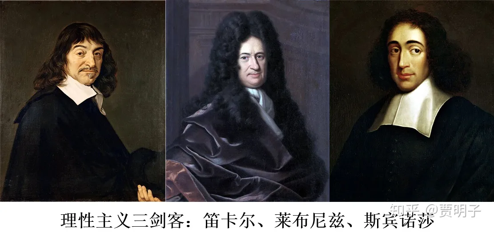
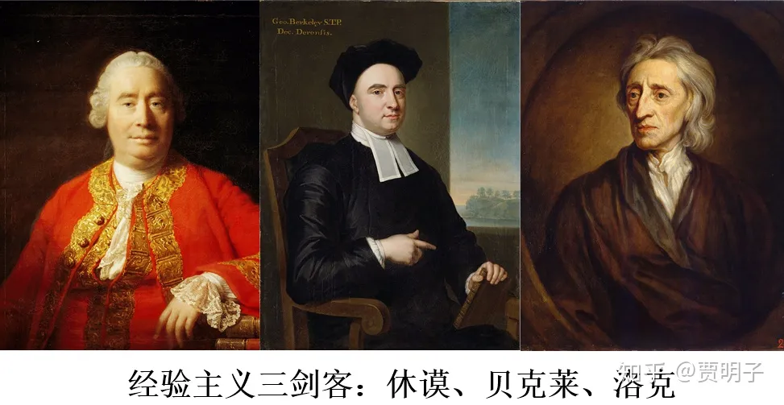
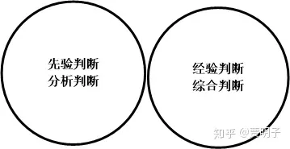
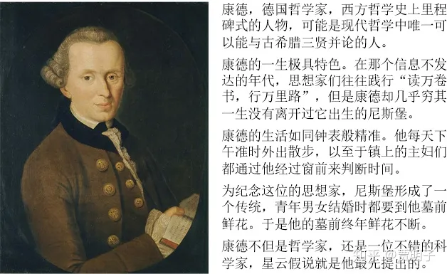
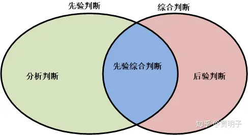
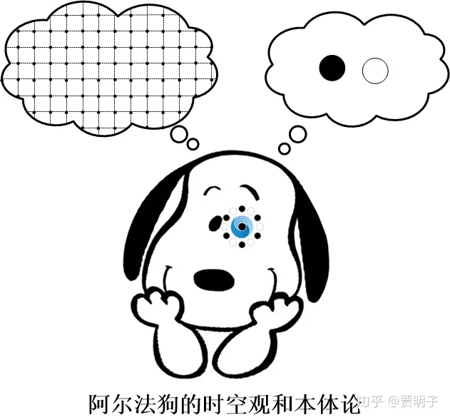

# 4、我们如何认识世界：理性还是经验？

> **“All our knowledge begins with the senses, proceeds then to the understanding, and ends with reason.”**
> **“所有的知识均源于感官，在向着知性行进的路上，最终到达理性。”**
> **-康德**

我记得你在小学五年级时，曾经和你的数学老师发生过一段有趣的对话。当时老师正在试图说服你们数学并非想象般困难，他说：“数学是天生就刻印在你脑子里的知识，我们学数学，不过是把你脑子里已有的知识发掘出来。”，这时你却站出来怼道：“老师，我相信经验主义。”当时我想你结结实实地把你的老师给惊到了。

这其实提出了一个很有意思，并且在哲学史上极端重要的问题，“知识从何而来？”这就是认识论的核心问题。

我们前面提到过，和“什么是存在？”这是一个**本体论**问题。而相对应的一个问题，“我们如何认识存在？”就是个**认识论**的问题。我们都对外部世界有我们的认识，从我们身边的琐细事物，例如“苹果是圆的，红绿色的，甜的等等”，到远在天边的星云，例如，“宇宙有150亿光年”；从微乎其微的基本粒子，例如“电子带负电荷”，到无比巨大的宇宙天体，例如“太阳是一个核聚变为燃料的火球”。那么，这些知识从何而来？它们是不是可靠的？存在不存在一个天生正确的真理？如果存在，我们如何知道我们能认识它？如果不存在，那么我们对知识的追求有何意义？这就是认识论的关注点，认识论是一个“我们能否、又如何认识世界”的问题。而**理性主义（唯理论）**和**经验主义（经验论）**，就是认识论的中的绝代双骄。

理性主义认为，理性是知识的源泉，这个世界是可以经过我们的理性思维加以认知的：通过逻辑推理，我们就可以知道知识的真或假。比如说几何。我们的世界上找不到任何纯几何的实际存在，没人任何人观察到过一个没有体积的点，也不会观察到一条没有宽度的直线、没有厚度的平面，当然，由这些点线面组合成的几何图形也不会有人真正体验到，但是这并不妨碍我们建立起几何知识，任何有理智的人都会同意它的正确性。相反，人的感官经验是有欺骗性的，我带上红色眼镜看苹果它就是红色的，带上蓝色眼镜它就是蓝色的，带上黑色眼镜……，好吧，带上黑色眼镜我就什么都看不到。而我们的五感本身的限制，就是一副有色眼镜，我们主观对各种感官的诠释，也是一副有色眼镜，所以基于经验的知识就必然是不可靠的、不足以成为真理。

而经验主义则认为，我们对世界的认知必须要经由我们的经验，也就是说，我们的感官从外界获得的体验才是知识的源泉：我们必须要通过对世界的观察才能获得知识。我们观察到一个苹果，才知道有苹果这种东西存在。我们对世界的认知是否正确，最终必须要由观察结果来判定，无论理论如何美丽和谐，看似无懈可击，如果它和我们观察的现象不符，那么它必然是错误的。如果我们失去了一切观察体验，我们甚至不知道有没有一个外部世界，根本就不可能有任何关于外部世界的知识。脱离了经验妄谈理性知识纯属空洞的思想游戏。

理性主义和经验主义在西方哲学中各有传承，应该说最早可追溯到古希腊哲学，柏拉图追求的是理性世界，而亚里士多德则更加注重感官经验。这在拉斐尔著名的壁画《雅典学院》中体现得淋漓尽致。图中位于诸位先贤簇拥的中心的二位，柏拉图一手指天，似乎在说，我追求的是超出感官的理性世界；而亚里士多德一手向地，似乎在反驳说，我希望更加接地气。

理性主义和经验主义这一对冤家之间的爱恨情仇，绝非只言片语就能说明白。也许，我们应该从一个简单一点的问题说起：**哪一些知识，是所有理性的人都认为正确无疑的（理性知识），而与这些人的经验无关？而哪一些知识，是人们必须通过观察世界（经验）才能获得的？**

我们说，知识就是我们对事物做出的一些**判断**。按照这个问题的答案就可以把这些判断分为两类，一类是**先验（a priori）**的，另一类是**经验**、或曰**后验（a posteriori）**的。

所谓先验，指的是先于经验，也就是说人们**不需要任何经验**就可以认识的、不依赖于观察的判断，因而是**普遍的和必然**的。

比方说，逻辑学里的同一律，A=A。无论是何种种族，何种性别，以前有何种经验，大家都会觉得这是毫无问题的。我们不必历数全部可能的命题就可以知道所有的命题都和它自身等价（A=A），这就是一种完全不依赖经验的理性知识。再比如说，我们不可能见过所有的三角形，但是我们肯定知道任何三角形都有三个角。对于你从来没有接触过的某个三角形，你也可以完全断言如此。你早上吃了若干油条，这个数目不可能既是3根又是5根。这个无论是谁都会同意的，否则我们肯定会认为他疯掉了（失去理性）。今年是2018年，如果我们一直生存下去，总有一年我们的日历上会写有2025年的字样，难道有人会根据他的经验来否定这个事实吗？

而后验当然指的是**通过经验**我们才能获得的判断，既然是依赖经验和观察的，当然就不会是普遍的，因为我们的经验不可能涵盖一切可能性，因而后验知识就是**局部的和偶然的**。比如说，苹果落地，这个就必须是我们的经验告诉我们的，虽然我们已经看到那么多落地的苹果，但是我们还是可以想象，有一个苹果飘在半空是什么样子的，一个漂浮的苹果，违背了我们的经验，但是丝毫不违背逻辑和理性，因而苹果落地就是一个经验知识。与之相对的一个先验知识的例子，我们就算是没见过苹果，我们也必然会知道红苹果是苹果。

=================

在笛卡尔看来，从可靠的先验知识出发，通过可靠的推理，最终获得的才是真正可靠的真理，所以很显然，笛卡尔是一个彻底的理性主义者。他的思想根源，很典型地体现了理性主义的特征。这从他的哲学沉思中就可以很明显地体现出来。笛卡尔的哲学沉思的最终动机就是，我们能不能找到一种无可怀疑的知识体系，从而justify我们现在所知的一切？从怀疑论出发，笛卡尔把人类知识中的所有概念全部当做“可疑的”而暂时抛弃，然后在对它们进行一一辨别：它是确定无疑的吗？只有那些确定无疑的，他才认为是可靠的知识。于是他发现了“我思故我在”，进而以这个为支点，他把那些暂时被抛弃的知识从基本逻辑推理出发一一做出判断分析，那些可以去掉可疑性的，我们就认为它是可靠的，而那些无法去掉嫌疑的，统统扔掉。于是乎有了我们前面章节的层层推理，以及最终的二元论。于是乎这些都是在一个确定的基础上、经过逻辑分析仔细检查过的知识，它们一定是可靠的，无论何人，他们有何种过往经验，都不得不承认它们。这是一个纯粹理性的知识体系。

所以，笛卡尔的怀疑论的根本就是，感官是会骗人的（笛卡尔恶魔），是不可靠的，因此想要根据感官经验建立知识，都是靠不住的。笛卡尔就是这样**从怀疑论的起点达到了理性主义的终点**。

我们前面提到的，泛神论的斯宾诺莎，以及数学宗师莱布尼兹，都是这种理性主义的死硬分子。例如斯宾诺莎的著作《伦理学》虽然讨论的是社会问题，但是它的著述却像是一本令人望而生畏的逻辑课本，里面就像是欧几里得的《几何原本》一样，是由命题、推论、定理等堆砌而成。而莱布尼兹，更是雄心勃勃地试图创建一套逻辑符号语言，以无可置疑的逻辑公式和逻辑运算描述世间一切。

这些理性主义者的共同点就是，从确定无疑的知识出发，经由严谨的逻辑推理、或纯数学的演算，推演出所有知识体系。只有这样我们获得的知识才是可靠的、正确无误的。而后验知识，基于其来源于不可靠的感官经验这一事实，必然是可疑的，应该被抛弃。当然，对待经验知识，不同的理性主义者也有温和和极端之别。笛卡尔本人就并不排斥经验知识，但是他并不把经验知识当做最终的真理，而只是把它们看做相对的、权宜的、暂时的知识 – 因为它们总是可疑的。

然而同样是试图从理性出发，寻求确定无疑的真理的三位，却得到了迥然不同的观点。我们知道，笛卡尔是个二元论者；斯宾诺莎认为自然界为一个整体，万物皆神；而莱布尼兹（可能与他的微积分思想有关）则认为万物皆可无限分割，直至一个纯精神的“单子”。大家似乎都遵循着严密的逻辑，为何得到的结论这么大相径庭？这似乎预示着理性主义的一些尴尬。

笛卡尔试图建立起纯理性的知识体系的努力，在他自己看来是令人满意的，但是其实从基础上就不那么完美。它的起点“我思故我在” 确实是角度刁钻，让人无从反驳：

- 我提出了“我是否存在”这个问题，说明我正在思考这个问题；
- 而我在思考，就必然意味着我一定是存在的，因为如果我不存在的话，思考就无从谈起，进而“我是否存在”这个问题也就不存在了；
- 所以，“我是否存在”这个问题就必然意味着我存在；
- 既然这个问题已经提出来了，那么我必然是存在的。

但是，这表面上看起来是一个严密的推理，其实却有着巨大的漏洞。在这个论断里面，反复地是用到“我”这个概念，而“我”本身就是一种自我定义的东西，因而极易陷入循环论证的大坑。这个推理的前提是“我思”，而结论是“我在”。请不要混淆一点，笛卡尔的逻辑并非是在说“我思”是“我在”的**原因**，而是在说，“我思”是“我在”的**证据**。因为我确切知道“我思”这样的证据，因而我可以断定“我在”。

**因为：**

（我确知）我思，

**故：**

（我断定）我在。

在我们谈论“我思”的时候，说的其实是“我明确知道我正在思” – 这是一种自我意识。所以当我们提出“我思”这个前提时，其实在暗中，我们说的是“我”有自我意识。然而，“我有自我意识”其实和“我存在”本来就是一码事儿。因为作为精神的“我”就是被我的自我意识所定义的。所以说，“我思”这个前提本身逻辑上就蕴含了“我存在”，那么由“自我意识”这个前提推出“我存在”这个结论，似乎有循环论证之嫌。

我这里并非在否认“我思故我在”这个论断，我只是在说，它在某种程度上只是**陈述**了一个命题，而不是在**证明**这个命题。它所陈述的，归根结底是说**一个有自我意识的东西必然会认为自己存在。** 然而自我意识的定义本身就是对自身存在状态的认知。从这个意义上说，“我思故我在”就像是“男人都是人”一样。它必然是正确的，但是却不是笛卡尔所认为的那种正确。

笛卡尔试图证明的观点是“我是存在的”，但是最终他想要证明的“我在”这个结论，是建立在我的自我意识（我思）的前提下的。自我意识（意识到自己的存在）难道不是一种经验吗？（是吗？不是吗？）那么这个论断的基础其实就是经验的、而非纯理性的。

=================

17世纪的欧洲大陆上是被理性主义所主导的。这可能多多少少与当时的宗教传统有关：那个超脱于人们感官经验之上的理性知识，正好为上帝留出了一个位置。但是，这些思想家们孜孜以求的终极真理，却令教会所不喜，因为上帝在这里已经成为一个象征性的摆设，他除了挂一个名以外，一切都被逻辑和数学这些纯理性知识所支配。无论是笛卡尔客死他乡，还是斯宾诺莎在磨制镜片中孤独一生，都和教会的压制有关。

然而在同时代（严格说，是稍微往后一点），一个一直与欧洲大陆充满了爱恨情仇的岛屿 – 英国 – 站在了它的对立面，成了经验主义的大本营。

经验主义者们的思想也各有不同，但是基本点是一样的：真正的知识必须来源于感官经验：我们的观察、实践等等，而不是来自于先天正确的理性推理。甚至说，我们所固执地坚信先天正确的“理性”本身，也是来源于经验。例如，洛克根本就否认理性的存在。我们人类先天没有任何知识，人之初，就是一张什么都没有的白纸[[1\]](https://zhuanlan.zhihu.com/p/42119989#ref_1)，任由经验在上面作画。一切知识都是经验在上面的画作，包括基本的逻辑规则和数学，也都是经验的结果。

而不那么极端的经验主义者们并不排斥先验知识的重要性 - 诸如逻辑、数学这些东西。但是人类的知识绝不止于此，真正的知识不是来源于理性，而是来源于经验。

我们在前面讲先验判断和经验判断的区别时，所举的几个先验判断的例子，其实都有一个特点：它的主语本身就已经蕴含了后面谓语所做出的判断了。那些主语本身就蕴含了谓语的命题，它们可以直接通过逻辑加以判定。例如说：

“男人是人”

“三角形有三个角”

“同时具有性质A和性质B的事物一定具有性质A”

在第一个例子里，主语“男人”本身的含义就是人的一类，它当然就是人。再比如说，三角形本身的含义就是有三个角的图形，因而仅通过主语我们就知道后面判断的内容一定正确。后面的那句话也是如此。

这一类判断，虽然对事物做出了一种描述，但是，这种描述的内容，本身就是蕴含在这个事物当中的，这种主语本身就蕴含了描述它的谓语的判断叫做**分析（analytical）判断**。很显然，对于分析判断，我们可以单纯从逻辑上就知道它是正确的，而不需要任何经验的参与，**所以说分析判断必然是先验判断**。

分析判断先验正确，但是它们往往看起来像一句废话：因为它只是在陈述已经被主语蕴含的性质。而我们关于自然界中的大多数知识，显然并不限于此：它们是对被判断对象（主语）本身蕴含的性质之外的一种判断。比如说，我们说，“红苹果是红的”这个判断里，“红苹果”本身就蕴含了“是红的”这个结论，因而它是个分析判断，是先验正确的，但是这却在重复已有知识。反过来，如果我们说“红苹果是园的”，“红苹果”本身并不能直接蕴含“圆的”这样的结论。那么这句话就是对“红苹果”本身含义之外做出了一个判断，这才使我们对“红苹果”这个事物有了一种**新的**知识。这类判断与分析判断相对，叫做**综合（synthetic）判断**，它无法通过主语蕴含的信息直接作出结论，而需要增加额外的素材才能完成判断[[2\]](https://zhuanlan.zhihu.com/p/42119989#ref_2)。

像休谟等典型的经验主义者认为，一切分析判断都是先验判断，而一切综合判断则都是经验判断，反之亦然，两者两两等价且互无交集。

经验主义者辩称，分析判断是理性正确的，但综合判断才是真正有用的知识，因为分析判断只能重复那些已有的知识，它既不能让我们得到新知识，也不能成为知识的最初源泉 - 只能重复已有知识意味着一无所知的基础上仍然只能一无所知，就好像我们不必通过经验就知道红苹果是红的，但是“红色”、“苹果”本身却是一些经验。离开经验我们只能空谈抽象的红和苹果，却不知道自己在谈论什么。而**只有综合判断才可以成为知识的源泉，并且给我们新的知识**，因而综合判断才是真正的知识。既然综合知识必然是经验知识，所以它只能来自于我们对外界世界的观察：经验才是知识的源泉。

如果我们不太严谨地理解它，分析判断是知识内容之间的相互联系，而综合判断才是我们知识的内容本身。

相应地，知识的获得方法也并非来源于严谨的逻辑推理，而是来源于归纳。我们可以观察到苹果总是落地的，“苹果落地”是只能从观察中获得的知识，我们不可能从某个抽象的逻辑命题就得到这种结论。我们看到所有的苹果都落地，那么我们归纳起来再推广到普遍情况，成为自由落体定律。然而，世间是否真的有这样一种支配苹果运动的“法则”，经验主义者说，对不起，我们永远不可能证明它存在，因而谈论这种形而上学的“运动法则”毫无意义。我们只能把理性当作一种**工具**，而不能当做**世界观**。我们可以用理性把我们的经验进行归纳梳理，但是千万别当真，觉得宇宙万物真的就遵循着某种理性的定律。

比如说，一个说明这个观点很常见的例子就是太阳升起。我们认为，太阳每天都会升起，但是这很显然是一个经验：我们以前每天都会看到太阳升起，那么我们就推而广之，认为太阳每天都会升起：

**我们观察过的**太阳每天都会升起→太阳每天都会升起

这个就是我们所熟知的**归纳法**。显然，归纳法与严密的逻辑推理相比，就不那么可靠。因为它本身并不能被一种严谨的逻辑所**证明：**我们凭什么通过有限的经验推出普适的知识？归纳+推广的过程，是从特殊经验出发，来对一个普遍规律、因而是未知经验的判断的过程。就好比说，我们对地球进行观测，得到一个严谨的世界地图，却以这个地图为基准，去判断火星地图，这无疑是荒谬的。我们无法完全信任归纳法，可是我们仍然固执地认为，如果有人宣称因为归纳法不可靠，所以明天太阳是否升起就是一件无法确定的事情，那么他一定不可理喻，可以被归于疯子之类。但是，从理性上，我们的确无法反驳这个疯子的结论：凭什么以前太阳每天升起，明天就一定会升起呢？人们对归纳法如此依赖，但是却很难说服一个怀疑论者这种方法是可靠的。

休谟就是这样一个怀疑论者，他说，“太阳每天升起”是我们基于过往经验的一个归纳和外推，但是我们没有办法真正证明太阳明天也会升起，因为我们不可能观察“明天”，只有当我们观察到它升起了，这个论断才会得到证明。从以前太阳每天升起，推广到明天太阳依旧升起，背后有一个假设就是**自然界遵循着一个固定的运行规律**。但是我们如何知道自然界有固定规律呢？不要把“我们现有的观察结果都满足特定的规律”当成证据，因为这本身也是归纳法 – 试图用归纳法说服我相信归纳法，你特么在逗我？

也就是说，太阳明天会升起，这是一个没有任何理性基础的论断。

当然，我们可以反驳，说太阳升起不是一个纯经验的结论。我们可以根据万有引力定律以及太阳系的状态，清清楚楚地算出来（理性推理）太阳明天会升起，甚至我们可以精确算出太阳几点几分几秒升起。但这说明不了问题，因为万有引力定律又是从何而来？难道不也是基于经验的吗？这个问题不过就变成了：

**我们观察过的**有质量物体间都存在引力→所有有质量物体间都存在引力

万有引力定律本身也是一个经验结论，我们既不可能经验过所有的有质量物体的运动、也不可能经验某一个有质量物体的过去未来的所有运动，因而它就找不到理性基础。我们没有任何办法可以理性地证明万有引力定律是正确的。我们只能证实**已经经验过**的事物都满足万有引力定律，然后**假定**物体运行存在着一个理性的定律。只有这样，我们才能说已经经验过的规律，**反映了**这个理性存在的定律。而这个假定，就是不可靠的。

那么，同理我们可以断定，**一切不完全归纳法得到的结论都是没有理性基础的，也都是不可靠的。**我们不能通过“归纳法已经取得了如此巨大的成功”来证明、甚至当做证据**说明**“归纳法可以获得可靠的知识”。因为从“**已有的**归纳法取得了巨大的成功”到“归纳法可以获得可靠的知识”这本身也不过是一个不完全归纳的推广。

休谟的观点十分讨厌，并不是因为它同时摧毁了我们知识的理性基础，以及经验主义自己所钟爱的归纳法，它还摧毁了我们知识的源泉：我们的观察体验总是有限的，而我们所追求的，却是普遍的规律，从有限到普遍，必然要有不可靠的推广。而这种推广，就动摇了我们一切知识基础。最最主要的是，对这种说法我们竟**无言以对**！我们没有任何办法可以把休谟的观点给彻底驳倒。

如果说对归纳法的批评已经够令人头疼了，那么对因果论的批判就更有甚之。休谟说，因果论只是人们的一个幻觉，因为我们永远不可能观察到“因”和“果”，我们所观察到的，不过是“前后序列”。比如说我们推了一把小车，小车就向前行进。这不能说明我们的推力是小车行进的“因”，而只能说，“小车行进”跟随者“推力”而相继发生。“因果性”是不可被经验所认知的，只有“相继性”才可以。就好像古人观察到闪电后总是跟着出现雷声，就以为闪电是雷声的原因，其实大谬不然，它们只是先后被你感知到而已。

失去了因果论，是一件让当时思想界发疯的事情，人们无论如何都不能让休谟这么猖狂。

同样是从怀疑论出发，笛卡尔达到了理性主义的终点，断然否决了人们的经验；而休谟却毁坏了理性的一切基础，只从经验出发我们将永远停留经验的底层。

**经验，还是理性？这是个问题。**

==================

是时候请康德登场了。

康德是西方哲学史上一个丰碑式的人物，相当于自然科学中的牛顿。他在哲学中涉及范围很广，但是最著名的，还是统一了理性和经验的康德主义认识论。这在他著名的《纯粹理性批判》中阐述。康德一开始是一个纯粹的理性主义者，他着迷于笛卡尔，但是后来受到休谟的影响巨大，他自己说，要感谢休谟把他“从理性主义的迷梦中惊醒”。他越来越认识到，我们的知识不可能是纯理性的，但是也不能像经验主义那样走另一个极端。他指出，休谟和他的经验主义支持者们忽视了一点，即他们把综合判断和后验判断相提并论是不对的。

康德说，先验和后验、分析和综合这两种分类方法，可以组合成四种不同的判断命题：

· 先验分析判断

· 先验综合判断

· 后验分析判断

· 后验综合判断

显而易见，“后验的”和“分析的”是不相容的，因为分析判断本身就意味着不需要任何经验素材，因而就不存在后验分析判断。而反之，综合判断是不可能直接被逻辑证明是正确的，那么它是否必然是后验的呢（需要经验素材）？康德说，No，No，这是休谟犯下的巨大错误。综合知识，并不必然是后验的。比如说，2+3=5，2和3本身并不蕴含任何关于5的知识。但是我们仍然确然知道，2+3=5是一定成立的，它是一个先验判断：我们不需要遍数所有的2个东西和3个东西，就知道2+3一定等于5。

康德说，综合判断所形成的的知识，是以经验为素材，通过理性加工才可以获得。于是，康德的整个认识论都在回答一个问题：**先验综合判断如何可能？**

以康德为首的德国古典哲学著作有一个共同的特点，就是极其艰深晦涩[[3\]](https://zhuanlan.zhihu.com/p/42119989#ref_3)。我这里仅用简单的语言做一个非常粗略的概况。当然这些概况不见得是康德观点的原貌，但是起点却是一致的。

我们仍然用一个我喜欢的例子来说明这个问题：就是那只替旺财大大地挣了面子的下围棋的阿尔法狗。

阿尔法狗是被设计来下棋的，显然它并不能理解它“外部”世界的一切：比如说它的硬件、创造了它的人类，以及人类所处的时空。在它的规则中，整个“空间”是这样的一种结构：空间是由361个点构成的集合，这361个点互相之间有着一些连接方式，其中289个点和周围的四个点相互连通（棋盘中间的点），68个点（棋盘边上的点）和周围3个点连通，而4个点（四角的点）只和周围两个点连通。那么，它可能就形成一种独特的空间概念，当然从我们人类的视角这种空间概念显得很幼稚，它只是一些离散的、零维的点之间相互的连接关系。但是阿尔法狗的世界里，这种空间是先天赋予给它的东西。它可能会产生这样的一些“公理”，诸如：

公理一、空间包含361个点

公理二、每个点相连通的不超过4个

公理三、点和点的连通是相互的。

……

由此，就像我们的欧几里得几何一样，它会形成它自己的一套几何学。

再比如，它的认知中，空间中可能会出现某种存在（我们称之为棋子）。这种存在只有两种可能性质，黑和白。这也是它的底层规则中所规定好的，因而它可能因此形成自己的一套关于存在的形而上学。

然后，在它的规则中，任何一种存在方式的前提是必须有“气”，也就是说，与它相连通的空间中至少有一个点没有任何存在。一旦没有了“气”，存在就会消失。那么它会因此形成自己的逻辑规则：

第一规则：物质非黑即白

第二规则：物质的存在需要“气”来支撑；

第三规则：“共气”时，一种性质（黑或白）的存在填上这口气导致另一种性质的存在消失。

然后，它会根据自己的逻辑规则和几何学，推导出一系列定理，比如：

“长气杀短气”定理；

“有眼杀无眼”定理；

“征子”定理；

……

**这些一切，都是阿尔法狗的“先验”知识，是在它的世界中刻在底层的规则，它不需要任何经验就必然认为正确。**比如说，我们把一个红色的棋子放入棋盘，它就完全无法理解，它会把这颗红色的棋子诠释为“黑”或者“白”（可能根据颜色深浅），因为它先天中没有红色这个概念。再比如说，我们把一粒棋子放在一个格子里，而不是放在一个交点，它也不可能理解，因为它的时空观中不存在“格子中间”的概念，它可能会把这粒棋子诠释成位于附近的一个交点上：它的“理性”会自动地对外界输入（经验素材）进行处理，加工成能够被它的认识体系所理解的东西，然后才能成为它的知识。

它的这些“先天”世界观，是写在它程序中的，说到底，是由它的算法决定的，而与“真实”的世界无关。外界的一切大千世界，它毫无所知。我们给它的一切输入，都被输入输出设备转换成二进制的数字，然后再被它的程序诠释，转化成它的“形而上学”、“几何学”、以及“逻辑学”中相应的概念。这些“形而上学”、“几何学”、和“逻辑学”是它自己不依赖于任何“学习”（经验）就知道的。但是这些显然都是很重要的知识。比如说它的几何公理，都是先验的，但是是综合的（例如公理一中，空间的概念显然不蕴含“361个点”这种性质，因而这不是分析判断，再例如“物质”的概念显然不蕴含“非黑即白”）。这些就包含了很多先验综合判断。

这时，这只狗已经具备了学习的最基本能力：这些先验知识使它可以诠释外界输入（感官经验），并把这些输入转化成自己可以理解的知识。

当这只狗学习时，它开始不断地接收到它的感官（输入输出系统诸如鼠标键盘等等）收集到的各种经验（二进制数字），然后它诠释这些经验素材，转化成自己可以理解的知识，并不断地进行归纳总结。很快，它发现这样一些规律，并称之为物理定律：

第一定律：“我”能操作黑或白的一种物质填充至“空”的空间；

第二定律：外界总是不断地通过向空间中增加与“我”的性质相对立的存在而挤占“我”的空间；

第三定律：只有彻底“打败”外界，外界才能停止这种挤占行为；

……

当然，如果一段时间内，和它对弈的棋手是一个凶狠的进攻选手，它可能会产生这样一种定律：

外界总试图减少“我”占的目数；

但是随后，换来一个防守型选手与它对弈，它会根据经验总结另外一个定律：

外界总试图保持它自己占有的目数不减少；

随着它学习的广度越来越大，它发现前面的两个定律都只是在一定的适用范围内成立，更普遍的一条定律是：

外界总在试图在所占有的目数上超过自己。

这些“物理定律”，是它在学习过程中，通过应对外界的输入而得到的知识，是只能通过“经验”（外界输入）才能获得的。

整个过程中，阿尔法狗的认知过程，必须要通过理性（它的逻辑、几何、形而上学）把外界的经验素材（输入的二进制数字）转化成他所理解的概念（空间、点、连通性、黑白等等），进而形成知识。经验素材本身不构成知识，只有在经过它先天的知识形式（“先天范畴”）加工后才形成知识。没有理性，就没有知识。同样地，只有先验知识，它也不可能战胜任何一个棋手，它必须经过大量的学习（经验）才能形成自己的对弈风格，并且面对柯洁这样的棋手也战而胜之。

简而言之，经验提供原材料，理性负责提供这些原材料的“容器”（概念），并负责对这些原材料进行加工，最终产生知识。

但是整个过程中，阿尔法狗虽然可以认识到，外界总是试图在所占有的目数上压制它，但是它永远不可能知道**为什么**会这样。它不可能知道围棋世界之外还存在着这样一种复杂无比的宇宙，一种生物叫做人类，在力图战胜它捍卫人类智慧的尊严。这种人类世界，是它感官之外的，永远不可及的。它如果会思索“黑白子”的背后是何种抽象的存在、“纵横十九道”背后是何种高维空间，“长气杀短气”背后是何种运动规则，是注定不会有结果的：这些问题的答案永远在它的彼岸。

在我们的“真实”的世界，广袤的宇宙里，三维的空间中，放着一个平面的棋盘，上面画着纵横十九道，棋盘前坐着一个由复杂蛋白质、碳水化合物、核酸等物质构成的人类，把一个个黑色或白色的石头磨成的棋子放在棋盘上，然后通过鼠标点击，产生一个电流脉冲，这个脉冲经由计算机的BIOS（输入输出系统）转化成一个数字串，送到操作系统，然后操作系统进一步翻译成，比如说，{0C，08,01}这样的数据结构（十六进制的12,8代表下棋的位置，01代表黑色），以便它可以识别。这一切，它都不可能知道。它只知道收到了这样一组按某种结构编码的数字串。这就是它的感官素材。然后它的内部算法把这个数据结构翻译成为算法可以处理的东西，然后处理之：**它的输入输出系统（“感官”）决定了它只能接受某些特定的电脉冲、它的算法（“理性”）决定了它只能处理某些特定结构的数字串。而“真实世界”中的三维空间、人类、棋子等等，它完全不具备理解力。**

但是so what，它只能认知围棋世界，因而外界的一切“抽象世界”在与它毫无关系，只有那些可以被它的“几何”、“逻辑”、“形而上学”理解的所谓“现象世界”，才有意义。

我们前面在“存在”这一章节中提到过康德的“物自体”概念，我们可以看到，这种阿尔法狗永不可及的外部人类世界，跟物自体对人类而言何等相像！“物自体”只能被我们的理性翻译成我们可以理解的概念才能形成知识。这些知识必须在我们所理解的“时空”中、并呈现一种我们先天的一些“**先验范畴**”的形式，诸如因果律、存在与不存在、必然与偶然，等等。因此，康德对我们可能认知的真理划定了一个界限：“物自体”的世界里有些东西是我们永远无法认识的。例如说，上帝，我们只能选择相信或不相信，而永远无法从理性上证明或证伪上帝的存在。但是“物自体”经过了我们的先验范畴加工后的概念却是我们可以理解的。为此，康德连续提出了四个“二律背反”，来证明理性的认知最终导致矛盾，因而必然是存在边界的。比如说，宇宙的时间有起始吗？如果有起始点，那么在起始点就还没有时间存在，时间不存在当然就不存在变化，那么宇宙就会被“冻结”在时间的起点。如果没有起始点，那么到我们现在的时间就要经历无穷的等待，然而无穷的等待是永远也等不到的，也就不存在现在。所以，这个问题无论如何都是矛盾。因而理性认知必然是有边界的，有些事情我们永远不可能知道。

把我们自己代入阿尔法狗，基本上就是康德的认识论的概貌。我们可以看到，有别于传统的认识论探讨真理的来源和可靠性，康德所关心的，是我们认识的**边界**。我想，有鉴于各种繁琐复杂的概念和术语，关于康德的认识论我就不再过于多说了。

康德以不可知的抽象世界为代价，很大程度上调和了经验主义和理性主义的尖锐对立，这极大地影响了后世的哲学，并且在自然科学中，这种影响也非常明显，比如在现代自然科学中大行其道的逻辑实证主义。我们将在下一章节仔细展开。

========================

康德这座巨峰开辟了德国古典哲学，之后迎来了一大批的德国唯心主义哲学家。康德之后的另一座巨峰是黑格尔，而黑格尔之后再无可以相提并论的大师了。黑格尔是一个鲜明的理性主义者和唯心主义者。他的一句名言：

***“存在即合理”\***[[4\]](https://zhuanlan.zhihu.com/p/42119989#ref_4)

与经验主义者贝克莱的

***“存在即被感知”\***

形成明显的对比。在黑格尔看来，一切存在的，必然都是合乎理性的，属于“绝对精神”的一部分。黑格尔在认识论上以其**辩证法**闻名，但是我不打算在这里跟你谈论它。如果说康德的著作晦涩难懂，那么黑格尔的简直就是天书，因而关于黑格尔，各种诠释、当然包括了各种误解也比比皆是，需要很多的个人判断，对此我并无信心。另外，黑格尔的辩证法在伦理学和历史观中有着极大的影响，但是在自然科学中却没有太多的存在感，而前者有些超出了我们谈论的范围。还有，辩证法对现代中国的意识形态有着极大的影响，你将来会学习一些本土化和通俗化的辩证法，和黑格尔本人的观念也很不一样。我想我这里可以暂时跳过他。至于将来我们是否还会在某次茶余饭后谈论它，我想应该还是会的。

上一章：[贾明子：3、物质和精神](https://zhuanlan.zhihu.com/p/42043099)

下一章：[贾明子：5、科学无权威](https://zhuanlan.zhihu.com/p/42256676)

专栏传送门：[何为现实？拉普拉斯之妖与薛定谔猫之决战](https://zhuanlan.zhihu.com/c_186387023)

本文同步更新于微信公众号，欢迎扫码关注：

------

## 参考

1. [^](https://zhuanlan.zhihu.com/p/42119989#ref_1_0)当然，借助于我们现代生理学和医学的知识，我们知道，人在初生的时候，大脑中绝不仅仅是像一张白纸那么简单。
2. [^](https://zhuanlan.zhihu.com/p/42119989#ref_2_0)这里，我虽然使用了大家通用的翻译法，把“synthetic”翻译做“综合的”，但其实这种译法并不确切，它更接近“合成的”而不是“综合的”，意即是这个判断是通过我们把某种原材料加工而成的。
3. [^](https://zhuanlan.zhihu.com/p/42119989#ref_3_0)称《纯粹理性主义批判》一书里，经常出现整整一页不见一个句号的情况。
4. [^](https://zhuanlan.zhihu.com/p/42119989#ref_4_0) 关于这句话存在着很多的误解。存在即合理并非是为现存的一切不合理的东西寻找借口，而是说，一切存在都是合乎理性的。也许，把它翻译成“存在即理性”更准确。

编辑于 2020-07-23 09:30

