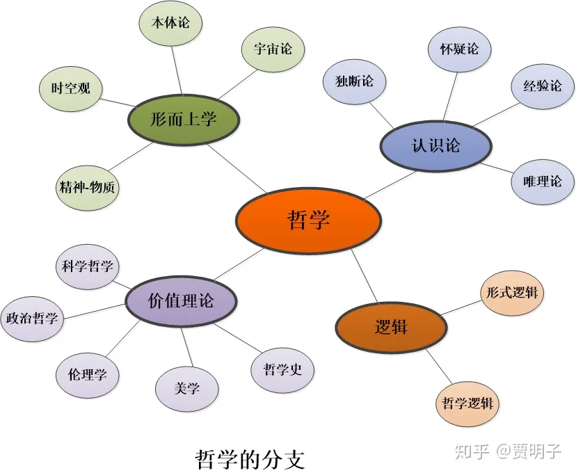
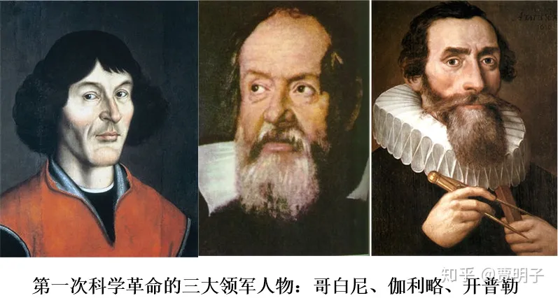
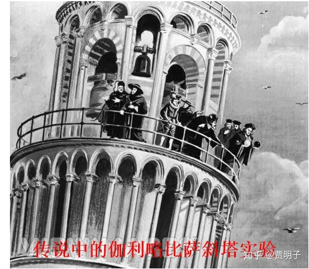
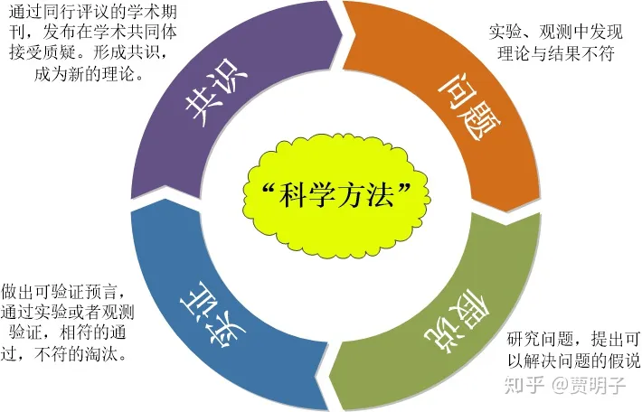

# 5、科学无权威

> **“Irrefutability is not a virtue of a theory but a vice.”**
> **“不可辩驳绝非理论之善，而是理论之恶”**
> **- 卡尔.波普尔**

哲学，英文为Philosophy，按照词源讲，包含了“对智慧之爱”的意思。顾名思义，哲学包含了人们对自然、社会、艺术、知识、以及自身的认识。在人类的古代历史中，它几乎囊括了人们的所有智慧。在前面几章我们对形而上学和认识论的几个核心问题进行了讨论，前者包含了我们对“存在”的认识，后者包含了我们对“认识”的认识。此外，哲学还包含着人们对于和对于社会、道德、美学等的认知，有时候人们把这些区别于形而上学和认识论，归结为“价值理论”（我的讨论中无意涉及价值理论这个部分）。

相应地，哲学还包括建立这些智慧的**哲学方法（philosophical methodology）**。 哲学方法当然不是指一种特定的思维方法，而是哲学家们常用的一大类思维方法的综合，它丰富多彩，分支很多，并无一定之规。维基百科里面把它大概分为三类：系统性的怀疑方法、逻辑论证、以及辩证。但是，从16世纪开始，一类新的智慧从哲学中诞生并且独立出来，它建立并一直遵循着一套起源于哲学、但是与哲学传统有着鲜明不同的方法。这就是**自然科学**，而自然科学的方法则被称为**科学方法（scientific method）**。

**一、自然科学的诞生**

在我们最开始的序言里面，我们曾经把**“实证”**当做自然科学的第一原则提出来。这是自然科学的最基本特征，实证也就成为科学方法的核心。自然科学作为一个独立的学科诞生到现在，不过才400多年而已。在人类思想史的几千年中，这只不过是很短的时间[[1\]](https://zhuanlan.zhihu.com/p/42256676#ref_1)。但是科学作为人类最成功的知识体系，在如此之短的时间内已经确立了它的权威地位，这中间实证方法居功至伟。实证要求，一切真理的判断必须通过实验结果或观测结果来判定，现在已经深入人心，然而它的确立却经历了曲折的道路。

早期人们关于自然的认识，主要集中在形而上学（“什么是现实”）和认识论（“如何认识现实”）中，被称作“自然哲学”。在那个时代，人们对自然的观察手段非常有限，一般只能直接通过我们的五感来获取自然的信息。就连最基本的长度和时间的测量手段都很有限。因而，当时大家对自然的认识很大程度上建立在一些看上去不证自明的观念基础之上、然后通过逻辑推理演绎出来的。一个最典型的例子就是欧几里得几何，通过几个非常符合直觉的“公理”，然后即可演绎出整个庞大的几何体系。在其它领域也大抵如此，人们通过不证自明的直觉，然后通过严谨的逻辑推理，来获得“绝对正确”的真理。在这种背景下，人们对知识的追求就是终极的、绝对正确而且不容置疑的真理。因而这就成了一种**“独断”（dogmatism）**[[2\]](https://zhuanlan.zhihu.com/p/42256676#ref_2)的知识体系：不证自明的公理+严谨可靠的逻辑=绝对正确的真理。这种知识体系经过古希腊三贤，在亚里士多德那里达到顶峰。

同时，独断论非常符合信仰体系如宗教的要求。中世纪欧洲基督教兴起并迅速发展，宗教的盲信和排他思想随之盛行，最终权威思想和宗教教义就占据了绝对的支配地位，任何对它们的怀疑都成为大逆不道。

16世纪的欧洲，正是中世纪的末期，饥荒、瘟疫、战争、思想禁锢、文化停滞。然而在一片黑暗之中，光明正在孕育。**文艺复兴**和**宗教改革**悄然兴起，使得思想渐趋多元化。终于，在16~17世纪的欧洲，几件大事发生了，彻底地改变了这个状况，这一系列事件，最终导致了被称为**“第一次科学革命”（scientific revolution）**的发生，并最终成为人类历史上重要的一个时代：**启蒙时代**。

第一件大事，就是人类的观察仪器取得了重大突破。单摆的发现使人们可以精确计时。而几何光学和玻璃制品的发展，最终产生了望远镜和显微镜，因而使人们的视野向着宇宙深处和微观领域大大扩展。前者使人们可以观察远在天边的星辰，后者则使微观的细胞呈现在世人眼前。这使得人类对自然的观察能力一下子爆发了，所积累的观测数据在短短数十年就超过了过去千年的总和。

第二件大事，就是印刷术的成熟，使得学术刊物开始发展，于是出版业兴盛，各种观察结果和实验数据得以交流，持怀疑论的自由思想开始传播，极大地影响了整个社会的思潮，并且推动了当代思想家们对过往权威的反思。

此外，在学术上，笛卡尔推向顶峰的怀疑论和理性主义虽然最终目的也是要寻求确定无疑的真理，但是从方法上颠覆了过去的独断论。而经验主义的兴起，使人们开始思考：直觉、不证自明、严密演绎、权威、上帝等等这些东西是否可靠？一个符合直觉、出自权威的学说，如果和人们的观察经验不符，那么我们该抛弃哪一个？

第一个受到冲击的，就是天文学。随着人们对行星运行的观察，人们发现被基督教所支持的、权威的地心说越来越无能为力，为了解释越来越多的天体运行数据，地心说被不断地打补丁，一个个的“本轮”和“均轮”被添加上去，复杂无比，岌岌可危。第一个捅破窗户纸的，却恰恰来自教会的一个教士 - **哥白尼**。于是**日心说**石破天惊地诞生了：人们只需要抛弃权威的“地球是宇宙中心”这个看法，就立刻获得一个简洁有效的天文理论。日心说可以说是基于观察实证的、对旧权威的第一次颠覆，它揭开了现代科学发端的序幕，但是它的最初的出现却是小心翼翼的。为了避免教会的攻击，哥白尼在一开始只是在一个小圈子里传播他的学说，后来发现直至逝世前一年才试图发表。他在前言中声明，日心说并非天体的真正运行方式，而只是为了方便而认为设计出来的一种叙述手法。1543年5月24日，病危的哥白尼拿到了他新刊行的《天体运行》，用尽全身的力气只能够摸了一下这本新书的封面。两天后，他病逝了，并没有亲眼看到他的学说在几十年后对旧权威的毁灭性打击和对一个伟大革命的指引[[3\]](https://zhuanlan.zhihu.com/p/42256676#ref_3)。

哥白尼时期天文观测还只是起步，观测手段也很初级，积累的数据很少，这时的观测结果并不能彻底确立日心说的地位，甚至说在某些方面还不如旧的地心说。如果说哥白尼只是吹响了科学革命的冲锋号，那么**伽利略**则是这个革命的真正领袖。伽利略发明了现代意义上的天文望远镜，使更加细致的天文观测成为可能。在他以及同时代科学家第谷的坚持不懈的观察下，海量的天体运行数据被积累成卷，而这些数据无一不验证了日心说的正确性。

日心说开始了野蛮生长。第谷的学生**开普勒**接过了接力棒。他对海量数据进行研究整理，发现行星运行轨道不是圆形，而是椭圆形的。最终他在观测数据的基础上总结了著名的开普勒三定律，使得行星运动规律第一次被系统地整理出来。不但如此，开普勒三定律具备了后来万有引力定律的雏形，为后来牛顿的伟大发现铺好了道路，并最终促成了物理学和天文学的大融合。

伽利略的贡献绝不仅限于天文学。说他是近代科学方法的开创者也毫不为过。他从实验观测出发总结了多项运动定律，诸如自由落体定律、惯性定律等等。传说中，为了证明“不同重量的物体同时落地”这个违背了当时主流学说的理论（自由落体定律），他在众人围观下从比萨大斜塔上同时抛下一大一小两个铁球，实验的事实毫不含糊地证明了当时的权威学说的错误。比萨斜塔实验历史上是否真实发生过已经不可考，但是这个传说却正反映了当时实证的方法给人类思想带来的冲击。试想一下，当你亲眼看到两个铁球同时落地，与你心目中的权威学说完全不符时，你是选择相信伽利略在实验过程中施加了巫术，还是相信权威学说本身就是错误的[[4\]](https://zhuanlan.zhihu.com/p/42256676#ref_4)？

应该说，伽利略的研究方法打破了哲学中的纯思辨传统，而开创了以观测事实（实证）为基础的研究方法。另一方面，伽利略坚持用逻辑和数学语言来描述实验结果，这与传统哲学中认为的 - 数学是属于“理念世界”的真理 – 完全不同。在他这里，数学被用来描述我们日常经验的各种现象。这种数学与实证相结合的方法，为后来的物理学奠定了基础。从这个意义上说，后来的牛顿，真的就如他自己所言，是站在了巨人的肩膀上，而这里的巨人当中，最为伟岸的那一个，就是伽利略。

第一次科学革命为牛顿铺垫好了一条康庄大道。伟大的牛顿提出以他名字命名的三定律和万有引力定律，以此宣布**经典力学**的诞生。在我看来，这是这次科学革命的一个伟大成果，然而它还不足以与它的另一个成果相提并论：以实证为基础的研究方法的确立，以及自然科学作为一个独立学科的诞生。在牛顿时代，虽然物理学仍然被称作自然哲学（牛顿的划时代著作就是《自然哲学的数学原理》），但是它已经具备了自然科学的一切特征，并且从传统的哲学中脱胎换骨了。这些特征当中，不同于传统哲学的最为鲜明的有两点：源自经验主义的**实证方法**、以及源自怀疑论的**自我批判**。

**二、实证原则和自然科学的边界**

在自然科学中，实证成为最高原则：一切理论都必须与观测结果相吻合。这就给了一切自然科学理论一个准绳。以实证为准绳，意味着实验和观测是判定一个自然科学理论正确与否的终极标准。那么我们可以进一步说，它同时还意味着，**一个自然科学理论，必须能够被实验观测来检验的（可实证）。**要知道，我们的认识和知识，并不是全部都可以被实证检验的。比如说，我们说这样两个命题：

“旺财是黑白色的”

和

“黑白色是最帅的边牧颜色”

这两个命题，我想我们两个都会同意。但是很显然，第一个是一个可验证的命题，因为我们总是可以观察一下旺财看看他是不是黑白色，但是第二个就不可验证，因为黑白色是可观测的，但是“帅”却是一个主观的、见仁见智的概念。对边牧有人喜欢黄白色的、也有人更喜欢陨石色的，我们没有办法说他们都是错误的。第二个命题可以归结为一种美学命题，它显然就不是一种科学命题。

再例如说，“遵守诚信是道德的”，和“遵守诚信有利于社会稳定”。这两个命题，前者就是不可实证的，因为“道德”本身是一个依赖于主观的概念，我们永远无法通过观察来判定一件事的“道德性”。虽然大多数人同意这个命题，但是仍然，我们无法对它进行实证。如果说，某个社会群体并不这样认为，他们认为说谎是道德的，我们可以批评它，但是却无法通过观察一个实验结果来否定它。但是后面的那个命题却是可实证的，因为我们总是可以观察诚信的社会和不诚信的社会，比较它们的社会稳定性，来证实这个命题是否正确。那么，我们说，前者就不是一个科学命题，它属于伦理学的范畴，但显然自然科学是不会研究它的。

前面的这两个例子，是涉及到人们价值观的，关于“美和丑”、“美德和邪恶”，这些是无法实证的。同样地，宗教问题很多也是无法实证的，例如神是否存在？神是什么？一神还是多神？因为宗教宣扬神是超自然的，因而本身就是不需要实证的。所以绝大多数宗教问题都不是科学问题 – 包括有神论和无神论，都超出了科学的关注范围。而关于自然的看法中，也包含大量无法实证的概念（自然哲学）。例如形而上学中就有很多这样的例子。比如说前面所说的“精神-物质”问题，到底是精神决定物质（唯心主义）？物质决定精神（唯物主义）？还是二者并存（二元论）？我们可以选择相信或不相信，但是我们无法通过观察和实验来加以判断，因而它们也不是科学命题。

请注意，这里的“不是科学命题”绝对没有贬义。这一点，是很多人，甚至很多科学工作者的一个误区：认为“科学的”就是好的，而“不科学的”就是不好的。人类的认识体系中，能通过实证判断的，只是其中的一部分。**大量的无法实证的命题不但存在，而且有非常重要的意义**：像信仰、道德、美学、伦理、以及很多哲学概念（例如康德的“物自体”、老子的“道”、柏拉图的“绝对理念”等等）。真正“不好”的，是那些所谓的“**伪科学**”：它本身并非科学命题，但是却宣称自己是科学的、甚至把自己伪装成科学的。比如说宗教，宗教本身并非“不好”的，世界上的主流国家都会包容人们的宗教信仰自由，因为宗教对社会有着无法替代的正面作用。但是，如果说某种宗教宣称自己是“科学”，但是拿不出直接的实验证据（例如所谓的“奇迹（miracle）”），那么我们就可以把它划为“伪科学”而保持警惕。

这样一来，自然科学就给自己划定了一个边界：**它只研究、并且只能研究那些可实证的理论，**而不会去关心那些不可实证的东西。这个，可以看做是对科学的边界的一种**描述。**但是应该说这不是科学的一种**定义**。因为，这里我说的“可实证性”是一个笼统的说法，而细究起来这却是一个更加复杂的东西。

“实证”其实包含不同的含义，一种含义是说，通过观察可以**证实**（请注意“证实”和“实证”的区别）某个命题的正确性。对于某个特定的、具体的命题，这是可行的。比如说前面我们提到的，我们可以通过观察旺财来证明这样一个命题的正确性：

命题一：“旺财是黑白色的”

而对于那些带有普遍性的命题，这个工作就困难得多。像下面这个命题：

命题二：“世界上现有的狗都是黑白色的”

这就是一个比命题一要普遍得多的命题。要证实命题二，我们就需要把世界上所有的狗全部观察一遍。如果我们再进一步，说：

命题三：

“所有的狗都是黑白色的”

这就是个普遍命题，而这个命题我们永远不可能证实。因为对于一个普遍命题而言，任何与之相符实验和观测结果都只能构成一个**例证**，而这样的一个例证的成立只能是理论成立的**必要条件**，而不可能构成**充分条件**。狗总是会不断地出生，我们的观察永远不可能涵盖所有的狗。我们当然可以通过“我们已经观察的狗都是黑白色”来推广到“所有的狗都是黑白色”，但是正如上一章休谟所指出的，这是一个不完全归纳，逻辑上这样做是不可靠的。也就是说，**通过实验观测来证实这样一个普遍命题是不可能的。**但是，自然科学中所追求的，却都是那些最普遍的命题：所有的A都满足B（例如，“所有有质量的物体都满足万有引力定律”）。而我们永远无法穷举所有的A（我们无法观察所有有质量的物体）。因而，实证就只能提供**不充分证据（Underdetermination），**那么它作为一个最基本原则，是不可能完成证实一个科学理论的任务的。比如我们经常听到大众媒体所说的，某个实验结果或者观测现象证明了某理论是正确的（例如，我们观察到引力波证明了爱因斯坦的广义相对论），这种说法其实是错误的。我们只能说，这个结果提供了理论的一个证据。

**三、可证伪性**

针对这个问题，科学哲学家**波普尔（Popper）**提出了一个划分自然科学命题的标准：**“可证伪性（falsibility）”**。波普尔的看法是，前面的那种不完全归纳，从逻辑上是不可靠的。可靠的东西只能来自演绎。而从演绎出发，我们就别可能用实证这种不充分证据来证明作为普遍命题的定律。但是反过来，用实证作为反例来证明定律的错误，却是逻辑上充分的。

那么，波普尔的标准背后的含义与前面说所的“**实验证实正确的理论**”相反，它说的是“**实验淘汰错误的理论**”。也就是说，对于一个带有普遍性的科学理论而言（所谓的“全称命题”），我们永远不能够通过实证的方法来证明它的正确性，但是，我们很容易通过实证的方法来确定一个理论的错误性：我们只需要证明它的一个特例（“特称命题”）错误就可以了。例如，我们永远无法观察到“所有的狗”，因而我们永远不能肯定“所有的狗都是黑白色”这个命题是正确的。而我们只需要观察到一只黄色的狗，就可以断定“所有的狗都是黑白色的”这个命题是错误的。我们不能证明一个普遍的理论，但是我们却能够把那些错误的理论找出来，抛弃掉。因此，只有那些**逻辑上有可能被证伪**的理论，才能被称为科学理论，也才是科学所关注的理论。

以这个标准来判断，宗教中的绝大多数问题都不是科学问题，例如说**设计论** — 我们这个丝丝入扣的世界只能是“上帝”的设计，否则无法做到如此精巧。对这个说法，无论我们在实验和观测过程中得到了什么不可思议的结果，都可以毫无滞涩地被归因于上帝之手：它把自己置于不败之地，因而也就无法被检验。而科学理论 – 例如牛顿力学 – 则给出了世界的另一种解释，它与设计论不同的是，它能够对一个典型的科学理论都必须能够对可观测的事件作出明确预言，于是我们就可以实际观测这个事件，来判断观测是否与预言相符。如果不相符，那么我们就可以认定这个理论是错误的（证伪）；而如果相符，我们仍然无法认定它是正确的，只能说它通过了一次检验（不可证明）。

同样地，哲学中、尤其是形而上学中的很多问题，也不能算作科学问题。因为它们往往在任何情况下都能自圆其说，因而就不具备可证伪性。

这样一来，**所有的科学理论都必须随时准备承认自己的错误** – 准备着某一天突然发现了一个实验结果与自己不符 - 而永远不能以100%的确定性来断言自己是正确的。这其实是给了自然科学理论一个“有罪推定”：无论你有多少个证据，都不能证明你是正确的，但是一个反例就证明了你的错误。我们知道，这是科学理论对自己提出的一种最严苛的检验标准，能够在这个标准下幸存的理论，可靠性都是很高的。相反地，另一类“无罪推定”的推理，以自圆其说为目标，那就让自己的日子过得非常舒服。比如说，现在我们有某知名院士，在研究了一番所谓“量子佛学”之后，煞有介事地宣称：

> **“科学家千辛万苦爬到山顶时，佛学大师已经在此等候多时了！”**

我深深地鄙视这种曲解科学精神的说法。事实上，佛学大师的说法（我在此毫无贬低佛学的意图）是一种哲学意义的、无法证伪的论断，它们在任何情况下都可以自圆其说。和很多哲学以及宗教问题一样，看似经得起任何可能的检验、却因此逃避了所有的检验。在这种“无罪推定”的逻辑下，登上任何一个山顶、乃至于同时登上所有的山顶都是轻而易举的事情。你可以在科学到达任何山峰以后，用这种放之四海而皆准的说法加以诠释 - 毕竟，不论科学家千辛万苦地登上哪一座山峰，都会发现无数的佛学大师、道家大师、基督教大师、哲学大师早已经在那里等候多时了。但是这有意义吗？的确，我们可以从这些大师的思想中汲取人生感悟、对自然的看法的启发，但是你不能把它们和自然科学相提并论。这不是因为自然科学要高人一等，而是因为自然科学和佛学大师们的思想是完全不同的思想体系，讲的是完全不同的语言。科学家们所做的，是披荆斩棘探索出一条道路，而佛学只是在道路的尽头对这条路进行马后炮式的阐释。不可否认的是，在有些时候这些阐释有助于人们加深对这条道路的理解，但是如果让它自己来开辟这条路，却完全超出了它的能力范围。而事实上，即使科学家走的是完全不同的一条道路，甚或一条错误的道路，类似佛学的这类思想也都可以在尽头提出阐释。量子力学的发展佛学并未参与其中，而且也没有能力参与其中。在量子力学获得成功的时候跳出来宣布自己的“先见之明”，真正的佛学大师必然会因为这种生硬的蹭热度行为而羞愧。

当初拿破仑看到拉普拉斯的关于宇宙运动规律的著作之后，问他为何他的宇宙理论中没有上帝，拉普拉斯说：

> **“陛下，我不需要这个假设”**

而后来拿破仑跟拉格朗日说起这件事，拉格朗日笑着说：

> **“这（上帝）其实是一个最方便的假设”**

为何上帝是一个最方便的假设？因为把一切归于上帝，要比你用几百页纸论述一个太阳系的运行简单得多。就像前面所说的量子佛学一样，对微观世界的运动规律，一句“缘起性空”四个字，要比科学论述方便得多，后者经历了人类最杰出的大脑，最高深的数学、最苛刻的实验、最严密的逻辑、和汗牛充栋的学术著述。按照一小撮宗教人士的辨解，你永远不可能找出一个证据证明上帝不存在，那么你凭什么要反对上帝的存在？这就是一种“无罪推定”的思路，它把“不可证伪”当做一个有利的证据[[5\]](https://zhuanlan.zhihu.com/p/42256676#ref_5)。而科学理论却恰恰把不可证伪命题从自己的研究范围中剔除出去了 - 它舍弃了这种最方便的逻辑制高点，换来的，是科学最有价值的精神：**自我批判**。

应该说，这种“有罪推定”的理念其实是有着怀疑论的哲学传承的：一切未经证明的，都是可疑的。而正是这种怀疑，正是科学这种“随时准备承认错误”的态度以及持续不懈地对自身的严苛检验，使得科学具备了强大的进化动力和永远进步的空间。于是科学不断发展，在短短几百年间，科学家们不断否定自己，踏着旧理论的残骸不断向着更高的高度挺近。我们现在看到的物理学，和50年前已经很不同了，和100年前相比则是天翻地覆的变化，而与150年前相比，可以说是完全颠覆了。这种变化得益于各种精密的检验过程，以及对自身的不断修正。

· 50年前，任何形式的大一统理论还都没有出现，量子力学中还没有发现退相干，计算机刚刚诞生，量子信息还没人敢想。

· 100年前，狭义相对论刚刚从经典电动力学中诞生，旧量子论牙牙学语，量子力学尚未建立，广义相对论蹒跚学步，宇宙学还在襁褓，一次科学范式的革命冲锋号刚刚吹响，旧的物理理论体系被颠覆，而新的尚未形成，满目疮痍。

· 150年前，人们认为自然科学已经发现了这个宇宙中的所有奥秘，“晴朗的天空中仅飘着两朵不起眼乌云”。而正是这两朵乌云：以太的检验和黑体辐射，导致了整个经典力学大厦的崩塌。

世界上没有哪一种理论能够有如此飞速的进步了。

**四、对可证伪原则的批判**

应该说，波普尔的“可证伪论”简单明了，直击核心，获得了非常广泛的支持。但是同时，它却流于过于简单粗暴，在很多复杂的场景下并不能作为一个严格的判定标准，因而受到很多批评。

比如说，著名的所谓**“杜恒-奎因问题”（Duhem – Quine Thesis）**。这个问题的核心就是：我们所提出的任何一个预言，是绝不可能仅仅通过一个假说、一个理论来完成的。相反地，任何认知都是建立在一整套的假说（理论体系）基础上的，这些理论之间互相支撑、互相联系、互相渗透、因而是完全不可分割的，它们成为一个理论整体，只有在这个整体的基础之上，再加上很多附加的其它假设我们才能能够做出可验证的预言。这些附加的假设很大程度上起源于这样一个事实：我们的理论是抽象的、数学的，而我们的现实则是具体的、物理的。如何把理论模型应用于实际从而产生一个可检验的预言本身绝非一件可以三言两语就能说明白的事。这中间必然会产生大量的近似、省略、模型化等等过程，这些过程中涉及到的附加假设往往都是隐含的，并且绝非少数。没有这样一组附加假设，任何理论模型都不可能做出哪怕是一丁点的实际可检验预言。我们通过这样的附加假设来应用理论得到一个预言，然后可以通过实证来判断这个预言是否正确。但是，如果而这个预言是错误的，我们该怎么办？这说明**有什么地方**出了问题，但是这绝对不能说明某一个特定的理论是错误的，因为这中间牵扯了太多的附加假设和一整套理论体系。

比如说，我们做个试验来验证万有引力定律，小明同时从CCTV大裤衩上抛下形状相同的一个铁球和一个铅球，而小红在地面观察落地的时间。万有引力定律的理论预言是，虽然它们的重量不同，但是它们却会几乎同时落地。

我们来看，当我们做出“同时落地”的预言时，除了万有引力定律，我们用到了何种前提条件。这些前提包括了来自于其它理论的支持：

1、 俩球受空气阻力相同，且阻力相对于重力较小，对实验影响可以忽略；（流体力学）；

2、 小球落地过程中，天空中没有突然飞过某种类似彗星的天体导致引力的变化；（天文学）；

3、 两个小球化学性质稳定，在空中不会突然因为内部变化而裂开或什么的；（化学）；

4、 两个铁球核稳定，不会突然发生核反应而放出大量辐射；（核物理）；

5、 小球满足牛顿定律，因而质量的影响被抵消；（动力学）；

6、 小球不会突然密度发生变化而膨胀，导致空气阻力变化（固体科学）；

7、 空气总是处于平衡状态，不会突然发生重大涨落导致局部空气动力学变化（热力学）；

8、 ……

此外，我们做出“几乎同时落地”这个预言，还建立在大量的无需一一指明、甚至看似无聊的前提上，这些就构成了一组附加假设：

1、 小明是个中立的实验家，他不会故意先抛出铅球后抛出铁球；

2、 小明没有受到某些邪恶博士的精神控制而有意破坏实验；

3、 小明身体健康，不会因为手的失控导致俩球抛出时速度不同；

4、 小球落地过程中，没有明显的妖风对小球产生不同的干扰；

5、 小球落地过程中，没有撞到飞行物诸如小鸟之类；

6、 小球落地过程中，轨迹没有靠近某种磁性物质导致铁球偏离；

……

我们可以看到，我们做出预言时，我们并非仅仅用到了万有引力定律，而是建筑在一系列理论的前提下，并且我们会用到大量隐含的附加假设。这些前提条件看似琐细，可以有无数多个：我们总是可以在上述列表中一条条增加。那么，如果说小红却发现，铅球明显先落地，铁球后落地，这证伪了万有引力定律吗？显然不能肯定，这么多的前提条件都有可能导致了预言的错误。由于这些ad hoc 的前提可以不停地穷举，就有总是有可能是这些前提有问题而不是我的命题有问题。**从逻辑上，我们不可能因为一个实验结果就断言一个单一命题的错误。因而，波普尔的用严密的演绎逻辑为科学划线的做法就不可能成功。**

我们当然可以精心设计我们的实验，在尽量减少其它干扰的情况下把某些假说“隔离”出来进行单独验证（例如用某个定时抛球机代替小明，去掉小明的主观影响因素，但抛球机同样会带来另外的附加假设），但是这并不总是可能，因为隐含的假设太多，且总可以无休止地向一条条增加。

因而，我们必须要承认，**一个单一的理论或假说，原则上是永远不可能被证伪的。**

事实上，在大多数情况下，当我们看到被证伪的预言时，我们会检查我们的一些非核心的外围支撑理论以及一些附加假设，做出调整，而不是因为这个预言被证伪了就直接宣判核心理论的死刑。我们的理论总是可以通过打补丁来满足新的证据，以保证核心假设的成立。**要知道，这种打补丁的做法在绝大多数时候是一种非常有效的科学行为，并且是在绝大多数情况下非常成功的行为。**只有当我们发现破绽太大，需要打补丁太多的时候，我们才会考虑修正核心假设的可能性。而一旦开始修正核心假设，就意味着我们要抛弃现有的全部理论体系了。

比如说我们在第一部分中提到的海王星被发现的例子。当我们发现天王星的运行轨迹和万有引力定律计算结果有偏差的时候，我们并没有抛弃万有引力定律，相反，我们还是忠于现有的理论，只不过对一个隐含的附加假设（假设天王星周围没有其它未发现天体影响它的运行）做出调整：假设存在着一颗未发现的行星影响了天王星的轨迹。事实上，这种行为大获全胜：海王星被发现了。

“杜恒-奎因问题”说明，一个简单粗暴的“可证伪原则”是难以真正严谨地刻画科学命题的特征的。但是在我看来，它虽然影响了“可证伪性”这个判据的实际有效性，但是并不影响波普尔原则的思想内核 – 在这里我无意详细展开，我们后面还会回来讨论这个问题。

这里我还可以举一个不可证伪的科学命题的例子，比如说，我们的天气预报说：

“今天下午五点钟降雨概率为90%”。

这个命题是可证伪的吗？显然不是的，因为实际中在五点钟不论下雨还是不下雨，都不能证明这个命题的错误。我们知道根据这个预报，**基本上**可以肯定会下雨，我们最好提前准备好雨伞，但是实际上即使是没有下雨，我们也无法抱怨说预报错了，因为它的确说有10%的可能性不会下雨！但是你能说天气预报不是科学的吗？显然不能，因为天气预报是基于人们最先进的卫星观测技术、地质、洋流、气象理论、以及概率统计做出来的预测。它有着坚实的科学基础。波普尔本人对此有着不太令人满意的解释，但是他的观点后来发生了很大的变化。这个涉及到多多少少有些神秘的“概率”这个概念。我们在第一部分曾经提到过概率，但是并未详细展开。而在我们这一部分中，“概率”将是一个贯穿始终的**核心**问题，我们后面会回来对此做详细讨论，这里就先打住不说了。

“可证伪性”是在回答这样一个问题：什么是科学？如何界定科学的边界？这本身并非自然科学的问题，而是一个关于自然科学的哲学问题，也就是所谓的“**科学哲学**”。科学哲学本身就像其他一切哲学命题一样，总是难逃争议。总而言之，对波普尔的“可证伪原则”，很多科学家们难掩喜爱之情，但是它并没有获得一致的认同，在严谨地定义科学的边界这个问题上是失败的。也许我们应该放弃这种寻求一个自然科学的严格界限的努力，转而采取一种定性的描述 – 科学的边界本身就有模糊性。这种描述性的原则与**可证伪原则（“Falsibility”）**不同，而是**可验证性原则（“Testability”）。**两者的区别在于，前者要求实验或观测能够有可能直接**证伪**一个理论，而后者则只要求试验或观测能够与理论预言做出**验证**性比较。

不论如何，能够被实验或观测验证，这基本可以说是一个自然科学的铁律。这样一来，一个直接的结果就是**科学无权威**。就像前面所说的，任何科学理论，包括现在已经确立的、成为主流科学家共识的理论，都在随时准备着承认自己的错误。同样地，无论多么伟大的科学家，也都在随时准备着做同样的事。没有人会因为一个理论是牛顿或爱因斯坦或麦克斯韦提出的就无条件地奉为金科玉律，大家信任这些理论仅仅是因为它们已经经受了无数次验证的洗礼。但是人们一直不满足于此，相反地，人人都在渴望对这些理论做出更加严苛的检验，找到它们的局限之处，因为只有破旧才能立新。权威的作用，在科学中被无限地弱化了，而实证，则成为真正的权威，但是这种权威和一般大众所认为的权威还不同：**它没有立论权，只有否决权**。

**五、科学方法**

鉴于实证在自然科学中如此重要的地位，人们对于**理论的可实证性**以及**实证过程**的要求就非常的严格：

首先，我们的理论预言要做的**自洽**，也就是说，一个理论做出的预言不能自相矛盾，这一点显而易见，逻辑的自洽性无论如何都是必需的。从实证的角度来讲，一个同时作出相反结论的理论是不可能被证伪的。从这个角度上讲，逻辑自洽不必是我们对一个科学理论的独立要求，它可以被看作是可实证性要求的衍生物。或者极端一点讲，我们之所以要求一切理论都必须自洽，源头是因为我们的经验中从来没有经历过互相矛盾的事情 – 这一点在某些经验主义者看来，是逻辑的根本起源。

其次，一个理论不能仅仅对一个现象做出做出马后炮的**解释**，而是要做出具体精准的**预言**，并且在绝大多数情况下必须是**定量**的。因为从可证伪性的角度，对已知现象的解释总是要比对未知现象的预言简单得多，因而“可以解释”与“可以预言”相比就是一个更加宽松的标准，也就更加不可靠。就好像你在算一道数学题的时候，在你预先知道答案时，你把解题过程凑出来，这并不能说明你算对了。但是如果是你自己把答案解出来，那么你的解题过程是正确的可能性就大大增加。同时，预言越详尽具体，可证伪的条件就越严格，因而就越可靠。这一点也很容易理解，比如说，我对你宣称，我知道某一处有海盗的藏宝，我告诉你藏宝的地点在北方，这是一个很笼统的预言，你肯定觉得我在胡说八道。但是如果我告诉你，藏宝的地点就在我们家后院那棵玉兰树下1.28米深，如果你真的在我说的地点发现了海盗藏宝，你会觉得我的理论很靠谱，很可靠。也就是说，越是定量的预测，就具有更高的可验证性。定量，也是自然科学与哲学理论不同的一个显著特征，因而数学与自然科学之间你中有我我中有你。数学似乎天生就是为自然科学设计好的语言，如此丝丝入扣，这让无数科学家感到是个奇迹，赞叹而又迷惑。费曼曾经说过，为何科学必须要用数学语言来描述，这是个迷。我们后面会回来谈论这背后的形而上学含义，但是暂时在现在这个层面上，我只是说，这不过是实证的要求。

还有，理论必须要有**简洁性**和**普遍性**。也就是说，要以更少的假设、更简的理论结构，获得更多的、更精确的预言。“大道至简”在很多科学家和哲学家看来，是一种近乎信仰的原则，我们后面可以再来详细谈论它。在这里，我们可以把它看作是预言精准性一体两面的阐述：以同样复杂的理论得到更精准的预言，其实就是以更简单的理论得到同等精准的预言的另一种说法。因而从这个角度说，理论的简洁性也是其可实证的要求。事实上，我们后续会谈到，从贝叶斯概率出发，如果两个理论得到同等精度的实证，那么更简单的理论其为真的概率更高。

相应地，实证的过程也必须要严谨可靠。现代科学的实验验证已经变得极其复杂，再也不是天平小车或者试管烧瓶之类。整个实验过程的设计、操作过程绝不简单。首先必须要保证实验设计能够与理论预言有**直接的相关性**、排除一切可能的干扰因素、并且不能有逻辑漏洞（loophole）。这一点看似简单，其实在现代科学中并不容易做到。例如著名的贝尔不等式验证实验，几十年以来已经有过先后至少十几个版本了，人们仍然在争论其中有没有loophole的问题。最近的一次就在两年前，一共发动了10万余人参与，史称“**大贝尔实验**”，就是为了关闭所谓的“自由意志漏洞”。但是仍然人们不敢宣称找到了完美的、毫无漏洞的实验。在实验设计之外，操作过程也必须极为小心。这个看似的废话其实也极其重要。就在几年前，欧洲核子中心和意大利Gran Sasso国家实验室联合展开的所谓Opera实验宣布发现了中微子的超光速现象，成为学术界爆炸性新闻，但是随后，人们发现是因为某一条光纤的接线松动了导致数据有误，这场轰轰烈烈的超光速实验变成了一个笑话，这个项目的负责人也宣布引咎辞职。最后，在实验数据的处理和诠释中也要做到客观无偏见，这一点事实上也是很难做到的，因为人们总是对理论有所偏好的，总会在数据处理的过程中无意间带有偏见，而导致失去中立性。

总而言之，“实证检验”这个看似显而易见的过程，实现起来绝非简单。因而，科学界对实验结果慎之又慎，尤其是一些重大理论的实验验证，不但要求结果明确，而且要有可重复性，由独立的第三方重复验证。有时候，只有一个实验结果还不够，要多个实验相互印证。历史上重大的实验无不如此。

于是，围绕着“实证”这一核心，在科学诞生以来的400多年间，科学家们逐渐形成了一整套“标准”的方法，这种方法被一代一代的科学家们践行、完善，取得了巨大的成功。到现在为止，已经成为整个科学界这个小社会（又被称作**“科学共同体”，scientific community**）中人人遵守、约定俗成的规范。如果你不懂得并且践行这一套规范，你甚至无法成为被科学同行所接受的一个学者。这种规范，就是我们常说的**“科学方法”。**它包括了**发现问题、提出假说、实验验证、同行评议**并最终达成共识形成新的科学理论。而新的科学理论在后续的应用在仍然可能会继续发现与实验和观测不符的情况，于是人们不断重复这个过程，科学于是就在这种循环中达成了不断的进化。

接下来，我们来看看“实证”背后更加深层的含义，以及自然科学除了实证之外，还有什么其它鲜明个性。

下一章：[贾明子：6、自然科学的实在和实证](https://zhuanlan.zhihu.com/p/43371148)

上一章：[贾明子：4、我们如何认识世界：理性还是经验？](https://zhuanlan.zhihu.com/p/42119989)

专栏传送门：[何为现实？拉普拉斯之妖与薛定谔猫之决战](https://zhuanlan.zhihu.com/c_186387023)

本文同步更新于微信公众号“魔鬼眼中看世界”，欢迎扫码关注

------

## 参考

1. [^](https://zhuanlan.zhihu.com/p/42256676#ref_1_0)事实上，直到今天，绝大多数自然科学和工程学科的博士学位，不论是物理化学数学生物，还是机械建筑化工计算机等等，仍然被称作“哲学博士”（Doctor of Philosophy， 或者PH.D）。
2. [^](https://zhuanlan.zhihu.com/p/42256676#ref_2_0)此处“独断”并无贬义，而是指哲学含义中的，一个思想体系、信仰体系或宗教体系中权威性的、绝对正确、不容置疑的核心思想基础。
3. [^](https://zhuanlan.zhihu.com/p/42256676#ref_3_0)关于哥白尼临死前的故事，是一个现在已不可考的传说。
4. [^](https://zhuanlan.zhihu.com/p/42256676#ref_4_0)不幸的是，当时围观的吃瓜群众中，绝大多数人愿意选择相信这是巫术。在实证成为最权威的判定方法的今天，这是多么不可想象啊。
5. [^](https://zhuanlan.zhihu.com/p/42256676#ref_5_0)罗素曾经用一个比喻来嘲讽这种不可证伪的问题，叫做“罗素茶壶”。他说，在火星和地球之间，存在着一只茶壶，围绕着太阳旋转。因为茶壶如此之小，没有任何天文望远镜能够看到它，所以你们没有任何办法证明我说的是错误的，那么你们都不能够质疑这只茶壶的存在！

编辑于 2020-07-23 09:43

